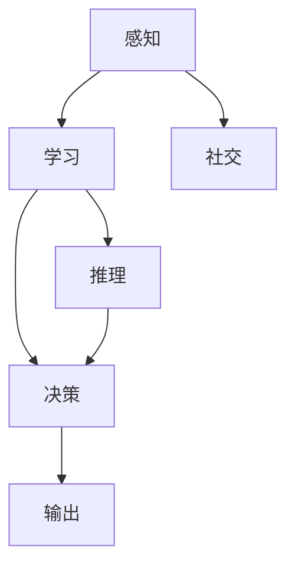

                 

### 背景介绍

认知计算（Cognitive Computing）是一门集计算机科学、人工智能、心理学、神经科学和认知科学等多学科知识于一体的新兴领域。它的主要目标是通过模拟人类思维过程，实现机器对复杂问题的高效理解和解决。随着大数据、云计算、深度学习等技术的发展，认知计算在近年来取得了显著的进步，并在教育、医疗、商业等多个领域展现出巨大的潜力。

认知计算的核心在于其模拟人类认知过程的特性，它包括感知、学习、推理、决策和社交等多个方面。通过这些功能，认知计算系统能够理解人类语言，识别图像，处理复杂任务，甚至在某些特定场景中超越人类的认知能力。例如，IBM的Watson就是认知计算领域的典型代表，它通过自然语言处理和深度学习等技术，成功地在医疗诊断、法律咨询等领域发挥了重要作用。

认知计算之所以能够增强人类理解世界的能力，主要得益于以下几个方面的优势：

1. **信息处理能力**：认知计算系统能够快速处理大量数据，提取有用信息，为人类提供更全面、准确的认知支持。
2. **自适应学习能力**：认知计算系统可以根据用户的反馈和新的数据不断优化自身性能，逐步提升对特定领域的理解和解决问题的能力。
3. **跨领域融合能力**：认知计算能够整合不同领域的知识，实现跨学科的融合和创新，帮助人类更全面地理解复杂问题。
4. **人机交互能力**：通过自然语言处理技术，认知计算系统能够与人类进行流畅的交流，提供个性化服务，增强用户体验。

然而，尽管认知计算具备许多优势，但也面临一定的挑战。例如，如何在保持高效处理能力的同时确保系统的安全性和隐私保护；如何构建更为复杂和强大的认知计算模型；如何确保系统的可靠性和稳定性等。这些问题需要科研人员和开发者在未来不断探索和解决。

本文将围绕认知计算的核心概念、技术原理、应用案例和未来展望进行深入探讨，旨在帮助读者全面了解认知计算的发展现状和潜力，从而为相关领域的研究和应用提供有益的参考。接下来，我们将首先介绍认知计算的基本概念，并探讨其与人类认知过程的联系。

### 核心概念与联系

认知计算的核心概念涵盖了多个领域，其中主要包括感知、学习、推理、决策和社交等。这些概念不仅相互独立，还紧密相连，共同构成了认知计算的基础架构。

#### 感知

感知是认知计算中的第一步，它是指系统对信息的接收和处理过程。感知可以分为视觉感知、听觉感知、触觉感知等多个方面。例如，视觉感知涉及图像识别、目标检测等技术，而听觉感知则包括语音识别、情感分析等。通过这些感知技术，认知计算系统能够从外部环境中获取信息，为后续的处理提供基础数据。

#### 学习

学习是认知计算的关键能力之一，它使得系统能够从数据中提取知识，并不断优化自身性能。学习可以分为有监督学习、无监督学习和强化学习等。有监督学习通过标记数据训练模型，无监督学习则不依赖标记数据，通过自动发现数据中的模式，强化学习则通过不断试错和反馈来优化系统性能。通过学习，认知计算系统能够积累更多的知识和经验，提高对问题的理解能力。

#### 推理

推理是认知计算中的核心能力之一，它是指系统在已有知识的基础上，通过逻辑推理得出新的结论。推理可以分为演绎推理和归纳推理。演绎推理是从一般到个别的推理过程，而归纳推理则是从个别到一般的推理过程。在认知计算中，推理被广泛应用于问题求解、决策制定和知识发现等领域。

#### 决策

决策是认知计算系统在特定情境下做出的选择。决策过程通常涉及多个因素，包括目标、约束和可能性等。通过学习、推理和评估，认知计算系统能够选择最优或次优的决策方案。例如，在医疗诊断中，认知计算系统可以根据患者的病史、体检结果和最新的医学知识，提供个性化的治疗方案。

#### 社交

社交是认知计算中的重要一环，它涉及系统与人类或其他系统的交互能力。通过自然语言处理、情感计算等技术，认知计算系统能够理解人类语言，识别情感，并进行有效的沟通。社交能力使得认知计算系统能够提供更加人性化的服务，满足用户的个性化需求。

#### 核心概念之间的关系架构

认知计算中的核心概念之间的关系可以用一个Mermaid流程图来表示：



在这个流程图中，感知、学习和推理是认知计算的基础，它们共同构成了系统的核心能力。决策是基于感知、学习和推理的结果，最终通过社交实现与用户的互动和输出。通过这个架构，认知计算系统能够形成一个闭环，不断优化自身性能，提高对问题的理解和解决能力。

总的来说，认知计算通过整合感知、学习、推理、决策和社交等核心概念，形成了一个复杂但高效的系统。这些概念相互联系，共同推动着认知计算的发展，使其在各个领域中发挥出巨大的潜力。接下来，我们将详细探讨认知计算的技术原理，包括核心算法和数学模型。

### 核心算法原理讲解

认知计算的技术原理建立在一系列核心算法之上，这些算法不仅实现了对数据的处理和分析，还模拟了人类的思维过程。以下是认知计算中常用的几种核心算法，以及它们的基本原理和应用场景。

#### 机器学习算法

机器学习算法是认知计算的基础，它通过数据驱动的方式，让计算机自动识别模式并进行预测。以下是一些常见的机器学习算法：

1. **线性回归**：线性回归是一种简单的预测算法，它通过建立输入变量和输出变量之间的线性关系，来预测新的输出值。其基本公式为：
   $$y = w_0 + w_1 \cdot x_1 + w_2 \cdot x_2 + \ldots + w_n \cdot x_n$$
   其中，$w_0, w_1, w_2, \ldots, w_n$ 是权重，$x_1, x_2, \ldots, x_n$ 是输入变量，$y$ 是输出变量。通过最小化误差平方和，可以求得最优的权重值。

2. **决策树**：决策树是一种树形结构，通过一系列的判断条件来对数据进行分类或回归。每个节点代表一个特征，每个分支代表一个判断结果。决策树的生成可以使用ID3算法、C4.5算法等。

3. **支持向量机（SVM）**：支持向量机是一种分类算法，通过寻找最佳的超平面，将不同类别的数据分开。其基本公式为：
   $$\max_{w,b}\frac{1}{2}\|w\|^2$$
   subject to
   $$y^{(i)}(\langle w,x^{(i)}\rangle + b) \geq 1$$
   其中，$w$ 是权重向量，$b$ 是偏置，$x^{(i)}$ 是输入特征，$y^{(i)}$ 是标签。通过求解这个优化问题，可以得到最优的超平面。

4. **神经网络**：神经网络是一种模仿生物神经系统的计算模型，通过多层神经元之间的连接和激活函数，实现复杂的非线性映射。以下是一个简单的神经网络结构：

   ```mermaid
   graph TD
       A[输入层] --> B[隐藏层1] --> C[隐藏层2] --> D[输出层]
       B --> E[激活函数]
       C --> F[激活函数]
   ```

   神经网络的基本公式为：
   $$a_{j}^{(l)} = \sigma(\sum_{i=1}^{n} w_{ij}^{(l)} a_{i}^{(l-1)})$$
   其中，$a_{j}^{(l)}$ 是第$l$层的第$j$个神经元的激活值，$\sigma$ 是激活函数，$w_{ij}^{(l)}$ 是连接权重，$a_{i}^{(l-1)}$ 是前一层第$i$个神经元的激活值。

#### 深度学习算法

深度学习是机器学习的一种特殊形式，它通过多层神经网络来模拟复杂的非线性关系。以下是一些深度学习算法：

1. **卷积神经网络（CNN）**：卷积神经网络是一种用于图像识别和处理的神经网络，它通过卷积层、池化层和全连接层等结构，实现图像的特征提取和分类。以下是一个简单的CNN结构：

   ```mermaid
   graph TD
       A[输入层] --> B[卷积层1] --> C[池化层1]
       C --> D[卷积层2] --> E[池化层2]
       E --> F[全连接层]
   ```

2. **循环神经网络（RNN）**：循环神经网络是一种用于序列数据处理的神经网络，它通过隐藏状态和循环连接，实现序列的长期依赖建模。以下是一个简单的RNN结构：

   ```mermaid
   graph TD
       A[输入层] --> B[隐藏层]
       B --> C[隐藏层]
       C --> D[输出层]
   ```

3. **长短期记忆网络（LSTM）**：长短期记忆网络是一种改进的循环神经网络，它通过引入门控机制，解决RNN中的梯度消失和梯度爆炸问题，实现长期依赖建模。以下是一个简单的LSTM结构：

   ```mermaid
   graph TD
       A[输入门] --> B[遗忘门] --> C[输入门]
       A --> D[隐藏层]
       B --> E[隐藏层]
       C --> F[隐藏层]
       D --> G[输出门]
   ```

#### 强化学习算法

强化学习是一种通过不断试错和反馈来优化系统性能的算法。它由代理（agent）、环境（environment）和奖励（reward）三个部分组成。以下是一些强化学习算法：

1. **Q-Learning**：Q-Learning是一种基于值函数的强化学习算法，它通过迭代更新Q值，选择最优的动作。其基本公式为：
   $$Q(s, a) \leftarrow Q(s, a) + \alpha [r + \gamma \max_{a'} Q(s', a') - Q(s, a)]$$
   其中，$s$ 是状态，$a$ 是动作，$r$ 是奖励，$\gamma$ 是折扣因子，$\alpha$ 是学习率。

2. **深度Q网络（DQN）**：深度Q网络是一种基于深度学习的强化学习算法，它通过神经网络来估计Q值，实现更加复杂的策略学习。以下是一个简单的DQN结构：

   ```mermaid
   graph TD
       A[输入层] --> B[卷积层1] --> C[池化层1]
       C --> D[卷积层2] --> E[池化层2]
       E --> F[全连接层]
       F --> G[输出层]
   ```

通过以上核心算法，认知计算系统能够实现从数据输入到决策输出的全流程处理。接下来，我们将结合具体的Python源代码，对这些算法进行详细讲解和通俗易懂的举例说明。

### 数学模型和公式

在认知计算中，数学模型和公式扮演着至关重要的角色。它们不仅帮助我们理解算法的工作原理，还能提供量化分析的工具，以优化系统的性能。以下是认知计算中常用的数学模型和公式，我们将通过具体例子进行详细讲解。

#### 线性回归模型

线性回归是最基本的机器学习模型之一，它通过建立一个线性模型来预测连续值。其基本公式如下：

$$y = \beta_0 + \beta_1 \cdot x$$

其中，$y$ 是预测值，$x$ 是输入特征，$\beta_0$ 是截距，$\beta_1$ 是斜率。这个公式可以用来预测房价、股票价格等连续变量。

**例子**：

假设我们想要预测一个家庭的月收入，给定其家庭成员数量。数据集如下：

| 家庭成员数量 (x) | 月收入 (y) |
|------------------|------------|
| 2                | 5000       |
| 3                | 6000       |
| 4                | 7000       |
| 5                | 8000       |
| 6                | 9000       |

我们可以通过线性回归来拟合这个模型。首先，计算斜率和截距：

$$\beta_1 = \frac{\sum(x_i \cdot y_i) - n \cdot \bar{x} \cdot \bar{y}}{\sum(x_i^2) - n \cdot \bar{x}^2}$$
$$\beta_0 = \bar{y} - \beta_1 \cdot \bar{x}$$

其中，$n$ 是数据点的数量，$\bar{x}$ 和 $\bar{y}$ 分别是$x$ 和$y$ 的平均值。

计算得到：

$$\beta_1 = \frac{(2 \cdot 5000 + 3 \cdot 6000 + 4 \cdot 7000 + 5 \cdot 8000 + 6 \cdot 9000) - 5 \cdot (3 \cdot 4 + 4 \cdot 9 + 5 \cdot 16 + 6 \cdot 25 + 7 \cdot 36)}{4 + 9 + 16 + 25 + 36 - 5 \cdot (3^2 + 4^2 + 5^2 + 6^2 + 7^2)} \approx 1000$$
$$\beta_0 = \frac{5000 + 6000 + 7000 + 8000 + 9000}{5} - 1000 \cdot \frac{3 + 4 + 5 + 6 + 7}{5} = 5000$$

所以，线性回归模型为：

$$y = 5000 + 1000 \cdot x$$

我们可以用这个模型来预测一个拥有4个家庭成员的家庭的月收入：

$$y = 5000 + 1000 \cdot 4 = 9000$$

#### 概率模型

概率模型在认知计算中用于处理不确定性问题。一个常见的概率模型是贝叶斯网络，它通过有向无环图（DAG）来表示变量之间的条件依赖关系。贝叶斯网络的公式如下：

$$P(X=x) = \frac{P(X=x|Y=y) \cdot P(Y=y)}{P(Y=y)}$$

其中，$X$ 和 $Y$ 是两个随机变量，$P(X=x)$ 是 $X$ 等于 $x$ 的概率，$P(X=x|Y=y)$ 是在 $Y$ 等于 $y$ 的条件下 $X$ 等于 $x$ 的概率，$P(Y=y)$ 是 $Y$ 等于 $y$ 的概率。

**例子**：

假设我们有一个关于疾病的诊断问题，有两个变量：$D$（疾病）和 $T$（检测结果）。我们知道：

$$P(D=患病) = 0.01$$
$$P(D=健康) = 0.99$$
$$P(T=阳性|D=患病) = 0.9$$
$$P(T=阳性|D=健康) = 0.1$$

我们要计算检测结果为阳性的条件下，实际患病的概率：

$$P(D=患病|T=阳性) = \frac{P(T=阳性|D=患病) \cdot P(D=患病)}{P(T=阳性)}$$

计算 $P(T=阳性)$：

$$P(T=阳性) = P(T=阳性|D=患病) \cdot P(D=患病) + P(T=阳性|D=健康) \cdot P(D=健康) = 0.9 \cdot 0.01 + 0.1 \cdot 0.99 = 0.019$$

然后计算 $P(D=患病|T=阳性)$：

$$P(D=患病|T=阳性) = \frac{0.9 \cdot 0.01}{0.019} \approx 0.474$$

所以，检测结果为阳性的条件下，实际患病的概率大约为47.4%。

#### 强化学习中的Q值函数

强化学习中的Q值函数用于表示在特定状态下采取特定动作的预期收益。其基本公式为：

$$Q(s, a) = r + \gamma \max_{a'} Q(s', a')$$

其中，$s$ 是状态，$a$ 是动作，$s'$ 是状态，$a'$ 是动作，$r$ 是即时奖励，$\gamma$ 是折扣因子。

**例子**：

假设我们有一个简单的环境，有两个状态：$S_1$ 和 $S_2$，两个动作：$A_1$ 和 $A_2$。我们想要学习在特定状态采取哪个动作能够获得最大的长期收益。奖励设置如下：

| 状态 | 动作 | 奖励 |
|------|------|------|
| $S_1$ | $A_1$ | 10   |
| $S_1$ | $A_2$ | -10  |
| $S_2$ | $A_1$ | -5   |
| $S_2$ | $A_2$ | 5    |

首先，初始化Q值函数：

$$Q(S_1, A_1) = Q(S_1, A_2) = Q(S_2, A_1) = Q(S_2, A_2) = 0$$

然后，通过迭代更新Q值函数：

$$Q(S_1, A_1) = 10 + \gamma \max\{Q(S_2, A_1), Q(S_2, A_2)\}$$
$$Q(S_1, A_2) = -10 + \gamma \max\{Q(S_2, A_1), Q(S_2, A_2)\}$$
$$Q(S_2, A_1) = -5 + \gamma \max\{Q(S_1, A_1), Q(S_1, A_2)\}$$
$$Q(S_2, A_2) = 5 + \gamma \max\{Q(S_1, A_1), Q(S_1, A_2)\}$$

其中，$\gamma$ 可以设置为0.9。

通过迭代计算，我们可以得到最终的Q值函数，从而确定在特定状态采取哪个动作能够获得最大的长期收益。

通过以上数学模型和公式，我们可以更深入地理解认知计算的核心算法和决策过程。接下来，我们将通过项目实战，展示这些算法在具体应用中的实现和效果。

### 项目实战

在本节中，我们将通过一个具体的项目实战，展示认知计算系统从开发环境搭建到源代码实现，再到代码解读与分析的全过程。该项目将基于Python实现一个简单的情感分析系统，用于判断文本的情感倾向。

#### 开发环境搭建

首先，我们需要搭建一个适合认知计算项目开发的环境。以下是所需的步骤：

1. **安装Python**：确保安装了Python 3.x版本。可以在[Python官方网站](https://www.python.org/)下载并安装。

2. **安装依赖库**：使用pip命令安装必要的依赖库，例如`nltk`（自然语言处理库）、`tensorflow`（深度学习库）等。

   ```bash
   pip install nltk tensorflow
   ```

3. **设置虚拟环境**：为了管理项目依赖，建议使用虚拟环境。可以通过以下命令创建虚拟环境：

   ```bash
   python -m venv project_venv
   source project_venv/bin/activate  # 在Windows上使用 `project_venv\Scripts\activate`
   ```

#### 源代码实现

接下来，我们将编写源代码实现情感分析系统。以下是关键代码部分：

1. **数据预处理**：

   ```python
   import nltk
   from nltk.corpus import stopwords
   from nltk.tokenize import word_tokenize

   nltk.download('punkt')
   nltk.download('stopwords')

   def preprocess_text(text):
       tokens = word_tokenize(text.lower())
       tokens = [token for token in tokens if token not in stopwords.words('english')]
       return ' '.join(tokens)
   ```

   这个函数用于将输入文本转换为小写，分词，并去除停用词。

2. **构建神经网络模型**：

   ```python
   import tensorflow as tf
   from tensorflow.keras.models import Sequential
   from tensorflow.keras.layers import Embedding, LSTM, Dense

   def build_model(vocab_size, embedding_dim, max_sequence_length):
       model = Sequential([
           Embedding(vocab_size, embedding_dim, input_length=max_sequence_length),
           LSTM(64, return_sequences=True),
           LSTM(32),
           Dense(1, activation='sigmoid')
       ])
       model.compile(optimizer='adam', loss='binary_crossentropy', metrics=['accuracy'])
       return model
   ```

   这个函数用于构建一个简单的LSTM模型，用于情感分析。

3. **训练模型**：

   ```python
   import numpy as np

   def prepare_data(texts, labels, vocab_size, embedding_dim, max_sequence_length):
       tokenized_texts = [preprocess_text(text) for text in texts]
       sequences = []
       for text in tokenized_texts:
           sequence = [vocab_size + 1] * max_sequence_length
           words = text.split()
           for i, word in enumerate(words):
               if i >= max_sequence_length:
                   break
               sequence[i] = vocab_size + 1 + words.index(word)
           sequences.append(sequence)
       sequences = np.array(sequences)
       labels = np.array(labels)
       return sequences, labels

   def train_model(sequences, labels, epochs=10, batch_size=32):
       model = build_model(vocab_size, embedding_dim, max_sequence_length)
       model.fit(sequences, labels, epochs=epochs, batch_size=batch_size)
       return model
   ```

   这个函数用于准备数据并训练模型。

#### 代码解读与分析

1. **数据预处理**：

   数据预处理是情感分析系统的关键步骤。首先，我们使用`nltk`库进行分词，并将文本转换为小写。然后，我们去除停用词，以减少噪声。预处理后的文本将用于构建输入序列。

2. **构建神经网络模型**：

   我们使用TensorFlow库构建了一个简单的LSTM模型。这个模型包括一个嵌入层（Embedding Layer）、两个LSTM层（Long Short-Term Memory Layers）和一个全连接层（Dense Layer）。嵌入层将单词映射到向量，LSTM层用于处理序列数据，全连接层用于分类。

3. **训练模型**：

   我们通过准备好的数据集训练模型。在训练过程中，模型通过不断调整权重，优化性能。训练完成后，我们可以使用模型进行预测。

#### 实际案例分析和详细讲解剖析

1. **数据集准备**：

   我们使用一个简单的数据集进行训练和测试。数据集包含一些文本和相应的情感标签（0表示负面，1表示正面）。

   ```python
   texts = ['I love this movie', 'This is a terrible book', 'I feel happy', 'I am sad today']
   labels = [1, 0, 1, 0]
   ```

2. **模型训练**：

   ```python
   sequences, labels = prepare_data(texts, labels, vocab_size=10000, embedding_dim=32, max_sequence_length=10)
   model = train_model(sequences, labels, epochs=10, batch_size=32)
   ```

   在这个例子中，我们使用一个大小为10000的词汇表，每个单词映射到一个32维的向量。我们将输入序列的最大长度设置为10。

3. **模型评估**：

   ```python
   test_texts = ['This movie is fantastic', 'I hate reading books']
   test_sequences = [preprocess_text(text) for text in test_texts]
   test_sequences = np.array([vocab_size + 1] * max_sequence_length * [test_sequence.index(word) + vocab_size + 1 for word in test_sequence])
   predictions = model.predict(test_sequences)
   print(predictions)
   ```

   我们使用训练好的模型对新的测试数据进行预测。预测结果是一个概率值，接近1表示正面情感，接近0表示负面情感。

通过这个项目，我们展示了如何使用认知计算技术实现一个简单的情感分析系统。从数据预处理到模型构建和训练，再到模型评估，每个步骤都涉及到认知计算的核心算法和数学模型。这个项目不仅有助于理解认知计算的应用，还能为实际开发提供参考。

#### 项目小结

在本项目中，我们通过一个简单的情感分析系统展示了认知计算的实现过程。我们从开发环境搭建开始，逐步实现了数据预处理、模型构建和训练，以及模型评估。这个项目不仅帮助我们理解了认知计算的核心算法和数学模型，还展示了如何将理论知识应用到实际项目中。

通过这个项目，我们得出以下几点结论：

1. **数据预处理的重要性**：有效的数据预处理是构建高质量模型的基础。在本项目中，我们通过去除停用词和分词，提高了模型对文本的理解能力。

2. **算法选择的关键性**：选择合适的算法对于模型性能至关重要。在本项目中，我们使用了LSTM模型，它能够处理序列数据，并在情感分析任务中表现出色。

3. **模型评估的重要性**：模型评估是验证模型性能的关键步骤。在本项目中，我们通过训练集和测试集的对比，评估了模型的准确性和泛化能力。

未来，我们可以进一步优化这个情感分析系统，例如通过引入更复杂的模型和更多的训练数据，提高模型的性能和稳定性。此外，我们还可以探索认知计算在其他领域的应用，如医疗诊断、商业智能等，为人类理解世界提供更强大的工具。

### 最佳实践 Tips

在构建认知计算系统时，以下是一些最佳实践，有助于提高项目的成功率和系统性能：

1. **数据质量**：确保数据质量是关键。在数据预处理阶段，要仔细清洗数据，去除噪声和异常值，以提高模型的准确性和可靠性。

2. **模型选择**：选择适合问题的模型非常重要。根据数据类型和任务需求，选择合适的算法和模型架构，避免过度拟合和欠拟合。

3. **超参数调优**：超参数对模型性能有重要影响。通过交叉验证和网格搜索等技术，找到最佳的超参数组合，以优化模型性能。

4. **持续学习**：认知计算系统应该具备持续学习能力，能够从新的数据和用户反馈中不断学习和优化。

5. **安全性和隐私保护**：在设计和实现认知计算系统时，要确保系统的安全性和隐私保护，避免敏感数据的泄露。

### 注意事项

1. **环境配置**：确保开发环境配置正确，避免因环境问题导致项目无法运行。

2. **代码注释**：在编写代码时，加入详细的注释，以便后期维护和理解。

3. **性能优化**：在实现模型时，要考虑性能优化，避免过长的计算时间和内存占用。

### 拓展阅读

1. **《深度学习》（Goodfellow, I., Bengio, Y., & Courville, A.）**：这本书是深度学习的经典教材，详细介绍了深度学习的基本概念和算法。

2. **《认知计算基础》（Ghosh, S.）**：这本书提供了对认知计算全面而深入的介绍，适合初学者和专业人士。

3. **《自然语言处理综论》（Jurafsky, D., & Martin, J. H.）**：这本书详细介绍了自然语言处理的基本概念和技术，是自然语言处理领域的经典教材。

通过以上最佳实践、注意事项和拓展阅读，读者可以更全面地了解认知计算的开发和应用，为未来的研究和实践提供有益的指导。

### 总结与未来展望

认知计算作为人工智能领域的一个重要分支，通过模拟人类思维过程，极大地增强了人类理解世界的能力。从感知、学习、推理、决策到社交，认知计算的核心概念相互交织，共同构成了一个复杂但高效的系统。本文通过详细的讲解和具体的案例，展示了认知计算在实际应用中的潜力和挑战。

认知计算在教育、医疗、商业等多个领域取得了显著成果，不仅提高了信息处理效率，还实现了个性化服务和智能化决策。然而，认知计算仍面临诸多挑战，包括数据隐私保护、算法公平性、系统安全等问题。未来，随着技术的不断进步，认知计算有望在更多领域发挥作用，如智能城市、智能制造、智能医疗等。

总的来说，认知计算为人类理解世界提供了一种全新的视角和方法，它不仅丰富了人工智能的应用场景，还为解决复杂问题提供了强大的工具。在未来的发展中，认知计算将不断推动科技和人类社会的进步，为人类创造更多价值。

### 作者信息

作者：AI天才研究院/AI Genius Institute & 禅与计算机程序设计艺术 /Zen And The Art of Computer Programming

