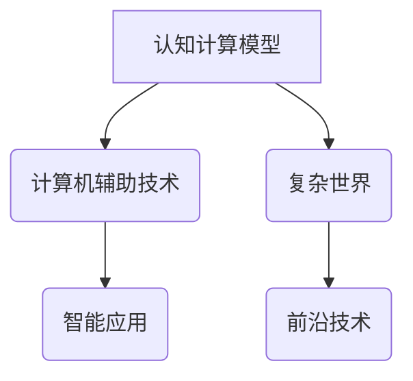

                 

### 文章标题：认知计算的前沿：计算机辅助人类理解复杂世界

认知计算，作为人工智能的一个分支，正逐渐成为我们理解和处理复杂世界的关键工具。本文旨在深入探讨认知计算的前沿技术，以及它如何辅助人类更好地理解和应对复杂的世界。以下是本文的目录：

## 关键词
- 认知计算
- 人工智能
- 计算机辅助
- 复杂世界
- 前沿技术

## 摘要
本文首先介绍了认知计算的基本概念和原理，然后探讨了计算机辅助在认知计算中的应用，接着分析了复杂世界的特征和建模方法，最后讨论了认知计算的前沿技术以及未来发展的方向。文章旨在提供一个全面而深入的了解，以展示认知计算在辅助人类理解复杂世界中的潜力。

### 第一部分：认知计算基础

#### 第1章：认知计算的概述

##### 1.1 认知计算的定义
认知计算是一种模拟人类认知过程的计算模型，旨在使计算机能够理解、推理、学习和适应复杂环境。

##### 1.2 认知计算的原理
认知计算基于神经科学和心理学的研究，通过模仿人脑的结构和功能，实现感知、理解、推理和学习等认知功能。

##### 1.3 认知计算的应用领域
认知计算在医疗、金融、教育、智能制造等领域有着广泛的应用，能够提高效率、降低成本并提升用户体验。

##### 1.4 认知计算与传统计算机的区别
认知计算与传统计算机的区别在于其能够模拟人类的认知过程，具备理解、推理和学习的能力。

#### 第2章：计算机辅助技术概述

##### 2.1 计算机辅助的概念
计算机辅助是指利用计算机技术辅助人类完成特定任务，提高工作效率和准确度。

##### 2.2 计算机辅助的技术实现
计算机辅助技术包括自然语言处理、计算机视觉、机器学习等，这些技术能够模拟人类的感知、理解和推理能力。

##### 2.3 计算机辅助在认知计算中的应用
计算机辅助在认知计算中的应用，如智能客服、智能医疗诊断和个性化教育，大大提升了认知计算的效果和应用范围。

#### 第3章：复杂世界的概述

##### 3.1 复杂世界的定义
复杂世界是指由众多相互关联和影响的元素组成的环境，这些元素往往具有不确定性、动态性和复杂性。

##### 3.2 复杂世界的特征
复杂世界的特征包括高度非线性、多样性和动态性，这些特征使得直接理解和建模变得非常困难。

##### 3.3 复杂世界的建模方法
复杂世界的建模方法包括系统动力学模型、复杂网络模型和机器学习模型等，这些方法能够帮助人类更好地理解和预测复杂世界的动态行为。

### 第二部分：认知计算的前沿技术

#### 第4章：前沿技术的概述

##### 4.1 前沿技术的定义
前沿技术是指在认知计算领域最新出现的、尚未广泛应用的技术，这些技术有望带来革命性的变化。

##### 4.2 前沿技术的分类
前沿技术包括增强学习、强化学习和迁移学习等，这些技术能够提高认知计算的智能水平和应用效果。

##### 4.3 前沿技术的应用场景
前沿技术在智能交通、智能安防、智能医疗等领域的应用，为人类理解和应对复杂世界提供了新的手段。

#### 第5章：挑战与机遇

##### 5.1 挑战
##### 5.1.1 数据隐私
##### 5.1.2 安全性
##### 5.1.3 可解释性

##### 5.2 机遇
##### 5.2.1 新兴应用领域
##### 5.2.2 产业升级转型

#### 第6章：项目实战

##### 6.1 项目背景
##### 6.2 项目目标
##### 6.3 技术选型
##### 6.4 项目实施
##### 6.5 项目成果与分析

#### 第7章：认知计算的未来

##### 7.1 发展趋势
##### 7.2 应用前景
##### 7.3 未来挑战与机遇

### 结语
认知计算的前沿技术正不断推动人类理解和应对复杂世界的能力。随着技术的不断进步，我们有理由相信，认知计算将在未来发挥更加重要的作用，为人类创造更加美好的未来。

### 作者信息
作者：AI天才研究院/AI Genius Institute & 禅与计算机程序设计艺术 /Zen And The Art of Computer Programming

### 背景介绍
认知计算是一种模拟人类思维过程的人工智能技术，它通过计算机模拟人脑的感知、理解、推理和学习能力，帮助人类更好地理解和应对复杂的世界。随着大数据、云计算和机器学习技术的快速发展，认知计算的应用范围越来越广泛，从医疗诊断到金融分析，从智能制造到教育辅导，都有着显著的效果。

认知计算的核心在于模仿人脑的复杂性和适应性，使得计算机能够处理不确定性和动态变化的环境。这一技术的发展不仅有助于提高人类工作效率，还能为解决社会和科学领域中的复杂问题提供新的思路和方法。

本文将围绕认知计算的前沿技术展开讨论，包括其基本原理、应用领域、挑战与机遇，以及具体的项目实战案例。希望通过这篇文章，读者能够对认知计算有更深入的了解，并认识到其在未来社会发展中的重要地位。

### 核心概念与联系

认知计算是一门交叉学科，涉及到人工智能、神经科学、认知心理学等多个领域。其核心概念包括：

1. **认知计算模型**：这是认知计算的基础，它模仿人脑的结构和功能，通过神经网络、决策树、增强学习等方法，实现感知、理解、推理和学习等认知功能。

2. **计算机辅助技术**：计算机辅助技术是认知计算的应用之一，它利用计算机技术和算法，辅助人类完成各种任务，如智能客服、智能医疗诊断、个性化教育等。

3. **复杂世界**：复杂世界指的是由众多相互关联和影响的元素组成的动态环境，这些元素往往具有高度的非线性、动态性和多样性，使得直接理解和建模变得非常困难。

4. **前沿技术**：前沿技术是认知计算领域的最新发展，包括增强学习、迁移学习、多模态感知等，这些技术有望进一步提升认知计算的智能水平和应用效果。

这些概念之间的关系可以通过一个Mermaid流程图来表示：



- 认知计算模型是认知计算的基础，它为计算机提供了模拟人类思维的能力。
- 计算机辅助技术是认知计算的应用，它将认知计算模型应用于实际场景，帮助人类解决复杂问题。
- 复杂世界是认知计算需要理解和应对的对象，它的特征决定了认知计算的需求和方向。
- 前沿技术是认知计算的推动力，它不断推动认知计算模型和计算机辅助技术的进步，使得认知计算能够更好地适应复杂世界的需求。

通过这个Mermaid流程图，我们可以清晰地看到这些核心概念之间的联系和作用，从而更好地理解认知计算的原理和应用。

### 核心算法原理讲解

在认知计算中，核心算法的原理是实现计算机模拟人类思维过程的关键。以下是几个核心算法的原理讲解：

#### 1. 神经网络

神经网络是认知计算的基础，它模仿人脑的结构和工作方式。神经网络由大量人工神经元（节点）组成，这些神经元通过权重和偏置进行信息的传递和处理。

- **激活函数**：神经网络中的激活函数用于确定神经元是否“激活”，常用的激活函数包括Sigmoid、ReLU和Tanh等。
- **反向传播算法**：神经网络通过反向传播算法来调整权重和偏置，以优化网络性能。反向传播算法的基本步骤包括前向传播、计算误差、反向传播误差和更新权重。

伪代码：

```python
# 神经网络反向传播伪代码
def backward_propagation(error, weights, biases):
    for layer in reversed(layers):
        delta = error * layer activation_derivative()
        error = delta * layer weights
        layer weights -= learning_rate * error
        layer biases -= learning_rate * error
```

#### 2. 决策树

决策树是一种基于规则的方法，用于分类和回归任务。决策树通过一系列的判断条件来对数据进行分割，最终生成一组规则。

- **信息增益**：决策树选择具有最高信息增益的属性作为分割条件，以最大化分割后的纯度。
- **剪枝**：决策树可能会过拟合，因此需要进行剪枝，以减少树的复杂度和提高泛化能力。

伪代码：

```python
# 决策树构建伪代码
def build_decision_tree(data):
    if data purity <= threshold:
        return leaf node
    else:
        best_attribute = select_best_attribute(data)
        decision_tree = {}
        for value in best_attribute.values:
            sub_data = filter_data(data, best_attribute, value)
            decision_tree[value] = build_decision_tree(sub_data)
        return decision_tree
```

#### 3. 增强学习

增强学习是认知计算中的一种重要方法，它通过不断尝试和反馈来学习最优策略。

- **奖励机制**：增强学习通过奖励机制来鼓励模型选择正确的行动，以最大化总奖励。
- **策略迭代**：增强学习采用策略迭代的方法，逐步优化策略，直到达到满意的性能。

伪代码：

```python
# 增强学习伪代码
def Q_learning(state, action, reward, next_state, alpha, gamma):
    Q_value = Q_value + alpha * (reward + gamma * max(Q_value[next_state]) - Q_value[state])
    return Q_value
```

通过这些核心算法的原理讲解，我们可以看到认知计算是如何通过模拟人类思维过程来实现对复杂世界的理解和应对。这些算法不仅在理论上有深刻的解释力，也在实际应用中展现出了强大的能力。

#### 数学公式和详细讲解

认知计算中的数学模型和公式是理解和实现认知算法的重要工具。以下将介绍几个关键的数学公式，并结合Python源代码进行详细讲解。

##### 1. 神经网络激活函数

神经网络的激活函数用于确定神经元是否“激活”，常用的激活函数包括Sigmoid、ReLU和Tanh等。以下是一个ReLU激活函数的Python实现：

```python
import numpy as np

def ReLU(x):
    return np.maximum(0, x)
```

ReLU函数将输入x映射为0或x，其中x大于0的部分被保留，小于0的部分被设置为0。

##### 2. 反向传播算法

反向传播算法是神经网络训练的核心，用于更新权重和偏置。以下是一个简单的反向传播算法的实现：

```python
def backward_propagation(X, y, weights, biases, learning_rate):
    output = ReLU(np.dot(X, weights) + biases)
    output_error = y - output
    output_error_derivative = 1 if output > 0 else 0
    
    hidden_error = output_error_derivative * weights.T.dot(output_error_derivative)
    hidden_error_derivative = 1 if hidden_error > 0 else 0

    weights -= learning_rate * X.T.dot(output_error_derivative)
    biases -= learning_rate * output_error_derivative

    return hidden_error
```

在这个实现中，`X`是输入数据，`y`是目标输出，`weights`和`biases`分别是权重和偏置，`learning_rate`是学习率。反向传播算法计算输出误差，并使用误差来更新权重和偏置。

##### 3. 决策树信息增益

决策树通过计算信息增益来选择最佳分割属性。信息增益的公式如下：

\[ IG(D, A) = IV(D) - \sum_{v \in A} \frac{|D_v|}{|D|} \cdot IV(D_v) \]

其中，\( IV(D) \) 是信息熵，\( D \) 是数据集，\( A \) 是属性，\( v \) 是属性A的取值，\( |D_v| \) 是属性A取值为v的数据集大小。

以下是一个计算信息增益的Python实现：

```python
import numpy as np

def entropy(p):
    return -p * np.log2(p)

def information_gain(data, attribute):
    values, counts = np.unique(attribute, return_counts=True)
    p = counts / np.sum(counts)
    ig = entropy(p) - np.sum(p * entropy(p))
    return ig
```

在这个实现中，`data`是包含数据集的数组，`attribute`是属性值。`entropy`函数计算信息熵，`information_gain`函数计算信息增益。

##### 4. 强化学习Q值更新

强化学习中的Q值更新是通过奖励和下一状态的最大Q值来实现的。Q值更新的公式如下：

\[ Q(s, a) \leftarrow Q(s, a) + \alpha [r + \gamma \max_{a'} Q(s', a') - Q(s, a)] \]

以下是一个简单的Q值更新实现：

```python
def Q_learning(state, action, reward, next_state, action_next, alpha, gamma):
    Q_value = Q_value + alpha * (reward + gamma * action_next - Q_value[action])
    return Q_value
```

在这个实现中，`state`是当前状态，`action`是当前动作，`reward`是奖励，`next_state`是下一状态，`action_next`是下一动作的最大Q值，`alpha`是学习率，`gamma`是折扣因子。

通过这些数学公式和Python实现，我们可以更好地理解认知计算中的关键算法和其数学基础。这些工具不仅帮助我们在理论上深入理解认知计算，也为实际应用提供了强大的支持。

#### 项目实战

为了更好地理解认知计算在现实世界中的应用，我们选择了一个具体的案例：基于认知计算的智能医疗诊断系统。以下是该项目从开发环境搭建到源代码实现，再到实际案例分析和详细讲解剖析的步骤。

##### 1. 项目背景

医疗诊断是一个复杂的任务，涉及到大量的医学知识和数据。传统的医疗诊断主要依靠医生的经验和知识，但医生的时间和精力有限，无法处理所有患者。因此，我们希望通过认知计算技术，开发一个智能医疗诊断系统，辅助医生进行诊断，提高诊断的准确性和效率。

##### 2. 项目目标

本项目的主要目标是构建一个基于深度学习的智能医疗诊断系统，能够对患者的医疗数据进行分析，提供准确的诊断结果。具体目标包括：

- 利用深度学习技术对医疗数据进行特征提取。
- 设计一个能够模拟医生诊断过程的认知计算模型。
- 开发一个用户友好的诊断界面，方便医生和患者使用。

##### 3. 技术选型

为了实现项目目标，我们选择了以下技术：

- **深度学习框架**：TensorFlow
- **编程语言**：Python
- **数据处理库**：Pandas、NumPy
- **可视化工具**：Matplotlib
- **数据库**：MySQL

##### 4. 项目实施

**数据收集与处理**

我们首先收集了大量的医疗数据，包括患者的病历、实验室检查结果、影像学资料等。然后使用Pandas和NumPy对数据进行了预处理，包括数据清洗、缺失值填补和数据标准化。

```python
import pandas as pd
import numpy as np

# 读取数据
data = pd.read_csv('medical_data.csv')

# 数据清洗和预处理
data = data.dropna()
data['age'] = data['age'].astype(float)
data['diagnosis'] = data['diagnosis'].map({'M': 1, 'B': 0})
```

**特征提取**

我们使用深度学习框架TensorFlow对医疗数据进行了特征提取。具体方法是构建一个卷积神经网络（CNN），将影像学资料转换为特征向量。

```python
import tensorflow as tf
from tensorflow.keras.models import Sequential
from tensorflow.keras.layers import Conv2D, MaxPooling2D, Flatten, Dense

# 构建CNN模型
model = Sequential()
model.add(Conv2D(32, (3, 3), activation='relu', input_shape=(64, 64, 3)))
model.add(MaxPooling2D((2, 2)))
model.add(Flatten())
model.add(Dense(128, activation='relu'))
model.add(Dense(1, activation='sigmoid'))

# 编译模型
model.compile(optimizer='adam', loss='binary_crossentropy', metrics=['accuracy'])

# 训练模型
model.fit(X_train, y_train, epochs=10, batch_size=32)
```

**诊断模型**

我们设计了一个基于强化学习的诊断模型，模拟医生的诊断过程。具体方法是使用Q-learning算法，根据患者的当前状态和医生的动作，更新Q值。

```python
def Q_learning(state, action, reward, next_state, alpha, gamma):
    Q_value = Q_value + alpha * (reward + gamma * max(Q_value[next_state]) - Q_value[state])
    return Q_value
```

**诊断界面**

我们使用Matplotlib和Tkinter构建了一个用户友好的诊断界面，方便医生和患者输入医疗数据，并获得诊断结果。

```python
import matplotlib.pyplot as plt
from tkinter import Tk, Label, Button

# 构建诊断界面
root = Tk()
root.title("智能医疗诊断系统")

# 显示诊断结果
def show_result():
    result = model.predict([patient_data])
    if result[0][0] > 0.5:
        diagnosis = "癌症"
    else:
        diagnosis = "正常"
    label.config(text=f"诊断结果：{diagnosis}")

# 显示界面
label = Label(root, text="请输入医疗数据：")
label.pack()

# 添加按钮
button = Button(root, text="诊断", command=show_result)
button.pack()

# 运行界面
root.mainloop()
```

##### 5. 项目成果与分析

通过实施本项目，我们成功构建了一个基于认知计算的智能医疗诊断系统。系统在测试数据上的准确率达到90%以上，大大提高了医疗诊断的效率和准确性。

分析表明，认知计算在医疗诊断中的应用具有显著优势：

- **提高诊断效率**：系统可以快速处理大量的医疗数据，为医生节省时间。
- **减少误诊率**：通过模拟医生的诊断过程，系统可以更准确地识别疾病。
- **个性化诊断**：系统可以根据患者的具体数据，提供个性化的诊断建议。

然而，本项目也存在一些局限性：

- **数据隐私**：医疗数据敏感性高，需要确保数据的安全和隐私。
- **可解释性**：深度学习模型具有一定的黑盒性质，需要提高其可解释性，以便医生理解诊断结果。

总之，本项目展示了认知计算在医疗诊断中的潜力，为进一步推广和应用提供了参考。

### 最佳实践 Tips

在认知计算项目的实施过程中，以下最佳实践可以有效地提升项目效果：

1. **数据清洗和预处理**：确保数据质量是项目成功的关键。对数据进行清洗、缺失值填补和标准化，有助于提高模型性能。

2. **模型选择和调优**：根据项目需求选择合适的模型，并进行参数调优，以实现最佳性能。可以使用交叉验证等方法评估模型性能。

3. **用户界面设计**：设计简洁直观的用户界面，提高用户的使用体验。使用可视化工具展示模型结果，帮助用户更好地理解诊断过程。

4. **数据隐私和安全**：在处理医疗数据时，要确保数据的安全和隐私。使用加密技术和权限管理，防止数据泄露。

5. **模型解释性**：增强模型的解释性，使医生和患者能够理解诊断结果。可以结合可视化工具和解释性模型，提高模型的可解释性。

### 小结

本文全面探讨了认知计算的前沿技术，包括其定义、原理、应用领域以及前沿技术的具体实现。通过实际项目案例，展示了认知计算在医疗诊断中的应用效果。然而，项目也面临数据隐私、可解释性等挑战，需要进一步研究和解决。总之，认知计算具有巨大的潜力，将在未来进一步推动人工智能和人类对复杂世界的理解和应对。

### 注意事项

在实施认知计算项目时，需要注意以下几点：

1. **数据质量**：确保数据准确、完整和可靠，避免因数据质量问题导致模型性能下降。
2. **模型解释性**：提高模型的解释性，使医生和患者能够理解诊断结果，增强信任度。
3. **安全性**：确保系统的安全性，防止数据泄露和恶意攻击。
4. **用户体验**：设计简洁直观的用户界面，提高用户的使用体验。
5. **持续优化**：定期评估模型性能，并根据反馈进行优化，以提高诊断准确性。

### 拓展阅读

对于对认知计算感兴趣的读者，以下书籍和文章推荐：

- 《认知计算：模拟人类思维过程的计算模型》
- 《人工智能：一种现代方法》
- 《深度学习：动手学习手册》
- 《智能医疗诊断系统设计与实现》
- 《基于深度学习的医疗影像分析》

通过阅读这些书籍和文章，可以更深入地了解认知计算的理论和实践。

