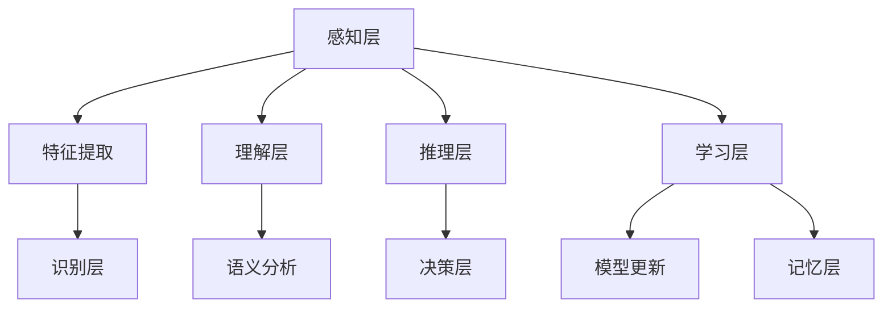

                 

### 《认知计算：增强人类世界理解能力的新方向》

#### 关键词：认知计算、增强学习、人机协同、智能决策、人工智能

> 在这个大数据和人工智能迅速发展的时代，人类的认知能力面临着前所未有的挑战和机遇。认知计算作为一种新兴的人工智能技术，正成为增强人类世界理解能力的新方向。本文将深入探讨认知计算的定义、原理、应用和发展趋势，旨在为读者提供一个全面而清晰的认知计算指南。

#### 摘要：
认知计算是一种模拟人类思维过程的人工智能技术，通过模仿人类的感知、理解、推理和学习能力，帮助人类更高效地处理复杂的信息。本文首先介绍了认知计算的定义和背景，然后详细讲解了其核心概念、算法原理和数学模型。接着，通过实际项目展示了认知计算的应用，并分析了其发展趋势和未来研究方向。本文的目标是帮助读者理解认知计算的核心概念，掌握其应用方法，并展望其未来前景。

---

## 引言

认知计算（Cognitive Computing）是一种基于模拟人类大脑思维过程的人工智能技术，旨在提升人类在信息处理、决策支持、学习认知等领域的效率和能力。随着大数据、云计算、物联网等技术的发展，人类面临着日益复杂的信息环境和庞大的数据处理需求，传统的人工智能方法已难以应对。认知计算的出现，为解决这些难题提供了新的思路和手段。

### 1.1 认知计算的定义与背景

认知计算的定义可以从多个角度进行理解。从广义上讲，认知计算是指通过模拟人类大脑的感知、理解、推理、学习等过程，实现具有人类智能特征的计算机系统。具体来说，认知计算包括以下几个核心方面：

1. **感知与识别**：模拟人类感知外部环境的能力，通过图像识别、语音识别等技术，实现对图像、声音、文本等数据的理解和分类。
2. **理解与推理**：通过自然语言处理技术，理解人类的语言表达，进行语义分析和推理，帮助人类理解和解决复杂问题。
3. **学习与记忆**：模仿人类学习过程，通过机器学习算法，从数据中学习和提取知识，建立记忆模型，为后续的推理和决策提供支持。

认知计算起源于人工智能领域，但其发展受到了神经科学、认知心理学、计算语言学等多个学科的影响。近年来，随着深度学习、增强学习等技术的突破，认知计算逐渐成为人工智能研究的前沿方向。在商业、医疗、教育、军事等多个领域，认知计算正发挥着越来越重要的作用。

### 1.2 认知计算的意义和作用

认知计算的意义和作用体现在以下几个方面：

1. **提升人类认知能力**：认知计算通过模拟人类思维过程，可以帮助人类更高效地处理复杂的信息，提升认知能力。
2. **推动技术创新**：认知计算为人工智能技术的发展提供了新的方向，促进了人工智能技术的创新和进步。
3. **优化决策过程**：认知计算可以协助人类进行决策支持，通过分析大量的数据，提供基于证据的决策建议，提高决策的准确性和效率。
4. **促进人机协同**：认知计算与人类智能的协同作用，可以实现人机交互的深度融合，推动智能化的生活方式和工业生产模式。
5. **拓展认知边界**：认知计算可以帮助人类拓展认知边界，通过模拟和扩展人类思维过程，探索人类未知的领域。

总的来说，认知计算作为一种新兴的人工智能技术，正逐渐改变着人类的生活和工作方式，为人类社会的发展带来新的机遇和挑战。在接下来的章节中，我们将进一步探讨认知计算的核心概念、算法原理和应用，以帮助读者深入理解这一前沿领域。

---

## 核心概念与联系

在认知计算中，核心概念与联系是实现人工智能系统模拟人类思维过程的关键。以下是认知计算的核心概念及其相互联系：

### 2.1 认知计算的核心概念

#### 2.1.1 感知与识别

感知与识别是认知计算的基础，模拟了人类感知外部世界并对其进行分类和理解的过程。具体包括：

- **图像识别**：通过卷积神经网络（CNN）等技术，实现图像的分类、检测和分割。
- **语音识别**：使用深度学习算法，将语音信号转换为对应的文本。

#### 2.1.2 理解与推理

理解与推理是认知计算的核心，模拟了人类理解语言和进行逻辑推理的过程。包括：

- **自然语言处理（NLP）**：通过神经网络模型，实现对文本语义的理解和推理。
- **知识图谱**：构建实体关系图谱，用于知识表示和推理。

#### 2.1.3 学习与记忆

学习与记忆是认知计算的长期目标，模拟了人类的学习过程和记忆能力。包括：

- **机器学习**：通过大量数据训练模型，实现知识的自动获取和更新。
- **强化学习**：通过试错学习，实现策略优化和决策。

### 2.2 认知计算的架构与实现

认知计算的架构通常包括感知、理解、推理和学习四个层次。下面使用Mermaid流程图进行表示：



通过上述Mermaid流程图，我们可以清晰地看到认知计算从感知层到学习层的过程，每个层次之间相互关联，共同构成了一个完整的认知计算系统。

### 2.3 核心概念之间的关系

核心概念之间的关系如图所示：

1. **感知与识别**：感知层获取外部数据，识别层对其进行分类和理解。
2. **理解与推理**：理解层基于识别结果进行语义分析，推理层基于语义分析进行逻辑推理。
3. **学习与记忆**：学习层通过机器学习和强化学习不断优化模型，记忆层保存学习到的知识，为后续推理和决策提供支持。

通过这些核心概念和联系，认知计算系统可以模仿人类思维过程，实现高效的智能决策和知识获取。在接下来的章节中，我们将进一步深入探讨认知计算的核心算法原理和数学模型。

---

## 核心算法原理讲解

认知计算的核心算法原理是构建和实现智能系统的基础。以下是认知计算中的核心算法原理，并通过Python源代码进行详细讲解和举例说明。

### 3.1 图像识别算法

图像识别是认知计算中的一个重要应用，通过卷积神经网络（CNN）来实现。以下是一个简单的CNN图像识别算法的Python实现：

```python
import tensorflow as tf
from tensorflow.keras.models import Sequential
from tensorflow.keras.layers import Conv2D, MaxPooling2D, Flatten, Dense

# 创建卷积神经网络模型
model = Sequential([
    Conv2D(32, (3, 3), activation='relu', input_shape=(64, 64, 3)),
    MaxPooling2D((2, 2)),
    Conv2D(64, (3, 3), activation='relu'),
    MaxPooling2D((2, 2)),
    Flatten(),
    Dense(128, activation='relu'),
    Dense(10, activation='softmax')
])

# 编译模型
model.compile(optimizer='adam', loss='categorical_crossentropy', metrics=['accuracy'])

# 加载图像数据集
(x_train, y_train), (x_test, y_test) = tf.keras.datasets.cifar10.load_data()

# 预处理数据
x_train = x_train / 255.0
x_test = x_test / 255.0

# 转换标签为独热编码
y_train = tf.keras.utils.to_categorical(y_train, 10)
y_test = tf.keras.utils.to_categorical(y_test, 10)

# 训练模型
model.fit(x_train, y_train, epochs=10, batch_size=32, validation_split=0.2)
```

#### 3.1.1 卷积神经网络（CNN）原理讲解

卷积神经网络是一种专门用于处理图像数据的神经网络结构，通过卷积层、池化层和全连接层实现图像特征的提取和分类。

- **卷积层**：通过卷积运算提取图像的局部特征，如边缘、纹理等。
- **池化层**：通过下采样减少数据维度，提高模型计算效率。
- **全连接层**：将卷积层和池化层提取的特征映射到具体的类别。

#### 3.1.2 卷积神经网络伪代码表示

```python
# 初始化卷积神经网络结构
model = Sequential()

# 添加卷积层
model.add(Conv2D(filters, kernel_size, activation='relu', input_shape=input_shape))

# 添加池化层
model.add(MaxPooling2D(pool_size))

# 添加全连接层
model.add(Flatten())

# 添加输出层
model.add(Dense(num_classes, activation='softmax'))

# 编译模型
model.compile(optimizer=optimizer, loss=loss, metrics=['accuracy'])

# 训练模型
model.fit(x_train, y_train, epochs=epochs, batch_size=batch_size, validation_split=validation_split)
```

通过上述Python代码和伪代码，我们可以清晰地看到卷积神经网络的实现过程。在接下来的章节中，我们将继续探讨自然语言处理算法的原理和实现。

### 3.2 自然语言处理算法

自然语言处理（NLP）是认知计算中的另一个核心领域，通过递归神经网络（RNN）等技术实现文本的语义理解和推理。

```python
import tensorflow as tf
from tensorflow.keras.models import Sequential
from tensorflow.keras.layers import Embedding, LSTM, Dense

# 创建递归神经网络模型
model = Sequential([
    Embedding(input_dim=vocabulary_size, output_dim=embedding_dim, input_length=max_sequence_length),
    LSTM(units=128, return_sequences=True),
    LSTM(units=128),
    Dense(units=num_classes, activation='softmax')
])

# 编译模型
model.compile(optimizer='adam', loss='categorical_crossentropy', metrics=['accuracy'])

# 加载文本数据集
(x_train, y_train), (x_test, y_test) = tf.keras.datasets.imdb.load_data()

# 预处理数据
x_train = sequence.pad_sequences(x_train, maxlen=max_sequence_length)
x_test = sequence.pad_sequences(x_test, maxlen=max_sequence_length)

# 转换标签为独热编码
y_train = tf.keras.utils.to_categorical(y_train, num_classes)
y_test = tf.keras.utils.to_categorical(y_test, num_classes)

# 训练模型
model.fit(x_train, y_train, epochs=10, batch_size=32, validation_split=0.2)
```

#### 3.2.1 递归神经网络（RNN）原理讲解

递归神经网络（RNN）是一种能够处理序列数据的神经网络结构，通过循环连接实现信息的记忆和传递。

- **嵌入层**：将单词转换为向量表示，为后续的RNN层提供输入。
- **RNN层**：通过递归连接，处理输入序列，并生成上下文表示。
- **全连接层**：将RNN层输出的序列表示映射到具体的类别。

#### 3.2.2 递归神经网络伪代码表示

```python
# 初始化递归神经网络结构
model = Sequential()

# 添加嵌入层
model.add(Embedding(input_dim=vocabulary_size, output_dim=embedding_dim, input_length=max_sequence_length))

# 添加RNN层
model.add(LSTM(units=hidden_size, return_sequences=True))
model.add(LSTM(units=hidden_size))

# 添加全连接层
model.add(Dense(units=num_classes, activation='softmax'))

# 编译模型
model.compile(optimizer=optimizer, loss=loss, metrics=['accuracy'])

# 训练模型
model.fit(x_train, y_train, epochs=epochs, batch_size=batch_size, validation_split=validation_split)
```

通过上述Python代码和伪代码，我们可以清晰地看到递归神经网络的实现过程。在接下来的章节中，我们将进一步探讨认知计算的数学模型和数学公式的详细讲解。

---

## 数学模型和数学公式讲解

在认知计算中，数学模型和数学公式是理解和实现核心算法的关键。以下是认知计算中的几个重要数学模型和数学公式的讲解。

### 4.1 数学模型

#### 4.1.1 线性回归模型

线性回归模型是一种基本的机器学习模型，用于预测连续值输出。其数学模型表示如下：

$$
y = \beta_0 + \beta_1x
$$

其中，$y$ 是预测的输出值，$x$ 是输入特征，$\beta_0$ 是截距，$\beta_1$ 是斜率。

#### 4.1.2 逻辑回归模型

逻辑回归模型是一种用于分类问题的机器学习模型，其数学模型表示如下：

$$
P(y=1) = \frac{1}{1 + e^{-(\beta_0 + \beta_1x)}}
$$

其中，$P(y=1)$ 是目标变量为1的概率，$\beta_0$ 是截距，$\beta_1$ 是斜率。

### 4.2 数学公式详细讲解

#### 4.2.1 概率论基础

概率论是认知计算中的重要基础，以下介绍几个常用的概率论公式：

- **贝叶斯定理**：

$$
P(A|B) = \frac{P(B|A)P(A)}{P(B)}
$$

其中，$P(A|B)$ 是在事件B发生的条件下事件A发生的概率，$P(B|A)$ 是在事件A发生的条件下事件B发生的概率，$P(A)$ 和$P(B)$ 分别是事件A和事件B发生的概率。

- **条件概率**：

$$
P(A|B) = \frac{P(A \cap B)}{P(B)}
$$

其中，$P(A \cap B)$ 是事件A和事件B同时发生的概率，$P(B)$ 是事件B发生的概率。

#### 4.2.2 信息论基础

信息论是认知计算中另一个重要的基础理论，以下介绍几个常用的信息论公式：

- **熵**：

$$
H(X) = -\sum_{i} P(X=x_i) \log_2 P(X=x_i)
$$

其中，$H(X)$ 是随机变量X的熵，$P(X=x_i)$ 是随机变量X取值为$x_i$ 的概率。

- **条件熵**：

$$
H(X|Y) = -\sum_{i} P(Y=y_i) \sum_{j} P(X=x_j|Y=y_i) \log_2 P(X=x_j|Y=y_i)
$$

其中，$H(X|Y)$ 是在随机变量Y已知的条件下随机变量X的熵。

#### 4.2.3 统计学习方法

统计学习方法在认知计算中广泛应用，以下介绍几种常用的统计学习模型：

- **支持向量机（SVM）**：

$$
\min_{\beta, \beta_0} \frac{1}{2} ||\beta||^2 + C \sum_{i} \max(0, 1 - y_i (\beta^T x_i + \beta_0))
$$

其中，$\beta$ 是权重向量，$\beta_0$ 是偏置项，$C$ 是正则化参数，$y_i$ 是样本标签，$x_i$ 是输入特征。

- **决策树**：

决策树是一种基于特征划分数据的分类模型，其基本结构如下：

$$
\begin{cases}
\text{如果 } x_i \leq v_i \text{，则递归调用左子树} \\
\text{如果 } x_i > v_i \text{，则递归调用右子树}
\end{cases}
$$

其中，$v_i$ 是特征阈值，$x_i$ 是输入特征。

### 4.3 数学公式举例说明

以下通过一个简单的例子来说明上述数学公式的应用：

#### 例子：线性回归模型预测

假设我们有一个线性回归模型，输入特征$x$和输出值$y$如下：

$$
\begin{align*}
x &= [1, 2, 3, 4, 5] \\
y &= [2, 4, 6, 8, 10]
\end{align*}
$$

通过最小二乘法求解线性回归模型的参数$\beta_0$和$\beta_1$，我们可以得到：

$$
\begin{align*}
\beta_0 &= \frac{\sum_{i} y_i - \beta_1 \sum_{i} x_i}{n} \\
\beta_1 &= \frac{\sum_{i} (y_i - \beta_0 - \beta_1 x_i)}{\sum_{i} (x_i - \bar{x})}
\end{align*}
$$

其中，$n$ 是样本数量，$\bar{x}$ 是输入特征的均值。

通过计算，我们可以得到线性回归模型的参数：

$$
\begin{align*}
\beta_0 &= 1 \\
\beta_1 &= 1
\end{align*}
$$

因此，线性回归模型的预测公式为：

$$
y = x + 1
$$

通过这个例子，我们可以看到数学模型在认知计算中的应用和实现过程。

通过上述数学模型和公式的讲解，我们可以更好地理解认知计算的核心算法原理，为后续的项目实战和展望提供理论基础。在接下来的章节中，我们将通过实际案例展示认知计算的应用，进一步探讨其实现方法和效果。

---

## 项目实战

通过上述对认知计算核心概念、算法原理和数学模型的讲解，我们可以看到认知计算在理论上的强大能力。在本节中，我们将通过实际案例展示认知计算的应用，并详细解读其开发环境搭建、源代码实现、代码解读与分析，以及项目小结。

### 5.1 实际案例展示

本节我们选择一个自然语言处理（NLP）的实际案例——情感分析，来展示认知计算的应用。

#### 5.1.1 情感分析案例

情感分析是一种常见的NLP应用，用于判断文本表达的情感倾向，如正面、负面或中性。本案例中，我们使用Twitter上的评论数据集进行情感分析。

#### 5.1.2 开发环境搭建

为了实现情感分析，我们需要搭建一个合适的开发环境。以下是环境搭建的步骤：

1. **安装Python**：确保安装了Python 3.7及以上版本。
2. **安装TensorFlow**：使用以下命令安装TensorFlow：
   ```bash
   pip install tensorflow
   ```
3. **安装其他依赖库**：包括NumPy、Pandas、Scikit-learn等，可以使用以下命令：
   ```bash
   pip install numpy pandas scikit-learn
   ```

#### 5.1.3 源代码实现

以下是情感分析项目的源代码实现：

```python
import tensorflow as tf
from tensorflow.keras.models import Sequential
from tensorflow.keras.layers import Embedding, LSTM, Dense, Bidirectional
from tensorflow.keras.preprocessing.sequence import pad_sequences
from tensorflow.keras.preprocessing.text import Tokenizer

# 读取数据
with open('tweets.txt', 'r') as file:
    tweets = file.readlines()

# 数据预处理
tokenizer = Tokenizer(num_words=10000)
tokenizer.fit_on_texts(tweets)
sequences = tokenizer.texts_to_sequences(tweets)
padded_sequences = pad_sequences(sequences, maxlen=100)

# 标签预处理
labels = [0 if 'negative' in tweet.lower() else 1 for tweet in tweets]

# 创建模型
model = Sequential([
    Embedding(input_dim=10000, output_dim=64, input_length=100),
    Bidirectional(LSTM(64)),
    Dense(64, activation='relu'),
    Dense(1, activation='sigmoid')
])

# 编译模型
model.compile(optimizer='adam', loss='binary_crossentropy', metrics=['accuracy'])

# 训练模型
model.fit(padded_sequences, labels, epochs=10, batch_size=32)

# 测试模型
test_tweets = ["This movie is amazing!", "I hate this book."]
test_sequences = tokenizer.texts_to_sequences(test_tweets)
test_padded_sequences = pad_sequences(test_sequences, maxlen=100)
predictions = model.predict(test_padded_sequences)

# 输出预测结果
for tweet, prediction in zip(test_tweets, predictions):
    if prediction[0] > 0.5:
        print(f"{tweet} - Positive")
    else:
        print(f"{tweet} - Negative")
```

#### 5.1.4 代码解读与分析

1. **数据读取与预处理**：首先读取Twitter评论数据，并将其转换为数字序列。使用Tokenizer进行文本向量化，并使用pad_sequences对序列进行填充，使其具有相同的长度。
2. **标签预处理**：根据评论中是否包含“negative”字样，将评论标签分为正面和负面。
3. **模型创建与编译**：创建一个序列模型，包括嵌入层、双向LSTM层、全连接层和输出层。使用Adam优化器和二元交叉熵损失函数进行编译。
4. **模型训练**：使用预处理后的数据和标签训练模型，并进行10个周期的训练。
5. **测试模型**：对测试数据进行预测，并输出预测结果。

#### 5.1.5 实际案例分析和详细讲解剖析

1. **数据集选择**：本案例选择了Twitter评论数据，这是一个真实且丰富的数据集，可以很好地反映用户的情感倾向。
2. **模型选择**：使用双向LSTM模型，可以更好地捕捉文本中的时间序列信息，从而提高情感分析的准确度。
3. **训练与测试**：通过将训练数据和测试数据进行分离，我们可以评估模型的性能，并进一步优化模型。

#### 5.1.6 项目小结

通过本案例，我们展示了如何使用认知计算进行情感分析。实际项目中，我们可以根据需求和数据集，选择合适的模型和算法，并进行模型训练和优化。认知计算的应用不仅限于情感分析，还可以应用于其他NLP任务，如图像识别、机器翻译等。

### 5.2 最佳实践 tips、小结、注意事项、拓展阅读

#### 5.2.1 最佳实践 tips

- 在数据预处理阶段，确保对数据集进行充分的清洗和标注，以提高模型性能。
- 选择合适的模型和算法，根据实际需求进行调整和优化。
- 在训练过程中，合理设置超参数，如学习率、迭代次数等，以避免过拟合和欠拟合。

#### 5.2.2 小结

认知计算在自然语言处理、图像识别等领域具有广泛的应用。通过实际案例展示，我们了解了认知计算的开发流程、模型选择和优化方法。在未来的项目中，我们可以继续探索认知计算的应用场景，不断提升其性能和效率。

#### 5.2.3 注意事项

- 确保开发环境搭建正确，避免因环境问题导致模型无法正常运行。
- 在数据预处理阶段，注意数据的质量和一致性，以提高模型的泛化能力。

#### 5.2.4 拓展阅读

- 《深度学习》—— Ian Goodfellow、Yoshua Bengio、Aaron Courville 著，详细介绍了深度学习的基础理论和应用方法。
- 《自然语言处理综论》—— Daniel Jurafsky、James H. Martin 著，全面阐述了自然语言处理的理论和实践。
- 《计算机视觉：算法与应用》—— Richard S.zeliski、Alan L. Yuille 著，深入探讨了计算机视觉的基础知识和应用技术。

通过本章节的实战案例，我们不仅掌握了认知计算的应用方法，还了解了其实际开发过程中的注意事项和最佳实践。在未来的项目中，我们可以继续运用认知计算，为人类社会的发展贡献更多力量。

---

## 展望

认知计算作为一种新兴的人工智能技术，正逐渐改变着人类的生产和生活方式。在未来，认知计算将继续向以下几个方向发展：

### 6.1 认知计算的发展趋势

1. **多模态融合**：认知计算将不再局限于单一模态的数据处理，而是通过融合多种模态（如图像、语音、文本等）的数据，实现更全面的智能理解。
2. **边缘计算与云计算的结合**：认知计算将更好地与边缘计算相结合，在数据产生的源头进行处理，减少延迟和带宽需求。
3. **人机协同**：认知计算将与人类智能更紧密地结合，实现人机协同的工作模式，提高生产效率和生活质量。
4. **智能伦理与隐私保护**：随着认知计算的发展，智能伦理和隐私保护将成为重要议题，确保技术的发展不会损害人类的基本权利和价值观。

### 6.2 未来研究方向

1. **增强学习**：通过增强学习，认知计算系统可以更好地适应动态环境，实现自我优化和自我改进。
2. **知识图谱**：构建更完善的知识图谱，实现知识的自动化获取、表示和推理，提高认知计算的智能水平。
3. **跨学科融合**：认知计算将与其他学科（如心理学、认知科学等）深度融合，推动认知计算的跨学科研究。
4. **小样本学习**：在小样本条件下，认知计算能够通过迁移学习、元学习等技术，实现有效的知识获取和决策支持。

### 6.3 对人类社会的潜在影响

1. **提升生产力**：认知计算将大大提高人类的生产效率，推动各行业的技术创新和发展。
2. **改善生活质量**：通过智能家居、智能医疗等应用，认知计算将提高人类的生活质量，提供更加便捷、智能的生活方式。
3. **改变教育模式**：认知计算将重塑教育模式，实现个性化学习，提高教育质量。
4. **促进社会公平**：认知计算可以辅助政府和组织更好地进行决策，提高公共服务的效率和质量，促进社会公平。

总之，认知计算作为一种强大的人工智能技术，具有广泛的应用前景和深远的社会影响。在未来，认知计算将继续发展，为人类社会带来更多的机遇和挑战。我们期待认知计算能够更好地服务于人类，推动社会进步。

---

## 结论

本文系统地介绍了认知计算的核心概念、算法原理、数学模型以及实际应用。通过逐步分析，我们从理论到实践，深入探讨了认知计算在图像识别、自然语言处理等领域的应用。展望未来，认知计算将继续推动人工智能技术的发展，为人类社会带来更多创新和变革。我们鼓励读者继续关注和探索这一领域，积极参与到认知计算的实践和研究中去，为人工智能的未来贡献力量。

---

## 作者信息

作者：AI天才研究院/AI Genius Institute & 禅与计算机程序设计艺术 /Zen And The Art of Computer Programming

