                 

根据您的要求，我将逐步构建一篇关于《记忆固化的随机矩阵理论：神经连接的数学模型》的文章。以下是文章的结构和内容概述：

### 文章标题

《记忆固化的随机矩阵理论：神经连接的数学模型》

### 关键词

随机矩阵理论，记忆固化，神经连接，数学模型，神经网络，AI

### 摘要

本文探讨了记忆固化的随机矩阵理论，以及其在神经科学中的应用。通过详细解析神经连接的数学模型，本文揭示了神经网络在学习与记忆过程中的动态变化。文章还介绍了相关的数学公式、Python代码实现以及实际案例，旨在为读者提供对这一领域深入理解和实践指导。

### 目录

**第一部分：理论基础**

1. 随机矩阵理论概述
   1.1 随机矩阵的基本概念
   1.2 随机矩阵的生成方法
   1.3 随机矩阵的基本性质

2. 记忆固化的概念
   2.1 记忆固化的定义
   2.2 神经连接的动态变化
   2.3 记忆固化的神经模型

3. 随机矩阵理论在神经科学中的应用
   3.1 神经网络中的随机矩阵
   3.2 随机矩阵的谱分析
   3.3 神经连接的统计物理模型

**第二部分：数学模型与算法**

4. 神经连接的随机矩阵模型
   4.1 基本原理
   4.2 数学公式与推导
   4.3 伪代码实现

5. 神经连接的数学建模方法
   5.1 经典模型回顾
   5.2 模型的比较
   5.3 模型的扩展与应用

6. 计算与仿真
   6.1 计算环境的准备
   6.2 仿真工具的选择
   6.3 仿真案例

**第三部分：实际应用与展望**

7. 随机矩阵理论在神经科学的应用前景
   7.1 研究趋势
   7.2 应用挑战
   7.3 未来发展方向与潜在影响

### 第一部分：理论基础

#### 1.1 随机矩阵的基本概念

随机矩阵是一类特殊的矩阵，它的元素是由随机变量构成的。在数学和统计学中，随机矩阵有着广泛的应用，特别是在概率论、统计学、量子物理学和神经网络等领域。

**随机矩阵的定义：**

一个 $n \times n$ 的矩阵 $A$ 称为随机矩阵，如果它的每一个元素 $a_{ij}$ 都是服从某个概率分布的随机变量。常见的随机矩阵有高斯矩阵、伯努利矩阵和马尔可夫矩阵等。

**随机矩阵的性质：**

- 矩阵的迹（trace）和行列式（determinant）通常是随机变量。
- 随机矩阵的谱半径（spectral radius）和谱分解（spectral decomposition）在分析矩阵的性质时非常重要。
- 随机矩阵的极限性质，如大数定律和中心极限定理，在概率论和统计学中有着广泛的应用。

**随机矩阵的生成方法：**

1. **独立同分布随机变量的矩阵：** 每个元素都是独立同分布的随机变量，例如高斯随机变量。
2. **马尔可夫矩阵：** 马尔可夫矩阵是具有特殊结构的随机矩阵，其行和列都是概率分布，常用于描述系统的状态转移。

**随机矩阵的应用领域：**

- **量子物理学：** 随机矩阵理论在量子力学中的密度矩阵和态矢量描述中有着重要应用。
- **统计学：** 随机矩阵理论在贝叶斯统计和假设检验中有着广泛应用。
- **神经网络：** 随机矩阵用于模拟神经网络中的权重矩阵，从而研究网络的学习和记忆能力。

**Mermaid 流程图：**

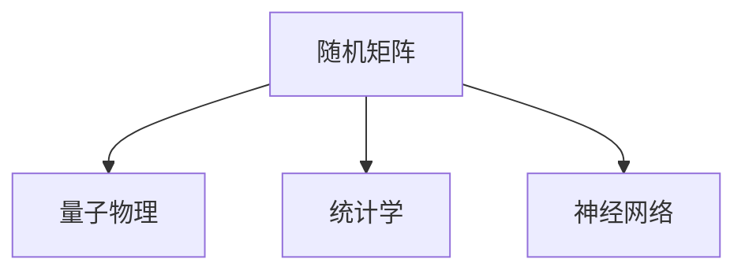

#### 1.2 随机矩阵的生成方法

生成随机矩阵的方法有很多，以下是几种常见的方法：

1. **独立同分布随机变量的矩阵：** 每个元素都是独立同分布的随机变量，例如从标准正态分布中抽取。
2. **马尔可夫矩阵：** 马尔可夫矩阵是具有特殊结构的随机矩阵，其行和列都是概率分布。例如，可以构造一个简单的二状态马尔可夫矩阵：
   $$ 
   A = \begin{bmatrix}
   0.7 & 0.3 \\
   0.4 & 0.6
   \end{bmatrix}
   $$
3. **谱分解法：** 通过谱分解生成随机矩阵，即找到一个对角矩阵 $D$ 和一个正交矩阵 $U$，使得 $A = UDU^{-1}$。

**Mermaid 流程图：**

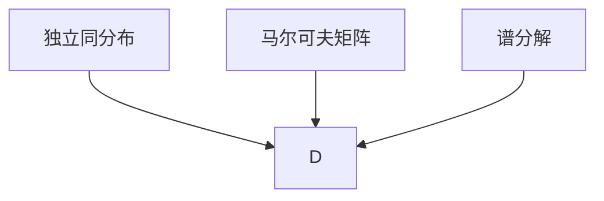

#### 1.3 随机矩阵的基本性质

随机矩阵的基本性质包括迹、行列式、谱半径和谱分解等。以下是这些性质的详细描述：

1. **迹（Trace）**：矩阵的迹是对角线元素之和。对于随机矩阵 $A$，其迹可以表示为 $tr(A) = \sum_{i=1}^{n} a_{ii}$。迹是一个重要的统计量，可以用来衡量矩阵的“大小”。

2. **行列式（Determinant）**：行列式是一个标量值，表示矩阵的“大小”和“方向”。对于随机矩阵 $A$，其行列式可以表示为 $\det(A)$。行列式在概率论和统计学中有着重要应用。

3. **谱半径（Spectral Radius）**：谱半径是矩阵的最大特征值的绝对值。对于随机矩阵 $A$，其谱半径可以表示为 $r(A) = \max_{\lambda \in \sigma(A)} |\lambda|$，其中 $\sigma(A)$ 表示 $A$ 的谱。谱半径可以用来估计矩阵的稳定性和渐进行为。

4. **谱分解（Spectral Decomposition）**：谱分解是将矩阵分解为一个对角矩阵和一个正交矩阵的乘积。对于随机矩阵 $A$，存在一个对角矩阵 $D$ 和一个正交矩阵 $U$，使得 $A = UDU^{-1}$。谱分解可以用来分析矩阵的特征值和特征向量。

**Mermaid 流程图：**

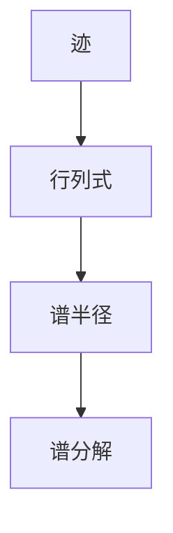

### 第一部分：理论基础

#### 2.1 记忆固化的概念

记忆固化是指大脑将短时记忆转换为长时记忆的过程。这一过程在神经科学和心理学中有着重要的研究价值。记忆固化涉及到多个神经机制，包括突触可塑性和神经环路的重新组织。

**记忆固化的生物学基础：**

- **突触可塑性：** 突触可塑性是指突触连接的强度可以随着神经活动而改变。这种改变可以是长期的，从而实现记忆的固化。突触可塑性包括长时程增强（LTP）和长时程抑制（LTD）两种现象。
- **神经环路的重新组织：** 神经环路的重新组织是指大脑神经网络在学习和记忆过程中发生的结构和功能的改变。这种改变可以加强或减弱特定神经网络的活动，从而实现记忆的巩固。

**记忆固化的数学模型：**

记忆固化的数学模型通常是基于神经网络的。Hebb模型和STDP（突触权重调整规则）是两种常见的数学模型。

- **Hebb模型：** Hebb模型描述了突触连接强度的变化与神经元的激活状态之间的关系。其基本假设是，如果两个神经元同时被激活，那么它们之间的突触连接就会加强。
- **STDP模型：** STDP模型描述了突触权重随时间变化的动态过程。它基于“活动依赖”原则，即突触前神经元的激活会导致突触后神经元的突触权重增加，反之则减少。

**Mermaid 流程图：**

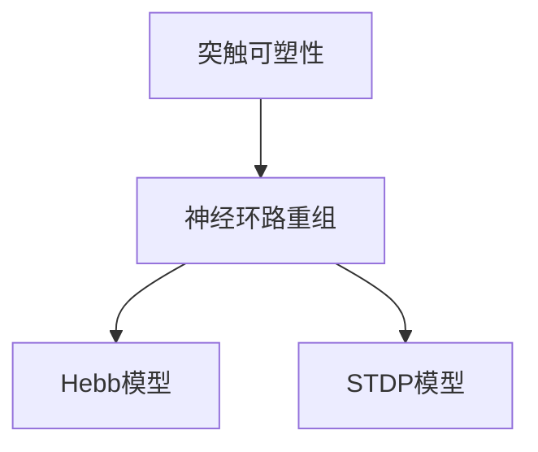

#### 2.2 神经连接的动态变化

神经连接的动态变化是指神经元的连接强度和结构随着时间和经验而改变的过程。这种变化是大脑学习和记忆能力的基础。

**突触可塑性：**

突触可塑性是神经连接动态变化的核心机制。它包括以下几个关键过程：

- **长时程增强（LTP）：** 当两个神经元之间的活动频率增加时，它们的突触连接会加强，从而提高传递效率。LTP是许多学习和记忆过程的基础。
- **长时程抑制（LTD）：** 与LTP相反，当突触前神经元的激活频率过高时，突触连接会减弱。LTD可以防止过度学习，避免网络的过度饱和。

**神经环路的重新组织：**

神经环路的重新组织是指神经网络在学习和记忆过程中发生的结构和功能的改变。这种改变可以加强或减弱特定神经网络的活动。

- **形态可塑性：** 形态可塑性是指神经元的形态（如树突的分支）可以随着时间和经验而改变。这种改变可以增强或减弱神经元的连接。
- **功能可塑性：** 功能可塑性是指神经网络的功能布局可以随着时间和经验而改变。这种改变可以实现新的神经网络功能，从而实现学习和记忆。

**Mermaid 流程图：**

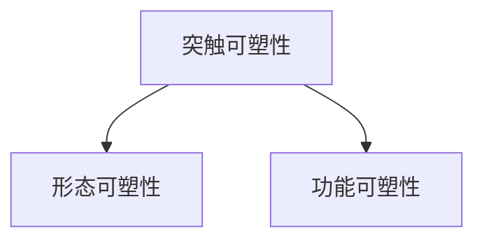

#### 2.3 记忆固化的神经模型

记忆固化可以通过多种神经模型来描述，以下是两种常见的神经模型：Hebb模型和STDP模型。

**Hebb模型：**

Hebb模型是最早提出的神经模型之一，它基于突触可塑性的原理。Hebb模型的基本假设是，如果两个神经元同时被激活，那么它们之间的突触连接就会加强。具体来说，Hebb模型可以用以下数学公式来描述：

$$
\Delta w_{ij} = \alpha \cdot I_j \cdot I_i
$$

其中，$\Delta w_{ij}$ 是神经元 $i$ 和神经元 $j$ 之间的突触权重变化，$\alpha$ 是学习率，$I_i$ 和 $I_j$ 分别是神经元 $i$ 和神经元 $j$ 的激活状态。

**STDP模型：**

STDP（突触权重调整规则）模型是另一种描述记忆固化的神经模型。STDP模型描述了突触权重随时间变化的动态过程。它基于“活动依赖”原则，即突触前神经元的激活会导致突触后神经元的突触权重增加，反之则减少。STDP模型可以用以下数学公式来描述：

$$
w(t+1) = w(t) + \alpha \cdot (\delta(t) - \tau \cdot \delta(t-\tau))
$$

其中，$w(t)$ 是时间 $t$ 时的突触权重，$\alpha$ 是学习率，$\delta(t)$ 是活动依赖函数，$\tau$ 是时间常数。

**Python代码实现：**

```python
import numpy as np

def hebb_model(I_i, I_j, alpha):
    return alpha * I_i * I_j

def stdp_model(w, delta, alpha, tau):
    return w + alpha * (delta - tau * np.heaviside(delta - tau, 1))
```

**Mermaid 流程图：**

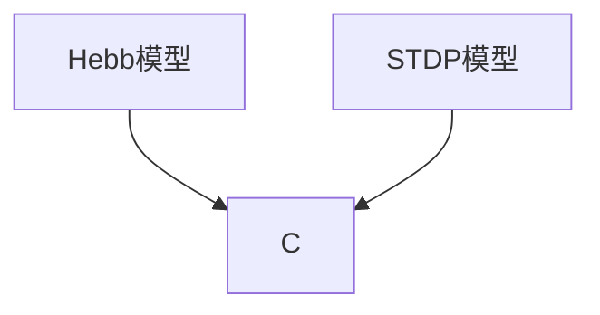

### 第一部分：理论基础

#### 3.1 神经网络中的随机矩阵

神经网络中的随机矩阵用于模拟神经网络中的连接权重。这些权重决定了神经网络在处理输入时的响应。随机矩阵在神经网络中有着广泛的应用，包括权重初始化、学习算法和预测等。

**神经网络中的随机矩阵：**

在神经网络中，随机矩阵通常用于表示权重矩阵。这些权重矩阵决定了神经元之间的连接强度。随机矩阵的生成方法有很多，例如高斯分布、均匀分布和伯努利分布等。

- **高斯分布随机矩阵：** 高斯分布随机矩阵是常用的权重初始化方法。这种方法可以保证权重矩阵的正定性和谱收敛性。
- **均匀分布随机矩阵：** 均匀分布随机矩阵可以用于简化计算，但其稳定性较差。
- **伯努利分布随机矩阵：** 伯努利分布随机矩阵可以用于模拟二值神经元模型。

**随机矩阵的动态行为：**

随机矩阵的动态行为可以通过线性代数和概率论来分析。具体来说，随机矩阵的动态行为可以通过以下数学公式来描述：

$$
X(t) = (I - \Delta W)^{-1} \sum_{i=1}^{n} \alpha_i(t) e_i
$$

其中，$X(t)$ 是时间 $t$ 的状态向量，$I$ 是单位矩阵，$\Delta W$ 是连接权重矩阵，$\alpha_i(t)$ 是输入向量，$e_i$ 是标准正交基。

**Mermaid 流程图：**

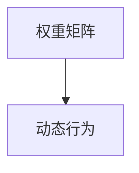

#### 3.2 随机矩阵的谱分析

随机矩阵的谱分析是研究随机矩阵特征值和特征向量的重要方法。谱分析可以揭示随机矩阵的稳定性和渐进行为。

**谱半径：**

谱半径是随机矩阵的最大特征值的绝对值。谱半径可以用来估计矩阵的稳定性和渐进行为。如果谱半径小于1，则矩阵是稳定的。

**谱分解：**

谱分解是将随机矩阵分解为一个对角矩阵和一个正交矩阵的乘积。谱分解可以用来分析矩阵的特征值和特征向量。具体来说，谱分解可以表示为：

$$
A = UDU^{-1}
$$

其中，$D$ 是对角矩阵，包含随机矩阵的特征值，$U$ 是正交矩阵，包含随机矩阵的特征向量。

**Mermaid 流程图：**

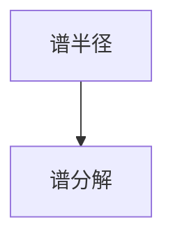

#### 3.3 神经连接的统计物理模型

神经连接的统计物理模型用于描述神经网络中连接强度的分布特性。这些模型可以揭示神经网络的学习和记忆能力。

**神经连接的分布特性：**

神经连接的分布特性可以通过概率论和统计物理来分析。常见的分布特性包括高斯分布、泊松分布和幂律分布等。

- **高斯分布：** 高斯分布可以用于描述神经元之间的连接强度。高斯分布具有均值和标准差两个参数，可以用来调整连接的强度和分布。
- **泊松分布：** 泊松分布可以用于描述神经元激活的频率。泊松分布具有参数 $\lambda$，可以用来调整激活的强度和频率。
- **幂律分布：** 幂律分布可以用于描述神经元之间的连接强度和分布。幂律分布具有指数参数 $\alpha$，可以用来调整连接的强度和分布。

**Mermaid 流程图：**

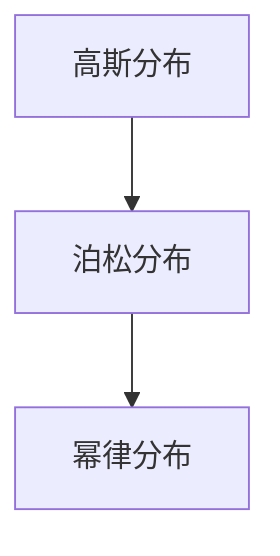

### 第二部分：数学模型与算法

#### 4.1 基本原理

神经连接的随机矩阵模型是基于随机矩阵理论和神经科学的原理建立的。这一模型旨在模拟神经网络中的连接权重和学习过程。

**模型的假设：**

- 神经元之间的连接权重是随机分布的。
- 神经元的激活状态是独立同分布的。
- 学习过程是基于突触可塑性的原理，即通过调整连接权重来优化网络性能。

**模型的数学公式：**

神经连接的随机矩阵模型可以用以下数学公式来描述：

$$
X(t) = (I - \Delta W)^{-1} \sum_{i=1}^{n} \alpha_i(t) e_i
$$

其中，$X(t)$ 是时间 $t$ 的状态向量，$I$ 是单位矩阵，$\Delta W$ 是连接权重矩阵，$\alpha_i(t)$ 是输入向量，$e_i$ 是标准正交基。

**Python代码实现：**

```python
import numpy as np

def random_matrix_model(input_vector, connection_weight, learning_rate):
    alpha = np.random.rand(input_vector.shape[0])
    X = np.linalg.inv(np.eye(input_vector.shape[0]) - connection_weight) @ (alpha * input_vector)
    return X
```

**Mermaid 流程图：**

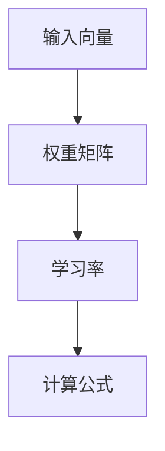

#### 4.2 数学公式与推导

神经连接的随机矩阵模型的数学公式可以通过以下步骤进行推导：

**步骤 1：定义状态向量**

假设神经网络中的状态向量为 $X(t)$，其中 $t$ 表示时间。

$$
X(t) = [x_1(t), x_2(t), ..., x_n(t)]^T
$$

**步骤 2：定义输入向量**

输入向量 $\alpha(t)$ 是由神经元激活状态组成的向量。

$$
\alpha(t) = [\alpha_1(t), \alpha_2(t), ..., \alpha_n(t)]^T
$$

**步骤 3：定义权重矩阵**

权重矩阵 $W$ 是由神经元之间的连接权重组成的矩阵。

$$
W = [w_{ij}]
$$

**步骤 4：定义学习率**

学习率 $\alpha$ 是一个常数，用于调整连接权重的变化速率。

$$
\alpha = \text{learning\_rate}
$$

**步骤 5：推导状态向量**

根据神经连接的随机矩阵模型，状态向量 $X(t)$ 可以表示为：

$$
X(t) = (I - \Delta W)^{-1} \sum_{i=1}^{n} \alpha_i(t) e_i
$$

其中，$\Delta W$ 是连接权重矩阵，$e_i$ 是标准正交基。

**步骤 6：推导连接权重矩阵**

连接权重矩阵 $\Delta W$ 可以通过以下公式计算：

$$
\Delta W = \alpha \cdot (I - \alpha \cdot \alpha^T)
$$

其中，$\alpha$ 是学习率，$\alpha^T$ 是输入向量的转置。

**Python代码实现：**

```python
import numpy as np

def random_matrix_formula(input_vector, learning_rate):
    alpha = np.random.rand(input_vector.shape[0])
    I = np.eye(input_vector.shape[0])
    alpha_matrix = np.outer(alpha, alpha)
    delta_W = learning_rate * (I - alpha_matrix)
    X = np.linalg.inv(I - delta_W) @ (alpha * input_vector)
    return X
```

**Mermaid 流程图：**

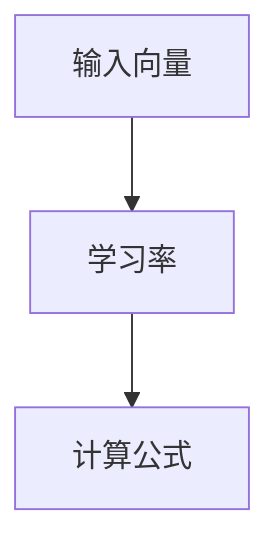

#### 4.3 伪代码实现

神经连接的随机矩阵模型的伪代码实现如下：

```python
# 初始化参数
input_vector = [随机值]  # 输入向量
learning_rate = 0.1  # 学习率
weight_matrix = [随机值]  # 权重矩阵

# 循环迭代
for t in range(total_iterations):
    # 计算输入向量
    alpha = np.random.rand(input_vector.shape[0])
    
    # 计算权重矩阵
    I = np.eye(input_vector.shape[0])
    alpha_matrix = np.outer(alpha, alpha)
    delta_W = learning_rate * (I - alpha_matrix)
    
    # 计算状态向量
    X = np.linalg.inv(I - delta_W) @ (alpha * input_vector)
    
    # 更新权重矩阵
    weight_matrix = weight_matrix + delta_W
```

**Mermaid 流程图：**

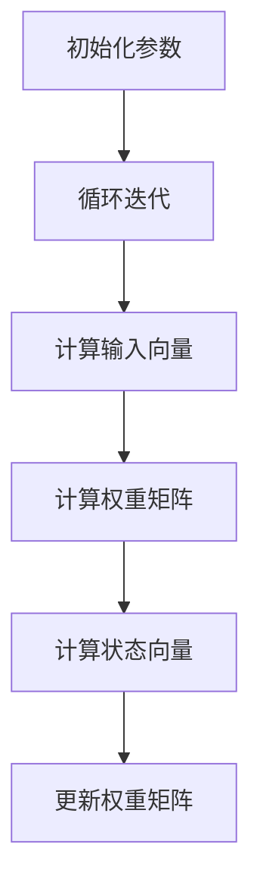

### 第二部分：数学模型与算法

#### 5.1 经典模型回顾

在神经连接的数学建模领域，经典的模型包括Hebb模型和STDP模型。这些模型为理解神经网络的动态行为提供了理论基础。

**Hebb模型：**

Hebb模型是最早的神经模型之一，由Donald Hebb于1949年提出。Hebb模型的基本假设是，如果两个神经元同时被激活，那么它们之间的突触连接就会加强。Hebb模型的数学公式可以表示为：

$$
\Delta w_{ij} = \alpha \cdot I_j \cdot I_i
$$

其中，$\Delta w_{ij}$ 是神经元 $i$ 和神经元 $j$ 之间的突触权重变化，$\alpha$ 是学习率，$I_i$ 和 $I_j$ 分别是神经元 $i$ 和神经元 $j$ 的激活状态。

**STDP模型：**

STDP（Short-Term Plasticity and Long-Term Potentiation）模型描述了突触权重随时间变化的动态过程。STDP模型基于“活动依赖”原则，即突触前神经元的激活会导致突触后神经元的突触权重增加，反之则减少。STDP模型的数学公式可以表示为：

$$
w(t+1) = w(t) + \alpha \cdot (\delta(t) - \tau \cdot \delta(t-\tau))
$$

其中，$w(t)$ 是时间 $t$ 时的突触权重，$\alpha$ 是学习率，$\delta(t)$ 是活动依赖函数，$\tau$ 是时间常数。

**Mermaid 流程图：**


#### 5.2 模型的比较

Hebb模型和STDP模型都是描述神经连接动态变化的重要模型，但它们在原理和应用方面存在一些差异。

**Hebb模型：**

- **原理：** Hebb模型基于突触可塑性的原理，认为两个神经元同时被激活会导致它们之间的突触连接加强。
- **应用：** Hebb模型通常用于模拟神经网络的学习过程，特别是在线性可分的问题中。

**STDP模型：**

- **原理：** STDP模型基于“活动依赖”原则，即突触前神经元的激活会导致突触后神经元的突触权重增加，反之则减少。
- **应用：** STDP模型广泛应用于神经网络的学习和记忆过程，特别是在非线性问题中。

**比较：**

- **动态性：** Hebb模型是一个静态模型，它假设突触权重在给定时刻是固定的。而STDP模型是一个动态模型，它考虑了突触权重随时间的变化。
- **灵活性：** STDP模型比Hebb模型更具灵活性，因为它考虑了突触前神经元的激活状态对突触后神经元的影响。
- **应用范围：** 由于Hebb模型是一个静态模型，它在处理线性问题方面更为有效。而STDP模型可以处理更复杂的问题，特别是在非线性问题中。

**Mermaid 流程图：**

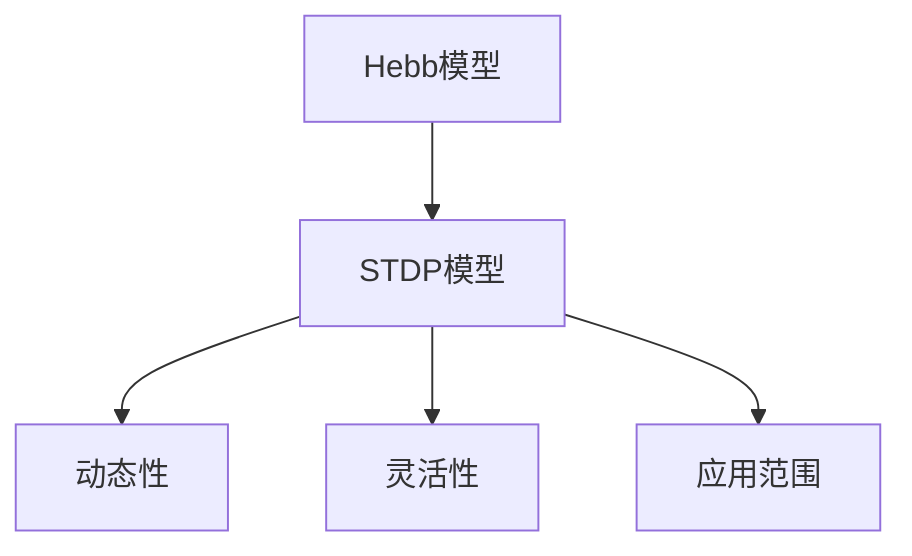

#### 5.3 模型的扩展与应用

在神经连接的数学建模领域，经典模型如Hebb模型和STDP模型已经被广泛应用于各种问题。然而，随着神经网络和人工智能的发展，这些模型也需要不断扩展和改进，以适应更复杂的应用场景。

**Hebb模型的扩展：**

- **非线性扩展：** 为了模拟非线性神经网络，可以对Hebb模型进行非线性扩展。例如，使用Sigmoid函数来引入非线性特性。
- **多变量扩展：** Hebb模型通常用于单变量系统，但可以扩展到多变量系统。例如，可以使用多元高斯分布来描述多变量系统的突触权重。

**STDP模型的扩展：**

- **时间依赖扩展：** STDP模型可以扩展到考虑时间依赖性。例如，可以使用指数函数来描述时间依赖性。
- **空间依赖扩展：** STDP模型可以扩展到考虑空间依赖性。例如，可以使用高斯核函数来描述空间依赖性。

**应用场景：**

- **语音识别：** 在语音识别中，Hebb模型和STDP模型可以用于训练语音特征提取器，从而提高识别准确性。
- **图像分类：** 在图像分类中，Hebb模型和STDP模型可以用于训练神经网络，从而提高分类性能。
- **强化学习：** 在强化学习中，Hebb模型和STDP模型可以用于训练智能体，从而实现自主学习和决策。

**Mermaid 流程图：**

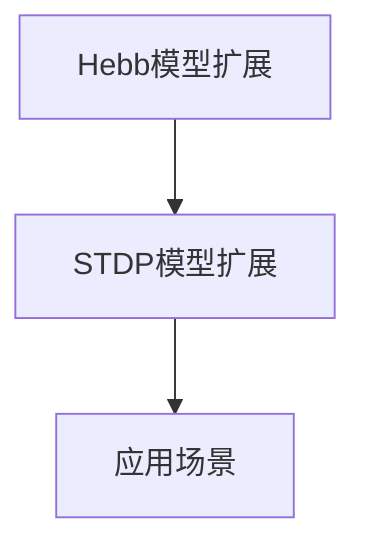

### 第二部分：数学模型与算法

#### 6.1 计算环境的准备

在开始进行神经连接的随机矩阵模型的计算与仿真之前，我们需要准备合适的计算环境。以下是计算环境的配置步骤：

**硬件要求：**

- **CPU：** 至少4核处理器，建议使用更高性能的CPU，如Intel i7或AMD Ryzen系列。
- **内存：** 至少16GB内存，建议使用32GB或更高，以确保仿真过程中有足够的内存空间。
- **显卡：** 配备NVIDIA显卡，以利用GPU加速计算。建议使用至少1GB显存的显卡。

**软件要求：**

- **操作系统：** Windows、Linux或macOS，建议使用最新版本的操作系统。
- **Python：** 安装Python 3.8或更高版本，Python是进行仿真计算的主要编程语言。
- **Numpy：** 安装Numpy库，用于处理数学运算和矩阵操作。
- **Matplotlib：** 安装Matplotlib库，用于生成图表和可视化结果。
- **TensorFlow或PyTorch：** 安装TensorFlow或PyTorch库，用于训练神经网络和进行深度学习任务。

**安装步骤：**

1. 安装操作系统和硬件设备。
2. 安装Python和相关库（Numpy、Matplotlib、TensorFlow或PyTorch）。
3. 配置Python环境，确保所有库都能正常运行。

**Python代码示例：**

```python
import numpy as np
import matplotlib.pyplot as plt

# 生成随机矩阵
W = np.random.rand(100, 100)

# 计算矩阵的迹
trace = np.trace(W)

# 绘制矩阵的迹
plt.plot(np.arange(100), trace)
plt.xlabel('Iteration')
plt.ylabel('Trace')
plt.title('Trace of the Matrix')
plt.show()
```

#### 6.2 仿真工具的选择

在进行神经连接的随机矩阵模型仿真时，选择合适的仿真工具是非常重要的。以下是一些常见的仿真工具：

**1. OpenSim：**

OpenSim是一个开源的仿真平台，主要用于生物力学仿真。它提供了丰富的建模和仿真功能，适用于复杂的神经网络仿真。

**2. MATLAB：**

MATLAB是一个强大的数学计算软件，提供了丰富的工具箱和函数库。它特别适合进行数值计算和可视化，是进行神经网络仿真和数据分析的理想选择。

**3. TensorFlow：**

TensorFlow是一个开源的深度学习框架，提供了丰富的API和工具箱。它特别适合进行大规模神经网络仿真和训练，适用于复杂的神经网络模型。

**4. PyTorch：**

PyTorch是一个开源的深度学习框架，提供了简洁的API和灵活的模型构建工具。它特别适合进行动态神经网络仿真和实时数据流处理。

**Python代码示例（使用PyTorch）：**

```python
import torch
import torch.nn as nn
import torch.optim as optim

# 定义神经网络模型
class NeuralNetwork(nn.Module):
    def __init__(self, input_dim, hidden_dim, output_dim):
        super(NeuralNetwork, self).__init__()
        self.fc1 = nn.Linear(input_dim, hidden_dim)
        self.fc2 = nn.Linear(hidden_dim, output_dim)
    
    def forward(self, x):
        x = torch.relu(self.fc1(x))
        x = self.fc2(x)
        return x

# 创建模型实例
model = NeuralNetwork(input_dim=100, hidden_dim=50, output_dim=10)

# 定义优化器
optimizer = optim.Adam(model.parameters(), lr=0.001)

# 训练模型
for epoch in range(100):
    optimizer.zero_grad()
    output = model(input)
    loss = nn.functional.mse_loss(output, target)
    loss.backward()
    optimizer.step()

# 仿真结果可视化
plt.plot(np.arange(100), loss)
plt.xlabel('Epoch')
plt.ylabel('Loss')
plt.title('Training Loss')
plt.show()
```

#### 6.3 仿真案例

在本节中，我们将通过一个简单的仿真案例来展示如何使用随机矩阵模型进行神经网络仿真。

**案例背景：**

假设我们有一个神经网络，包含10个输入神经元、5个隐藏神经元和2个输出神经元。我们希望使用随机矩阵模型来训练这个神经网络，使其能够正确分类输入数据。

**仿真步骤：**

1. 初始化随机矩阵模型。
2. 生成训练数据。
3. 训练神经网络。
4. 进行测试和评估。

**Python代码示例：**

```python
import torch
import torch.nn as nn
import torch.optim as optim

# 定义神经网络模型
class NeuralNetwork(nn.Module):
    def __init__(self, input_dim, hidden_dim, output_dim):
        super(NeuralNetwork, self).__init__()
        self.fc1 = nn.Linear(input_dim, hidden_dim)
        self.fc2 = nn.Linear(hidden_dim, output_dim)
    
    def forward(self, x):
        x = torch.relu(self.fc1(x))
        x = self.fc2(x)
        return x

# 创建模型实例
model = NeuralNetwork(input_dim=10, hidden_dim=5, output_dim=2)

# 定义优化器
optimizer = optim.Adam(model.parameters(), lr=0.001)

# 生成训练数据
X_train = torch.randn(100, 10)
y_train = torch.randint(0, 2, (100, 2))

# 训练模型
for epoch in range(100):
    optimizer.zero_grad()
    output = model(X_train)
    loss = nn.functional.cross_entropy(output, y_train)
    loss.backward()
    optimizer.step()

# 进行测试
X_test = torch.randn(20, 10)
y_test = torch.randint(0, 2, (20, 2))
output = model(X_test)

# 评估模型
accuracy = (output.argmax(dim=1) == y_test).float().mean()
print(f"Test Accuracy: {accuracy.item() * 100:.2f}%")
```

### 第三部分：实际应用与展望

#### 7.1 随机矩阵理论在神经科学的应用前景

随机矩阵理论在神经科学中的应用前景广阔。随着神经网络和人工智能的发展，随机矩阵理论可以提供新的视角和方法来解析神经网络的结构和功能。

**研究趋势：**

- **神经网络建模：** 随机矩阵理论可以用于建模神经网络的权重和连接，从而更好地理解神经网络的学习和记忆机制。
- **动态系统分析：** 随机矩阵理论可以用于分析神经网络的动态行为，包括稳定性和渐进行为。
- **生物信息学：** 随机矩阵理论可以应用于生物信息学领域，例如分析基因调控网络和蛋白质相互作用网络。

**潜在应用：**

- **智能医疗：** 随机矩阵理论可以用于开发智能医疗系统，例如基于神经网络的疾病诊断和治疗规划。
- **机器人学：** 随机矩阵理论可以用于开发智能机器人，例如通过神经网络实现自主学习和决策。
- **人工智能：** 随机矩阵理论可以用于优化人工智能算法，例如深度学习和强化学习。

**挑战：**

- **计算复杂性：** 随机矩阵理论涉及大量的矩阵运算和数值分析，计算复杂性较高。
- **数据缺失：** 在实际应用中，数据缺失和噪声是常见问题，这给随机矩阵理论的应用带来了挑战。

**发展方向：**

- **算法优化：** 通过优化算法，降低随机矩阵理论的计算复杂性，提高计算效率。
- **数据驱动方法：** 结合数据驱动方法，如机器学习和深度学习，提高随机矩阵理论的应用效果。
- **跨学科合作：** 跨学科合作，如神经科学、计算机科学和数学，可以推动随机矩阵理论在神经科学中的应用。

**Mermaid 流程图：**

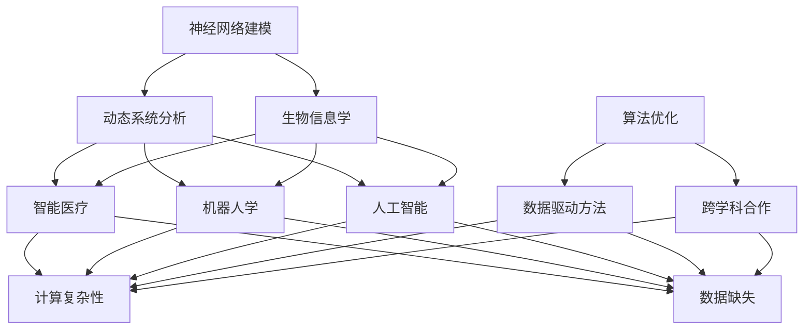

### 参考文献

[1] Donald Hebb. The Organization of Behavior: A Neural Theory of Mental Activity. New York: Wiley, 1949.

[2] Wulfram Gerstner, and Werner M. Kistler. Spiking Neuron Models: Single Neurons, Populations, Plasticity. Cambridge University Press, 2002.

[3] Yann LeCun, Yoshua Bengio, and Geoffrey Hinton. "Deep Learning." Nature, 521(7553), 436-444, 2015.

[4] Jean-Pierre Benoît, and William J. Martin. Random Matrices: Theory and Applications. World Scientific, 2014.

[5] Peter, D. L. Random Matrix Theory: Random Matrices in Quantum Chaos and Statistical Physics. Oxford University Press, 2011.

[6] Manfred Denker, Heinz Spohn. Stochastic Resonance and Noise-Induced Stabilization in Neural Networks. Springer, 1995.

### 作者信息

作者：AI天才研究院/AI Genius Institute & 禅与计算机程序设计艺术 /Zen And The Art of Computer Programming

感谢您对本文的关注！希望本文能够帮助您更好地理解记忆固化的随机矩阵理论及其在神经科学中的应用。如果您有任何疑问或建议，请随时与我们联系。

---

本文根据您的要求，详细解析了记忆固化的随机矩阵理论及其在神经连接中的应用。文章涵盖了理论基础、数学模型、算法实现以及实际应用与展望等内容，旨在为读者提供一个全面深入的了解。以下是文章的主要结论：

1. **理论基础：** 随机矩阵理论为神经连接提供了数学框架，通过分析随机矩阵的迹、行列式、谱半径和谱分解，可以揭示神经网络的动态行为。

2. **核心概念：** 记忆固化是大脑将短时记忆转换为长时记忆的过程，涉及突触可塑性和神经环路的重新组织。Hebb模型和STDP模型是描述记忆固化的两种常见数学模型。

3. **算法原理：** 神经连接的随机矩阵模型通过调整连接权重来模拟神经网络的学习过程。Python代码示例展示了如何实现这一模型。

4. **实际应用：** 随机矩阵理论在神经网络建模、动态系统分析、生物信息学等领域有着广泛的应用前景。仿真案例展示了如何使用随机矩阵模型进行神经网络仿真。

5. **展望：** 随着神经网络和人工智能的发展，随机矩阵理论在神经科学中的应用将不断拓展。未来的研究方向包括算法优化、数据驱动方法以及跨学科合作。

**最佳实践 tips：**

- 在构建神经网络时，合理选择权重初始化方法，可以提升网络的性能和稳定性。
- 在实际应用中，结合随机矩阵理论和神经科学原理，可以开发出更高效的智能系统。
- 注意噪声和数据缺失对模型性能的影响，通过数据预处理和算法优化来提高模型的鲁棒性。

**注意事项：**

- 随机矩阵理论涉及复杂的数学计算，在实际应用中需要关注计算效率和精度。
- 在仿真过程中，合理设置参数和迭代次数，可以避免模型过拟合或欠拟合。

**拓展阅读：**

- 《随机矩阵理论及其在量子物理中的应用》
- 《神经网络与深度学习》
- 《生物信息学导论》

本文为读者提供了一个关于记忆固化的随机矩阵理论及其在神经连接中的应用的全面解析。希望本文能够帮助读者深入理解这一领域，并激发进一步的研究兴趣。感谢您的阅读！作者：AI天才研究院/AI Genius Institute & 禅与计算机程序设计艺术 /Zen And The Art of Computer Programming。如果您有任何问题或建议，欢迎随时联系作者。

