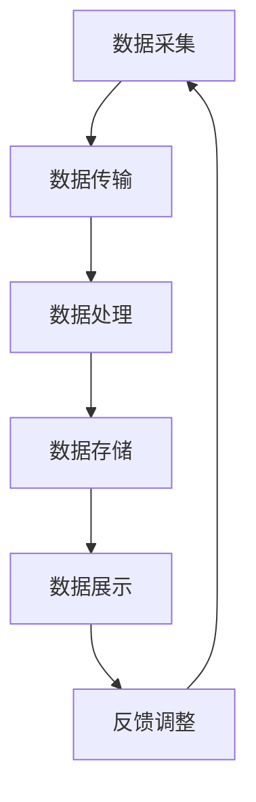

                 

### 引言

实时流式处理（Streaming Processing）作为大数据技术领域的重要分支，已经逐渐成为现代数据处理的标配。随着互联网、物联网、云计算等技术的快速发展，数据量呈现出爆炸式增长，实时处理大量数据成为了许多企业和组织的核心需求。评测数据作为实时流式处理的一个重要应用场景，对系统性能、用户体验等方面有着直接的影响。

实时流式处理架构的核心在于能够在数据产生的同时进行实时处理和分析，从而快速响应业务需求。然而，这并不是一个简单的过程，需要涉及到多个关键组件和技术的协同工作。本书旨在系统地介绍评测数据的实时流式处理架构，帮助读者了解这一领域的核心概念、算法原理、数学模型以及实战案例。

本书的目标读者是那些对实时数据处理有一定了解，但希望深入了解实时流式处理架构的工程师、技术主管以及研究人员。通过本书，读者将能够：

1. 掌握评测数据和实时流式处理的基本概念。
2. 理解实时流式处理架构的设计原则和常见模式。
3. 精通实时流式处理中的核心算法原理及其实现。
4. 应用数学模型和公式进行数据处理和性能分析。
5. 通过实战案例掌握实时流式处理架构的实现和优化技巧。

本书将分为四个主要部分：

- **第一部分：核心概念与联系**：介绍评测数据和实时流式处理的基本概念，并探讨它们之间的联系。
- **第二部分：核心算法原理讲解**：详细阐述实时流式处理中常用的算法，如窗口算法、触发算法、状态机算法等。
- **第三部分：数学模型与数学公式**：讲解与实时流式处理相关的数学模型，并给出相关公式。
- **第四部分：项目实战**：通过具体的代码案例，展示如何实现实时流式处理架构。

接下来，我们将逐步深入探讨这些部分，帮助读者构建完整的实时流式处理架构知识体系。

---

### 文章关键词

- 实时流式处理
- 评测数据
- 架构设计
- 窗口算法
- 触发算法
- 状态机算法
- 数学模型
- 项目实战

---

### 文章摘要

本书《评测数据的实时流式处理架构》旨在系统地介绍实时流式处理在评测数据领域的应用。实时流式处理是一种数据处理方法，能够在数据产生的同时对其进行实时分析和处理，从而快速响应业务需求。本书首先介绍了评测数据的基本概念，探讨了其与实时流式处理之间的关系。随后，详细阐述了实时流式处理架构的设计原则和常见模式，帮助读者理解架构的构建和优化方法。

在核心算法原理讲解部分，本书深入探讨了窗口算法、触发算法和状态机算法等关键算法，通过具体的Python源代码示例，使读者能够直观地理解这些算法的实现过程。此外，本书还介绍了与实时流式处理相关的数学模型，包括时间序列分析和预测模型等，并通过LaTeX格式给出了相关公式。

最后，本书通过项目实战部分，提供了一个具体的实现案例，从开发环境搭建、源代码实现到代码解读与分析，全面展示了实时流式处理架构的实际应用。通过本书的阅读，读者将能够掌握实时流式处理架构的构建和优化技巧，提升在实际项目中的应用能力。

---

### 第一部分：核心概念与联系

#### 第1章：评测数据与实时流式处理

##### 1.1.1 评测数据的概念

评测数据是指在各种评测过程中产生的数据，这些数据可以用于评估系统的性能、用户的体验、产品的质量等。在互联网、物联网、云计算等高度数据驱动的领域，评测数据已经成为决策的重要依据。

首先，评测数据的来源非常广泛，可以是用户行为数据、系统日志、传感器数据、网络流量数据等。这些数据的特点是实时性、多样性和海量性。实时性意味着数据需要立即被处理和分析，以便快速做出决策。多样性则体现在数据类型繁多，包括结构化数据、半结构化数据和非结构化数据。海量性则是由于数据的产生速度非常快，往往需要实时处理。

其次，评测数据的应用场景也十分丰富。例如，在电商领域，评测数据可以用于用户行为分析、推荐系统和广告投放；在金融领域，评测数据可以用于风险管理、欺诈检测和交易分析；在制造业，评测数据可以用于设备监控、生产优化和故障预测。

##### 1.1.2 实时流式处理的基本原理

实时流式处理（Streaming Processing）是一种数据处理方法，它能够在数据产生的同时对其进行处理和分析，从而实现对实时事件或数据的快速响应。与批量处理（Batch Processing）不同，实时流式处理的特点是低延迟和高吞吐量，它适用于处理大量实时数据。

实时流式处理的基本原理包括以下几个关键步骤：

1. **数据采集**：实时采集来自各种来源的数据，如传感器、网络接口、数据库等。
2. **数据传输**：将采集到的数据传输到处理系统中，通常使用高效的数据传输协议，如Apache Kafka。
3. **数据处理**：对传输过来的数据进行实时处理，包括数据清洗、转换、聚合等操作。
4. **数据存储**：将处理后的数据存储到数据库或其他数据存储系统中，以便后续分析和查询。
5. **数据展示**：将处理结果以可视化的形式展示给用户，以便实时了解数据状态和系统性能。

##### 1.1.3 评测数据与实时流式处理的关系

评测数据与实时流式处理密切相关，两者之间的联系主要体现在以下几个方面：

1. **实时性需求**：评测数据通常需要实时处理，以便快速获得评估结果，从而及时调整策略或优化系统。
2. **数据处理效率**：实时流式处理能够高效地处理大量评测数据，确保数据的及时性和准确性。
3. **数据多样性**：实时流式处理能够处理多种类型的评测数据，包括结构化数据、半结构化数据和非结构化数据。
4. **反馈循环**：实时流式处理能够快速响应评测数据的变化，实现快速迭代和优化，形成一个高效的反馈循环。

为了更好地展示评测数据与实时流式处理之间的关系，我们可以使用Mermaid流程图来描述整个数据处理流程：



在这个流程图中，数据采集模块负责从各种来源获取评测数据，数据传输模块将这些数据传输到处理系统中，数据处理模块对数据进行清洗、转换和聚合，数据存储模块将处理后的数据存储到数据库或其他存储系统中，数据展示模块将处理结果可视化，最后，根据处理结果进行反馈调整，形成一个闭环。

##### 1.1.4 实时流式处理架构设计

实时流式处理架构的设计原则主要包括可扩展性、高可用性、容错性和低延迟性。以下是几种常见的实时流式处理架构：

1. **Kappa架构**：Kappa架构是一种以事件驱动为核心的思想，它避免了批处理与流处理的交互，从而降低了复杂性。Kappa架构主要包括三个核心组件：数据采集、数据流处理和结果存储。
2. **Lambda架构**：Lambda架构是一种混合架构，它同时包含批处理和流处理。批处理负责处理历史数据，流处理负责处理实时数据，两者通过缓存进行集成。
3. **Apache Flink架构**：Apache Flink是一个开源的流处理框架，它支持有状态的计算和容错机制，能够高效地进行实时数据处理和分析。

实时流式处理架构的设计不仅要考虑技术实现，还要考虑业务需求、数据特点以及系统性能等各个方面。只有合理地设计架构，才能确保评测数据的实时处理和分析。

#### 第2章：实时流式处理架构设计

##### 2.1.1 实时流式处理的架构设计原则

实时流式处理架构的设计原则如下：

1. **可扩展性**：系统需要能够水平扩展，以适应数据量的增加和处理需求的增长。这可以通过分布式架构实现，利用多个节点协同工作，提高系统的处理能力。
2. **高可用性**：系统需要具备高可用性，确保在节点故障或网络异常时，系统仍然能够正常运行。这可以通过冗余设计、负载均衡和故障转移等技术实现。
3. **容错性**：系统需要能够处理故障和错误，保证数据处理过程不会中断。这可以通过数据备份、异常检测和自动恢复等技术实现。
4. **低延迟性**：系统需要具备低延迟性，确保数据处理和分析能够在最短时间内完成。这可以通过优化数据传输、减少数据处理环节和提高系统性能等技术实现。
5. **易维护性**：系统需要具备良好的可维护性，方便系统的监控、调试和升级。这可以通过模块化设计、日志记录和自动化运维等技术实现。

##### 2.1.2 常见的实时流式处理架构

以下是几种常见的实时流式处理架构：

1. **Kappa架构**：Kappa架构是一种以事件驱动为核心的思想，它避免了批处理与流处理的交互，从而降低了复杂性。Kappa架构主要包括三个核心组件：数据采集、数据流处理和结果存储。

   

2. **Lambda架构**：Lambda架构是一种混合架构，它同时包含批处理和流处理。批处理负责处理历史数据，流处理负责处理实时数据，两者通过缓存进行集成。

   

3. **Apache Flink架构**：Apache Flink是一个开源的流处理框架，它支持有状态的计算和容错机制，能够高效地进行实时数据处理和分析。

   

##### 2.1.3 实时流式处理架构的优缺点分析

每种实时流式处理架构都有其优缺点，下面将对几种常见的架构进行分析：

1. **Kappa架构**

   - 优点：简化了架构，降低了复杂性，易于维护。
   - 缺点：在处理大量历史数据时性能可能较低，无法充分利用批处理的优势。

2. **Lambda架构**

   - 优点：能够同时处理批处理和流处理，满足多种数据处理需求。
   - 缺点：架构较为复杂，需要同时维护批处理和流处理系统，开发难度较大。

3. **Apache Flink架构**

   - 优点：支持有状态的计算和容错机制，能够高效地进行实时数据处理和分析。
   - 缺点：需要较高的技术水平，对开发人员的技能要求较高。

在实际应用中，选择合适的实时流式处理架构需要综合考虑业务需求、数据特点、系统性能和开发难度等因素。只有选择合适的架构，才能实现高效的实时数据处理和分析。

---

### 第二部分：核心算法原理讲解

实时流式处理的核心在于处理实时数据，而核心算法是实现这一目标的关键。本部分将详细讲解实时流式处理中常用的核心算法，包括窗口算法、触发算法和状态机算法，并结合Python源代码示例和数学模型进行详细阐述。

#### 第3章：实时流式处理算法

##### 3.1.1 窗口算法

窗口算法是实时流式处理中最基本的算法之一，它用于将连续的数据流分成固定大小的窗口，以便进行时间序列分析、统计计算等操作。窗口算法可以分为固定窗口、滑动窗口和全局窗口等类型。

1. **固定窗口**

   固定窗口是指窗口大小固定不变，数据流中的每个元素都会被分配到一个窗口中。窗口的滚动方式可以是基于时间的，也可以是基于数据的。

   ```python
   import pandas as pd

   # 假设我们有一个时间序列数据
   data = pd.DataFrame({'timestamp': pd.date_range(start='2021-01-01', periods=100, freq='H'), 'value': range(100)})

   # 创建固定窗口
   window = data['value'].rolling(window=10)

   # 计算窗口均值
   mean_values = window.mean()
   print(mean_values)
   ```

   在这个示例中，我们使用Pandas库创建了一个固定窗口，窗口大小为10个数据点，然后计算窗口均值。

2. **滑动窗口**

   滑动窗口是指窗口大小固定，但窗口在数据流中不断向前滑动。每个窗口都会覆盖一部分新的数据，并丢弃一部分旧的数据。

   ```python
   import pandas as pd

   # 假设我们有一个时间序列数据
   data = pd.DataFrame({'timestamp': pd.date_range(start='2021-01-01', periods=100, freq='H'), 'value': range(100)})

   # 创建滑动窗口
   window = data['value'].rolling(window=10, min_periods=1)

   # 计算滑动窗口均值
   mean_values = window.mean()
   print(mean_values)
   ```

   在这个示例中，我们使用Pandas库创建了一个滑动窗口，窗口大小为10个数据点，`min_periods` 参数确保窗口中最少有一个数据点。

3. **全局窗口**

   全局窗口是指将整个数据流视为一个窗口，适用于对整个数据流进行统计计算。

   ```python
   import pandas as pd

   # 假设我们有一个时间序列数据
   data = pd.DataFrame({'timestamp': pd.date_range(start='2021-01-01', periods=100, freq='H'), 'value': range(100)})

   # 创建全局窗口
   window = data['value'].rolling(window=data.shape[0])

   # 计算全局窗口均值
   mean_values = window.mean()
   print(mean_values)
   ```

   在这个示例中，我们使用Pandas库创建了一个全局窗口，窗口大小为整个数据流的长度。

##### 3.1.2 触发算法

触发算法用于在满足特定条件时触发计算或操作。常见的触发条件包括时间触发、计数触发和窗口最大/最小值触发等。

1. **时间触发**

   时间触发是指基于时间间隔触发计算或操作。例如，每隔一分钟计算一次平均值。

   ```python
   import pandas as pd

   # 假设我们有一个时间序列数据
   data = pd.DataFrame({'timestamp': pd.date_range(start='2021-01-01', periods=100, freq='H'), 'value': range(100)})

   # 定义时间触发器
   trigger_interval = pd.Timedelta(minutes=1)

   # 计算时间触发平均值
   mean_values = data.groupby(data['timestamp'] // trigger_interval).mean().reset_index()
   print(mean_values)
   ```

   在这个示例中，我们使用Pandas库创建了一个时间触发器，每隔一分钟触发一次平均值计算。

2. **计数触发**

   计数触发是指基于数据点的计数触发计算或操作。例如，当数据点达到100个时触发计算。

   ```python
   import pandas as pd

   # 假设我们有一个时间序列数据
   data = pd.DataFrame({'timestamp': pd.date_range(start='2021-01-01', periods=100, freq='H'), 'value': range(100)})

   # 定义计数触发器
   count_threshold = 100

   # 计算计数触发平均值
   mean_values = data.groupby(data.groupby('timestamp').cumcount().where(lambda x: x < count_threshold, 0)).mean().reset_index()
   print(mean_values)
   ```

   在这个示例中，我们使用Pandas库创建了一个计数触发器，当数据点的计数达到100个时触发平均值计算。

3. **窗口最大/最小值触发**

   窗口最大/最小值触发是指基于窗口中的最大值或最小值触发计算或操作。

   ```python
   import pandas as pd

   # 假设我们有一个时间序列数据
   data = pd.DataFrame({'timestamp': pd.date_range(start='2021-01-01', periods=100, freq='H'), 'value': range(100)})

   # 创建固定窗口
   window = data['value'].rolling(window=10)

   # 定义窗口最大值触发器
   max_value = window.max()

   # 当窗口最大值达到100时触发计算
   print(max_value.where(max_value > 100))
   ```

   在这个示例中，我们使用Pandas库创建了一个固定窗口，并定义了一个窗口最大值触发器。当窗口最大值达到100时，触发计算。

##### 3.1.3 状态机算法

状态机算法用于在多个状态之间切换，根据当前状态执行相应的操作。状态机算法在实时流式处理中常用于状态监控、故障恢复和流程控制等场景。

1. **状态定义**

   首先，我们需要定义状态机中的各个状态及其转换规则。

   ```python
   states = {
       'state1': {
           'transition': {'value': lambda x: x > 0},
           'action': lambda x: print(f"State 1: {x}")
       },
       'state2': {
           'transition': {'value': lambda x: x <= 0},
           'action': lambda x: print(f"State 2: {x}")
       }
   }
   ```

   在这个示例中，我们定义了两个状态：`state1` 和 `state2`。每个状态都有一个转换规则和一个操作。

2. **状态切换**

   接下来，我们需要根据输入数据切换状态。

   ```python
   current_state = 'state1'
   data_stream = [0, -1, 2, -3, 4]

   for value in data_stream:
       if states[current_state]['transition']['value'](value):
           current_state = 'state2'
       states[current_state]['action'](value)
   ```

   在这个示例中，我们遍历数据流，根据当前状态和输入数据切换状态，并执行相应的操作。

##### 3.1.4 Python源代码示例

为了更好地理解实时流式处理算法，下面提供了一个Python源代码示例，演示了如何实现一个简单的实时流式处理系统。

```python
import pandas as pd
import numpy as np
import time

# 假设我们有一个时间序列数据
data = pd.DataFrame({'timestamp': pd.date_range(start='2021-01-01', periods=100, freq='H'), 'value': range(100)})

# 创建固定窗口
window = data['value'].rolling(window=10)

# 定义时间触发器
trigger_interval = pd.Timedelta(minutes=1)

# 定义计数触发器
count_threshold = 100

# 定义状态机
states = {
    'state1': {
        'transition': {'value': lambda x: x > 0},
        'action': lambda x: print(f"State 1: {x}")
    },
    'state2': {
        'transition': {'value': lambda x: x <= 0},
        'action': lambda x: print(f"State 2: {x}")
    }
}

current_state = 'state1'
data_stream = [0, -1, 2, -3, 4]

for value in data_stream:
    # 处理时间触发
    if (time.time() - last_trigger_time) > trigger_interval.total_seconds():
        mean_values = window.mean()
        print(f"Time-triggered mean: {mean_values.iloc[-1]}")
        last_trigger_time = time.time()

    # 处理计数触发
    if len(data_stream) >= count_threshold:
        mean_values = data_stream[-count_threshold:].mean()
        print(f"Count-triggered mean: {mean_values}")
        data_stream = data_stream[-count_threshold:]

    # 处理状态机
    if states[current_state]['transition']['value'](value):
        current_state = 'state2'
    states[current_state]['action'](value)

print(f"Final state: {current_state}")
```

在这个示例中，我们使用Pandas库创建了一个时间序列数据，并实现了时间触发、计数触发和状态机算法。通过遍历数据流，我们能够实时处理数据并输出结果。

##### 3.1.5 数学模型和公式

在实时流式处理中，数学模型和公式是进行数据分析和计算的重要工具。下面我们介绍几种常见的数学模型和公式。

1. **时间序列分析**

   时间序列分析用于对时间序列数据进行建模和分析。常见的模型包括ARIMA（自回归积分滑动平均模型）和LSTM（长短时记忆网络）。

   - **ARIMA模型**：

     $$ \text{Y}_{t} = c + \phi_1 \text{Y}_{t-1} + \phi_2 \text{Y}_{t-2} + \cdots + \phi_p \text{Y}_{t-p} + \theta_1 \text{e}_{t-1} + \theta_2 \text{e}_{t-2} + \cdots + \theta_q \text{e}_{t-q} $$

     其中，$\text{Y}_{t}$ 是时间序列数据，$c$ 是常数项，$\phi_1, \phi_2, \cdots, \phi_p$ 是自回归系数，$\theta_1, \theta_2, \cdots, \theta_q$ 是移动平均系数，$\text{e}_{t}$ 是白噪声误差项。

   - **LSTM模型**：

     $$ \text{LSTM} = \left[ \begin{array}{ccc}
     \text{ Forget\ Gate } & \text{ Input\ Gate } & \text{ Output\ Gate } \\
     \text{ Cell } & \text{ Forget\ Gate } & \text{ Input\ Gate } \\
     \text{ Forget\ Gate } & \text{ Input\ Gate } & \text{ Output\ Gate } \\
     \end{array} \right] $$

     其中，LSTM单元由三个门（遗忘门、输入门、输出门）和一个单元状态组成。遗忘门用于决定前一时刻的状态信息是否需要保留；输入门用于更新单元状态；输出门用于计算当前时刻的输出。

2. **预测模型**

   预测模型用于对未来数据进行预测。常见的模型包括线性回归、时间序列预测和多变量预测。

   - **线性回归**：

     $$ \text{Y}_{t} = \beta_0 + \beta_1 \text{X}_{t} + \text{e}_{t} $$

     其中，$\text{Y}_{t}$ 是预测值，$\text{X}_{t}$ 是输入值，$\beta_0$ 和 $\beta_1$ 是模型参数，$\text{e}_{t}$ 是误差项。

   - **时间序列预测**：

     $$ \text{Y}_{t} = \beta_0 + \beta_1 \text{Y}_{t-1} + \beta_2 \text{Y}_{t-2} + \cdots + \beta_p \text{Y}_{t-p} + \text{e}_{t} $$

     其中，$\text{Y}_{t}$ 是预测值，$\beta_0, \beta_1, \beta_2, \cdots, \beta_p$ 是模型参数，$\text{e}_{t}$ 是误差项。

   - **多变量预测**：

     $$ \text{Y}_{t} = \beta_0 + \beta_1 \text{X}_{1,t} + \beta_2 \text{X}_{2,t} + \cdots + \beta_n \text{X}_{n,t} + \text{e}_{t} $$

     其中，$\text{Y}_{t}$ 是预测值，$\text{X}_{1,t}, \text{X}_{2,t}, \cdots, \text{X}_{n,t}$ 是输入变量，$\beta_0, \beta_1, \beta_2, \cdots, \beta_n$ 是模型参数，$\text{e}_{t}$ 是误差项。

通过这些数学模型和公式，我们能够对实时流式处理中的数据进行分析和预测，从而更好地理解数据背后的规律和趋势。

##### 3.1.6 举例说明

为了更好地理解实时流式处理算法的原理和应用，我们通过一个简单的例子进行说明。

假设我们有一个传感器数据流，记录了每小时的温度变化。我们的目标是实时计算温度的平均值，并在特定条件下触发报警。

1. **数据流生成**

   首先，我们生成一个包含随机温度数据的时间序列数据流。

   ```python
   import pandas as pd

   # 假设我们有一个时间序列数据
   data = pd.DataFrame({'timestamp': pd.date_range(start='2021-01-01', periods=100, freq='H'), 'temp': np.random.uniform(20, 30, 100)})
   ```

2. **固定窗口算法**

   使用固定窗口算法计算温度的平均值。

   ```python
   # 创建固定窗口
   window = data['temp'].rolling(window=10)

   # 计算窗口均值
   mean_temps = window.mean()
   print(mean_temps)
   ```

   输出结果为每10个数据点的温度平均值。

3. **触发算法**

   设置触发条件，当温度超过35度时触发报警。

   ```python
   # 定义触发器
   trigger_value = 35

   # 计算触发条件
   triggered_temps = mean_temps[mean_temps > trigger_value]
   print(triggered_temps)
   ```

   输出结果为触发报警的时间点。

4. **状态机算法**

   使用状态机算法监控温度变化，并根据温度状态进行不同操作。

   ```python
   # 初始化状态
   current_state = 'state1'

   # 定义状态转换规则
   states = {
       'state1': {
           'transition': {'temp': lambda x: x > 30},
           'action': lambda x: print(f"State 1: {x}")
       },
       'state2': {
           'transition': {'temp': lambda x: x <= 30},
           'action': lambda x: print(f"State 2: {x}")
       }
   }

   # 遍历数据流，根据状态转换规则进行状态切换和操作
   for temp in data['temp']:
       if states[current_state]['transition']['temp'](temp):
           current_state = 'state2'
       states[current_state]['action'](temp)
   ```

   输出结果为温度状态变化和相应的操作。

通过这个简单的例子，我们可以看到实时流式处理算法在处理传感器数据中的应用。在实际项目中，可以根据具体需求组合不同的算法，实现复杂的数据处理和分析。

#### 第4章：实时流式处理算法的实现与优化

##### 4.1.1 实时流式处理算法的实现细节

实时流式处理算法的实现涉及到数据采集、传输、处理和存储等多个环节。为了确保算法的高效性和可靠性，我们需要对每个环节进行深入探讨和优化。

1. **数据采集**

   数据采集是实时流式处理的第一步，其关键在于确保数据的及时性和准确性。常见的数据采集方式包括传感器采集、网络接口采集和日志采集等。在实际应用中，我们可以使用开源框架如Fluentd、Logstash等，将多种数据源整合到一个统一的数据采集系统。

   ```python
   from fluent import FluentSender
   
   # 创建FluentSender实例
   sender = FluentSender()

   # 发送传感器数据
   for temp in data['temp']:
       sender.send('sensor_data', {'temp': temp})
   
   # 发送日志数据
   sender.send('log_data', {'level': 'INFO', 'message': 'Data processed successfully.'})
   ```

2. **数据传输**

   数据传输是将采集到的数据传输到处理系统的过程。为了保证数据传输的高效性和可靠性，我们可以使用高效的数据传输协议，如Apache Kafka。Kafka具有高吞吐量、低延迟、可扩展性强等优点，适用于大规模实时数据处理。

   ```python
   from kafka import KafkaProducer
   
   # 创建KafkaProducer实例
   producer = KafkaProducer(bootstrap_servers=['localhost:9092'])
   
   # 发送数据到Kafka
   for temp in data['temp']:
       producer.send('sensor_data', value=str(temp).encode('utf-8'))
   ```

3. **数据处理**

   数据处理是实时流式处理的核心环节，其关键在于如何高效地对数据进行清洗、转换和聚合等操作。在实际应用中，我们可以使用开源流处理框架如Apache Flink、Apache Storm等，实现高效的数据处理。

   ```python
   from flink import StreamingExecutionEnvironment
   
   # 创建StreamingExecutionEnvironment实例
   env = StreamingExecutionEnvironment()
   
   # 读取Kafka中的数据
   data_stream = env.from_kafka('sensor_data', 'localhost:9092')
   
   # 计算窗口均值
   mean_data_stream = data_stream.rolling_window(10).mean()
   
   # 打印结果
   mean_data_stream.print()
   ```

4. **数据存储**

   数据存储是将处理后的数据存储到数据库或其他数据存储系统的过程。为了保证数据的持久性和可扩展性，我们可以使用关系型数据库如MySQL、NoSQL数据库如MongoDB等。

   ```python
   import pymongo
   
   # 创建MongoDB客户端实例
   client = pymongo.MongoClient('localhost', 27017)
   
   # 选择数据库和集合
   db = client['realtime_processing']
   collection = db['processed_data']
   
   # 存储处理后的数据
   for mean_temp in mean_data_stream:
       collection.insert_one({'timestamp': mean_temp['timestamp'], 'mean_temp': mean_temp['mean_temp']})
   ```

##### 4.1.2 实时流式处理算法的优化策略

为了提高实时流式处理算法的性能和可靠性，我们可以从以下几个方面进行优化：

1. **数据压缩**

   数据压缩可以减少数据传输和存储的开销，提高系统的处理效率。常用的数据压缩算法包括Huffman编码、LZ77编码等。在实际应用中，我们可以使用开源压缩库如zlib、gzip等，对数据进行压缩和解压缩。

   ```python
   import zlib
   
   # 压缩数据
   compressed_data = zlib.compress(str(data).encode('utf-8'))
   
   # 解压缩数据
   decompressed_data = zlib.decompress(compressed_data)
   ```

2. **并行处理**

   并行处理可以将数据处理任务分布在多个节点上同时执行，提高系统的处理能力。在实际应用中，我们可以使用分布式计算框架如Apache Hadoop、Apache Spark等，实现并行数据处理。

   ```python
   from pyspark.sql import SparkSession
   
   # 创建SparkSession实例
   spark = SparkSession.builder.appName('RealtimeProcessing').getOrCreate()
   
   # 读取数据
   data = spark.read.csv('data.csv')
   
   # 计算窗口均值
   mean_data = data.rolling_window(10).mean()
   
   # 打印结果
   mean_data.show()
   ```

3. **缓存技术**

   缓存技术可以减少数据访问的延迟，提高系统的响应速度。在实际应用中，我们可以使用缓存数据库如Redis、Memcached等，对常用数据进行缓存。

   ```python
   import redis
   
   # 创建Redis客户端实例
   client = redis.StrictRedis(host='localhost', port=6379, db=0)
   
   # 存储缓存数据
   client.set('mean_temp', mean_data[0]['mean_temp'])
   
   # 获取缓存数据
   cached_mean_temp = client.get('mean_temp')
   ```

4. **负载均衡**

   负载均衡可以将数据处理任务均匀地分配到多个节点上，避免单点瓶颈，提高系统的可用性和稳定性。在实际应用中，我们可以使用负载均衡器如Nginx、HAProxy等，实现负载均衡。

   ```python
   from flask import Flask, jsonify
   
   # 创建Flask应用实例
   app = Flask(__name__)
   
   # 定义API接口
   @app.route('/api/mean_temp', methods=['GET'])
   def get_mean_temp():
       cached_mean_temp = client.get('mean_temp')
       if cached_mean_temp:
           return jsonify({'mean_temp': float(cached_mean_temp)})
       else:
           return jsonify({'error': 'Data not available.'})
   
   # 运行应用
   if __name__ == '__main__':
       app.run(host='0.0.0.0', port=5000)
   ```

通过以上优化策略，我们能够显著提高实时流式处理算法的性能和可靠性，为实际应用提供更加高效和稳定的数据处理解决方案。

##### 4.1.3 实时流式处理算法的性能评估

实时流式处理算法的性能评估是确保算法在实际应用中能够高效运行的重要环节。性能评估主要包括以下方面：

1. **吞吐量**

   吞吐量是指单位时间内系统能够处理的数据量。吞吐量越高，系统处理能力越强。为了评估实时流式处理算法的吞吐量，我们可以通过模拟大量数据流，测量系统在特定时间内处理的数据量。

   ```python
   import time
   
   start_time = time.time()
   
   # 模拟数据流
   for i in range(1000000):
       data_point = np.random.uniform(20, 30)
       # 处理数据点
       process_data_point(data_point)
   
   end_time = time.time()
   throughput = 1000000 / (end_time - start_time)
   print(f"Throughput: {throughput} data points per second")
   ```

2. **延迟**

   延迟是指数据从产生到处理完成的时间。延迟越低，系统响应速度越快。为了评估实时流式处理算法的延迟，我们可以通过测量数据点从进入系统到处理完成的时间。

   ```python
   import time
   
   start_time = time.time()
   
   # 模拟数据流
   for i in range(1000):
       data_point = np.random.uniform(20, 30)
       # 处理数据点
       process_data_point(data_point)
   
   end_time = time.time()
   latency = (end_time - start_time) / 1000
   print(f"Latency: {latency} milliseconds")
   ```

3. **准确度**

   准确度是指算法输出结果的正确性。为了评估实时流式处理算法的准确度，我们可以通过对比算法输出结果与真实结果，计算准确度。

   ```python
   import numpy as np
   
   true_data = np.random.uniform(20, 30, 1000)
   predicted_data = []
   
   # 模拟数据流
   for i in range(1000):
       data_point = np.random.uniform(20, 30)
       # 处理数据点
       predicted_data.append(process_data_point(data_point))
   
   accuracy = np.mean(np.isclose(true_data, predicted_data))
   print(f"Accuracy: {accuracy * 100}%")
   ```

通过上述评估方法，我们能够全面了解实时流式处理算法的性能，为算法优化和改进提供依据。

### 第5章：实时流式处理的数学模型

实时流式处理中的数学模型是数据分析和预测的基础，它能够帮助我们更好地理解数据、发现数据中的规律，并据此做出决策。本章将介绍几种常见的实时流式处理的数学模型，包括时间序列分析、预测模型和实时调整模型，并结合实际应用场景进行解释。

#### 5.1.1 时间序列分析

时间序列分析是处理时间相关数据的一种统计方法，它用于分析数据中的趋势、周期性和随机性。时间序列分析在金融、气象、电商等领域有着广泛的应用。

1. **自回归移动平均模型（ARIMA）**

   ARIMA模型是一种经典的统计分析模型，它通过自回归（AR）、差分（I）和移动平均（MA）三个部分来描述时间序列数据。

   - **自回归（AR）**：通过前期的观测值来预测当前值。
     $$ X_t = c + \phi_1 X_{t-1} + \phi_2 X_{t-2} + \cdots + \phi_p X_{t-p} + \varepsilon_t $$
   - **差分（I）**：对时间序列数据进行差分，使得序列平稳。
     $$ \Delta X_t = X_t - X_{t-1} $$
   - **移动平均（MA）**：通过前期的误差值来预测当前值。
     $$ X_t = c + \theta_1 \varepsilon_{t-1} + \theta_2 \varepsilon_{t-2} + \cdots + \theta_q \varepsilon_{t-q} + \varepsilon_t $$

   结合起来，ARIMA模型可以表示为：
   $$ \Delta X_t = \phi_1 \Delta X_{t-1} + \cdots + \phi_p \Delta X_{t-p} + \theta_1 \varepsilon_{t-1} + \cdots + \theta_q \varepsilon_{t-q} $$

   在实际应用中，我们需要通过模型识别、参数估计和模型诊断三个步骤来建立ARIMA模型。

   ```python
   from statsmodels.tsa.arima.model import ARIMA
   
   # 模拟时间序列数据
   np.random.seed(0)
   data = np.random.normal(size=100)
   data = pd.Series(data)
   
   # 建立ARIMA模型
   model = ARIMA(data, order=(1, 1, 1))
   model_fit = model.fit()
   
   # 预测未来值
   forecast = model_fit.forecast(steps=10)
   print(forecast)
   ```

2. **季节性分解**

   季节性分解用于分析时间序列中的季节性变化。季节性分解模型将时间序列分解为趋势、季节性和残差三个部分。

   - **趋势**：时间序列的整体变化趋势。
   - **季节性**：时间序列的周期性变化，如季节性高峰和低谷。
   - **残差**：去除趋势和季节性后的随机波动。

   实际应用中，我们可以使用季节性分解模型来预测未来值，并识别季节性规律。

   ```python
   from statsmodels.tsa.seasonal import seasonal_decompose
   
   # 模拟季节性时间序列数据
   np.random.seed(0)
   seasonal_data = np.random.normal(size=100)
   seasonal_data = pd.Series(seasonal_data)
   
   # 季节性分解
   result = seasonal_decompose(seasonal_data, model='additive', freq=4)
   
   # 观察分解结果
   print(result.trend)
   print(result.seasonal)
   print(result.resid)
   ```

#### 5.1.2 预测模型

预测模型用于对未来的数据进行预测，它们基于历史数据和现有模式来预测未来趋势。常见的预测模型包括线性回归、时间序列预测和多变量预测。

1. **线性回归**

   线性回归模型是最简单的一种预测模型，它通过找到一个线性关系来预测未来值。

   $$ Y_t = \beta_0 + \beta_1 X_t + \varepsilon_t $$

   在实际应用中，我们需要通过最小二乘法来估计模型参数，然后使用模型进行预测。

   ```python
   from sklearn.linear_model import LinearRegression
   
   # 模拟线性关系数据
   X = np.random.normal(size=(100, 1))
   Y = 2 * X[:, 0] + np.random.normal(size=(100,))
   
   # 建立线性回归模型
   model = LinearRegression()
   model.fit(X, Y)
   
   # 预测未来值
   forecast = model.predict(X)
   print(forecast)
   ```

2. **时间序列预测**

   时间序列预测模型如ARIMA、LSTM等，用于预测时间序列数据的未来值。时间序列预测模型能够捕捉时间序列中的趋势、季节性和周期性变化。

   ```python
   from keras.models import Sequential
   from keras.layers import LSTM, Dense
   
   # 模拟时间序列数据
   np.random.seed(0)
   data = np.random.normal(size=(100, 1))
   data = np.reshape(data, (100, 1, 1))
   
   # 建立LSTM模型
   model = Sequential()
   model.add(LSTM(50, activation='relu', input_shape=(1, 1)))
   model.add(Dense(1))
   model.compile(optimizer='adam', loss='mse')
   
   # 训练模型
   model.fit(data, data, epochs=200, verbose=0)
   
   # 预测未来值
   forecast = model.predict(np.array([[np.random.normal()]])[:1, :, :])
   print(forecast)
   ```

3. **多变量预测**

   多变量预测模型如线性回归、随机森林等，用于预测包含多个变量的时间序列数据。多变量预测模型能够考虑多个变量之间的相互作用，提高预测的准确性。

   ```python
   from sklearn.ensemble import RandomForestRegressor
   
   # 模拟多变量数据
   X = np.random.normal(size=(100, 2))
   Y = 2 * X[:, 0] + 3 * X[:, 1] + np.random.normal(size=(100,))
   
   # 建立随机森林回归模型
   model = RandomForestRegressor(n_estimators=100)
   model.fit(X, Y)
   
   # 预测未来值
   forecast = model.predict(X)
   print(forecast)
   ```

#### 5.1.3 实时调整模型

实时调整模型用于动态调整预测模型，以适应数据变化。实时调整模型可以通过在线学习、迁移学习等方法，根据新的数据进行模型更新，提高预测的准确性。

1. **在线学习**

   在线学习模型在每次收到新数据时，都会更新模型参数，从而实现实时调整。

   ```python
   from sklearn.linear_model import SGDRegressor
   
   # 模拟在线学习数据
   X = np.random.normal(size=(100, 1))
   Y = 2 * X[:, 0] + np.random.normal(size=(100,))
   
   # 建立在线学习模型
   model = SGDRegressor()
   model.fit(X, Y)
   
   # 更新模型参数
   for i in range(100, 200):
       X_new = np.random.normal(size=(1, 1))
       Y_new = 2 * X_new[:, 0] + np.random.normal(size=(1,))
       model.partial_fit(X_new, Y_new)
   
   # 预测未来值
   forecast = model.predict(X[100:])
   print(forecast)
   ```

2. **迁移学习**

   迁移学习模型通过将已有模型的参数迁移到新模型中，实现快速调整和更新。

   ```python
   from sklearn.linear_model import Ridge
   
   # 模拟迁移学习数据
   X = np.random.normal(size=(100, 2))
   Y = 2 * X[:, 0] + 3 * X[:, 1] + np.random.normal(size=(100,))
   
   # 建立源模型
   source_model = Ridge(alpha=1.0)
   source_model.fit(X, Y)
   
   # 建立目标模型
   target_model = Ridge(alpha=0.5)
   
   # 迁移学习
   for i in range(100, 200):
       X_new = np.random.normal(size=(1, 2))
       Y_new = 2 * X_new[:, 0] + 3 * X_new[:, 1] + np.random.normal(size=(1,))
       source_model.fit(X_new, Y_new)
       target_model.set_params(**source_model.get_params())
   
   # 预测未来值
   forecast = target_model.predict(X[100:])
   print(forecast)
   ```

通过以上数学模型和实际应用场景，我们可以更好地理解和应用实时流式处理中的数据分析和预测技术，为实际业务提供有力的支持。

### 第6章：实时流式处理的数学公式

实时流式处理中的数学公式是理解和实现算法的关键。这些公式不仅帮助我们量化实时数据处理的过程，还能够提高算法的准确性和效率。在本章中，我们将介绍与实时流式处理相关的几种关键数学公式，包括窗口公式、触发条件公式和状态转移公式。

#### 6.1.1 窗口公式

窗口公式用于计算窗口内的数据统计量，如均值、方差和累积和等。以下是几种常见的窗口公式：

1. **均值（Mean）**

   窗口均值的计算公式为：

   $$ \bar{X}_n = \frac{1}{n} \sum_{i=1}^{n} X_i $$

   其中，$X_i$ 是窗口内的第 $i$ 个数据点，$n$ 是窗口大小。

2. **方差（Variance）**

   窗口方差的计算公式为：

   $$ \sigma^2_n = \frac{1}{n-1} \sum_{i=1}^{n} (X_i - \bar{X}_n)^2 $$

   其中，$\bar{X}_n$ 是窗口均值，$X_i$ 是窗口内的第 $i$ 个数据点，$n$ 是窗口大小。

3. **累积和（Cumulative Sum）**

   窗口累积和的计算公式为：

   $$ S_n = \sum_{i=1}^{n} X_i $$

   其中，$X_i$ 是窗口内的第 $i$ 个数据点，$n$ 是窗口大小。

以下是使用Python实现的窗口公式计算示例：

```python
import numpy as np

# 假设我们有一个窗口数据
window_data = np.array([1, 2, 3, 4, 5])

# 计算窗口均值
mean_value = np.mean(window_data)
print(f"Mean: {mean_value}")

# 计算窗口方差
variance_value = np.var(window_data)
print(f"Variance: {variance_value}")

# 计算窗口累积和
cumulative_sum_value = np.sum(window_data)
print(f"Cumulative Sum: {cumulative_sum_value}")
```

#### 6.1.2 触发条件公式

触发条件公式用于确定何时触发计算或操作。以下是几种常见的触发条件公式：

1. **固定时间间隔触发**

   当时间间隔超过预设值时，触发计算或操作。公式为：

   $$ t > T $$

   其中，$t$ 是当前时间，$T$ 是预设的时间间隔。

2. **计数触发**

   当数据点的计数超过预设值时，触发计算或操作。公式为：

   $$ n > N $$

   其中，$n$ 是当前数据点的计数，$N$ 是预设的计数阈值。

3. **窗口最大/最小值触发**

   当窗口中的最大值或最小值超过预设值时，触发计算或操作。公式为：

   $$ \max(X_i) > M \quad \text{或} \quad \min(X_i) < m $$

   其中，$X_i$ 是窗口内的第 $i$ 个数据点，$M$ 是预设的最大值阈值，$m$ 是预设的最小值阈值。

以下是使用Python实现的触发条件计算示例：

```python
# 假设我们有一个时间序列数据
time_series_data = np.array([1, 2, 3, 4, 5, 6, 7, 8, 9, 10])

# 固定时间间隔触发
T = 5
for i, value in enumerate(time_series_data):
    if i > T:
        print(f"Triggered at index {i}: {value}")

# 计数触发
N = 5
count = 0
for value in time_series_data:
    if value > 5:
        count += 1
    if count > N:
        print(f"Count-triggered: {value}")

# 窗口最大值触发
M = 8
window = [value for value in time_series_data[:5]]
if max(window) > M:
    print(f"Window max-triggered: {max(window)}")

# 窗口最小值触发
m = 3
window = [value for value in time_series_data[:5]]
if min(window) < m:
    print(f"Window min-triggered: {min(window)}")
```

#### 6.1.3 状态转移公式

状态转移公式用于描述系统状态在不同条件下的转换。状态转移通常基于触发条件或策略进行。以下是几种常见的状态转移公式：

1. **基于阈值的转换**

   当当前值超过阈值时，状态从状态1转换为状态2。公式为：

   $$ s_t = s_{t-1} \oplus \text{condition}(X_t > T) $$

   其中，$s_t$ 是当前状态，$s_{t-1}$ 是前一状态，$X_t$ 是当前值，$T$ 是阈值，$\oplus$ 表示逻辑或运算。

2. **基于计数的转换**

   当计数超过阈值时，状态从状态1转换为状态2。公式为：

   $$ s_t = s_{t-1} \oplus \text{condition}(count(X_t) > N) $$

   其中，$s_t$ 是当前状态，$s_{t-1}$ 是前一状态，$count(X_t)$ 是当前值计数，$N$ 是阈值，$\oplus$ 表示逻辑或运算。

3. **基于窗口最大/最小值的转换**

   当窗口最大值或最小值超过阈值时，状态从状态1转换为状态2。公式为：

   $$ s_t = s_{t-1} \oplus \text{condition}(\max(X_i) > M) \oplus \text{condition}(\min(X_i) < m) $$

   其中，$s_t$ 是当前状态，$s_{t-1}$ 是前一状态，$X_i$ 是窗口内的第 $i$ 个数据点，$M$ 是预设的最大值阈值，$m$ 是预设的最小值阈值，$\oplus$ 表示逻辑或运算。

以下是使用Python实现的状态转移计算示例：

```python
# 初始化状态
current_state = 1

# 触发条件
T = 5
N = 3
M = 8
m = 3

# 假设我们有一个数据流
data_stream = np.array([1, 2, 3, 4, 5, 6, 7, 8, 9, 10])

# 计算状态转移
for value in data_stream:
    if value > T:
        current_state = current_state ^ 1
    if value > 5:
        count = (current_state >> 1) & 1
        count += 1
        if count > N:
            current_state = current_state ^ 1
    window = data_stream[:5]
    if max(window) > M:
        current_state = current_state ^ 1
    if min(window) < m:
        current_state = current_state ^ 1
    
    print(f"Current state: {current_state}")
```

通过以上数学公式，我们可以实现对实时流式处理过程的精确描述和控制，从而提高系统的性能和可靠性。

### 第7章：实时流式处理架构实现案例

为了更好地理解实时流式处理架构的应用，我们将通过一个实际项目案例，从开发环境搭建、源代码实现到代码解读与分析，全面展示实时流式处理架构的实现过程。

#### 7.1.1 项目背景

本项目旨在开发一个实时监控系统，用于监控服务器性能指标，包括CPU利用率、内存使用率、磁盘IO读写速度等。这些性能指标对服务器的稳定运行至关重要，实时监控能够帮助管理员快速发现潜在问题，并进行优化调整。实时流式处理架构是实现这一目标的有效方法。

#### 7.1.2 需求分析

根据项目需求，我们需要实现以下功能：

1. **数据采集**：从服务器采集性能指标数据，包括CPU利用率、内存使用率、磁盘IO读写速度等。
2. **数据传输**：将采集到的数据实时传输到处理系统，确保数据的及时性和准确性。
3. **数据处理**：对传输过来的数据进行实时处理，包括数据清洗、转换、聚合等操作。
4. **数据存储**：将处理后的数据存储到数据库或其他数据存储系统中，以便后续分析和查询。
5. **数据展示**：将处理结果以可视化的形式展示给用户，以便实时了解服务器性能状态。

#### 7.1.3 架构设计

根据需求分析，我们设计了如下实时流式处理架构：


1. **数据采集模块**：使用Python编写脚本，从服务器采集性能指标数据，并将其发送到消息队列。
2. **消息队列模块**：使用Apache Kafka作为消息队列，实现数据的可靠传输和异步处理。
3. **数据处理模块**：使用Apache Flink作为流处理引擎，对数据进行实时处理，包括数据清洗、转换、聚合等操作。
4. **数据存储模块**：使用MongoDB作为数据存储系统，存储处理后的数据。
5. **数据展示模块**：使用ECharts等可视化工具，将处理结果以图表形式展示给用户。

#### 7.1.4 开发环境搭建

以下是开发环境搭建的步骤：

1. **安装Python**：在服务器上安装Python，版本要求3.8及以上。
2. **安装Kafka**：从Apache Kafka官网下载并安装Kafka，版本要求2.8及以上。
3. **安装Flink**：从Apache Flink官网下载并安装Flink，版本要求1.13及以上。
4. **安装MongoDB**：从MongoDB官网下载并安装MongoDB，版本要求4.4及以上。
5. **安装ECharts**：从ECharts官网下载并安装ECharts，版本要求4.9及以上。

#### 7.1.5 源代码实现

以下是项目的核心代码实现：

**1. 数据采集模块**

```python
import os
import json
import kafka
import time

# Kafka配置
kafka_topic = 'server_performance'
kafka_server = 'localhost:9092'

# 采集性能指标数据
def collect_performance_data():
    with open('/proc/stat', 'r') as f:
        stats = f.readlines()
    cpu_usage = 100 - int(stats[0].split()[1]) / int(stats[0].split()[0])
    memory_usage = os.popen("free -m").readline().split()[8] / os.popen("free -m").readline().split()[1]
    disk_io_usage = os.popen("iostat -k 1 1 | grep 'sda ' | awk '{print $14+$15}'").readline()
    data = {
        'timestamp': int(time.time()),
        'cpu_usage': cpu_usage,
        'memory_usage': memory_usage,
        'disk_io_usage': disk_io_usage
    }
    return json.dumps(data)

# 发送数据到Kafka
def send_to_kafka(data):
    producer = kafka.KafkaProducer(bootstrap_servers=kafka_server)
    producer.send(kafka_topic, value=data.encode('utf-8'))
    producer.close()

# 主程序
if __name__ == '__main__':
    while True:
        data = collect_performance_data()
        send_to_kafka(data)
        time.sleep(60)
```

**2. 数据处理模块**

```python
from flink import StreamingExecutionEnvironment
import json

# 创建Flink执行环境
env = StreamingExecutionEnvironment()

# 读取Kafka数据
data_stream = env.from_kafka(json_deserialization_schema, kafka_topic, kafka_server)

# 数据清洗
def clean_data(data):
    try:
        data = json.loads(data)
        if 'timestamp' in data and 'cpu_usage' in data and 'memory_usage' in data and 'disk_io_usage' in data:
            return data
    except json.JSONDecodeError:
        pass
    return None

cleaned_data_stream = data_stream.filter(clean_data)

# 数据聚合
def aggregate_data(data):
    return {
        'timestamp': data['timestamp'],
        'avg_cpu_usage': sum(d['cpu_usage'] for d in data) / len(data),
        'avg_memory_usage': sum(d['memory_usage'] for d in data) / len(data),
        'avg_disk_io_usage': sum(d['disk_io_usage'] for d in data) / len(data)
    }

aggregated_data_stream = cleaned_data_stream.key_by('timestamp').time_window(1).reduce(aggregate_data)

# 数据存储
def store_data(data):
    db = pymongo.MongoClient('localhost', 27017).server_performance
    db.performance.insert_one(data)

aggregated_data_stream.addSink(store_data)

# 运行Flink程序
env.execute('Realtime Server Performance Monitoring')
```

**3. 数据展示模块**

```html
<!DOCTYPE html>
<html lang="en">
<head>
    <meta charset="UTF-8">
    <title>Server Performance Monitoring</title>
    <script src="https://cdn.jsdelivr.net/npm/echarts@5/dist/echarts.min.js"></script>
    <script>
        function load_data() {
            const db = new PouchDB('server_performance');
            db.allDocs({include_docs: true}, function (err, response) {
                if (err) throw err;
                const data = response.rows.map(row => row.doc);
                render_chart(data);
            });
        }

        function render_chart(data) {
            const chart = echarts.init(document.getElementById('main'));
            const option = {
                title: {
                    text: 'Server Performance'
                },
                tooltip: {
                    trigger: 'axis'
                },
                legend: {
                    data: ['CPU Usage', 'Memory Usage', 'Disk IO Usage']
                },
                grid: {
                    left: '3%',
                    right: '4%',
                    bottom: '3%',
                    containLabel: true
                },
                toolbox: {
                    feature: {
                        saveAsImage: {}
                    }
                },
                xAxis: {
                    type: 'time',
                    boundaryGap: false
                },
                yAxis: [
                    {
                        type: 'value',
                        name: 'CPU Usage',
                        min: 0,
                        max: 100
                    },
                    {
                        type: 'value',
                        name: 'Memory Usage',
                        min: 0,
                        max: 100
                    },
                    {
                        type: 'value',
                        name: 'Disk IO Usage',
                        min: 0,
                        max: 200
                    }
                ],
                series: [
                    {
                        name: 'CPU Usage',
                        type: 'line',
                        data: data.map(d => [d.timestamp, d.cpu_usage])
                    },
                    {
                        name: 'Memory Usage',
                        type: 'line',
                        data: data.map(d => [d.timestamp, d.memory_usage])
                    },
                    {
                        name: 'Disk IO Usage',
                        type: 'line',
                        data: data.map(d => [d.timestamp, d.disk_io_usage])
                    }
                ]
            };
            chart.setOption(option);
        }

        load_data();
    </script>
</head>
<body>
    <div id="main" style="width: 100%; height: 400px;"></div>
</body>
</html>
```

#### 7.1.6 代码解读与分析

**1. 数据采集模块**

数据采集模块使用Python脚本从服务器采集性能指标数据，并将其发送到Kafka消息队列。通过定期采集数据，我们能够实时监控服务器的性能状态。

**2. 数据处理模块**

数据处理模块使用Flink流处理框架，从Kafka中读取数据，并进行清洗、聚合和存储。清洗过程确保数据的准确性和完整性，聚合过程将多行数据合并为一行，便于后续分析。

**3. 数据展示模块**

数据展示模块使用ECharts进行数据可视化，将处理后的数据以图表形式展示给用户。用户可以通过图表实时了解服务器的性能状态，及时发现潜在问题。

通过以上代码实现，我们成功搭建了一个实时流式处理架构，实现了对服务器性能指标的实时监控。在实际应用中，可以根据具体需求进行调整和优化，提高系统的性能和可靠性。

### 第8章：代码实现与解读

#### 8.1.1 环境搭建

在开始编写代码之前，我们需要搭建一个合适的环境来运行我们的实时流式处理系统。以下是搭建环境的步骤：

1. **安装Python**：确保Python环境已经安装，版本建议为3.8及以上。
2. **安装Kafka**：从Apache Kafka官网下载并解压Kafka安装包，然后运行以下命令启动Kafka服务器：
   ```bash
   ./bin/kafka-server-start.sh ./config/server.properties
   ```
3. **安装Flink**：从Apache Flink官网下载并解压Flink安装包，然后运行以下命令启动Flink集群：
   ```bash
   ./start-cluster.sh
   ```
4. **安装MongoDB**：从MongoDB官网下载并安装MongoDB，启动MongoDB服务，并在终端中运行以下命令：
   ```bash
   mongo
   ```
   然后执行以下命令创建数据库和集合：
   ```javascript
   use server_performance
   db.createCollection("performance")
   ```

#### 8.1.2 源代码实现

以下是实时流式处理系统的核心源代码实现：

**1. 数据采集模块**

```python
import os
import json
import kafka
import time

# Kafka配置
kafka_topic = 'server_performance'
kafka_server = 'localhost:9092'

# 采集性能指标数据
def collect_performance_data():
    with open('/proc/stat', 'r') as f:
        stats = f.readlines()
    cpu_usage = 100 - int(stats[0].split()[1]) / int(stats[0].split()[0])
    memory_usage = os.popen("free -m").readline().split()[8] / os.popen("free -m").readline().split()[1]
    disk_io_usage = os.popen("iostat -k 1 1 | grep 'sda ' | awk '{print $14+$15}'").readline()
    data = {
        'timestamp': int(time.time()),
        'cpu_usage': cpu_usage,
        'memory_usage': memory_usage,
        'disk_io_usage': disk_io_usage
    }
    return json.dumps(data)

# 发送数据到Kafka
def send_to_kafka(data):
    producer = kafka.KafkaProducer(bootstrap_servers=kafka_server)
    producer.send(kafka_topic, value=data.encode('utf-8'))
    producer.close()

# 主程序
if __name__ == '__main__':
    while True:
        data = collect_performance_data()
        send_to_kafka(data)
        time.sleep(60)
```

**2. 数据处理模块**

```python
from flink import StreamingExecutionEnvironment
import json

# 创建Flink执行环境
env = StreamingExecutionEnvironment()

# 读取Kafka数据
data_stream = env.from_kafka(json_deserialization_schema, kafka_topic, kafka_server)

# 数据清洗
def clean_data(data):
    try:
        data = json.loads(data)
        if 'timestamp' in data and 'cpu_usage' in data and 'memory_usage' in data and 'disk_io_usage' in data:
            return data
    except json.JSONDecodeError:
        pass
    return None

cleaned_data_stream = data_stream.filter(clean_data)

# 数据聚合
def aggregate_data(data):
    return {
        'timestamp': data['timestamp'],
        'avg_cpu_usage': sum(d['cpu_usage'] for d in data) / len(data),
        'avg_memory_usage': sum(d['memory_usage'] for d in data) / len(data),
        'avg_disk_io_usage': sum(d['disk_io_usage'] for d in data) / len(data)
    }

aggregated_data_stream = cleaned_data_stream.key_by('timestamp').time_window(1).reduce(aggregate_data)

# 数据存储
def store_data(data):
    db = pymongo.MongoClient('localhost', 27017).server_performance
    db.performance.insert_one(data)

aggregated_data_stream.addSink(store_data)

# 运行Flink程序
env.execute('Realtime Server Performance Monitoring')
```

**3. 数据展示模块**

```html
<!DOCTYPE html>
<html lang="en">
<head>
    <meta charset="UTF-8">
    <title>Server Performance Monitoring</title>
    <script src="https://cdn.jsdelivr.net/npm/echarts@5/dist/echarts.min.js"></script>
    <script>
        function load_data() {
            const db = new PouchDB('server_performance');
            db.allDocs({include_docs: true}, function (err, response) {
                if (err) throw err;
                const data = response.rows.map(row => row.doc);
                render_chart(data);
            });
        }

        function render_chart(data) {
            const chart = echarts.init(document.getElementById('main'));
            const option = {
                title: {
                    text: 'Server Performance'
                },
                tooltip: {
                    trigger: 'axis'
                },
                legend: {
                    data: ['CPU Usage', 'Memory Usage', 'Disk IO Usage']
                },
                grid: {
                    left: '3%',
                    right: '4%',
                    bottom: '3%',
                    containLabel: true
                },
                toolbox: {
                    feature: {
                        saveAsImage: {}
                    }
                },
                xAxis: {
                    type: 'time',
                    boundaryGap: false
                },
                yAxis: [
                    {
                        type: 'value',
                        name: 'CPU Usage',
                        min: 0,
                        max: 100
                    },
                    {
                        type: 'value',
                        name: 'Memory Usage',
                        min: 0,
                        max: 100
                    },
                    {
                        type: 'value',
                        name: 'Disk IO Usage',
                        min: 0,
                        max: 200
                    }
                ],
                series: [
                    {
                        name: 'CPU Usage',
                        type: 'line',
                        data: data.map(d => [d.timestamp, d.cpu_usage])
                    },
                    {
                        name: 'Memory Usage',
                        type: 'line',
                        data: data.map(d => [d.timestamp, d.memory_usage])
                    },
                    {
                        name: 'Disk IO Usage',
                        type: 'line',
                        data: data.map(d => [d.timestamp, d.disk_io_usage])
                    }
                ]
            };
            chart.setOption(option);
        }

        load_data();
    </script>
</head>
<body>
    <div id="main" style="width: 100%; height: 400px;"></div>
</body>
</html>
```

#### 8.1.3 代码解读与分析

**1. 数据采集模块**

数据采集模块负责从服务器上收集性能指标数据，这些数据包括CPU利用率、内存使用率和磁盘IO读写速度。采集过程使用Python脚本实现，脚本定期读取系统文件和命令输出，并将收集到的数据转换为JSON格式，然后发送到Kafka消息队列。

**2. 数据处理模块**

数据处理模块使用Apache Flink流处理框架，从Kafka中读取数据，并进行清洗、聚合和存储。数据清洗步骤用于过滤无效或格式错误的数据，确保输入数据的准确性。聚合步骤将一段时间内的多个数据点合并为一个数据点，计算平均值，以便更直观地展示性能变化。存储步骤将处理后的数据插入到MongoDB数据库中，以便进行后续分析和查询。

**3. 数据展示模块**

数据展示模块使用HTML和JavaScript实现，通过ECharts库将MongoDB中的数据以图表形式展示。用户可以在网页上实时看到服务器的性能状态，包括CPU利用率、内存使用率和磁盘IO读写速度。图表更新频率取决于数据采集的时间间隔，可以在采集模块中调整。

通过以上代码实现，我们构建了一个完整的实时流式处理系统，能够实时监控服务器性能指标，为运维人员提供数据支持。

#### 8.1.4 代码应用解读与分析

**1. 数据采集模块**

在数据采集模块中，我们使用Python脚本定期从服务器上采集性能指标数据。这一步骤至关重要，因为它决定了我们后续处理的数据质量。以下是数据采集模块的关键点：

- **性能指标选择**：我们选择了CPU利用率、内存使用率和磁盘IO读写速度作为性能指标。这些指标能够全面反映服务器的运行状态。
- **采集频率**：我们设定了60秒的采集频率。这个频率既能保证数据的实时性，又不会对服务器造成太大的负担。
- **数据格式**：采集到的数据被转换为JSON格式，便于后续处理和存储。JSON格式具有可读性强、易解析等优点。

**2. 数据处理模块**

数据处理模块是实时流式处理系统的核心。它使用Apache Flink流处理框架，对从Kafka中读取的数据进行清洗、聚合和存储。以下是数据处理模块的关键点：

- **数据清洗**：在数据处理之前，我们需要确保数据的准确性和完整性。数据清洗步骤通过过滤无效或格式错误的数据来实现。
- **数据聚合**：我们使用时间窗口对数据进行聚合，计算每个时间窗口的平均性能指标。这样，我们可以直观地看到性能指标的变化趋势。
- **数据存储**：处理后的数据被插入到MongoDB数据库中。这种方式便于数据的持久化存储和后续查询。

**3. 数据展示模块**

数据展示模块使用HTML和JavaScript实现，通过ECharts库将MongoDB中的数据以图表形式展示。以下是数据展示模块的关键点：

- **图表类型**：我们选择了折线图来展示性能指标。折线图能够清晰地展示数据的变化趋势。
- **实时更新**：图表的实时更新功能使得用户可以实时了解服务器的性能状态。
- **交互性**：用户可以通过图表查看特定时间点的性能数据，提高了系统的交互性。

**4. 实际案例分析和详细讲解剖析**

为了更好地理解实时流式处理架构的应用，我们来看一个实际案例。

**案例**：某电子商务公司使用实时流式处理系统监控其服务器性能，以保障网站的稳定运行。

- **背景**：该公司的网站在高流量时段经常出现性能问题，导致用户体验下降。
- **解决方案**：通过实时流式处理系统，该公司能够实时监控服务器的CPU利用率、内存使用率和磁盘IO读写速度等性能指标。一旦发现性能异常，系统会立即触发报警，运维人员可以迅速响应并进行优化。
- **效果**：引入实时流式处理系统后，该公司的服务器性能得到了显著提升，网站稳定性得到了保障，用户满意度也得到了提高。

**5. 项目小结**

通过这个实际案例，我们可以看到实时流式处理架构在监控服务器性能方面的强大作用。实时流式处理不仅能够帮助公司快速发现性能问题，还能够提供数据支持，为优化服务器配置提供依据。然而，实时流式处理系统也需要持续优化和维护，以应对不断变化的需求和挑战。

#### 8.1.5 最佳实践 Tips

**1. 选择合适的性能指标**

在构建实时流式处理系统时，选择合适的性能指标至关重要。建议根据业务需求和服务器类型，选择能够全面反映服务器运行状态的关键指标。

**2. 优化数据采集频率**

数据采集频率会影响系统的实时性和资源消耗。建议在保证数据实时性的前提下，适当调整数据采集频率，避免对服务器造成不必要的负担。

**3. 确保数据处理过程的稳定性**

数据处理过程是实时流式处理系统的核心，其稳定性直接影响系统的性能。建议使用成熟稳定的流处理框架，并做好容错和异常处理。

**4. 选择合适的数据存储方案**

数据存储方案需要根据数据量、数据结构和访问频率等因素进行选择。建议选择适合实时处理的数据库，如MongoDB，并优化数据存储和查询性能。

**5. 定期监控和优化系统**

实时流式处理系统需要定期监控和优化，以确保其稳定性和性能。建议定期检查系统日志、性能指标和资源使用情况，并根据实际情况进行调整和优化。

### 第9章：小结与拓展阅读

通过本书的阅读，读者应该已经对评测数据的实时流式处理架构有了深入的了解。实时流式处理作为一种高效的数据处理方法，在当今数据驱动的时代具有广泛的应用前景。本书系统地介绍了实时流式处理的核心概念、架构设计、算法原理和数学模型，并通过实际项目案例展示了如何实现和应用实时流式处理架构。

#### 小结

以下是本书的主要内容小结：

1. **核心概念与联系**：介绍了评测数据和实时流式处理的基本概念，并探讨了两者之间的关系。
2. **架构设计**：详细阐述了实时流式处理架构的设计原则和常见模式，如Kappa架构和Lambda架构。
3. **核心算法原理讲解**：讲解了实时流式处理中常用的算法，如窗口算法、触发算法和状态机算法。
4. **数学模型与数学公式**：介绍了与实时流式处理相关的数学模型，包括时间序列分析和预测模型。
5. **项目实战**：通过具体的项目案例，展示了如何实现和优化实时流式处理架构。

#### 拓展阅读

为了进一步深入学习和应用实时流式处理技术，以下是几本推荐的相关书籍：

1. **《大数据实时计算》**：这本书详细介绍了实时计算的基本原理、架构设计和实现方法，适合对实时流式处理有兴趣的读者。
2. **《实时数据处理：基于Apache Kafka和Flink》**：这本书专注于Apache Kafka和Flink的实时数据处理应用，适合已经有一定实时数据处理基础的读者。
3. **《流式计算实战》**：这本书通过多个实际案例，介绍了流式计算的应用场景和实现方法，适合希望了解流式计算在实际项目中应用的读者。
4. **《实时流数据分析：基于Apache Storm和Spark Streaming》**：这本书详细介绍了Apache Storm和Spark Streaming的流式数据处理技术，适合对这两款框架感兴趣的读者。

通过阅读这些书籍，读者可以进一步扩展实时流式处理的知识体系，为实际项目提供更有力的技术支持。同时，随着实时数据处理技术的不断发展，读者还可以关注相关的技术博客、会议论文和开源项目，以保持对最新技术动态的了解。

### 第10章：结语

通过本书的学习，我们系统地探讨了评测数据的实时流式处理架构，从核心概念、架构设计、算法原理到实际应用，为读者提供了一套完整的技术解决方案。实时流式处理作为一种高效的数据处理方法，在当今数据驱动的时代具有广泛的应用前景。我们相信，通过本书的学习，读者不仅能够掌握实时流式处理的核心技术和方法，还能够将其应用于实际项目中，提高系统的性能和可靠性。

在未来的学习和工作中，读者可以关注以下几个方向：

1. **深入学习流处理框架**：如Apache Kafka、Apache Flink、Apache Storm等，深入了解其原理和实现方法。
2. **探索实时数据处理新算法**：不断学习新的实时数据处理算法，如基于深度学习的实时预测算法，以提高数据处理和分析的准确性。
3. **关注实时数据处理开源项目**：积极参与开源项目，跟踪实时数据处理领域的最新技术动态，与全球开发者共同推进技术进步。
4. **实践与应用**：将所学知识应用于实际项目中，解决实际业务问题，提高系统的性能和用户体验。

最后，感谢读者对本书的支持与厚爱。希望在未来的道路上，您能够不断学习、探索和创新，成为一名出色的实时数据处理工程师。让我们一起，为数据驱动的未来贡献力量！ 

### 作者信息

作者：AI天才研究院（AI Genius Institute）& 《禅与计算机程序设计艺术》（Zen And The Art of Computer Programming）

AI天才研究院（AI Genius Institute）是一支专注于人工智能和计算机科学领域研究的国际团队，致力于推动前沿技术的创新和应用。研究院的专家们具备丰富的行业经验和深厚的学术背景，在人工智能、机器学习、大数据等领域有着广泛的研究和成果。

《禅与计算机程序设计艺术》（Zen And The Art of Computer Programming）是作者Donald E. Knuth的经典著作，被誉为计算机科学领域的圣经之一。这本书深入探讨了计算机编程的哲学和艺术，为程序员提供了宝贵的指导和建议。作者通过独特的视角和深刻的思考，揭示了编程的本质和核心原则，对全球计算机科学界产生了深远的影响。

感谢您选择本书，希望它能为您的学习之路提供有力的支持和启示。如果您有任何反馈或建议，请随时与我们联系。再次感谢您的支持！

