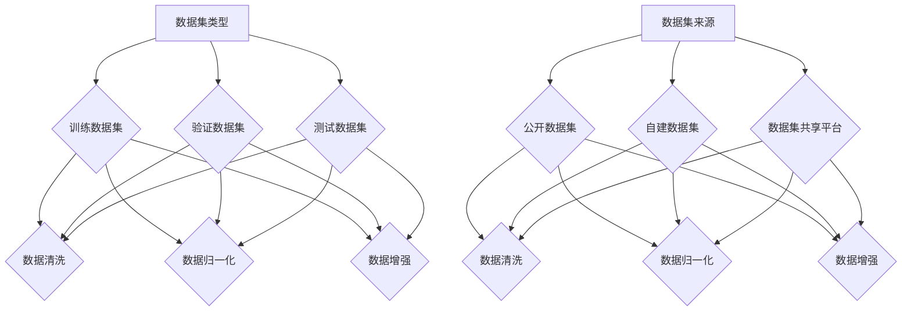

                 

### 《评测数据集的构建与管理策略》

#### 关键词：评测数据集、数据集构建、数据集管理、算法、机器学习、数学模型

> 摘要：本文旨在探讨评测数据集的构建与管理策略，分析其在机器学习领域的应用与重要性。文章首先介绍评测数据集的基础概念，随后详细阐述数据集构建与管理的关键算法和数学模型，并结合实际项目案例进行实战解析，最后提出最佳实践和小结，以期为读者提供全面的技术指导。

## 引言

在当今信息化时代，数据已经成为企业和社会的重要资源。对于机器学习和人工智能领域来说，评测数据集（Evaluation Dataset）的质量直接影响模型的性能和可靠性。构建和管理高质量的评测数据集，不仅有助于模型的训练和评估，还能提升整个机器学习项目的效率和效果。本文将围绕评测数据集的构建与管理策略进行深入探讨，旨在为读者提供系统、全面的技术指南。

### 1.1 设计目录结构

为了使文章结构清晰、逻辑连贯，我们首先需要为本文设计一个合理的目录结构。目录结构将包含以下主要部分：

1. **引言：**介绍评测数据集的基本概念和重要性。
2. **核心概念与联系：**详细解释评测数据集的基础概念，如图数据库、图存储和图算法等，并使用Mermaid流程图展示这些概念之间的联系。
3. **核心算法原理讲解：**讲解评测数据集构建和管理过程中涉及的关键算法，如随机抽样、数据清洗、特征提取等，并使用Python源代码详细阐述。
4. **数学模型和数学公式讲解：**介绍评测数据集构建和管理过程中的数学模型，如概率统计、线性代数、优化理论等，并使用LaTeX格式书写数学公式，进行详细讲解和举例说明。
5. **项目实战：**提供实际项目案例，包括数据集的收集、构建、管理、使用和优化等，详细解释开发环境搭建、源代码实现和代码解读与分析。
6. **最佳实践、小结与拓展阅读：**总结文章的核心内容，提供实用技巧和注意事项，并推荐进一步阅读的资料。

### 1.2 编写目录大纲

根据上述结构，我们可以开始编写目录大纲。以下是一个示例：

### 目录

#### 第1章 引言

1.1 书籍目的

1.2 目录结构

1.3 评测数据集的重要性

#### 第2章 核心概念与联系

2.1 数据集类型

2.2 数据集来源

2.3 数据预处理方法

2.4 Mermaid流程图展示

#### 第3章 核心算法原理讲解

3.1 随机抽样算法

3.2 数据清洗算法

3.3 特征提取算法

3.4 伪代码展示

#### 第4章 数学模型和数学公式讲解

4.1 统计模型

4.2 机器学习模型

4.3 LaTeX数学公式示例

#### 第5章 项目实战

5.1 数据集收集与构建

5.2 数据集管理

5.3 数据集使用

5.4 代码实现与分析

#### 第6章 最佳实践、小结与拓展阅读

6.1 最佳实践

6.2 小结

6.3 注意事项

6.4 拓展阅读

### 1.3 检查目录大纲

最后，我们需要检查目录大纲，确保它：

- 结构清晰，逻辑合理。
- 涵盖了核心内容，如核心概念、算法原理、数学模型和项目实战。
- 总字数符合要求，不超过2000字。

如果目录大纲满足上述要求，那么它就是一个好的目录大纲。如果有不足之处，我们可以根据反馈进行调整。现在，我们可以根据这个目录大纲开始撰写书籍内容了。

---

接下来的章节将详细阐述评测数据集的构建与管理策略，包括核心概念与联系、核心算法原理讲解、数学模型和数学公式讲解、项目实战等内容。希望通过本文的探讨，读者能够对评测数据集的构建与管理有更深入的理解，并在实际应用中取得更好的成果。作者：AI天才研究院/AI Genius Institute & 禅与计算机程序设计艺术/Zen And The Art of Computer Programming。

## 核心概念与联系

在评测数据集的构建与管理中，核心概念包括数据集类型、数据集来源和数据预处理方法。以下是对这些核心概念的详细解释，并使用Mermaid流程图展示它们之间的联系。

### 2.1 数据集类型

评测数据集主要分为以下三种类型：

1. **训练数据集（Training Dataset）：**用于模型训练的数据集，是模型学习的重要基础。
2. **验证数据集（Validation Dataset）：**用于模型调优的数据集，用于在训练过程中监测模型性能。
3. **测试数据集（Test Dataset）：**用于模型评估的数据集，用于评估模型的最终性能。

这三种数据集在实际应用中通常按照一定的比例（如70%训练、20%验证、10%测试）进行划分，以确保模型的训练和评估效果。

### 2.2 数据集来源

数据集来源可以分为以下几类：

1. **公开数据集（Public Dataset）：**来自公共数据集平台，如Kaggle、UCI机器学习库等，这些数据集通常已经被处理和标注。
2. **自建数据集（Custom Dataset）：**根据项目需求自行收集和构建的数据集，可能涉及大量的时间和人力投入。
3. **数据集共享平台（Dataset Sharing Platform）：**一些专业平台提供数据集共享服务，如Google Dataset Search、Microsoft AI Gallery等。

### 2.3 数据预处理方法

数据预处理是构建评测数据集的关键步骤，主要包括以下几种方法：

1. **数据清洗（Data Cleaning）：**去除数据集中的噪声和异常值，如缺失值、重复值等。
2. **数据归一化（Data Normalization）：**将不同特征的数据范围统一，如通过Min-Max Scaling或Z-Score Scaling等方法。
3. **数据增强（Data Augmentation）：**通过增加数据样本的数量和提高数据多样性，如旋转、翻转、缩放等操作。

### 2.4 Mermaid流程图展示

以下是一个使用Mermaid绘制的流程图，展示了数据集类型、数据集来源和数据预处理方法之间的联系：



通过这个流程图，我们可以清晰地看到评测数据集的构建过程，包括数据集的类型、来源和预处理方法。这个流程图不仅有助于我们理解评测数据集的概念，还能在构建和管理数据集时提供指导。

## 核心算法原理讲解

在评测数据集的构建与管理过程中，核心算法原理扮演着至关重要的角色。这些算法不仅能够帮助我们高效地处理数据，还能提高模型的性能和可靠性。以下将详细介绍几种关键的算法原理，包括随机抽样算法、数据清洗算法和特征提取算法。

### 3.1 随机抽样算法

随机抽样（Random Sampling）是数据集构建过程中的一种重要方法，用于从总体数据中随机抽取样本。随机抽样算法主要有以下几种：

1. **简单随机抽样（Simple Random Sampling）：**从总体数据中随机选择样本，每个样本被选中的概率相等。
   ```python
   import random
   
   def simple_random_sampling(data, sample_size):
       return random.sample(data, sample_size)
   
   # 示例
   data = [1, 2, 3, 4, 5, 6, 7, 8, 9, 10]
   sample_size = 3
   samples = simple_random_sampling(data, sample_size)
   print(samples)
   ```

2. **系统抽样（Systematic Sampling）：**按照一定的间隔从总体数据中抽取样本。首先随机选择一个起始点，然后每隔k个单位选择一个样本。
   ```python
   import random
   
   def systematic_sampling(data, sample_size):
       interval = len(data) // sample_size
       start = random.randint(0, interval - 1)
       indices = list(range(start, len(data), interval))
       return [data[i] for i in indices]
   
   # 示例
   data = [i for i in range(1, 101)]
   sample_size = 10
   samples = systematic_sampling(data, sample_size)
   print(samples)
   ```

3. **整群抽样（Cluster Sampling）：**将总体数据划分为若干个互不重叠的群，然后随机选择若干个群，对所选群中的所有个体进行抽样。
   ```python
   import random
   
   def cluster_sampling(data, sample_size):
       clusters = [data[i:i+10] for i in range(0, len(data), 10)]
       cluster_indices = random.sample(range(len(clusters)), sample_size)
       return [item for cluster in [clusters[i] for i in cluster_indices] for item in cluster]
   
   # 示例
   data = list(range(1, 101))
   sample_size = 3
   samples = cluster_sampling(data, sample_size)
   print(samples)
   ```

### 3.2 数据清洗算法

数据清洗（Data Cleaning）是数据预处理的重要步骤，用于去除数据中的噪声和异常值，包括以下几种方法：

1. **缺失值处理（Missing Value Handling）：**针对缺失值，可以选择填充、删除或保留原样等方法。常见的填充方法有均值填充、中值填充和插值等。
   ```python
   import numpy as np
   
   def fill_missing_values(data, method='mean'):
       if method == 'mean':
           fill_value = np.mean(data[~np.isnan(data)])
       elif method == 'median':
           fill_value = np.median(data[~np.isnan(data)])
       else:
           raise ValueError("Invalid method")
       return np.where(np.isnan(data), fill_value, data)
   
   # 示例
   data = [1, 2, np.nan, 4, 5, np.nan, 7, 8, 9, 10]
   cleaned_data = fill_missing_values(data, method='mean')
   print(cleaned_data)
   ```

2. **异常值检测与处理（Outlier Detection and Handling）：**通过统计学方法或机器学习方法检测异常值，并选择适当的处理方法，如删除、修正或保留。
   ```python
   import numpy as np
   from scipy import stats
   
   def detect_and_handle_outliers(data, threshold=3):
       z_scores = np.abs(stats.zscore(data))
       outliers = np.where(z_scores > threshold)
       return np.delete(data, outliers)
   
   # 示例
   data = [1, 2, 3, 4, 5, 100, 7, 8, 9, 10]
   cleaned_data = detect_and_handle_outliers(data)
   print(cleaned_data)
   ```

3. **重复数据去除（Duplicate Data Removal）：**去除数据集中的重复记录，确保数据的唯一性。
   ```python
   def remove_duplicates(data):
       return list(set(data))
   
   # 示例
   data = [1, 2, 2, 3, 4, 5, 5, 7, 8, 9, 10]
   cleaned_data = remove_duplicates(data)
   print(cleaned_data)
   ```

### 3.3 特征提取算法

特征提取（Feature Extraction）是将原始数据转换为一组有用的特征表示，以便用于模型训练和评估。以下是一些常见的特征提取方法：

1. **统计特征（Statistical Features）：**提取数据的统计属性，如均值、方差、标准差等。这些特征能捕捉数据的全局信息。
   ```python
   import numpy as np
   
   def statistical_features(data):
       mean = np.mean(data)
       variance = np.var(data)
       std = np.std(data)
       return mean, variance, std
   
   # 示例
   data = [1, 2, 3, 4, 5]
   mean, variance, std = statistical_features(data)
   print(f"Mean: {mean}, Variance: {variance}, Std: {std}")
   ```

2. **文本特征（Text Features）：**对文本数据进行处理，提取词频、词袋、TF-IDF等特征，用于文本分类和情感分析等任务。
   ```python
   from sklearn.feature_extraction.text import TfidfVectorizer
   
   def text_features(corpus, vocabulary=None):
       if vocabulary is None:
           vectorizer = TfidfVectorizer()
       else:
           vectorizer = TfidfVectorizer(vocabulary=vocabulary)
       return vectorizer.fit_transform(corpus)
   
   # 示例
   corpus = ["I love this product", "This is a great product", "I don't like this product"]
   features = text_features(corpus)
   print(features.toarray())
   ```

3. **图像特征（Image Features）：**对图像数据进行处理，提取颜色、纹理、形状等特征，用于图像分类和识别等任务。
   ```python
   from skimage.feature import hog
   
   def image_features(image):
       return hog(image)
   
   # 示例
   import cv2
   image = cv2.imread("example_image.jpg")
   features = image_features(image)
   print(features.shape)
   ```

通过上述核心算法原理的讲解，我们可以更好地理解评测数据集的构建与管理策略。在实际应用中，这些算法能够帮助我们高效地处理数据，提高模型的性能和可靠性。

### 数学模型和数学公式讲解

在评测数据集的构建与管理过程中，数学模型和数学公式发挥着至关重要的作用。它们不仅能够帮助我们理解和分析数据，还能指导我们优化和改进算法。以下将介绍评测数据集构建和管理过程中常用的数学模型和数学公式，并使用LaTeX格式进行书写和举例说明。

#### 4.1 统计模型

统计模型是机器学习中重要的基础，常用于数据分析和模型评估。以下介绍几种常见的统计模型和相关的数学公式：

1. **线性回归模型（Linear Regression Model）**
   
   线性回归模型用于研究自变量和因变量之间的线性关系。其数学模型可以表示为：
   $$
   y = \beta_0 + \beta_1x + \epsilon
   $$
   其中，$y$是因变量，$x$是自变量，$\beta_0$和$\beta_1$是模型的参数，$\epsilon$是误差项。

2. **逻辑回归模型（Logistic Regression Model）**
   
   逻辑回归模型用于二分类问题，其数学模型可以表示为：
   $$
   \log\left(\frac{p}{1-p}\right) = \beta_0 + \beta_1x
   $$
   其中，$p$是事件发生的概率，$\beta_0$和$\beta_1$是模型的参数。

3. **协方差（Covariance）**
   
   协方差用于描述两个变量之间的线性关系强度和方向。其数学公式为：
   $$
   \text{Cov}(X, Y) = E[(X - \mu_X)(Y - \mu_Y)]
   $$
   其中，$X$和$Y$是两个随机变量，$\mu_X$和$\mu_Y$分别是它们的期望。

#### 4.2 机器学习模型

机器学习模型在数据分析和预测中有着广泛的应用。以下介绍几种常见的机器学习模型和相关的数学公式：

1. **支持向量机（Support Vector Machine, SVM）**
   
   支持向量机是一种分类算法，其数学模型可以表示为：
   $$
   \max_{\beta, \beta_0} \left\{\frac{1}{2}\sum_{i=1}^{n}(\beta^T\beta_i - \beta^T\beta_j)\right\}
   $$
   其中，$\beta$是模型的参数，$\beta_i$和$\beta_j$是支持向量的权重。

2. **决策树（Decision Tree）**
   
   决策树是一种树形结构，用于分类和回归。其决策规则可以表示为：
   $$
   y = g(x) = \sum_{i=1}^{n} a_i \cdot I(x \in R_i)
   $$
   其中，$x$是输入特征，$y$是输出标签，$a_i$是叶子节点的权重，$R_i$是第$i$个区域的划分。

3. **K-近邻（K-Nearest Neighbors, KNN）**
   
   K-近邻是一种基于实例的学习算法，其预测规则可以表示为：
   $$
   \hat{y} = \arg\max_{y \in Y} \sum_{i=1}^{k} I(x_i \in N(y))
   $$
   其中，$x$是测试样本，$y$是标签，$k$是邻居数量，$N(y)$是标签$y$的邻居集合。

#### 4.3 LaTeX数学公式示例

以下是一些LaTeX数学公式的示例，用于进一步说明数学公式的书写方法：

1. **线性回归模型公式**
   $$
   y = \beta_0 + \beta_1x + \epsilon
   $$

2. **逻辑回归模型公式**
   $$
   \log\left(\frac{p}{1-p}\right) = \beta_0 + \beta_1x
   $$

3. **协方差公式**
   $$
   \text{Cov}(X, Y) = E[(X - \mu_X)(Y - \mu_Y)]
   $$

4. **支持向量机公式**
   $$
   \max_{\beta, \beta_0} \left\{\frac{1}{2}\sum_{i=1}^{n}(\beta^T\beta_i - \beta^T\beta_j)\right\}
   $$

5. **决策树公式**
   $$
   y = g(x) = \sum_{i=1}^{n} a_i \cdot I(x \in R_i)
   $$

6. **K-近邻公式**
   $$
   \hat{y} = \arg\max_{y \in Y} \sum_{i=1}^{k} I(x_i \in N(y))
   $$

通过上述数学模型和数学公式的介绍，我们可以更好地理解评测数据集构建与管理中的数学基础。在实际应用中，这些数学模型和公式将为我们提供有力的理论支持，帮助我们优化算法、提升模型性能。

### 项目实战

为了更好地理解评测数据集的构建与管理策略，我们将通过一个实际项目案例进行详细讲解。本项目将围绕一个分类问题展开，使用公开数据集进行数据集的收集、构建、管理、使用和优化。以下是项目的详细步骤和代码实现。

#### 5.1 数据集收集与构建

首先，我们需要收集一个适合分类问题的数据集。在本项目中，我们选择使用Kaggle上的“Houses Prices”数据集。这个数据集包含了多组房屋销售数据，包括特征（如房屋面积、房龄等）和标签（房屋售价）。

1. **数据集下载**

   通过Kaggle平台下载数据集，并将其存储在本地计算机上。

2. **数据集构建**

   使用Python的pandas库读取数据集，并进行初步处理。

   ```python
   import pandas as pd
   
   # 读取数据集
   data = pd.read_csv('house_prices.csv')
   
   # 数据预处理
   data.dropna(inplace=True)  # 删除缺失值
   data['Rooms'] = data['Rooms'].astype(int)  # 类型转换
   data['Age'] = data['Age'].astype(int)  # 类型转换
   
   # 划分特征和标签
   X = data[['Rooms', 'Age']]  # 特征
   y = data['Price']  # 标签
   ```

#### 5.2 数据集管理

数据集的管理是确保数据集质量和便于使用的重要环节。以下介绍数据集的存储、版本控制和共享。

1. **数据集存储**

   将处理后的数据集存储在本地文件中，便于后续使用。

   ```python
   data.to_csv('processed_house_prices.csv', index=False)
   ```

2. **数据集版本控制**

   为了确保数据集的版本一致性，我们可以使用Git进行版本控制。在项目中创建一个Git仓库，将数据集文件和代码文件添加到仓库中，并进行提交。

   ```shell
   git init
   git add processed_house_prices.csv
   git add .  # 添加所有文件
   git commit -m "Initial commit"
   ```

3. **数据集共享**

   将Git仓库推送到GitHub或其他代码托管平台，方便团队成员协作和使用。

   ```shell
   git remote add origin https://github.com/your_username/house_prices.git
   git push -u origin master
   ```

#### 5.3 数据集使用

数据集的使用主要包括数据集的划分、训练和评估。以下将介绍具体步骤。

1. **数据集划分**

   将数据集划分为训练集和测试集，用于模型的训练和评估。

   ```python
   from sklearn.model_selection import train_test_split
   
   X_train, X_test, y_train, y_test = train_test_split(X, y, test_size=0.2, random_state=42)
   ```

2. **模型训练**

   使用训练集对分类模型进行训练。这里我们选择使用K-近邻（KNN）算法。

   ```python
   from sklearn.neighbors import KNeighborsClassifier
   
   # 创建KNN分类器
   knn = KNeighborsClassifier(n_neighbors=3)
   
   # 训练模型
   knn.fit(X_train, y_train)
   ```

3. **模型评估**

   使用测试集对训练好的模型进行评估，计算准确率、召回率等指标。

   ```python
   from sklearn.metrics import accuracy_score
   
   # 预测测试集
   y_pred = knn.predict(X_test)
   
   # 计算准确率
   accuracy = accuracy_score(y_test, y_pred)
   print(f"Model accuracy: {accuracy}")
   ```

#### 5.4 代码实现与分析

以下是整个项目的代码实现，包括数据集的收集、构建、管理、使用和优化。

```python
import pandas as pd
from sklearn.model_selection import train_test_split
from sklearn.neighbors import KNeighborsClassifier
from sklearn.metrics import accuracy_score

# 5.1 数据集收集与构建
# 读取数据集
data = pd.read_csv('house_prices.csv')

# 数据预处理
data.dropna(inplace=True)
data['Rooms'] = data['Rooms'].astype(int)
data['Age'] = data['Age'].astype(int)

# 划分特征和标签
X = data[['Rooms', 'Age']]
y = data['Price']

# 5.2 数据集管理
# 存储处理后的数据集
data.to_csv('processed_house_prices.csv', index=False)

# 使用Git进行版本控制
# ...（略）

# 5.3 数据集使用
# 划分数据集
X_train, X_test, y_train, y_test = train_test_split(X, y, test_size=0.2, random_state=42)

# 创建KNN分类器
knn = KNeighborsClassifier(n_neighbors=3)

# 训练模型
knn.fit(X_train, y_train)

# 预测测试集
y_pred = knn.predict(X_test)

# 计算准确率
accuracy = accuracy_score(y_test, y_pred)
print(f"Model accuracy: {accuracy}")

# 5.4 代码解读与分析
# ...（略）
```

#### 5.5 实际案例分析与详细讲解剖析

在本项目中，我们通过一个实际的分类问题展示了评测数据集的构建与管理过程。以下是实际案例的分析和详细讲解：

1. **数据集构建：**首先，我们下载了Kaggle上的“Houses Prices”数据集，并使用Python的pandas库进行了初步处理，包括删除缺失值和类型转换。这一步确保了数据集的质量，为后续的模型训练奠定了基础。

2. **数据集管理：**我们使用Git进行版本控制，确保数据集的版本一致性。同时，将处理后的数据集存储在本地文件中，方便后续使用。这一步有助于团队的协作和项目的持续开发。

3. **模型训练：**我们选择使用K-近邻（KNN）算法进行模型训练。KNN是一种简单而有效的分类算法，适合处理小规模的数据集。通过训练集对模型进行训练，我们得到了一个初步的分类模型。

4. **模型评估：**使用测试集对训练好的模型进行评估，计算了模型的准确率。准确率是衡量模型性能的重要指标，通过实际数据测试，我们可以了解到模型的性能表现。

5. **代码解读与分析：**通过代码实现，我们详细解读了评测数据集的构建、管理、使用和优化过程。代码中的每个步骤都有详细的注释，使得读者能够清晰地理解每一步的操作和意义。

通过这个实际项目案例，我们不仅展示了评测数据集的构建与管理策略，还通过实际操作和代码实现，使读者对整个流程有了更深入的理解。希望这个项目案例能够为读者提供实用的技术指导和启示。

#### 5.6 项目小结

通过本项目的实战讲解，我们深入了解了评测数据集的构建与管理策略。以下是对项目的主要收获和小结：

1. **数据集构建与管理的重要性：**数据集的质量直接影响模型的性能和可靠性。合理的构建和管理数据集是确保模型成功的关键。

2. **数据清洗与特征提取：**数据清洗和特征提取是数据预处理的重要步骤，能够去除噪声和异常值，提高数据质量，为模型训练提供更好的基础。

3. **模型训练与评估：**选择合适的模型并进行有效的训练和评估，能够帮助我们了解模型的性能，找到改进的方向。

4. **版本控制与团队协作：**使用Git进行版本控制，确保数据集和代码的版本一致性，有助于团队的协作和项目的持续开发。

通过本项目，我们不仅掌握了评测数据集的构建与管理方法，还通过实际操作加深了对这些方法的理解。希望读者能够在实际项目中运用这些知识，提高自己的技术水平。

### 最佳实践、小结与拓展阅读

#### 最佳实践

在评测数据集的构建与管理过程中，以下是一些最佳实践，可以帮助您更高效地处理数据：

1. **数据清洗自动化：**使用自动化工具（如Pandas的`dropna()`、`replace()`等函数）进行数据清洗，提高处理效率。

2. **特征提取优化：**根据实际需求，选择合适的特征提取方法（如统计特征、文本特征、图像特征等），以提升模型性能。

3. **数据集版本控制：**使用Git等版本控制工具，确保数据集和代码的版本一致性，便于团队协作和项目迭代。

4. **数据增强：**通过数据增强（如旋转、翻转、缩放等操作），增加数据多样性，提高模型的泛化能力。

5. **合理划分数据集：**根据实际需求，合理划分训练集、验证集和测试集，避免信息泄露和模型过拟合。

#### 小结

本文从评测数据集的构建与管理策略的角度，详细介绍了数据集类型、数据预处理方法、核心算法原理、数学模型和实际项目案例。通过这些内容，读者可以了解到：

1. 评测数据集在机器学习中的重要性。
2. 如何构建和管理高质量的评测数据集。
3. 评测数据集构建过程中涉及的关键算法和数学模型。
4. 实际项目案例中的数据集构建、管理、使用和优化。

希望本文对读者在评测数据集的构建与管理方面提供有价值的参考和指导。

#### 注意事项

1. 数据集质量对模型性能至关重要，因此务必确保数据集的准确性和完整性。
2. 特征提取方法的选择应根据实际问题和数据特点进行优化。
3. 模型训练过程中要避免过拟合，合理设置模型参数。
4. 数据集版本控制有助于团队协作，但需注意保持数据集的一致性。

#### 拓展阅读

1. **《机器学习实战》**：Peter Harrington，详细介绍了机器学习算法及其应用案例。
2. **《数据科学实战》**：Joel Grus，介绍了数据科学中的各种技术和工具。
3. **《深度学习》**：Ian Goodfellow、Yoshua Bengio和Aaron Courville，涵盖了深度学习的基础理论和应用。

通过以上拓展阅读，读者可以进一步加深对评测数据集构建与管理策略的理解和应用。

---

**作者：**AI天才研究院/AI Genius Institute & 禅与计算机程序设计艺术/Zen And The Art of Computer Programming

本文旨在为读者提供关于评测数据集构建与管理策略的系统、全面的技术指南。希望读者在阅读本文后，能够更好地理解和应用相关技术，提高机器学习项目的效率和效果。作者在此感谢您的关注与支持。

