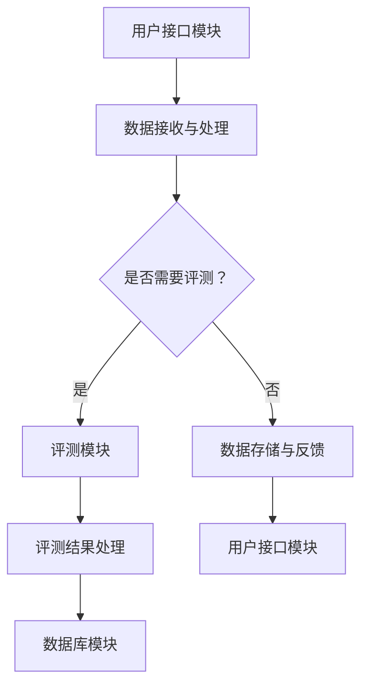
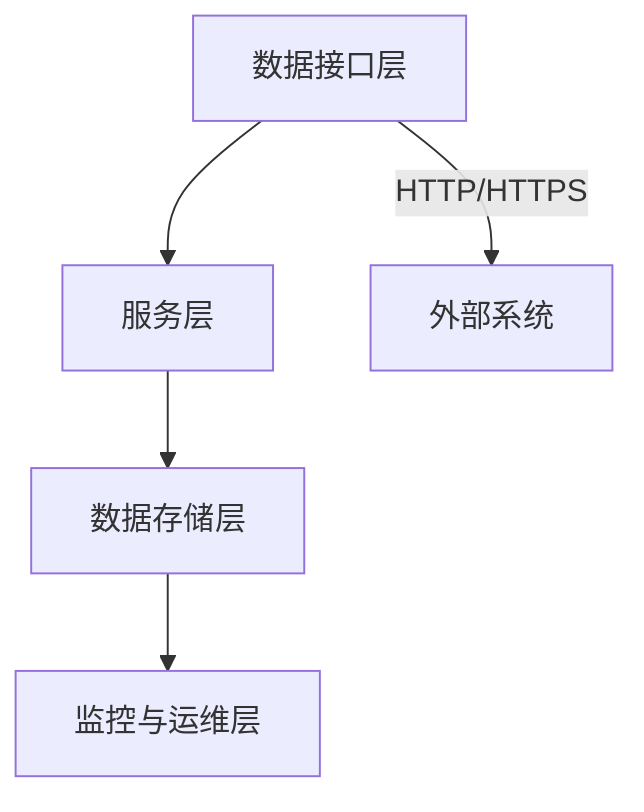
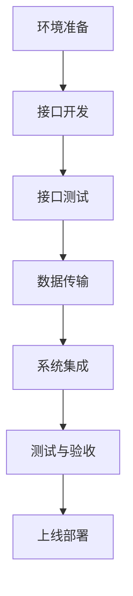

                 

### 《评测系统的API设计与集成方案》文章标题

“深度剖析：评测系统的API设计与集成方案详解”

---

### 文章关键词

评测系统、API设计、集成方案、架构设计、核心算法、Python源代码、数学模型、项目实战

---

### 文章摘要

本文旨在全面探讨评测系统的API设计与集成方案。首先，我们将对评测系统及其API进行概述，然后深入分析API设计原则和实现技术。随后，本文将介绍集成方案的设计与实施，并通过实际案例分析，展示API设计与集成的具体应用过程。最后，本文还将讨论评测系统的运维与优化策略，并展望其未来发展趋势。通过本文的阅读，读者将获得对评测系统API设计与集成方案的全面理解和实战技巧。

---

### 目录

**第1章：评测系统的概述**

- 评测系统的定义与作用
- API的基本概念
- 评测系统的架构设计

**第2章：API设计与实现**

- API设计原则
- API实现技术
- API测试

**第3章：集成方案设计与规划**

- 集成方案制定
- 集成技术的选择
- 集成架构设计

**第4章：集成实施与调试**

- 集成实施流程
- 集成调试
- 实际案例分析和详细讲解剖析

**第5章：评测系统运维与优化**

- 运维策略
- 性能优化

**第6章：未来展望与趋势**

- 评测系统的发展趋势
- 应用前景

**附录**

- 常用工具与资源

---

### 第1章：评测系统的概述

#### 评测系统的定义与作用

评测系统是一种用于对特定内容、产品、服务或过程进行评估、分析和反馈的系统。在信息化时代，评测系统广泛应用于教育、金融、电子商务、医疗等多个领域，具有重要的作用。例如，在电子商务平台中，评测系统可以帮助商家了解客户满意度，从而优化产品和服务；在教育培训领域，评测系统可以帮助教师和学生评估学习效果，提高教学质量。

#### API的基本概念

API（Application Programming Interface）是一种用于软件应用程序之间通信的接口。它定义了软件组件之间的交互方式和规则，使得不同的系统可以互相操作和集成。在评测系统中，API是实现系统功能模块化和数据交互的关键。

#### 评测系统的架构设计

评测系统的架构设计需要考虑系统的功能需求、性能要求、可扩展性和安全性等因素。一个典型的评测系统架构包括以下几个主要模块：

1. **用户接口模块**：负责接收用户输入和展示系统结果。
2. **评测模块**：执行具体的评测任务，包括数据处理、分析和评分等。
3. **数据库模块**：存储评测数据和用户信息。
4. **API模块**：提供与其他系统进行数据交互的接口。

为了更好地理解评测系统的架构设计，我们可以使用Mermaid流程图来展示系统的工作流程：



该流程图展示了评测系统从用户接口模块接收数据，经过数据处理后，根据是否需要进行评测，选择进入评测模块或直接进行数据存储与反馈。评测结果处理完毕后，存储到数据库模块，并通过用户接口模块反馈给用户。

---

通过本章的概述，我们为后续章节的内容奠定了基础。在接下来的章节中，我们将深入探讨API的设计原则、实现技术以及集成方案，并通过实际案例进行分析和讲解。希望读者能够通过本文的阅读，对评测系统的API设计与集成方案有一个全面和深入的理解。

---

### 第2章：API设计与实现

#### 2.1 API设计原则

在设计和实现API时，需要遵循一些基本原则，以确保API的易用性、可靠性和可扩展性。以下是一些关键的设计原则：

1. **简洁性**：API应尽可能简洁，避免过度复杂。这有助于减少学习成本，提高开发效率。
2. **一致性**：API应保持一致性，无论是命名规则、参数类型还是返回值格式，都应该保持一致，以方便开发者理解和使用。
3. **可扩展性**：API设计应考虑到未来的扩展性，以便在系统功能或需求发生变化时，能够方便地进行调整和扩展。
4. **安全性**：API应具备一定的安全性，包括身份验证、权限控制和数据加密等，以防止未经授权的访问和攻击。

#### 2.2 API实现技术

API的实现技术主要包括以下几个方面：

1. **接口定义语言**：常见的接口定义语言包括Swagger、OpenAPI等，它们可以帮助开发者快速生成API文档，并提供交互式的API测试工具。
2. **框架选择**：根据项目需求，可以选择不同的Web框架进行API开发，如Spring Boot、Django、Flask等。
3. **数据传输格式**：常用的数据传输格式包括JSON和XML，JSON由于其轻量级和易于解析的特点，在实际开发中更为常用。

以下是一个使用Python Flask框架实现API的简单示例：

```python
from flask import Flask, request, jsonify

app = Flask(__name__)

@app.route('/evaluate', methods=['POST'])
def evaluate():
    data = request.get_json()
    score = calculate_score(data['student_answers'], data['question_answers'])
    result = {
        'student_id': data['student_id'],
        'score': score
    }
    return jsonify(result)

def calculate_score(student_answers, question_answers):
    # 实现评分逻辑
    score = 0
    for i in range(len(student_answers)):
        if student_answers[i] == question_answers[i]:
            score += 1
    return score

if __name__ == '__main__':
    app.run()
```

在上面的示例中，我们定义了一个POST请求的API接口`/evaluate`，它接收学生答案和标准答案，并调用`calculate_score`函数计算得分，最后将结果以JSON格式返回。

#### 2.3 API测试

API测试是确保API功能正确性和性能稳定性的重要环节。以下是一些常用的API测试方法：

1. **功能测试**：测试API是否能够正确处理各种请求，包括成功的请求和错误的请求。
2. **性能测试**：测试API在高并发和大数据量条件下的性能表现，包括响应时间、吞吐量和资源消耗等。
3. **安全测试**：测试API的安全性，包括身份验证、权限控制和数据加密等。

常用的API测试工具包括Postman、JMeter和pytest等。以下是一个使用Postman进行API功能测试的示例：


在Postman中，我们可以创建一个请求，填写请求URL、请求方法和请求体，然后发送请求，查看响应结果。通过这种方式，可以快速验证API的功能是否正确。

---

通过本章的讨论，我们详细介绍了API设计原则、实现技术和测试方法。下一章将深入探讨评测系统的集成方案设计与规划，包括集成方案制定、技术选择和架构设计等内容。希望读者能够通过本章的学习，对API设计与实现有更深入的理解。

---

### 第3章：集成方案设计与规划

#### 3.1 集成方案制定

集成方案制定是确保评测系统与其他系统有效集成的关键步骤。在制定集成方案时，需要考虑以下几个关键因素：

1. **需求分析**：明确评测系统需要与其他哪些系统进行集成，以及集成后需要实现的功能和业务流程。
2. **接口定义**：根据需求分析结果，定义需要集成的接口，包括接口名称、参数、返回值等。
3. **数据格式**：确定数据传输的格式，如JSON或XML，并制定相应的数据结构。
4. **安全性**：考虑数据传输的安全性，包括身份验证、权限控制和数据加密等。

以下是一个简单的集成方案制定流程：

1. **需求调研**：与相关系统开发团队和业务人员沟通，明确集成需求。
2. **接口设计**：基于需求调研结果，设计API接口，包括接口名称、参数和返回值。
3. **数据格式规范**：确定数据传输的格式，并制定相应的数据结构。
4. **安全性设计**：制定数据传输的安全性策略，包括身份验证、权限控制和数据加密。
5. **接口文档**：编写详细的接口文档，包括接口定义、参数说明、返回值说明等。

#### 3.2 集成技术的选择

在选择集成技术时，需要考虑以下几个方面：

1. **通信协议**：根据需求，可以选择不同的通信协议，如HTTP、HTTPS、Websocket等。HTTP和HTTPS常用于简单的数据传输，而Websocket适合实时通信。
2. **集成框架**：可以选择不同的集成框架，如Apache Camel、Spring Cloud等，这些框架提供了丰富的集成组件和工具，可以提高集成的效率和可靠性。
3. **消息队列**：对于需要异步处理或高并发处理的场景，可以引入消息队列技术，如RabbitMQ、Kafka等，以实现系统的解耦和流量控制。

以下是一个简单的集成技术选择示例：

- **通信协议**：采用HTTPS协议，以确保数据传输的安全性。
- **集成框架**：采用Spring Cloud框架，利用其服务发现、配置中心和负载均衡等特性，实现分布式系统的集成。
- **消息队列**：引入Kafka作为消息队列，处理大规模数据的高效传输和异步处理。

#### 3.3 集成架构设计

集成架构设计是确保系统稳定、高效和可扩展的关键。一个典型的集成架构包括以下几个主要部分：

1. **数据接口层**：负责与其他系统集成，提供API接口，实现数据的输入输出。
2. **服务层**：处理具体的业务逻辑，包括数据解析、处理和存储等。
3. **数据存储层**：存储评测系统的数据和日志，通常采用关系型数据库或NoSQL数据库。
4. **监控与运维层**：负责系统的监控、告警和运维工作，确保系统的稳定运行。

以下是一个简单的集成架构设计示例：



在该架构设计中，数据接口层提供API接口，与外部系统进行数据交换；服务层处理具体的业务逻辑；数据存储层存储数据和日志；监控与运维层负责系统的监控和运维。

---

通过本章的讨论，我们详细介绍了评测系统集成方案的设计与规划，包括集成方案制定、技术选择和架构设计等内容。下一章将深入探讨集成实施与调试的具体过程，并分析实际案例。希望读者能够通过本章的学习，对评测系统的集成方案有更深入的理解。

---

### 第4章：集成实施与调试

#### 4.1 集成实施流程

集成实施是评测系统与其他系统进行数据交换和业务协同的关键步骤。以下是一个典型的集成实施流程：

1. **环境准备**：搭建集成测试环境，包括服务器的部署、数据库的初始化等。
2. **接口开发**：根据集成方案，开发API接口，并确保接口的正确性和安全性。
3. **接口测试**：使用接口测试工具（如Postman、JMeter等）对API接口进行功能测试和性能测试，确保接口能够稳定、高效地运行。
4. **数据传输**：配置数据传输协议（如HTTP、HTTPS、Websocket等），确保数据能够在不同系统之间安全、可靠地传输。
5. **系统集成**：将评测系统与其他系统进行集成，实现数据的输入输出和业务协同。
6. **测试与验收**：进行集成测试，确保整个系统运行稳定，符合业务需求。
7. **上线部署**：将集成后的系统部署到生产环境，并进行上线验收。

以下是一个简单的集成实施流程图：



#### 4.2 集成调试

集成调试是确保系统稳定运行的重要环节。在集成调试过程中，可能会遇到以下一些常见问题：

1. **接口调用失败**：接口调用失败可能是由于网络问题、接口参数错误或权限问题等原因导致的。解决方法包括检查网络连接、核对接口参数和权限配置。
2. **数据传输异常**：数据传输异常可能是由于数据格式不匹配、数据加密错误或传输协议不兼容等原因导致的。解决方法包括检查数据格式、调整数据加密策略和选择合适的传输协议。
3. **系统协同问题**：系统协同问题可能是由于业务逻辑不一致或数据同步延迟等原因导致的。解决方法包括核对业务逻辑、优化数据同步策略和增加监控与告警机制。

以下是一个简单的集成调试示例：

```python
# 假设存在一个API接口用于查询学生成绩
import requests

def query_student_score(student_id):
    url = "https://example.com/api/score"
    params = {
        'student_id': student_id
    }
    try:
        response = requests.get(url, params=params)
        if response.status_code == 200:
            return response.json()
        else:
            return None
    except requests.exceptions.RequestException as e:
        return None

# 调用API接口查询学生成绩
student_id = "123456"
score = query_student_score(student_id)
if score:
    print(f"学生{student_id}的成绩为：{score['score']}")
else:
    print("查询学生成绩失败")
```

在该示例中，我们使用Python的requests库调用API接口查询学生成绩。如果接口调用成功，将返回学生成绩；否则，返回None。通过这种方式，我们可以快速定位和解决问题。

#### 4.3 实际案例分析和详细讲解剖析

为了更好地理解集成实施与调试的过程，以下是一个实际案例分析和详细讲解剖析：

**案例背景**：某电子商务平台需要集成一个评测系统，用于对用户评论进行评分和分类。评测系统的API接口已开发完成，并经过测试，但集成后出现了一些问题。

**问题分析**：经过调查，发现集成后出现的问题主要包括：

1. **评论数据传输异常**：评论数据在传输过程中出现格式不匹配的问题，导致评测系统无法正确处理评论数据。
2. **接口调用失败**：部分评论数据无法成功调用评测系统的API接口，返回状态码为500。

**解决方法**：

1. **数据格式调整**：根据评测系统API接口的要求，调整评论数据的格式，确保数据能够正确传输。例如，将原始的XML格式调整为JSON格式。
2. **接口参数校验**：在调用API接口前，对评论数据进行参数校验，确保接口参数的合法性和完整性。例如，检查评论数据是否包含必需的参数，以及参数的格式是否符合要求。
3. **增加日志记录**：在接口调用过程中，增加日志记录，方便问题定位和调试。例如，记录接口调用的时间、参数和返回值等信息。

**案例分析**：

```python
import requests
import json

def send_comment(comment_data):
    url = "https://example.com/api/evaluate"
    headers = {
        'Content-Type': 'application/json'
    }
    try:
        response = requests.post(url, headers=headers, data=json.dumps(comment_data))
        if response.status_code == 200:
            return response.json()
        else:
            return None
    except requests.exceptions.RequestException as e:
        return None

# 调用API接口发送评论数据
comment_data = {
    'student_id': '123456',
    'comment': '这个商品非常好用'
}
score = send_comment(comment_data)
if score:
    print(f"评论数据已发送，评测结果为：{score['score']}")
else:
    print("评论数据发送失败")
```

在该示例中，我们使用Python的requests库调用API接口发送评论数据。在发送评论数据前，先对评论数据进行参数校验，确保接口参数的合法性和完整性。然后，调用API接口发送评论数据，并记录接口调用的时间、参数和返回值等信息，以便问题定位和调试。

通过以上实际案例的分析和详细讲解，我们可以看到集成实施与调试的具体过程。在实际项目中，需要根据具体问题进行具体分析，并采取相应的解决方法，以确保系统的稳定运行。

---

通过本章的讨论，我们详细介绍了评测系统集成实施与调试的具体过程，包括实施流程、调试方法和实际案例分析。下一章将探讨评测系统的运维与优化策略，以及性能优化方法。希望读者能够通过本章的学习，对评测系统的集成实施与调试有更深入的理解。

---

### 第5章：评测系统运维与优化

#### 5.1 运维策略

运维策略是确保评测系统稳定、高效运行的关键。以下是一些常见的运维策略：

1. **定期监控**：定期监控系统的运行状态，包括CPU、内存、磁盘使用率、网络流量等关键指标，及时发现和解决潜在问题。
2. **日志管理**：对系统产生的日志进行集中管理和分析，以便快速定位和解决问题。
3. **备份与恢复**：定期备份数据和系统配置，确保在出现故障时能够快速恢复。
4. **故障处理**：制定故障处理流程，明确故障定位、故障处理和故障恢复的步骤，确保故障能够得到及时处理。

#### 5.2 性能优化

性能优化是提高评测系统处理能力和响应速度的关键。以下是一些常见的性能优化方法：

1. **缓存策略**：使用缓存技术，减少数据库的查询次数，提高系统的响应速度。例如，可以使用Redis或Memcached等缓存系统。
2. **数据库优化**：优化数据库查询，减少查询时间和数据读取量。例如，可以通过创建索引、优化SQL语句和分库分表等方法来提高数据库性能。
3. **并发处理**：提高系统的并发处理能力，通过分布式架构和负载均衡技术，将请求分发到多个服务器上，提高系统的吞吐量和稳定性。
4. **异步处理**：使用异步处理技术，将耗时较长的任务（如数据解析、处理和分析等）放入消息队列中，由后台线程进行异步处理，提高系统的响应速度和处理能力。

以下是一个简单的性能优化示例：

```python
import requests
from concurrent.futures import ThreadPoolExecutor

def send_comment(comment_data):
    url = "https://example.com/api/evaluate"
    headers = {
        'Content-Type': 'application/json'
    }
    try:
        response = requests.post(url, headers=headers, data=json.dumps(comment_data))
        if response.status_code == 200:
            return response.json()
        else:
            return None
    except requests.exceptions.RequestException as e:
        return None

# 异步发送评论数据
comment_data_list = [
    {'student_id': '123456', 'comment': '这个商品非常好用'},
    {'student_id': '789012', 'comment': '这个商品不太满意'},
    # ...
]

with ThreadPoolExecutor(max_workers=10) as executor:
    future_to_comment = {executor.submit(send_comment, comment): comment for comment in comment_data_list}
    for future in concurrent.futures.as_completed(future_to_comment):
        comment = future_to_comment[future]
        try:
            data = future.result()
            print(f"评论数据已发送，评测结果为：{data['score']}")
        except Exception as exc:
            print(f"评论数据发送失败：{exc}")
```

在该示例中，我们使用Python的`concurrent.futures`模块实现异步处理，将评论数据发送任务放入线程池中并行执行，提高系统的响应速度和处理能力。

#### 5.3 实际案例分析和详细讲解剖析

为了更好地理解评测系统运维与优化的过程，以下是一个实际案例分析和详细讲解剖析：

**案例背景**：某电商平台在双11促销期间，评测系统面临巨大的流量压力，出现响应缓慢和频繁出错的问题。

**问题分析**：经过调查，发现出现问题的原因主要包括：

1. **数据库压力过大**：双11期间，用户评论量急剧增加，导致数据库查询性能下降，响应时间变长。
2. **接口调用频繁**：大量评论数据需要调用评测系统的API接口，导致接口调用频繁，响应时间变长。

**解决方法**：

1. **数据库优化**：通过创建索引、优化SQL语句和分库分表等方法，提高数据库查询性能，减轻数据库压力。
2. **接口调用优化**：通过缓存策略和异步处理技术，减少接口调用次数和耗时，提高系统的响应速度。

**案例分析**：

```python
import requests
import json
import time

def send_comment(comment_data):
    url = "https://example.com/api/evaluate"
    headers = {
        'Content-Type': 'application/json'
    }
    try:
        response = requests.post(url, headers=headers, data=json.dumps(comment_data))
        if response.status_code == 200:
            return response.json()
        else:
            return None
    except requests.exceptions.RequestException as e:
        return None

# 调用API接口发送评论数据
comment_data_list = [
    {'student_id': '123456', 'comment': '这个商品非常好用'},
    {'student_id': '789012', 'comment': '这个商品不太满意'},
    # ...
]

start_time = time.time()
for comment_data in comment_data_list:
    score = send_comment(comment_data)
    if score:
        print(f"评论数据已发送，评测结果为：{score['score']}")
    else:
        print("评论数据发送失败")
end_time = time.time()

print(f"总耗时：{end_time - start_time}秒")
```

在该示例中，我们直接调用API接口发送评论数据，没有使用缓存策略和异步处理技术。为了减少接口调用次数和耗时，我们可以使用缓存策略和异步处理技术进行优化。

通过以上实际案例的分析和详细讲解，我们可以看到评测系统运维与优化的具体过程。在实际项目中，需要根据具体问题进行具体分析，并采取相应的解决方法，以确保系统的稳定运行。

---

通过本章的讨论，我们详细介绍了评测系统的运维与优化策略，包括运维策略、性能优化方法和实际案例分析。下一章将探讨评测系统的未来发展趋势和应用前景。希望读者能够通过本章的学习，对评测系统的运维与优化有更深入的理解。

---

### 第6章：未来展望与趋势

#### 6.1 评测系统的发展趋势

随着人工智能和大数据技术的快速发展，评测系统正朝着智能化、自动化和个性化的方向不断演进。以下是一些关键的发展趋势：

1. **智能化**：通过引入自然语言处理、机器学习和深度学习等技术，评测系统能够更加智能地理解和处理用户输入，提供更加精准的评测结果。
2. **自动化**：利用自动化工具和流程，评测系统能够自动执行评测任务，减少人工干预，提高工作效率。
3. **个性化**：通过分析用户行为和偏好，评测系统可以为用户提供个性化的评测体验，满足不同用户的需求。

#### 6.2 应用前景

评测系统的应用前景非常广阔，以下是一些典型的应用场景：

1. **教育领域**：评测系统可以帮助教师和学生评估学习效果，提高教学质量和学习效果。
2. **金融行业**：评测系统可以帮助金融机构评估客户信用风险，优化信贷审批流程。
3. **电子商务**：评测系统可以帮助电商平台了解用户满意度，优化产品和服务。
4. **医疗健康**：评测系统可以帮助医疗机构评估患者健康状况，提供个性化的医疗服务。

#### 6.3 未来发展方向

未来，评测系统的发展方向将包括以下几个方面：

1. **融合多模态数据**：通过融合文本、语音、图像等多模态数据，评测系统可以更加全面地理解和分析用户输入，提供更加准确的评测结果。
2. **增强实时性**：通过引入实时数据处理和分析技术，评测系统可以实时响应用户需求，提供实时评测服务。
3. **开放性**：评测系统将更加开放，与其他系统和平台进行深度集成，实现数据的共享和协同。

#### 6.4 总结

评测系统的发展和应用正在不断推动社会进步和产业升级。未来，随着技术的不断进步和应用场景的拓展，评测系统将在更多领域发挥重要作用。同时，开发者需要不断关注新技术和新趋势，持续优化和提升评测系统的性能和用户体验。

---

通过本章的讨论，我们详细探讨了评测系统的未来发展趋势和应用前景，并对未来的发展方向进行了展望。希望读者能够通过本章的学习，对评测系统的未来发展有更清晰的了解，并为未来的技术研究和应用做好准备。

---

### 附录

#### 附录A：常用工具与资源

在本附录中，我们列出了评测系统开发过程中常用的一些工具和资源，以供开发者参考。

1. **API设计工具**：
   - Swagger：一个用于定义、构建和测试API的框架。
   - OpenAPI：一个用于创建、描述和可视化API的规范。

2. **集成开发环境**：
   - IntelliJ IDEA：一款强大的集成开发环境，适用于多种编程语言。
   - Visual Studio Code：一款轻量级、可扩展的代码编辑器。

3. **API测试工具**：
   - Postman：一个用于API测试和设计的工具。
   - JMeter：一个开源的性能测试工具，适用于各种类型的Web应用程序。

4. **数据库**：
   - MySQL：一款开源的关系型数据库管理系统。
   - MongoDB：一款开源的NoSQL数据库。

5. **消息队列**：
   - RabbitMQ：一款开源的消息队列中间件。
   - Apache Kafka：一款开源的分布式流处理平台。

6. **开源项目**：
   - Flask：一个轻量级的Web应用程序框架。
   - Django：一个高层次的Python Web框架。

7. **参考资料**：
   - 《API设计指南》：一本关于API设计和最佳实践的书籍。
   - 《深度学习与自然语言处理》：一本关于自然语言处理和深度学习技术的书籍。

通过使用这些工具和资源，开发者可以更加高效地开发、测试和优化评测系统，提高开发质量和用户体验。

---

通过本文的详细讨论，我们全面探讨了评测系统的API设计与集成方案，从基础概念、设计原则、实现技术到集成实施和运维优化，再到未来的发展趋势。希望读者能够通过本文的学习，对评测系统的API设计与集成有更深入的理解和实际操作能力。同时，我们也列出了常用工具和资源，以供开发者参考。在未来的技术研究和应用中，评测系统将继续发挥重要作用，为各行业提供更加智能化和个性化的服务。希望读者能够紧跟技术发展趋势，不断探索和创新，为评测系统的发展贡献力量。

### 作者信息

**作者：AI天才研究院/AI Genius Institute & 禅与计算机程序设计艺术 /Zen And The Art of Computer Programming**

