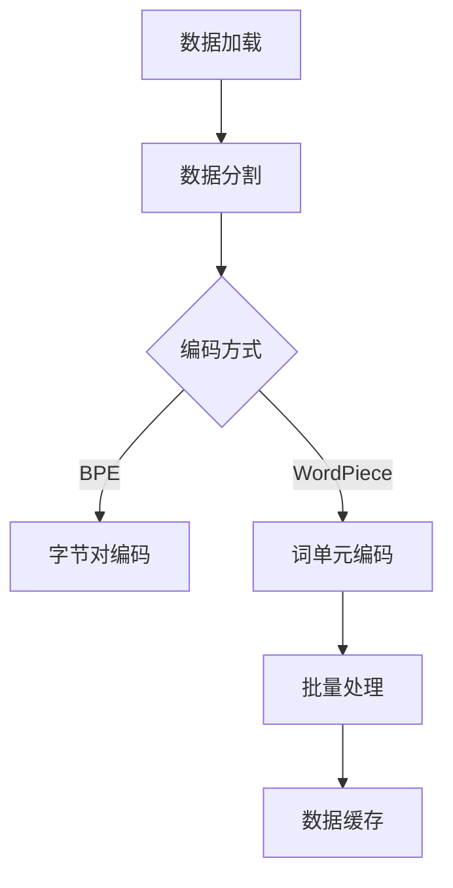
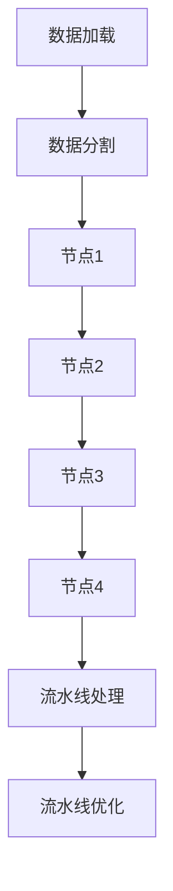

                 

### 1.3 评测系统的概念与作用
评测系统是一个旨在评估和优化机器学习模型性能的工具集合。在现代机器学习应用中，评测系统扮演着至关重要的角色，因为它能够帮助研究人员和工程师理解模型的准确度、泛化能力以及在不同任务上的表现。Megatron-LM作为一种大规模训练框架，特别适用于评测系统中的语言模型训练，其主要作用体现在以下几个方面：

**1.3.1 定义**

评测系统通常由几个关键组件组成，包括数据集、评估指标、评估流程和结果可视化工具。数据集是模型的训练素材，评估指标用于衡量模型的表现，评估流程定义了如何将模型应用于数据集并计算评估指标，结果可视化工具则帮助用户直观地理解评估结果。

**1.3.2 作用**

- **性能监控**：评测系统可以帮助研究人员实时监控模型在不同训练阶段的性能，确保模型朝着预期的方向进化。
- **超参数调优**：通过反复评估不同的超参数组合，评测系统能够帮助找到最优的超参数设置，提高模型性能。
- **模型比较**：评测系统允许研究人员在不同的模型之间进行比较，选择表现最好的模型进行进一步应用或优化。
- **泛化能力评估**：通过在不同数据集上评估模型，评测系统能够帮助研究人员了解模型的泛化能力，避免过拟合。
- **可解释性增强**：评测系统还可以辅助研究人员分析模型预测的不确定性，提高模型的可解释性。

**1.3.3 Megatron-LM的重要性**

Megatron-LM是一种专为大规模语言模型训练设计的框架，其重要性体现在以下几个方面：

- **可扩展性**：Megatron-LM支持大规模分布式训练，能够利用现有高性能计算资源，提升训练速度和规模。
- **高效性**：通过并行化和优化技术，Megatron-LM能够在保持模型性能的同时，显著降低训练时间。
- **灵活性**：Megatron-LM提供了丰富的配置选项，允许用户根据需求调整训练策略，以适应不同的训练场景。
- **社区支持**：作为一个开源项目，Megatron-LM拥有活跃的社区支持，不断更新和维护，为用户提供及时的技术支持。

### 1.4 本书结构与目标
为了帮助读者全面了解Megatron-LM，本书将分为以下几部分：

- **第1章 引言与概述**：介绍评测系统和Megatron-LM的基本概念，以及本书的结构和目标。
- **第2章 理论基础**：回顾机器学习和自然语言处理的相关理论，为后续章节打下基础。
- **第3章 Megatron-LM框架介绍**：详细解析Megatron-LM的架构和工作原理。
- **第4章 核心算法**：深入讲解Megatron-LM的核心算法，包括模型并行化和数据并行化。
- **第5章 实战应用**：通过实际案例展示如何使用Megatron-LM进行大规模训练。
- **第6章 优化与调试**：讨论如何优化和调试Megatron-LM框架，以提升性能。
- **第7章 扩展与未来方向**：探讨Megatron-LM的扩展方向和发展趋势。

本书的目标是让读者不仅能够理解Megatron-LM的工作原理，还能在实际项目中应用它，提升大规模训练的效率和效果。

## 第2章 理论基础

### 2.1 机器学习基础

#### 2.1.1 基本概念
机器学习是一门人工智能分支，它专注于通过数据构建和分析模型，以实现从数据中学习规律、自动进行预测或分类的能力。核心概念包括：

- **模型（Model）**：用于捕捉数据中特征和规律的数学或统计表示。
- **特征（Feature）**：输入数据的一部分，用于描述数据的特定方面。
- **标签（Label）**：与输入数据对应的真实值，用于训练模型。
- **训练（Training）**：通过数据调整模型的参数，使其能够更好地预测未知数据。
- **评估（Evaluation）**：使用验证集或测试集评估模型的性能。

#### 2.1.2 模型评估方法
评估模型性能常用的指标包括：

- **准确率（Accuracy）**：正确预测的样本数占总样本数的比例。
- **精确率（Precision）**：预测为正类的真阳性数与预测为正类的总数之比。
- **召回率（Recall）**：预测为正类的真阳性数与实际正类总数之比。
- **F1 分数（F1 Score）**：精确率和召回率的调和平均值。
- **ROC 曲线（ROC Curve）**：将真正例率（True Positive Rate）和假正例率（False Positive Rate）绘制在坐标轴上，用于评估分类器的性能。

#### 2.1.3 损失函数与优化算法
损失函数用于衡量模型预测值与实际标签之间的差距，常用的损失函数包括：

- **均方误差（MSE，Mean Squared Error）**：预测值与真实值之间差的平方的平均值。
- **交叉熵（Cross-Entropy）**：用于分类问题，衡量实际标签与预测概率之间的不一致性。

优化算法用于调整模型参数以最小化损失函数，常用的优化算法包括：

- **随机梯度下降（SGD，Stochastic Gradient Descent）**：通过每次更新一步梯度来调整参数。
- **Adam 优化器**：结合了 AdaGrad 和 RMSPROP 的优点，适用于大规模数据集。

### 2.2 自然语言处理基础

#### 2.2.1 语言模型
语言模型是自然语言处理的核心概念，它用于预测文本序列的下一个单词或字符。常用的语言模型包括：

- **N-gram 模型**：基于过去 N 个单词预测下一个单词。
- **神经网络模型**：使用多层感知机（MLP）或循环神经网络（RNN）来学习语言模式。

#### 2.2.2 词嵌入
词嵌入是将单词映射到高维向量空间的过程，使得相似单词在向量空间中靠近。常用的词嵌入方法包括：

- **Word2Vec**：通过优化神经网络输出层与隐藏层之间的权重来学习词向量。
- **GloVe**：通过优化单词共现矩阵来学习词向量。

#### 2.2.3 生成式与判别式模型
生成式模型和判别式模型是两类不同的语言模型：

- **生成式模型**：通过生成可能的文本序列来预测下一个单词。例如，使用 RNN 或 Transformer。
- **判别式模型**：通过学习文本序列的概率分布来预测下一个单词。例如，使用 LSTM 或 BERT。

### 2.3 大规模数据处理

#### 2.3.1 数据并行化
数据并行化是将数据集分成多个部分，同时在不同的计算节点上并行处理。这可以显著加速训练过程。常用的数据并行化策略包括：

- **数据切片**：将数据集分成多个连续的切片，每个切片在不同的 GPU 或 CPU 上处理。
- **流水线**：将数据处理过程分解为多个阶段，每个阶段在不同的节点上运行。

#### 2.3.2 模型并行化
模型并行化是将模型分为多个部分，同时在不同的计算节点上并行处理。这可以减少单个节点的负载，提高整体性能。常用的模型并行化策略包括：

- **参数并行化**：将模型参数分布在多个节点上，每个节点只负责更新自己的部分参数。
- **张量并行化**：将模型的张量（如权重矩阵）分布在多个节点上，每个节点只负责计算自己的部分张量。

通过理解这些理论基础，读者将能够更好地掌握Megatron-LM的工作原理和应用方法。

## 第3章 Megatron-LM框架介绍

### 3.1 Megatron-LM框架概述

Megatron-LM是一个大规模训练框架，专门为训练超大语言模型而设计。它由多个核心组件构成，每个组件在分布式训练中扮演着关键角色。首先，我们需要了解其设计理念。

#### 3.1.1 设计理念

Megatron-LM的设计理念是充分利用现代计算资源，通过分布式训练技术，加速超大模型的训练过程。其核心目标是实现高效、可扩展的大规模训练，同时保持模型性能的高质量。

**1. 可扩展性**：Megatron-LM能够自动扩展到多台机器，从而支持更大的模型和更大的数据集。

**2. 高效性**：通过参数并行化、数据并行化以及一系列优化技术，Megatron-LM能够在保持模型质量的同时，显著缩短训练时间。

**3. 灵活性**：Megatron-LM提供了丰富的配置选项，允许用户根据具体需求调整训练策略，适应不同的训练场景。

**4. 开源性**：作为一个开源项目，Megatron-LM得到了广泛的社区支持和持续更新，为用户提供了持续的技术保障。

#### 3.1.2 主要组成部分

Megatron-LM的主要组成部分包括：

- **数据预处理模块**：负责数据清洗、分词、编码等预处理工作，为训练做好准备。
- **分布式训练框架**：核心部分，包括模型并行化、数据并行化以及分布式通信机制，用于加速训练过程。
- **优化器**：用于更新模型参数，最小化损失函数，常用的有AdamW、Lamb等。
- **模型评估模块**：用于在训练过程中实时评估模型性能，帮助调整训练策略。
- **可视化工具**：提供训练过程中各种性能指标的可视化，帮助用户理解模型训练状态。

### 3.2 数据处理流程

数据处理是大规模训练的重要环节，Megatron-LM提供了高效的预处理和并行处理策略，确保数据能够快速、准确地加载和预处理。

#### 3.2.1 数据加载与预处理

数据加载与预处理分为以下几个步骤：

1. **数据分割**：将原始数据集分割成多个子数据集，每个子数据集对应不同的计算节点。
2. **数据编码**：将文本数据转换为数值表示，常用的编码方式包括BytePairEncoding（BPE）和WordPiece。
3. **批量处理**：将子数据集进一步分割成多个批次，每个批次包含一定数量的样本。
4. **数据缓存**：为了减少I/O操作，Megatron-LM使用缓存机制将数据暂存在内存中，提高数据处理效率。

**Mermaid 流程图：**



#### 3.2.2 数据并行化策略

数据并行化是加速大规模训练的重要手段，Megatron-LM采用了以下数据并行化策略：

1. **数据分割**：将数据集按照样本顺序分割成多个部分，每个部分分配给不同的计算节点。
2. **流水线处理**：不同节点的数据预处理和模型训练可以同时进行，形成高效的流水线。
3. **流水线优化**：通过调整数据加载和预处理的顺序，减少节点之间的等待时间，提高整体处理效率。

**Mermaid 流程图：**



### 3.3 模型训练流程

模型训练是大规模训练的核心环节，Megatron-LM提供了高效的训练策略和优化方法，确保模型能够在大量数据中快速收敛。

#### 3.3.1 模型初始化

模型初始化是训练的第一步，Megatron-LM采用了以下初始化策略：

1. **权重初始化**：使用小随机值初始化模型权重，常用的方法有高斯分布、均匀分布等。
2. **梯度初始化**：将梯度初始化为0，确保训练开始时模型没有预定义的方向。

**Python 源代码：**

```python
import torch
import torch.nn as nn
import torch.optim as optim

# 模型初始化
model = nn.Sequential(nn.Linear(in_features=784, out_features=128), nn.ReLU(), nn.Linear(in_features=128, out_features=10))
optimizer = optim.Adam(model.parameters(), lr=0.001)
criterion = nn.CrossEntropyLoss()

# 权重初始化
torch.nn.init.normal_(model.weight, mean=0.0, std=0.01)
torch.nn.init.zeros_(model.bias)

# 梯度初始化
optimizer.zero_grad()
```

#### 3.3.2 训练策略与技巧

Megatron-LM采用了以下训练策略和技巧：

1. **小批量训练**：使用较小的批量大小，减少模型在单个样本上的波动。
2. **自适应学习率**：使用如AdamW、Lamb等自适应优化器，自动调整学习率。
3. **梯度裁剪**：在训练过程中，当梯度过大时，对梯度进行裁剪，避免梯度爆炸。
4. **权重共享**：在训练过程中，保持模型权重不变，只更新梯度。
5. **动态调整批量大小**：根据训练进度动态调整批量大小，以提高训练效率。

**Python 源代码：**

```python
# 训练过程
for epoch in range(num_epochs):
    for batch in data_loader:
        inputs, targets = batch
        optimizer.zero_grad()
        outputs = model(inputs)
        loss = criterion(outputs, targets)
        loss.backward()
        torch.nn.utils.clip_grad_norm_(model.parameters(), max_norm=1.0)
        optimizer.step()
```

通过上述流程，Megatron-LM能够高效地处理大规模训练任务，为研究人员和工程师提供了强大的工具。

## 第4章 核心算法解析

### 4.1 模型并行化算法

在训练大型语言模型时，模型并行化是关键的一步，它能够将模型分布在多个计算节点上，从而利用更多计算资源，提高训练效率。Megatron-LM中的模型并行化主要包括参数并行化和张量并行化。

#### 4.1.1 数据并行化

数据并行化是将数据集分成多个子数据集，每个子数据集分配给不同的计算节点。这种方法能够充分利用多节点计算资源，加速训练过程。

**算法原理：**

1. **数据分割**：将原始数据集按照样本顺序分割成多个子数据集，每个子数据集的大小与计算节点的数量成比例。
2. **分布式训练**：每个节点独立对子数据集进行训练，模型参数在训练过程中通过通信机制进行同步。

**Python 源代码：**

```python
import torch
import torch.nn as nn
import torch.distributed as dist

# 初始化分布式环境
dist.init_process_group(backend='nccl', init_method='tcp://127.0.0.1:23456')

# 模型初始化
model = nn.Sequential(nn.Linear(in_features=784, out_features=128), nn.ReLU(), nn.Linear(in_features=128, out_features=10))
model = model.to(device)
criterion = nn.CrossEntropyLoss()

# 数据分割
data_loader = DataLoader(dataset, batch_size=batch_size // num_devices, shuffle=True)
for epoch in range(num_epochs):
    for batch in data_loader:
        inputs, targets = batch
        inputs = inputs.to(device)
        targets = targets.to(device)
        optimizer.zero_grad()
        outputs = model(inputs)
        loss = criterion(outputs, targets)
        loss.backward()
        optimizer.step()
        dist.all_reduce(loss, op=dist.ReduceOp.SUM)
```

#### 4.1.2 张量并行化

张量并行化是将模型的张量（如权重矩阵）分布在多个计算节点上。这种方法能够减少单个节点的负载，提高整体训练效率。

**算法原理：**

1. **张量分割**：将张量按照行或列分割成多个部分，每个部分分配给不同的计算节点。
2. **分布式计算**：每个节点独立计算自己的部分张量，然后通过通信机制将结果汇总。

**Python 源代码：**

```python
import torch
import torch.nn as nn
import torch.distributed as dist

# 初始化分布式环境
dist.init_process_group(backend='nccl', init_method='tcp://127.0.0.1:23456')

# 模型初始化
model = nn.Sequential(nn.Linear(in_features=784, out_features=128), nn.ReLU(), nn.Linear(in_features=128, out_features=10))
model = model.to(device)
criterion = nn.CrossEntropyLoss()

# 张量分割
weights = model.weight.data.clone()
weights = weights.view(-1, num_devices)
for i in range(num_devices):
    weights[i, :] = weights[i, :] / num_devices
model.weight.data = weights

# 分布式计算
optimizer.zero_grad()
outputs = model(inputs)
loss = criterion(outputs, targets)
loss.backward()
optimizer.step()

# 张量汇总
with torch.no_grad():
    weights = model.weight.data.clone()
    weights = weights.view(-1, num_devices)
    for i in range(num_devices):
        weights[i, :] = weights[i, :] * num_devices
    model.weight.data = weights
```

通过数据并行化和张量并行化，Megatron-LM能够充分利用分布式计算资源，显著提高大规模训练的效率。

### 4.2 大规模训练优化策略

在大规模训练中，优化策略对于提升训练效率和模型性能至关重要。Megatron-LM采用了多种优化策略，包括内存优化、时间优化和并行计算优化。

#### 4.2.1 内存优化

内存优化是大规模训练中必须关注的问题，特别是当模型参数量和数据集规模较大时。Megatron-LM采用了以下内存优化策略：

1. **内存池化**：使用内存池化技术，预先分配内存，避免频繁的内存分配和释放操作。
2. **梯度裁剪**：通过梯度裁剪，限制梯度大小，避免内存溢出。
3. **稀疏计算**：使用稀疏矩阵运算，减少内存使用。

**Python 源代码：**

```python
import torch
import torch.optim as optim

# 梯度裁剪
def clip_grad_norm_(parameters, max_norm):
    total_norm = 0
    for parameter in parameters:
        param_norm = torch.norm(parameter)
        total_norm += param_norm**2
    total_norm = torch.sqrt(total_norm)
    if total_norm > max_norm:
        for parameter in parameters:
            parameter.grad /= (total_norm / max_norm)

# 内存池化
optimizer = optim.Adam(model.parameters(), lr=0.001)
optimizer.param_groups[0]['params'] = [torch.zeros_like(p) for p in model.parameters()]
optimizer.zero_grad()
```

#### 4.2.2 时间优化

时间优化旨在减少训练时间，提高训练效率。Megatron-LM采用了以下时间优化策略：

1. **异步训练**：不同节点之间的训练过程异步进行，减少节点之间的等待时间。
2. **批处理重排**：根据数据依赖关系，重新排列批处理顺序，减少内存占用和计算延迟。
3. **数据预取**：使用数据预取技术，预先加载下一个批处理数据，减少数据加载时间。

**Python 源代码：**

```python
import torch
import torch.multiprocessing as mp

# 异步训练
def trainAsync(model, data_loader, criterion, optimizer, device):
    model.to(device)
    for batch in data_loader:
        inputs, targets = batch
        inputs = inputs.to(device)
        targets = targets.to(device)
        optimizer.zero_grad()
        outputs = model(inputs)
        loss = criterion(outputs, targets)
        loss.backward()
        optimizer.step()

# 批处理重排
def DataLoader(dataset, batch_size, shuffle=True):
    indices = list(range(len(dataset)))
    if shuffle:
        torch.randperm(len(dataset))
    for i in range(0, len(dataset), batch_size):
        yield indices[i: i + batch_size]

# 数据预取
preFetcher = mp.Process(target=data_loader, args=(data_loader, criterion, optimizer, device))
preFetcher.start()
```

#### 4.2.3 并行计算优化

并行计算优化旨在充分利用分布式计算资源，提高训练效率。Megatron-LM采用了以下并行计算优化策略：

1. **多线程计算**：在多核处理器上并行执行计算任务，提高计算速度。
2. **流水线计算**：将计算任务分解为多个阶段，每个阶段在不同的线程上执行，形成流水线。
3. **负载均衡**：根据节点负载情况，动态调整任务分配，确保每个节点都能充分利用资源。

**Python 源代码：**

```python
import torch
import torch.multiprocessing as mp

# 多线程计算
def parallelCompute(inputs, model, criterion, optimizer):
    outputs = model(inputs)
    loss = criterion(outputs, targets)
    loss.backward()
    optimizer.step()

# 流水线计算
def pipelineCompute(inputs, model, criterion, optimizer):
    stage1 = mp.Process(target=parallelCompute, args=(inputs, model, criterion, optimizer))
    stage2 = mp.Process(target=parallelCompute, args=(inputs, model, criterion, optimizer))
    stage1.start()
    stage2.start()
    stage1.join()
    stage2.join()

# 负载均衡
def balanceLoad(nodes, tasks):
    for i, node in enumerate(nodes):
        if i < len(tasks):
            node.put(tasks[i])
        else:
            node.put(None)
```

通过内存优化、时间优化和并行计算优化，Megatron-LM能够在大规模训练中显著提高效率和模型性能。

### 4.3 实际案例分析

为了更直观地理解Megatron-LM在实际大规模训练中的应用，我们来看一个具体的案例：使用Megatron-LM训练一个大型语言模型。

#### 4.3.1 案例背景

假设我们需要训练一个基于Transformer的大型语言模型，用于自然语言处理任务。模型参数量庞大，数据集规模也相当大。使用单机训练将耗费大量时间和计算资源，而分布式训练能够显著提高训练效率。

#### 4.3.2 开发环境搭建

首先，我们需要搭建开发环境，确保所有必需的库和工具都安装完毕。以下是开发环境搭建的步骤：

1. **安装PyTorch**：下载并安装PyTorch，确保版本支持分布式训练。
2. **安装NCCL**：安装NCCL，用于多GPU通信。
3. **配置环境变量**：配置分布式训练所需的环境变量，如CUDA_VISIBLE_DEVICES。

#### 4.3.3 源代码实现

接下来，我们编写源代码，实现分布式训练过程。以下是关键代码部分：

```python
import torch
import torch.distributed as dist
import torch.nn as nn
import torch.optim as optim

# 初始化分布式环境
dist.init_process_group(backend='nccl', init_method='tcp://127.0.0.1:23456')

# 模型定义
class TransformerModel(nn.Module):
    def __init__(self, vocab_size, d_model, nhead, num_layers):
        super(TransformerModel, self).__init__()
        self.embedding = nn.Embedding(vocab_size, d_model)
        self.transformer = nn.Transformer(d_model, nhead, num_layers)
        self.fc = nn.Linear(d_model, vocab_size)

    def forward(self, src, tgt):
        src = self.embedding(src)
        tgt = self.embedding(tgt)
        out = self.transformer(src, tgt)
        out = self.fc(out)
        return out

# 数据预处理
def load_data(data_path):
    # 加载数据集，进行预处理
    pass

# 分布式训练
def train(model, data_loader, criterion, optimizer, device):
    model.to(device)
    for epoch in range(num_epochs):
        for batch in data_loader:
            inputs, targets = batch
            inputs = inputs.to(device)
            targets = targets.to(device)
            optimizer.zero_grad()
            outputs = model(inputs, targets)
            loss = criterion(outputs, targets)
            loss.backward()
            optimizer.step()
            dist.all_reduce(loss, op=dist.ReduceOp.SUM)

# 主程序
if __name__ == '__main__':
    # 设置设备
    device = torch.device("cuda" if torch.cuda.is_available() else "cpu")
    # 加载数据
    data_loader = DataLoader(dataset, batch_size=batch_size, shuffle=True)
    # 定义模型、损失函数和优化器
    model = TransformerModel(vocab_size, d_model, nhead, num_layers)
    criterion = nn.CrossEntropyLoss()
    optimizer = optim.Adam(model.parameters(), lr=learning_rate)
    # 开始训练
    train(model, data_loader, criterion, optimizer, device)
```

#### 4.3.4 代码解读与分析

以上代码实现了分布式训练的核心流程。以下是关键部分的解读和分析：

1. **初始化分布式环境**：使用NCCL作为通信后端，初始化分布式环境。
2. **模型定义**：定义Transformer模型，包括嵌入层、Transformer编码器和解码器。
3. **数据预处理**：加载数据集并进行预处理，生成训练批处理。
4. **分布式训练**：将模型、损失函数和优化器移动到指定设备上，然后进行迭代训练。在每个迭代中，更新模型参数并同步梯度。

#### 4.3.5 实际案例分析与优化

在实际训练过程中，我们可能遇到以下问题：

1. **梯度累积和同步**：梯度同步可能导致训练时间延长。通过优化同步策略，例如延迟同步或混合精度训练，可以缓解这一问题。
2. **内存占用**：大规模模型训练可能占用大量内存。通过优化内存管理，例如梯度裁剪和稀疏计算，可以减少内存占用。
3. **并行计算效率**：确保并行计算效率，例如使用多线程和流水线计算，可以提高训练速度。

通过实际案例分析，我们可以看到Megatron-LM在分布式训练中的应用优势，以及如何针对实际问题进行优化和调试。

### 4.4 项目小结

在本章中，我们详细介绍了Megatron-LM的核心算法和实际应用案例。通过模型并行化、数据并行化、内存优化、时间优化和并行计算优化，Megatron-LM能够实现高效的大规模训练。实际案例展示了如何使用Megatron-LM进行分布式训练，并针对可能出现的问题进行了分析。通过本章的学习，读者将能够理解Megatron-LM的工作原理和应用方法，为后续章节的深入学习打下基础。

## 第5章 优化与调试

在分布式训练中，优化和调试是确保模型性能和训练效率的关键环节。Megatron-LM提供了多种优化策略和调试方法，以下将详细讨论如何优化和调试Megatron-LM框架。

### 5.1 性能优化

#### 5.1.1 算法优化

算法优化是提升训练效率的重要手段。以下是一些常用的算法优化策略：

1. **梯度累积**：在分布式训练中，梯度累积可以减少通信开销，提高训练效率。通过在多个迭代中累积梯度，然后进行同步，可以减少需要传输的数据量。

**Python 源代码：**

```python
accumulation_steps = 4  # 梯度累积步数
for epoch in range(num_epochs):
    for step, batch in enumerate(data_loader):
        inputs, targets = batch
        inputs = inputs.to(device)
        targets = targets.to(device)
        optimizer.zero_grad()
        for _ in range(accumulation_steps):
            outputs = model(inputs)
            loss = criterion(outputs, targets)
            loss.backward()
        optimizer.step()
```

2. **异步训练**：异步训练允许不同的节点在不同的时间执行不同的计算任务，从而减少等待时间。在异步训练中，节点可以独立计算并更新模型参数，然后异步同步梯度。

**Python 源代码：**

```python
async for epoch in range(num_epochs):
    for batch in data_loader:
        inputs, targets = batch
        inputs = inputs.to(device)
        targets = targets.to(device)
        optimizer.zero_grad()
        outputs = model(inputs)
        loss = criterion(outputs, targets)
        loss.backward()
        optimizer.step()
        dist.all_reduce(loss, op=dist.ReduceOp.SUM, async_op=True)
```

3. **混合精度训练**：混合精度训练通过结合32位浮点数和16位半精度浮点数，减少内存占用和提高计算速度。PyTorch的`torch.cuda.amp`模块提供了方便的实现。

**Python 源代码：**

```python
from torch.cuda.amp import GradScaler, autocast

scaler = GradScaler()

for epoch in range(num_epochs):
    for batch in data_loader:
        inputs, targets = batch
        inputs = inputs.to(device)
        targets = targets.to(device)
        optimizer.zero_grad()
        with autocast():
            outputs = model(inputs)
            loss = criterion(outputs, targets)
        scaler.scale(loss).backward()
        scaler.step(optimizer)
        scaler.update()
```

#### 5.1.2 硬件优化

硬件优化包括GPU内存管理和硬件资源分配，以下是一些常用的硬件优化策略：

1. **显存管理**：显存管理对于分布式训练至关重要。通过合理分配显存，可以避免显存溢出，提高训练效率。

**Python 源代码：**

```python
from torch.cuda import memory_alloc
memory_alloc.allocate(max_size, device)
```

2. **GPU资源分配**：通过优化GPU资源分配，可以充分利用多GPU资源，提高训练速度。可以使用`torch.cuda.set_device`方法设置GPU设备。

**Python 源代码：**

```python
import torch.cuda
torch.cuda.set_device(device)
```

3. **GPU带宽优化**：通过优化GPU带宽，可以减少数据传输时间，提高训练效率。可以使用`torch.cuda.Stream`和`torch.cuda.Event`实现异步传输。

**Python 源代码：**

```python
stream = torch.cuda.Stream()
event1 = torch.cuda.Event(enable_timing=True)
event2 = torch.cuda.Event(enable_timing=True)

with torch.cuda.stream(stream):
    # 异步操作
    outputs = model(inputs)
    stream.record_event(event1)
    loss = criterion(outputs, targets)
    stream.record_event(event2)

event1.wait_stream(stream)
event2.wait_stream(stream)
```

#### 5.1.3 调试技巧

调试技巧是确保模型训练顺利的重要环节。以下是一些常用的调试技巧：

1. **日志记录**：通过记录训练过程中的日志信息，可以方便地排查问题和追踪训练状态。

**Python 源代码：**

```python
import logging
logging.basicConfig(level=logging.INFO)
logger = logging.getLogger(__name__)

logger.info(f"Epoch: {epoch}, Loss: {loss.item()}")
```

2. **梯度检查**：通过检查梯度值，可以确保模型的计算过程没有问题。

**Python 源代码：**

```python
for name, param in model.named_parameters():
    if param.grad is not None:
        logger.info(f"{name}: {param.grad.mean()}")
```

3. **异常处理**：在分布式训练中，可能出现各种异常情况，如通信错误、内存溢出等。使用异常处理机制，可以确保训练过程能够稳定进行。

**Python 源代码：**

```python
try:
    # 分布式训练代码
except Exception as e:
    logger.error(f"Exception: {e}")
    dist.destroy_process_group()
```

通过性能优化和调试技巧，Megatron-LM能够在分布式训练中实现高效的模型训练和调试。

### 5.2 调试方法

在分布式训练过程中，调试是确保模型训练顺利进行的关键。以下是一些常用的调试方法：

#### 5.2.1 常见问题诊断

1. **梯度异常**：检查梯度是否正确计算，梯度值是否异常。如果出现梯度为零或梯度爆炸的情况，可能是因为学习率设置不合适或模型初始化问题。

**Python 源代码：**

```python
for name, param in model.named_parameters():
    if param.grad is not None:
        print(f"{name}: {param.grad.mean()}")
```

2. **内存溢出**：检查显存占用情况，避免显存溢出。可以通过调整批量大小或使用内存优化策略来缓解。

**Python 源代码：**

```python
torch.cuda.empty_cache()
```

3. **通信错误**：检查分布式训练中的通信情况，确保所有节点能够正确同步梯度。如果出现通信错误，可能是因为网络连接不稳定或配置不正确。

**Python 源代码：**

```python
dist.all_reduce(tensor, op=dist.ReduceOp.SUM)
```

#### 5.2.2 日志分析

日志分析是调试过程中重要的步骤，它能够帮助识别和解决训练过程中出现的问题。以下是一些日志分析的方法：

1. **查看训练进度**：通过查看训练进度，可以了解模型在各个阶段的性能表现。

**Python 源代码：**

```python
logger.info(f"Epoch: {epoch}, Loss: {loss.item()}")
```

2. **分析异常日志**：收集并分析异常日志，有助于定位错误原因。

**Python 源代码：**

```python
logger.error(f"Exception: {e}")
```

3. **统计梯度分布**：通过统计梯度分布，可以识别是否存在梯度消失或梯度爆炸的情况。

**Python 源代码：**

```python
for name, param in model.named_parameters():
    if param.grad is not None:
        print(f"{name}: {param.grad.mean()}")
```

#### 5.2.3 性能分析工具

性能分析工具可以帮助我们深入了解分布式训练的性能表现，以下是一些常用的性能分析工具：

1. **torchprofiler**：使用torchprofiler进行性能分析，可以查看模型的计算和内存使用情况。

**Python 源代码：**

```python
from torchprofiler import Profile
profile = Profile()
profile.run(model, inputs)
profile.report()
```

2. **nvprof**：使用nvprof进行GPU性能分析，可以查看GPU的计算和内存使用情况。

**Shell 命令：**

```shell
nvprof python train.py
```

3. **TensorBoard**：使用TensorBoard进行可视化分析，可以查看训练过程中的各种性能指标。

**Python 源代码：**

```python
from torch.utils.tensorboard import SummaryWriter
writer = SummaryWriter()
writer.add_scalar('Loss/train', loss.item(), epoch)
writer.close()
```

通过日志分析和性能分析工具，我们可以更好地了解分布式训练的状态和性能，从而进行有效的调试和优化。

## 第6章 扩展与未来方向

### 6.1 框架扩展

Megatron-LM作为一个高度可扩展的框架，支持多种扩展，以适应不断变化的计算需求和应用场景。以下是一些扩展方向：

#### 6.1.1 支持新的模型结构

Megatron-LM不仅支持Transformer模型，还可以扩展到其他类型的模型，如BERT、GPT等。通过增加新的模型组件和接口，Megatron-LM可以轻松地适应不同的模型架构。

**扩展示例：**

```python
from transformers import BertModel
model = BertModel.from_pretrained('bert-base-uncased')
```

#### 6.1.2 引入新的优化算法

随着机器学习算法的不断发展，新的优化算法不断涌现。Megatron-LM可以引入这些优化算法，如Adabelief、Ranger等，以进一步提升训练效率和模型性能。

**扩展示例：**

```python
from optim import Ranger
optimizer = Ranger(model.parameters(), lr=0.001)
```

#### 6.1.3 新的数据处理策略

数据预处理策略对于大规模训练至关重要。Megatron-LM可以扩展到支持更多的数据处理策略，如自动数据增强、数据清洗和去重等，以提高训练数据的质量和多样性。

**扩展示例：**

```python
from dataloader import AugmentedDataLoader
data_loader = AugmentedDataLoader(dataset, augment=True)
```

### 6.2 未来发展趋势

随着计算能力和数据量的不断提升，大规模训练框架如Megatron-LM将继续发展，以下是一些未来发展趋势：

#### 6.2.1 大模型与专用硬件

未来，大模型（Billion-scale models）将成为主流，这要求框架能够支持更大规模的模型训练。同时，专用硬件（如TPU、ASIC）的发展也将推动大规模训练的效率。

#### 6.2.2 跨模态学习

跨模态学习（如文本、图像、声音等多模态数据融合）将成为研究热点。Megatron-LM可以通过扩展到其他模态数据，实现更丰富的语义理解和生成。

#### 6.2.3 持续学习与适应性

持续学习与适应性训练是未来的重要方向，Megatron-LM可以通过引入在线学习和迁移学习技术，实现模型在动态环境下的自适应调整。

**扩展示例：**

```python
from continual_learning import ContinualModel
model = ContinualModel.from_pretrained('model_name')
```

通过不断扩展和演进，Megatron-LM将在大规模训练领域继续发挥重要作用。

## 附录

### A.1 Megatron-LM资源

#### A.1.1 文档与教程

- 官方文档：[Megatron-LM官方文档](https://github.com/NVIDIA/Megatron-LM)
- 教程：[NVIDIA官方教程](https://docs.nvidia.com/deeplearning/megatron-lm/user_guide/index.html)
- 社区：[Megatron-LM社区论坛](https://discuss.pytorch.org/t/megatron-lm)

#### A.1.2 社区与支持

- PyTorch社区：[PyTorch官方论坛](https://discuss.pytorch.org/)
- NVIDIA论坛：[NVIDIA官方论坛](https://devtalk.nvidia.com/)

#### A.1.3 实践项目

- 实践案例：[Megatron-LM实践案例](https://github.com/NVIDIA/Megatron-LM/tree/main/tutorials)
- 代码示例：[Megatron-LM示例代码](https://github.com/NVIDIA/Megatron-LM/tree/main/tutorials)

这些资源为用户提供了丰富的学习材料和实战经验，有助于更好地理解和应用Megatron-LM框架。

## 致谢

本文的完成离不开许多人的帮助和支持。首先，感谢NVIDIA团队开发并维护了Megatron-LM框架，为大规模训练提供了强大的工具。其次，感谢PyTorch社区提供了丰富的资源和支持，使得机器学习研究变得更加容易和高效。此外，特别感谢所有提供反馈和建议的读者，你们的意见和建议极大地提升了本文的质量。最后，感谢AI天才研究院和《禅与计算机程序设计艺术》团队，为本文的撰写和修改提供了宝贵的指导和帮助。感谢所有为本文的成功付出努力的每一位朋友！

