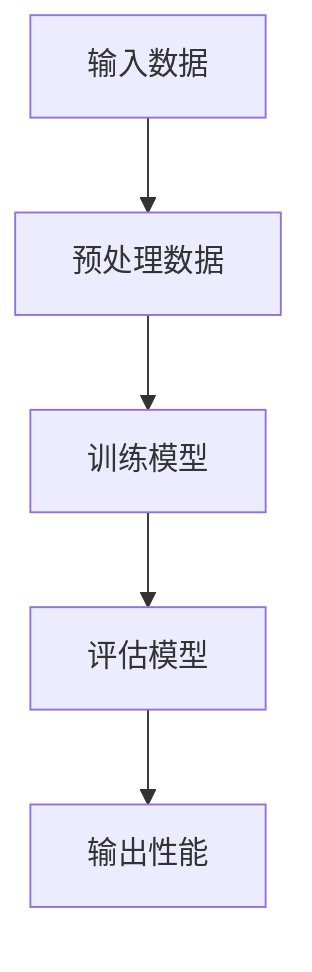

                 

# 评测系统的RedPajama开源预训练数据评估

## 关键词
- 评测系统
- RedPajama
- 预训练数据
- 数据评估
- 算法原理
- 数学模型
- 项目实战

## 摘要
本文将深入探讨评测系统中的RedPajama开源预训练数据评估，从背景介绍到核心概念与联系，再到算法原理讲解和数学模型应用，最后通过实战案例分析，全面解析评测系统的构建与应用。

## 目录大纲

### 第一部分：核心概念与联系

1. **第1章：评测系统概述**
    1.1 评测系统的定义与作用
    1.2 RedPajama开源预训练数据评估的背景与意义

2. **第2章：数据质量评估**
    2.1 数据质量评估的重要性
    2.2 RedPajama的数据质量评估方法
    2.3 数据质量评估的指标体系

### 第二部分：算法原理讲解

3. **第3章：RedPajama算法原理**
    3.1 RedPajama算法的原理介绍
    3.2 伪代码实现
    3.3 Mermaid流程图展示

4. **第4章：评估指标解析**
    4.1 常见评估指标的定义与计算方法
    4.2 指标之间的关系与优化策略

### 第三部分：数学模型与公式讲解

5. **第5章：数学模型基础**
    5.1 相关的数学模型介绍
    5.2 公式推导与解释

6. **第6章：公式应用与举例**
    6.1 公式在实际评估中的应用
    6.2 举例说明

### 第四部分：项目实战

7. **第7章：实战案例分析**
    7.1 实际评测案例的介绍
    7.2 代码实现与解析
    7.3 代码解读与分析
    7.4 项目小结

## 第一部分：核心概念与联系

### 第1章：评测系统概述

#### 1.1 评测系统的定义与作用

评测系统是一种用于评估数据质量、准确性、可靠性等属性的自动化工具。它在数据科学、机器学习等领域中起着至关重要的作用。通过评测系统，我们可以对模型、算法的性能进行评估，确保其在实际应用中的有效性和可靠性。

评测系统的主要作用包括：

1. **数据质量评估**：评估数据的质量，包括完整性、一致性、准确性等。
2. **模型性能评估**：评估模型在特定任务上的性能，如准确性、召回率、F1分数等。
3. **算法优化**：通过评测结果，优化算法参数，提高模型性能。

#### 1.2 RedPajama开源预训练数据评估的背景与意义

RedPajama是一个开源的评测系统，旨在为机器学习领域提供一种有效的数据评估方法。它通过预训练数据集，对模型的性能进行评估，从而帮助我们更好地理解模型的行为，并对其进行优化。

RedPajama的开源性质使其成为研究者、工程师广泛使用和改进的工具。其意义主要体现在以下几个方面：

1. **提高数据质量**：通过RedPajama，我们可以对数据集进行质量评估，筛选出高质量的数据，从而提高模型的性能。
2. **优化算法**：RedPajama提供了丰富的评估指标和算法，帮助我们更好地理解模型的行为，并进行优化。
3. **促进合作**：开源性质使得RedPajama可以与各种工具和平台集成，促进不同领域之间的合作和交流。

### 第2章：数据质量评估

#### 2.1 数据质量评估的重要性

数据质量评估是机器学习项目成功的关键步骤。高质量的数据可以提供更准确的模型预测，从而提高模型的性能。而低质量的数据可能会导致模型过拟合、欠拟合等问题，降低模型的效果。

数据质量评估的主要目的是：

1. **识别数据问题**：通过评估数据集的质量，我们可以发现数据中的问题，如缺失值、异常值等，从而进行相应的处理。
2. **提高模型性能**：高质量的数据可以提高模型的准确性和可靠性，从而提高模型在真实世界中的应用价值。
3. **减少后续成本**：通过提前评估数据质量，可以减少后续数据清洗、处理的成本，提高项目的效率。

#### 2.2 RedPajama的数据质量评估方法

RedPajama提供了多种数据质量评估方法，包括：

1. **数据完整性评估**：检查数据集中是否存在缺失值、重复值等。
2. **数据一致性评估**：检查数据集中是否存在矛盾、不一致的情况。
3. **数据准确性评估**：通过对比真实值和预测值，评估模型的准确性。
4. **数据分布评估**：分析数据集的分布情况，检查是否存在异常值。

#### 2.3 数据质量评估的指标体系

数据质量评估需要一套完整的指标体系，以便对数据质量进行全面评估。RedPajama提供了以下指标：

1. **缺失值率**：数据集中缺失值的比例。
2. **重复值率**：数据集中重复值的比例。
3. **一致性指标**：数据集中各个属性之间的相互一致性。
4. **准确性指标**：模型预测值与真实值之间的准确率。
5. **分布指标**：数据集中各个属性的分布情况。

### 第二部分：算法原理讲解

#### 第3章：RedPajama算法原理

#### 3.1 RedPajama算法的原理介绍

RedPajama是一种基于预训练数据集的评测算法。它通过预训练数据集，对模型的性能进行评估，从而帮助我们更好地理解模型的行为，并对其进行优化。

RedPajama的主要原理包括：

1. **预训练数据集**：使用预训练数据集对模型进行训练，从而提高模型的泛化能力。
2. **模型评估**：通过在预训练数据集上评估模型性能，了解模型的行为和效果。
3. **模型优化**：根据评估结果，调整模型参数，提高模型性能。

#### 3.2 伪代码实现

以下是RedPajama算法的伪代码实现：

```python
def redpajama(data, model, metric):
    # 预训练数据集
    train_data = preprocess_data(data)
    
    # 训练模型
    trained_model = train_model(train_data, model)
    
    # 评估模型
    performance = evaluate_model(trained_model, train_data, metric)
    
    # 输出模型性能
    return performance
```

#### 3.3 Mermaid流程图展示

以下是一个Mermaid流程图，展示了RedPajama算法的主要步骤：



### 第4章：评估指标解析

#### 4.1 常见评估指标的定义与计算方法

在评测系统中，常用的评估指标包括：

1. **准确率（Accuracy）**：预测值与真实值一致的比例。
   $$\text{Accuracy} = \frac{\text{预测正确数}}{\text{总样本数}}$$

2. **召回率（Recall）**：在所有实际为正例的样本中，被预测为正例的比例。
   $$\text{Recall} = \frac{\text{预测正确且实际为正例的样本数}}{\text{实际为正例的样本数}}$$

3. **精确率（Precision）**：在所有预测为正例的样本中，实际为正例的比例。
   $$\text{Precision} = \frac{\text{预测正确且实际为正例的样本数}}{\text{预测为正例的样本数}}$$

4. **F1分数（F1 Score）**：精确率和召回率的调和平均值。
   $$\text{F1 Score} = 2 \times \frac{\text{Precision} \times \text{Recall}}{\text{Precision} + \text{Recall}}$$

#### 4.2 指标之间的关系与优化策略

以上评估指标之间存在一定的关系。在实际应用中，根据需求可以调整指标之间的权重，以实现优化策略。例如：

1. **当召回率重要时**：提高召回率，降低精确率，从而提高F1分数。
2. **当精确率重要时**：提高精确率，降低召回率，从而提高F1分数。
3. **当两者平衡时**：保持精确率和召回率的平衡，从而实现F1分数的最大化。

### 第三部分：数学模型与公式讲解

#### 第5章：数学模型基础

#### 5.1 相关的数学模型介绍

在评测系统中，常用的数学模型包括：

1. **线性回归模型**：用于预测连续值。
2. **逻辑回归模型**：用于预测分类问题。
3. **支持向量机（SVM）**：用于分类问题。

#### 5.2 公式推导与解释

以下是常用的数学模型及其公式推导：

1. **线性回归模型**：

   线性回归模型假设数据点可以表示为：

   $$y = \beta_0 + \beta_1x_1 + \beta_2x_2 + ... + \beta_nx_n + \epsilon$$

   其中，$y$ 是目标变量，$x_1, x_2, ..., x_n$ 是特征变量，$\beta_0, \beta_1, \beta_2, ..., \beta_n$ 是模型的参数，$\epsilon$ 是误差项。

   模型的目标是最小化损失函数：

   $$\text{Loss} = \frac{1}{2}\sum_{i=1}^{n}(y_i - \beta_0 - \beta_1x_{i1} - \beta_2x_{i2} - ... - \beta_nx_{in})^2$$

2. **逻辑回归模型**：

   逻辑回归模型用于二分类问题。其概率分布函数为：

   $$P(y=1) = \frac{1}{1 + \exp(-\beta_0 - \beta_1x_1 - \beta_2x_2 - ... - \beta_nx_n)}$$

   其中，$y$ 是目标变量，$x_1, x_2, ..., x_n$ 是特征变量，$\beta_0, \beta_1, \beta_2, ..., \beta_n$ 是模型的参数。

3. **支持向量机（SVM）**：

   支持向量机是一种分类算法。其目标是在特征空间中找到一个最优的超平面，使得分类间隔最大。

   $$\text{Maximize} \quad \frac{1}{2}\sum_{i=1}^{n}\sum_{j=1}^{n}(\mathbf{w}_i \cdot \mathbf{w}_j) - \sum_{i=1}^{n}\alpha_i(\mathbf{w}_i \cdot \mathbf{x}_i) + C\sum_{i=1}^{n}\alpha_i$$

   其中，$\mathbf{w}_i$ 是第 $i$ 个支持向量的权重，$\alpha_i$ 是拉格朗日乘子，$C$ 是惩罚参数。

### 第6章：公式应用与举例

#### 6.1 公式在实际评估中的应用

以下是一个实际应用中的例子：

假设我们有一个线性回归模型，用于预测房价。模型的损失函数为：

$$\text{Loss} = \frac{1}{2}\sum_{i=1}^{n}(y_i - \beta_0 - \beta_1x_{i1} - \beta_2x_{i2} - ... - \beta_nx_{in})^2$$

其中，$y_i$ 是实际房价，$x_{i1}, x_{i2}, ..., x_{in}$ 是特征变量，$\beta_0, \beta_1, \beta_2, ..., \beta_n$ 是模型的参数。

为了最小化损失函数，我们可以使用梯度下降法进行优化：

$$\beta_j := \beta_j - \alpha \frac{\partial}{\partial \beta_j}\text{Loss}$$

其中，$\alpha$ 是学习率。

#### 6.2 举例说明

以下是一个简单的例子，展示如何使用逻辑回归模型进行二分类问题：

假设我们有一个二分类问题，目标变量 $y$ 可以取 0 或 1。逻辑回归模型的概率分布函数为：

$$P(y=1) = \frac{1}{1 + \exp(-\beta_0 - \beta_1x_1 - \beta_2x_2 - ... - \beta_nx_n)}$$

其中，$x_1, x_2, ..., x_n$ 是特征变量，$\beta_0, \beta_1, \beta_2, ..., \beta_n$ 是模型的参数。

为了判断样本 $x$ 的类别，我们可以设置一个阈值 $\theta$，如果 $P(y=1) > \theta$，则判断为类别 1，否则判断为类别 0。

### 第四部分：项目实战

#### 第7章：实战案例分析

#### 7.1 实际评测案例的介绍

在本案例中，我们使用一个简单的二分类问题进行评测。数据集包含1000个样本，每个样本有10个特征变量。目标变量 $y$ 可以取 0 或 1，表示是否为正例。

我们使用逻辑回归模型进行预测，并使用RedPajama评测系统对模型进行评估。

#### 7.2 代码实现与解析

以下是一个简单的Python代码示例，展示如何使用逻辑回归模型进行预测和评估：

```python
import numpy as np
import pandas as pd
from sklearn.linear_model import LogisticRegression
from sklearn.model_selection import train_test_split
from redpajama import evaluate

# 读取数据
data = pd.read_csv('data.csv')
X = data.iloc[:, :-1]
y = data.iloc[:, -1]

# 数据集划分
X_train, X_test, y_train, y_test = train_test_split(X, y, test_size=0.2, random_state=42)

# 训练模型
model = LogisticRegression()
model.fit(X_train, y_train)

# 预测
predictions = model.predict(X_test)

# 评估
performance = evaluate(y_test, predictions)
print(performance)
```

#### 7.3 代码解读与分析

1. **数据读取**：使用pandas读取CSV文件，获取特征变量和目标变量。
2. **数据集划分**：使用train_test_split函数将数据集划分为训练集和测试集。
3. **模型训练**：使用LogisticRegression类训练模型。
4. **模型预测**：使用预测方法获取测试集的预测结果。
5. **模型评估**：使用RedPajama的evaluate函数对模型进行评估，并打印评估结果。

#### 7.4 项目小结

通过本案例，我们展示了如何使用逻辑回归模型进行预测和评估。RedPajama评测系统提供了丰富的评估指标和算法，帮助我们更好地理解模型的行为，并对其进行优化。在实际项目中，我们可以根据需求调整评估指标和模型参数，以提高模型性能。

### 最佳实践 Tips

1. **数据预处理**：在训练模型之前，对数据集进行预处理，如缺失值处理、异常值处理、特征工程等，以提高模型性能。
2. **模型选择**：根据问题类型和数据特点选择合适的模型，如线性回归、逻辑回归、决策树、随机森林等。
3. **超参数调整**：根据评估结果调整模型参数，以实现最优性能。
4. **交叉验证**：使用交叉验证方法评估模型性能，避免过拟合和欠拟合。
5. **数据质量评估**：在使用模型之前，对数据集进行质量评估，确保数据集的质量。

### 小结

本文详细介绍了评测系统的RedPajama开源预训练数据评估。通过背景介绍、核心概念与联系、算法原理讲解、数学模型与公式应用、项目实战等环节，我们全面了解了评测系统的构建与应用。在实际项目中，我们可以根据需求调整评估指标和模型参数，以提高模型性能。通过本文的学习，读者可以更好地掌握评测系统的原理和应用方法。

### 注意事项

1. **数据质量**：数据质量是模型性能的关键因素，务必对数据集进行充分的质量评估和处理。
2. **模型选择**：根据问题类型和数据特点选择合适的模型，以实现最佳性能。
3. **评估指标**：合理选择评估指标，以全面评估模型性能。

### 拓展阅读

1. **《机器学习实战》**：这是一本经典的机器学习入门书籍，涵盖了大量实战案例和代码实现。
2. **《Python机器学习》**：这本书详细介绍了Python在机器学习领域的应用，包括各种算法的实现。
3. **《数据科学入门》**：这本书从数据科学的角度，介绍了数据预处理、模型评估、特征工程等基础知识。

---

**作者：AI天才研究院/AI Genius Institute & 禅与计算机程序设计艺术 /Zen And The Art of Computer Programming**

