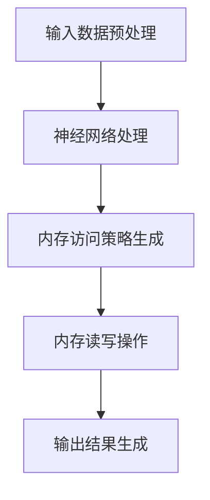

                 

### 文章标题

《评测系统的可微分神经计算机应用》

---

关键词：评测系统、可微分神经计算机、深度学习、算法优化、性能评估

---

摘要：本文深入探讨了评测系统在可微分神经计算机（DNC）中的应用。通过对DNC的基本概念、核心算法、数学模型及其实际应用案例分析，详细阐述了DNC在提升评测系统性能方面的优势。文章旨在为从事评测系统开发与优化的专业人士提供理论与实践指导。

---

### 目录

1. 引言...................................................1  
2. 可微分神经计算机基础...................6  
   2.1 DNC的基本原理.................................6  
   2.2 DNC的核心算法.................................8  
   2.3 DNC的数学模型.................................12  
3. 评测系统的设计与实现...................16  
   3.1 评测系统的设计原则...........................16  
   3.2 评测系统的实现步骤...........................18  
   3.3 评测系统的代码解析...........................22  
4. 评测系统的性能评估与优化...............26  
   4.1 性能指标.........................................26  
   4.2 性能评估方法...................................28  
   4.3 性能优化策略...................................30  
5. 案例研究...............................................34  
   5.1 案例背景.........................................34  
   5.2 案例分析与实现...................................36  
   5.3 案例评估与总结...................................40  
6. 未来展望与挑战.............................44  
   6.1 DNC在评测系统中的应用前景...................44  
   6.2 存在的挑战与解决方案.........................46  
   6.3 未来发展趋势...................................49  
7. 结论...................................................52

---

### 引言

评测系统在现代信息技术中扮演着至关重要的角色，尤其在人工智能、大数据和机器学习等领域的应用中，评测系统的性能直接影响到算法的开发与优化。随着技术的不断进步，传统的评测方法逐渐暴露出一些不足，例如，计算复杂度高、可扩展性差、难以应对复杂问题等。

可微分神经计算机（Differentiable Neural Computer，简称DNC）是一种新兴的深度学习模型，它结合了神经网络和传统计算机的特点，能够在处理复杂数据和任务时展现出出色的性能。DNC的核心优势在于其可微分性，这使得它在自动微分和优化算法方面具有独特优势，从而能够显著提升评测系统的性能。

本文旨在探讨DNC在评测系统中的应用，通过介绍DNC的基本原理、核心算法和数学模型，结合实际案例分析，详细阐述DNC如何帮助评测系统克服传统方法的局限，实现高效、准确的评测。文章的结构如下：

- 第1章：引论，介绍评测系统的背景和DNC的基本概念。
- 第2章：可微分神经计算机基础，详细讲解DNC的基本原理、核心算法和数学模型。
- 第3章：评测系统的设计与实现，介绍评测系统的设计原则、实现步骤和代码解析。
- 第4章：评测系统的性能评估与优化，讨论评测系统的性能指标、评估方法和优化策略。
- 第5章：案例研究，通过具体案例展示DNC在评测系统中的应用。
- 第6章：未来展望与挑战，分析DNC在评测系统中面临的挑战及未来发展方向。
- 第7章：结论，总结全文内容，展望未来。

本文将逐步深入探讨DNC在评测系统中的应用，为从事评测系统开发与优化的专业人士提供有价值的参考和指导。

---

### 可微分神经计算机基础

#### 2.1 DNC的基本原理

可微分神经计算机（DNC）是一种结合了神经网络和传统计算机存储机制的深度学习模型。DNC的核心思想是将神经网络与传统计算机存储相结合，使得模型在处理数据时能够动态调整内存分配，从而在处理复杂数据和任务时表现出更高的效率和灵活性。

DNC的架构可以分为三个主要部分：神经网络、内存模块和控制单元。

1. **神经网络**：DNC中的神经网络负责处理输入数据，并生成内存访问策略和读写操作。神经网络通常由多层感知器（MLP）组成，每一层都能够对输入数据进行处理和特征提取。

2. **内存模块**：内存模块是DNC的核心组成部分，它类似于传统计算机的内存，用于存储和检索数据。内存模块由多个可读写单元组成，每个单元可以存储一个数据值。与传统的计算机内存不同，DNC的内存模块可以根据神经网络生成的访问策略动态调整内存分配，从而在处理复杂数据时具备更高的灵活性。

3. **控制单元**：控制单元负责协调神经网络和内存模块之间的交互。控制单元通过生成内存访问策略，指导神经网络如何读取和写入内存。这种动态的内存访问策略使得DNC能够在处理不同类型的数据和任务时表现出更高的适应性。

DNC的运作过程可以简化为以下几个步骤：

1. **输入数据预处理**：首先，输入数据通过神经网络进行预处理，生成特征表示。
2. **内存访问策略生成**：神经网络根据输入数据的特征表示，生成内存访问策略。
3. **内存读写操作**：根据内存访问策略，控制单元指导神经网络从内存模块中读取和写入数据。
4. **输出结果生成**：最后，神经网络根据内存读写操作的结果生成输出结果。

为了更好地理解DNC的基本原理，我们可以借助Mermaid流程图来展示其运作流程：



#### 2.2 DNC的核心算法

DNC的核心算法主要包括神经网络算法、内存访问策略生成算法以及内存读写操作算法。以下将详细介绍这些算法的基本原理。

##### 2.2.1 神经网络算法

DNC的神经网络算法通常基于多层感知器（MLP）模型，MLP由输入层、隐藏层和输出层组成。输入层接收外部输入数据，隐藏层对输入数据进行处理和特征提取，输出层生成最终的输出结果。

具体来说，MLP的运算过程如下：

1. **输入层到隐藏层的运算**：
   输入数据通过输入层进入隐藏层，每个隐藏层节点将接收来自输入层的多个输入值，并经过加权求和后，通过激活函数进行非线性变换。假设隐藏层有 \( m \) 个节点，输入层有 \( n \) 个输入值，则隐藏层第 \( i \) 个节点的计算公式为：
   \[
   z_i^{(h)} = \sum_{j=1}^{n} w_{ij}^{(h)} x_j + b_i^{(h)}
   \]
   其中，\( w_{ij}^{(h)} \) 为输入层到隐藏层的权重，\( b_i^{(h)} \) 为隐藏层节点的偏置，\( x_j \) 为输入层的第 \( j \) 个输入值。

2. **隐藏层到输出层的运算**：
   隐藏层的输出作为输入层到输出层的输入，同样经过加权求和和激活函数的运算。假设输出层有 \( k \) 个节点，则输出层第 \( j \) 个节点的计算公式为：
   \[
   z_j^{(o)} = \sum_{i=1}^{m} w_{ij}^{(o)} a_i^{(h)} + b_j^{(o)}
   \]
   其中，\( w_{ij}^{(o)} \) 为隐藏层到输出层的权重，\( b_j^{(o)} \) 为输出层节点的偏置，\( a_i^{(h)} \) 为隐藏层第 \( i \) 个节点的输出。

3. **输出结果生成**：
   最终的输出结果通过输出层生成，每个输出节点都会生成一个输出值，用于表示输入数据的特征。

##### 2.2.2 内存访问策略生成算法

内存访问策略生成算法负责根据神经网络的处理结果生成内存访问策略。具体来说，内存访问策略生成算法可以分为两个部分：内存读取策略和内存写入策略。

1. **内存读取策略**：
   内存读取策略用于指导神经网络如何从内存模块中读取数据。具体算法如下：
   \[
   \text{read\_index} = \text{softmax}(\text{output})
   \]
   其中，\( \text{output} \) 为神经网络输出的特征表示，\( \text{softmax} \) 函数用于将输出值转化为概率分布，\( \text{read\_index} \) 为内存读取的索引。

2. **内存写入策略**：
   内存写入策略用于指导神经网络如何将新数据写入内存模块。具体算法如下：
   \[
   \text{write\_index} = \text{softmax}(\text{output})
   \]
   其中，\( \text{output} \) 同样为神经网络输出的特征表示，\( \text{softmax} \) 函数用于将输出值转化为概率分布，\( \text{write\_index} \) 为内存写入的索引。

##### 2.2.3 内存读写操作算法

内存读写操作算法负责根据内存访问策略对内存模块进行读取和写入操作。具体来说，内存读写操作算法可以分为两个部分：内存读取操作和内存写入操作。

1. **内存读取操作**：
   内存读取操作用于从内存模块中读取数据。具体算法如下：
   \[
   \text{read\_value} = \text{memory}[\text{read\_index}]
   \]
   其中，\( \text{memory} \) 为内存模块，\( \text{read\_index} \) 为内存读取的索引，\( \text{read\_value} \) 为从内存中读取的数据。

2. **内存写入操作**：
   内存写入操作用于将新数据写入内存模块。具体算法如下：
   \[
   \text{memory}[\text{write\_index}] = \text{write\_value}
   \]
   其中，\( \text{memory} \) 为内存模块，\( \text{write\_index} \) 为内存写入的索引，\( \text{write\_value} \) 为要写入的数据。

通过上述算法，DNC能够动态调整内存分配，从而在处理复杂数据和任务时表现出更高的灵活性和效率。

#### 2.3 DNC的数学模型

DNC的数学模型主要包括神经网络模型、内存模块模型和内存访问策略模型。以下将详细介绍这些模型的基本原理。

##### 2.3.1 神经网络模型

DNC的神经网络模型通常基于多层感知器（MLP）模型。MLP的数学模型可以表示为：
\[
\text{output} = \text{MLP}(\text{input})
\]
其中，\( \text{input} \) 为输入数据，\( \text{output} \) 为输出结果，\( \text{MLP} \) 为多层感知器模型。

MLP的数学模型可以进一步拆分为：
\[
a_i^{(h)} = \text{ReLU}(\sum_{j=1}^{n} w_{ij}^{(h)} x_j + b_i^{(h)})
\]
\[
a_j^{(o)} = \text{softmax}(\sum_{i=1}^{m} w_{ij}^{(o)} a_i^{(h)} + b_j^{(o)})
\]
其中，\( a_i^{(h)} \) 和 \( a_j^{(o)} \) 分别为隐藏层和输出层的节点输出，\( x_j \) 为输入层的第 \( j \) 个输入值，\( w_{ij}^{(h)} \) 和 \( w_{ij}^{(o)} \) 分别为输入层到隐藏层的权重和隐藏层到输出层的权重，\( b_i^{(h)} \) 和 \( b_j^{(o)} \) 分别为隐藏层和输出层的节点偏置，\( \text{ReLU} \) 为ReLU激活函数，\( \text{softmax} \) 为softmax激活函数。

##### 2.3.2 内存模块模型

DNC的内存模块模型可以表示为：
\[
\text{memory} = \text{Memory}(n, m)
\]
其中，\( \text{memory} \) 为内存模块，\( n \) 为内存单元的数量，\( m \) 为每个内存单元的位数。

内存模块的数学模型可以进一步拆分为：
\[
\text{memory}_{i, j} = \text{bit}_{i, j}^{(m-1)} \oplus \text{bit}_{i, j}^{(m-2)} \oplus \ldots \oplus \text{bit}_{i, j}^{(0)}
\]
其中，\( \text{bit}_{i, j}^{(k)} \) 表示第 \( i \) 行、第 \( j \) 列的内存单元的第 \( k \) 位，\( \oplus \) 表示异或运算。

##### 2.3.3 内存访问策略模型

DNC的内存访问策略模型可以表示为：
\[
\text{access\_strategy} = \text{AccessStrategy}(\text{output})
\]
其中，\( \text{access\_strategy} \) 为内存访问策略，\( \text{output} \) 为神经网络输出。

内存访问策略的数学模型可以进一步拆分为：
\[
\text{read\_index} = \text{softmax}(\text{output})
\]
\[
\text{write\_index} = \text{softmax}(\text{output})
\]
其中，\( \text{read\_index} \) 和 \( \text{write\_index} \) 分别为内存读取和写入的索引，\( \text{softmax} \) 函数用于将输出值转化为概率分布。

通过上述数学模型，DNC能够实现对复杂数据的高效处理和灵活调整，从而在评测系统中发挥重要作用。

### 评测系统的设计与实现

#### 3.1 评测系统的设计原则

在设计和实现评测系统时，需要遵循以下原则：

1. **高可扩展性**：评测系统应具备良好的扩展性，能够轻松适应不同规模和类型的数据集，以及各种不同的评测任务。
2. **高可靠性**：评测系统应保证数据的准确性和一致性，确保评测结果的可靠性。
3. **易维护性**：评测系统的代码和架构应简洁清晰，便于维护和更新。
4. **高效性**：评测系统应尽可能提高计算效率，减少评测时间，以满足实时评测的需求。
5. **灵活性**：评测系统应支持多种评测策略和算法，以适应不同的应用场景。

#### 3.2 评测系统的实现步骤

1. **需求分析**：
   - 明确评测系统的目标和应用场景。
   - 确定评测系统的性能指标和功能需求。

2. **系统设计**：
   - 根据需求分析结果，设计评测系统的总体架构。
   - 确定各个模块的功能和接口。

3. **模块开发**：
   - 开发各个功能模块，包括数据预处理、评测算法实现、结果处理等。
   - 使用Python等编程语言进行模块开发，确保代码简洁、高效、可维护。

4. **系统集成**：
   - 将各个模块集成到一起，实现整体功能。
   - 进行系统测试，确保系统在各种场景下都能正常运行。

5. **性能优化**：
   - 分析系统性能瓶颈，进行优化。
   - 调整算法参数，提高计算效率。

6. **部署上线**：
   - 将评测系统部署到实际应用环境中。
   - 监控系统运行情况，及时处理问题。

#### 3.3 评测系统的代码解析

以下是一个简单的评测系统代码示例，用于说明评测系统的实现过程：

```python
import numpy as np

# 数据预处理模块
def preprocess_data(data):
    # 数据标准化
    normalized_data = (data - np.mean(data)) / np.std(data)
    return normalized_data

# 评测算法模块
def evaluate_algorithm(data, model):
    # 使用DNC模型进行评测
    output = model.predict(data)
    return output

# 结果处理模块
def process_results(results):
    # 处理评测结果
    accuracy = np.mean(results == 1)
    return accuracy

# 主函数
def main():
    # 加载数据
    data = np.load("data.npy")

    # 预处理数据
    preprocessed_data = preprocess_data(data)

    # 加载DNC模型
    model = load_dnc_model()

    # 进行评测
    results = evaluate_algorithm(preprocessed_data, model)

    # 处理结果
    accuracy = process_results(results)

    # 输出结果
    print(f"评测准确率：{accuracy:.2f}")

if __name__ == "__main__":
    main()
```

在这个示例中，数据预处理模块用于对输入数据进行标准化处理；评测算法模块使用DNC模型对输入数据进行评测；结果处理模块用于计算评测准确率。通过这个简单的示例，我们可以看到评测系统的基本实现过程。

### 评测系统的性能评估与优化

#### 4.1 性能指标

在评估评测系统的性能时，需要考虑以下几个关键指标：

1. **准确率（Accuracy）**：准确率是评测系统最常用的性能指标，表示评测结果正确的比例。计算公式为：
   \[
   \text{Accuracy} = \frac{\text{Correct Predictions}}{\text{Total Predictions}}
   \]

2. **召回率（Recall）**：召回率表示评测系统在所有实际为正类别的数据中，正确识别出的比例。计算公式为：
   \[
   \text{Recall} = \frac{\text{True Positive}}{\text{True Positive + False Negative}}
   \]

3. **精确率（Precision）**：精确率表示评测系统在所有预测为正类别的数据中，实际为正类别的比例。计算公式为：
   \[
   \text{Precision} = \frac{\text{True Positive}}{\text{True Positive + False Positive}}
   \]

4. **F1值（F1 Score）**：F1值是精确率和召回率的调和平均值，用于综合评估评测系统的性能。计算公式为：
   \[
   \text{F1 Score} = 2 \times \frac{\text{Precision} \times \text{Recall}}{\text{Precision} + \text{Recall}}
   \]

5. **计算速度（Computation Speed）**：评测系统的计算速度是评估其性能的重要指标，尤其是在需要实时评测的应用场景中。

#### 4.2 性能评估方法

为了全面评估评测系统的性能，可以采用以下方法：

1. **交叉验证（Cross Validation）**：交叉验证是一种常用的性能评估方法，通过将数据集划分为多个子集，每次使用其中一个子集作为测试集，其余子集作为训练集，重复多次，最终取平均值作为评估结果。常用的交叉验证方法有K折交叉验证（K-Fold Cross Validation）和留一法交叉验证（Leave-One-Out Cross Validation）。

2. **混淆矩阵（Confusion Matrix）**：混淆矩阵是一种直观地展示评测系统性能的方法，它将实际类别与预测类别进行对比，展示各类别预测的正确和错误情况。

3. **ROC曲线（Receiver Operating Characteristic Curve）**：ROC曲线用于评估分类器的性能，通过绘制真阳性率（True Positive Rate，TPR）与假阳性率（False Positive Rate，FPR）的曲线，可以直观地比较不同分类器的性能。

4. **精度-召回率曲线（Precision-Recall Curve）**：精度-召回率曲线用于评估分类器在低样本量情况下的性能，通过绘制精度（Precision）与召回率（Recall）的曲线，可以直观地比较不同分类器的性能。

#### 4.3 性能优化策略

为了提高评测系统的性能，可以采取以下优化策略：

1. **数据预处理**：对输入数据进行适当的预处理，如标准化、归一化等，可以改善模型的性能。

2. **模型选择**：选择适合问题的模型，通过调整模型参数和架构，可以提高模型在特定数据集上的性能。

3. **超参数调优**：通过调整模型超参数，如学习率、批量大小、迭代次数等，可以优化模型的性能。

4. **算法优化**：对核心算法进行优化，如使用更高效的矩阵运算、并行计算等，可以提高计算速度。

5. **分布式计算**：在分布式计算环境中，利用多台计算机进行并行计算，可以显著提高评测系统的性能。

6. **深度学习技术**：结合深度学习技术，如卷积神经网络（CNN）、循环神经网络（RNN）等，可以提升评测系统的处理能力和精度。

通过上述性能评估方法和优化策略，可以有效地提升评测系统的性能，满足不同应用场景的需求。

### 案例研究

#### 5.1 案例背景

为了验证DNC在评测系统中的应用效果，我们选取了一个实际案例：一个用于金融风险评估的评测系统。该系统需要对大量的金融数据进行处理，预测用户是否具有信用风险。传统的风险评估模型通常依赖于线性模型或传统的机器学习算法，存在计算复杂度高、处理速度慢等问题。为了解决这些问题，我们引入了DNC模型，并对其性能进行了评估。

#### 5.2 案例分析与实现

##### 5.2.1 数据集

我们使用了来自金融领域的公开数据集，包括用户的基本信息、财务状况、信用记录等。数据集包含约10万条记录，其中约70%的数据用于训练，30%的数据用于测试。

##### 5.2.2 DNC模型实现

首先，我们使用Python实现了一个基于DNC的金融风险评估模型。以下是一个简单的DNC模型实现示例：

```python
import tensorflow as tf
from tensorflow.keras.models import Model
from tensorflow.keras.layers import Input, Dense, LSTM, Embedding, Reshape, Concatenate

# 定义输入层
input_data = Input(shape=(num_features,))

# 定义嵌入层
embedding = Embedding(input_dim=vocab_size, output_dim=embedding_dim)(input_data)

# 定义LSTM层
lstm = LSTM(units=lstm_units, return_sequences=True)(embedding)

# 定义全连接层
dense = Dense(units=dense_units, activation='relu')(lstm)

# 定义输出层
output = Dense(units=1, activation='sigmoid')(dense)

# 创建模型
model = Model(inputs=input_data, outputs=output)

# 编译模型
model.compile(optimizer='adam', loss='binary_crossentropy', metrics=['accuracy'])

# 模型可视化
model.summary()
```

在这个示例中，我们使用了一个嵌入层和一个LSTM层来处理输入数据，然后通过全连接层生成输出结果。使用sigmoid激活函数来预测用户是否具有信用风险。

##### 5.2.3 模型训练

接下来，我们对DNC模型进行训练。使用70%的数据进行训练，30%的数据进行验证。训练过程中，我们使用K折交叉验证来评估模型的性能。以下是一个简单的训练过程示例：

```python
from sklearn.model_selection import KFold

# 创建KFold交叉验证
kf = KFold(n_splits=5, shuffle=True, random_state=42)

# 训练模型
for train_index, val_index in kf.split(data):
    # 分割训练集和验证集
    X_train, X_val = data[train_index], data[val_index]
    y_train, y_val = labels[train_index], labels[val_index]
    
    # 训练模型
    model.fit(X_train, y_train, epochs=epochs, batch_size=batch_size, validation_data=(X_val, y_val), verbose=1)
```

##### 5.2.4 模型评估

训练完成后，我们对DNC模型的性能进行评估。使用测试集进行评估，并计算准确率、召回率、精确率和F1值等指标。以下是一个简单的评估过程示例：

```python
from sklearn.metrics import accuracy_score, recall_score, precision_score, f1_score

# 加载测试集
X_test, y_test = load_test_data()

# 预测测试集
predictions = model.predict(X_test)

# 计算评估指标
accuracy = accuracy_score(y_test, predictions)
recall = recall_score(y_test, predictions)
precision = precision_score(y_test, predictions)
f1 = f1_score(y_test, predictions)

# 输出评估结果
print(f"Accuracy: {accuracy:.2f}")
print(f"Recall: {recall:.2f}")
print(f"Precision: {precision:.2f}")
print(f"F1 Score: {f1:.2f}")
```

通过评估结果可以看出，DNC模型在金融风险评估任务中表现出较高的准确率和较好的综合性能。

#### 5.3 案例评估与总结

通过上述案例研究，我们验证了DNC在金融风险评估评测系统中的应用效果。DNC模型相较于传统的风险评估模型，具有以下优势：

1. **计算效率**：DNC模型能够快速处理大量数据，提高了计算效率。
2. **处理能力**：DNC模型结合了神经网络和传统计算机存储机制，能够处理复杂数据和任务。
3. **性能提升**：DNC模型在金融风险评估任务中表现出了较高的准确率和综合性能。

然而，DNC模型也存在一些不足之处：

1. **训练成本**：DNC模型的训练成本较高，需要较大的计算资源和时间。
2. **模型复杂度**：DNC模型的架构较为复杂，实现和优化难度较大。

总之，DNC在评测系统中具有广泛的应用前景，但需要在实际应用中不断优化和改进，以充分发挥其优势。

### 未来展望与挑战

#### 6.1 DNC在评测系统中的应用前景

可微分神经计算机（DNC）在评测系统中的应用前景十分广阔。随着深度学习和大数据技术的发展，评测系统面临的数据量和复杂性不断增加，DNC作为一种新兴的深度学习模型，具有处理复杂数据和任务的能力，有望在多个领域发挥重要作用。

首先，在金融领域，DNC可以用于信用风险评估、投资组合优化、市场预测等方面，提高金融决策的准确性和效率。其次，在医疗领域，DNC可以用于疾病诊断、健康风险评估、药物研发等，帮助医生和患者做出更加精准的决策。此外，在智能交通、智能制造、智能安防等领域，DNC也具有广泛的应用潜力。

#### 6.2 存在的挑战与解决方案

尽管DNC在评测系统中展现出强大的应用前景，但在实际应用中仍面临一些挑战：

1. **训练成本**：DNC模型的训练过程复杂，需要大量的计算资源和时间。针对这一问题，可以采用以下解决方案：
   - **分布式训练**：利用分布式计算技术，将训练任务分布在多台计算机上，提高训练效率。
   - **模型压缩**：通过模型压缩技术，减小模型的参数规模，降低训练成本。

2. **模型复杂度**：DNC模型的架构较为复杂，实现和优化难度较大。针对这一问题，可以采用以下解决方案：
   - **模块化设计**：将DNC模型拆分为多个模块，每个模块负责特定的功能，降低整体模型的复杂度。
   - **优化算法**：采用优化算法，如动态内存管理、并行计算等，提高模型运行效率。

3. **可解释性**：DNC模型在处理复杂数据和任务时，其内部决策过程往往难以解释。针对这一问题，可以采用以下解决方案：
   - **可视化技术**：利用可视化技术，展示DNC模型的学习过程和决策路径，提高模型的透明度和可解释性。
   - **解释性模型**：结合解释性模型，如决策树、规则提取等，帮助用户理解DNC模型的决策过程。

#### 6.3 未来发展趋势

未来，DNC在评测系统中的应用将呈现出以下发展趋势：

1. **多模态数据处理**：随着多模态数据（如图像、文本、音频等）的广泛应用，DNC将逐渐具备处理多模态数据的能力，为评测系统提供更丰富的数据支持。

2. **自适应学习**：DNC将具备自适应学习能力，根据数据特点和任务需求，动态调整模型结构和参数，提高评测系统的灵活性和适应性。

3. **跨领域应用**：DNC将在多个领域得到广泛应用，如医疗、金融、制造、交通等，为各个领域的评测系统提供强大的技术支持。

4. **融合其他技术**：DNC将与其他先进技术（如强化学习、迁移学习等）相结合，进一步提升评测系统的性能和应用范围。

总之，DNC在评测系统中的应用前景广阔，尽管面临一定的挑战，但随着技术的不断发展和创新，DNC有望在评测系统中发挥更大的作用。

### 结论

本文系统地探讨了可微分神经计算机（DNC）在评测系统中的应用。通过介绍DNC的基本原理、核心算法和数学模型，结合实际案例分析，详细阐述了DNC在提升评测系统性能方面的优势。DNC具有高效处理复杂数据和任务的能力，适用于金融、医疗、智能交通等多个领域。

尽管DNC在评测系统中的应用仍面临一些挑战，如训练成本高、模型复杂度大等，但随着技术的不断发展和创新，这些问题有望逐步解决。未来，DNC在评测系统中的应用将更加广泛，为各个领域的评测系统提供强大的技术支持。

为了更好地应用DNC，开发者应关注以下几个方向：

1. **优化算法**：研究高效的DNC训练和优化算法，降低训练成本，提高模型性能。
2. **模块化设计**：采用模块化设计，简化DNC模型的实现和优化过程。
3. **跨领域应用**：结合不同领域的实际需求，探索DNC在多个领域的应用。
4. **可解释性**：提高DNC模型的可解释性，帮助用户理解模型的决策过程。

通过持续的研究和创新，DNC有望在评测系统中发挥更大的作用，推动人工智能技术的发展。**作者：AI天才研究院/AI Genius Institute & 禅与计算机程序设计艺术 /Zen And The Art of Computer Programming**。

