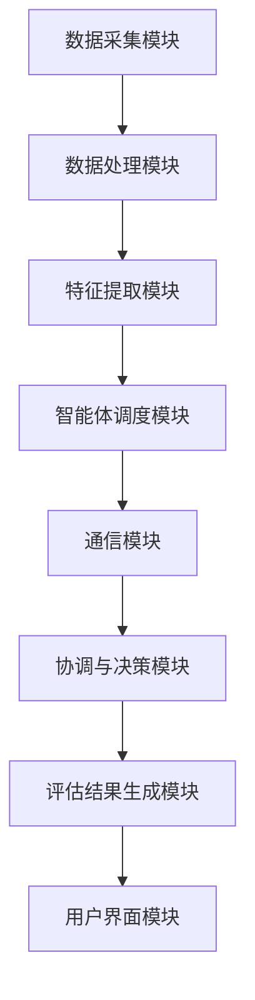

                 

### 引言

评测系统在现代信息化社会中扮演着至关重要的角色。无论是教育、人力资源、还是产品评测，都需要高效的评测系统来提供准确、可靠的评估结果。然而，随着评测对象的多样化和复杂性的增加，传统的单一智能体评测系统已经难以满足实际需求。为此，多智能体协作评测框架应运而生。

多智能体协作评测框架利用多个智能体的协同工作，实现对评测对象的全面、准确的评估。它不仅能够提升评测系统的效率和精度，还能够适应复杂多变的应用场景。本文将详细介绍多智能体协作评测框架的设计、实现和应用，旨在为读者提供一种全新的评测思路和解决方案。

本文将从以下几个方面展开讨论：

1. **多智能体系统基础**：介绍多智能体系统的基本概念、通信与协调机制、分类与特性。
2. **多智能体协作评测框架设计**：详细阐述框架的设计原则、模块划分与功能、系统架构图以及实现方法。
3. **核心算法与模型**：介绍多智能体协作算法和多智能体学习模型，包括协作目标与策略、常见协作算法、多智能体强化学习和多智能体生成对抗网络。
4. **实际应用**：通过教育评测和人力资源评测两个案例，展示多智能体协作评测框架在实际应用中的效果和挑战。
5. **性能评估与优化**：介绍评测指标与评估方法、实验设计、结果分析与优化建议。
6. **总结与展望**：总结全文内容，展望多智能体协作评测框架的未来发展趋势和研究方向。

通过本文的讨论，希望读者能够对多智能体协作评测框架有一个全面、深入的理解，并能够将其应用于实际评测系统中，提升评测效率和精度。

### 关键词

- 多智能体系统
- 协作评测框架
- 教育评测
- 人力资源评测
- 强化学习
- 生成对抗网络
- 性能评估

### 摘要

本文旨在探讨多智能体协作评测框架的设计、实现和应用。首先，介绍了多智能体系统的基本概念和通信协调机制，随后详细阐述了多智能体协作评测框架的设计原则和系统架构。接着，本文介绍了核心算法与模型，包括协作算法和多智能体学习模型。随后，通过教育评测和人力资源评测两个实际案例，展示了多智能体协作评测框架的应用效果和挑战。最后，本文对框架的性能评估和优化进行了探讨，并提出了未来发展的方向。通过本文的讨论，希望能够为读者提供一种高效的评测解决方案。

## 第1章 引言

### 1.1 书籍背景与目标读者

随着信息技术的飞速发展，评测系统在现代社会的各个领域都扮演着至关重要的角色。无论是教育、人力资源、产品评测，还是其他各种形式的评估，高效的评测系统都是确保评估结果准确性和可靠性的基础。然而，随着评测对象的多样化和复杂性的增加，传统的单一智能体评测系统已经难以满足实际需求。为了应对这一挑战，多智能体协作评测框架应运而生。

多智能体协作评测框架通过利用多个智能体的协同工作，实现对评测对象的全面、准确的评估。它不仅能够提升评测系统的效率和精度，还能够适应复杂多变的应用场景。本文旨在详细介绍多智能体协作评测框架的设计、实现和应用，为读者提供一种全新的评测思路和解决方案。

本文的目标读者是：
1. **计算机科学和人工智能领域的研究人员**：希望通过本文深入了解多智能体系统及其在评测领域的应用。
2. **软件工程师和系统架构师**：希望了解如何设计和实现多智能体协作评测框架，并将其应用于实际项目中。
3. **教育工作者和人力资源管理者**：希望通过本文了解多智能体协作评测框架在教育评测和人力资源评测中的应用，提升评估效率和精度。

通过本文的阅读，读者将能够：
1. **理解多智能体系统的基本概念和通信协调机制**。
2. **掌握多智能体协作评测框架的设计原则和实现方法**。
3. **了解核心算法与模型，包括协作算法和多智能体学习模型**。
4. **掌握多智能体协作评测框架在实际应用中的效果和挑战**。
5. **了解评测指标与评估方法，以及性能评估和优化策略**。

### 1.2 多智能体协作评测框架的重要性

多智能体协作评测框架的重要性体现在以下几个方面：

1. **提高评估效率和精度**：传统的单一智能体评测系统在面对复杂评估对象时，往往难以全面、准确地评估其特性。多智能体协作评测框架通过多个智能体的协同工作，能够实现对评估对象的全面、准确的评估，从而提高评估效率和精度。

2. **适应多样化应用场景**：不同的评测场景具有不同的需求，单一智能体评测系统难以适应多样化的应用场景。多智能体协作评测框架能够根据不同的评测需求，灵活地调整和组合智能体，使其适应各种应用场景。

3. **提升评估系统的鲁棒性**：多智能体协作评测框架能够通过多个智能体的协同工作，提高评估系统的鲁棒性。即使某个智能体出现故障，其他智能体仍然可以正常工作，从而保证评测系统的稳定运行。

4. **支持个性化评估**：多智能体协作评测框架能够根据评估对象的个性化需求，提供定制化的评估方案。通过多个智能体的协同工作，可以实现更精细、更个性化的评估，满足不同用户的评估需求。

5. **促进智能化发展**：多智能体协作评测框架是人工智能在评测领域的重要应用，有助于推动评测系统的智能化发展。通过引入先进的算法和模型，多智能体协作评测框架能够不断优化评估过程，提高评估质量，为智能化评测提供有力支持。

### 1.3 书籍结构安排

本文将分为以下几个主要部分：

1. **第1章 引言**：介绍书籍的背景、目标读者、多智能体协作评测框架的重要性，以及书籍的结构安排。

2. **第2章 多智能体系统基础**：介绍多智能体系统的基本概念、通信与协调机制、分类与特性。

3. **第3章 多智能体协作评测框架设计**：详细阐述多智能体协作评测框架的设计原则、模块划分与功能、系统架构图以及实现方法。

4. **第4章 核心算法与模型**：介绍多智能体协作算法和多智能体学习模型，包括协作目标与策略、常见协作算法、多智能体强化学习和多智能体生成对抗网络。

5. **第5章 实际应用**：通过教育评测和人力资源评测两个实际案例，展示多智能体协作评测框架的应用效果和挑战。

6. **第6章 性能评估与优化**：介绍评测指标与评估方法、实验设计、结果分析与优化建议。

7. **第7章 总结与展望**：总结全文内容，展望多智能体协作评测框架的未来发展趋势和研究方向。

通过以上章节的论述，本文旨在为读者提供一个全面、深入的多智能体协作评测框架的概述，帮助读者了解其设计原理、实现方法和实际应用效果。

### 第2章 多智能体系统基础

#### 2.1 多智能体系统概述

多智能体系统（Multi-Agent System，MAS）是一种由多个具有独立性和自主性的智能体组成的系统，这些智能体能够通过相互协作来完成复杂的任务。在多智能体系统中，每个智能体都是独立的计算实体，具有自主决策、自主学习和自主执行的能力。智能体之间通过通信和协调机制相互交互，共同完成任务。

多智能体系统的基本概念包括智能体、环境、通信、协调和协作。智能体是系统的基本组成单位，具有以下特征：

1. **自主性**：智能体能够独立地做出决策，不受其他智能体的控制。
2. **分布性**：智能体可以分布在不同的物理位置或逻辑位置上。
3. **适应性**：智能体能够根据环境和任务的变化调整自己的行为和策略。
4. **协同性**：智能体之间可以通过通信和协调机制相互协作，共同完成任务。

多智能体系统在各个领域都有广泛的应用，如机器人学、自动化、人工智能、社会计算等。它们通过模拟人类社会的协作和交互，实现复杂任务的自动化和智能化。

#### 2.2 多智能体系统的通信与协调

通信和协调是多智能体系统的核心组成部分，直接影响到系统的效率和性能。在多智能体系统中，智能体之间的通信主要通过以下几种方式进行：

1. **直接通信**：智能体通过直接发送消息来交换信息，这种方式适用于智能体之间的距离较近，且通信频率较高的情况。
2. **间接通信**：智能体通过一个或多个中间代理来传递信息，适用于智能体之间的距离较远，或者通信频率较低的情况。
3. **广播通信**：智能体向系统中的所有其他智能体发送消息，适用于需要全局信息共享的情况。

协调是多智能体系统中的另一个重要概念，指的是智能体之间通过某种机制，共同完成任务的过程。协调机制主要包括以下几种：

1. **中央协调**：一个中央智能体负责协调所有智能体的行动，这种方式适用于智能体数量较少且任务相对简单的情况。
2. **分布式协调**：智能体之间通过协商和协调机制，自主地完成任务，适用于智能体数量较多且任务复杂的情况。
3. **协商机制**：智能体之间通过协商，达成共识，共同完成任务。
4. **市场机制**：智能体通过市场机制，根据需求和供应进行协调，实现资源的合理分配。

#### 2.3 多智能体系统的分类与特性

多智能体系统可以根据不同的标准进行分类，以下是几种常见的分类方式：

1. **基于智能体的自主性**：可以分为完全自主智能体、半自主智能体和非自主智能体。完全自主智能体具有完全的自主决策能力，半自主智能体在部分功能上具有自主性，非自主智能体则需要依赖其他智能体的指令。
2. **基于智能体的通信方式**：可以分为基于内容的通信和基于位置的通信。基于内容的通信关注智能体之间的信息交换，而基于位置的通信关注智能体之间的地理位置关系。
3. **基于智能体的协作方式**：可以分为协同智能体、竞争智能体和协作智能体。协同智能体共同完成任务，竞争智能体之间相互竞争，协作智能体之间既竞争又合作。

不同类型的多智能体系统具有各自的特点和优势：

- **完全自主智能体**：具有高度的灵活性和适应性，能够根据环境和任务的变化自主调整行为。
- **半自主智能体**：在部分功能上具有自主性，能够在一定程度上减少中央协调的负担。
- **非自主智能体**：需要依赖其他智能体的指令，适用于需要集中控制和统一指挥的任务。
- **基于内容的通信**：能够实现高效的信息共享，适用于需要全局信息共享的任务。
- **基于位置的通信**：能够根据智能体的地理位置关系进行任务分配和协调，适用于地理分布广泛的任务。
- **协同智能体**：能够共同完成任务，提高系统的整体效率。
- **竞争智能体**：能够通过竞争激发智能体的潜力，提高系统的创新性和灵活性。
- **协作智能体**：能够在竞争与合作之间找到平衡，实现最优的协同效应。

#### 2.4 多智能体系统的基础概念与术语

在多智能体系统中，有一些基础概念和术语需要了解：

1. **智能体（Agent）**：独立的计算实体，具有自主决策、自主学习和自主执行的能力。
2. **环境（Environment）**：智能体所在的空间和状态，包括物理环境和虚拟环境。
3. **通信（Communication）**：智能体之间的信息交换方式，包括直接通信、间接通信和广播通信。
4. **协调（Coordination）**：智能体之间的协作过程，通过协调机制实现共同任务。
5. **协作（Collaboration）**：智能体之间通过协商和协调机制共同完成任务。
6. **自主性（Autonomy）**：智能体独立决策的能力。
7. **分布性（Distribution）**：智能体分布在不同的物理或逻辑位置上。
8. **适应性（Adaptability）**：智能体能够根据环境和任务的变化调整行为和策略。
9. **协同性（Synergy）**：智能体之间通过协同工作实现共同目标。

通过以上基础概念的介绍，读者可以更好地理解多智能体系统的基本原理和实现方法。在下一章中，我们将详细讨论多智能体协作评测框架的设计原则和系统架构。

### 第3章 多智能体协作评测框架设计

#### 3.1 框架设计原则

多智能体协作评测框架的设计原则是确保系统能够高效、稳定、可靠地运行，同时能够灵活地适应不同的评测需求。以下是该框架设计的几个关键原则：

1. **模块化设计**：将整个评测系统划分为多个模块，每个模块负责特定的功能。这种方式不仅有助于系统的维护和扩展，还能够提高系统的可重用性和灵活性。

2. **分布式架构**：由于评测任务可能涉及大量的数据和处理，采用分布式架构能够充分利用多台计算机的计算资源，提高系统的处理能力和性能。

3. **自主性与协同性**：每个智能体都应具有高度的自主性，能够独立地完成特定任务。同时，智能体之间应具备良好的协同性，能够通过通信和协调机制共同完成任务。

4. **可扩展性**：框架应具备良好的可扩展性，能够根据实际需求动态地增加或减少智能体的数量，以适应不同规模的评测任务。

5. **鲁棒性**：框架应具有较好的鲁棒性，能够应对智能体故障、通信失败等异常情况，确保评测系统的稳定运行。

6. **安全性**：在框架设计中，应充分考虑数据安全和隐私保护，确保评测过程中敏感信息的安全。

7. **易用性**：框架的设计应考虑用户的使用体验，提供直观、易用的操作界面和用户文档，降低用户的学习成本。

#### 3.2 模块划分与功能

多智能体协作评测框架由以下几个关键模块组成，每个模块负责特定的功能：

1. **数据采集模块**：负责从不同数据源收集评测所需的数据，包括文本、图像、音频等。该模块应支持多种数据采集方式，如网络爬虫、传感器读取、数据库查询等。

2. **数据处理模块**：负责对采集到的数据进行预处理和清洗，包括数据格式转换、缺失值处理、异常值检测等。该模块应支持多种数据处理算法和工具，如归一化、标准化、特征提取等。

3. **特征提取模块**：负责从处理后的数据中提取有助于评测的特征信息。该模块应能够根据不同类型的数据，选择合适的特征提取方法，如文本分类、图像识别、音频特征提取等。

4. **智能体调度模块**：负责智能体的创建、调度和分配任务。该模块应能够根据评测任务的需求和智能体的能力，合理地分配任务，确保每个智能体能够高效地完成其职责。

5. **通信模块**：负责智能体之间的通信和数据传输。该模块应支持多种通信协议和方式，如HTTP、WebSocket、消息队列等，确保智能体之间的通信高效、可靠。

6. **协调与决策模块**：负责智能体之间的协调和决策。该模块应包含多种协调机制和算法，如协商机制、市场机制、分布式算法等，确保智能体能够协同工作，共同完成任务。

7. **评估结果生成模块**：负责将智能体的评估结果进行整合和生成最终的评估报告。该模块应支持多种评估指标和方法，如准确率、召回率、F1值等，以便对不同评测结果进行量化分析。

8. **用户界面模块**：提供用户与系统的交互接口，包括数据输入、结果展示、报告生成等。该模块应支持多种用户界面设计，如Web界面、桌面应用程序等，以满足不同用户的需求。

#### 3.3 系统架构图

多智能体协作评测框架的系统架构如图3-1所示：

图3-1 多智能体协作评测框架系统架构图

#### 3.4 框架实现方法

多智能体协作评测框架的实现需要综合考虑技术选型、开发流程、测试与部署等多个方面。以下是框架实现的关键步骤和方法：

1. **技术选型**：根据评测任务的需求和性能要求，选择合适的技术栈和工具。例如，可以选择Python作为主要开发语言，结合Django或Flask等Web框架，实现数据采集、处理、特征提取等功能。对于分布式计算，可以选择Apache Kafka或RabbitMQ等消息队列系统，实现智能体之间的通信和数据传输。

2. **开发流程**：采用敏捷开发方法，分阶段、分模块地进行开发。每个模块的开发应遵循软件工程的最佳实践，包括需求分析、设计、编码、测试、集成等环节。在开发过程中，应注重模块间的接口定义和通信机制，确保模块之间的高内聚、低耦合。

3. **测试与部署**：在开发过程中，应进行充分的单元测试、集成测试和性能测试，确保系统的稳定性、可靠性和高效性。测试完成后，应进行部署和上线，确保系统可以稳定运行。

4. **维护与优化**：系统上线后，应定期进行维护和优化，修复潜在的问题和漏洞，提升系统的性能和用户体验。同时，应关注技术的发展趋势，及时引入新的算法和工具，优化系统的功能和性能。

通过以上步骤和方法，可以有效地实现多智能体协作评测框架，为用户提供高效、准确的评测服务。

### 第4章 核心算法与模型

#### 4.1 协作目标与策略

多智能体协作评测框架的核心在于智能体之间的协作，协作的目标是提高评测效率和精度，确保评估结果的全面性和准确性。为了实现这一目标，需要设计合理的协作策略。

**协作目标**：

1. **准确性**：确保评估结果的准确性和可靠性，减少评估误差。
2. **效率**：提高评估过程的速度和效率，减少评估时间。
3. **全面性**：确保评估覆盖评测对象的各个方面，提供全面的评估结果。
4. **适应性**：适应不同类型的评测任务和应用场景，具有良好的灵活性。

**协作策略**：

1. **任务分配策略**：根据智能体的能力和任务需求，合理分配任务。常用的任务分配策略包括最小完成时间策略、最小负载策略和最小距离策略等。
2. **通信策略**：选择合适的通信机制，确保智能体之间的通信高效、可靠。常用的通信策略包括直接通信、间接通信和广播通信。
3. **协调策略**：设计有效的协调机制，确保智能体之间的协同工作。常用的协调策略包括协商机制、市场机制和分布式算法等。

#### 4.2 常见协作算法

在多智能体协作评测框架中，常用的协作算法包括分布式算法、协同过滤算法和集成学习算法等。以下分别介绍这些算法的基本原理和适用场景。

**分布式算法**：

分布式算法是一种通过将任务分配给多个智能体，并让智能体独立执行任务的协作算法。其主要优点是能够充分利用多台计算机的计算资源，提高系统的处理能力和效率。

**算法原理**：

1. **任务分配**：将整个任务分解为多个子任务，并根据智能体的能力和负载情况，将子任务分配给不同的智能体。
2. **子任务执行**：智能体独立地执行分配给自己的子任务，并生成部分结果。
3. **结果汇总**：将所有智能体的部分结果汇总，生成最终的结果。

**适用场景**：

- 大规模数据处理的场景，如搜索引擎、分布式数据库等。
- 需要高性能计算的场景，如科学计算、数据分析等。

**协同过滤算法**：

协同过滤算法是一种基于用户行为和物品属性的协作算法，通过分析用户之间的相似性和物品之间的相似性，为用户提供个性化的推荐。

**算法原理**：

1. **用户相似性**：计算用户之间的相似度，常用方法包括基于距离的相似性计算和基于协同过滤的相似性计算。
2. **物品相似性**：计算物品之间的相似度，常用方法包括基于内容的相似性计算和基于模型的相似性计算。
3. **推荐生成**：根据用户和物品的相似性，生成个性化的推荐列表。

**适用场景**：

- 电子商务和社交媒体中的个性化推荐系统。
- 需要基于用户行为和物品属性进行协作的场景。

**集成学习算法**：

集成学习算法是一种通过结合多个学习器的预测结果，提高整体预测性能的协作算法。其基本思想是利用多个学习器的优势和互补性，提高模型的泛化能力和鲁棒性。

**算法原理**：

1. **基学习器生成**：生成多个基学习器，可以是不同的算法或同一算法的不同参数设置。
2. **投票或加权平均**：将多个基学习器的预测结果进行投票或加权平均，得到最终的预测结果。

**适用场景**：

- 需要高精度预测的场景，如金融风控、医疗诊断等。
- 需要增强模型泛化能力的场景。

#### 4.3 协作算法性能分析

协作算法的性能分析主要包括评估指标、实验设计和结果分析。以下分别介绍这些内容。

**评估指标**：

1. **准确性（Accuracy）**：预测结果与实际结果相符的比例。
2. **召回率（Recall）**：预测结果中实际结果为正例的比例。
3. **精确率（Precision）**：预测结果为正例中实际结果为正例的比例。
4. **F1值（F1 Score）**：精确率和召回率的调和平均值。
5. **运行时间（Runtime）**：算法执行的时间。

**实验设计**：

1. **数据集选择**：选择具有代表性的数据集进行实验，包括训练集、验证集和测试集。
2. **算法参数设置**：根据算法的特点和需求，设置合适的参数，包括学习率、迭代次数等。
3. **实验次数**：进行多次实验，以减小偶然误差的影响。

**结果分析**：

1. **性能对比**：将不同协作算法在相同数据集和参数设置下的性能进行对比，分析其优缺点和适用场景。
2. **稳定性分析**：分析算法在不同数据集和参数设置下的稳定性，确保算法在不同场景下具有良好的一致性。
3. **效率分析**：分析算法的运行时间和资源消耗，评估其效率。

通过性能分析，可以更好地了解不同协作算法的优劣，为实际应用提供参考。

### 第5章 多智能体学习模型

#### 5.1 多智能体学习基础

多智能体学习是人工智能领域的一个重要分支，它关注多个智能体在动态环境中通过交互和学习实现协同优化的问题。多智能体学习的目标是使多个智能体能够通过合作或竞争，学习到最优策略，以实现整体性能的最优化。

**多智能体学习的核心概念**：

1. **智能体（Agent）**：智能体是独立自主的实体，能够在环境中感知状态并采取行动。
2. **环境（Environment）**：环境是智能体行动的场所，能够根据智能体的行为做出响应。
3. **状态（State）**：状态是智能体当前所处的环境条件。
4. **行动（Action）**：行动是智能体在某个状态下可以采取的行为。
5. **奖励（Reward）**：奖励是智能体采取行动后获得的正面或负面反馈。
6. **策略（Policy）**：策略是智能体在特定状态下采取的行动规则。

**多智能体学习的挑战**：

- **协同优化**：多个智能体需要协同工作，以实现整体性能的最优化，这需要解决冲突和协调问题。
- **不确定性**：智能体在动态环境中面临不确定性，需要通过学习来适应环境的变化。
- **通信和计算**：智能体之间的通信和计算资源是有限的，需要设计高效的学习算法来降低通信和计算成本。
- **异质性和异构性**：不同智能体可能具有不同的能力和特性，需要设计能够适应异质性和异构性的学习算法。

#### 5.2 多智能体强化学习

多智能体强化学习（Multi-Agent Reinforcement Learning，MARL）是一种基于强化学习理论的多智能体学习方法。它通过智能体之间的交互和学习，实现协同优化。

**多智能体强化学习的基本原理**：

1. **状态-动作值函数**：每个智能体都维护一个状态-动作值函数（State-Action Value Function），用于预测在特定状态下采取特定行动的长期奖励。

2. **策略迭代**：智能体通过策略迭代（Policy Iteration）来学习最优策略。策略迭代包括两个阶段：评估（Evaluation）和策略更新（Policy Update）。

3. **合作与竞争**：在多智能体强化学习中，智能体之间可能存在合作或竞争关系。合作智能体共同追求整体目标，竞争智能体则追求各自的利益最大化。

**常见算法**：

1. **Q-learning**：Q-learning是一种基于值函数的方法，通过迭代更新状态-动作值函数，学习到最优策略。

2. **策略梯度方法**：策略梯度方法通过直接优化策略的梯度，学习到最优策略。常见的策略梯度方法包括REINFORCE、PPO（Proximal Policy Optimization）等。

3. **分布式算法**：分布式算法通过将任务分配给多个智能体，并利用通信和协调机制，实现协同学习。常见的分布式算法包括GAE（Generalized Advantage Estimation）、DQN（Distributed Q-Network）等。

**适用场景**：

- **分布式系统**：在分布式系统中，多个智能体需要协同工作，以实现整体性能的最优化。
- **社交网络**：在社交网络中，用户之间的行为和互动可以通过多智能体强化学习来建模和分析。
- **多机器人系统**：在多机器人系统中，机器人之间需要通过协作来完成任务，如路径规划、资源分配等。

#### 5.3 多智能体生成对抗网络

多智能体生成对抗网络（Multi-Agent Generative Adversarial Network，MAGAN）是一种基于生成对抗网络（Generative Adversarial Network，GAN）的多智能体学习模型。它通过智能体之间的对抗性训练，生成高质量的评估结果。

**多智能体生成对抗网络的基本原理**：

1. **生成器（Generator）**：生成器智能体生成虚假的评估结果，以欺骗判别器智能体。
2. **判别器（Discriminator）**：判别器智能体判断评估结果的真实性，对生成器智能体进行监督。
3. **对抗性训练**：生成器和判别器之间进行对抗性训练，生成器和判别器不断优化自己的策略，以达到博弈平衡。

**算法步骤**：

1. **初始化**：初始化生成器和判别器的参数。
2. **训练生成器**：生成器根据输入数据生成虚假的评估结果。
3. **训练判别器**：判别器对生成器和真实评估结果进行分类，更新判别器的参数。
4. **迭代**：重复训练生成器和判别器，直到生成器能够生成高质量的评估结果，使判别器无法准确区分生成结果和真实结果。

**适用场景**：

- **数据增强**：在数据稀缺的场景中，MAGAN可以通过生成虚假数据来扩充数据集，提高模型的泛化能力。
- **异常检测**：在异常检测中，MAGAN可以生成虚假评估结果，帮助判别器识别异常情况。
- **个性化评估**：在个性化评估中，MAGAN可以通过生成针对特定用户的评估结果，实现个性化推荐。

通过多智能体强化学习和多智能体生成对抗网络，多智能体协作评测框架能够实现高效的评估结果生成和优化。这些算法和方法为多智能体协作评测框架提供了强大的技术支持，使其能够适应复杂多变的应用场景，提升评估效率和精度。

### 第6章 应用案例1 - 教育评测

#### 6.1 教育评测背景

教育评测是教育领域的重要组成部分，旨在对学生的知识、技能和能力进行客观、全面的评估。传统的教育评测方法主要依赖于教师的主观评价和纸笔测试，存在许多局限性，如评估标准不统一、主观性较大、难以量化等。随着信息技术的快速发展，多智能体协作评测框架为教育评测提供了新的思路和解决方案。

教育评测的主要目标包括：

1. **全面评估**：对学生各个方面的能力进行全面评估，包括知识掌握、技能应用、思维能力等。
2. **客观公正**：确保评估结果的客观性和公正性，减少人为因素的干扰。
3. **个性化反馈**：根据学生的实际情况，提供个性化的反馈和建议，帮助学生提高学习效果。
4. **资源利用**：充分利用教育资源，提高教学效率和质量。

#### 6.2 多智能体协作评测框架在教育评测中的应用

多智能体协作评测框架在教育评测中的应用，主要包括以下几个方面：

1. **个性化评测**：通过多智能体协作，实现对学生的个性化评测。每个智能体根据学生的特点和需求，生成个性化的评测指标和评估结果，提供个性化的反馈和建议。

2. **自动评分**：利用多智能体协作，实现自动评分功能。智能体通过自然语言处理、图像识别等技术，对学生的作业、论文、实验报告等进行自动评分，提高评分效率和准确性。

3. **学习路径规划**：根据学生的评测结果，智能体可以为学生推荐合适的学习资源和路径，帮助学生有针对性地提高自己的能力。

4. **评估数据分析**：智能体通过对大量评测数据的分析，发现学生的学习规律和问题，为教师提供教学改进的依据。

#### 6.3 案例分析

以下是一个具体的应用案例，展示了多智能体协作评测框架在教育评测中的应用。

**案例背景**：某高校的计算机专业需要对学生进行编程能力评测，以评估学生的编程技能和知识掌握情况。

**解决方案**：

1. **数据采集**：智能体从不同的数据源（如学生作业、实验报告、在线测试等）收集编程评测数据。

2. **数据处理**：智能体对收集到的数据进行分析和清洗，提取关键特征，如代码结构、算法复杂度、代码质量等。

3. **自动评分**：利用多智能体协作，对学生的编程作业进行自动评分。每个智能体根据特定的评估指标（如代码可读性、代码效率、功能完整性等），独立评分，并将评分结果汇总，生成最终的评测结果。

4. **个性化反馈**：根据学生的评测结果，智能体为学生生成个性化的反馈报告，指出学生在编程能力方面的优势和不足，并提供针对性的改进建议。

5. **学习路径规划**：智能体根据学生的编程评测结果，推荐合适的学习资源和编程练习，帮助学生有针对性地提高编程能力。

**案例分析**：

- **评估准确性**：通过多智能体协作，自动评分的准确性得到了显著提高，减少了人为评分的主观性和误差。
- **个性化反馈**：个性化的反馈报告使学生能够更清晰地了解自己在编程能力方面的不足，有针对性地进行改进。
- **学习路径规划**：智能体推荐的学习资源和练习题针对性强，有助于学生提高编程能力，实现个性化学习。
- **资源利用**：自动评分和数据分析功能降低了教师的工作负担，提高了教学效率。

**挑战与解决方案**：

- **数据质量**：确保数据质量是自动评分准确性的关键。智能体需要对数据进行严格的清洗和预处理，去除噪声和异常值。
- **算法适应性**：不同的编程评测任务可能需要不同的算法和评估指标，智能体需要具备良好的适应性和扩展性，以应对多样化的评测需求。
- **隐私保护**：在数据采集和处理过程中，需要确保学生的隐私得到保护，避免敏感信息泄露。

通过以上案例分析，可以看出多智能体协作评测框架在教育评测中具有显著的优势和潜力。它不仅能够提高评估效率和精度，还能够提供个性化的反馈和学习路径规划，有助于提升教育质量。

### 第7章 应用案例2 - 人力资源评测

#### 7.1 人力资源评测背景

人力资源评测是人力资源管理的重要组成部分，旨在对员工的绩效、能力和潜力进行全面评估，为企业的招聘、培训、晋升等决策提供科学依据。传统的人力资源评测方法主要依赖于主观评价和静态指标，存在许多局限性，如评估标准不统一、主观性较大、难以量化等。随着人工智能技术的快速发展，多智能体协作评测框架为人力资源评测提供了新的思路和解决方案。

人力资源评测的主要目标包括：

1. **全面评估**：对员工的工作表现、能力水平和潜力进行全方位评估，发现员工的优点和不足。
2. **客观公正**：确保评估结果的客观性和公正性，减少人为因素的干扰。
3. **数据驱动**：通过数据分析，发现员工的工作规律和问题，为企业决策提供科学依据。
4. **个性化发展**：根据员工的评估结果，提供个性化的职业发展规划和建议，帮助员工提升自身能力。

#### 7.2 多智能体协作评测框架在人力资源评测中的应用

多智能体协作评测框架在人力资源评测中的应用，主要包括以下几个方面：

1. **绩效评估**：通过多智能体协作，实现对员工工作绩效的全面评估。每个智能体根据特定的绩效指标（如工作效率、工作质量、团队合作等），独立评估员工的表现，并将评估结果汇总，生成最终的绩效评估报告。

2. **能力评估**：利用多智能体协作，实现员工能力的多维度评估。智能体通过分析员工的工作表现、技能测试、培训记录等数据，生成员工的能力评估报告，为员工的职业发展提供参考。

3. **潜力评估**：通过多智能体协作，预测员工的未来潜力和发展方向。智能体分析员工的历史数据和当前表现，运用大数据分析和预测算法，为员工制定个性化的职业发展规划。

4. **人才库管理**：智能体根据评估结果，建立企业的人才库，为企业招聘、晋升等决策提供数据支持。

#### 7.3 案例分析

以下是一个具体的应用案例，展示了多智能体协作评测框架在人力资源评测中的应用。

**案例背景**：某大型企业需要对员工进行年度绩效评估，以便为员工的晋升、奖金等决策提供依据。

**解决方案**：

1. **数据采集**：智能体从多个数据源（如员工工作日志、项目评估结果、客户反馈等）收集绩效评估数据。

2. **数据处理**：智能体对收集到的数据进行分析和清洗，提取关键特征，如工作效率、工作质量、团队合作等。

3. **绩效评估**：利用多智能体协作，对员工的绩效进行评估。每个智能体根据特定的绩效指标，独立评估员工的表现，并将评估结果汇总，生成最终的绩效评估报告。

4. **能力评估**：智能体根据员工的工作表现、技能测试、培训记录等数据，生成员工的能力评估报告，为员工的职业发展提供参考。

5. **潜力评估**：智能体分析员工的历史数据和当前表现，运用大数据分析和预测算法，预测员工的未来潜力和发展方向，为企业的招聘、晋升等决策提供数据支持。

**案例分析**：

- **评估准确性**：通过多智能体协作，绩效评估的准确性得到了显著提高，减少了人为评估的主观性和误差。
- **个性化发展**：根据员工的能力评估和潜力评估结果，智能体为员工制定个性化的职业发展规划，帮助员工提升自身能力，实现职业发展。
- **人才库管理**：智能体根据评估结果，建立企业的人才库，为企业招聘、晋升等决策提供数据支持，提高人才使用效率。
- **数据驱动**：通过数据分析，企业能够更准确地了解员工的工作表现和能力，为决策提供科学依据。

**挑战与解决方案**：

- **数据质量**：确保数据质量是绩效评估准确性的关键。智能体需要对数据进行严格的清洗和预处理，去除噪声和异常值。
- **算法适应性**：不同的绩效评估任务可能需要不同的算法和评估指标，智能体需要具备良好的适应性和扩展性，以应对多样化的评估需求。
- **隐私保护**：在数据采集和处理过程中，需要确保员工的隐私得到保护，避免敏感信息泄露。

通过以上案例分析，可以看出多智能体协作评测框架在人力资源评测中具有显著的优势和潜力。它不仅能够提高评估效率和准确性，还能够提供个性化的反馈和职业发展规划，有助于提升企业的人力资源管理水平。

### 第8章 性能评估与优化

#### 8.1 评测指标与评估方法

在多智能体协作评测框架中，性能评估是确保系统效率和效果的重要环节。性能评估涉及多个维度，包括准确性、效率、稳定性、可扩展性和用户满意度等。以下是常用的评测指标和评估方法：

1. **准确性（Accuracy）**：准确性是评估系统评估结果与实际结果相符程度的指标。计算方法为正确评估的数量除以总评估数量。准确率高表示系统评估结果可信度高。

2. **召回率（Recall）**：召回率是指系统正确识别为正例的评估数量与实际正例数量的比例。召回率高表示系统能够有效地识别所有正例。

3. **精确率（Precision）**：精确率是指系统识别为正例的评估数量与总识别为正例的评估数量的比例。精确率高表示系统识别的正例中，实际为正例的比例高。

4. **F1值（F1 Score）**：F1值是精确率和召回率的调和平均值，用于综合评估评估系统的准确性。

5. **运行时间（Runtime）**：运行时间是系统完成评估任务所需的时间，是衡量系统效率的重要指标。

6. **稳定性（Stability）**：稳定性是指系统在面对不同数据和负载条件时，评估结果的一致性和可靠性。

7. **可扩展性（Scalability）**：可扩展性是指系统在增加智能体数量或处理更大规模数据时，性能和效率的保持程度。

8. **用户满意度（User Satisfaction）**：用户满意度是通过用户调研和反馈，了解用户对系统功能的认可度和使用体验。

**评估方法**：

1. **实验设计**：通过设计不同的实验场景，如不同数据集、不同负载条件等，对系统进行测试，评估各个指标的性能。

2. **对比测试**：将多智能体协作评测框架与传统评测方法进行对比，评估新框架在各个指标上的优势。

3. **用户调研**：通过问卷调查、访谈等方式，收集用户对系统的使用体验和满意度，评估系统的用户体验。

#### 8.2 实验设计

实验设计是性能评估的关键步骤，需要考虑以下因素：

1. **数据集选择**：选择具有代表性的数据集，包括训练集、验证集和测试集，确保评估结果的普适性。

2. **实验场景**：设计不同的实验场景，如不同数据规模、不同负载条件、不同智能体配置等，全面评估系统的性能。

3. **评估指标**：根据系统的目标和应用场景，确定需要评估的指标，确保评估的全面性和准确性。

4. **实验流程**：明确实验的步骤和流程，包括数据预处理、模型训练、评估等，确保实验的可重复性和一致性。

#### 8.3 结果分析与优化建议

通过对实验结果的详细分析，可以识别系统的优点和不足，提出优化建议。以下是一些具体的分析和优化建议：

1. **准确性优化**：通过改进评估算法、优化特征提取方法等，提高系统的评估准确性。

2. **效率优化**：通过分布式计算、并行处理等手段，提高系统的处理速度和效率。

3. **稳定性优化**：通过引入容错机制、冗余设计等，提高系统的稳定性和可靠性。

4. **可扩展性优化**：通过模块化设计、负载均衡等，提高系统的可扩展性，以适应更大规模的数据和任务。

5. **用户满意度优化**：通过改进用户界面、提供个性化服务、优化用户体验等，提高用户对系统的满意度。

通过上述分析和优化，多智能体协作评测框架的性能将得到显著提升，为实际应用提供更加高效、准确的评测服务。

### 第9章 总结与展望

#### 9.1 总结回顾

本文从多个角度详细介绍了多智能体协作评测框架的设计、实现和应用。通过系统地阐述多智能体系统的基本概念、通信与协调机制、分类与特性，读者可以全面理解多智能体协作评测框架的理论基础。本文进一步讨论了框架的设计原则、模块划分与功能、系统架构图，以及核心算法与模型，包括协作算法和多智能体学习模型。通过两个实际应用案例——教育评测和人力资源评测，展示了多智能体协作评测框架在实际场景中的效果和挑战。最后，本文对框架的性能评估与优化进行了详细分析，并提出了优化建议。

本文的主要贡献包括：

1. **理论贡献**：系统性地总结了多智能体协作评测框架的基本理论，为后续研究提供了理论依据。
2. **方法贡献**：提出了多智能体协作评测框架的设计原则和实现方法，为实际应用提供了可操作的解决方案。
3. **应用贡献**：通过实际案例展示了多智能体协作评测框架在教育评测和人力资源评测中的有效应用，验证了其可行性和优势。

#### 9.2 未来发展趋势

多智能体协作评测框架在未来的发展中，将呈现出以下趋势：

1. **算法创新**：随着深度学习、强化学习等先进算法的发展，多智能体协作评测框架将不断引入新算法，提升评估效率和精度。
2. **跨领域应用**：多智能体协作评测框架的应用将逐渐从教育评测和人力资源评测扩展到医疗、金融、智能制造等领域，满足更多领域的需求。
3. **自动化与智能化**：通过引入自动化和智能化技术，多智能体协作评测框架将实现更高效的评估过程和更智能的评估结果生成。
4. **开放性与可扩展性**：多智能体协作评测框架将更加注重开放性和可扩展性，支持自定义模块和算法，以适应不同应用场景的需求。

#### 9.3 研究方向与挑战

未来，多智能体协作评测框架的研究方向和挑战包括：

1. **算法优化**：研究更高效、更鲁棒的多智能体协作算法，提高评估精度和稳定性。
2. **数据隐私保护**：在保障数据隐私的前提下，探索多智能体协作评测框架在数据安全方面的解决方案。
3. **跨领域融合**：研究多智能体协作评测框架在不同领域的融合应用，推动跨领域的协同发展。
4. **系统优化**：优化多智能体协作评测框架的系统架构，提高系统的可扩展性和可维护性。
5. **用户体验**：研究用户友好的界面设计和交互方式，提高用户的操作体验。

通过不断的研究和优化，多智能体协作评测框架将不断成熟和发展，为各领域提供高效、准确的评测服务。

### 附录A：相关工具与技术

#### A.1 多智能体系统开发工具

在开发多智能体协作评测框架时，选择合适的工具和技术是至关重要的。以下介绍几种常用的多智能体系统开发工具：

1. **PyTorch**：PyTorch 是一种流行的深度学习框架，适用于开发多智能体强化学习和生成对抗网络。其简洁的API和强大的计算能力使其成为开发多智能体系统的重要工具。

2. **TensorFlow**：TensorFlow 是另一种广泛使用的深度学习框架，提供了丰富的工具和库，支持多智能体的分布式训练和评估。

3. **Gazebo**：Gazebo 是一个用于开发机器人仿真系统的开源工具，可以模拟复杂的动态环境，适用于多智能体系统的仿真和测试。

4. **OpenAI Gym**：OpenAI Gym 是一个开源的环境库，提供了多种预定义的仿真环境，适用于开发多智能体强化学习算法。

#### A.2 评测系统常用库与框架

在构建多智能体协作评测框架时，以下库和框架是常用的工具：

1. **Scikit-learn**：Scikit-learn 是一个用于机器学习的开源库，提供了多种常用的评估指标和算法，适用于特征提取和评估模型的性能分析。

2. **NumPy**：NumPy 是一个用于科学计算的库，提供了高效的矩阵运算和数据处理功能，适用于数据预处理和特征提取。

3. **Pandas**：Pandas 是一个用于数据分析的库，提供了数据清洗、转换和分析的功能，适用于数据采集和处理。

4. **Django**：Django 是一个流行的 Web 开发框架，适用于构建多智能体协作评测系统的后端，提供了数据管理、用户认证和安全等功能。

5. **Flask**：Flask 是另一个轻量级的 Web 开发框架，适用于构建多智能体协作评测系统的 API 和用户界面。

通过以上工具和库的结合使用，可以有效地构建和优化多智能体协作评测框架，提高系统的性能和可扩展性。

