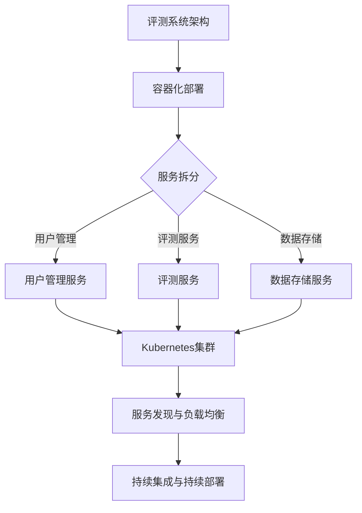

                 

# 评测系统的容器化部署与管理

## 关键词

- 容器化
- Kubernetes
- Docker
- 微服务架构
- 服务质量评价
- 负载均衡
- 资源调度
- 性能优化

## 摘要

随着云计算和容器技术的不断发展，容器化已成为现代软件架构的重要趋势。本文旨在深入探讨评测系统的容器化部署与管理，通过详细介绍容器化技术、核心算法原理、数学模型以及实际项目案例，帮助读者全面理解并掌握容器化部署的过程与最佳实践。文章结构清晰，内容丰富，适合从事IT领域开发、运维人员以及希望深入了解容器化技术的专业人士阅读。

## 前言

随着全球信息化进程的加快，软件系统变得越来越复杂，传统的部署方式已经无法满足快速迭代、高效扩展的需求。容器化技术以其轻量级、可移植性、高效隔离性等优势，成为了现代软件架构的重要组成部分。本文将围绕评测系统的容器化部署与管理，从基础概念到实际应用，进行全面的剖析和讲解，旨在为读者提供一份系统、全面的技术指南。

## 第1章 容器化技术基础

### 1.1 容器化简介

容器化（Containerization）是一种轻量级的虚拟化技术，它将应用程序及其运行环境打包成一个独立的运行单元，从而实现应用程序在不同操作系统和硬件环境中的无缝迁移和部署。与传统的虚拟化技术相比，容器化具有以下几个显著优势：

- **轻量级**：容器化技术不需要创建完整的操作系统镜像，仅包含应用程序和必要的依赖库，因此启动速度更快，资源占用更小。
- **可移植性**：容器化应用程序可以轻松地在不同的操作系统和硬件环境中运行，不受底层硬件和操作系统的限制。
- **高效隔离**：容器通过操作系统级别的虚拟化实现应用程序之间的隔离，保证了应用程序的运行安全性和稳定性。

容器化技术的主要组件包括：

- **Docker**：一种流行的容器化工具，用于创建、运行和分发容器。
- **Kubernetes**：一个开源的容器编排平台，用于自动化容器的部署、扩展和管理。
- **微服务架构**：一种基于容器化的应用架构模式，将应用程序拆分成多个独立的、可复用的服务模块，从而实现系统的高可用性和可扩展性。

### 1.2 容器核心概念与联系

在容器化技术中，有以下几个核心概念：

- **容器镜像**：容器镜像是一个只读的模板，包含了应用程序运行所需的所有组件，如代码、库、环境变量等。
- **容器**：容器是基于容器镜像创建的可执行单元，可以运行应用程序并在其中执行任务。
- **容器编排**：容器编排是指管理容器生命周期的过程，包括容器的创建、部署、扩展、监控和销毁。

为了更好地理解评测系统与容器化技术的关联，我们可以使用Mermaid流程图展示以下几个方面：

1. **评测系统的架构**：评测系统通常由多个服务组成，如用户管理服务、评测服务、数据存储服务等。
2. **容器化部署**：将评测系统的各个服务拆分成独立的容器，并在Kubernetes集群中进行部署和管理。
3. **服务发现和负载均衡**：通过Kubernetes的Service和Ingress资源实现容器间的服务发现和负载均衡。
4. **持续集成和持续部署**：使用CI/CD工具实现评测系统的自动化部署和测试。

下面是一个简单的Mermaid流程图示例：



## 第2章 容器编排与调度算法

### 2.1 容器编排算法

容器编排算法是容器化管理的重要一环，它负责管理和控制容器的生命周期。常见的容器编排算法包括：

1. **轮询调度**：按照顺序为每个容器分配资源，直到所有容器都得到分配。
2. **最短作业优先**：选择执行时间最短的容器进行资源分配。
3. **公平共享**：根据容器的优先级和资源需求进行公平的资源分配。

下面是一个简单的Python伪代码示例，用于实现轮询调度算法：

```python
def round_robin_scheduling(containers, resources):
    while True:
        for container in containers:
            if can_allocate(container, resources):
                allocate_resource(container, resources)
                break
        else:
            break

def can_allocate(container, resources):
    # 判断容器是否可以分配资源
    pass

def allocate_resource(container, resources):
    # 分配资源给容器
    pass
```

### 2.2 负载均衡算法

负载均衡算法用于优化资源利用率和系统性能，常见的负载均衡策略包括：

1. **轮询负载均衡**：将请求按顺序分配给各个容器。
2. **最小连接数负载均衡**：将请求分配给当前连接数最少的容器。
3. **最小响应时间负载均衡**：将请求分配给响应时间最短的容器。

下面是一个简单的Python伪代码示例，用于实现最小连接数负载均衡算法：

```python
def min_connections_load_balancing(containers, requests):
    connections = {container: 0 for container in containers}
    while requests:
        for container in containers:
            if connections[container] < min(connections.values()):
                process_request(requests.pop(0), container)
                connections[container] += 1
                break

def process_request(request, container):
    # 处理请求
    pass
```

### 2.3 资源调度策略

资源调度策略是容器编排的核心，它决定了如何合理分配系统资源，以满足不同容器的需求。常见的资源调度策略包括：

1. **静态资源分配**：在部署容器时预先分配资源。
2. **动态资源分配**：根据容器的实时需求动态调整资源分配。
3. **混合资源分配**：结合静态和动态资源分配策略，根据实际情况进行资源调度。

下面是一个简单的Python伪代码示例，用于实现动态资源分配策略：

```python
def dynamic_resource_allocation(containers, resources):
    while True:
        for container in containers:
            if needs_more_resources(container, resources):
                allocate_additional_resources(container, resources)
                break
        else:
            break

def needs_more_resources(container, resources):
    # 判断容器是否需要更多资源
    pass

def allocate_additional_resources(container, resources):
    # 分配额外资源给容器
    pass
```

## 第3章 数学模型与评测系统性能分析

### 3.1 服务质量评价模型

服务质量评价模型是评测系统性能分析的重要组成部分，它用于衡量系统的性能和用户体验。一个常见的服务质量评价模型是：

$$
Q = \alpha \cdot R + \beta \cdot T
$$

其中，\( Q \) 表示服务质量，\( R \) 表示响应时间，\( T \) 表示吞吐量。\( \alpha \) 和 \( \beta \) 是权重系数，可以根据实际情况进行调整。

### 3.2 容器性能分析模型

容器性能分析模型用于评估容器在资源限制条件下的性能表现。一个简单的容器性能分析模型是：

$$
P = \sum_{i=1}^{n} \frac{C_i \cdot R_i}{T_i}
$$

其中，\( P \) 表示性能得分，\( C_i \) 表示容器 \( i \) 的资源利用率，\( R_i \) 表示容器 \( i \) 的响应时间，\( T_i \) 表示容器 \( i \) 的吞吐量。该模型可以用于评估不同容器在相同资源限制条件下的性能表现。

## 第4章 实际项目：评测系统的容器化部署

### 4.1 项目背景

本节将介绍一个实际的评测系统容器化部署项目，该项目旨在将一个传统的基于虚拟机的评测系统迁移到容器化环境，以提高系统的可移植性、可扩展性和可靠性。

### 4.2 环境搭建

在开始容器化部署之前，我们需要搭建一个合适的环境。以下是环境搭建的步骤：

1. **安装Docker**：在所有节点上安装Docker，以确保容器可以在集群中运行。
2. **安装Kubernetes**：在控制节点上安装Kubernetes集群，并确保所有节点都能与集群进行通信。
3. **配置网络**：配置集群内部网络，确保容器可以在不同的节点之间进行通信。
4. **准备数据存储**：为评测系统准备一个可靠的数据存储方案，如本地存储或分布式存储系统。

### 4.3 源代码实现

在容器化部署中，我们需要将评测系统的各个服务拆分成独立的容器，并在Kubernetes集群中进行部署。以下是源代码实现的关键步骤：

1. **编写Dockerfile**：为每个服务编写Dockerfile，定义容器的构建过程和运行环境。
2. **编写Kubernetes配置文件**：为每个服务编写Kubernetes配置文件，定义容器的部署策略、资源限制和服务发现。
3. **编写部署脚本**：编写部署脚本，用于自动化部署评测系统的各个服务。

以下是一个简单的Dockerfile示例：

```Dockerfile
# 使用官方Python镜像作为基础镜像
FROM python:3.9

# 设置工作目录
WORKDIR /app

# 将应用程序代码复制到容器中
COPY . .

# 安装依赖库
RUN pip install -r requirements.txt

# 暴露服务端口
EXPOSE 8000

# 运行应用程序
CMD ["python", "app.py"]
```

以下是一个简单的Kubernetes配置文件示例：

```yaml
apiVersion: v1
kind: Service
metadata:
  name: evaluation-service
spec:
  selector:
    app: evaluation
  ports:
    - name: http
      port: 80
      targetPort: 8000
  type: LoadBalancer

---

apiVersion: apps/v1
kind: Deployment
metadata:
  name: evaluation-deployment
spec:
  selector:
    matchLabels:
      app: evaluation
  template:
    metadata:
      labels:
        app: evaluation
    spec:
      containers:
      - name: evaluation-container
        image: evaluation:latest
        ports:
        - containerPort: 8000
        resources:
          requests:
            memory: "64Mi"
            cpu: "250m"
          limits:
            memory: "128Mi"
            cpu: "500m"
```

### 4.4 部署与监控

在完成源代码实现后，我们需要将评测系统部署到Kubernetes集群，并对其进行监控和日志分析。以下是部署与监控的关键步骤：

1. **部署评测系统**：使用Kubernetes命令行工具（kubectl）部署评测系统的各个服务。
2. **配置监控**：使用Prometheus和Grafana等监控工具，对评测系统的性能指标进行实时监控。
3. **日志分析**：使用ELK堆栈（Elasticsearch、Logstash、Kibana）对评测系统的日志进行收集和分析。

以下是一个简单的Kubernetes部署命令示例：

```bash
kubectl create -f evaluation-service.yml
kubectl create -f evaluation-deployment.yml
```

## 第5章 性能优化与调优

### 5.1 性能瓶颈分析

性能瓶颈分析是优化评测系统性能的重要步骤，它可以帮助我们识别系统中的性能问题，并针对性地进行调优。以下是常见的性能瓶颈：

1. **CPU瓶颈**：当系统的CPU利用率达到100%时，可能会导致响应时间延长。
2. **内存瓶颈**：当系统的内存使用率达到100%时，可能会导致应用程序崩溃或响应时间延长。
3. **网络瓶颈**：当系统的网络带宽达到上限时，可能会导致数据传输速度变慢。

### 5.2 性能调优策略

性能调优策略包括以下几个方面：

1. **优化代码**：通过优化算法和数据结构，减少系统的计算时间和资源消耗。
2. **调整资源配置**：根据实际需求，调整容器的CPU、内存等资源限制，以提高系统性能。
3. **分布式架构**：将评测系统拆分成多个服务，并使用分布式架构进行部署，以提高系统的可扩展性和性能。

### 5.3 调优工具介绍

以下是常用的性能调优工具：

1. **cAdvisor**：用于监控容器性能指标，如CPU、内存、网络等。
2. **Prometheus**：用于收集和存储容器性能数据，并提供可视化界面。
3. **Grafana**：用于可视化容器性能数据，帮助分析性能瓶颈。

## 第6章 故障处理与容灾恢复

### 6.1 故障处理流程

故障处理流程包括以下几个步骤：

1. **故障识别**：通过监控工具实时监控评测系统的性能指标，及时发现异常情况。
2. **故障定位**：根据监控数据和日志信息，定位故障发生的具体位置和原因。
3. **故障恢复**：根据故障类型和原因，采取相应的恢复措施，如重启容器、更换硬件等。

### 6.2 容灾恢复方案

容灾恢复方案包括以下几个方面：

1. **数据备份**：定期对评测系统的数据进行备份，确保在故障发生时可以快速恢复数据。
2. **异地备份**：将数据备份到异地数据中心，以防止自然灾害等不可抗力因素导致的数据丢失。
3. **故障转移**：当主系统发生故障时，自动将流量切换到备用系统，确保业务的连续性。

## 第7章 容器化部署与管理最佳实践

### 7.1 安全性保障

安全性保障是容器化部署的重要方面，以下是一些最佳实践：

1. **容器镜像安全**：确保容器镜像来自可信的源，并定期进行安全扫描。
2. **容器网络安全性**：使用网络策略限制容器之间的通信，确保容器网络的隔离性。
3. **访问控制**：使用身份验证和授权机制，确保只有授权用户可以访问容器和集群资源。

### 7.2 可观测性与可维护性

可观测性与可维护性是确保容器化系统稳定运行的关键因素，以下是一些最佳实践：

1. **监控与日志**：使用Prometheus和Grafana等监控工具，对系统性能指标和日志进行实时监控和分析。
2. **服务发现与负载均衡**：使用Kubernetes的Service和Ingress资源，实现服务发现和负载均衡，确保系统的高可用性。
3. **灾难恢复与备份**：定期进行数据备份，并制定容灾恢复计划，确保在故障发生时可以快速恢复系统。

### 7.3 持续集成与持续部署

持续集成与持续部署（CI/CD）是提高软件交付效率和质量的重要手段，以下是一些最佳实践：

1. **自动化测试**：在CI/CD流程中集成自动化测试，确保每次代码提交都能通过测试。
2. **自动化部署**：使用自动化工具，如Jenkins或GitLab CI/CD，实现自动化部署，减少人为干预。
3. **版本控制**：使用Git等版本控制系统，确保代码的版本管理和回滚能力。

## 附录

### 附录 A: 工具与资源

#### A.1 Docker

Docker是一个开源的应用容器引擎，用于打包、交付和运行应用程序。官方网站：<https://www.docker.com/>

#### A.2 Kubernetes

Kubernetes是一个开源的容器编排平台，用于自动化容器化应用程序的部署、扩展和管理。官方网站：<https://kubernetes.io/>

#### A.3 Prometheus

Prometheus是一个开源的监控解决方案，用于收集、存储和可视化系统性能数据。官方网站：<https://prometheus.io/>

#### A.4 Grafana

Grafana是一个开源的数据可视化工具，用于监控和仪表板创建。官方网站：<https://grafana.com/>

### 作者

作者：AI天才研究院/AI Genius Institute & 禅与计算机程序设计艺术 /Zen And The Art of Computer Programming

