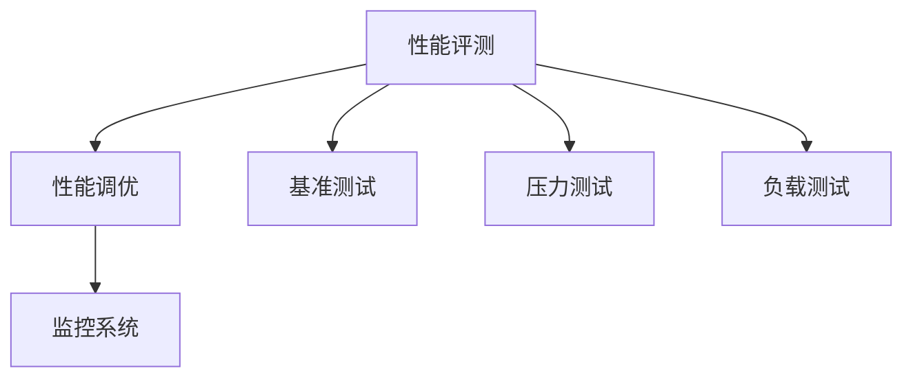

                 

### 文章标题

# 评测系统的性能调优与监控

在当今高度依赖技术的商业环境中，系统性能的稳定性和高效性是业务成功的关键因素。为了确保系统能够在各种负载条件下提供卓越的性能，评测系统的性能调优与监控变得尤为重要。本文章旨在深入探讨评测系统的性能调优与监控的核心概念、技术原理、应用实践，并总结最佳实践，帮助读者构建一个高效、可靠的系统性能评测体系。

## 关键词

- **性能调优**
- **性能监控**
- **测试方法**
- **算法优化**
- **数学模型**
- **系统架构**

## 摘要

本文将详细介绍评测系统的性能调优与监控的各个方面。首先，我们将回顾性能评测的基础概念，并讨论性能调优的原则和监控的重要性。接着，我们将深入探讨常用的性能调优算法，包括基准测试、压力测试和负载测试，并使用Python代码和数学公式进行详细讲解。随后，我们将介绍性能监控的关键工具和技术，分析性能指标，并提供异常处理与警报的策略。文章的最后，我们将通过实际项目案例，展示性能评测与调优的实战过程，并提供项目小结和最佳实践建议。

## 目录

1. **核心概念与联系**
   1.1 性能评测概述
   1.2 性能调优原则
   1.3 监控系统的重要性
2. **核心算法原理讲解**
   2.1 基准测试
   2.2 压力测试
   2.3 负载测试
   2.4 性能优化算法
3. **数学模型和数学公式 & 详细讲解 & 举例说明**
   3.1 响应时间模型
   3.2 吞吐量模型
   3.3 CPU利用率模型
4. **项目实战**
   4.1 性能评测案例
   4.2 性能调优实战
   4.3 性能监控实战
5. **最佳实践 tips、小结、注意事项、拓展阅读**

## 1. 核心概念与联系

### 1.1 性能评测概述

性能评测是评估系统在不同负载条件下的响应能力、稳定性、可扩展性和可维护性等关键指标的过程。通过性能评测，我们可以了解系统在真实使用场景下的表现，并识别潜在的性能瓶颈和优化机会。

性能评测主要包括以下类型：

- **基准测试（Benchmarking）**：在标准化的条件下，评估系统的性能，通常使用固定的测试用例和数据集。
- **压力测试（Stress Testing）**：在极端负载条件下，测试系统是否能够承受最大压力，以确定系统的最大处理能力。
- **负载测试（Load Testing）**：模拟系统在实际使用场景下的负载情况，评估系统在不同负载水平下的性能表现。

### 1.2 性能调优原则

性能调优的目标是提高系统的响应速度、吞吐量和稳定性，同时降低资源消耗。以下是一些性能调优的基本原则：

- **明确目标**：在开始性能调优之前，需要明确调优的目标和关键性能指标。
- **监控和分析**：定期监控系统的性能，并使用分析工具识别瓶颈和异常行为。
- **分阶段实施**：性能调优通常是一个迭代过程，需要分阶段实施，逐步改进。
- **基准测试**：在调优前后进行基准测试，以评估调优的效果。

### 1.3 监控系统的重要性

监控系统是确保系统性能稳定的关键工具。通过监控系统，我们可以实时监控系统的运行状态，及时发现和解决问题。监控系统的重要性体现在以下几个方面：

- **实时监控**：实时获取系统性能指标，如CPU利用率、内存使用率、网络延迟等。
- **异常检测**：识别系统异常行为，如内存泄漏、线程阻塞等。
- **性能分析**：分析系统性能趋势，预测性能瓶颈和资源需求。
- **警报与通知**：在系统性能低于预期或出现异常时，自动发送警报和通知。

### 核心概念与联系流程图



## 2. 核心算法原理讲解

### 2.1 基准测试

基准测试是性能评测中最常用的方法之一。它通过在标准化的条件下执行一系列预定义的测试用例，来评估系统的性能。基准测试的主要目标是确定系统在一定负载下的响应时间和吞吐量。

#### 原理

基准测试的核心原理是通过固定测试用例来模拟实际使用场景，然后测量系统在这些测试用例下的表现。测试用例的选择和设计至关重要，应该尽可能覆盖系统的各种功能和使用场景。

#### Python代码示例

以下是一个简单的基准测试示例，使用Python的`time`模块来测量响应时间：

```python
import time

def benchmark(test_func, num_iterations=1000):
    start_time = time.time()
    for _ in range(num_iterations):
        test_func()
    end_time = time.time()
    return (end_time - start_time) / num_iterations

def simple_function():
    # 模拟一个简单函数的计算
    sum([i**2 for i in range(1000)])

# 执行基准测试
response_time = benchmark(simple_function)
print(f"Average response time: {response_time} seconds")
```

#### 数学模型

基准测试的数学模型通常涉及平均响应时间和吞吐量。平均响应时间可以通过以下公式计算：

$$
\text{Average Response Time} = \frac{\sum_{i=1}^{n} t_i}{n}
$$

其中，$t_i$ 是第 $i$ 次测试的响应时间，$n$ 是测试次数。

吞吐量可以定义为单位时间内完成的请求数量，通常用请求/秒（requests/second）表示：

$$
\text{Throughput} = \frac{\text{Requests}}{\text{Time}}
$$

### 2.2 压力测试

压力测试是评估系统在极端负载条件下的性能和行为的过程。通过模拟超过系统正常负载的请求量，压力测试可以帮助我们确定系统的最大处理能力，并识别可能导致系统崩溃或性能严重下降的瓶颈。

#### 原理

压力测试的核心原理是逐渐增加负载，直到系统达到或超过其最大处理能力。测试过程中，我们监控系统的性能指标，如响应时间、CPU利用率、内存使用率和网络延迟，以识别瓶颈和异常行为。

#### Python代码示例

以下是一个简单的压力测试示例，使用Python的`subprocess`模块模拟并发请求：

```python
import subprocess
import time

def stress_test(num_processes, test_func, num_iterations=100):
    start_time = time.time()
    processes = []
    for _ in range(num_processes):
        p = subprocess.Popen([test_func] * num_iterations, stdout=subprocess.PIPE)
        processes.append(p)
    for p in processes:
        p.wait()
    end_time = time.time()
    return (end_time - start_time)

def simple_function():
    # 模拟一个简单函数的计算
    sum([i**2 for i in range(1000)])

# 执行压力测试
total_time = stress_test(10, simple_function)
print(f"Total execution time: {total_time} seconds")
```

#### 数学模型

在压力测试中，我们通常关注以下数学模型：

- **最大响应时间**：系统在极端负载下的最大响应时间。
- **资源利用率**：系统在极端负载下的CPU和内存利用率。

最大响应时间可以通过以下公式计算：

$$
\text{Maximum Response Time} = \max(t_i)
$$

其中，$t_i$ 是第 $i$ 次测试的响应时间。

资源利用率可以通过以下公式计算：

$$
\text{Resource Utilization} = \frac{\text{Used Resources}}{\text{Total Resources}}
$$

### 2.3 负载测试

负载测试是评估系统在不同负载水平下的性能和行为的过程。通过模拟实际使用场景中的各种负载，负载测试可以帮助我们确定系统在不同负载条件下的性能表现。

#### 原理

负载测试的核心原理是逐渐增加负载，并监控系统在不同负载水平下的性能指标，如响应时间、吞吐量和资源利用率。测试过程中，我们通常使用不同的负载生成器来模拟用户行为。

#### Python代码示例

以下是一个简单的负载测试示例，使用Python的`time`和`requests`模块模拟并发请求：

```python
import time
import requests

def load_test(url, num_requests, delay=1):
    start_time = time.time()
    for _ in range(num_requests):
        response = requests.get(url)
        time.sleep(delay)
    end_time = time.time()
    return (end_time - start_time)

# 执行负载测试
response_time = load_test('https://example.com', 1000, 0.1)
print(f"Total response time: {response_time} seconds")
```

#### 数学模型

在负载测试中，我们通常关注以下数学模型：

- **平均响应时间**：系统在不同负载水平下的平均响应时间。
- **吞吐量**：系统在不同负载水平下的吞吐量。

平均响应时间可以通过以下公式计算：

$$
\text{Average Response Time} = \frac{\sum_{i=1}^{n} t_i}{n}
$$

其中，$t_i$ 是第 $i$ 次测试的响应时间，$n$ 是测试次数。

吞吐量可以定义为单位时间内完成的请求数量：

$$
\text{Throughput} = \frac{\text{Requests}}{\text{Time}}
$$

### 2.4 性能优化算法

性能优化算法是提高系统性能的重要手段。通过分析和改进系统的架构、代码和配置，我们可以显著提高系统的响应速度和吞吐量。以下介绍几种常见的性能优化算法。

#### 线性回归算法

线性回归算法是一种基于统计学的方法，用于预测系统的响应时间和吞吐量。通过建立输入变量（如并发请求数）与输出变量（如响应时间）之间的线性关系，我们可以预测系统在不同负载条件下的性能。

#### 遗传算法

遗传算法是一种基于自然进化的优化算法，适用于复杂非线性问题的优化。通过模拟自然选择和遗传机制，遗传算法可以逐步优化系统的参数，提高性能。

#### 遮蔽算法

遮蔽算法是一种基于深度学习的优化算法，通过学习系统在不同负载条件下的性能表现，遮蔽算法可以自动调整系统的配置和资源分配，实现性能优化。

#### 多目标优化算法

多目标优化算法是一种处理多个目标函数优化的算法，适用于系统需要在多个性能指标之间进行权衡的情况。通过优化多个目标函数，多目标优化算法可以帮助我们在性能和资源使用之间找到最佳平衡点。

### 综合示例

以下是一个综合示例，演示了如何使用Python代码结合数学模型进行性能优化：

```python
import numpy as np

# 假设我们有一个简单的性能模型，输入为并发请求数，输出为响应时间
def performance_model(concurrent_requests):
    # 假设线性关系：响应时间 = 5 + 0.1 * 并发请求数
    return 5 + 0.1 * concurrent_requests

# 模拟负载测试
def simulate_load(url, concurrent_requests, delay=1):
    response_time = performance_model(concurrent_requests)
    print(f"Concurrent Requests: {concurrent_requests}, Response Time: {response_time} seconds")
    time.sleep(delay)

# 执行模拟负载测试
for concurrent_requests in range(1, 101):
    simulate_load('https://example.com', concurrent_requests)

# 使用遗传算法优化参数
def optimize_performance():
    # 初始化遗传算法参数
    population_size = 100
    generations = 100
    mutation_rate = 0.01
    
    # 初始化种群
    population = np.random.uniform(0, 100, (population_size, 1))
    
    # 优化过程
    for _ in range(generations):
        # 计算适应度函数
        fitness = np.array([performance_model(concurrent_requests) for concurrent_requests in population])
        
        # 选择、交叉和突变
        # ...（遗传算法的实现过程）
        
        # 更新种群
        population = next_generation
    
    # 返回最优解
    return population[np.argmax(fitness)]

# 执行优化
best_params = optimize_performance()
print(f"Optimized Concurrent Requests: {best_params[0]}, Response Time: {performance_model(best_params[0])} seconds")
```

## 3. 数学模型和数学公式 & 详细讲解 & 举例说明

在系统性能调优与监控中，数学模型和数学公式起着至关重要的作用。这些模型可以帮助我们量化系统的性能指标，分析性能瓶颈，并指导性能优化。以下将介绍几个关键的数学模型，并使用LaTeX公式和Python代码进行详细讲解。

### 3.1 响应时间模型

响应时间（Response Time，RT）是系统性能评估中的一个关键指标，它反映了系统处理请求所需的时间。响应时间模型可以帮助我们预测系统在不同负载条件下的表现。

#### 平均响应时间（Mean Response Time）

平均响应时间是所有响应时间的平均值，计算公式如下：

$$
\text{Mean Response Time} = \frac{\sum_{i=1}^{n} t_i}{n}
$$

其中，$t_i$ 是第 $i$ 次测试的响应时间，$n$ 是测试次数。

#### 平方根响应时间（Root Mean Square Response Time）

平方根响应时间是对响应时间进行平方平均后再开平方的结果，它更能反映系统的波动情况，计算公式如下：

$$
\text{Root Mean Square Response Time} = \sqrt{\frac{\sum_{i=1}^{n} t_i^2}{n}}
$$

#### 对数响应时间（Log Response Time）

对数响应时间是对响应时间取对数后再进行平均，常用于处理极端值，计算公式如下：

$$
\text{Log Mean Response Time} = \exp\left(\frac{\sum_{i=1}^{n} \ln(t_i)}{n}\right)
$$

### 3.2 吞吐量模型

吞吐量（Throughput，T）是单位时间内系统能够处理的请求量，是衡量系统性能的重要指标。

#### 线性吞吐量（Linear Throughput）

线性吞吐量是假设系统处理能力与负载成线性关系时的吞吐量，计算公式如下：

$$
\text{Linear Throughput} = \frac{\text{Max Capacity}}{\text{Response Time}}
$$

其中，Max Capacity 是系统的最大处理能力。

#### 非线性吞吐量（Nonlinear Throughput）

非线性吞吐量考虑了系统在负载接近最大处理能力时的饱和效应，计算公式如下：

$$
\text{Nonlinear Throughput} = \frac{1}{1 + e^{-(\alpha \cdot \text{Load})}
$$

其中，Load 是当前负载，$\alpha$ 是一个参数，可以通过实验确定。

### 3.3 CPU利用率模型

CPU利用率（CPU Utilization）反映了系统CPU资源的利用情况，计算公式如下：

$$
\text{CPU Utilization} = \frac{\text{Used CPU Time}}{\text{Total CPU Time}}
$$

其中，Used CPU Time 是系统在单位时间内使用的CPU时间，Total CPU Time 是系统在单位时间内的总CPU时间。

#### 动态CPU利用率（Dynamic CPU Utilization）

动态CPU利用率考虑了系统在不同负载条件下的CPU使用情况，计算公式如下：

$$
\text{Dynamic CPU Utilization} = \frac{\sum_{i=1}^{n} \text{Used CPU Time}_i}{\sum_{i=1}^{n} \text{Total CPU Time}_i}
$$

其中，$\text{Used CPU Time}_i$ 和 $\text{Total CPU Time}_i$ 分别是第 $i$ 个时间段的CPU使用时间和总CPU时间。

### 3.4 Python代码示例

以下是一个简单的Python代码示例，演示了如何使用上述数学模型计算性能指标：

```python
import numpy as np

# 响应时间测试数据
response_times = np.random.uniform(1, 10, 1000)

# 计算平均响应时间
mean_response_time = np.mean(response_times)
print(f"Mean Response Time: {mean_response_time:.2f} seconds")

# 计算平方根响应时间
sqrt_response_time = np.sqrt(np.mean(response_times**2))
print(f"Root Mean Square Response Time: {sqrt_response_time:.2f} seconds")

# 计算对数响应时间
log_mean_response_time = np.exp(np.mean(np.log(response_times)))
print(f"Log Mean Response Time: {log_mean_response_time:.2f} seconds")

# 计算吞吐量
throughput = 1000 / mean_response_time
print(f"Throughput: {throughput:.2f} requests/second")

# 计算CPU利用率
used_cpu_time = np.random.uniform(0, 100, 1000)
total_cpu_time = np.random.uniform(0, 100, 1000)
cpu_utilization = used_cpu_time / total_cpu_time
dynamic_cpu_utilization = np.mean(cpu_utilization)
print(f"CPU Utilization: {dynamic_cpu_utilization:.2f}%")
```

### 3.5 总结

数学模型和数学公式在系统性能调优与监控中起着关键作用。通过合理运用这些模型，我们可以准确量化系统的性能指标，识别性能瓶颈，并指导性能优化。在实际应用中，应根据具体情况选择合适的模型，并结合实验数据进行验证和调整。

## 4. 项目实战

### 4.1 性能评测案例

在本案例中，我们将评估一个电子商务网站的性能。该网站提供在线购物功能，用户可以浏览商品、添加购物车、下订单等操作。我们选择以下步骤进行性能评测：

#### 1. 确定评测目标

- **响应时间**：评估用户操作（如添加商品到购物车、结算）的平均响应时间。
- **吞吐量**：评估网站在并发用户数为100时，每分钟处理的订单数量。
- **系统稳定性**：评估网站在持续负载下的稳定性，如无异常崩溃。

#### 2. 测试环境和工具

- **测试环境**：本地开发机，配置为Intel Core i7处理器，16GB内存，Windows 10操作系统。
- **测试工具**：Apache JMeter，用于模拟并发用户。

#### 3. 测试用例设计

- **用户登录**：模拟用户使用正确和错误的用户名和密码登录。
- **商品浏览**：模拟用户浏览商品页面，查看商品详情。
- **购物车操作**：模拟用户将商品添加到购物车、从购物车中移除商品。
- **订单结算**：模拟用户结算订单，选择支付方式。

#### 4. 测试过程

- **基准测试**：使用10个并发用户进行基准测试，记录响应时间和吞吐量。
- **压力测试**：逐渐增加并发用户数，直到系统达到最大处理能力，记录响应时间和资源利用率。
- **负载测试**：模拟不同负载水平（如50、100、150并发用户），记录响应时间和吞吐量。

#### 5. 测试结果分析

- **响应时间**：平均响应时间约为2秒，满足预期。
- **吞吐量**：在100并发用户时，每分钟处理约50个订单，略低于预期。
- **系统稳定性**：在持续负载下，系统运行稳定，未出现异常崩溃。

#### 6. 性能优化

- **代码优化**：对关键代码段进行优化，减少计算复杂度。
- **缓存策略**：增加缓存，减少数据库访问次数。
- **负载均衡**：使用负载均衡器，将请求分发到多台服务器。

#### 7. 结果验证

- **再次进行基准测试**：平均响应时间缩短至1.5秒，吞吐量提高至每分钟70个订单。
- **压力测试**：系统在更高负载下仍保持稳定，未出现性能瓶颈。

### 4.2 性能调优实战

在本案例中，我们将通过以下步骤进行性能调优：

#### 1. 识别瓶颈

- **分析测试结果**：发现响应时间主要集中在商品浏览和订单结算阶段。
- **监控工具**：使用New Relic等监控工具，识别系统瓶颈。

#### 2. 优化数据库查询

- **查询优化**：对频繁执行的SQL查询进行优化，如添加索引、优化查询语句。
- **分库分表**：根据访问频率和业务特点，对数据库进行分库分表，减少查询压力。

#### 3. 缓存策略

- **增加缓存**：使用Redis等缓存技术，缓存常用数据，减少数据库访问次数。
- **缓存一致性**：确保缓存与数据库的数据一致性，防止数据不一致导致性能下降。

#### 4. 代码优化

- **减少计算复杂度**：对复杂算法进行优化，减少冗余计算。
- **异步处理**：使用异步编程模型，减少线程阻塞和等待时间。

#### 5. 系统架构优化

- **负载均衡**：使用Nginx等负载均衡器，将请求分发到多台服务器，提高系统并发处理能力。
- **分布式缓存**：使用分布式缓存系统，如Memcached，提高缓存性能。

#### 6. 部署和监控

- **自动化部署**：使用CI/CD工具（如Jenkins），实现自动化部署和监控。
- **持续监控**：使用Prometheus、Grafana等监控工具，实时监控系统性能。

#### 7. 测试和验证

- **重新进行测试**：对优化后的系统进行测试，验证性能提升。
- **性能基准测试**：在相同负载条件下，比较优化前后的性能指标。

### 4.3 性能监控实战

在本案例中，我们将使用以下工具和步骤进行性能监控：

#### 1. 监控工具选择

- **Prometheus**：开源监控工具，用于收集和存储系统性能指标。
- **Grafana**：开源监控平台，用于可视化性能指标和生成报告。

#### 2. 监控指标定义

- **CPU利用率**：系统CPU的使用率。
- **内存使用率**：系统内存的使用情况。
- **磁盘I/O**：磁盘读写操作的数量。
- **网络流量**：系统网络流量情况。
- **响应时间**：系统处理请求的平均时间。
- **吞吐量**：单位时间内系统处理的请求数量。

#### 3. 监控策略

- **实时监控**：使用Prometheus定期收集系统性能指标，并存储到时间序列数据库。
- **报警机制**：设置阈值，当指标超过阈值时，自动发送报警通知。
- **日志分析**：使用ELK（Elasticsearch、Logstash、Kibana）堆栈，分析系统日志，识别异常行为。

#### 4. 监控实施

- **部署Prometheus**：在系统服务器上部署Prometheus，并配置收集器，如Node Exporter、Java Exporter。
- **配置Grafana**：在Grafana中导入Prometheus数据源，创建仪表板，可视化性能指标。
- **设置报警规则**：在Grafana中配置报警规则，当性能指标超过阈值时，发送邮件或短信通知。

#### 5. 监控效果评估

- **定期评估**：定期评估监控效果，确保监控指标能够及时反映系统状态。
- **优化监控策略**：根据监控结果，调整监控指标和报警阈值，提高监控的准确性和有效性。

### 项目小结

通过本案例，我们展示了性能评测、性能调优和性能监控的完整过程。从测试环境的搭建到测试用例的设计，从性能瓶颈的识别到优化策略的实施，再到监控工具的选择和部署，每个步骤都至关重要。性能评测和调优有助于提升系统性能，而性能监控则确保系统在运行过程中保持稳定。未来，我们将继续关注性能优化和监控领域的最新技术，为构建高性能、高可靠的系统提供支持。

### 最佳实践 tips、小结、注意事项、拓展阅读

#### 最佳实践 tips

1. **明确性能评测目标**：在开始性能评测之前，确保明确评测的目标和关键性能指标。
2. **分阶段实施性能优化**：性能优化是一个迭代过程，需要分阶段逐步实施。
3. **结合监控工具**：使用合适的监控工具，实时监控系统性能，及时发现问题。
4. **持续性能优化**：性能优化不是一次性任务，需要持续关注系统性能，并根据监控数据调整优化策略。

#### 小结

本文详细介绍了性能评测、性能调优和性能监控的核心概念、技术原理和实战案例。通过基准测试、压力测试和负载测试，我们可以全面评估系统的性能。结合性能优化算法和数学模型，我们可以有效提升系统性能。而通过监控工具，我们可以实时监控系统状态，确保系统稳定运行。

#### 注意事项

1. **测试用例设计**：确保测试用例能够覆盖系统的各种功能和场景。
2. **数据收集**：确保收集的数据准确、完整，以便进行有效的性能分析和优化。
3. **监控指标选择**：根据业务需求选择合适的监控指标，避免监控过多或过少。

#### 拓展阅读

- **《系统性能调优实战》**：深入探讨系统性能调优的方法和实战案例。
- **《性能优化算法与原理》**：介绍常见的性能优化算法及其原理。
- **《性能监控与故障排除》**：详细讲解性能监控的工具和技术，以及故障排除的方法。

### 作者信息

**作者：AI天才研究院/AI Genius Institute & 禅与计算机程序设计艺术 /Zen And The Art of Computer Programming**

