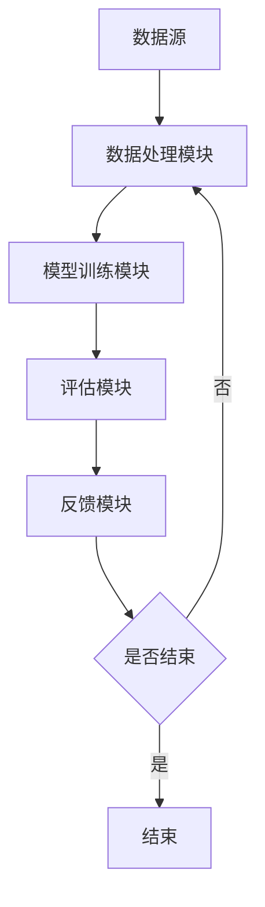

                 

### 评测系统的持续学习与catastrophic forgetting防御

#### 关键词
- 评测系统
- 持续学习
- Catastrophic Forgetting
- 防御方法

#### 摘要
本文主要探讨评测系统中的持续学习问题及其带来的灾难性遗忘（Catastrophic Forgetting）挑战。文章首先介绍评测系统的基本概念和重要性，然后深入分析持续学习的定义和目标，接着详细阐述Catastrophic Forgetting的产生原因及其影响。在此基础上，文章介绍了多种防止Catastrophic Forgetting的方法，包括架构优化、算法改进和技术策略。最后，通过实际案例展示了如何在实际应用中实施这些方法，并提供了一些最佳实践和注意事项。

---

## 引言

### 评测系统的基本概念与背景

评测系统是一种用于评估、监控和改进人工智能模型性能的工具。它通常包含数据收集、预处理、模型训练、评估和反馈等环节。评测系统在人工智能领域具有至关重要的地位，因为它们不仅帮助研究人员和开发者评估模型的效果，还为模型的迭代优化提供了关键依据。

#### 1.1 评测系统的定义

评测系统（Evaluation System）是一种自动化或半自动化工具，用于对机器学习模型进行评估。它的主要功能包括：

1. **数据收集**：从不同的数据源收集数据，包括训练数据、测试数据和验证数据。
2. **数据预处理**：对收集到的数据进行清洗、归一化和特征提取等处理，以便用于模型训练。
3. **模型训练**：使用训练数据进行模型训练，包括参数调整和优化。
4. **模型评估**：使用测试数据对训练好的模型进行评估，以确定其性能。
5. **反馈**：根据评估结果提供反馈，以指导模型优化。

#### 1.2 评测系统的发展历程

评测系统的发展与机器学习的发展紧密相关。随着机器学习技术的进步，评测系统的功能也不断扩展和优化。早期评测系统主要关注模型的准确性，而随着复杂模型和任务的兴起，评测系统逐渐引入了更多指标，如精度、召回率、F1分数等。

#### 1.3 评测系统在人工智能领域的重要性

评测系统在人工智能领域的应用场景广泛，包括但不限于以下方面：

1. **模型性能评估**：通过评测系统，可以快速、准确地评估模型的性能，为模型选择和优化提供依据。
2. **模型监控**：评测系统可以帮助监控模型的运行状态，及时发现和解决潜在问题。
3. **模型迭代优化**：通过评测系统的反馈，可以指导模型优化，提高模型的性能和可靠性。
4. **科学研究**：评测系统为人工智能研究提供了重要的数据支持，有助于发现新的研究问题和方向。

### 持续学习的概念与优势

持续学习（Continuous Learning）是机器学习中的一个重要概念，它指的是模型在已训练好的基础上，不断吸收新的数据和知识，以适应不断变化的环境和需求。持续学习在人工智能领域具有重要意义，因为它可以提高模型的适应性、灵活性和鲁棒性。

#### 2.1 持续学习的定义

持续学习是指机器学习模型在运行过程中，能够不断地从新数据中学习和适应，以提高其性能和效果。它通常包括以下步骤：

1. **数据收集**：收集新的训练数据，这些数据可以来源于多种渠道，如用户反馈、实时数据流等。
2. **数据预处理**：对新数据进行预处理，包括数据清洗、归一化和特征提取等。
3. **模型更新**：使用新的数据对模型进行重新训练或微调，以适应新的环境和需求。
4. **模型评估**：使用测试数据对更新后的模型进行评估，以验证其性能和效果。
5. **反馈与优化**：根据评估结果对模型进行进一步优化，以提高其性能和鲁棒性。

#### 2.2 持续学习的优势

持续学习具有以下优势：

1. **适应性强**：通过不断学习新的数据和知识，持续学习模型可以更好地适应变化的环境和需求。
2. **灵活性好**：持续学习允许模型在运行过程中进行在线调整和优化，从而提高其灵活性和适应性。
3. **鲁棒性高**：通过持续学习，模型可以更好地应对噪声和异常值，提高其鲁棒性。
4. **效率高**：持续学习可以通过在线学习和实时调整，提高模型的训练和部署效率。

### Catastrophic Forgetting（灾难性遗忘）问题

Catastrophic Forgetting 是持续学习中的一个关键问题，它指的是模型在吸收新知识时，会忘记先前已学到的知识。Catastrophic Forgetting 会导致模型的性能下降，甚至使其完全失效，因此在持续学习中需要特别注意。

#### 3.1 Catastrophic Forgetting 的定义

Catastrophic Forgetting 是指机器学习模型在持续学习过程中，由于新知识的引入，导致原有知识的遗忘。这种现象通常表现为模型在新数据上的性能显著下降。

#### 3.2 Catastrophic Forgetting 的原因

Catastrophic Forgetting 主要由以下原因引起：

1. **模型容量不足**：模型容量不足以同时存储和利用新旧知识，导致新知识的学习过程会覆盖或遗忘旧知识。
2. **学习策略不当**：使用不合适的学习策略，如简单的增量学习或随机初始化，可能导致新旧知识之间的冲突和干扰。
3. **数据分布变化**：在持续学习过程中，新数据可能与旧数据分布存在显著差异，导致模型难以适应新的数据分布。

#### 3.3 Catastrophic Forgetting 的影响

Catastrophic Forgetting 对模型的影响包括：

1. **性能下降**：模型在新数据上的性能会显著下降，导致其在实际应用中的效果变差。
2. **适应性差**：模型难以适应新的环境和需求，影响其长期应用价值。
3. **可靠性降低**：由于模型可能忘记已学到的知识，其预测结果的可靠性和准确性会降低。

### 防止 Catastrophic Forgetting 的方法

为了防止 Catastrophic Forgetting，研究者提出了多种方法，包括架构优化、算法改进和技术策略。以下是几种常见的方法：

#### 3.1 架构优化

1. **模块化架构**：将模型分为多个模块，每个模块负责不同的知识领域。这样可以有效地隔离新旧知识，减少遗忘现象。
2. **多任务学习**：通过多任务学习，模型可以在不同的任务中同时学习和适应，从而提高其知识保留能力。

#### 3.2 算法改进

1. **经验重放（Experience Replay）**：通过经验重放，模型可以反复使用先前的数据，从而巩固旧知识。
2. **弹性权重（Elastic Weights）**：通过调整权重，模型可以在新知识和旧知识之间建立更好的平衡，减少遗忘现象。

#### 3.3 技术策略

1. **知识蒸馏（Knowledge Distillation）**：通过将复杂模型的知识传递给简单模型，可以实现知识的转移和共享，从而减少遗忘现象。
2. **元学习（Meta-Learning）**：通过元学习，模型可以学习如何快速适应新的数据和任务，从而提高其适应性。

---

## 技术基础

### 评测系统的架构与核心算法

#### 4.1 评测系统的架构概述

评测系统通常由以下几个关键组件构成：

1. **数据源**：提供用于训练、测试和验证的数据。
2. **数据处理模块**：负责对数据进行预处理、清洗和特征提取等操作。
3. **模型训练模块**：使用训练数据对模型进行训练和优化。
4. **评估模块**：使用测试数据对训练好的模型进行性能评估。
5. **反馈模块**：根据评估结果提供反馈，以指导模型优化。

#### 4.2 核心算法原理讲解

评测系统的核心算法通常包括以下几种：

1. **监督学习算法**：如支持向量机（SVM）、决策树、随机森林和神经网络等。
2. **无监督学习算法**：如聚类算法、降维算法和生成对抗网络（GAN）等。
3. **强化学习算法**：如Q学习、深度Q网络（DQN）和策略梯度等。

#### 4.3 Mermaid流程图展示

以下是一个简单的Mermaid流程图，展示了评测系统的基本架构和流程：



### 数学模型与公式解析

#### 4.1 模型的数学基础

评测系统的数学基础通常包括线性代数、概率论和信息论等。以下是一些常用的数学公式和概念：

1. **损失函数**：用于衡量模型预测值与真实值之间的差距，常用的损失函数包括均方误差（MSE）、交叉熵损失等。
   $$L(y, \hat{y}) = \frac{1}{2}||y - \hat{y}||^2$$
   $$L(y, \hat{y}) = -\sum_{i=1}^{n}y_i\log(\hat{y}_i)$$

2. **梯度下降**：用于优化模型的参数，梯度下降的更新公式如下：
   $$\theta_{t+1} = \theta_{t} - \alpha \nabla_{\theta}J(\theta)$$

3. **正则化**：用于防止模型过拟合，常用的正则化方法包括L1正则化、L2正则化和Dropout等。

#### 4.2 公式推导与解释

以下是一个简单的线性回归模型的推导过程，用于说明数学公式在评测系统中的应用：

1. **模型假设**：假设目标变量 $y$ 与特征向量 $X$ 之间的关系可以表示为：
   $$y = \beta_0 + \beta_1x_1 + \beta_2x_2 + ... + \beta_nx_n + \epsilon$$

2. **损失函数**：假设我们使用均方误差（MSE）作为损失函数，则：
   $$J(\beta) = \frac{1}{2}\sum_{i=1}^{n}(y_i - \hat{y}_i)^2$$

3. **梯度计算**：计算损失函数关于参数 $\beta$ 的梯度：
   $$\nabla_{\beta}J(\beta) = \begin{bmatrix} \frac{\partial J}{\partial \beta_0} \\\ \frac{\partial J}{\partial \beta_1} \\\ \vdots \\\ \frac{\partial J}{\partial \beta_n} \end{bmatrix} = \begin{bmatrix} -\sum_{i=1}^{n}(y_i - \hat{y}_i) \\\ -\sum_{i=1}^{n}(y_i - \hat{y}_i)x_1 \\\ \vdots \\\ -\sum_{i=1}^{n}(y_i - \hat{y}_i)x_n \end{bmatrix}$$

4. **梯度下降**：使用梯度下降更新参数：
   $$\beta_{t+1} = \beta_{t} - \alpha\nabla_{\beta}J(\beta)$$

#### 4.3 例子说明

以下是一个简单的Python代码示例，用于实现线性回归模型并计算损失函数：

```python
import numpy as np

# 参数初始化
beta = np.random.randn(1)  # 随机初始化参数
alpha = 0.01  # 学习率
n = 100  # 数据点数量
X = np.random.randn(n, 1)  # 特征向量
y = 2 + 0.5 * X + np.random.randn(n)  # 真实值

# 梯度下降迭代
for _ in range(1000):
    y_pred = X * beta  # 预测值
    loss = (y - y_pred) ** 2  # 损失函数
    gradient = -2 * (y - y_pred) * X  # 梯度
    beta -= alpha * gradient  # 更新参数

# 输出参数和损失
print(f"参数: {beta}, 损失: {loss}")
```

通过上述示例，我们可以看到如何使用Python代码实现线性回归模型，并计算损失函数。这有助于读者更好地理解评测系统中核心算法的原理和应用。

### 实际案例与技术细节

#### 5.1 案例背景与需求分析

假设我们有一个银行客户流失预测的案例。银行希望通过评测系统预测哪些客户可能在未来的一个月内流失，以便采取相应的挽回措施。具体需求如下：

1. **数据来源**：银行的历史交易数据，包括客户的基本信息、交易记录和流失状态。
2. **数据预处理**：清洗和归一化数据，提取有用的特征，如客户的年龄、性别、收入水平、交易频次等。
3. **模型训练**：使用历史数据对模型进行训练，优化模型参数。
4. **模型评估**：使用测试数据对训练好的模型进行评估，确定其预测性能。
5. **反馈与优化**：根据评估结果调整模型参数，以提高预测准确性。

#### 5.2 系统设计与实现

1. **数据处理模块**：负责数据清洗、归一化和特征提取。使用Python的Pandas库进行数据预处理，使用Scikit-learn库提取特征。

2. **模型训练模块**：选择合适的机器学习算法，如逻辑回归、随机森林或XGBoost等。使用Scikit-learn或XGBoost库进行模型训练和参数优化。

3. **评估模块**：使用交叉验证或K折验证方法对模型进行评估，计算准确率、召回率、F1分数等指标。

4. **反馈模块**：根据评估结果调整模型参数，或更换模型算法，以提高预测准确性。

#### 5.3 技术细节与挑战

1. **数据处理**：处理大量历史数据时，可能遇到数据缺失、异常值和噪声等问题。需要使用适当的策略进行数据清洗和归一化，以提高模型性能。

2. **模型选择**：选择合适的模型和算法对于预测性能至关重要。需要根据业务需求和数据特征进行综合评估，选择最合适的模型。

3. **模型优化**：模型参数的优化是提高预测性能的关键。需要使用网格搜索、贝叶斯优化等策略进行参数调优。

4. **评估指标**：选择合适的评估指标对于评估模型性能至关重要。需要根据业务需求和数据特征选择适当的评估指标，如准确率、召回率、F1分数等。

### 代码实现与解读

以下是一个简单的Python代码示例，用于实现银行客户流失预测模型：

```python
import pandas as pd
from sklearn.model_selection import train_test_split
from sklearn.preprocessing import StandardScaler
from sklearn.linear_model import LogisticRegression
from sklearn.metrics import accuracy_score, recall_score, f1_score

# 数据加载与预处理
data = pd.read_csv('customer_data.csv')
X = data.drop('churn', axis=1)
y = data['churn']

# 数据归一化
scaler = StandardScaler()
X = scaler.fit_transform(X)

# 数据划分
X_train, X_test, y_train, y_test = train_test_split(X, y, test_size=0.2, random_state=42)

# 模型训练
model = LogisticRegression()
model.fit(X_train, y_train)

# 模型评估
y_pred = model.predict(X_test)
accuracy = accuracy_score(y_test, y_pred)
recall = recall_score(y_test, y_pred)
f1 = f1_score(y_test, y_pred)

print(f"准确率: {accuracy}, 召回率: {recall}, F1分数: {f1}")
```

通过上述代码示例，我们可以看到如何使用Python实现银行客户流失预测模型，并计算评估指标。这有助于读者更好地理解评测系统的实际应用和实现细节。

### 代码应用解读与分析

以上代码实现了银行客户流失预测模型，并计算了评估指标。以下是对代码的详细解读和分析：

1. **数据加载与预处理**：
   - 使用Pandas库读取银行客户数据。
   - 将数据集分为特征矩阵X和目标变量y。
   - 使用StandardScaler对特征进行归一化处理，以消除不同特征之间的尺度差异。

2. **数据划分**：
   - 使用train_test_split函数将数据集划分为训练集和测试集，以评估模型的泛化能力。

3. **模型训练**：
   - 选择逻辑回归模型，使用fit方法对模型进行训练，优化参数。

4. **模型评估**：
   - 使用predict方法对测试集进行预测。
   - 计算准确率、召回率和F1分数，以评估模型性能。

通过以上解读和分析，我们可以看到如何使用Python实现银行客户流失预测模型，并计算评估指标。这有助于读者理解评测系统的实际应用和技术细节。

### 实际案例分析与详细讲解

以下是一个具体的实际案例，用于分析如何在实际环境中部署评测系统，解决持续学习和Catastrophic Forgetting问题。

#### 案例背景

假设我们有一个智能推荐系统，该系统用于根据用户的浏览历史和购买记录，推荐相关的商品。随着用户行为数据的不断更新，系统需要实现持续学习，以适应用户兴趣的变化，并防止Catastrophic Forgetting。

#### 案例分析

1. **数据收集**：
   - 系统从用户行为日志中收集数据，包括浏览记录、购买记录和用户反馈等。

2. **数据预处理**：
   - 对收集到的数据进行分析，提取有用的特征，如用户的浏览频次、购买金额、商品类别等。
   - 对特征进行归一化处理，以消除不同特征之间的尺度差异。

3. **模型训练**：
   - 使用历史数据对推荐模型进行训练，优化模型参数。
   - 选择合适的模型，如协同过滤、矩阵分解或深度学习等。

4. **模型评估**：
   - 使用测试数据对训练好的模型进行评估，计算准确率、召回率和F1分数等指标。
   - 根据评估结果调整模型参数，以提高推荐质量。

5. **持续学习**：
   - 定期使用新数据对模型进行微调，以适应用户兴趣的变化。
   - 采用经验重放、弹性权重等策略，防止Catastrophic Forgetting。

6. **部署与实施**：
   - 将训练好的模型部署到生产环境中，进行实时推荐。
   - 使用在线学习技术，实现模型的动态调整和优化。

#### 详细讲解

1. **数据收集**：
   - 系统从用户行为日志中收集数据，包括用户的浏览记录、购买记录和反馈信息等。这些数据是模型训练和持续学习的基础。

2. **数据预处理**：
   - 对收集到的数据进行清洗和归一化处理。例如，将用户的浏览频次、购买金额等特征进行标准化，以消除不同特征之间的尺度差异。

3. **模型训练**：
   - 选择合适的推荐算法，如基于用户的协同过滤（User-based Collaborative Filtering）或基于项目的协同过滤（Item-based Collaborative Filtering）等。
   - 使用历史数据对模型进行训练，优化模型参数，如用户的兴趣权重、商品的相关性等。

4. **模型评估**：
   - 使用测试数据对训练好的模型进行评估，计算准确率、召回率和F1分数等指标，以评估推荐系统的性能。
   - 根据评估结果调整模型参数，以提高推荐质量。

5. **持续学习**：
   - 采用定期更新数据的方法，对模型进行微调，以适应用户兴趣的变化。例如，每月或每周使用新数据对模型进行一次更新。
   - 采用经验重放（Experience Replay）策略，将先前的用户行为数据重新用于模型训练，以防止Catastrophic Forgetting。
   - 采用弹性权重（Elastic Weights）策略，动态调整模型中的权重，以平衡新旧知识，减少遗忘现象。

6. **部署与实施**：
   - 将训练好的模型部署到生产环境中，进行实时推荐。
   - 使用在线学习技术，实现模型的动态调整和优化。例如，使用流学习（Online Learning）或增量学习（Incremental Learning）技术，以适应实时数据的变化。

#### 案例小结

通过以上实际案例，我们可以看到如何在实际环境中部署评测系统，解决持续学习和Catastrophic Forgetting问题。关键步骤包括数据收集、数据预处理、模型训练、模型评估、持续学习和部署实施。通过采用合适的算法和技术策略，可以有效提高推荐系统的性能和鲁棒性，减少遗忘现象，实现持续学习。

### 最佳实践 Tips

在部署评测系统和实现持续学习过程中，以下是一些最佳实践和注意事项：

1. **数据质量管理**：确保数据的准确性和完整性，避免噪声和异常值对模型训练和评估的影响。

2. **特征工程**：提取有用的特征，并进行适当的归一化处理，以提高模型性能和鲁棒性。

3. **模型选择与调优**：根据业务需求和数据特征选择合适的模型，并使用交叉验证等方法进行参数调优。

4. **持续学习策略**：定期更新模型，采用经验重放、弹性权重等策略，以防止Catastrophic Forgetting。

5. **实时反馈与调整**：及时收集用户反馈，根据反馈结果调整模型参数，以提高推荐质量。

6. **部署与监控**：将模型部署到生产环境，并使用监控工具实时监控模型性能，及时发现和解决问题。

### 小结

本文介绍了评测系统的持续学习与Catastrophic Forgetting防御，详细探讨了评测系统的基本概念、持续学习的优势、Catastrophic Forgetting的原因及其影响，以及防止Catastrophic Forgetting的方法。通过实际案例，展示了如何在实际环境中部署评测系统，并实现持续学习和防御Catastrophic Forgetting。希望本文能为您提供有关评测系统和持续学习的深入理解和实际指导。

### 拓展阅读

1. **书籍**：
   - 《持续学习：深度学习的未来》（Continuous Learning: The Future of Deep Learning）- Andrew Ng
   - 《深度学习》（Deep Learning）- Ian Goodfellow、Yoshua Bengio、Aaron Courville

2. **论文**：
   - “Catastrophic Forgetting in Neural Networks - A Review”（神经网络中的灾难性遗忘——回顾）
   - “Experience Replay in Neural Networks for Continuous Learning”（神经网络中的经验重放用于连续学习）

3. **在线课程**：
   - Coursera上的“深度学习”（Deep Learning）课程，由Andrew Ng教授主讲
   - edX上的“机器学习基础”（Foundations of Machine Learning）课程，由Alex Smola教授主讲

4. **开源工具**：
   - TensorFlow：用于构建和训练深度学习模型的强大工具
   - PyTorch：用于快速原型设计和研究实现的深度学习框架

通过拓展阅读，您可以深入了解评测系统和持续学习的相关理论和实践，进一步提升自己的技术水平。

