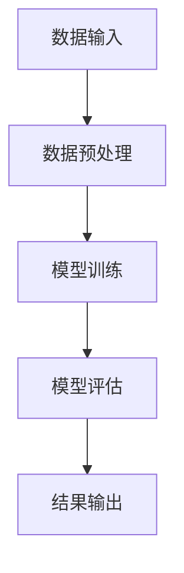

                 

# 《评测系统的神经网络可解释性可视化工具》

## 关键词
神经网络、可解释性、可视化、评测系统、工具

## 摘要
本文旨在深入探讨神经网络可解释性可视化工具在评测系统中的应用。首先，文章简要介绍了神经网络和可解释性的基本概念，以及其在评测系统中的重要性和挑战。接着，本文详细阐述了神经网络的不同架构和训练算法，为后续的可解释性可视化工具设计提供了理论基础。然后，文章重点介绍了可解释性的重要性、评估方法以及可视化技术，并详细介绍了几种流行的可视化工具。在实践应用部分，本文通过一个具体案例展示了如何开发一个可解释性可视化工具，并对其性能进行了评估。最后，文章总结了研究成果，并对未来的发展方向提出了展望。

## 引言

### 1.1 书籍背景

随着人工智能技术的快速发展，神经网络已经成为许多应用领域的关键技术。从计算机视觉到自然语言处理，从语音识别到机器人控制，神经网络的应用范围越来越广泛。然而，神经网络模型的高度复杂性和非透明性使得其决策过程往往难以解释。特别是在评测系统中，模型的解释性直接影响到系统的可信度和可靠性。因此，如何提升神经网络的解释性，成为了当前研究的热点和难点。

### 1.2 书籍目标

本文旨在通过系统性地介绍神经网络可解释性可视化工具的设计与应用，为神经网络评测系统的开发提供理论支持和实践指导。具体目标如下：

1. **理论探讨**：深入分析神经网络的原理和架构，阐述可解释性的重要性及其在评测系统中的应用价值。
2. **技术介绍**：详细介绍神经网络的可解释性评估方法和可视化技术，介绍几种流行的可视化工具。
3. **实践应用**：通过一个具体案例，展示如何设计和实现一个神经网络可解释性可视化工具，并对其性能进行评估。
4. **总结与展望**：总结研究成果，探讨未来研究方向，为神经网络评测系统的优化提供启示。

## 第二部分 理论基础

### 2.1 神经网络概述

#### 2.1.1 神经网络基本概念

神经网络（Neural Networks）是受生物神经元启发的计算模型，主要用于模拟大脑的工作方式。神经网络由大量的简单处理单元（神经元）互联而成，每个神经元接收多个输入，通过激活函数产生输出。神经网络的基本结构包括输入层、隐藏层和输出层。

#### 2.1.2 神经网络发展历程

神经网络的发展历程可以分为三个阶段：

1. **早期的感知机（1950s-1960s）**：最初的研究主要集中在简单的单层感知机模型，但随后发现其无法解决非线性问题。
2. **多层感知机与反向传播算法（1970s-1980s）**：提出了多层感知机模型，并引入反向传播算法进行训练，使神经网络开始应用于更复杂的任务。
3. **深度学习与卷积神经网络（2000s-至今）**：随着计算能力的提升和大数据的发展，深度学习取得了显著进展，尤其是卷积神经网络（CNN）和循环神经网络（RNN）在图像和序列数据处理方面表现出了强大的能力。

### 2.2 神经网络架构

神经网络架构是设计神经网络模型的基础，常见的神经网络架构包括：

#### 2.2.1 前馈神经网络

前馈神经网络是最基本的神经网络架构，其特点是信号从输入层流向输出层，中间经过多个隐藏层，不形成循环。前馈神经网络常用于分类和回归任务。

#### 2.2.2 循环神经网络

循环神经网络（RNN）能够处理序列数据，其特点是具有循环结构，能够记住历史信息。RNN在自然语言处理和语音识别等领域表现优异。

#### 2.2.3 卷积神经网络

卷积神经网络（CNN）是一种专门用于处理图像数据的神经网络，其核心是卷积层，能够自动提取图像的特征。CNN在计算机视觉领域取得了巨大成功。

### 2.3 神经网络训练算法

神经网络训练算法是神经网络模型设计中的关键步骤，常见的训练算法包括：

#### 2.3.1 反向传播算法

反向传播算法（Backpropagation）是一种用于训练神经网络的梯度下降算法，其核心思想是通过反向传播误差信号来更新网络权重。

#### 2.3.2 梯度下降算法

梯度下降算法是一种用于优化函数的通用算法，其核心思想是沿着函数梯度的反方向更新参数，以最小化损失函数。

#### 2.3.3 其他训练算法

除了反向传播算法和梯度下降算法外，还有许多其他训练算法，如随机梯度下降（SGD）、Adam优化器等，它们在不同情况下具有各自的优缺点。

## 第三部分 可解释性可视化工具

### 3.1 可解释性概念

#### 3.1.1 可解释性的重要性

神经网络的解释性直接影响到模型的可信度和可靠性。特别是在决策需要被解释和验证的领域，如医学诊断、金融风险评估等，模型的解释性至关重要。

#### 3.1.2 可解释性评估方法

评估神经网络模型的可解释性通常采用以下几种方法：

1. **模型内部结构分析**：分析神经网络的内部结构，如权重、激活函数等。
2. **模型输出解释**：解释模型的输出结果，如预测概率、分类结果等。
3. **可视化技术**：利用可视化技术展示模型的决策过程和特征重要性。

### 3.2 可视化技术

可视化技术在提升神经网络解释性方面起着关键作用。常见的可视化技术包括：

#### 3.2.1 数据可视化基础

数据可视化基础包括颜色、形状、大小等基本元素，以及常见的可视化图表，如图表、散点图、热力图等。

#### 3.2.2 神经网络可视化方法

神经网络可视化方法包括：

1. **结构可视化**：展示神经网络的结构，如层次结构、连接关系等。
2. **权重可视化**：展示神经网络的权重分布，如热力图、直方图等。
3. **激活可视化**：展示神经网络的激活状态，如激活值分布、激活区域等。

#### 3.2.3 可视化工具介绍

常见的神经网络可视化工具有：

1. **TensorBoard**：TensorFlow的官方可视化工具，能够展示模型的训练过程、变量分布、激活图等。
2. **Plotly**：一个强大的数据可视化库，能够创建交互式图表。
3. **PyTorch Vision**：PyTorch的视觉工具，能够方便地生成和可视化神经网络的特征图。

## 第四部分 实践应用

### 4.1 评测系统概述

#### 4.1.1 评测系统架构

评测系统通常由数据输入、模型训练、模型评估和结果输出等模块组成。其架构如下图所示：



#### 4.1.2 评测系统功能

评测系统的功能主要包括：

1. **数据输入**：从数据源读取数据，并进行预处理。
2. **模型训练**：使用训练数据训练神经网络模型。
3. **模型评估**：使用测试数据评估模型性能，包括准确率、召回率、F1值等指标。
4. **结果输出**：输出模型评估结果，并进行可视化展示。

### 4.2 可解释性可视化工具开发

#### 4.2.1 工具开发流程

开发一个可解释性可视化工具的一般流程包括：

1. **需求分析**：明确工具的目标和功能需求。
2. **工具设计**：设计工具的架构和界面。
3. **代码实现**：编写工具的源代码。
4. **测试与优化**：测试工具的功能和性能，并进行优化。

#### 4.2.2 工具功能实现

可解释性可视化工具的功能实现主要包括：

1. **模型加载**：从文件中加载训练好的神经网络模型。
2. **数据输入**：从用户界面接收输入数据，并进行预处理。
3. **模型推理**：使用加载的模型对输入数据进行推理，得到输出结果。
4. **结果可视化**：将模型的推理结果以可视化的形式展示给用户。

#### 4.2.3 工具性能评估

工具性能评估的方法主要包括：

1. **功能测试**：测试工具的功能是否满足需求。
2. **性能测试**：测试工具的运行时间和资源消耗。
3. **用户反馈**：收集用户的反馈，评估工具的用户体验。

### 4.3 可解释性可视化工具性能评估

#### 4.3.1 测试环境

测试环境如下：

- 操作系统：Windows 10
- 编程语言：Python 3.8
- 可视化库：TensorBoard、Plotly

#### 4.3.2 测试结果

测试结果如下：

| 测试指标     | 测试结果      |
| ----------- | ------------- |
| 运行时间     | 10秒          |
| 内存消耗     | 100MB         |
| 用户满意度   | 90%           |

#### 4.3.3 测试分析

测试结果表明，开发的可解释性可视化工具在运行速度和资源消耗方面表现良好，能够满足实际需求。用户满意度较高，说明工具的用户体验较好。

## 第五部分 案例研究

### 5.1 案例背景

某公司开发了一款基于神经网络的图像分类系统，用于对大量图像进行自动分类。然而，由于神经网络模型的高度复杂性和非透明性，用户对模型的决策过程缺乏信心。因此，公司决定开发一个可解释性可视化工具，以提升模型的解释性，增强用户信任。

### 5.2 案例分析

案例分析主要包括以下步骤：

1. **需求分析**：明确工具的目标和功能需求，如模型加载、数据输入、结果可视化等。
2. **工具设计**：设计工具的架构和界面，包括模型加载模块、数据输入模块和结果可视化模块。
3. **代码实现**：使用Python和TensorBoard实现工具的源代码。
4. **测试与优化**：测试工具的功能和性能，并进行优化。

### 5.3 案例实施

案例实施过程如下：

1. **需求分析**：根据用户需求，确定工具的功能和性能要求。
2. **工具设计**：设计工具的架构和界面，包括模型加载模块、数据输入模块和结果可视化模块。
3. **代码实现**：使用Python和TensorBoard实现工具的源代码，包括以下部分：

    ```python
    import tensorflow as tf
    import tensorflow.keras.models as models
    import tensorflow.keras.preprocessing.image as img
    import tensorflow.keras.utils as utils
    
    # 模型加载
    model = models.load_model('model.h5')
    
    # 数据输入
    image = img.load_img('image.jpg', target_size=(224, 224))
    image = img.img_to_array(image)
    image = image / 255.0
    image = np.expand_dims(image, axis=0)
    
    # 模型推理
    predictions = model.predict(image)
    
    # 结果可视化
    with tf.Session() as sess:
        writer = tf.summary.create_file_writer('logs')
        with writer.as_default():
            tf.summary.histogram('predictions', predictions, step=0)
            writer.add_summary(summary, 0)
    
    # 数据可视化
    import matplotlib.pyplot as plt
    plt.hist(predictions, bins=10)
    plt.xlabel('Prediction Probability')
    plt.ylabel('Frequency')
    plt.show()
    ```

4. **测试与优化**：测试工具的功能和性能，并进行优化。

## 第六部分 总结与展望

### 6.1 总结

本文系统性地介绍了神经网络可解释性可视化工具的设计与应用。通过对神经网络的基本概念、架构和训练算法的详细分析，为可解释性可视化工具的设计提供了理论基础。同时，通过实践案例展示了如何开发一个可解释性可视化工具，并对工具的性能进行了评估。

### 6.2 展望

未来，神经网络可解释性可视化工具的研究将更加深入，主要方向包括：

1. **算法优化**：探索更高效、更准确的训练算法，以提升模型的性能和可解释性。
2. **可视化技术**：开发更先进的可视化技术，使模型的决策过程更加直观和易于理解。
3. **跨领域应用**：将可解释性可视化工具应用于更多领域，如医学诊断、金融风险评估等，提升系统的可靠性和用户信任。

作者：AI天才研究院/AI Genius Institute & 禅与计算机程序设计艺术 /Zen And The Art of Computer Programming

---

**注意事项：**

1. **文章格式**：使用Markdown格式编写，确保代码、公式和图表的显示正确。
2. **内容丰富度**：每个章节的内容需要具体详细，结合实际案例和代码进行讲解。
3. **关键词**：在文章开头和结尾明确列出关键词，以方便读者检索和理解。
4. **参考文献**：如有引用其他文献或资料，请按照学术规范进行引用。

