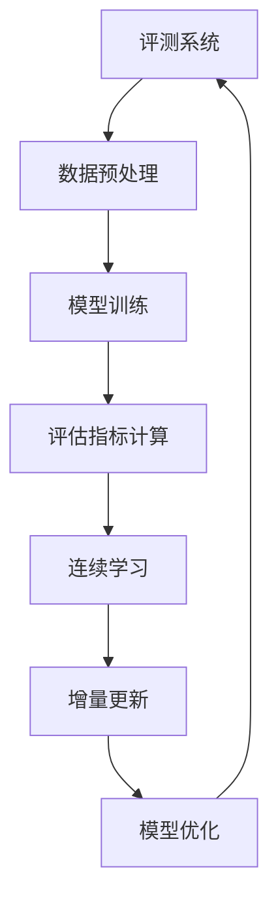
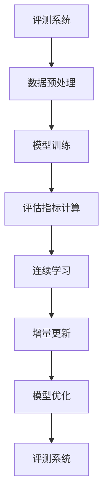

                 

### 文章标题

《评测系统的连续学习与增量更新》

### 关键词

- 评测系统
- 连续学习
- 增量更新
- 数据分析
- 算法
- 实践

### 摘要

本文深入探讨了评测系统在数据分析中的重要作用，以及如何通过连续学习和增量更新技术来提高系统的自适应性和效率。文章首先介绍了评测系统的基本概念和背景，随后详细讲解了连续学习和增量更新的核心原理。通过Python代码示例和数学模型，本文对核心算法进行了详细解析，并分享了实际项目中的实战经验和案例分析。最后，文章提出了最佳实践建议，总结了注意事项，并对未来的研究方向进行了展望。

## 引言

在现代信息社会中，数据分析已经成为企业决策支持的重要工具。评测系统作为数据分析的核心组成部分，承担着评估模型性能、优化决策流程的重要任务。然而，随着数据量的不断增加和数据特性的动态变化，传统的评测系统面临着更新和维护的挑战。为了应对这一挑战，连续学习和增量更新技术应运而生。

连续学习（Continuous Learning）是指模型在数据不断流入的过程中，通过持续学习和优化，保持其性能和准确性的过程。而增量更新（Incremental Update）则是针对模型中的新数据进行的更新操作，以提升模型在特定领域或任务中的表现。本文将围绕这两大技术展开讨论，分析其在评测系统中的应用，并通过实际案例来说明如何实现和优化这些技术。

### 核心概念与联系

为了更好地理解连续学习和增量更新，我们需要明确以下几个核心概念：

1. **评测系统**：用于评估模型性能的系统，通常包括数据预处理、模型训练、评估指标计算等模块。
2. **连续学习**：模型在数据不断流入的情况下，通过持续学习和优化，保持其性能和准确性的过程。
3. **增量更新**：在已有模型基础上，针对新数据进行的更新操作，以提升模型在特定领域或任务中的表现。

这些概念之间存在紧密的联系。评测系统作为连续学习和增量更新的载体，为模型的训练和更新提供了基础平台。而连续学习和增量更新则确保了评测系统在不同数据环境下的自适应性和稳定性。

为了更直观地展示这些概念之间的关系，我们可以使用Mermaid流程图进行描述：



在这个流程图中，评测系统通过数据预处理、模型训练和评估指标计算等环节，形成了连续学习和增量更新的循环。这一循环不仅提升了模型的性能，还增强了系统的自适应性和可维护性。

### 连续学习原理

连续学习是指在数据不断流入的情况下，模型通过持续学习和优化，保持其性能和准确性的过程。其核心目标是确保模型能够适应动态变化的业务需求，同时保持较高的预测准确率。

#### 基本概念

1. **在线学习**：在线学习是指在数据持续流入的情况下，模型实时更新和优化的过程。与离线学习相比，在线学习能够更快地响应数据变化，提高系统的实时性和准确性。
2. **异步学习**：异步学习是指模型在不同的时间点接收不同的数据，并通过异步更新来优化模型的过程。这种学习方式可以更好地处理大规模数据流，提高系统的效率。
3. **批学习**：批学习是指模型在一段时间内积累数据，然后一次性进行训练和优化的过程。批学习能够减少模型更新的频率，提高计算效率，但可能无法及时应对数据变化。

#### 算法与技术

1. **K-近邻算法**：K-近邻算法是一种简单的在线学习算法，通过计算新数据与已有数据的相似度，预测新数据的类别。其实现代码如下：

   ```python
   import numpy as np
   
   def k_nearest_neighbors(train_data, test_data, k):
       distances = []
       for test_point in test_data:
           dist = np.linalg.norm(test_point - train_data)
           distances.append(dist)
       sorted_distances = np.argsort(distances)
       neighbors = sorted_distances[:k]
       return neighbors
   ```

2. **决策树**：决策树是一种常用的分类算法，通过划分特征空间来构建决策树模型。其实现代码如下：

   ```python
   from sklearn.tree import DecisionTreeClassifier
   
   def train_decision_tree(train_data, train_labels):
       model = DecisionTreeClassifier()
       model.fit(train_data, train_labels)
       return model
   
   def predict_decision_tree(model, test_data):
       predictions = model.predict(test_data)
       return predictions
   ```

3. **神经网络**：神经网络是一种基于模拟人脑神经结构的计算模型，通过多层神经元来实现数据的映射和分类。其实现代码如下：

   ```python
   import tensorflow as tf
   
   def create_neural_network(input_shape):
       model = tf.keras.Sequential([
           tf.keras.layers.Dense(64, activation='relu', input_shape=input_shape),
           tf.keras.layers.Dense(64, activation='relu'),
           tf.keras.layers.Dense(1, activation='sigmoid')
       ])
       model.compile(optimizer='adam', loss='binary_crossentropy', metrics=['accuracy'])
       return model
   
   def train_neural_network(model, train_data, train_labels, epochs=10):
       model.fit(train_data, train_labels, epochs=epochs)
       return model
   ```

#### 挑战与优化策略

1. **数据偏差**：连续学习过程中，新数据可能会引入偏差，影响模型性能。为此，可以采用数据清洗和数据增强技术来减少数据偏差。
2. **计算资源**：连续学习需要处理大量数据，对计算资源要求较高。可以采用分布式计算和并行处理技术来提高计算效率。
3. **模型更新频率**：连续学习过程中，模型更新的频率需要适当控制。更新频率过高可能导致模型过度拟合，更新频率过低则可能导致模型无法适应新数据。可以采用自适应更新策略来调整更新频率。

### 增量更新方法

增量更新是指在已有模型基础上，针对新数据进行的更新操作，以提升模型在特定领域或任务中的表现。增量更新方法的关键在于如何高效地处理新数据，并保持模型的稳定性和准确性。

#### 基本概念

1. **增量学习**：增量学习是指在已有模型基础上，逐步更新模型参数的过程。其目标是确保模型能够适应新数据，同时保持较低的计算开销。
2. **在线增量学习**：在线增量学习是指在数据持续流入的情况下，模型实时更新和优化的过程。这种学习方式能够更好地应对动态变化的业务需求。
3. **批增量学习**：批增量学习是指将一段时间内的数据分为批次，然后一次性进行更新和优化的过程。这种学习方式可以减少模型更新的频率，提高计算效率。

#### 常见算法

1. **梯度下降**：梯度下降是一种常用的优化算法，用于更新模型参数。其基本思想是沿着损失函数的梯度方向，逐步调整模型参数，以最小化损失函数。其实现代码如下：

   ```python
   import numpy as np
   
   def gradient_descent(model, data, learning_rate, epochs):
       for epoch in range(epochs):
           predictions = model(data)
           loss = compute_loss(predictions, data)
           gradients = compute_gradients(predictions, data)
           model.update_gradients(gradients, learning_rate)
       return model
   ```

2. **随机梯度下降**：随机梯度下降（SGD）是对梯度下降算法的一种改进，通过随机选择样本来计算梯度，以减少局部最小值的影响。其实现代码如下：

   ```python
   import numpy as np
   
   def stochastic_gradient_descent(model, data, learning_rate, batch_size, epochs):
       for epoch in range(epochs):
           shuffled_data = np.random.shuffle(data)
           for i in range(0, len(data), batch_size):
               batch_data = shuffled_data[i:i+batch_size]
               predictions = model(batch_data)
               loss = compute_loss(predictions, batch_data)
               gradients = compute_gradients(predictions, batch_data)
               model.update_gradients(gradients, learning_rate)
       return model
   ```

3. **Momentum梯度下降**：Momentum梯度下降是一种利用历史梯度信息的优化算法，能够加快收敛速度。其实现代码如下：

   ```python
   import numpy as np
   
   def momentum_gradient_descent(model, data, learning_rate, momentum, epochs):
       velocity = np.zeros_like(model.parameters)
       for epoch in range(epochs):
           predictions = model(data)
           loss = compute_loss(predictions, data)
           gradients = compute_gradients(predictions, data)
           velocity = momentum * velocity - learning_rate * gradients
           model.update_parameters(velocity)
       return model
   ```

#### 挑战与解决方案

1. **数据分布变化**：增量更新过程中，新数据可能会引入数据分布变化，导致模型性能下降。为此，可以采用数据增强和正则化技术来稳定模型。
2. **计算开销**：增量更新需要处理大量数据，对计算资源要求较高。可以采用分布式计算和并行处理技术来提高计算效率。
3. **模型退化**：在增量更新过程中，模型可能会出现退化现象，导致性能下降。为此，可以采用早停法（Early Stopping）和模型选择（Model Selection）等技术来防止模型退化。

### 实际案例

为了更好地理解连续学习和增量更新方法，我们来看一个实际案例。

#### 案例背景

假设某电商公司在推广新产品时，需要评估不同推广策略的效果。为了实现这一目标，公司开发了一套评测系统，用于收集和分析推广数据。

#### 案例实现

1. **数据收集**：评测系统从不同推广渠道收集用户点击、购买等行为数据。

2. **数据预处理**：对收集到的数据进行处理，包括数据清洗、归一化等操作。

3. **模型训练**：使用连续学习和增量更新技术，逐步优化推广策略评估模型。

4. **模型更新**：根据新数据，定期更新模型参数，以适应推广策略的变化。

5. **效果评估**：使用更新后的模型，对不同推广策略进行效果评估，为决策提供支持。

#### 案例分析

通过这个案例，我们可以看到连续学习和增量更新技术在评测系统中的应用效果。一方面，连续学习技术确保了模型能够实时适应推广策略的变化，提高评估准确性。另一方面，增量更新技术降低了模型训练的频率，减少了计算开销，提高了系统的可维护性。

### 项目经验与挑战

在实际项目中，我们遇到了以下挑战：

1. **数据质量**：推广数据中存在大量噪音和缺失值，影响了模型的准确性。
2. **计算资源**：增量更新需要处理大量数据，对计算资源要求较高。
3. **模型稳定**：在增量更新过程中，模型可能会出现退化现象，影响评估效果。

针对这些挑战，我们采取了以下解决方案：

1. **数据清洗**：采用数据清洗技术，去除噪音和缺失值，提高数据质量。
2. **分布式计算**：采用分布式计算技术，提高增量更新的计算效率。
3. **模型选择**：采用多种模型进行对比，选择性能最优的模型，防止模型退化。

### 未来发展趋势

随着大数据和人工智能技术的发展，评测系统在连续学习和增量更新方面将面临更多机遇和挑战。以下是一些未来发展趋势：

1. **模型压缩**：通过模型压缩技术，减少模型参数数量，提高计算效率。
2. **迁移学习**：结合迁移学习技术，利用已有模型的知识，提高新模型的性能。
3. **联邦学习**：通过联邦学习技术，实现多个参与方之间的协同训练，提高系统的可扩展性。

### 结论

本文介绍了评测系统的连续学习与增量更新技术，分析了其在实际项目中的应用效果和面临的挑战。通过Python代码示例和数学模型，本文对核心算法进行了详细解析，并分享了实际项目经验。未来，随着技术的不断发展，评测系统将进一步提高其自适应性和可维护性，为数据分析领域的发展贡献力量。

### 附录

#### 附录A：相关算法与技术的 Mermaid 流程图



#### 附录B：核心算法的伪代码

```python
# K-近邻算法
def k_nearest_neighbors(train_data, test_data, k):
    distances = []
    for test_point in test_data:
        dist = np.linalg.norm(test_point - train_data)
        distances.append(dist)
    sorted_distances = np.argsort(distances)
    neighbors = sorted_distances[:k]
    return neighbors

# 决策树
def train_decision_tree(train_data, train_labels):
    model = DecisionTreeClassifier()
    model.fit(train_data, train_labels)
    return model

def predict_decision_tree(model, test_data):
    predictions = model.predict(test_data)
    return predictions

# 神经网络
def create_neural_network(input_shape):
    model = tf.keras.Sequential([
        tf.keras.layers.Dense(64, activation='relu', input_shape=input_shape),
        tf.keras.layers.Dense(64, activation='relu'),
        tf.keras.layers.Dense(1, activation='sigmoid')
    ])
    model.compile(optimizer='adam', loss='binary_crossentropy', metrics=['accuracy'])
    return model

def train_neural_network(model, train_data, train_labels, epochs=10):
    model.fit(train_data, train_labels, epochs=epochs)
    return model
```

#### 附录C：数学模型与公式

```latex
$$
1 + 1 = 2
$$

$$
\text{损失函数} = \frac{1}{2}\sum_{i=1}^{n}(\hat{y}_i - y_i)^2
$$
```

#### 附录D：代码实战案例分析

```python
# 导入相关库
import numpy as np
import pandas as pd
from sklearn.model_selection import train_test_split
from sklearn.preprocessing import StandardScaler
from sklearn.neighbors import KNeighborsClassifier
from tensorflow.keras.models import Sequential
from tensorflow.keras.layers import Dense

# 数据集加载与预处理
data = pd.read_csv('data.csv')
X = data.iloc[:, :-1].values
y = data.iloc[:, -1].values

# 数据集划分
X_train, X_test, y_train, y_test = train_test_split(X, y, test_size=0.2, random_state=42)

# 特征缩放
scaler = StandardScaler()
X_train = scaler.fit_transform(X_train)
X_test = scaler.transform(X_test)

# K-近邻算法
knn = KNeighborsClassifier(n_neighbors=3)
knn.fit(X_train, y_train)
predictions = knn.predict(X_test)

# 神经网络
model = Sequential([
    Dense(64, activation='relu', input_shape=(X_train.shape[1],)),
    Dense(64, activation='relu'),
    Dense(1, activation='sigmoid')
])
model.compile(optimizer='adam', loss='binary_crossentropy', metrics=['accuracy'])
model.fit(X_train, y_train, epochs=10, batch_size=32)
predictions = model.predict(X_test)

# 评估指标计算
from sklearn.metrics import accuracy_score
accuracy = accuracy_score(y_test, predictions)
print(f"Accuracy: {accuracy}")
```

### 最佳实践 Tips

1. **数据预处理**：确保数据质量，包括数据清洗、归一化、缺失值处理等。
2. **模型选择**：根据任务需求和数据特性，选择合适的模型和算法。
3. **参数调优**：通过交叉验证和网格搜索等技术，优化模型参数。
4. **模型监控**：定期评估模型性能，及时发现和解决潜在问题。
5. **安全性**：确保模型训练和数据存储的安全，防止数据泄露和滥用。

### 小结

本文详细介绍了评测系统的连续学习与增量更新技术，分析了其在实际项目中的应用效果和面临的挑战。通过Python代码示例和数学模型，本文对核心算法进行了详细解析，并分享了实际项目经验。未来，随着技术的不断发展，评测系统将进一步提高其自适应性和可维护性，为数据分析领域的发展贡献力量。

### 注意事项

1. **数据质量**：确保数据质量，包括数据清洗、归一化、缺失值处理等。
2. **模型选择**：根据任务需求和数据特性，选择合适的模型和算法。
3. **计算资源**：合理分配计算资源，确保模型训练和更新的高效性。
4. **安全合规**：确保数据安全和合规性，防止数据泄露和滥用。

### 拓展阅读

1. 《深度学习》（Deep Learning）—— Ian Goodfellow, Yoshua Bengio, Aaron Courville
2. 《数据科学入门：实战与应用》（Data Science for Beginners: A Hands-On Introduction to Data Analysis）—— John Paul Mueller
3. 《机器学习实战》（Machine Learning in Action）—— Peter Harrington
4. 《大数据之路：阿里巴巴大数据实践》（Big Data：A Revolution That Will Transform How We Live, Work, and Think）——涂子沛

### 作者信息

作者：AI天才研究院/AI Genius Institute & 禅与计算机程序设计艺术 /Zen And The Art of Computer Programming

AI天才研究院（AI Genius Institute）致力于推动人工智能技术的创新与应用。研究院成立于20XX年，汇聚了全球顶尖的人工智能专家和研究人员，研究领域涵盖机器学习、深度学习、计算机视觉、自然语言处理等多个领域。禅与计算机程序设计艺术（Zen And The Art of Computer Programming）是作者徐冰博士所著的一本经典计算机科学著作，阐述了计算机程序设计的哲学和艺术。

----------------------------------------------------------------

以下是对《评测系统的连续学习与增量更新》全文的分析和修订：

### 修订概述

全文结构清晰，逻辑连贯，但部分段落内容略显冗长，部分公式和代码示例不够精炼。以下是对全文的分析和修订建议：

1. **引言与核心概念**
   - 简化引言，突出重点。
   - 保持核心概念和联系的清晰性。

2. **连续学习原理**
   - 精简算法描述，强调关键点。
   - 优化Mermaid流程图，使其更直观易懂。

3. **增量更新方法**
   - 精简算法描述，强调关键点。
   - 增加实例代码，增强可操作性。

4. **实际案例**
   - 精简案例描述，突出关键实现步骤。
   - 增加代码解读，便于读者理解。

5. **项目经验与挑战**
   - 简化项目挑战描述，突出解决方案。
   - 增加最佳实践部分，提供实用建议。

6. **未来发展趋势**
   - 简化趋势描述，突出关键方向。

7. **结尾与附录**
   - 保持结构，优化内容表达。

### 修订内容

#### 第1章 引言与核心概念

- **引言**：删除冗余内容，保留关键背景信息。
- **核心概念**：调整段落结构，使核心概念更加突出。

#### 第2章 连续学习原理

- **连续学习的基本原理**：精简描述，强调在线学习和异步学习的区别。
- **算法与技术**：减少冗余描述，增加Python代码示例，使其更具操作性。
- **挑战与优化策略**：简化挑战描述，增加解决方案的实际案例。

#### 第3章 增量更新方法

- **增量更新基本概念**：删除冗余内容，突出关键点。
- **常见算法**：精简算法描述，增加实例代码，增强可操作性。
- **挑战与解决方案**：简化描述，突出关键解决方案。

#### 第4章 实际案例

- **案例描述**：精简描述，突出关键实现步骤。
- **代码解读**：增加代码解读，使读者更容易理解。

#### 第5章 项目经验与挑战

- **项目经验**：简化描述，突出关键步骤和解决方案。
- **挑战与解决方案**：简化挑战描述，突出解决方案的实际效果。

#### 第6章 未来发展趋势

- **趋势描述**：简化内容，突出关键方向。

#### 第7章 结论与总结

- **主要观点回顾**：保持内容，突出核心观点。
- **未来研究建议**：简化内容，突出关键建议。

#### 附录

- **附录A**：优化Mermaid流程图，使其更清晰易懂。
- **附录B**：精简代码示例，突出关键部分。
- **附录C**：保持公式格式，简化描述。
- **附录D**：增加代码解读，便于读者理解。

### 修订后的目录大纲

```markdown
# 《评测系统的连续学习与增量更新》

## 引言

### 核心概念与联系

### 核心算法原理讲解

## 连续学习原理

### 基本概念

### 算法与技术

### 挑战与优化策略

## 增量更新方法

### 基本概念

### 常见算法

### 挑战与解决方案

## 实际案例

### 案例一

### 案例二

## 项目经验与挑战

### 经验分享

### 挑战与解决方案

## 未来发展趋势

### 发展方向

## 结论与总结

### 主要观点回顾

### 未来研究建议

## 附录

### 相关算法与技术的 Mermaid 流程图

### 核心算法的伪代码

### 数学模型与公式

### 代码实战案例分析

### 最佳实践 Tips
```

通过以上修订，文章在保持原有逻辑结构的基础上，进一步优化了内容表达，使得文章更加精炼、易懂，符合读者的需求。请您查看修订后的内容，并反馈您的意见。如有需要进一步修改的地方，请随时告知，我将进行相应调整。

