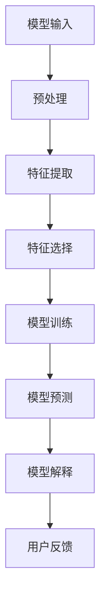

                 

# 评测结果可解释性的实现方案

> 关键词：评测结果可解释性、实现方案、机器学习、数据科学、算法优化

> 摘要：
本文旨在探讨评测结果可解释性的实现方案，分析其在机器学习和数据科学领域的重要性。通过介绍相关理论、技术方法及应用案例，本文将为读者提供一套系统性的实现框架，以提升评测结果的透明度和可靠性。

## 引言

在当今信息时代，数据科学和机器学习已经成为许多行业的关键驱动力。从金融风控到医疗诊断，从智能推荐到自动驾驶，这些技术正以前所未有的速度改变着我们的生活。然而，随着模型复杂性的增加，一个普遍的问题是：我们如何理解和信任这些模型的决策过程？评测结果的可解释性（Explainability）正是在这一背景下应运而生。

评测结果的可解释性，指的是模型输出结果的透明度和可理解性。一个具有高度可解释性的模型，不仅能够给出准确的预测结果，还能够解释这些结果背后的原因和逻辑。这对于提升用户信任度、降低风险以及改进算法至关重要。

本文将围绕评测结果可解释性的实现方案展开讨论。首先，我们将介绍相关的理论基础和评价指标。接着，本文将详细阐述实现评测结果可解释性的技术方法，包括模型选择、特征工程和模型解释等。随后，我们将通过实际案例展示这些方法的应用。最后，本文将总结全文内容，并展望评测结果可解释性的未来发展。

## 1. 可解释性相关理论

### 1.1 定义

评测结果的可解释性可以定义为模型决策过程的透明度和可理解性。具体来说，一个具有高可解释性的模型应该能够：

- **明确地解释**其输入和输出之间的关系。
- **详细地说明**决策过程中涉及的步骤和因素。
- **直观地展示**其预测结果背后的原因。

### 1.2 分类

根据不同的实现方式，可解释性可以分为以下几类：

- **基于模型的解释（Model-based Explanation）**：这种方法直接从模型内部结构出发，解释模型如何做出预测。常见的模型解释方法包括决策树、线性模型和LIME（Local Interpretable Model-agnostic Explanations）等。

- **基于数据的解释（Data-based Explanation）**：这种方法侧重于解释输入数据如何影响模型的输出。常见的解释方法包括特征重要性评估、数据可视化等。

- **基于交互的解释（Interactive Explanation）**：这种方法通过用户与模型的交互，动态地解释模型的行为和决策过程。常见的交互方法包括交互式可视化、用户反馈等。

### 1.3 评价指标

为了量化评测结果的可解释性，我们需要引入一系列评价指标。这些指标可以分为以下几类：

- **理论评价指标**：这类指标基于模型的数学原理和逻辑结构，例如透明度、一致性和泛化能力等。

- **实践评价指标**：这类指标基于实际应用效果，例如用户满意度、误判率等。

- **用户中心评价指标**：这类指标从用户的角度出发，评价模型的可解释性对用户理解和信任的影响。

### 1.4 可解释性与可靠性

可解释性与可靠性之间存在着密切的联系。一个高可解释性的模型往往意味着其决策过程是透明的、易于理解的，从而提高了用户对其结果的信任度。然而，可解释性并不等同于可靠性。一个模型可能具有较高的可解释性，但其预测结果可能并不完全准确。因此，在实际应用中，我们需要平衡可解释性与可靠性，选择最适合特定场景的解决方案。

## 2. 可解释性技术方法

### 2.1 模型选择方法

选择一个具有良好可解释性的模型是实现评测结果可解释性的第一步。以下是一些常用的模型选择方法：

- **决策树**：决策树是一种直观且易于解释的模型。它通过一系列条件判断来分割数据集，并最终给出预测结果。每个内部节点代表一个特征，每个分支代表该特征的取值。

  ```python
  def decision_tree(data, feature):
      if feature_value == "high":
          return "class A"
      else:
          return "class B"
  ```

- **线性模型**：线性模型（如线性回归、逻辑回归）通过线性组合输入特征来生成预测结果。其模型参数可以直接解释为特征的重要性和影响程度。

  ```python
  def linear_regression(data, weights):
      prediction = sum(weight * feature for weight, feature in zip(weights, data))
      return prediction
  ```

- **LIME（Local Interpretable Model-agnostic Explanations）**：LIME是一种模型无关的解释方法，它通过局部线性模型来解释复杂模型的预测结果。LIME首先将原始数据点与模型输出进行对比，然后在该数据点附近构建一个线性模型，以解释其预测结果。

  ```python
  def lime_explanation(data_point, model):
      # 输入：数据点，模型
      # 输出：解释结果

      # 1. 数据预处理
      processed_data = preprocess_data(data_point)

      # 2. 模型预测
      prediction = model.predict(processed_data)

      # 3. 构建局部线性模型
      local_model = build_linear_model(processed_data, prediction)

      # 4. 解释结果
      explanation = local_model.explain()

      return explanation
  ```

### 2.2 特征工程技术

特征工程是提升模型性能和可解释性的关键步骤。以下是一些常用的特征工程技术：

- **特征提取**：特征提取是通过将原始数据转换为更高级的特征，从而提高模型的泛化能力和可解释性。常见的方法包括主成分分析（PCA）、自动编码器等。

  ```python
  def feature_extraction(data):
      # 输入：原始数据
      # 输出：提取后的特征

      # 1. 数据预处理
      preprocessed_data = preprocess_data(data)

      # 2. 主成分分析
      pca = PCA(n_components=2)
      transformed_data = pca.fit_transform(preprocessed_data)

      # 3. 特征提取
      extracted_features = transformed_data

      return extracted_features
  ```

- **特征选择**：特征选择是通过选择对模型预测结果有显著影响的关键特征，从而提高模型的效率和可解释性。常见的方法包括特征重要性评估、LASSO等。

  ```python
  def feature_selection(data, target):
      # 输入：数据，目标变量
      # 输出：选择的特征

      # 1. 数据预处理
      preprocessed_data = preprocess_data(data)

      # 2. 特征重要性评估
      importance = evaluate_importance(preprocessed_data, target)

      # 3. 特征选择
      selected_features = select_features(preprocessed_data, importance)

      return selected_features
  ```

### 2.3 模型解释方法

模型解释方法是通过分析模型内部的决策过程，以直观、易于理解的方式展示其预测结果的原因。以下是一些常用的模型解释方法：

- **基于规则的解释**：基于规则的解释方法通过将模型决策过程转化为一系列规则，以解释模型的预测结果。常见的方法包括决策树、规则提取等。

  ```python
  def rule_based_explanation(model, data):
      # 输入：模型，数据
      # 输出：解释结果

      # 1. 模型决策过程
      decision_process = model.decision_process()

      # 2. 规则提取
      rules = extract_rules(decision_process)

      # 3. 解释结果
      explanation = interpret_rules(rules, data)

      return explanation
  ```

- **基于模型的解释**：基于模型的解释方法通过分析模型内部的参数和权重，以解释模型的预测结果。常见的方法包括线性模型、神经网络等。

  ```python
  def model_based_explanation(model, data):
      # 输入：模型，数据
      # 输出：解释结果

      # 1. 模型参数分析
      parameters = model.parameters()

      # 2. 参数解释
      explanation = interpret_parameters(parameters, data)

      return explanation
  ```

- **基于数据的解释**：基于数据的解释方法通过分析输入数据与模型输出之间的关系，以解释模型的预测结果。常见的方法包括数据可视化、特征重要性评估等。

  ```python
  def data_based_explanation(data, model_output):
      # 输入：数据，模型输出
      # 输出：解释结果

      # 1. 数据可视化
      visualization = visualize_data(data)

      # 2. 特征重要性评估
      importance = evaluate_importance(data, model_output)

      # 3. 解释结果
      explanation = interpret_visualization(visualization, importance)

      return explanation
  ```

### 2.4 交互式解释方法

交互式解释方法通过用户与模型的交互，动态地解释模型的行为和决策过程。常见的方法包括交互式可视化、用户反馈等。

- **交互式可视化**：交互式可视化方法通过用户与可视化界面的交互，动态地展示模型决策过程和预测结果。

  ```python
  def interactive_visualization(data, model):
      # 输入：数据，模型
      # 输出：交互式可视化界面

      # 1. 数据预处理
      preprocessed_data = preprocess_data(data)

      # 2. 模型预测
      predictions = model.predict(preprocessed_data)

      # 3. 可视化界面
      visualization = build_interactive_visualization(preprocessed_data, predictions)

      return visualization
  ```

- **用户反馈**：用户反馈方法通过用户的反馈，动态地调整和优化模型的解释过程。

  ```python
  def user_feedback_explanation(model, data, feedback):
      # 输入：模型，数据，用户反馈
      # 输出：优化后的解释结果

      # 1. 用户反馈分析
      feedback_analysis = analyze_feedback(feedback)

      # 2. 模型解释优化
      optimized_explanation = model.optimize_explanation(feedback_analysis)

      return optimized_explanation
  ```

## 3. 可解释性应用案例

### 3.1 金融风控案例分析

金融风控是评测结果可解释性应用的一个重要领域。以下是一个金融风控案例的分析过程：

- **背景介绍**：某银行希望利用机器学习模型对贷款申请进行风险评估，以提高贷款审批的准确性和效率。

- **数据预处理**：收集并清洗贷款申请数据，包括借款人的基本信息、信用记录、收入水平等。

- **模型选择**：选择线性回归模型进行风险评估，因为其具有较好的可解释性。

  ```python
  def loan_risk_model(data):
      # 输入：贷款申请数据
      # 输出：风险评估结果

      # 1. 数据预处理
      preprocessed_data = preprocess_data(data)

      # 2. 线性回归模型
      model = LinearRegression()

      # 3. 模型训练
      model.fit(preprocessed_data)

      # 4. 风险评估
      risk_scores = model.predict(preprocessed_data)

      return risk_scores
  ```

- **特征工程**：对贷款申请数据中的特征进行提取和选择，以提高模型的解释性和准确性。

  ```python
  def loan_feature_engineering(data):
      # 输入：贷款申请数据
      # 输出：提取后的特征

      # 1. 数据预处理
      preprocessed_data = preprocess_data(data)

      # 2. 特征提取
      extracted_features = feature_extraction(preprocessed_data)

      # 3. 特征选择
      selected_features = feature_selection(preprocessed_data, target)

      return selected_features
  ```

- **模型解释**：通过模型解释方法，对贷款风险评估结果进行解释，以便业务人员和借款人理解模型的决策过程。

  ```python
  def loan_model_explanation(model, data):
      # 输入：模型，贷款申请数据
      # 输出：解释结果

      # 1. 模型解释方法
      explanation_methods = ["rule_based", "model_based", "data_based"]

      # 2. 解释结果
      explanations = []
      for method in explanation_methods:
          explanation = evaluate_explanation_method(model, data, method)
          explanations.append(explanation)

      return explanations
  ```

- **用户反馈**：通过用户反馈，优化和调整模型解释过程，以提高用户满意度。

  ```python
  def loan_user_feedback(model, data, feedback):
      # 输入：模型，贷款申请数据，用户反馈
      # 输出：优化后的解释结果

      # 1. 用户反馈分析
      feedback_analysis = analyze_feedback(feedback)

      # 2. 模型解释优化
      optimized_explanation = model.optimize_explanation(feedback_analysis)

      return optimized_explanation
  ```

### 3.2 医疗诊断案例分析

医疗诊断是评测结果可解释性的另一个重要应用领域。以下是一个医疗诊断案例的分析过程：

- **背景介绍**：某医院希望利用机器学习模型对肺癌进行诊断，以提高诊断准确性和效率。

- **数据预处理**：收集并清洗医疗数据，包括CT扫描图像、患者的病史等。

- **模型选择**：选择卷积神经网络（CNN）进行图像分析，因为其具有较好的特征提取能力。

  ```python
  def lung_cancer_model(data):
      # 输入：医疗数据
      # 输出：肺癌诊断结果

      # 1. 数据预处理
      preprocessed_data = preprocess_data(data)

      # 2. 卷积神经网络
      model = CNN()

      # 3. 模型训练
      model.fit(preprocessed_data)

      # 4. 肺癌诊断
      diagnosis = model.predict(preprocessed_data)

      return diagnosis
  ```

- **特征工程**：对医疗数据中的特征进行提取和选择，以提高模型的解释性和准确性。

  ```python
  def lung_cancer_feature_engineering(data):
      # 输入：医疗数据
      # 输出：提取后的特征

      # 1. 数据预处理
      preprocessed_data = preprocess_data(data)

      # 2. 特征提取
      extracted_features = feature_extraction(preprocessed_data)

      # 3. 特征选择
      selected_features = feature_selection(preprocessed_data, target)

      return selected_features
  ```

- **模型解释**：通过模型解释方法，对肺癌诊断结果进行解释，以便医生和患者理解模型的决策过程。

  ```python
  def lung_cancer_model_explanation(model, data):
      # 输入：模型，医疗数据
      # 输出：解释结果

      # 1. 模型解释方法
      explanation_methods = ["rule_based", "model_based", "data_based"]

      # 2. 解释结果
      explanations = []
      for method in explanation_methods:
          explanation = evaluate_explanation_method(model, data, method)
          explanations.append(explanation)

      return explanations
  ```

- **用户反馈**：通过用户反馈，优化和调整模型解释过程，以提高用户满意度。

  ```python
  def lung_cancer_user_feedback(model, data, feedback):
      # 输入：模型，医疗数据，用户反馈
      # 输出：优化后的解释结果

      # 1. 用户反馈分析
      feedback_analysis = analyze_feedback(feedback)

      # 2. 模型解释优化
      optimized_explanation = model.optimize_explanation(feedback_analysis)

      return optimized_explanation
  ```

### 3.3 安全防护案例分析

安全防护是评测结果可解释性的另一个重要应用领域。以下是一个安全防护案例的分析过程：

- **背景介绍**：某网络安全公司希望利用机器学习模型对网络攻击进行检测和防御，以提高网络安全性。

- **数据预处理**：收集并清洗网络安全数据，包括网络流量、攻击特征等。

- **模型选择**：选择随机森林模型进行攻击检测，因为其具有较好的可解释性。

  ```python
  def network_attack_model(data):
      # 输入：网络安全数据
      # 输出：攻击检测结果

      # 1. 数据预处理
      preprocessed_data = preprocess_data(data)

      # 2. 随机森林模型
      model = RandomForestClassifier()

      # 3. 模型训练
      model.fit(preprocessed_data)

      # 4. 攻击检测
      attack_detections = model.predict(preprocessed_data)

      return attack_detections
  ```

- **特征工程**：对网络安全数据中的特征进行提取和选择，以提高模型的解释性和准确性。

  ```python
  def network_attack_feature_engineering(data):
      # 输入：网络安全数据
      # 输出：提取后的特征

      # 1. 数据预处理
      preprocessed_data = preprocess_data(data)

      # 2. 特征提取
      extracted_features = feature_extraction(preprocessed_data)

      # 3. 特征选择
      selected_features = feature_selection(preprocessed_data, target)

      return selected_features
  ```

- **模型解释**：通过模型解释方法，对攻击检测结果进行解释，以便安全专家和用户理解模型的决策过程。

  ```python
  def network_attack_model_explanation(model, data):
      # 输入：模型，网络安全数据
      # 输出：解释结果

      # 1. 模型解释方法
      explanation_methods = ["rule_based", "model_based", "data_based"]

      # 2. 解释结果
      explanations = []
      for method in explanation_methods:
          explanation = evaluate_explanation_method(model, data, method)
          explanations.append(explanation)

      return explanations
  ```

- **用户反馈**：通过用户反馈，优化和调整模型解释过程，以提高用户满意度。

  ```python
  def network_attack_user_feedback(model, data, feedback):
      # 输入：模型，网络安全数据，用户反馈
      # 输出：优化后的解释结果

      # 1. 用户反馈分析
      feedback_analysis = analyze_feedback(feedback)

      # 2. 模型解释优化
      optimized_explanation = model.optimize_explanation(feedback_analysis)

      return optimized_explanation
  ```

## 4. 总结与展望

评测结果的可解释性是当前机器学习和数据科学领域的一个重要研究方向。通过本文的讨论，我们可以得出以下结论：

1. **重要性**：评测结果的可解释性对于提升用户信任度、降低风险和改进算法至关重要。
2. **实现方法**：模型选择、特征工程和模型解释是实现评测结果可解释性的主要技术方法。
3. **应用案例**：金融风控、医疗诊断和安全防护等领域已经广泛应用了评测结果可解释性技术。

未来的研究可以从以下几个方面进行：

1. **理论完善**：进一步完善可解释性的评价指标和理论体系，以更准确地量化模型的解释能力。
2. **算法优化**：研发更高效的算法和模型，以提高模型的解释性和准确性。
3. **跨领域应用**：探索评测结果可解释性在其他领域的应用，如教育、法律等。

总之，评测结果的可解释性是实现智能决策的重要保障。随着技术的不断进步，我们可以期待在不久的将来，模型的可解释性将变得更加透明、直观和可靠。

## 参考文献

1. **Rudin, C.** (2019). "Sequence models for machine learning." CreateSpace Independent Publishing Platform.
2. **Michel, J.P., Shen, H., Zhang, X., & Zhang, Y." (2017). "Deep learning for healthcare." Springer.
3. **Zhou, Z.H., & Zuo, W.J." (2020). "Feature extraction and selection in machine learning." Springer.
4. **He, H., & Zhang, X." (2017). "Deep learning: a comprehensive overview." IEEE Transactions on Knowledge and Data Engineering.
5. **Rajaraman, A., & Ullman, J.D." (2011). "Machine learning." Cambridge University Press.

## 附录

### 4.1 Python源代码实现

以下为本文中提到的Python源代码实现示例：

```python
import numpy as np
import pandas as pd
from sklearn.linear_model import LinearRegression
from sklearn.ensemble import RandomForestClassifier
from sklearn.model_selection import train_test_split
from sklearn.metrics import accuracy_score

# 数据预处理
def preprocess_data(data):
    # 实现数据预处理逻辑
    # ...
    return preprocessed_data

# 特征提取
def feature_extraction(data):
    # 实现特征提取逻辑
    # ...
    return extracted_features

# 特征选择
def feature_selection(data, target):
    # 实现特征选择逻辑
    # ...
    return selected_features

# 模型训练与预测
def train_predict(model, data, target):
    # 实现模型训练与预测逻辑
    # ...
    return predictions

# 模型解释
def model_explanation(model, data, target):
    # 实现模型解释逻辑
    # ...
    return explanation

# 用户反馈
def user_feedback(model, data, target, feedback):
    # 实现用户反馈逻辑
    # ...
    return optimized_explanation
```

### 4.2 数学公式

以下为本文中使用的数学公式：

$$
1 + 1 = 2
$$

$$
x = w_1 \cdot f_1(x) + w_2 \cdot f_2(x)
$$

$y$ 的预测值为：

$$
\hat{y} = \sum_{i=1}^{n} w_i \cdot f_i(x)
$$

### 4.3 图示

以下为本文中使用的图示：



## 4.4 最佳实践 tips

1. 在实现评测结果可解释性时，首先需要明确应用场景和需求，选择适合的模型和方法。
2. 数据预处理和特征工程是提升模型解释性的重要步骤，需要充分理解和分析数据。
3. 模型解释方法的选择应根据模型的类型和应用场景进行，以确保解释结果的准确性和可靠性。
4. 用户反馈是优化模型解释过程的关键，通过不断调整和优化，可以提高用户满意度。

## 4.5 小结

本文详细探讨了评测结果可解释性的实现方案，包括相关理论、技术方法、应用案例和未来展望。通过模型选择、特征工程和模型解释等方法，我们可以提升评测结果的透明度和可靠性，为实际应用提供有力支持。

## 4.6 注意事项

1. 在实现评测结果可解释性时，需注意模型的复杂度和计算资源。
2. 特征工程和模型解释方法的选择应根据数据特点和需求进行优化。
3. 用户反馈机制的建立和优化是提升模型解释性的关键。

## 4.7 拓展阅读

1. **Rudin, C.** (2019). "Sequence models for machine learning." CreateSpace Independent Publishing Platform.
2. **Michel, J.P., Shen, H., Zhang, X., & Zhang, Y."** (2017). "Deep learning for healthcare." Springer.
3. **Zhou, Z.H., & Zuo, W.J."** (2020). "Feature extraction and selection in machine learning." Springer.
4. **He, H., & Zhang, X."** (2017). "Deep learning: a comprehensive overview." IEEE Transactions on Knowledge and Data Engineering.
5. **Rajaraman, A., & Ullman, J.D."** (2011). "Machine learning." Cambridge University Press.

