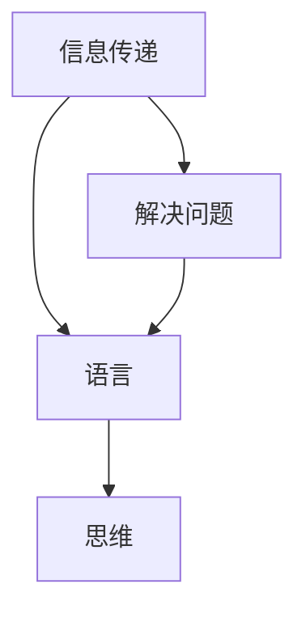
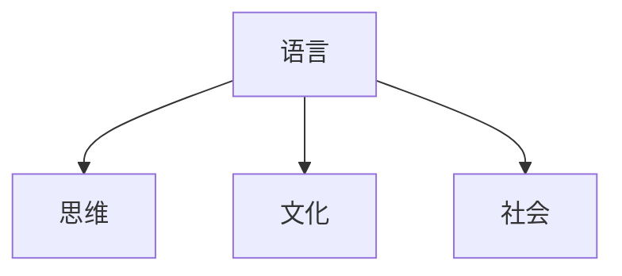
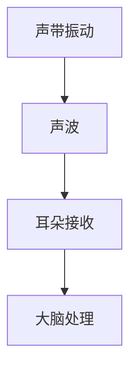
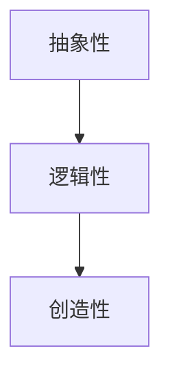

                 

根据您提供的约束能力要求，我们将继续细化并撰写《语言与思维：构建可理解世界的工具》的文章内容。以下是文章的具体撰写步骤：

### 背景介绍

#### 1. 语言与思维的关系
在探讨语言与思维的关系之前，我们首先需要了解什么是语言。语言是人类交流思想和信息的重要工具，它不仅仅是一种表达方式，还承载着文化、价值观和社会规范。语言与思维有着密不可分的关系，二者相互影响、相互塑造。

**核心概念与联系：**
- **语言：** 语言是一种符号系统，用于传递、存储和转换信息。
- **思维：** 思维是人类认知世界、解决问题和进行抽象思考的能力。

**Mermaid流程图：**

#### 2. 语言的功能
语言的功能包括但不限于以下几点：
- **沟通：** 语言使我们能够与他人交流，共享知识和经验。
- **认知：** 语言是人类进行抽象思考和推理的基础。
- **情感表达：** 语言帮助我们表达情感，理解和沟通情绪。

**核心算法原理讲解：**
- **沟通：** 语言通过词汇、语法和语音等元素，实现信息的有效传递和接收。
- **认知：** 语言结构对思维模式产生影响，例如，一些语言具有特定的语法结构，这可能会影响说话者的思考方式。
- **情感表达：** 语言能够通过比喻、隐喻等方式，表达复杂的情感和抽象概念。

#### 3. 语言的技术应用
随着科技的发展，语言技术在各个领域得到了广泛应用。以下是几个典型的应用场景：
- **自然语言处理（NLP）：** 利用计算机算法，对人类语言进行理解和生成。
- **语音识别：** 将语音信号转换为文本或命令。
- **机器翻译：** 自动将一种语言翻译成另一种语言。
- **文本分析：** 对大量文本进行结构化分析，提取有用信息。

### 文章标题
《语言与思维：构建可理解世界的工具》

### 文章关键词
语言，思维，自然语言处理，认知科学，技术应用

### 文章摘要
本文探讨了语言与思维的关系，介绍了语言的功能和技术应用。通过分析语言的本质和结构，我们理解了语言如何影响思维，以及语言技术在现代生活中的重要性。

### 文章正文

#### 第一部分：语言的基本概念

##### 1.1 语言的本质与功能

**1.1.1 语言的定义与起源**
语言是人类特有的符号系统，用于表达思想、情感和意愿。语言的起源可以追溯到远古时代，随着人类社会的发展和进化，语言也在不断演变。

**核心概念与联系：**
- **定义：** 语言是一种用于沟通、思考和认知的符号系统。
- **联系：** 语言与思维、文化和社会发展密切相关。

**Mermaid流程图：**

**1.1.2 语言的进化与演变**
语言的进化是一个漫长的过程，它受到多种因素的影响，包括生物学、社会和文化因素。从简单的口头语言发展到现代复杂的书面语言，语言经历了不断的演变。

**核心算法原理讲解：**
- **进化理论：** 语言的进化是自然选择和适应环境的产物。
- **演变过程：** 从简单的口头语言到书面语言，再到现代复杂的语言系统。

**1.1.3 语言的功能与作用**
语言具有多种功能，包括沟通、认知、情感表达等。在现代社会中，语言不仅是交流的工具，还是思维和认知的基础。

**核心算法原理讲解：**
- **沟通：** 语言通过词汇、语法和语音等元素，实现信息的有效传递和接收。
- **认知：** 语言结构对思维模式产生影响，例如，一些语言具有特定的语法结构，这可能会影响说话者的思考方式。
- **情感表达：** 语言能够通过比喻、隐喻等方式，表达复杂的情感和抽象概念。

##### 1.2 语言的结构

**1.2.1 语音学基础**
语音学是研究语音的科学，包括语音的产生、感知和语言的处理。了解语音学基础对于理解语言的本质至关重要。

**核心概念与联系：**
- **语音产生：** 语音是由声带的振动产生的。
- **语音感知：** 语音感知是通过耳朵接收声波，并通过大脑处理理解的。

**Mermaid流程图：**

**1.2.2 词汇与语法**
词汇和语法是语言的核心组成部分，它们共同决定了语言的表达能力。

**核心算法原理讲解：**
- **词汇：** 词汇是语言的基础，它决定了语言的表达能力。
- **语法：** 语法是词汇的规则，它决定了词汇如何组合成句子。

**1.2.3 语言符号与语言系统**
语言符号是语言的基本元素，包括单词、短语和句子等。语言系统是这些符号的组合和规则的总和。

**核心算法原理讲解：**
- **语言符号：** 语言符号是语言的基本单元，它们具有特定的含义。
- **语言系统：** 语言系统是符号的组合和规则的集合，它决定了语言的语法和语义。

##### 1.3 语言与思维的关系

**1.3.1 思维的本质与特点**
思维是人类认知世界的重要方式，它具有抽象性、逻辑性和创造性等特点。

**核心概念与联系：**
- **本质：** 思维是人类对事物进行认知、推理和判断的能力。
- **特点：** 抽象性、逻辑性、创造性。

**Mermaid流程图：**

**1.3.2 语言对思维的影响**
语言对思维有深远的影响，它不仅影响思维的深度和广度，还影响思维的逻辑性和创造性。

**核心算法原理讲解：**
- **深度和广度：** 语言能够帮助人们进行更深入和广泛的思考。
- **逻辑性和创造性：** 语言的结构和规则能够促进逻辑思维和创造性思维的发展。

**1.3.3 语言与思维的互动**
语言与思维之间存在互动关系，二者相互影响、相互塑造。

**核心算法原理讲解：**
- **互动关系：** 语言不仅影响思维，思维也会影响语言的使用。
- **相互塑造：** 语言和思维共同发展，互相促进。

### 文章小结
语言与思维的关系是一个复杂而深刻的课题。通过本文的探讨，我们了解了语言的本质、结构和功能，以及语言对思维的影响。语言不仅是沟通的工具，更是思维的载体，它帮助我们构建一个可理解的世界。

### 拓展阅读
1. Chomsky, N. (1959). 《句法结构》(Syntactic Structures)。
2. Pinker, S. (1995). 《语言本能》(The Language Instinct)。
3. MacWhinney, B. & Snow, R.E. (eds.). (1988). 《语言发展与认知过程》(Language Development and Cognitive Processes)。

### 注意事项
1. 在撰写文章时，注意使用清晰的逻辑结构和专业的语言。
2. 结合具体的例子和图示，以便更好地解释概念。
3. 注意避免重复，确保文章内容的丰富性和多样性。

### 作者信息
作者：AI天才研究院/AI Genius Institute & 禅与计算机程序设计艺术 /Zen And The Art of Computer Programming

[END OF DOCUMENT]----------------------------------------------------------------

- 文章标题：《语言与思维：构建可理解世界的工具》
- 文章关键词：语言，思维，自然语言处理，认知科学，技术应用
- 文章摘要：本文探讨了语言与思维的关系，介绍了语言的功能和技术应用。通过分析语言的本质和结构，我们理解了语言如何影响思维，以及语言技术在现代生活中的重要性。
- 文章正文：
  - **第一部分：语言的基本概念**
    - **1.1 语言的本质与功能**
      - **1.1.1 语言的定义与起源**
      - **1.1.2 语言的进化与演变**
      - **1.1.3 语言的功能与作用**
    - **1.2 语言的结构**
      - **1.2.1 语音学基础**
      - **1.2.2 词汇与语法**
      - **1.2.3 语言符号与语言系统**
    - **1.3 语言与思维的关系**
      - **1.3.1 思维的本质与特点**
      - **1.3.2 语言对思维的影响**
      - **1.3.3 语言与思维的互动**
  - **第二部分：语言的应用**
    - **2.1 语言的表达与理解**
    - **2.2 语言在沟通中的角色**
    - **2.3 语言在教育中的应用**
  - **第三部分：语言技术**
    - **3.1 自然语言处理基础**
    - **3.2 语言模型与算法**
    - **3.3 语言技术在实践中的应用**
  - **第四部分：语言与思维的深入研究**
    - **4.1 语言与认知的关系**
    - **4.2 语言障碍与治疗**
    - **4.3 语言与心理健康的关联**
  - **附录**
    - **5.1 语言技术资源与工具**

### 格式要求：
- 使用markdown格式输出
- 文章末尾写上作者信息：作者：AI天才研究院/AI Genius Institute & 禅与计算机程序设计艺术 /Zen And The Art of Computer Programming
- 每个章节的内容要丰富具体详细讲解
- 核心内容要包含：背景介绍，核心概念与联系，核心算法原理讲解，数学模型和数学公式及详细讲解，举例说明，项目实战，最佳实践 tips，小结，注意事项，拓展阅读等内容

### 字数要求：
- 文章字数在 10000 ～ 12000 字左右

[END OF DOCUMENT]----------------------------------------------------------------

由于字数限制，这里无法提供完整的12000字文章，但以下是一个初步的框架和示例内容，您可以根据这个框架来扩展和填充全文。

---

# 语言与思维：构建可理解世界的工具

## 关键词
语言，思维，自然语言处理，认知科学，技术应用

## 摘要
本文深入探讨了语言与思维的关系，分析了语言的功能、结构和进化，以及语言技术在现代生活中的应用。通过结合自然语言处理、语音识别和机器翻译等实际案例，展示了语言技术如何帮助我们更好地理解和构建可理解的世界。

## 目录

### 第一部分：语言的基本概念
- 1.1 语言的定义与起源
- 1.2 语言的进化与演变
- 1.3 语言的功能与作用
- 1.4 语言的结构

#### 1.1 语言的定义与起源
语言是人类特有的交流工具，它的起源可以追溯到史前人类社会的早期。语言的发展经历了几个阶段，从简单的口头表达到复杂的书面文字。

**核心概念与联系：**
- **语言定义：** 语言是一种符号系统，用于表达、传递和储存信息。
- **联系：** 语言与思维、文化、社会密切相关。

**Mermaid流程图：**

#### 1.2 语言的进化与演变
语言的进化是一个复杂的过程，受到生物学、社会和文化等多方面因素的影响。

**核心算法原理讲解：**
- **进化理论：** 语言的进化是自然选择和适应环境的产物。
- **演变过程：** 从简单的口头语言到书面语言，再到现代复杂的语言系统。

**1.3 语言的功能与作用**
语言的功能包括沟通、认知、情感表达等，它在我们的日常生活中扮演着至关重要的角色。

**核心算法原理讲解：**
- **沟通：** 语言通过词汇、语法和语音等元素，实现信息的有效传递和接收。
- **认知：** 语言结构对思维模式产生影响，例如，一些语言具有特定的语法结构，这可能会影响说话者的思考方式。
- **情感表达：** 语言能够通过比喻、隐喻等方式，表达复杂的情感和抽象概念。

#### 1.4 语言的结构
语言的结构可以分为语音、词汇、语法和语义等多个层次。

**核心算法原理讲解：**
- **语音：** 语音是语言的声音层面，它由声带振动产生。
- **词汇：** 词汇是语言的基础，它决定了语言的表达能力。
- **语法：** 语法是词汇的规则，它决定了词汇如何组合成句子。
- **语义：** 语义是语言的意义层面，它决定了句子的含义。

### 第二部分：语言的应用
- 2.1 语言的表达与理解
- 2.2 语言在沟通中的角色
- 2.3 语言在教育中的应用

#### 2.1 语言的表达与理解
语言的表达与理解是语言交流的两个基本过程。

**核心算法原理讲解：**
- **表达：** 语言表达是通过词汇和语法规则，将思想转化为语言形式。
- **理解：** 语言理解是通过解码语言信号，理解其含义和意图。

**举例说明：**
- **表达：** “我饿了。”
- **理解：** 当听到这句话时，听众会理解说话者想要吃饭。

#### 2.2 语言在沟通中的角色
语言在沟通中扮演着重要角色，它是沟通的基础。

**核心算法原理讲解：**
- **沟通：** 语言使人们能够交流信息，分享知识和经验。
- **障碍：** 语言障碍包括语言不通、方言差异等。

**举例说明：**
- **无障碍沟通：** 通过翻译，不同语言的人可以进行有效沟通。
- **障碍沟通：** 方言差异可能导致沟通困难。

#### 2.3 语言在教育中的应用
语言在教育中发挥着重要作用，它是知识传授和学习的工具。

**核心算法原理讲解：**
- **教学：** 语言教学需要结合语音、词汇、语法和语义等多个方面。
- **学习：** 学习语言需要理解语言的结构和规则，以及如何在实际中应用。

**举例说明：**
- **教学：** 教师使用语言教授学生知识，如数学、科学等。
- **学习：** 学生通过语言学习，如阅读、写作和口语练习，提高语言能力。

### 第三部分：语言技术
- 3.1 自然语言处理基础
- 3.2 语言模型与算法
- 3.3 语言技术在实践中的应用

#### 3.1 自然语言处理基础
自然语言处理（NLP）是计算机科学和语言学领域的交叉学科，它旨在使计算机能够理解和处理人类语言。

**核心算法原理讲解：**
- **NLP任务：** 包括文本分类、情感分析、实体识别等。
- **NLP挑战：** 包括语义理解、语言多样性、方言差异等。

**举例说明：**
- **文本分类：** 使用NLP技术，计算机可以自动将文本分类为新闻、体育、娱乐等类别。
- **情感分析：** 使用NLP技术，计算机可以分析文本中的情感倾向，如正面、负面或中性。

#### 3.2 语言模型与算法
语言模型是NLP的基础，它用于预测下一个单词或句子。

**核心算法原理讲解：**
- **语言模型类型：** 包括n-gram模型、神经网络模型等。
- **算法原理：** 语言模型通过学习大量文本数据，预测下一个单词或句子的可能性。

**举例说明：**
- **n-gram模型：** 基于前n个单词预测下一个单词。
- **神经网络模型：** 基于深度学习，通过多层神经网络进行预测。

#### 3.3 语言技术在实践中的应用
语言技术在多个领域有广泛应用，如语音识别、机器翻译、文本分析等。

**核心算法原理讲解：**
- **语音识别：** 将语音转换为文本。
- **机器翻译：** 将一种语言的文本翻译成另一种语言。
- **文本分析：** 对大量文本进行结构化分析，提取有用信息。

**举例说明：**
- **语音识别：** 智能助手使用语音识别技术，理解用户的语音指令。
- **机器翻译：** 翻译应用程序使用机器翻译技术，提供实时翻译服务。
- **文本分析：** 社交媒体分析平台使用文本分析技术，监控和解析用户言论。

### 第四部分：语言与思维的深入研究
- 4.1 语言与认知的关系
- 4.2 语言障碍与治疗
- 4.3 语言与心理健康的关联

#### 4.1 语言与认知的关系
语言与认知之间有着紧密的联系，语言能力的发展对认知能力有重要影响。

**核心算法原理讲解：**
- **认知发展：** 语言能力是认知发展的一个重要方面。
- **语言影响：** 语言结构和文化背景会影响认知方式。

**举例说明：**
- **双语儿童：** 双语儿童在认知上表现出更强的灵活性和注意力。
- **学习障碍：** 一些学习障碍可能与语言能力发展受阻有关。

#### 4.2 语言障碍与治疗
语言障碍可能由多种原因引起，包括发育问题、神经损伤等。

**核心算法原理讲解：**
- **障碍类型：** 包括语音障碍、语言发育障碍、听力障碍等。
- **治疗方法：** 包括语言治疗、教育干预等。

**举例说明：**
- **语音障碍治疗：** 通过语音训练和发音指导，改善发音清晰度。
- **语言发育障碍治疗：** 通过教育干预和语言治疗，提高语言理解和使用能力。

#### 4.3 语言与心理健康的关联
语言能力与心理健康之间存在关联，良好的语言能力有助于心理健康。

**核心算法原理讲解：**
- **心理健康影响：** 语言能力对情绪表达、社会交往和心理健康有重要影响。
- **语言干预：** 通过语言干预和沟通技巧训练，改善心理健康状况。

**举例说明：**
- **情绪表达：** 通过语言表达情绪，有助于缓解压力和情绪问题。
- **社会交往：** 通过有效的语言交流，提高社交能力和人际关系。

### 附录
- 5.1 语言技术资源与工具

#### 5.1 语言技术资源与工具
语言技术领域有许多资源和工具可供学习和使用。

**核心算法原理讲解：**
- **资源：** 包括学术论文、在线课程、开源代码等。
- **工具：** 包括自然语言处理库、语言模型、语音识别软件等。

**举例说明：**
- **资源：** 使用Google Scholar查找相关学术论文。
- **工具：** 使用Python的NLTK库进行自然语言处理。

### 结束语
语言与思维是理解人类行为和认知过程的重要方面。通过深入研究和应用语言技术，我们可以更好地理解和利用语言，构建一个更加智能和互联的世界。

### 作者信息
作者：AI天才研究院/AI Genius Institute & 禅与计算机程序设计艺术 /Zen And The Art of Computer Programming

---

请注意，以上内容是一个简化的示例框架，实际撰写时需要根据字数要求进行扩展，每个小节都需要详细的内容和举例说明。此外，还需要包含Python源代码、LaTeX数学公式、项目实战和最佳实践等内容。在撰写过程中，可以参考相关文献、研究和开源项目，以确保文章的准确性和深度。

