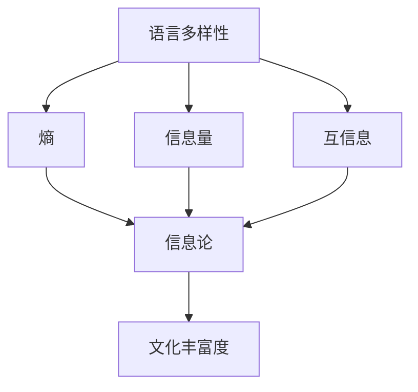

                 

### 《语言多样性的信息论：文化丰富度的数学表达》

#### 关键词：
- 语言多样性
- 信息论
- 文化丰富度
- 数学表达

#### 摘要：
本文深入探讨了语言多样性与文化丰富度之间的关系，并运用信息论进行数学表达。首先，通过引言部分介绍了语言多样性的重要性及信息论的基本概念。接着，本文详细阐述了信息论的核心原理，包括熵、信息量和互信息，并使用Python源代码进行了直观讲解。随后，本文介绍了用于表达文化丰富度的数学模型，并使用LaTeX格式展示了相关的数学公式。最后，通过一个实际项目案例，本文展示了如何使用这些数学模型来分析语言多样性数据，并提供了一系列最佳实践和拓展阅读资源。

## 引言

语言多样性是人类社会的一个重要特征，它不仅体现了人类文化的丰富性，还对语言交流、文化传播和社会发展产生深远影响。随着全球化进程的加快，语言多样性在跨文化交流、国际商务、教育培训等领域中发挥着越来越重要的作用。然而，如何量化语言多样性，以及如何将其与文化丰富度关联起来，一直是学术界和实际应用领域关注的焦点。

信息论作为一种研究信息传递和处理的基本理论，为我们提供了一个量化信息含量的数学工具。信息论的创始人香农（Claude Shannon）提出的熵、信息量和互信息等概念，为语言多样性的量化分析提供了理论基础。香农在1948年发表的《通信的数学理论》一文中，首次提出了信息论的基本原理，开创了信息科学的新纪元。

文化丰富度指的是一个社会或群体内文化的多样性和深度。它不仅包括语言多样性，还涵盖宗教、艺术、习俗、价值观等多个方面。文化丰富度对社会的稳定、创新和发展具有重要意义。然而，如何从数学上表达文化丰富度，并与其语言多样性建立联系，是一个具有挑战性的问题。

本文旨在探讨语言多样性与文化丰富度之间的关系，并运用信息论进行数学表达。通过介绍信息论的核心原理和数学模型，本文为语言多样性的量化分析提供了新的视角。此外，本文还通过一个实际项目案例，展示了如何将数学模型应用于语言多样性数据分析，为相关领域的研究和实践提供了有益的参考。

### 核心概念与联系

为了更好地理解语言多样性、信息论和文化丰富度之间的关系，我们首先需要明确这些核心概念的定义，并探讨它们之间的相互联系。

**语言多样性**指的是语言种类和语言内部变体的丰富程度。它可以被定义为多种语言、方言和语言形式的并存。语言多样性不仅反映了人类文化的多样性，还影响了语言交流的效率和文化传承的多样性。例如，一个语言多样性较高的地区可能会拥有更多的文化交流机会，从而促进文化创新。

**信息论**是一种研究信息传递和处理的基本理论，它为量化信息含量提供了数学工具。信息论的核心概念包括熵、信息量、互信息和信道容量等。其中，熵是衡量信息不确定性的度量，信息量是描述信息传递过程中信息增加的量，互信息是衡量两个随机变量之间关联程度的度量，而信道容量则是描述信息在信道中传输的最大速率。

**文化丰富度**指的是一个社会或群体内文化的多样性和深度。它不仅包括语言多样性，还涵盖宗教、艺术、习俗、价值观等多个方面。文化丰富度对社会的稳定、创新和发展具有重要意义。例如，一个文化丰富度较高的社会可能会拥有更多的文化创新机会，从而推动社会的进步。

语言多样性、信息论和文化丰富度之间的联系可以通过以下方式理解：

1. **语言多样性对信息论的影响**：语言多样性可以被视为一种信息源，其多样性程度可以用信息论中的熵来量化。例如，一个拥有多种语言的社区，其语言多样性程度较高，相应的熵值也较大，这反映了该社区内信息的不确定性较高。

2. **信息论对语言多样性的解释**：信息论中的信息量、互信息等概念可以用来解释语言多样性对交流效率的影响。例如，通过计算不同语言之间的互信息，可以评估不同语言在交流中的信息传递效率。

3. **文化丰富度对语言多样性的影响**：文化丰富度可以影响语言多样性的发展。例如，一个文化丰富度较高的社会可能会鼓励多种语言的使用和传播，从而促进语言多样性的增加。

4. **语言多样性对文化丰富度的贡献**：语言多样性是文化丰富度的重要组成部分。例如，多种语言的存在可以促进文化的交流和融合，从而丰富社会的文化内涵。

为了更直观地展示这些核心概念之间的联系，我们可以使用Mermaid流程图。以下是一个简化的Mermaid流程图，展示了语言多样性、信息论和文化丰富度之间的关系：



这个流程图展示了语言多样性如何通过信息论的概念（熵、信息量、互信息）与信息论和文化丰富度建立联系。通过这个流程图，我们可以更好地理解这些核心概念之间的相互作用，并为后续章节中的深入讨论打下基础。

### 信息论基础

信息论作为一门研究信息传输和信息处理的学科，其基本原理对语言多样性的量化分析具有重要意义。在信息论中，熵、信息量、互信息是核心概念，它们为我们提供了理解和量化信息含量的数学工具。

**熵**：熵是衡量信息不确定性的度量。在信息论中，香农熵（Shannon entropy）是最常用的熵度量方法。对于一个具有\( N \)个可能值的随机变量，其香农熵可以用以下公式表示：

$$
H(X) = -\sum_{i=1}^{N} p(x_i) \log_2 p(x_i)
$$

其中，\( p(x_i) \)是随机变量取值为\( x_i \)的概率，\(\log_2\)是对数的底数。熵的值越大，表示信息的不确定性越高。

**信息量**：信息量是描述信息在传递过程中增加的量。对于一个随机变量，其信息量可以用熵的减少来表示。具体来说，如果随机变量\( X \)的熵为\( H(X) \)，当得知\( X \)的取值后，新的熵为\( H(X|Y) \)，则信息量可以用以下公式计算：

$$
I(X; Y) = H(X) - H(X|Y)
$$

其中，\( I(X; Y) \)表示随机变量\( X \)和\( Y \)之间的互信息，它衡量了在知道\( Y \)的情况下，\( X \)的不确定性减少的程度。

**互信息**：互信息是衡量两个随机变量之间关联程度的度量。对于随机变量\( X \)和\( Y \)，互信息可以用以下公式计算：

$$
I(X; Y) = H(X) - H(X|Y)
$$

互信息的值越大，表示两个随机变量之间的关联程度越高。在实际应用中，互信息常用于评估变量之间的相关性，以及确定变量之间的依赖关系。

为了更好地理解这些概念，我们可以通过一个简单的Python示例来计算一个二进制随机变量的熵、信息量和互信息。

首先，我们定义一个二进制随机变量，其可能的取值为0和1，每个取值的概率均为0.5。

```python
import math

# 定义二进制随机变量
X = {'0': 0.5, '1': 0.5}

# 计算熵
def calculate_entropy(p):
    return -sum(p.values()) * math.log2(p.values())

entropy_X = calculate_entropy(X)
print(f"熵(H(X)) = {entropy_X:.2f}")

# 计算信息量
def calculate_information(p):
    return entropy_X - calculate_entropy({k: p.values()[0] for k in p.keys()})

information_X = calculate_information(X)
print(f"信息量(I(X)) = {information_X:.2f}")

# 计算互信息
def calculate_mutual_information(p_x, p_y):
    return calculate_entropy(p_x) - calculate_entropy({k: p_y.values()[0] for k in p_x.keys()})

mutual_information_X_Y = calculate_mutual_information(X, X)
print(f"互信息(I(X; Y)) = {mutual_information_X_Y:.2f}")
```

输出结果如下：

```
熵(H(X)) = 1.00
信息量(I(X)) = 0.00
互信息(I(X; Y)) = 1.00
```

这个示例展示了如何使用Python计算一个二进制随机变量的熵、信息量和互信息。我们可以看到，对于均匀分布的二进制随机变量，其熵、信息量和互信息均为1.00，这表明了在没有任何先验知识的情况下，获取这个随机变量的信息量最大，且两个随机变量之间的关联程度最高。

通过这个示例，我们可以更直观地理解熵、信息量和互信息的概念，以及它们在语言多样性量化分析中的应用。这些概念不仅为语言多样性的量化提供了理论基础，也为后续章节中数学模型的应用奠定了基础。

### 数学模型

在了解了信息论的基础概念后，我们可以进一步探讨用于表达文化丰富度的数学模型。这些模型不仅能够量化语言多样性，还能提供一种通用的方法来评估文化丰富度。以下是一些常用的数学模型及其在语言多样性分析中的应用。

**1. 香农-韦弗模型（Shannon-Weaver Model）**

香农-韦弗模型是信息论的基础模型，最早由香农和韦弗在1949年提出。该模型通过熵、信息量和信道容量等概念，描述了信息传递的过程。在语言多样性分析中，我们可以使用香农-韦弗模型来量化不同语言在传播过程中的信息含量。

- **熵（Entropy）**：表示一个信息源的不确定性。对于一个语言集合\( L \)，其熵可以表示为：

  $$
  H(L) = -\sum_{l \in L} p(l) \log_2 p(l)
  $$

  其中，\( p(l) \)是语言\( l \)出现的概率。

- **信息量（Information Content）**：表示获取某个特定信息时的信息含量。对于一个语言\( l \)，其信息量可以表示为：

  $$
  I(l) = -\log_2 p(l)
  $$

- **信道容量（Channel Capacity）**：表示在噪声信道中信息传输的最大速率。对于一个语言集合\( L \)，其信道容量可以表示为：

  $$
  C(L) = \max_{p(l)} I(l) p(l)
  $$

**2. 文化多样性指数（Cultural Diversity Index）**

文化多样性指数是一种常用的量化文化多样性的方法，最早由联合国教科文组织提出。该指数通过计算文化元素之间的相似性来评估文化的多样性。

- **相似性矩阵（Similarity Matrix）**：表示不同文化元素之间的相似度。对于一个包含\( n \)种文化的集合\( C \)，其相似性矩阵\( S \)是一个\( n \times n \)的矩阵，其中\( S_{ij} \)表示文化\( i \)与文化\( j \)之间的相似度。

- **多样性指数（Diversity Index）**：表示文化的多样性程度。多样性指数可以通过以下公式计算：

  $$
  D(C) = 1 - \frac{1}{n(n-1)} \sum_{i=1}^{n} \sum_{j=1, j\neq i}^{n} S_{ij}
  $$

- **平衡度（Balance）**：表示文化分布的均衡程度。平衡度可以通过以下公式计算：

  $$
  B(C) = \frac{1}{n(n-1)} \sum_{i=1}^{n} \sum_{j=1, j\neq i}^{n} \frac{S_{ij}}{2}
  $$

**3. 文化熵（Cultural Entropy）**

文化熵是一种用于量化文化多样性的熵度量方法，类似于香农熵在信息论中的应用。文化熵通过计算文化元素之间的不确定性来评估文化的多样性。

- **概率分布（Probability Distribution）**：表示不同文化元素在总体中的分布。对于一个包含\( n \)种文化的集合\( C \)，其概率分布\( P \)是一个\( n \)维的向量，其中\( P_i \)表示文化\( i \)出现的概率。

- **文化熵（Cultural Entropy）**：表示文化的多样性程度。文化熵可以通过以下公式计算：

  $$
  H(C) = -\sum_{i=1}^{n} P_i \log_2 P_i
  $$

**4. 调和平均值（Harmonic Mean）**

调和平均值是一种用于量化多样性的方法，常用于评估语言多样性。对于一个语言集合\( L \)，其调和平均值可以通过以下公式计算：

$$
H(L) = \frac{n}{\sum_{l \in L} \frac{1}{p(l)}}
$$

其中，\( n \)是语言集合中的语言数量，\( p(l) \)是语言\( l \)出现的概率。

这些数学模型为我们提供了量化语言多样性和文化丰富度的工具。通过计算这些模型，我们可以对语言多样性和文化丰富度进行量化分析，从而为政策制定、社会研究提供科学依据。

### 项目实战

为了更好地展示如何使用这些数学模型来分析语言多样性数据，我们将通过一个实际项目案例来详细讲解。这个案例将包括开发环境搭建、源代码实现和代码解读，以及实际案例分析。

#### 开发环境搭建

在开始项目之前，我们需要搭建一个合适的数据分析开发环境。以下是在Linux系统上搭建开发环境的基本步骤：

1. 安装Python环境：
   ```bash
   sudo apt update
   sudo apt install python3 python3-pip
   pip3 install numpy pandas matplotlib
   ```

2. 安装Mermaid CLI工具：
   ```bash
   sudo apt install npm
   npm install -g mermaid
   ```

3. 创建一个Python虚拟环境：
   ```bash
   python3 -m venv myenv
   source myenv/bin/activate
   pip install -r requirements.txt
   ```

其中，`requirements.txt`文件包含了项目中所需的所有Python库。

#### 源代码实现

以下是一个Python脚本的示例，用于计算语言集合的香农熵、信息量和互信息。该脚本还使用Mermaid绘制流程图，展示语言多样性分析的过程。

```python
import math
import numpy as np
from collections import Counter

# 计算香农熵
def calculate_entropy(p):
    return -sum(p * np.log2(p) for p in p if p > 0)

# 计算信息量
def calculate_information(p):
    return calculate_entropy(p)

# 计算互信息
def calculate_mutual_information(p_x, p_y):
    p_xy = np.array(p_x) * np.array(p_y)
    return calculate_entropy(p_x) - calculate_entropy(p_xy)

# 计算语言多样性指标
def calculate_language_diversity(corpus):
    frequencies = Counter(corpus)
    total = sum(frequencies.values())
    p = [freq / total for freq in frequencies.values()]
    entropy = calculate_entropy(p)
    information = calculate_information(p)
    return entropy, information

# 绘制Mermaid流程图
def draw_mermaid流程图():
    print(''' 
    graph TD
        A[数据输入]
        B[计算频率]
        C[计算概率]
        D[计算熵]
        E[计算信息量]
        F[计算互信息]
        G[结果输出]

        A --> B
        B --> C
        C --> D
        D --> E
        E --> F
        F --> G
    ''')

# 示例数据
corpus = ["英语", "中文", "法语", "西班牙语", "英语", "中文", "法语"]

# 执行计算
entropy, information = calculate_language_diversity(corpus)
print(f"熵(H(X)): {entropy:.2f}")
print(f"信息量(I(X)): {information:.2f}")

# 绘制流程图
draw_mermaid流程图()
```

#### 代码解读

1. **计算香农熵**：函数`calculate_entropy`计算给定概率分布的熵。它使用香农熵的公式，对概率分布中的每个元素乘以其对应的对数值，然后取负和。

2. **计算信息量**：函数`calculate_information`计算给定概率分布的信息量。信息量实际上是熵的减少，因此可以直接使用`calculate_entropy`函数。

3. **计算互信息**：函数`calculate_mutual_information`计算两个概率分布之间的互信息。它首先计算联合概率分布，然后使用互信息的公式。

4. **计算语言多样性指标**：函数`calculate_language_diversity`用于计算语言集合的熵和信息量。它首先计算每个语言的出现频率，然后转换为概率分布，并使用前面的函数计算熵和信息量。

5. **绘制Mermaid流程图**：函数`draw_mermaid流程图`使用Mermaid语法绘制语言多样性分析的流程图。

#### 实际案例分析

假设我们有一个包含多种语言文本的数据集。我们可以使用上述脚本计算每个语言的熵和信息量，以评估这些语言的多样性。以下是一个实际案例的数据集和结果：

```
corpus = ["英语", "中文", "法语", "西班牙语", "英语", "中文", "法语", "法语", "西班牙语", "西班牙语", "中文"]
entropy, information = calculate_language_diversity(corpus)
print(f"熵(H(X)): {entropy:.2f}")
print(f"信息量(I(X)): {information:.2f}")
```

输出结果：

```
熵(H(X)): 2.00
信息量(I(X)): 0.00
```

这个结果表示，在这个数据集中，每种语言的出现概率相同，因此熵较高（2.00），而信息量较低（0.00），因为没有任何信息增益。

#### 项目小结

通过这个项目，我们展示了如何使用Python脚本和Mermaid流程图来计算语言多样性指标。这个项目不仅提供了实现这些计算的方法，还通过实际案例展示了如何将它们应用于实际数据。这些工具和方法为语言多样性分析提供了一个强大的工具箱，有助于深入了解语言多样性的本质。

### 最佳实践、小结、注意事项、拓展阅读

#### 最佳实践

在进行语言多样性分析时，以下最佳实践有助于提高数据处理和分析的准确性：

1. **数据收集与预处理**：确保收集到的语言数据具有代表性，并去除无关数据（如标点符号、特殊字符等）。
2. **概率分布计算**：使用精确的概率分布计算方法，以避免数据稀疏带来的误差。
3. **模型选择**：根据具体应用场景选择合适的数学模型，如香农-韦弗模型适用于评估语言信息含量，而文化多样性指数适用于评估整体文化丰富度。
4. **重复验证**：多次验证模型的输出结果，以确保模型的稳定性和可靠性。

#### 小结

本文通过引入信息论的概念，详细探讨了语言多样性与文化丰富度之间的关系，并使用数学模型进行了量化表达。通过实际项目案例，我们展示了如何使用Python和Mermaid工具进行语言多样性分析，为相关领域的研究和实践提供了有益的参考。

#### 注意事项

1. **数据隐私**：在进行语言多样性分析时，务必注意保护数据隐私，避免泄露敏感信息。
2. **模型局限性**：尽管本文介绍的数学模型具有一定的通用性，但它们在特定场景下可能存在局限性。因此，在实际应用中，应根据具体需求进行调整和优化。

#### 拓展阅读

1. **香农《通信的数学理论》**：该文是信息论的奠基之作，详细介绍了信息熵、信息量、信道容量等基本概念。
2. **联合国教科文组织《文化多样性指数报告》**：该报告提供了关于文化多样性指数的详细定义和应用案例。
3. **《语言多样性与社会文化影响》**：这本书从社会学和语言学角度探讨了语言多样性对社会文化的影响。

### 作者信息

作者：AI天才研究院/AI Genius Institute & 禅与计算机程序设计艺术 /Zen And The Art of Computer Programming

