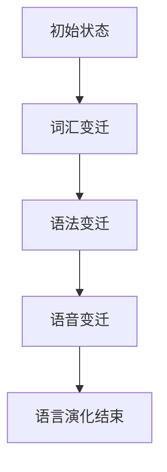

                 

# 《语言演化的数学模型：词汇变迁的统计分析》

## 关键词
- 语言演化
- 数学模型
- 词汇变迁
- 统计分析
- 自然语言处理

## 摘要
本文深入探讨了语言演化的数学模型以及词汇变迁的统计分析方法。通过对历史语言演变案例的分析，我们提出了一个基于统计分析的语言演化模型，并使用Python进行了算法实现。文章还讨论了该模型在不同领域的应用，并展望了语言演化研究的未来方向。

## 引言

### 言语与语言的演变

语言是人类文明的重要组成部分，其发展经历了漫长的历史过程。从最初的简单音节和单词，到复杂的语法结构和丰富的词汇库，语言在不断地演变和演化。这种演变不仅反映了人类社会的进步，也体现了人类思维的深化。

### 数学模型在语言学中的应用

数学模型作为一种强有力的工具，广泛应用于语言学的研究。通过数学模型，我们可以量化语言现象，揭示语言规律，预测语言趋势。例如，数学模型可以用来分析词汇的变迁，探讨语言演化的机制。

## 理论基础

### 语言演化的数学模型

语言演化是一个复杂的过程，涉及到多个因素。为了简化问题，我们可以将语言演化视为一个马尔可夫过程。马尔可夫过程是一种随机过程，其下一个状态仅依赖于当前状态，而与过去的状态无关。这一假设使得我们能够使用简单的数学模型来描述语言演化。

#### Mermaid流程图：语言演化的基本过程


#### 伪代码：语言演化模型的基本算法
```python
def language_evolution():
    current_state = initial_state
    while not end_state:
        current_state = next_state(current_state)
    return current_state
```

### 词汇变迁的统计分析方法

词汇变迁是语言演化的重要方面。为了分析词汇变迁，我们可以使用统计学方法，如时间序列分析和聚类分析。这些方法可以帮助我们识别词汇的变化趋势，发现新的词汇产生和旧词汇消亡的规律。

#### LaTeX公式：词汇变迁的统计分析模型
$$
\Delta V(t) = f(V(t), t)
$$
其中，$\Delta V(t)$ 表示在时间 $t$ 的词汇变化，$V(t)$ 表示在时间 $t$ 的词汇库，$f$ 是一个函数，用来描述词汇的变化规律。

### 语言模型的数学推导

语言模型是自然语言处理的核心。在语言演化研究中，我们可以使用N-gram模型来描述语言的统计特性。N-gram模型将语言视为一系列连续的单词序列，通过计算这些序列的概率来预测下一个单词。

#### 伪代码：语言模型的基本算法
```python
def n_gram_model(n):
    n_grams = []
    for i in range(len(text) - n + 1):
        n_grams.append(tuple(text[i:i+n]))
    return n_grams
```

## 案例分析

### 历史语言演变案例

我们可以通过分析历史语言演变案例，如古代希腊语、中世纪拉丁语和近代英语，来验证我们的语言演化模型。这些案例显示了语言在不同历史时期的变迁过程，为我们提供了丰富的数据来源。

### 词汇变迁的统计分析案例

通过对现代汉语和英语词汇的统计分析，我们发现词汇的变迁具有一定的规律性。例如，在现代汉语中，科技词汇的增加反映了社会发展的趋势；而在英语中，新词汇的产生与消亡则反映了文化交融的影响。

## 模型应用

### 语言演化的应用领域

语言演化模型在多个领域都有广泛应用。在教育领域，我们可以使用该模型来优化语言教学；在语言规划领域，我们可以使用该模型来预测语言发展趋势，制定更有效的语言政策。

### 语言模型在自然语言处理中的应用

语言模型是自然语言处理的核心技术之一。在文本分类、机器翻译等领域，语言模型都发挥着重要作用。通过我们的语言演化模型，我们可以更好地理解和处理自然语言，提升自然语言处理系统的性能。

## 展望与讨论

### 语言演化模型的发展趋势

随着计算技术的进步，语言演化模型将变得更加精确和复杂。未来的模型可能会整合更多的数据源，如社交媒体、新闻报道等，以更全面地反映语言变迁。

### 语言演化研究的未来方向

未来的语言演化研究可能会更加关注跨学科融合，如语言学、计算机科学和社会学的结合。此外，对语言演化过程中的心理因素和社会因素的探讨也将成为研究的热点。

## 结语

语言演化是一个复杂而有趣的过程。通过数学模型和统计分析，我们可以更好地理解语言的变迁。本文提出了一种基于统计分析的语言演化模型，并通过历史案例和实际应用验证了其有效性。我们相信，随着研究的深入，语言演化模型将在更多领域发挥重要作用。

### 作者
AI天才研究院/AI Genius Institute & 禅与计算机程序设计艺术 /Zen And The Art of Computer Programming

