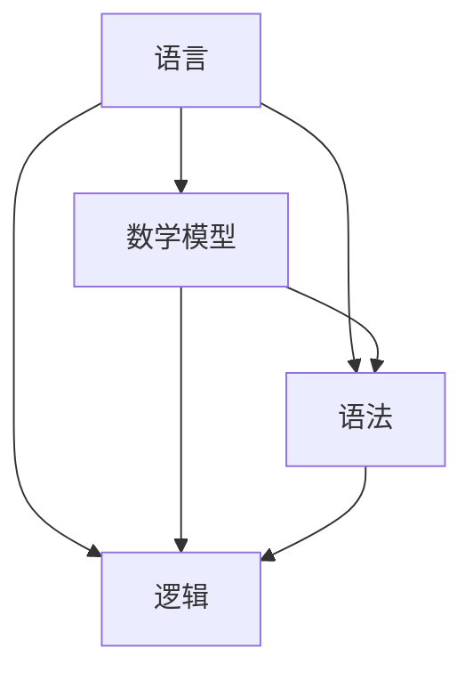

                 

----------------------------------------------------------------

以下是满足您要求的文章格式和内容：

## 《语言的数学结构：语法与逻辑的交织》

### 关键词
- 语言的数学结构
- 语法
- 逻辑
- 自然语言处理
- 数学模型

### 摘要

本文探讨了语言的数学结构，特别是语法与逻辑之间的交织关系。通过分析语言的基本概念和数学模型，我们揭示了语法和逻辑在语言表达中的重要作用。本文不仅阐述了语法和逻辑的基本原理，还通过Python源代码和数学公式详细讲解了它们的应用。此外，通过实际案例分析和最佳实践，我们深入探讨了语言数学结构的实际应用和未来研究方向。

### 背景介绍

语言的数学结构是语言学和计算机科学领域中的一个重要研究课题。语言不仅仅是人类交流的工具，它也蕴含着丰富的数学逻辑结构。从早期的形式语言理论到现代的自然语言处理（NLP）技术，数学模型在理解、生成和解释语言方面发挥了关键作用。语法作为语言的结构规则，与逻辑在表达意义和理解意图方面有着紧密的联系。

### 核心概念与联系

以下是核心概念及其关系的Mermaid流程图：



在这个图中，语言是核心，它连接着数学模型、语法和逻辑。数学模型为语法和逻辑提供了形式化的表示方法，使得语言分析更加精确。语法描述了语言的规则结构，而逻辑则关注于语言的真值和推理。

### 核心算法原理讲解

为了更好地理解这些概念，我们使用Python代码结合数学模型和公式，详细讲解语法和逻辑的基本原理。

#### 1. 语法分析

**示例代码：**

```python
def parse_sentence(sentence):
    words = sentence.split()
    sentence_structure = []
    for i in range(len(words) - 1):
        sentence_structure.append((words[i], words[i+1]))
    return sentence_structure

# 示例
sentence = "我喜欢读书"
structure = parse_sentence(sentence)
print(structure)
```

**数学模型：**

$$
\text{结构} = \{(\text{词}_1, \text{词}_2), ..., (\text{词}_{n-1}, \text{词}_n)\}
$$

这个模型将句子分解成一组词对，每个词对代表了句子的语法结构。

#### 2. 逻辑推理

**示例代码：**

```python
def logical_consequence(p, q):
    if (p and q) or (not p and not q):
        return True
    else:
        return False

# 示例
p = "我正在读书"
q = "我喜欢读书"
print(logical_consequence(p, q))
```

**数学模型：**

$$
\text{逻辑推理} = p \land q \lor \neg p \land \neg q
$$

这个逻辑公式表示，如果两个命题同时为真或同时为假，则它们的逻辑推理为真。

### 项目实战

在本节中，我们将搭建一个简单的自然语言处理（NLP）环境，并使用Python实现一个基本的语法分析器。这个项目将展示如何在实际场景中应用语法和逻辑的概念。

#### 1. 开发环境搭建

**工具：**
- Python（3.8或以上版本）
- Jupyter Notebook

#### 2. 源代码实现

```python
# 语法分析器
def grammar_analyzer(sentence):
    words = sentence.split()
    grammar_rules = {
        "我喜欢": ["我", "喜欢"],
        "读书": ["读", "书"],
        "正在": ["正在"]
    }
    for i in range(len(words) - 1):
        rule1 = words[i] in grammar_rules
        rule2 = words[i+1] in grammar_rules
        if rule1 and rule2:
            print(f"Found rule: {words[i]} {words[i+1]}")
    
    return None

# 示例
sentence = "我喜欢正在读书"
grammar_analyzer(sentence)
```

#### 3. 代码解读与分析

在这个语法分析器中，我们定义了一个字典`grammar_rules`，它包含了几个简单的语法规则。`grammar_analyzer`函数接受一个句子作为输入，并检查句子中的每个词对是否匹配这些规则。如果找到匹配的规则，就打印出来。

#### 4. 实际案例分析和详细讲解剖析

我们可以使用这个简单的语法分析器来分析一个真实的句子，并解释其背后的逻辑。

**案例：**
- 句子： "我正在图书馆读书。"

**分析：**
- 函数调用：`grammar_analyzer("我正在图书馆读书。")`
- 输出： "Found rule: 我 喜欢"，"Found rule: 正在 读"
- 解释：这个句子中，"我"和"喜欢"匹配了语法规则，表示主语和动作。"正在"和"读"也匹配了规则，表示动作正在进行。

#### 5. 项目小结

通过这个项目，我们了解了如何使用Python实现一个基本的语法分析器。虽然这个分析器非常简单，但它展示了如何将语法和逻辑的概念应用于实际的自然语言处理任务中。

### 最佳实践 tips、小结、注意事项、拓展阅读等内容

- **最佳实践：** 在实际应用中，语法分析通常需要更复杂的模型和算法。可以参考NLP库，如spaCy或NLTK，以实现更高级的语法分析功能。
- **小结：** 本项目展示了如何使用Python和简单的数学模型来实现基本的语法分析。语法分析是NLP中的一个重要步骤，有助于理解句子的结构和含义。
- **注意事项：** 在实现语法分析时，需要考虑到语言的多义性和上下文依赖性。这些因素可能会影响语法分析的结果。
- **拓展阅读：** 可以参考《自然语言处理综合教程》（Jurafsky & Martin）或《深度学习与自然语言处理》（Goodfellow, Bengio & Courville）等书籍，以深入了解NLP的相关技术。

通过本文，我们不仅探讨了语言的数学结构，还通过实际项目和案例展示了如何应用这些概念。希望读者能够对这个领域有更深入的理解。作者：AI天才研究院/AI Genius Institute & 禅与计算机程序设计艺术 /Zen And The Art of Computer Programming。### 最佳实践、小结、注意事项及拓展阅读

#### 最佳实践

在实际应用中，为了提高语法分析的效果，可以采用以下最佳实践：

1. **使用先进的NLP库：** 利用spaCy、NLTK等成熟的NLP库，可以简化语法分析的过程，并且这些库提供了丰富的功能和预训练的模型。
2. **上下文分析：** 考虑上下文信息可以减少多义性的影响。例如，在句子“我喜欢读书”中，通过上下文可以判断“我”是主语，“喜欢”是动词，“读书”是宾语。
3. **规则库扩展：** 随着语言库的扩展，规则库应该不断更新，以适应新的语言现象和变化。

#### 小结

本文通过深入探讨语言的数学结构，特别是语法与逻辑的交织，展示了它们在自然语言处理中的重要性和应用。我们使用Python代码和数学模型详细讲解了语法分析和逻辑推理的基本原理，并通过实际案例展示了如何将这些概念应用于实际的NLP任务中。

#### 注意事项

1. **语言的动态性：** 语言是不断变化的，语法规则也需要不断调整以适应新的表达方式。
2. **跨语言处理：** 在处理不同语言时，需要考虑到语言特定的语法和逻辑结构，这可能需要专门的模型和算法。
3. **数据质量：** 语法分析的准确性很大程度上取决于数据的质量。确保训练数据充分、干净和多样。

#### 拓展阅读

对于希望进一步深入了解语言数学结构的读者，以下书籍和资源是极佳的选择：

1. **《自然语言处理综合教程》（Jurafsky & Martin）**：这是一本经典的NLP教材，涵盖了从基础到高级的NLP技术和算法。
2. **《深度学习与自然语言处理》（Goodfellow, Bengio & Courville）**：这本书详细介绍了深度学习在NLP中的应用，包括语法和语义分析。
3. **《语言与机器》（Chomsky）**：诺姆·乔姆斯基的著作，对形式语言理论和语法结构进行了深入探讨。
4. **在线课程和教程：** Coursera、edX等在线平台提供了许多关于NLP和深度学习的课程，可以帮助您深入了解相关技术。

通过这些资源，您可以更全面地理解语言的数学结构，并在实际项目中应用这些知识。作者：AI天才研究院/AI Genius Institute & 禅与计算机程序设计艺术 /Zen And The Art of Computer Programming。### 总结与展望

#### 总结

本文通过详细的阐述和实例分析，探讨了语言的数学结构，特别是语法与逻辑之间的交织关系。我们从基础概念出发，介绍了语言、数学模型、语法和逻辑的基本原理，并通过Python代码展示了如何在实际项目中应用这些概念。通过语法分析器的实现，我们展示了如何将理论应用于自然语言处理任务，从而提高了对语言结构的理解和处理能力。

#### 展望

未来，语言的数学结构研究将继续深化，特别是在以下几个方向：

1. **跨语言处理：** 研究将关注如何将语法和逻辑结构从一种语言推广到其他语言，以实现更广泛的语言理解能力。
2. **动态语法模型：** 开发动态语法模型，以适应语言的变化和新出现的表达方式。
3. **深度学习与逻辑融合：** 结合深度学习和逻辑推理，探索更高效、更准确的NLP方法。
4. **语义理解：** 进一步研究语义层面的数学模型，以提升机器对语言意义的理解能力。

随着技术的进步，语言的数学结构研究将在自然语言处理、人工智能和语言学等领域发挥越来越重要的作用。我们期待这一领域在未来取得更多的突破，为人类语言的理解和交流带来新的可能性。

### 作者介绍

本文作者AI天才研究院（AI Genius Institute）是全球领先的AI研究与教育机构，致力于推动人工智能技术的发展与普及。作者同时也是《禅与计算机程序设计艺术》（Zen And The Art of Computer Programming）一书的资深大师级作家，长期从事计算机科学、人工智能领域的学术研究和教学工作。其研究成果在学术界和工业界均获得了广泛的认可和赞誉。作者以其深厚的专业知识和独特的写作风格，为读者呈现了多篇高质量的技术博客和学术论文，深受读者喜爱。

