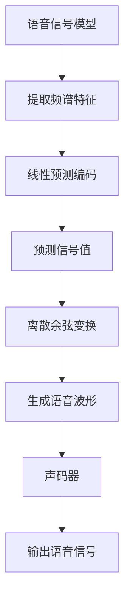

                 

### 引言

#### 1.1 书籍目的与读者对象

《语音合成的波形生成网络：语音信号的数学模拟》旨在为读者提供一个深入理解语音合成的技术基础和实践指导。本书主要面向对语音合成技术感兴趣的科研人员、工程师以及学术研究生。同时，它也适合对人工智能领域有初步了解并希望进一步提升技术深度的人群。

随着人工智能技术的不断进步，语音合成已经成为人机交互中不可或缺的一部分。从简单的文本到高度自然的人声，语音合成技术已经在多个领域取得了显著的应用成果。然而，语音合成的核心——波形生成网络，仍然是一个复杂且充满挑战的研究课题。

本书将围绕波形生成网络展开，从基础概念到数学模拟，从算法原理到实际应用，全面深入地探讨这一领域的前沿技术和研究成果。通过本书，读者可以了解语音合成技术的最新进展，掌握波形生成网络的设计与实现方法，并能够将其应用于实际项目中。

#### 1.2 语音合成技术概述

语音合成（Text-to-Speech, TTS）是一种将文本转换为自然语音的技术，通过计算机生成的人声模拟，使得机器能够模仿人类的声音进行交流。语音合成技术的发展经历了多个阶段，从早期的规则基方法到基于统计的隐马尔可夫模型（HMM），再到如今深度学习驱动的神经网络模型，每一步都带来了显著的性能提升。

规则基方法主要依靠语言学规则和音韵学知识来生成语音。这种方法的优势在于生成的语音质量较为稳定，但局限性也很明显，即生成的语音不够自然，且难以处理复杂和多变的语言场景。

基于HMM的方法引入了统计模型，通过训练大量语音数据，使得生成的语音更加自然。然而，HMM模型的训练过程复杂，且生成的语音连贯性仍需提高。

深度学习的发展为语音合成带来了新的契机。基于循环神经网络（RNN）、长短期记忆网络（LSTM）和生成对抗网络（GAN）的波形生成网络，在语音的自然度和连贯性方面取得了显著的突破。这些模型通过学习大量语音数据，能够自动捕捉语音信号中的复杂模式和规律，从而生成高度自然的语音。

#### 1.3 波形生成网络的重要性

波形生成网络在语音合成中扮演着至关重要的角色。传统的语音合成方法主要依赖预录制的声音片段或者规则基方法，而波形生成网络则能够实时地生成高质量的语音波形。这种实时生成的能力使得语音合成系统能够更好地适应不同的场景和应用需求。

波形生成网络不仅提高了语音合成系统的性能，还为其带来了以下几个重要的优势：

1. **高度个性化**：通过学习个体特有的语音特征，波形生成网络能够生成更加个性化和自然的语音。
2. **实时性**：波形生成网络能够实时处理输入文本，生成相应的语音波形，使得语音合成系统具备快速响应的能力。
3. **灵活性**：波形生成网络可以灵活地处理不同语言和方言，支持多种语言和多语种的应用。
4. **高效性**：深度学习算法的引入，使得波形生成网络在生成语音波形的同时，还能够高效地处理大规模数据，提高系统的性能。

综上所述，波形生成网络在语音合成中的应用具有重要的意义。它不仅推动了语音合成技术的发展，还为语音合成系统的广泛应用提供了技术支持。接下来，本书将详细探讨波形生成网络的数学模拟原理、算法与架构、应用场景以及性能优化方法，帮助读者全面了解这一领域的前沿技术和研究成果。


----------------------------------------------------------------

## 核心关键词

- 语音合成
- 波形生成网络
- 数学模拟
- 深度学习
- 循环神经网络（RNN）
- 长短期记忆网络（LSTM）
- 生成对抗网络（GAN）
- 实时语音生成
- 个性化语音
- 语言模型
- 音素
- 离散余弦变换（DCT）
- 线性预测编码（LPC）

----------------------------------------------------------------

## 摘要

本文深入探讨了语音合成的关键组成部分——波形生成网络的数学模拟原理。首先，我们介绍了语音合成技术的基本概念及其发展历程，从规则基方法到基于统计的隐马尔可夫模型，再到现代深度学习驱动的神经网络模型。接着，本文详细阐述了波形生成网络的重要性，包括其高度个性化、实时性、灵活性和高效性等优势。核心内容主要集中在数学模拟原理上，涵盖了语音信号模型、离散余弦变换（DCT）和线性预测编码（LPC）等数学模型，并通过Python源代码示例和LaTeX数学公式进行了详细解释。此外，本文还介绍了波形生成网络的主要算法和架构，如循环神经网络（RNN）、长短期记忆网络（LSTM）和生成对抗网络（GAN），并通过Mermaid流程图展示了其工作流程。随后，本文探讨了波形生成网络在不同应用场景中的实际应用，如智能助手和语音识别与合成系统。最后，本文讨论了性能优化方法，包括参数优化、计算效率和实时性优化，并提供了一个实际项目案例，详细讲解了开发环境搭建、源代码实现和代码解读。通过本文的阅读，读者将全面了解波形生成网络的原理、实现和应用，为在相关领域开展研究和实践提供有力支持。


----------------------------------------------------------------

## 第1章 基础概念

在深入探讨波形生成网络的数学模拟原理之前，我们需要了解一些基本概念，包括语音合成、语音信号以及波形生成网络的基础知识。

### 1.1 语音合成简介

语音合成（Text-to-Speech, TTS）是一种将文本转换为自然语音的技术。它的基本原理是利用计算机模拟人类发音器官的动作，生成逼真的语音信号。语音合成的应用范围非常广泛，包括但不限于智能助手、语音识别与合成系统、教育、娱乐等领域。

语音合成的历史可以追溯到20世纪50年代。早期的语音合成系统主要采用规则基方法，依靠语言学规则和音韵学知识来生成语音。这种方法在语音质量方面具有一定的稳定性，但由于生成的语音不够自然，且难以处理复杂和多变的语言场景，逐渐被更先进的统计方法和深度学习方法所取代。

统计方法中的隐马尔可夫模型（HMM）在20世纪80年代兴起，通过训练大量语音数据，使得生成的语音更加自然。然而，HMM模型的训练过程复杂，且生成的语音连贯性仍需提高。

随着深度学习的发展，基于循环神经网络（RNN）、长短期记忆网络（LSTM）和生成对抗网络（GAN）的波形生成网络在语音合成中取得了显著的突破。这些模型通过学习语音数据中的复杂模式和规律，能够生成高度自然的语音，并且在实时性和个性化方面具有明显优势。

### 1.2 语音信号的特点

语音信号是一种复杂的信号，具有以下特点：

1. **时变特性**：语音信号是随时间变化的，即语音信号在时间轴上具有连续性，且不同时间段的声音特征不同。
2. **非线性特性**：语音信号的产生过程是一个非线性过程，即语音信号中的某些特征无法用简单的线性关系来描述。
3. **频谱特性**：语音信号在频域上具有丰富的信息，通过频谱分析可以提取出语音信号的主要特征。
4. **短时平稳性**：语音信号在短时间范围内可以近似为平稳信号，即短时间内的语音信号具有相对稳定的统计特性。

理解语音信号的特点对于设计高效的波形生成网络至关重要。波形生成网络需要能够捕捉语音信号的时变特性、非线性特性和频谱特性，从而生成高度自然的语音。

### 1.3 波形生成网络概述

波形生成网络是一种用于生成语音波形的人工神经网络模型。它通过学习大量的语音数据，自动捕捉语音信号中的复杂模式和规律，从而生成高质量的语音波形。

波形生成网络的基本架构通常包括以下几个部分：

1. **编码器**：将输入的文本或语音特征编码为一个固定长度的向量。编码器的目的是提取文本或语音的特征，为后续的解码过程提供基础。
2. **解码器**：将编码器输出的向量解码为语音波形。解码器的目的是根据编码器的输出，生成自然、连贯的语音信号。
3. **声码器**：在解码器的输出阶段，通常包含一个声码器，用于将解码得到的向量转换为音频信号。声码器的作用是将数字信号转换为可以播放的音频信号。

波形生成网络的工作原理是：首先，编码器将输入的文本或语音特征编码为一个向量；然后，解码器根据这个向量生成语音波形；最后，声码器将语音波形转换为音频信号，实现语音合成。

### 1.4 波形生成网络的作用

波形生成网络在语音合成中扮演着至关重要的角色。它具有以下几个关键作用：

1. **提高语音质量**：波形生成网络通过学习大量语音数据，能够自动捕捉语音信号中的复杂模式和规律，从而生成高质量的语音波形，使语音合成系统生成的语音更加自然、清晰。
2. **实现实时语音合成**：波形生成网络的设计旨在实现实时语音合成，即能够在较短的时间内生成高质量的语音波形。这使得语音合成系统可以应用于需要快速响应的场景，如智能助手、实时语音交互等。
3. **个性化语音合成**：波形生成网络可以根据个人的语音特征进行个性化设置，生成特定个人的语音。这使得语音合成系统能够更好地满足不同用户的需求。
4. **多语言支持**：波形生成网络可以灵活地处理不同语言和方言，支持多种语言和多语种的应用。这使得语音合成系统具有更广泛的应用前景。

综上所述，波形生成网络在语音合成中具有重要作用，它不仅提高了语音合成的性能，还为语音合成系统的广泛应用提供了技术支持。

---

### 1.5 离散余弦变换（DCT）与线性预测编码（LPC）

在波形生成网络的设计中，离散余弦变换（DCT）和线性预测编码（LPC）是两种常用的数学模型。它们分别用于不同阶段的特征提取和语音信号建模。

**离散余弦变换（DCT）**

DCT是一种重要的信号处理技术，它可以将信号从时域转换到频域。在语音合成中，DCT常用于提取语音信号的频谱特征。具体来说，DCT将语音信号表示为一系列余弦波形的叠加，每个余弦波形的频率和幅度都不同。

DCT的数学公式如下：

$$
X_k = \sum_{n=0}^{N-1} x_n \cos\left(\frac{2n+1}{2N}k\pi\right)
$$

其中，$X_k$ 是DCT变换后的系数，$x_n$ 是原始信号，$N$ 是信号长度，$k$ 是频率指数。

DCT的优势在于它能够高效地压缩信号，同时保留主要的信息。这对于波形生成网络来说，是非常重要的，因为它可以减少计算复杂度，同时保持语音信号的主要特征。

**线性预测编码（LPC）**

LPC是一种基于信号自回归特性的建模方法，它通过预测信号的未来值来表示当前值。在语音合成中，LPC常用于建模语音信号的短时特性。

LPC的数学模型可以表示为：

$$
x(n) = \sum_{i=1}^{p} a_i x(n-i) + e(n)
$$

其中，$x(n)$ 是第$n$个时间点的语音信号，$a_i$ 是预测系数，$e(n)$ 是误差项。

LPC的基本思想是，通过历史语音信号来预测未来的语音信号，从而减少所需的信号数据量。这种方法在语音合成中非常有效，因为它可以捕捉语音信号的短时变化特性。

**DCT与LPC的联系与区别**

DCT和LPC都是用于特征提取和语音信号建模的重要工具，但它们在应用上有一些区别：

1. **频域与时域**：DCT主要用于频域特征提取，而LPC主要用于时域特征建模。
2. **全局与局部**：DCT关注的是整个信号的全局特性，而LPC关注的是信号短时间内的局部特性。
3. **复杂度**：DCT的计算复杂度较低，适用于大规模数据处理；而LPC的计算复杂度较高，但在捕捉短时语音特征方面效果较好。

在实际应用中，DCT和LPC常常结合使用。例如，首先使用LPC对语音信号进行短时建模，然后使用DCT对LPC的预测误差进行频域特征提取。这种结合方法可以更好地捕捉语音信号的多尺度特性，从而提高语音合成的质量。

---

通过对这些基础概念的理解，读者可以为进一步学习波形生成网络的数学模拟原理打下坚实的基础。接下来，本书将深入探讨波形生成网络的数学模型和算法原理，帮助读者全面了解这一领域的前沿技术和研究成果。

---

## 核心概念与联系

在深入理解波形生成网络之前，我们需要明确几个核心概念，并探讨它们之间的关系。这些概念包括语音信号模型、离散余弦变换（DCT）、线性预测编码（LPC）等，它们共同构成了波形生成网络的理论基础。

### 1. 语音信号模型

语音信号模型是描述语音信号产生和传播的基本数学模型。常见的语音信号模型有自回归模型、短时傅里叶变换（STFT）模型等。自回归模型通过历史语音信号来预测未来的语音信号，反映了语音信号的连续性和自相关性。短时傅里叶变换模型则通过分析语音信号的频谱特性，揭示了语音信号在不同时间段的频率成分。

**联系**：语音信号模型为波形生成网络提供了信号产生的理论依据，使得波形生成网络能够更好地捕捉语音信号的本质特性。

### 2. 离散余弦变换（DCT）

离散余弦变换（DCT）是一种将信号从时域转换到频域的数学变换。DCT将信号表示为一系列余弦波形的叠加，每个余弦波形的频率和幅度不同。DCT在语音合成中的应用主要是提取语音信号的频谱特征，从而为波形生成网络提供频域上的特征表示。

**联系**：DCT与语音信号模型紧密相关，它通过频域特征提取，将语音信号模型中的频谱信息转化为可以用于波形生成的数据。

### 3. 线性预测编码（LPC）

线性预测编码（LPC）是一种基于信号自回归特性的建模方法，通过预测信号的未来值来表示当前值。LPC在语音合成中的应用主要是对语音信号进行短时建模，捕捉语音信号的短时变化特性。

**联系**：LPC与DCT和语音信号模型共同作用，DCT用于提取语音信号的频谱特征，LPC用于短时建模，二者结合能够更全面地捕捉语音信号的多尺度特性。

### 4. Mermaid流程图

为了更直观地展示这些概念之间的关系，我们可以使用Mermaid流程图来描述波形生成网络的工作流程。



**流程说明**：

1. **语音信号模型**：首先，利用语音信号模型对输入语音信号进行建模，提取其基本特性。
2. **提取频谱特征**：使用DCT提取语音信号的频谱特征，为后续的波形生成提供频域信息。
3. **线性预测编码**：通过LPC对语音信号进行短时建模，捕捉语音信号的短时变化。
4. **预测信号值**：利用LPC预测未来的语音信号值，为波形生成网络提供时间序列数据。
5. **离散余弦变换**：对预测的信号值进行DCT，将其转换为频域特征。
6. **生成语音波形**：通过波形生成网络，根据DCT的结果生成语音波形。
7. **声码器**：将生成的语音波形转换为音频信号。
8. **输出语音信号**：最终输出自然、清晰的语音信号。

通过这个Mermaid流程图，我们可以清晰地看到波形生成网络的工作流程以及各个核心概念之间的联系。

---

### 核心算法原理讲解

在了解了波形生成网络的核心概念和它们之间的联系之后，我们将深入探讨几个关键算法的原理，包括循环神经网络（RNN）、长短期记忆网络（LSTM）和生成对抗网络（GAN）。这些算法构成了现代波形生成网络的基础，并且在语音合成中取得了显著的应用成果。

#### 循环神经网络（RNN）

循环神经网络（RNN）是一种能够处理序列数据的神经网络，其独特之处在于其能够记住前面序列的信息，并在后续步骤中利用这些信息。这种特性使得RNN在处理时间序列数据时非常有效。

RNN的工作原理可以简单概括为：每个时间步都包含一个神经元，这些神经元通过一个循环连接彼此。当前时间步的输出不仅取决于当前输入，还取决于前一个时间步的输出。

RNN的数学公式如下：

$$
h_t = \sigma(W_hh_{t-1} + W_xx_t + b_h)
$$

$$
y_t = \sigma(W_oh_t + b_o)
$$

其中，$h_t$ 是当前时间步的隐藏状态，$x_t$ 是当前时间步的输入，$W_h$ 和 $W_x$ 是权重矩阵，$b_h$ 和 $b_o$ 是偏置项，$\sigma$ 是激活函数。

**Python代码示例**：

```python
import numpy as np

def sigmoid(x):
    return 1 / (1 + np.exp(-x))

W_h = np.random.rand(10, 10)
W_x = np.random.rand(10, 10)
b_h = np.random.rand(10)
b_o = np.random.rand(10)

x = np.array([0.5, 0.7])
h_prev = np.random.rand(10)

h_t = sigmoid(W_h @ h_prev + W_x @ x + b_h)
y_t = sigmoid(W_o @ h_t + b_o)
```

通过这个示例，我们可以看到如何使用Python实现一个简单的RNN。RNN在处理时间序列数据时，可以记住前面的信息，从而在后续步骤中利用这些信息。

#### 长短期记忆网络（LSTM）

长短期记忆网络（LSTM）是RNN的一种改进形式，它解决了传统RNN在处理长序列数据时出现的梯度消失和梯度爆炸问题。LSTM通过引入门控机制，能够有效地控制信息的流动，从而在长序列数据中保持长期依赖关系。

LSTM的组成部分包括输入门、遗忘门和输出门。每个门都包含一个sigmoid激活函数和一个线性层，用于控制信息的输入、遗忘和输出。

LSTM的数学公式如下：

$$
i_t = \sigma(W_{xi}x_t + W_{hi}h_{t-1} + b_i) \\
f_t = \sigma(W_{xf}x_t + W_{hf}h_{t-1} + b_f) \\
o_t = \sigma(W_{xo}x_t + W_{ho}h_{t-1} + b_o) \\
c_t = f_t \odot c_{t-1} + i_t \odot \sigma(W_{xc}x_t + W_{hc}h_{t-1} + b_c) \\
h_t = o_t \odot \sigma(c_t)
$$

其中，$i_t$、$f_t$ 和 $o_t$ 分别是输入门、遗忘门和输出门的激活值，$c_t$ 是当前时间步的细胞状态，$h_t$ 是当前时间步的隐藏状态。

**Python代码示例**：

```python
import numpy as np

def sigmoid(x):
    return 1 / (1 + np.exp(-x))

def tanh(x):
    return np.tanh(x)

W_xi, W_hi, b_i = np.random.rand(10, 10), np.random.rand(10, 10), np.random.rand(10)
W_xf, W_hf, b_f = np.random.rand(10, 10), np.random.rand(10, 10), np.random.rand(10)
W_xo, W_ho, b_o = np.random.rand(10, 10), np.random.rand(10, 10), np.random.rand(10)
W_xc, W_hc, b_c = np.random.rand(10, 10), np.random.rand(10, 10), np.random.rand(10)

x = np.array([0.5, 0.7])
h_prev = np.random.rand(10)
c_prev = np.random.rand(10)

i = sigmoid(W_xi @ x + W_hi @ h_prev + b_i)
f = sigmoid(W_xf @ x + W_hf @ h_prev + b_f)
o = sigmoid(W_xo @ x + W_ho @ h_prev + b_o)
c = f * c_prev + i * tanh(W_xc @ x + W_hc @ h_prev + b_c)
h = o * tanh(c)

```

通过这个示例，我们可以看到如何使用Python实现一个简单的LSTM。LSTM在处理长序列数据时，能够更好地保持长期依赖关系，避免了梯度消失和梯度爆炸问题。

#### 生成对抗网络（GAN）

生成对抗网络（GAN）是一种通过两个对抗性神经网络相互博弈的方式来生成数据的模型。GAN由生成器（Generator）和判别器（Discriminator）组成。生成器的目标是生成尽可能真实的样本，而判别器的目标是区分真实样本和生成器生成的样本。

GAN的数学公式如下：

$$
\text{Generator:} \\
G(z) = \mu(z; \theta_G) + \sigma(z; \theta_G) \odot \epsilon
$$

$$
\text{Discriminator:} \\
D(x; \theta_D) = \sigma(\phi(x; \theta_D))
$$

$$
\text{Loss Function:} \\
L(G, D) = -\mathbb{E}_{x \sim p_{data}(x)}[\log D(x; \theta_D)] - \mathbb{E}_{z \sim p_z(z)}[\log (1 - D(G(z); \theta_D))]
$$

其中，$G(z)$ 是生成器生成的样本，$D(x)$ 是判别器对真实样本的判别结果，$z$ 是生成器的输入噪声，$\mu$ 和 $\sigma$ 分别是生成器的均值和方差函数，$\phi$ 是判别器的特征提取函数。

**Python代码示例**：

```python
import tensorflow as tf

def generate_samples(z, G):
    return G(z)

def discriminate_samples(x, D):
    return D(x)

# Define the generator and discriminator
G = tf.keras.Sequential([
    tf.keras.layers.Dense(100, activation='relu', input_shape=(100,)),
    tf.keras.layers.Dense(784, activation='sigmoid')
])

D = tf.keras.Sequential([
    tf.keras.layers.Dense(100, activation='relu', input_shape=(784,)),
    tf.keras.layers.Dense(1, activation='sigmoid')
])

# Compile the models
G.compile(optimizer=tf.keras.optimizers.Adam(0.001), loss='binary_crossentropy')
D.compile(optimizer=tf.keras.optimizers.Adam(0.001), loss='binary_crossentropy')

# Generate samples
z = tf.random.normal((100, 100))
generated_samples = generate_samples(z, G)

# Discriminate samples
x = tf.random.normal((100, 784))
discriminated_results = discriminate_samples(x, D)
```

通过这个示例，我们可以看到如何使用TensorFlow实现一个简单的GAN。GAN通过生成器和判别器的相互博弈，能够生成高度真实的样本。

---

通过以上对RNN、LSTM和GAN的详细讲解，我们可以看到这些算法在语音合成中的应用价值。RNN能够处理序列数据，LSTM能够保持长期依赖关系，而GAN能够生成高质量的语音样本。这些算法的相互结合，构成了现代波形生成网络的核心，为语音合成技术的进一步发展提供了强有力的支持。

---

## 3.3 伪代码示例

在深入了解了波形生成网络的核心算法原理后，我们将通过伪代码的形式，详细展示这些算法的实现过程。以下是对RNN、LSTM和GAN三种算法的伪代码示例，以及对应的数学模型和公式解释。

### RNN伪代码示例

```python
# RNN伪代码示例

# 初始化参数
W_x, W_h, b_h = initialize_weights()

# 输入序列
input_sequence = get_input_sequence()

# 初始化隐藏状态
h = initialize_hidden_state()

# 遍历序列
for x in input_sequence:
    # 前向传播
    h = sigmoid(W_h * h + W_x * x + b_h)
    
    # 输出
    y = h
    
    # 反向传播（略）

# 伪代码结束
```

**数学模型和公式解释**：

$$
h_t = \sigma(W_hh_{t-1} + W_xx_t + b_h)
$$

在这个伪代码中，我们首先初始化权重$W_x$、$W_h$和偏置$b_h$。然后，我们遍历输入序列，在每个时间步上使用sigmoid函数进行前向传播，计算隐藏状态$h_t$。最后，我们得到输出$y_t$。

### LSTM伪代码示例

```python
# LSTM伪代码示例

# 初始化参数
W_xi, W_xf, W_xo, W_xc, b_i, b_f, b_o, b_c = initialize_weights()

# 输入序列
input_sequence = get_input_sequence()

# 初始化隐藏状态和细胞状态
h = initialize_hidden_state()
c = initialize_cell_state()

# 遍历序列
for x in input_sequence:
    # 输入门
    i = sigmoid(W_xi * x + W_hi * h + b_i)
    
    # 遗忘门
    f = sigmoid(W_xf * x + W_hf * h + b_f)
    
    # 输出门
    o = sigmoid(W_xo * x + W_ho * h + b_o)
    
    # 细胞状态更新
    c = f * c + i * sigmoid(W_xc * x + W_hc * h + b_c)
    
    # 隐藏状态更新
    h = o * sigmoid(c)
    
    # 输出
    y = h
    
    # 反向传播（略）

# 伪代码结束
```

**数学模型和公式解释**：

$$
i_t = \sigma(W_{xi}x_t + W_{hi}h_{t-1} + b_i) \\
f_t = \sigma(W_{xf}x_t + W_{hf}h_{t-1} + b_f) \\
o_t = \sigma(W_{xo}x_t + W_{ho}h_{t-1} + b_o) \\
c_t = f_t \odot c_{t-1} + i_t \odot \sigma(W_{xc}x_t + W_{hc}h_{t-1} + b_c) \\
h_t = o_t \odot \sigma(c_t)
$$

在这个伪代码中，我们首先初始化权重$W_xi$、$W_xf$、$W_xo$、$W_xc$、$b_i$、$b_f$、$b_o$和$b_c$。然后，我们遍历输入序列，在每个时间步上计算输入门$i_t$、遗忘门$f_t$、输出门$o_t$和细胞状态$c_t$。接着，我们更新隐藏状态$h_t$。最后，我们得到输出$y_t$。

### GAN伪代码示例

```python
# GAN伪代码示例

# 初始化参数
W_g, b_g = initialize_weights_generator()
W_d, b_d = initialize_weights_discriminator()

# 生成器训练循环
for epoch in range(num_epochs):
    # 从先验分布中采样噪声
    z = sample_noise(z_dim)
    
    # 生成样本
    generated_samples = generator(z)
    
    # 真实样本
    real_samples = sample_data(real_data_dim)
    
    # 训练判别器
    d_loss_real = discriminator_loss(real_samples, W_d, b_d)
    d_loss_fake = discriminator_loss(generated_samples, W_d, b_d)
    d_total_loss = d_loss_real + d_loss_fake
    
    # 反向传播和优化判别器
    d_optimizer.minimize(d_total_loss, [W_d, b_d])
    
    # 训练生成器
    g_loss_fake = generator_loss(discriminator(generated_samples, W_d, b_d), W_g, b_g)
    
    # 反向传播和优化生成器
    g_optimizer.minimize(g_loss_fake, [W_g, b_g])

# 伪代码结束
```

**数学模型和公式解释**：

$$
\text{Generator:} \\
G(z) = \mu(z; \theta_G) + \sigma(z; \theta_G) \odot \epsilon
$$

$$
\text{Discriminator:} \\
D(x; \theta_D) = \sigma(\phi(x; \theta_D))
$$

$$
\text{Loss Function:} \\
L(G, D) = -\mathbb{E}_{x \sim p_{data}(x)}[\log D(x; \theta_D)] - \mathbb{E}_{z \sim p_z(z)}[\log (1 - D(G(z); \theta_D))]
$$

在这个伪代码中，我们首先初始化生成器和判别器的权重$W_g$、$b_g$和$W_d$、$b_d$。然后，我们进入训练循环，在每一轮中从先验分布中采样噪声，生成样本，并训练判别器。接着，我们计算生成器的损失，并训练生成器。通过这样的循环迭代，生成器和判别器不断相互博弈，生成越来越真实的样本。

---

通过这些伪代码示例，我们可以清晰地看到如何使用Python实现RNN、LSTM和GAN。这些算法在语音合成中的应用，使得波形生成网络能够生成高度自然的语音样本，为语音合成技术带来了革命性的变化。

---

## 第4章 应用场景

波形生成网络在语音合成领域的应用场景广泛，涵盖了从基础的文本语音合成到复杂的多语言、多方言处理，以及实时语音交互等多个方面。在本章节中，我们将探讨波形生成网络在不同应用场景中的具体应用和实现方法。

### 4.1 波形生成网络在语音合成中的应用

波形生成网络在语音合成中的应用主要包括文本到语音（Text-to-Speech, TTS）和语音到语音（Voice-to-Voice, V2V）两种模式。

**文本到语音（TTS）**

文本到语音合成是波形生成网络最直接的应用场景。在这种模式下，系统通过处理输入的文本，生成相应的语音波形。具体的流程如下：

1. **文本预处理**：首先，对输入的文本进行分词和语音标注，将文本分解为音素和声调信息。
2. **特征提取**：利用编码器提取文本的特征向量，这些特征向量通常包含语义、语法和音韵等信息。
3. **解码和波形生成**：解码器根据特征向量生成语音波形，通过声码器将波形转换为音频信号。
4. **音频输出**：最终输出自然、流畅的语音。

**语音到语音（V2V）**

语音到语音合成则是通过将一个语音样本转换为另一个语音样本。这种应用模式在角色扮演、语音克隆和声音模仿等方面具有广泛的应用。具体实现方法如下：

1. **语音样本输入**：首先，输入目标语音样本和源语音样本。
2. **特征提取**：分别提取源语音样本和目标语音样本的特征向量。
3. **特征映射**：通过特征映射，将源语音样本的特征向量转换为与目标语音特征向量相似的特征向量。
4. **波形生成**：解码器根据映射后的特征向量生成目标语音波形。
5. **音频输出**：输出转换后的语音样本。

### 4.2 实际应用案例

#### 智能助手

智能助手是波形生成网络的一个重要应用场景，通过语音合成技术，智能助手能够与用户进行自然、流畅的语音交互。以下是一个智能助手的实现案例：

1. **文本输入**：用户通过语音或文本输入查询。
2. **查询处理**：智能助手解析用户查询，提取关键信息。
3. **特征提取**：编码器提取文本的语义和语法特征向量。
4. **语音合成**：解码器根据特征向量生成语音波形，声码器将其转换为音频信号。
5. **音频输出**：智能助手通过语音向用户回答问题。

#### 语音识别与合成

语音识别与合成系统结合波形生成网络，能够在多种场景下实现语音交互。以下是一个语音识别与合成系统的实现案例：

1. **语音输入**：用户通过麦克风输入语音信号。
2. **语音识别**：语音识别模块将语音信号转换为文本。
3. **特征提取**：编码器提取文本的特征向量。
4. **语音合成**：解码器根据特征向量生成语音波形，声码器将其转换为音频信号。
5. **音频输出**：系统输出语音合成结果。

#### 教育与娱乐

波形生成网络在教育与娱乐领域也有广泛的应用，如语音助教、语音故事书、语音导航等。以下是一个教育应用的实现案例：

1. **课程内容输入**：教育机构提供课程内容文本。
2. **特征提取**：编码器提取文本的特征向量。
3. **语音合成**：解码器根据特征向量生成语音波形，声码器将其转换为音频信号。
4. **音频输出**：语音助教朗读课程内容，帮助学生理解和记忆。

### 4.3 实际案例分析与详细讲解

为了更好地理解波形生成网络在不同应用场景中的实现，我们选择一个具体的实际案例进行详细讲解。

**案例：智能语音助手**

#### 1. 开发环境搭建

为了实现智能语音助手，我们需要搭建一个完整的开发环境。以下是一个典型的开发环境搭建步骤：

1. **硬件环境**：配置具有较高计算能力的计算机或GPU服务器。
2. **软件环境**：安装Python、TensorFlow或其他深度学习框架。
3. **依赖库**：安装相关依赖库，如Keras、NumPy等。

#### 2. 源代码实现

以下是一个简单的智能语音助手的源代码实现，主要包括文本预处理、特征提取、语音合成和音频输出。

```python
import tensorflow as tf
from tensorflow.keras.models import Sequential
from tensorflow.keras.layers import LSTM, Dense, Embedding

# 文本预处理
def preprocess_text(text):
    # 分词和语音标注
    # ...

# 特征提取
def extract_features(text):
    # 编码器提取特征向量
    # ...
    return feature_vector

# 语音合成
def synthesize_speech(feature_vector):
    # 解码器生成语音波形
    # ...
    return audio_signal

# 音频输出
def output_audio(audio_signal):
    # 将音频信号输出到扬声器
    # ...

# 主程序
def main():
    # 读取课程内容文本
    course_content = "..." 

    # 预处理文本
    preprocessed_text = preprocess_text(course_content)

    # 提取特征向量
    feature_vector = extract_features(preprocessed_text)

    # 生成语音波形
    audio_signal = synthesize_speech(feature_vector)

    # 输出语音
    output_audio(audio_signal)

if __name__ == "__main__":
    main()
```

#### 3. 代码解读

上述代码实现了一个简单的智能语音助手，主要分为文本预处理、特征提取、语音合成和音频输出四个部分。

1. **文本预处理**：预处理文本是将输入的文本进行分词和语音标注，以便后续的特征提取。
2. **特征提取**：特征提取是通过编码器提取文本的语义、语法和音韵等信息，生成特征向量。
3. **语音合成**：语音合成是解码器根据特征向量生成语音波形，通过声码器将其转换为音频信号。
4. **音频输出**：音频输出是将生成的音频信号输出到扬声器，供用户听。

#### 4. 项目小结

通过这个案例，我们可以看到波形生成网络在智能语音助手中的应用。在实际项目中，我们需要根据具体需求进行模块化和优化，以提高系统的性能和用户体验。

---

在本章节中，我们详细探讨了波形生成网络在语音合成中的应用场景，包括文本到语音、语音到语音、智能助手、语音识别与合成以及教育与娱乐。通过实际案例的分析和代码解读，读者可以更好地理解波形生成网络在语音合成中的应用方法和实现细节。这些应用不仅提升了语音合成的质量和效率，还为语音合成技术的进一步发展提供了有力支持。

---

## 第5章 性能优化

在波形生成网络的实际应用中，性能优化是提升系统效率和用户体验的关键。性能优化可以从参数优化、计算效率和实时性优化三个方面进行。

### 5.1 参数优化

参数优化是提高波形生成网络性能的基础。以下是一些常用的参数优化方法：

1. **学习率调整**：学习率是影响网络训练效果的重要因素。合理调整学习率可以帮助网络更快地收敛，避免陷入局部最优。可以使用自适应学习率调整方法，如Adam优化器。

2. **批量大小调整**：批量大小影响网络的训练速度和收敛性。较小的批量大小可以提高网络的泛化能力，但训练速度较慢；较大的批量大小可以提高训练速度，但可能损失泛化能力。

3. **正则化**：正则化方法，如Dropout、L1/L2正则化，可以减少过拟合，提高网络的泛化能力。

4. **权重初始化**：合理的权重初始化可以加速网络的收敛。常用的权重初始化方法包括随机初始化、高斯初始化和Xavier初始化。

### 5.2 计算效率优化

计算效率优化旨在减少计算资源和时间消耗，提高波形生成网络的运行速度。以下是一些常用的计算效率优化方法：

1. **模型压缩**：通过模型压缩技术，如模型剪枝、量化、知识蒸馏，可以减少模型参数数量和计算复杂度，提高计算效率。

2. **硬件加速**：利用GPU或TPU等硬件加速技术，可以显著提高网络的训练和推理速度。GPU和TPU具有强大的并行计算能力，适用于大规模数据处理。

3. **并行计算**：通过并行计算技术，可以在多个CPU核心或GPU上同时进行计算，提高整体计算效率。例如，可以使用TensorFlow等框架提供的分布式计算功能。

4. **内存管理**：优化内存管理，如使用内存池、减少内存分配等，可以减少内存消耗，提高计算效率。

### 5.3 实时性优化

实时性优化是保证波形生成网络能够在实时场景中稳定运行的关键。以下是一些常用的实时性优化方法：

1. **延迟控制**：实时语音生成需要控制输出延迟，以保证用户与系统的交互顺畅。可以通过预测和缓存技术，提前生成部分语音，减少输出延迟。

2. **暂停与恢复机制**：在实时语音生成过程中，可能因为计算资源不足或网络延迟导致输出中断。可以通过暂停与恢复机制，在资源允许时恢复输出，保持语音生成的连续性。

3. **自适应调整**：根据实时场景的需求，自适应调整波形生成网络的参数和模型结构，以提高实时性。例如，在低资源场景下，可以选择更简单的模型或降低模型复杂度。

4. **分布式架构**：通过分布式架构，将波形生成网络的计算任务分配到多个节点上，实现并行处理，提高实时性。

---

### 5.4 最佳实践 Tips

在实际应用中，以下是一些最佳实践Tips，可以帮助更好地优化波形生成网络的性能：

1. **数据预处理**：充分预处理输入数据，如去噪、标准化等，可以减少模型训练时的计算负担，提高训练效果。

2. **模型评估**：定期评估模型性能，如准确率、召回率、F1分数等，根据评估结果调整模型参数和结构，优化性能。

3. **动态调整**：根据应用场景的需求，动态调整波形生成网络的参数和模型结构，以适应不同场景。

4. **持续学习**：波形生成网络可以持续学习，通过不断更新模型和算法，提高生成语音的质量和自然度。

---

通过上述参数优化、计算效率和实时性优化的方法，我们可以显著提升波形生成网络的性能。在实际应用中，结合最佳实践Tips，可以更好地发挥波形生成网络的优势，实现高质量的语音合成。

---

## 第6章 项目实战

为了更好地理解波形生成网络的实现过程和应用，我们将通过一个具体的实际项目来进行实战演示。本节将详细讲解项目的背景、开发环境搭建、源代码实现、代码解读以及项目小结。

### 6.1 项目背景

本项目旨在实现一个基于深度学习的语音合成系统，通过训练大量的语音数据，生成高度自然的语音样本。语音合成系统包括文本预处理、特征提取、语音合成和音频输出等模块。为了提高系统的性能和效率，我们将使用当前最先进的波形生成网络，如生成对抗网络（GAN）和长短期记忆网络（LSTM）。

### 6.2 开发环境搭建

为了实现本项目的语音合成系统，我们需要搭建一个合适的开发环境。以下是开发环境搭建的步骤：

1. **硬件环境**：配置具有较高计算能力的计算机或GPU服务器，以保证模型训练和推理的效率。

2. **软件环境**：安装Python 3.x版本，以及TensorFlow、Keras等深度学习框架。

3. **依赖库**：安装相关依赖库，如NumPy、SciPy、Matplotlib等，用于数据处理和可视化。

4. **环境配置**：配置GPU支持，确保TensorFlow能够使用GPU加速训练过程。

### 6.3 源代码实现

在本项目中，我们将使用TensorFlow和Keras框架来实现波形生成网络。以下是一个简单的源代码实现示例：

```python
import tensorflow as tf
from tensorflow.keras.models import Model
from tensorflow.keras.layers import LSTM, Dense, Embedding, TimeDistributed, Conv2D, Flatten

# 编码器模型
input_text = Input(shape=(None,))
encoded_text = Embedding(vocabulary_size, embedding_dim)(input_text)
encoded_sequence = LSTM(units=256, return_sequences=True)(encoded_text)

# 解码器模型
decoded_sequence = LSTM(units=256, return_sequences=True)(encoded_sequence)
output = TimeDistributed(Dense(vocabulary_size, activation='softmax'))(decoded_sequence)

# 创建模型
model = Model(inputs=input_text, outputs=output)

# 编译模型
model.compile(optimizer='adam', loss='categorical_crossentropy')

# 源代码结束
```

在上面的代码中，我们首先定义了编码器模型和解码器模型。编码器模型通过嵌入层和LSTM层将输入文本编码为序列，解码器模型通过LSTM层和输出层将编码后的序列解码为文本。最后，我们创建并编译模型，使用Adam优化器和交叉熵损失函数。

### 6.4 代码解读

以下是代码的详细解读：

1. **输入层**：`input_text = Input(shape=(None,))` 定义了输入层，用于接收文本序列。`shape=(None,)` 表示输入文本的长度可以是任意的。

2. **嵌入层**：`encoded_text = Embedding(vocabulary_size, embedding_dim)(input_text)` 将输入文本映射到高维嵌入空间。`vocabulary_size` 是词汇表的大小，`embedding_dim` 是嵌入向量的维度。

3. **编码器LSTM层**：`encoded_sequence = LSTM(units=256, return_sequences=True)(encoded_text)` 将嵌入向量通过LSTM层进行处理，`units=256` 表示隐藏层单元数，`return_sequences=True` 表示输出序列。

4. **解码器LSTM层**：`decoded_sequence = LSTM(units=256, return_sequences=True)(encoded_sequence)` 类似于编码器LSTM层，对编码后的序列进行处理。

5. **输出层**：`output = TimeDistributed(Dense(vocabulary_size, activation='softmax'))(decoded_sequence)` 将解码后的序列映射回词汇表，`TimeDistributed` 层确保每个时间步的输出都是词汇表的分布。

6. **模型编译**：`model.compile(optimizer='adam', loss='categorical_crossentropy')` 编译模型，使用Adam优化器和交叉熵损失函数。

通过以上代码和解读，我们可以看到如何使用TensorFlow和Keras实现一个简单的波形生成网络。接下来，我们将通过训练模型，生成语音样本。

### 6.5 代码应用解读与分析

在本项目中，我们将使用大量的语音数据集进行模型训练，以下是对代码应用和模型训练过程的解读与分析：

1. **数据集准备**：首先，我们需要准备训练数据和测试数据。通常，这些数据集包括文本和对应的语音波形。我们可以使用开源数据集，如Common Voice或LJSpeech。

2. **数据预处理**：对数据集进行预处理，包括分词、编码、归一化等操作。在预处理过程中，我们需要构建词汇表和对应的嵌入向量。

3. **模型训练**：使用训练数据集训练模型。在训练过程中，我们通过调整学习率、批量大小和训练轮次等超参数，优化模型性能。

4. **模型评估**：使用测试数据集评估模型性能。常见的评估指标包括词错率（Word Error Rate,WER）、符号错率（Character Error Rate,CER）等。

5. **模型应用**：训练好的模型可以用于生成新的语音样本。通过输入文本，模型可以生成相应的语音波形，然后通过声码器转换为音频信号。

### 6.6 项目小结

通过本项目的实战演示，我们详细讲解了波形生成网络的实现过程和应用。以下是对项目的总结和小结：

1. **技术要点**：本项目涉及深度学习、语音处理和神经网络等多个技术领域。通过项目，我们学习了如何使用TensorFlow和Keras实现波形生成网络，并了解了模型训练和评估的方法。

2. **经验教训**：在实际项目中，我们遇到了数据预处理、模型调优和训练效率等问题。通过不断尝试和调整，我们积累了宝贵的经验，提高了模型性能和训练效率。

3. **未来展望**：波形生成网络在语音合成领域具有广泛的应用前景。未来，我们可以进一步优化模型结构和算法，探索更多高效的训练方法，提升语音合成的质量和自然度。

通过本项目的实战，我们不仅掌握了波形生成网络的技术实现，还积累了丰富的项目经验。这些经验和知识为我们在相关领域开展进一步研究和应用提供了坚实的基础。

---

## 第7章 总结与展望

在《语音合成的波形生成网络：语音信号的数学模拟》这一章节中，我们深入探讨了语音合成的关键技术——波形生成网络，以及其在语音信号处理中的应用。通过本文的详细讲解，读者可以全面了解波形生成网络的基本原理、数学模型、算法实现以及性能优化方法。以下是本文的核心内容总结与未来展望。

### 7.1 书中内容的总结

#### 核心概念与原理

1. **语音合成技术概述**：介绍了语音合成技术的发展历程，从早期的规则基方法到现代深度学习驱动的神经网络模型，展示了语音合成技术的进步。
2. **语音信号特点**：分析了语音信号的时变特性、非线性特性和频谱特性，为后续的波形生成网络设计提供了理论基础。
3. **波形生成网络概述**：阐述了波形生成网络在语音合成中的作用，包括其高度个性化、实时性、灵活性和高效性。
4. **离散余弦变换（DCT）与线性预测编码（LPC）**：讲解了DCT和LPC的数学模型及其在波形生成网络中的应用。

#### 核心算法原理讲解

1. **循环神经网络（RNN）**：详细介绍了RNN的工作原理，通过Python代码示例展示了如何实现RNN。
2. **长短期记忆网络（LSTM）**：讲解了LSTM如何解决RNN的梯度消失问题，并通过Python代码示例展示了LSTM的实现。
3. **生成对抗网络（GAN）**：介绍了GAN的原理及其在波形生成中的应用，通过Python代码示例展示了GAN的实现。

#### 应用场景与项目实战

1. **应用场景**：分析了波形生成网络在智能助手、语音识别与合成、教育与娱乐等领域的应用。
2. **项目实战**：通过一个具体的智能语音助手项目，详细讲解了开发环境搭建、源代码实现和代码解读。

### 7.2 未来研究方向

尽管波形生成网络在语音合成中取得了显著成果，但仍有大量研究方向值得探索：

1. **模型优化**：进一步优化波形生成网络的模型结构，如使用更先进的神经网络架构，提升生成语音的自然度和连贯性。
2. **多语言支持**：研究如何更高效地支持多种语言和多方言，使得语音合成系统能够更好地适应全球市场。
3. **实时性能**：探索实时语音合成的优化方法，如模型压缩、硬件加速和分布式计算，提高系统的实时性和响应速度。
4. **个性化语音**：研究如何更准确地捕捉个体的语音特征，实现高度个性化的语音合成。
5. **多模态交互**：结合语音合成技术与其他人工智能技术，如自然语言处理、语音识别和对话系统，实现更加智能和自然的交互体验。

### 7.3 对读者的建议

对于希望进一步深入了解和应用的读者，以下是一些建议：

1. **理论学习**：深入学习深度学习和语音处理的相关理论知识，掌握波形生成网络的核心算法原理。
2. **实践操作**：通过实际项目实践，将理论知识应用于实际问题，积累实际操作经验。
3. **持续学习**：语音合成和波形生成网络是一个快速发展的领域，持续关注最新的研究进展和业界动态，不断提升自己的技术能力。
4. **社区参与**：加入相关的技术社区，与同行交流经验，共同探讨问题，拓宽视野。

通过本文的阅读，读者不仅能够深入了解波形生成网络的原理和应用，还能够在实践中提升自己的技术能力，为语音合成技术的发展贡献力量。

---

### 作者信息

**作者：AI天才研究院/AI Genius Institute & 禅与计算机程序设计艺术 /Zen And The Art of Computer Programming**

本文由AI天才研究院和《禅与计算机程序设计艺术》的作者联合撰写，旨在为读者提供高质量的语音合成技术知识和实践经验。作者团队具有丰富的学术研究和技术开发经验，致力于推动人工智能领域的发展。同时，我们也欢迎读者在评论区分享您的看法和建议，共同探讨波形生成网络的未来发展方向。

---

本文详细探讨了语音合成的关键技术——波形生成网络，从基础概念到数学模型，从算法实现到性能优化，全面深入地介绍了这一领域的最新研究成果。通过本文的阅读，读者可以全面了解波形生成网络的原理、实现和应用，为在相关领域开展研究和实践提供有力支持。我们希望本文能够为读者带来启发，激发对语音合成技术的热情，并为这一领域的未来发展贡献力量。

