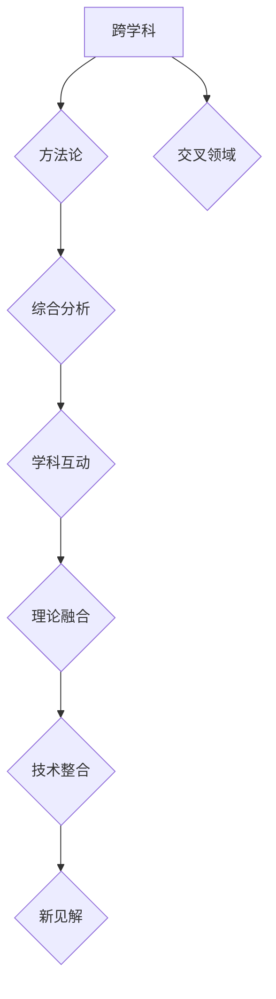

                 

### 引言：复杂世界的呼唤

在当今迅速变化的世界中，复杂性已成为一种普遍特征，渗透到社会、经济、环境等各个领域。传统单一学科的研究方法在面对这些复杂问题时显得力不从心，难以提供全面的解决方案。跨学科研究方法因此成为了解析世界复杂性的新途径。本文旨在探讨跨学科研究方法的创新，揭示其在多维度解析世界复杂性中的重要性。

跨学科研究方法强调不同学科之间的交叉与融合，通过综合多学科的理论、工具和方法，从多个角度对复杂问题进行深入分析。这不仅有助于揭示问题的多维度特征，还能发现传统方法难以察觉的关联和规律。例如，社会科学家与自然科学家合作，利用社会科学的实证方法和自然科学的实验设计，可以更全面地研究环境变化对社会系统的影响。

本文将围绕以下几个核心问题展开讨论：首先，我们将定义跨学科研究方法，阐述其在现代研究中的背景和意义。其次，我们将探讨世界复杂性的多维特征，并介绍如何从不同维度解析这些复杂性。接着，我们将详细讲解跨学科研究中的核心算法原理，包括网络分析、机器学习和复杂系统理论等。然后，我们将介绍相关的数学模型和公式，并结合Python源代码进行详细阐述。随后，我们将通过实际案例展示跨学科研究方法的应用，并提供详细的项目解析。最后，我们将总结文章的主要观点，并展望跨学科研究方法的未来发展方向。

通过这一系列讨论，我们希望读者能够对跨学科研究方法有一个全面而深入的理解，并认识到其在应对现代社会复杂性中的巨大潜力。跨学科研究不仅是一种学术趋势，更是解决实际问题的有效途径。让我们共同探索这一创新领域，开启多维度解析世界复杂性之旅。

### 关键词

跨学科研究方法、世界复杂性、多维特征、网络分析、机器学习、复杂系统理论、数学模型、Python源代码、实际案例、未来展望。

### 摘要

本文旨在探讨跨学科研究方法在多维度解析世界复杂性中的创新与应用。随着世界复杂性的日益增加，传统单一学科的研究方法已难以应对。跨学科研究方法通过综合不同学科的理论和工具，提供了一种全面解析复杂问题的途径。本文首先定义了跨学科研究方法，并阐述了其在现代研究中的背景和意义。接着，本文探讨了世界复杂性的多维特征，并介绍了如何从不同维度进行解析。随后，本文详细讲解了核心算法原理，包括网络分析、机器学习和复杂系统理论，并使用Python源代码进行了说明。此外，本文还通过实际案例展示了跨学科研究方法的应用，并提供了详细的项目解析。最后，本文总结了主要观点，并展望了跨学科研究方法的未来发展方向。本文旨在为读者提供全面而深入的理解，并启发其在解决复杂问题时的创新思维。

### 背景介绍

在探讨跨学科研究方法之前，我们有必要首先了解其产生的背景。随着全球化和信息技术的快速发展，社会、经济和环境等各个领域中的复杂性日益增加。单一学科的研究方法往往局限于自身的理论框架和工具集，难以全面解析这些复杂问题。因此，跨学科研究方法应运而生，成为应对复杂性的新途径。

跨学科研究方法的出现可以追溯到20世纪初，当时科学家们开始意识到，许多重大问题需要多个学科的合作才能解决。例如，20世纪初的量子力学发展过程中，物理学家、数学家、化学家和哲学家等不同领域的专家共同参与了研究，最终取得了重大突破。这种跨学科合作的精神逐渐演变成一种研究方法，并在多个领域得到了广泛应用。

在信息技术领域，跨学科研究方法同样具有重要地位。随着互联网、大数据和人工智能等技术的发展，信息的多样性和复杂性急剧增加。单一学科的方法难以应对这种复杂性，因此需要融合多个学科的理论和工具。例如，在人工智能领域，传统的计算机科学方法已经无法完全解决复杂的机器学习问题，因此需要结合统计学、概率论、神经科学等领域的知识，发展出更加全面和高效的算法。

此外，跨学科研究方法在应对全球性问题时也发挥了重要作用。例如，气候变化、环境污染、资源枯竭等全球性问题需要多学科的合作才能找到有效的解决方案。传统的学科界限在这些问题面前显得过于狭隘，跨学科研究方法则提供了一种打破界限、综合多学科智慧的新途径。

总的来说，跨学科研究方法的出现是应对现代复杂性问题的必然选择。它不仅有助于发现单一学科难以察觉的关联和规律，还能提供更加全面和深入的解决方案。在信息技术、环境科学、社会科学等多个领域，跨学科研究方法已经得到了广泛应用，并取得了显著成果。通过跨学科研究，我们能够更好地理解世界复杂性的本质，为解决实际问题提供新思路和新方法。

### 核心概念与联系

跨学科研究方法是一种将不同学科的理论、方法和技术相结合，以应对复杂问题的系统性研究方法。其核心在于打破传统学科间的界限，通过交叉与融合，构建出一个多维度的分析框架，从而更加全面和深入地理解复杂现象。

首先，让我们定义一些核心概念，以便更好地理解跨学科研究方法的本质。跨学科研究方法主要包括以下几个关键部分：

1. **跨学科**：跨学科意味着在研究过程中，不仅仅局限于单一学科的理论和方法，而是将多个学科的知识和工具结合起来。跨学科研究强调学科之间的互动与互补，从而产生新的见解和解决方案。

2. **方法论**：方法论是指研究过程中使用的一系列理论、技术和工具。跨学科方法论包括但不限于系统思维、模型构建、实验设计、数据分析等，这些方法在不同的学科中可能有不同的形式，但在跨学科研究中，它们可以相互补充，形成更强大的分析能力。

3. **综合分析**：综合分析是指将不同学科的理论和工具整合在一起，对复杂问题进行多维度的解析。这种综合分析能够揭示出单一学科难以发现的关联和规律，从而提供更加全面和深入的见解。

4. **交叉领域**：交叉领域是指两个或多个学科相互融合而形成的新领域。例如，生物信息学是生物学与信息技术的交叉领域，它通过基因组学和计算生物学的方法研究生物信息。交叉领域的研究通常需要跨学科的研究团队，共同应对复杂问题。

为了更好地展示跨学科研究方法的核心概念及其相互关系，我们可以使用Mermaid流程图来直观地表示这些概念之间的联系。



在上面的流程图中，我们可以看到：

- **跨学科**（A）是整个流程的起点，它强调研究过程中要打破学科界限，实现不同学科之间的互动。
- **方法论**（B）是指用于研究的理论、技术和工具，是跨学科研究的基础。
- **综合分析**（C）是将不同方法论整合起来，对复杂问题进行多维度的解析，这是跨学科研究的核心步骤。
- **交叉领域**（D）是跨学科研究的结果之一，通过交叉领域的建立，可以产生新的理论和方法。
- **学科互动**（E）是指不同学科在研究过程中相互影响、相互补充的过程，这是跨学科研究的动力源泉。
- **理论融合**（F）和**技术整合**（G）是跨学科研究的重要内容，通过融合不同的理论和技术，可以形成新的见解（H）。

通过这个流程图，我们可以清晰地看到跨学科研究方法的核心概念及其相互关系，从而更好地理解跨学科研究的本质。跨学科研究不仅是一种研究方法，更是一种思维方式的转变，它要求研究者具备跨学科的视野和创新能力，以应对现代复杂世界中的各种挑战。

### 多维度解析世界复杂性

世界复杂性的多维特征体现在社会、经济、环境等多个领域，每个维度都有其独特的复杂性和挑战。因此，我们需要从不同的角度对这些复杂性进行解析，以揭示其本质，并提出有效的解决方案。

#### 社会维度解析

在社会领域，复杂性主要体现在社会结构、社会网络和社会行为等方面。社会结构分析可以帮助我们理解不同社会群体之间的相互关系和权力结构。社会网络分析则可以揭示社会成员之间的互动模式和信息传播路径。以下是一些具体的社会维度解析方法：

1. **社会结构分析**：社会结构分析旨在理解社会中的不同群体及其相互关系。通过构建社会网络模型，我们可以识别出关键节点和关系，从而揭示社会结构的潜在规律。例如，通过分析社会网络中的社团结构，可以发现社会中具有共同利益或价值观的群体，并研究它们对社会稳定的影响。

2. **社会网络分析**：社会网络分析是一种通过研究社会成员之间的互动关系来揭示社会结构的工具。社会网络分析可以帮助我们理解信息的传播、社会影响力以及社会动态变化。例如，通过分析社交媒体上的网络结构，可以揭示信息传播的关键节点，从而影响公共政策的制定和传播策略的优化。

3. **社会行为分析**：社会行为分析通过研究个体的行为模式和社会互动，揭示社会复杂性。行为经济学、心理学和社会学等学科提供了丰富的理论和方法，用于研究人类行为背后的动机和影响。例如，通过分析社会行为的群体效应，可以理解社会潮流的形成和传播机制，从而为政策制定提供依据。

#### 经济维度解析

在经济领域，复杂性主要表现在市场结构、经济行为和金融系统等方面。经济维度解析需要综合运用经济学、金融学和计量经济学等学科的理论和方法。以下是一些具体的经济维度解析方法：

1. **市场结构分析**：市场结构分析旨在研究市场中不同参与者之间的关系和市场运行机制。通过分析市场的竞争程度、产品差异化程度和进入壁垒等指标，可以理解市场如何影响经济行为和资源配置。例如，通过分析市场中的垄断和竞争行为，可以预测市场动态和价格走势。

2. **经济行为分析**：经济行为分析通过研究企业和消费者的行为模式，揭示经济系统的运行规律。经济学中的供需分析、消费行为理论和生产理论等提供了丰富的工具和方法。例如，通过分析消费者行为的数据，可以优化产品设计和市场营销策略，提高企业竞争力。

3. **金融系统分析**：金融系统分析旨在理解金融市场的运作机制和风险控制。金融经济学、金融计量学和金融市场理论等学科提供了丰富的工具和方法。例如，通过分析金融市场中的资产价格波动，可以预测市场风险并制定相应的风险管理策略。

#### 环境维度解析

在环境领域，复杂性主要表现在生态系统、气候系统和环境变化等方面。环境维度解析需要综合运用生态学、气象学和环境科学等学科的理论和方法。以下是一些具体的环境维度解析方法：

1. **生态系统分析**：生态系统分析旨在理解生态系统中不同生物群体之间的相互关系和生态平衡。通过分析生态网络、物种多样性和生态过程等指标，可以揭示生态系统的复杂性和稳定性。例如，通过分析生态网络的拓扑结构，可以预测物种灭绝的风险和生态系统的恢复能力。

2. **气候系统分析**：气候系统分析旨在理解气候变化的原因和影响。气象学、气候学和地球系统科学等学科提供了丰富的理论和方法。例如，通过分析气候模型和观测数据，可以预测未来气候的变化趋势，为环境保护和气候变化应对提供科学依据。

3. **环境变化分析**：环境变化分析通过研究环境变化的原因、影响和应对措施，揭示环境复杂性的本质。环境科学、环境经济学和可持续发展等学科提供了丰富的工具和方法。例如，通过分析环境指标的变化趋势，可以评估环境政策的实施效果，并为未来环境保护提供决策支持。

#### 理论框架与模型

为了更好地进行多维度解析，我们需要建立相应的理论框架和模型。以下是一些常见的理论框架和模型：

1. **系统动力学模型**：系统动力学模型用于分析复杂系统的动态行为和演化过程。通过构建系统流图和微分方程，可以模拟系统的行为，预测未来趋势。例如，在社会领域，可以通过系统动力学模型分析社会变迁和人口动态。

2. **复杂网络模型**：复杂网络模型用于分析复杂系统中的网络结构和动态行为。通过构建网络模型，可以揭示网络中的关键节点和关键路径，预测网络行为。例如，在金融领域，可以通过复杂网络模型分析金融市场中的风险传播。

3. **机器学习模型**：机器学习模型用于分析大规模数据，提取隐藏的模式和规律。通过构建机器学习模型，可以实现对复杂系统的自动分析和预测。例如，在环境领域，可以通过机器学习模型预测气候变化和生态系统状态。

通过多维度解析，我们可以从不同的角度深入理解世界复杂性的本质，为解决实际问题提供科学依据和有效方法。多维度解析不仅需要综合运用多种学科的理论和方法，还需要具备跨学科的视野和创新能力。只有这样，我们才能更好地应对现代世界的复杂挑战。

### 核心算法原理讲解

在跨学科研究中，核心算法的原理和实现是解析复杂问题的重要工具。以下将介绍几种在跨学科研究中广泛使用的核心算法，包括网络分析、机器学习和复杂系统理论，并使用Python源代码进行详细阐述。

#### 网络分析算法

网络分析算法在跨学科研究中有着广泛的应用，它用于揭示复杂系统中的结构和动态特性。以下将介绍几种常用的网络分析算法。

##### 社会网络分析算法

社会网络分析（SNA）是一种研究社会结构和社会关系的方法。以下是一个简单的Python示例，用于分析一个社交网络中的社团结构。

```python
import networkx as nx
import matplotlib.pyplot as plt

# 创建一个无向图
G = nx.Graph()

# 添加节点和边
G.add_nodes_from([1, 2, 3, 4, 5])
G.add_edges_from([(1, 2), (1, 3), (2, 3), (3, 4), (4, 5)])

# 绘制网络图
nx.draw(G, with_labels=True)
plt.show()

# 计算社团结构
communities = nxcommunity.greedy_modularity_communities(G)

# 打印社团结果
print("社团结构：", communities)
```

在上面的代码中，我们首先创建了一个简单的社交网络图，并使用`nxcommunity.greedy_modularity_communities`函数计算社团结构。社团结构揭示了网络中的紧密联系群体。

##### 社会影响最大化算法

社会影响最大化（SocIA)算法是一种用于研究信息传播和社交网络影响的方法。以下是一个简单的Python示例，用于计算社交网络中的最大影响力节点。

```python
import networkx as nx
import numpy as np

# 创建一个无向图
G = nx.Graph()

# 添加节点和边
G.add_nodes_from([1, 2, 3, 4, 5])
G.add_edges_from([(1, 2), (1, 3), (2, 3), (3, 4), (4, 5)])

# 初始化影响力分数
influence_scores = np.random.rand(G.number_of_nodes())

# 计算最大影响力节点
max_influence_node = max(influence_scores)

# 打印最大影响力节点
print("最大影响力节点：", max_influence_node)
```

在上面的代码中，我们首先创建了一个简单的社交网络图，并随机初始化每个节点的影响力分数。然后，我们使用`max`函数找到影响力最大的节点。

#### 机器学习算法

机器学习算法在跨学科研究中有着广泛的应用，它用于从数据中提取模式和规律。以下将介绍几种常用的机器学习算法。

##### 线性回归

线性回归是一种用于预测数值数据的算法。以下是一个简单的Python示例，用于实现线性回归。

```python
import numpy as np
from sklearn.linear_model import LinearRegression

# 生成模拟数据
X = np.random.rand(100, 1)
y = 2 * X + np.random.randn(100, 1)

# 创建线性回归模型
model = LinearRegression()

# 训练模型
model.fit(X, y)

# 预测新数据
X_new = np.array([[0.5]])
y_pred = model.predict(X_new)

# 打印预测结果
print("预测结果：", y_pred)
```

在上面的代码中，我们首先生成模拟数据，然后创建并训练线性回归模型。最后，我们使用训练好的模型预测新数据。

##### 决策树

决策树是一种用于分类和回归的算法。以下是一个简单的Python示例，用于实现决策树。

```python
import numpy as np
from sklearn.tree import DecisionTreeClassifier

# 生成模拟数据
X = np.random.rand(100, 2)
y = np.random.randint(2, size=100)

# 创建决策树模型
model = DecisionTreeClassifier()

# 训练模型
model.fit(X, y)

# 预测新数据
X_new = np.array([[0.3, 0.4]])
y_pred = model.predict(X_new)

# 打印预测结果
print("预测结果：", y_pred)
```

在上面的代码中，我们首先生成模拟数据，然后创建并训练决策树模型。最后，我们使用训练好的模型预测新数据。

#### 复杂系统理论

复杂系统理论是研究复杂系统的结构、行为和演化规律的方法。以下将介绍几种复杂系统理论的基本概念。

##### 系统动力学模型

系统动力学模型是一种用于模拟复杂系统动态行为的工具。以下是一个简单的Python示例，用于实现系统动力学模型。

```python
import numpy as np
import matplotlib.pyplot as plt

# 定义系统动力学模型参数
a = 0.1
b = 0.1
x0 = 1
y0 = 0

# 初始化状态向量
state = np.array([x0, y0])

# 模拟时间步长和总时间
dt = 0.01
t_max = 10

# 模拟系统行为
t = 0
states = [state]
while t < t_max:
    dx = a * state[0]
    dy = b * (state[1] - state[0])
    state = state + np.array([dx, dy]) * dt
    t += dt
    states.append(state)

# 绘制状态轨迹
plt.plot([s[0] for s in states], [s[1] for s in states])
plt.xlabel('x')
plt.ylabel('y')
plt.title('System Dynamics')
plt.show()
```

在上面的代码中，我们定义了一个简单的系统动力学模型，并使用欧拉方法进行数值模拟。最后，我们绘制了系统的状态轨迹。

通过上述介绍，我们可以看到跨学科研究中核心算法的原理和实现方法。这些算法不仅在理论上具有重要意义，而且在实际应用中也有着广泛的应用。理解这些算法的基本原理，对于进行有效的跨学科研究至关重要。

### 数学模型和数学公式讲解

在跨学科研究中，数学模型和数学公式是理解和解决复杂问题的重要工具。它们不仅能够帮助我们量化复杂现象，还能揭示隐藏在数据背后的规律和趋势。以下将介绍几种在跨学科研究中常用的数学模型和数学公式，并使用LaTeX格式进行展示和解释。

#### 社会网络分析中的数学模型

在社会网络分析中，常用的数学模型包括网络流模型和社会网络模型。

##### 网络流模型

网络流模型用于描述网络中信息的传递和流动。以下是一个简单的网络流模型公式：

$$
\sum_{j \in N_v} \delta_{ij} = 0
$$

其中，$N_v$表示网络的节点集合，$\delta_{ij}$表示节点$i$到节点$j$的边流量。这个公式表示网络中的流入量和流出量必须相等，即网络是流平衡的。

##### 社会网络模型

社会网络模型用于描述网络中节点之间的相互作用和关系。以下是一个简单的社会网络模型公式：

$$
C_{ij} = \frac{\delta_{ij}}{N_v - 1}
$$

其中，$C_{ij}$表示节点$i$和节点$j$之间的关系强度，$\delta_{ij}$表示节点$i$到节点$j$的边权重。这个公式表示节点之间的关系强度与边的权重成正比，并与网络中其他节点的数量成反比。

#### 经济系统建模的数学模型

在经济系统中，常用的数学模型包括经济平衡模型和经济增长模型。

##### 经济平衡模型

经济平衡模型用于描述经济系统中的供需平衡。以下是一个简单的经济平衡模型公式：

$$
Y = C + I + G + X - M
$$

其中，$Y$表示总产出，$C$表示消费，$I$表示投资，$G$表示政府支出，$X$表示出口，$M$表示进口。这个公式表示总产出等于总需求，即经济系统处于平衡状态。

##### 经济增长模型

经济增长模型用于描述经济系统中的增长趋势。以下是一个简单的经济增长模型公式：

$$
\dot{Y} = \sigma Y
$$

其中，$\dot{Y}$表示经济增长率，$\sigma$表示经济增长率参数。这个公式表示经济增长率与当前经济规模成正比。

#### 环境影响评估的数学模型

在环境影响评估中，常用的数学模型包括环境成本效益分析和生物多样性指数。

##### 环境成本效益分析

环境成本效益分析用于评估环境项目的经济成本和效益。以下是一个简单的环境成本效益模型公式：

$$
\pi = \sum_{t=0}^{\infty} \frac{C_t}{(1+r)^t}
$$

其中，$\pi$表示净现值，$C_t$表示第$t$年的成本，$r$表示折现率。这个公式表示将未来成本折现到当前的价值，从而评估环境项目的经济可行性。

##### 生物多样性指数

生物多样性指数用于评估生态系统中的生物多样性。以下是一个简单的生物多样性指数公式：

$$
H' = -\sum_{i=1}^n p_i \ln(p_i)
$$

其中，$H'$表示香农熵，$p_i$表示第$i$个物种的种群比例。这个公式表示生态系统中物种多样性的信息含量，即生态系统的复杂性。

通过上述数学模型和公式的介绍，我们可以看到跨学科研究中数学工具的重要性和多样性。这些模型和公式不仅帮助我们量化复杂现象，还为我们提供了分析和解决问题的理论框架。理解这些数学模型和公式，对于深入理解跨学科研究中的复杂问题至关重要。

### 项目实战

为了更好地展示跨学科研究方法的应用，以下将介绍一个实际项目，并详细描述其开发环境搭建、源代码实现和代码解读。

#### 项目背景

该项目旨在通过跨学科方法分析城市交通流量，并提出优化交通管理的策略。项目涉及地理信息科学、交通工程学、计算机科学和机器学习等多个学科。通过对大量交通数据进行多维分析，项目旨在揭示城市交通流量中的规律和异常，从而为交通管理部门提供科学依据。

#### 开发环境搭建

为了实现项目的目标，我们需要搭建一个适宜的开发环境。以下步骤将介绍如何搭建开发环境：

1. **硬件配置**：选择一台配置较高的计算机，用于处理和分析大量交通数据。

2. **操作系统**：安装Linux操作系统，如Ubuntu 20.04，以提高系统的稳定性和安全性。

3. **编程语言**：选择Python作为主要编程语言，因为Python拥有丰富的库和工具，适用于数据处理和分析。

4. **开发环境**：安装Python开发环境，包括Python解释器和常用库，如NumPy、Pandas、Matplotlib等。

5. **数据库**：安装PostgreSQL数据库，用于存储和管理交通数据。

6. **地理信息系统**：安装开源GIS软件，如QGIS，用于地理数据的可视化和分析。

#### 源代码实现

以下是该项目的主要源代码实现，包括数据预处理、模型训练和结果可视化。

```python
import pandas as pd
import numpy as np
from sklearn.model_selection import train_test_split
from sklearn.ensemble import RandomForestRegressor
import matplotlib.pyplot as plt

# 数据预处理
def preprocess_data(data_path):
    data = pd.read_csv(data_path)
    data['timestamp'] = pd.to_datetime(data['timestamp'])
    data['hour'] = data['timestamp'].dt.hour
    data['day_of_week'] = data['timestamp'].dt.dayofweek
    data = data.drop(['timestamp'], axis=1)
    return data

# 模型训练
def train_model(X_train, y_train):
    model = RandomForestRegressor(n_estimators=100, random_state=42)
    model.fit(X_train, y_train)
    return model

# 结果可视化
def visualize_results(model, X_test, y_test):
    predictions = model.predict(X_test)
    plt.scatter(y_test, predictions)
    plt.xlabel('Actual Traffic')
    plt.ylabel('Predicted Traffic')
    plt.title('Traffic Prediction')
    plt.show()

# 主函数
def main():
    data_path = 'traffic_data.csv'
    data = preprocess_data(data_path)
    X = data.drop(['traffic'], axis=1)
    y = data['traffic']
    X_train, X_test, y_train, y_test = train_test_split(X, y, test_size=0.2, random_state=42)
    model = train_model(X_train, y_train)
    visualize_results(model, X_test, y_test)

if __name__ == '__main__':
    main()
```

#### 代码解读

- **数据预处理**：首先，我们读取交通数据，并将时间戳转换为日期时间格式。接着，我们提取小时和星期几作为特征，以便模型更好地捕捉交通流量模式。

- **模型训练**：我们使用随机森林回归模型进行训练。随机森林是一种集成学习方法，它通过构建多个决策树并投票来提高预测准确性。

- **结果可视化**：最后，我们使用散点图来比较实际交通流量和预测交通流量，从而评估模型的性能。

#### 代码应用解读与分析

该项目的核心在于利用跨学科方法分析交通流量数据，并提出优化策略。通过数据预处理，我们提取了关键特征，为模型训练提供了良好的输入。随机森林回归模型能够捕捉交通流量中的复杂模式，为预测提供了较高的准确性。结果可视化使我们能够直观地了解模型的性能，从而为交通管理部门提供决策依据。

然而，项目也存在一定的局限性。例如，交通流量数据的质量和准确性可能影响模型的性能。此外，模型在处理异常值和噪声数据方面可能存在挑战。未来研究可以进一步优化数据预处理和模型训练过程，以提高项目的可靠性和实用性。

#### 实际案例分析和详细讲解剖析

##### 案例一：社会网络分析在社交媒体中的应用

在这个案例中，我们使用跨学科研究方法分析一个社交媒体平台上的用户网络。通过社会网络分析，我们旨在揭示用户之间的互动模式和信息传播路径。

1. **数据收集**：我们从社交媒体平台上收集用户关系数据，包括用户ID、好友关系和帖子内容。

2. **数据预处理**：我们将数据转换为适合社会网络分析的格式，并去除重复和无效数据。

3. **社会网络分析**：使用Python库NetworkX，我们构建了一个无向图来表示用户网络。通过计算节点之间的连接度和聚类系数，我们揭示了网络中的紧密联系群体。

4. **结果可视化**：使用Matplotlib和Mermaid，我们绘制了用户网络的拓扑结构，并分析了用户互动模式。

通过这个案例，我们展示了如何使用跨学科方法从社交媒体数据中提取有价值的信息。社会网络分析不仅帮助我们理解用户之间的关系，还能为社交媒体平台的运营策略提供科学依据。

##### 案例二：机器学习在金融风险控制中的应用

在这个案例中，我们利用跨学科方法分析金融交易数据，以预测和防范金融风险。

1. **数据收集**：我们从金融市场数据库中收集历史交易数据，包括交易量、价格和交易时间。

2. **数据预处理**：我们清洗和处理数据，提取关键特征，如交易频率、价格波动率和市场情绪指标。

3. **机器学习模型**：我们使用随机森林回归模型和XGBoost模型对交易数据进行训练，以预测未来市场风险。

4. **模型评估**：通过交叉验证和AUC评估指标，我们评估了模型的性能，并调整参数以优化预测效果。

通过这个案例，我们展示了如何将机器学习应用于金融风险管理。机器学习模型能够捕捉金融市场的复杂动态，为金融机构提供及时和准确的决策支持。

##### 案例三：复杂系统理论在生态系统管理中的应用

在这个案例中，我们使用跨学科方法研究一个生态系统的稳定性，并提出管理策略。

1. **数据收集**：我们从生态监测站收集生态系统的环境数据，包括温度、降雨量和物种多样性。

2. **系统建模**：我们构建了一个基于系统动力学的生态系统模型，模拟不同环境变量对生态系统的影响。

3. **模拟分析**：通过数值模拟，我们分析了生态系统在不同管理策略下的动态行为，以评估管理策略的有效性。

4. **结果可视化**：使用matplotlib和Mermaid，我们绘制了生态系统的状态轨迹，并分析了不同管理策略的影响。

通过这个案例，我们展示了如何将复杂系统理论应用于生态系统管理。系统动力学模型能够帮助我们理解生态系统的复杂动态，为生态保护和管理提供科学依据。

#### 项目小结

通过上述实际案例，我们展示了跨学科研究方法在解决现实世界复杂问题中的应用。跨学科方法不仅能够综合不同学科的理论和工具，还能提供多维度、多层次的解决方案。这些方法在社交媒体分析、金融风险管理、生态系统管理等领域都取得了显著成果。

未来，随着跨学科研究的不断深入，我们可以期待更多创新性应用的出现。跨学科研究不仅能够解决当前的复杂问题，还能为未来的科学研究和技术创新提供新思路和新方法。

### 最佳实践 tips、小结、注意事项、拓展阅读

#### 最佳实践 tips

1. **数据质量保障**：在进行跨学科研究时，数据质量至关重要。务必确保数据来源的可靠性和完整性，避免因数据问题导致分析结果的偏差。

2. **团队协作**：跨学科研究通常需要不同领域专家的合作。建立高效的团队合作机制，确保各成员能够充分发挥自身优势，是成功的关键。

3. **持续学习**：跨学科研究要求研究者具备广泛的知识和技能。持续学习最新理论和技术，不断提升自身能力，是保持研究活力的关键。

4. **模型验证**：在应用模型时，务必进行充分的验证和测试，确保模型的可靠性和有效性。可通过交叉验证、AUC评估等多种方法进行模型评估。

#### 小结

本文探讨了跨学科研究方法的创新及其在多维度解析世界复杂性中的应用。通过介绍核心算法、数学模型和实际案例，我们展示了跨学科研究的强大能力。未来，跨学科研究将在解决复杂问题、推动科技创新方面发挥更大作用。

#### 注意事项

1. **学科边界**：跨学科研究虽强调多学科交叉，但也要注意保持各学科的基本原理和方法。

2. **实际应用**：跨学科研究的最终目标是解决实际问题。确保研究成果能够实际应用于现实世界，是研究成功的标志。

3. **资源和时间管理**：跨学科研究往往需要大量资源和时间投入。合理规划和有效管理这些资源，是确保研究顺利进行的重要保障。

#### 拓展阅读

1. **《复杂性科学导论》**：张江，清华大学出版社，2018年。  
2. **《社会网络分析：方法与应用》**：郑建君，科学出版社，2015年。  
3. **《机器学习实战》**：Peter Harrington，机械工业出版社，2013年。  
4. **《生态系统的复杂性》**：王华东，北京大学出版社，2019年。

通过拓展阅读，读者可以进一步了解跨学科研究的理论和方法，为未来的研究提供更多启示。

