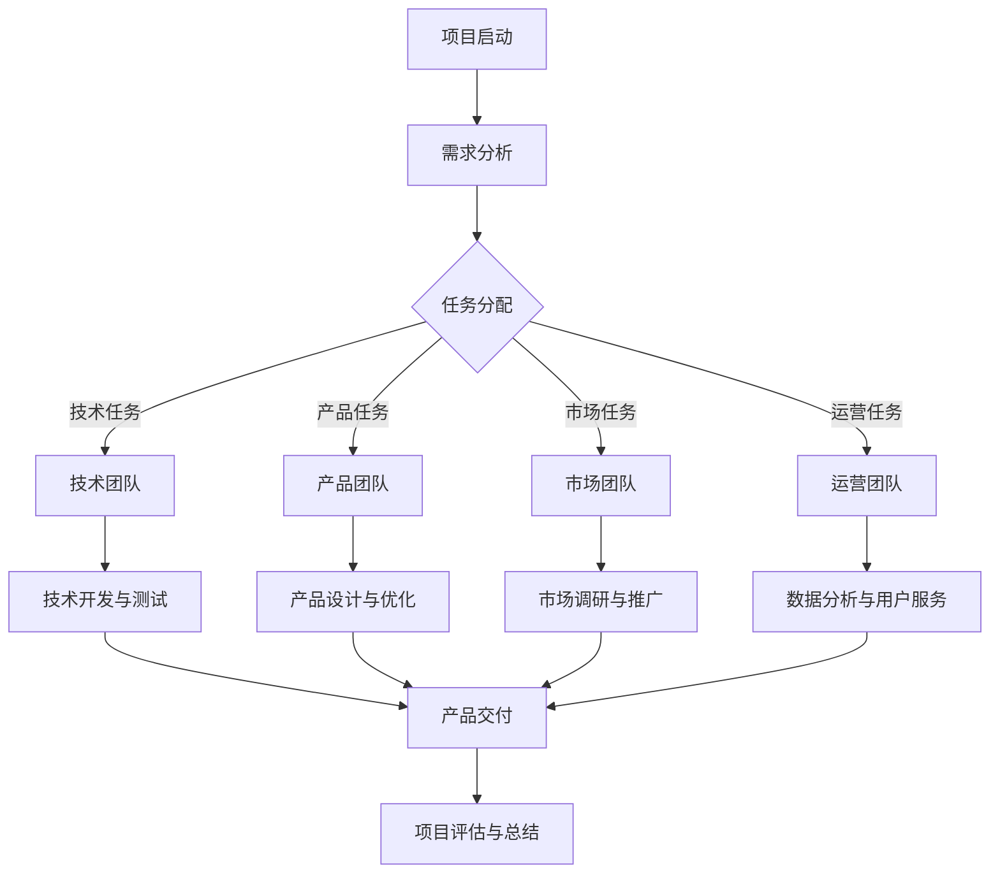
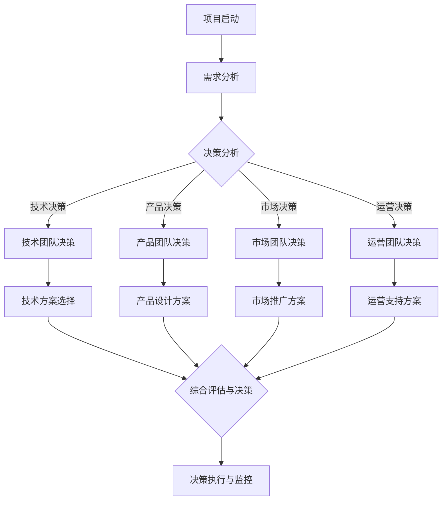

                 

## 第1章：引言

### 1.1 书籍背景与目标

在当今快速发展的信息技术时代，跨职能团队已成为许多企业实现创新和高效运营的关键。本书旨在为跨职能团队的领导提供全面的指导，特别是如何打破部门壁垒，实现团队成员之间的协同与沟通。随着企业规模的扩大和复杂性的增加，传统的单一职能团队已经无法满足快速变化的市场需求。跨职能团队的引入，能够更好地整合不同职能领域的能力，提高团队的协作效率和创新能力。

本书的目标是帮助读者：

1. 理解跨职能团队的基本概念和优势。
2. 掌握打破部门壁垒的策略和方法。
3. 学习有效的跨职能团队领导技能。
4. 通过案例分析，深入了解跨职能团队的实际应用和效果。

通过阅读本书，读者将能够：

- 准确识别跨职能团队建设中的关键问题和挑战。
- 设计和实施有效的跨职能团队结构。
- 提高跨职能团队的协作效率，实现业务目标的最大化。
- 学习和借鉴最佳实践，不断提升自己的跨职能团队领导能力。

### 1.2 跨职能团队的重要性

跨职能团队的重要性在于其能够打破部门壁垒，实现团队成员之间的紧密合作。传统的单一职能团队往往专注于自身的职责范围，容易形成信息孤岛，导致协作效率低下。而跨职能团队通过整合不同职能领域的能力，能够实现资源的最佳配置和协同创新。

跨职能团队的重要性体现在以下几个方面：

1. **提升协作效率**：跨职能团队能够将不同领域的专业知识和技能整合在一起，快速响应市场变化，提高项目的执行效率。

2. **促进创新**：跨职能团队通过多样化的思维碰撞，能够激发新的创意和解决方案，推动企业的持续创新。

3. **降低沟通成本**：跨职能团队内部的信息流通更加便捷，减少了跨部门的沟通障碍，降低了沟通成本。

4. **提升客户满意度**：跨职能团队能够更好地理解客户需求，提供更加全面和优质的服务。

5. **提高企业竞争力**：通过跨职能团队的建设，企业能够更好地适应市场变化，提升自身的竞争力。

### 1.3 部门壁垒的问题与挑战

尽管跨职能团队具有诸多优势，但在实际操作中，部门壁垒仍然是一个不可忽视的问题。部门壁垒的存在会导致团队之间的沟通不畅，资源分配不均，工作效率低下，从而影响跨职能团队的协同效果。

部门壁垒的问题与挑战主要包括：

1. **信息孤岛**：不同部门之间的信息难以共享，导致团队成员对项目的整体情况了解不足。

2. **资源分配不均**：部门之间的资源分配往往倾向于自身利益，导致跨职能团队难以获得足够的支持。

3. **利益冲突**：部门之间可能存在利益冲突，导致团队内部协作受阻。

4. **沟通障碍**：跨部门的沟通存在障碍，影响团队成员之间的协作和沟通效率。

5. **决策困难**：在跨职能团队中，由于部门壁垒的存在，决策过程往往变得复杂和缓慢。

解决这些问题和挑战，需要跨职能团队领导具备高度的战略眼光和领导力，通过有效的策略和措施来打破部门壁垒，实现团队的高效协作。

## 第2章：跨职能团队的概述

### 2.1 跨职能团队的定义

跨职能团队（Cross-functional Team）是指由来自不同职能领域（如技术、产品、市场、运营等）的成员组成的工作团队。这些成员在项目中共同工作，协同完成特定的任务和目标。跨职能团队的核心特点在于其多元性和灵活性，能够快速响应复杂多变的市场需求。

跨职能团队的定义可以从以下几个方面来理解：

1. **多元化**：团队成员来自不同的职能领域，拥有不同的专业技能和知识，这为团队提供了多样化的视角和解决问题的方法。

2. **协同性**：团队成员需要在项目中紧密协作，共同完成任务。协同性是跨职能团队成功的关键因素。

3. **灵活性**：跨职能团队能够根据项目的需求快速调整团队成员的职责和角色，灵活应对变化。

4. **目标导向**：跨职能团队的最终目标是实现项目的成功，达成预定的业务目标。

跨职能团队与传统单一职能团队相比，具有以下优势：

- **资源整合**：能够更好地整合不同职能部门的能力和资源，提高项目的整体效率。
- **创新驱动**：多样化的团队成员能够激发新的创意和解决方案，推动企业的创新和发展。
- **协作效率**：通过紧密的协作和沟通，能够快速响应市场变化，提高项目的执行效率。

### 2.2 跨职能团队的优势

跨职能团队的优势在于其能够有效地整合不同职能部门的能力，提高团队的整体效能。以下是一些具体的优势：

1. **提升协作效率**：跨职能团队的成员来自不同的职能部门，能够直接在项目中进行协作，减少了跨部门的沟通成本和等待时间。

2. **促进知识共享**：团队成员之间的知识交流和共享更为频繁，有助于提升整个团队的专业水平。

3. **快速响应变化**：跨职能团队能够快速调整团队结构，灵活应对市场变化，确保项目顺利进行。

4. **降低风险**：通过跨职能团队的合作，能够更好地识别和应对项目中的潜在风险，降低项目失败的可能性。

5. **提高客户满意度**：跨职能团队能够更全面地理解客户需求，提供更加优质的服务，提高客户满意度。

6. **增强创新能力**：多样化的团队成员能够带来不同的视角和解决方案，激发创新思维，推动企业的持续发展。

### 2.3 跨职能团队的构成

跨职能团队的构成通常包括以下角色和职责：

1. **项目经理**：负责项目的整体规划、执行和监控，确保项目按计划进行。

2. **技术专家**：负责项目的技术实现，确保技术方案的可行性和有效性。

3. **产品经理**：负责产品的设计、开发和迭代，确保产品满足市场需求。

4. **市场专家**：负责市场调研、产品推广和用户反馈，确保产品能够吸引目标客户。

5. **运营专家**：负责项目的运营支持，包括数据分析和用户服务。

6. **财务分析师**：负责项目的财务分析和预算控制，确保项目的经济合理性。

7. **法务顾问**：负责项目相关的法律事务，确保项目合法合规。

这些角色在跨职能团队中各司其职，协同工作，共同推动项目的成功。

### 2.4 跨职能团队的工作流程

跨职能团队的工作流程通常包括以下几个关键步骤：

1. **项目启动**：明确项目目标和范围，制定项目计划和时间表。

2. **需求分析**：收集并分析项目需求，确保团队对项目目标有清晰的理解。

3. **任务分配**：根据团队成员的技能和职责，将任务合理分配给各个成员。

4. **执行与监控**：团队成员按计划完成任务，项目经理负责监控项目的进展，确保项目按计划进行。

5. **沟通与协调**：定期召开会议，确保团队成员之间的沟通畅通，协调解决项目中出现的问题。

6. **项目评估**：项目结束后，对项目进行评估，总结经验教训，为未来的项目提供参考。

通过上述工作流程，跨职能团队能够高效地协作，确保项目的成功实施。

## 第3章：核心概念与联系

### 3.1 跨职能团队的架构

跨职能团队的架构设计是确保团队高效协作和项目成功的关键。一个合理的跨职能团队架构应包括明确的团队角色、职责分配和协作机制。

#### 3.1.1 团队角色与职责

跨职能团队通常包括以下核心角色：

1. **项目经理**：负责整个项目的规划、执行和监控，确保项目按时按质完成。项目经理需要具备良好的沟通能力和组织协调能力。

2. **技术专家**：负责项目的技术实现，确保技术方案的有效性和可靠性。技术专家通常具备深入的技术背景和丰富的实践经验。

3. **产品经理**：负责产品的需求分析和设计，确保产品满足市场需求。产品经理需要具备用户洞察力和市场敏感性。

4. **市场专家**：负责市场调研、产品推广和用户反馈，确保产品能够吸引目标客户。市场专家需要具备市场分析能力和营销策略规划能力。

5. **运营专家**：负责项目的运营支持，包括数据分析和用户服务。运营专家需要具备数据分析能力和用户服务经验。

6. **财务分析师**：负责项目的财务分析和预算控制，确保项目的经济合理性。财务分析师需要具备财务分析和预算规划能力。

7. **法务顾问**：负责项目相关的法律事务，确保项目合法合规。法务顾问需要具备法律知识和合规管理能力。

#### 3.1.2 团队成员的能力要求

团队成员需要具备以下能力：

1. **专业技能**：根据各自的角色和职责，团队成员需要具备相应的专业技能，如编程能力、产品设计能力、市场营销能力等。

2. **沟通能力**：团队成员需要具备良好的沟通能力，能够清晰表达自己的观点和需求，理解他人的意见和反馈。

3. **团队协作能力**：团队成员需要具备团队合作精神，能够与他人协作，共同完成任务。

4. **解决问题能力**：团队成员需要具备较强的解决问题能力，能够在项目中遇到问题时迅速找到解决方案。

5. **适应能力**：团队成员需要具备良好的适应能力，能够迅速适应项目变化和团队角色调整。

#### 3.1.3 团队的决策过程

跨职能团队的决策过程应遵循以下原则：

1. **民主决策**：团队成员应参与决策过程，表达自己的意见和建议，确保决策的合理性和民主性。

2. **科学决策**：决策过程应基于充分的数据和信息分析，确保决策的科学性和准确性。

3. **快速决策**：在确保决策质量和效率的前提下，应尽可能快速做出决策，以应对市场的快速变化。

4. **责任明确**：决策过程中，应明确各团队成员的职责和责任，确保决策执行的有效性。

### Mermaid流程图：跨职能团队的协作流程



### Mermaid流程图：跨职能团队的决策流程



通过上述架构设计和决策流程，跨职能团队能够实现高效协作和科学决策，确保项目的成功实施。

## 第4章：核心算法原理讲解

### 4.1 跨职能团队协同算法

#### 4.1.1 算法概述

跨职能团队协同算法旨在优化团队成员之间的协作效率，提高项目完成速度和成果质量。该算法基于多目标优化理论，通过分析团队成员的技能、任务需求和资源分配，实现团队资源的最佳配置和协同工作。

#### 4.1.2 算法伪代码

```python
# 跨职能团队协同算法伪代码
class TeamMember:
    def __init__(self, id, skills, availability):
        self.id = id
        self.skills = skills
        self.availability = availability

class Task:
    def __init__(self, id, requirements, duration):
        self.id = id
        self.requirements = requirements
        self.duration = duration

def TeamCollaborationAlgorithm(team_members, tasks):
    # 初始化团队和任务
    team = []
    assigned_tasks = []

    # 根据团队成员的技能和任务需求分配任务
    for member in team_members:
        for task in tasks:
            if set(member.skills).intersection(set(task.requirements)):
                team.append(member)
                assigned_tasks.append(task)
                break

    # 优化团队资源和任务分配
    optimal_team = OptimizeTeamResources(team, assigned_tasks)

    return optimal_team

def OptimizeTeamResources(team, assigned_tasks):
    # 使用贪心算法优化团队资源和任务分配
    optimal_team = []
    for member in team:
        member.availability.sort(key=lambda x: x.duration)
        for task in assigned_tasks:
            if member.availability:
                optimal_team.append((member, task))
                member.availability.remove(task)

    return optimal_team
```

#### 4.1.3 算法详细解释

1. **类定义**：定义`TeamMember`和`Task`类，用于表示团队成员和任务的基本信息。

   - `TeamMember`类包含成员ID、技能集合和可用性列表。
   - `Task`类包含任务ID、需求集合和持续时间。

2. **算法流程**：算法首先根据团队成员的技能和任务需求进行初步的任务分配，然后使用贪心算法优化团队资源和任务分配。

   - 初步分配：遍历团队成员和任务，如果成员的技能集合与任务的需

