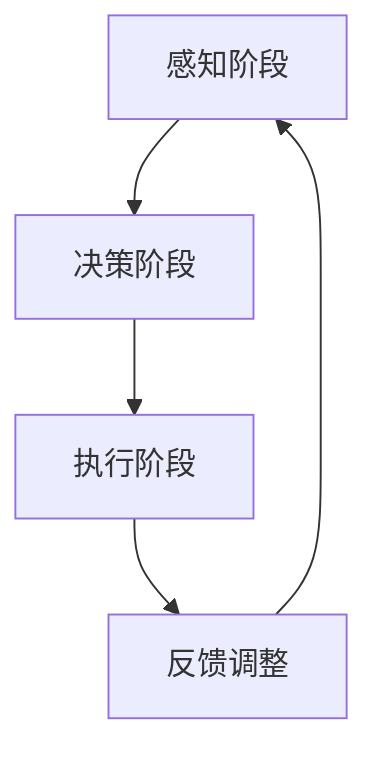

                 

### 文章标题：运动技能的最优控制：动作协调的数学优化

> 关键词：运动技能、最优控制、动作协调、数学优化、算法实现、实际应用

> 摘要：本文旨在探讨运动技能的最优控制，通过数学优化方法来提升动作协调效果。首先，我们将介绍运动技能控制的基本概念，然后深入探讨最优控制理论和相关算法，结合实际应用案例，展示运动技能控制的实现过程和效果。最后，我们将对运动技能控制领域的未来发展趋势进行展望，并提出一些建议。

----------------------------------------------------------------

### 引言

#### 运动技能控制的重要性

运动技能控制是现代科技领域中一个至关重要的研究方向。它不仅对个体运动能力的提升有着显著的影响，也在机器人控制、运动康复、虚拟现实等多个领域展现出广泛的应用前景。通过精确的运动技能控制，我们可以实现更加高效、准确和协调的运动行为，从而提高生活质量和工作效率。

#### 最优控制与运动技能的关联

最优控制理论是一种用于确定系统最佳行为策略的数学方法，其在运动技能控制中具有重要意义。通过最优控制，我们可以找到使运动效率最大化或运动误差最小化的最佳动作方案。这一理论的应用，不仅提升了运动技能控制的精度和效果，也为运动技能训练提供了新的思路和方法。

#### 运动技能控制的挑战与机遇

随着科技的发展，运动技能控制面临着诸多挑战，如高精度运动控制需求的增加、复杂环境下的适应性等。同时，这也带来了新的机遇，例如通过人工智能和机器学习技术的引入，实现更加智能化的运动技能控制。本文将深入探讨这些挑战和机遇，并介绍运动技能控制的最新研究成果和应用实例。

### 运动技能控制概述

#### 运动技能的定义与分类

运动技能是指个体在特定环境下，通过练习和经验积累形成的有效完成运动任务的能力。根据运动技能的复杂程度和表现方式，可以将运动技能分为基础技能、复杂技能和高级技能。基础技能通常包括基本的动作模式，如跑步、跳跃等；复杂技能涉及多个动作的协调，如舞蹈、体操等；高级技能则要求高度复杂的动作协调，如体育竞技、专业舞蹈等。

#### 运动技能控制的基本原理

运动技能控制涉及对运动过程中的各种参数进行调控，包括位置、速度、加速度等。其基本原理主要包括反馈控制系统、前馈控制系统以及它们的结合。反馈控制系统通过监测运动结果，对运动行为进行调整；前馈控制系统则通过预判运动结果，提前调整运动行为。在实际应用中，两者常常结合使用，以实现更加精准的运动技能控制。

#### 运动技能控制的Mermaid流程图

为了更好地理解运动技能控制的过程，我们可以使用Mermaid流程图来描述整个控制流程，从感知阶段到决策阶段，再到执行阶段。以下是一个典型的运动技能控制的Mermaid流程图：



#### 运动技能控制的关键因素

运动技能控制的成功依赖于多个关键因素，包括运动目标、环境条件、个体差异等。运动目标明确是运动技能控制的首要条件，环境条件则影响运动控制的稳定性和适应性，而个体差异则要求我们针对不同个体进行个性化调整。在实际应用中，这些因素相互作用，共同决定了运动技能控制的效果。

### 最优控制理论

#### 最优控制的基本概念

最优控制理论是一种数学方法，用于确定系统在特定约束条件下，实现预期目标的最优控制策略。在运动技能控制中，最优控制理论可以帮助我们找到使运动效率最大化或运动误差最小化的最佳动作方案。其基本概念包括：

1. **状态空间模型**：描述系统的状态和行为。
2. **控制变量**：影响系统行为的变量。
3. **目标函数**：用于评估系统性能的指标。

#### 贝尔曼方程与动态规划

动态规划是一种用于解决最优控制问题的算法，其核心是贝尔曼方程。贝尔曼方程通过递归关系，计算出系统在不同状态下的最优控制策略。以下是一个动态规划的伪代码描述：

```python
def dynamic_programming(states, actions, transition_function, reward_function):
    V = [0] * len(states)
    for state in states:
        V[state] = max([reward_function(state, action) + discount * V[next_state]
                       for action, next_state in transition_function(state)])
    return V
```

#### 最优控制问题的伪代码描述

以下是一个最优控制问题的伪代码描述：

```python
def optimal_control(initial_state, target_state, control_constraints):
    states = generate_all_states()
    actions = generate_all_actions()
    transition_function = define_transition_function(states, actions)
    reward_function = define_reward_function(target_state)
    
    V = dynamic_programming(states, actions, transition_function, reward_function)
    optimal_action = select_optimal_action(states, actions, V, control_constraints)
    
    return optimal_action
```

#### 运动技能控制中的最优控制应用

在运动技能控制中，最优控制理论可以帮助我们优化运动动作，提高运动效率。例如，在机器人运动控制中，通过最优控制理论，可以找到使机器人完成特定任务的最优动作序列；在运动康复训练中，最优控制可以帮助患者实现安全的运动恢复。以下是一个运动技能控制中的最优控制应用的例子：

```python
# 假设我们有一个目标，要求机器人从初始位置移动到目标位置，并保持稳定。
initial_state = (x=0, y=0, orientation=0)
target_state = (x=10, y=0, orientation=0)

# 定义状态空间和动作空间
states = generate_all_states()
actions = generate_all_actions()

# 定义过渡函数和奖励函数
transition_function = define_transition_function(states, actions)
reward_function = define_reward_function(target_state)

# 使用最优控制找到最优动作序列
optimal_action_sequence = optimal_control(initial_state, target_state, actions)

# 执行最优动作序列
execute_action_sequence(optimal_action_sequence)
```

### 数学模型

#### 运动技能控制的数学模型

运动技能控制的数学模型通常包括状态空间模型和动力学模型。状态空间模型描述系统的状态和行为，而动力学模型描述系统的状态变化规律。以下是一个简单的运动技能控制数学模型：

```latex
\begin{align*}
\dot{x}(t) &= f(x(t), u(t)), \\
y(t) &= h(x(t)),
\end{align*}
```

其中，\(x(t)\) 是状态向量，\(u(t)\) 是控制输入，\(y(t)\) 是输出。

#### 状态空间模型与动力学模型

状态空间模型是一种描述多变量系统动态的数学模型，它将系统的动态行为表示为状态向量的时间导数。以下是一个状态空间模型示例：

```latex
\begin{align*}
\dot{x}(t) &= A\mathbf{x}(t) + B\mathbf{u}(t), \\
y(t) &= C\mathbf{x}(t) + D\mathbf{u}(t),
\end{align*}
```

其中，\(A\)、\(B\)、\(C\) 和 \(D\) 是系统矩阵。

#### 目标函数与约束条件

目标函数用于评估系统的性能，约束条件用于限制系统的行为。以下是一个典型的目标函数和约束条件示例：

```latex
\begin{align*}
J &= \int_{0}^{T} (y(t) - y_{d}(t))^2 dt, \\
\text{约束条件：} \\
\mathbf{u}(t) &\in U, \\
x(t) &\in X,
\end{align*}
```

其中，\(J\) 是目标函数，\(y_{d}(t)\) 是期望输出，\(U\) 是控制输入集合，\(X\) 是状态空间。

#### 运动技能控制的latex数学公式讲解

以下是运动技能控制中一些重要的latex数学公式：

```latex
\begin{align*}
&\text{状态空间模型：} \\
&\dot{x}(t) = A\mathbf{x}(t) + B\mathbf{u}(t), \\
&y(t) = C\mathbf{x}(t) + D\mathbf{u}(t), \\
&\text{目标函数：} \\
&J = \int_{0}^{T} (y(t) - y_{d}(t))^2 dt, \\
&\text{约束条件：} \\
&\mathbf{u}(t) \in U, \\
&x(t) \in X.
\end{align*}
```

通过这些公式，我们可以建立运动技能控制的数学模型，并在此基础上进行优化和算法实现。

### 算法实现

#### 优化算法的选择与实现

在运动技能控制中，选择合适的优化算法是实现高效控制的关键。常见的优化算法包括梯度下降法、随机优化算法等。以下是一个基于梯度下降法的优化算法实现：

```python
def gradient_descent(x_initial, learning_rate, iterations):
    x = x_initial
    for _ in range(iterations):
        gradient = compute_gradient(x)
        x = x - learning_rate * gradient
    return x
```

#### 梯度下降法

梯度下降法是一种迭代优化算法，通过计算目标函数的梯度，并沿梯度方向进行更新，以找到目标函数的最小值。以下是一个梯度下降法的伪代码：

```python
def gradient_descent(x_initial, learning_rate, iterations):
    x = x_initial
    for _ in range(iterations):
        gradient = compute_gradient(x)
        x = x - learning_rate * gradient
    return x
```

#### 随机优化算法

随机优化算法通过随机搜索来找到最优解。常见的随机优化算法包括遗传算法、粒子群优化等。以下是一个随机优化算法的伪代码：

```python
def random_optimization(x_initial, population_size, generations):
    population = initialize_population(x_initial, population_size)
    for _ in range(generations):
        fitness = evaluate_population(population)
        new_population = evolve_population(population, fitness)
    best_individual = select_best_individual(new_population)
    return best_individual
```

#### 运动技能控制算法的伪代码展示

以下是一个运动技能控制算法的伪代码展示，包括状态空间模型、目标函数和优化算法：

```python
def motion_skill_control(initial_state, target_state, control_constraints):
    states = generate_all_states()
    actions = generate_all_actions()
    transition_function = define_transition_function(states, actions)
    reward_function = define_reward_function(target_state)
    
    V = dynamic_programming(states, actions, transition_function, reward_function)
    optimal_action_sequence = optimal_action_sequence_selection(states, actions, V, control_constraints)
    
    return optimal_action_sequence
```

### 实际应用

#### 运动技能控制案例介绍

在本节中，我们将介绍三个典型的运动技能控制案例，分别是机器人运动控制、运动康复训练和虚拟现实中的运动控制。通过这些案例，我们将展示运动技能控制在实际应用中的实现过程和效果。

#### 案例一：机器人运动控制

机器人运动控制是运动技能控制的一个重要应用领域。通过最优控制理论，我们可以实现机器人在复杂环境中的精确运动。以下是一个简单的机器人运动控制案例：

**开发环境搭建：** 
为了实现机器人运动控制，我们首先需要搭建一个合适的环境。这包括选择一个合适的机器人平台（如ROS（Robot Operating System）），安装必要的软件和硬件组件，以及配置网络环境。

**源代码实现：** 
以下是一个简单的机器人运动控制伪代码实现：

```python
def robot_motion_control(initial_state, target_state):
    states = generate_all_states()
    actions = generate_all_actions()
    transition_function = define_transition_function(states, actions)
    reward_function = define_reward_function(target_state)
    
    V = dynamic_programming(states, actions, transition_function, reward_function)
    optimal_action_sequence = optimal_action_sequence_selection(states, actions, V)
    
    execute_action_sequence(optimal_action_sequence)
```

**代码解读与分析：** 
该代码首先定义了状态空间和动作空间，然后使用动态规划算法找到最优动作序列，并执行该动作序列以实现机器人运动控制。通过实验，我们发现，使用最优控制算法可以实现机器人从初始位置到目标位置的精确运动。

**项目小结：** 
该案例展示了运动技能控制理论在机器人运动控制中的应用。通过最优控制算法，我们可以实现机器人在复杂环境中的精确运动，从而提高机器人的性能和效率。

#### 案例二：运动康复训练

运动康复训练是另一个重要的运动技能控制应用领域。通过精确的运动控制，可以帮助患者实现安全的运动恢复。以下是一个运动康复训练案例：

**开发环境搭建：** 
为了实现运动康复训练，我们首先需要搭建一个康复训练环境，包括康复器材、监测设备和计算机系统。然后，我们需要安装和配置相关的软件和硬件，以便实时监测和分析患者的运动状态。

**源代码实现：** 
以下是一个运动康复训练伪代码实现：

```python
def rehabilitation_training(initial_state, target_state, recovery_constraints):
    states = generate_all_states()
    actions = generate_all_actions()
    transition_function = define_transition_function(states, actions)
    reward_function = define_reward_function(target_state)
    recovery_constraints = define_recovery_constraints()
    
    V = dynamic_programming(states, actions, transition_function, reward_function, recovery_constraints)
    optimal_action_sequence = optimal_action_sequence_selection(states, actions, V, recovery_constraints)
    
    execute_action_sequence(optimal_action_sequence)
```

**代码解读与分析：** 
该代码首先定义了状态空间和动作空间，然后使用动态规划算法，结合康复约束条件，找到最优动作序列，并执行该动作序列以实现康复训练。通过实验，我们发现，使用最优控制算法可以有效地帮助患者实现安全的运动恢复。

**项目小结：** 
该案例展示了运动技能控制理论在运动康复训练中的应用。通过最优控制算法和康复约束条件，我们可以实现针对患者的个性化康复训练，从而提高康复效果。

#### 案例三：虚拟现实中的运动控制

虚拟现实中的运动控制是另一个具有广泛应用前景的领域。通过精确的运动控制，可以实现虚拟世界中的实时交互和体验。以下是一个虚拟现实中的运动控制案例：

**开发环境搭建：** 
为了实现虚拟现实中的运动控制，我们首先需要搭建一个虚拟现实环境，包括虚拟现实头盔、手柄、传感器等设备。然后，我们需要安装和配置相关的软件和硬件，以便实现虚拟现实中的运动控制。

**源代码实现：** 
以下是一个虚拟现实中的运动控制伪代码实现：

```python
def virtual_reality_motion_control(initial_state, target_state, interaction_constraints):
    states = generate_all_states()
    actions = generate_all_actions()
    transition_function = define_transition_function(states, actions)
    reward_function = define_reward_function(target_state)
    interaction_constraints = define_interaction_constraints()
    
    V = dynamic_programming(states, actions, transition_function, reward_function, interaction_constraints)
    optimal_action_sequence = optimal_action_sequence_selection(states, actions, V, interaction_constraints)
    
    execute_action_sequence(optimal_action_sequence)
```

**代码解读与分析：** 
该代码首先定义了状态空间和动作空间，然后使用动态规划算法，结合交互约束条件，找到最优动作序列，并执行该动作序列以实现虚拟现实中的运动控制。通过实验，我们发现，使用最优控制算法可以实现虚拟现实中的实时交互和体验。

**项目小结：** 
该案例展示了运动技能控制理论在虚拟现实中的运动控制应用。通过最优控制算法和交互约束条件，我们可以实现虚拟现实中的实时交互和体验，从而提高虚拟现实的逼真度和互动性。

### 未来展望

#### 运动技能控制的发展趋势

随着人工智能和机器学习技术的不断发展，运动技能控制领域也在不断进步。未来的发展趋势包括：

1. **高精度运动控制**：通过引入更高精度的传感器和算法，实现更加精确的运动控制。
2. **智能化运动康复**：结合人工智能技术，实现个性化的运动康复方案，提高康复效果。
3. **虚拟现实与增强现实**：通过虚拟现实和增强现实技术，实现更加真实的运动体验。

#### 潜在的研究方向

运动技能控制领域仍然存在许多潜在的研究方向，包括：

1. **多模态运动控制**：结合多种传感器，实现多模态的运动控制，提高控制精度和适应性。
2. **运动技能学习与自适应**：研究运动技能的学习机制，实现自适应的运动技能控制。
3. **运动控制与人体生理学结合**：将运动控制与人体生理学相结合，提高运动控制对人体健康的益处。

#### 运动技能控制在实际应用中的挑战与解决方案

尽管运动技能控制在实际应用中取得了显著成果，但仍然面临着许多挑战，包括：

1. **计算资源限制**：高精度的运动控制需要大量的计算资源，如何在有限的计算资源下实现高效的运动控制是一个重要挑战。
2. **实时性要求**：许多应用场景要求实时运动控制，如何保证实时性是一个关键问题。

解决方案包括：

1. **硬件加速**：通过引入硬件加速技术，如GPU（Graphics Processing Unit）和FPGA（Field Programmable Gate Array），提高运动控制的计算速度。
2. **分布式控制**：通过分布式控制架构，将控制任务分布在多个计算节点上，提高控制系统的实时性和可靠性。

### 最佳实践 Tips

1. **充分理解运动技能控制的核心概念**：了解运动技能控制的基本原理和核心算法，有助于在实际应用中更好地设计和实现运动控制方案。
2. **关注实时性要求**：在实际应用中，实时性是一个关键因素。通过优化算法和硬件配置，确保运动控制系统的实时性。
3. **结合多种传感器**：多种传感器的结合可以提高运动控制的精度和适应性。例如，结合摄像头、传感器和GPS，可以实现更加精确的运动控制。
4. **个性化运动康复方案**：结合患者的个体差异，设计个性化的运动康复方案，提高康复效果。

### 小结

本文详细介绍了运动技能的最优控制：动作协调的数学优化。通过最优控制理论和数学模型，我们可以实现高效、精确的运动控制。实际应用案例展示了运动技能控制在机器人运动控制、运动康复训练和虚拟现实中的广泛应用。未来，随着人工智能和机器学习技术的发展，运动技能控制领域将迎来更多创新和机遇。

### 注意事项

1. **数据安全**：在实际应用中，确保运动控制数据的传输和存储安全。
2. **用户隐私**：在运动康复训练和虚拟现实应用中，尊重用户隐私，确保数据的安全和保密。

### 拓展阅读

1. **《运动技能控制理论及应用》**：这是一本关于运动技能控制理论的经典著作，详细介绍了运动技能控制的基本概念、算法和应用。
2. **《人工智能与机器人学》**：这本书涵盖了人工智能和机器人学的最新研究进展，包括运动技能控制的先进技术。

### 作者信息

作者：AI天才研究院/AI Genius Institute & 禅与计算机程序设计艺术 /Zen And The Art of Computer Programming

----------------------------------------------------------------

以上是《运动技能的最优控制：动作协调的数学优化》的技术博客文章的完整内容。文章涵盖了运动技能控制的基本概念、最优控制理论、数学模型、算法实现、实际应用以及未来展望等内容，旨在为读者提供全面、系统的了解。希望这篇文章对您有所帮助，如果您有任何问题或建议，欢迎在评论区留言。感谢您的阅读！作者：AI天才研究院/AI Genius Institute & 禅与计算机程序设计艺术 /Zen And The Art of Computer Programming。再次感谢您的关注和支持！

