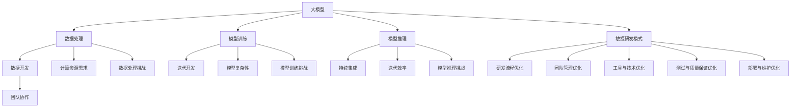

                 

## 引言

在当前技术飞速发展的时代，人工智能（AI）无疑是最引人注目的领域之一。随着深度学习、大数据和云计算等技术的不断进步，大模型（Large Models）的应用逐渐成为企业和研究机构提升竞争力的关键。然而，大模型的高复杂性、大规模数据处理需求以及持续迭代的特点，对传统的软件开发模式和研发流程提出了新的挑战。

传统的软件开发模式，如瀑布模型，在处理复杂项目时往往显得效率低下，难以应对快速变化的需求和市场动态。而敏捷开发（Agile Development）由于其灵活性和迭代性，逐渐成为应对复杂项目的一种有效方式。然而，将敏捷开发应用于大模型应用领域，并非一蹴而就。大模型的特性和需求与传统的敏捷开发模式存在显著差异，这要求我们必须进行适应性调整和创新。

本文旨在探讨如何设计一种适配大模型应用的敏捷研发模式。我们将首先介绍大模型的基本概念和分类，回顾敏捷开发的核心理念，并分析大模型应用对敏捷开发的挑战。随后，我们将详细讨论如何在大模型应用下实现敏捷研发模式，包括研发流程、团队管理、工具与技术等方面。最后，通过实战案例展示如何具体实施这种敏捷研发模式，并总结最佳实践和注意事项。

通过本文的讨论，希望能够为从事大模型研发的技术人员提供一套行之有效的研发模式，帮助他们在快速变化的市场环境中保持竞争力。关键词包括：大模型、敏捷研发、数据处理、迭代开发、团队协作、持续集成等。

## 大模型与敏捷研发基础

### 大模型的定义与分类

大模型，顾名思义，是指具有巨大参数量和复杂结构的人工智能模型。这类模型在处理大规模数据和复杂任务时具有显著优势，但同时也带来了诸多挑战。大模型的定义可以从多个维度进行理解：

首先，从参数量角度来看，大模型通常拥有数百万至数十亿个参数。例如，Transformer模型中的BERT（Bidirectional Encoder Representations from Transformers）在大规模预训练时拥有超过一亿个参数。这些参数的数量使得模型能够捕捉到数据中的细微特征和模式，从而在自然语言处理、计算机视觉等领域表现出色。

其次，从模型结构角度来看，大模型往往采用复杂的网络架构。以Transformer模型为例，其通过自注意力机制（Self-Attention Mechanism）和多头注意力（Multi-Head Attention）等技术，实现了对输入数据的全局依赖建模。这种复杂的结构使得大模型能够处理多种类型的任务，如文本生成、图像分类和序列预测等。

大模型可以根据不同的应用场景和任务需求进行分类。以下是一些常见的大模型分类：

1. **自然语言处理（NLP）模型**：这类模型主要用于处理文本数据，如BERT、GPT（Generative Pre-trained Transformer）和T5（Text-to-Text Transfer Transformer）等。这些模型通过预训练和微调（Fine-tuning）能够实现多种NLP任务，如文本分类、机器翻译和问答系统等。

2. **计算机视觉（CV）模型**：这类模型主要用于处理图像和视频数据，如ResNet、VGG和Inception等。这些模型通过卷积神经网络（Convolutional Neural Networks，CNN）等技术，实现了图像分类、目标检测和图像生成等任务。

3. **音频处理模型**：这类模型主要用于处理音频数据，如WaveNet、Convolutive LSTM等。这些模型通过循环神经网络（Recurrent Neural Networks，RNN）和卷积神经网络等技术，实现了语音识别、音乐生成和音频分类等任务。

4. **多模态模型**：这类模型能够处理多种类型的数据，如文本、图像和音频等。这类模型通过融合不同类型的数据特征，实现了更广泛的应用场景，如视频分类、图像字幕生成和跨模态检索等。

### 敏捷开发的核心理念

敏捷开发是一种以人为核心、迭代和灵活响应变化的软件开发方法。其核心理念包括以下几点：

1. **客户价值**：敏捷开发强调关注客户需求和满意度，通过快速迭代和反馈来确保产品始终符合客户期望。

2. **迭代开发**：敏捷开发采用短周期迭代（如两周或一个月），在每个迭代周期内交付可运行的产品部分。这种迭代方式有助于快速响应需求变化，并积累经验。

3. **团队合作**：敏捷开发强调跨职能团队的紧密合作，团队成员之间的高效沟通和协作是项目成功的关键。

4. **持续交付**：敏捷开发注重持续集成和持续交付（CI/CD），通过自动化测试和部署，确保产品的稳定性和质量。

5. **自适应规划**：敏捷开发鼓励灵活应对变化，通过敏捷规划（如Scrum和Kanban）来调整项目进度和目标。

### 大模型应用对敏捷开发的挑战

尽管敏捷开发在传统软件开发中表现出色，但在大模型应用领域，其面临着诸多挑战：

1. **计算资源需求**：大模型训练和推理通常需要大量的计算资源，这包括高性能计算硬件（如GPU、TPU）和大规模数据存储。传统的云计算和分布式计算方法可能难以满足大模型的需求。

2. **数据处理挑战**：大模型需要处理的数据规模巨大，且数据质量直接影响模型性能。数据预处理、清洗和增强等环节需要高效且自动化的解决方案。

3. **模型复杂性**：大模型的结构复杂，参数众多，需要精细的调参和优化。传统的调参方法可能难以应对大模型的复杂性，需要采用更加智能化和自动化的调参技术。

4. **迭代效率**：大模型训练和验证过程通常需要较长时间，如何在短时间内进行有效的迭代和反馈成为一个难题。这需要优化研发流程，提高迭代效率。

5. **团队协作**：大模型研发涉及多个专业领域，如数据科学、算法工程和软件开发等，团队协作变得尤为重要。如何确保跨学科团队的紧密协作，提高整体研发效率，是敏捷开发在大模型应用中的重要挑战。

### 核心概念与联系

为了更好地理解大模型与敏捷研发之间的联系，我们可以通过一个Mermaid流程图来展示核心概念之间的关系架构：



通过这个流程图，我们可以清晰地看到大模型在数据处理、模型训练和模型推理等环节中所面临的挑战，以及如何通过敏捷研发模式来应对这些挑战。接下来，我们将进一步探讨如何在大模型应用下实现敏捷研发模式。

## 大模型应用下的敏捷研发模式

在大模型应用中，传统的研发模式往往难以满足快速迭代和灵活响应的需求。因此，设计一种适配大模型应用的敏捷研发模式至关重要。本节将详细讨论敏捷研发模式在大模型应用中的具体实现，包括研发流程、模型集成与迭代、数据处理与模型训练等方面。

### 敏捷研发流程与框架

敏捷研发流程旨在通过短周期迭代和持续交付，快速响应需求变化并确保产品质量。在大模型应用中，敏捷研发流程可以包括以下几个关键环节：

1. **需求分析**：在项目初期，通过用户调研和市场分析，明确项目的需求和目标。对于大模型应用，需求分析不仅包括功能需求，还应考虑计算资源、数据处理能力和模型性能等非功能性需求。

2. **迭代计划**：根据需求分析，制定迭代计划。每个迭代周期通常为2-4周，每个周期内确定具体的目标和任务。对于大模型项目，迭代计划应考虑数据准备、模型训练、测试和部署等环节的时间分配。

3. **迭代执行**：在迭代执行阶段，团队成员根据计划进行具体的工作，包括数据预处理、模型训练、代码开发和测试等。在执行过程中，应保持团队成员之间的紧密沟通，确保各项工作有序进行。

4. **迭代评审**：在每个迭代周期的末尾，进行迭代评审。评审内容包括功能完整性、性能指标和用户满意度等。通过评审，确定下一轮迭代的改进方向和任务。

5. **持续交付**：在迭代评审后，进行持续交付。通过自动化测试和部署，确保产品的稳定性和质量，实现快速上线和持续优化。

在大模型应用中，敏捷研发流程的关键在于灵活调整和持续优化。例如，在数据处理阶段，可能需要根据实际数据质量进行调整；在模型训练阶段，可能需要根据性能指标进行调参和优化。

### 大模型集成与迭代

大模型集成与迭代是敏捷研发模式中的核心环节。在大模型应用中，集成与迭代不仅需要考虑模型本身的复杂性，还需要考虑与其他系统的交互和依赖。

1. **集成策略**：大模型集成应考虑以下几个方面：

   - **数据集成**：确保数据源的一致性和完整性，避免数据孤岛。可以使用数据仓库和数据湖等技术，实现数据的统一管理和访问。
   - **服务集成**：将大模型作为服务提供，与其他系统进行接口交互。可以使用API网关和微服务架构，实现高效的服务集成和调用。
   - **版本控制**：对大模型和服务进行版本控制，确保不同版本之间的兼容性和可回滚性。

2. **迭代方法**：在大模型迭代过程中，可以采用以下方法：

   - **增量迭代**：逐步优化和扩展模型功能，每次迭代只关注一个或几个特定功能模块，确保每次迭代都有具体的目标和成果。
   - **并行迭代**：在不同功能模块之间并行进行迭代，提高整体研发效率。例如，在数据预处理和模型训练阶段可以并行进行，减少整体迭代时间。
   - **持续迭代**：通过持续集成和持续交付，实现快速迭代和持续优化。每次迭代都进行全面的测试和部署，确保产品的稳定性和质量。

### 数据处理与模型训练

在大模型应用中，数据处理和模型训练是关键环节。敏捷研发模式要求我们在数据处理和模型训练过程中，保持灵活性和高效性。

1. **数据处理策略**：

   - **自动化预处理**：使用自动化脚本和工具，对数据进行清洗、转换和增强。例如，使用Python的Pandas库和Scikit-learn库，实现数据预处理流程。
   - **数据质量监控**：建立数据质量监控机制，实时监测数据质量，确保数据的一致性和完整性。例如，使用数据质量检查工具和自动化测试，及时发现和修复数据问题。
   - **数据版本管理**：对数据进行版本管理，确保每次迭代使用的数据是一致的。例如，使用版本控制系统，如Git，记录数据版本和变更历史。

2. **模型训练策略**：

   - **分布式训练**：利用分布式计算技术，如MPI（Message Passing Interface）和TensorFlow Distributed，实现模型的分布式训练，提高训练速度和效率。
   - **模型调参**：使用自动化调参工具，如Hyperopt和TensorFlow Tuner，实现模型的自动化调参，提高模型性能。例如，通过贝叶斯优化（Bayesian Optimization）技术，实现高效调参。
   - **模型评估**：使用多种评估指标，如准确率、召回率和F1分数，对模型进行综合评估。例如，在训练和验证数据集上，分别计算评估指标，以全面评估模型性能。

### 敏捷研发模式的优势

敏捷研发模式在大模型应用中具有以下优势：

1. **快速响应**：通过短周期迭代和持续交付，敏捷研发模式能够快速响应需求变化，确保项目按时交付。
2. **灵活调整**：在迭代过程中，可以根据实际情况进行调整，确保项目始终符合客户需求和市场动态。
3. **高效协作**：通过跨职能团队的紧密合作，敏捷研发模式能够提高团队协作效率，确保项目成功。
4. **质量保证**：通过自动化测试和持续集成，敏捷研发模式能够确保产品的稳定性和质量。
5. **持续优化**：通过持续迭代和反馈，敏捷研发模式能够不断优化产品，提升用户体验。

总之，敏捷研发模式在大模型应用中是一种行之有效的方法。通过灵活调整和持续优化，敏捷研发模式能够帮助企业和研究机构在大模型领域取得竞争优势。

### 结论

综上所述，大模型应用对传统的软件开发模式和研发流程提出了新的挑战。为了应对这些挑战，敏捷研发模式提供了一种灵活且高效的解决方案。通过迭代开发、团队协作、持续集成和自动化测试，敏捷研发模式能够显著提升研发效率，确保产品质量，并快速响应市场需求。

本文详细探讨了适配大模型应用的敏捷研发模式，包括研发流程、模型集成与迭代、数据处理与模型训练等方面的具体实现。通过实际案例和最佳实践，我们展示了如何在大模型应用中实施敏捷研发模式，并强调了其在快速迭代和灵活调整方面的优势。

未来，随着人工智能技术的不断发展，大模型应用将在更多领域得到广泛应用。如何进一步优化敏捷研发模式，以适应更复杂的大模型应用场景，将成为一个重要的研究方向。通过不断探索和实践，我们有望在大模型应用领域取得更多突破，为企业和研究机构创造更大价值。

## 大模型应用下的敏捷团队管理

在大模型应用中，团队的协作效率直接影响到项目的成功与否。敏捷开发强调团队合作，通过构建高效的跨职能团队，确保项目能够快速响应需求变化并保持高质量交付。以下将详细讨论大模型应用下的敏捷团队管理，包括团队结构设计、角色职责以及团队沟通与协作方法。

### 团队结构设计

在大模型应用中，团队结构的设计应充分考虑项目需求和团队成员的专业背景。通常，一个敏捷团队可以包括以下几个关键角色：

1. **数据科学家（Data Scientist）**：负责数据预处理、特征工程和模型设计。他们需要具备数据挖掘、机器学习等方面的专业知识和技能，能够对数据进行深入分析和建模。

2. **算法工程师（Algorithm Engineer）**：负责模型训练、调参和优化。他们通常拥有丰富的深度学习、神经网络等算法开发经验，能够设计和实现高效的大规模模型。

3. **软件开发工程师（Software Engineer）**：负责系统的开发、测试和部署。他们需要熟悉软件开发流程和工具，能够实现模型与系统的无缝集成。

4. **产品经理（Product Manager）**：负责产品规划和需求管理，确保项目与市场需求的紧密对接。他们需要具备用户需求分析、产品规划和项目管理等方面的能力。

5. **项目经理（Project Manager）**：负责协调团队工作，确保项目按时交付。他们需要具备项目管理、沟通协调和风险管理等方面的技能。

在团队结构设计中，可以采用以下几种组织形式：

1. **Scrum团队**：Scrum是一种常见的敏捷开发框架，团队通常由3-9名成员组成，包括产品负责人、Scrum Master和开发团队。Scrum团队强调自组织、迭代和反馈，有助于提高团队协作效率和响应速度。

2. **Kanban团队**：Kanban是一种基于看板（Kanban Board）的敏捷开发方法，强调工作流管理和持续改进。Kanban团队通常由多个成员组成，每个成员负责不同的任务环节，通过可视化看板管理任务进度和优先级。

3. **跨职能团队**：跨职能团队是指团队成员来自不同专业领域，能够共同完成项目任务。这种团队形式有助于打破专业壁垒，提高整体协作效率。

### 大模型项目中的角色职责

在大模型项目中，不同角色的职责如下：

1. **数据科学家**：

   - 数据预处理：清洗、转换和增强数据，为模型训练提供高质量的数据。
   - 特征工程：提取和构造有助于模型训练的特征，提高模型性能。
   - 模型设计：设计并实现大模型架构，确保模型能够应对复杂任务。

2. **算法工程师**：

   - 模型训练：使用分布式计算技术，对模型进行训练和优化，提高模型性能。
   - 调参：通过实验和调参工具，寻找最优的超参数配置，提高模型性能。
   - 性能评估：使用多种评估指标，对模型性能进行综合评估，确保模型达到预期效果。

3. **软件开发工程师**：

   - 系统开发：实现大模型应用的前端和后端功能，确保系统的高可用性和可扩展性。
   - 测试与部署：编写自动化测试脚本，确保系统的稳定性和质量，实现快速部署和上线。
   - 系统维护：监控系统运行状态，及时解决故障和性能瓶颈。

4. **产品经理**：

   - 需求分析：与用户和利益相关者沟通，了解项目需求和目标，制定产品规划。
   - 产品设计：与数据科学家和算法工程师合作，制定模型和系统的设计方案。
   - 用户反馈：收集用户反馈，优化产品功能和用户体验。

5. **项目经理**：

   - 项目规划：制定项目计划，分配任务和资源，确保项目按时交付。
   - 沟通协调：协调团队内部和跨部门沟通，确保项目顺利进行。
   - 风险管理：识别和应对项目风险，确保项目顺利进行。

### 团队沟通与协作方法

在大模型项目中，团队沟通与协作方法至关重要。以下是一些有效的团队沟通与协作方法：

1. **每日站立会议（Daily Stand-up Meeting）**：每天早晨举行短暂（通常不超过15分钟）的站立会议，团队成员汇报工作进展、遇到的问题和计划，确保团队目标一致。

2. **迭代回顾会议（Iteration Review Meeting）**：在每个迭代周期的末尾，举行迭代回顾会议，总结本次迭代的经验和教训，制定改进措施，为下一个迭代做准备。

3. **代码审查（Code Review）**：通过代码审查，确保代码的质量和一致性。数据科学家和算法工程师可以相互审查代码，发现潜在问题和优化机会。

4. **自动化测试与持续集成（Automated Testing and Continuous Integration）**：建立自动化测试和持续集成（CI/CD）流程，确保系统的稳定性和质量。每次代码提交都进行自动化测试，确保功能正确和性能达标。

5. **工具与平台**：使用协同工作平台（如Jira、Trello），项目管理工具（如Asana、Trello），以及代码管理工具（如GitLab、GitHub），实现高效的团队协作和任务管理。

6. **知识共享与培训**：定期组织知识共享和培训活动，提高团队成员的专业技能和团队协作能力。

通过以上团队管理方法，大模型项目团队能够高效协作，快速响应需求变化，确保项目的成功交付。

### 总结

在大模型应用中，敏捷团队管理是确保项目成功的关键因素。通过合理的团队结构设计、明确的角色职责以及高效的沟通与协作方法，团队能够充分发挥各自的优势，协同合作，应对复杂的研发挑战。未来，随着人工智能技术的不断进步，敏捷团队管理方法将在大模型应用中发挥更加重要的作用，为企业和研究机构创造更多价值。

## 大模型应用下的敏捷工具与技术

在大模型应用中，选择合适的工具和技术是实现高效研发的关键。本文将详细介绍在大模型应用中常用的开发工具与平台、持续集成与持续部署（CI/CD）、以及自动化测试策略。

### 开发工具与平台

1. **开发工具**：

   - **Python**：Python 是一种广泛使用的编程语言，尤其在数据科学和人工智能领域。其简洁的语法和丰富的库（如NumPy、Pandas、Scikit-learn、TensorFlow 和 PyTorch）使其成为大模型开发的理想选择。

   - **Jupyter Notebook**：Jupyter Notebook 是一种交互式开发环境，支持Python和其他多种编程语言。它提供了代码执行、解释性文本和可视化结果的可视化界面，非常适合进行数据探索、实验和演示。

   - **PyCharm**：PyCharm 是一款强大的Python集成开发环境（IDE），提供了代码补全、调试、版本控制和自动化测试等功能，适用于复杂的大模型开发项目。

2. **平台**：

   - **Google Colab**：Google Colab 是一个基于云的Jupyter Notebook平台，提供免费的GPU和TPU资源，适合进行大规模的机器学习和深度学习实验。

   - **AWS SageMaker**：AWS SageMaker 是一种完全托管的服务，提供端到端的大模型开发、训练和部署工具。它集成了Jupyter Notebook和PyTorch等常用工具，方便进行大规模模型训练和推理。

   - **Azure Machine Learning**：Azure Machine Learning 是微软提供的机器学习和深度学习平台，支持模型训练、部署和自动化管理。它提供了丰富的API和SDK，方便与现有系统集成。

### 持续集成与持续部署（CI/CD）

持续集成与持续部署（Continuous Integration/Continuous Deployment，CI/CD）是一种自动化软件交付流程，通过自动化测试和部署，确保代码质量和系统稳定性。在大模型应用中，CI/CD 具有如下优势：

1. **自动化测试**：在每次代码提交后，自动化测试工具（如Selenium、pytest）自动执行一系列测试用例，包括单元测试、集成测试和性能测试，确保新代码不会引入缺陷。

2. **环境隔离**：CI/CD 系统通常在多个环境中运行测试，包括开发环境、测试环境和生产环境。这种环境隔离确保了代码在不同环境中的稳定性和兼容性。

3. **快速反馈**：通过实时反馈，开发人员可以及时了解代码的质量和问题，快速修复缺陷并重新部署，提高开发效率。

4. **自动化部署**：CI/CD 系统可以实现自动化部署，将通过测试的代码自动部署到生产环境，减少人工干预，提高部署效率。

常见 CI/CD 工具有：

- **Jenkins**：一款开源的自动化服务器，支持各种插件，适用于各种开发环境和工具。
- **GitLab CI/CD**：GitLab 提供的 CI/CD 解决方案，支持自动化测试、代码检查和部署，集成于 GitLab 仓库中，方便管理和维护。
- **CircleCI**：一款云端的 CI/CD 服务，支持多种编程语言和平台，提供高效的自动化测试和部署流程。

### 自动化测试策略

在大模型应用中，自动化测试是确保系统稳定性和质量的关键环节。以下是一些自动化测试策略：

1. **单元测试**：对模型和系统中的最小功能单元进行测试，确保每个单元功能正确。常用的单元测试框架包括 pytest、unittest 和 nose。

2. **集成测试**：对模型和系统的多个功能模块进行集成测试，确保模块之间的交互和功能正确。常用的集成测试框架包括 pytest 和 Behave。

3. **性能测试**：对模型和系统的性能进行测试，评估其响应时间、吞吐量和资源利用率。常用的性能测试工具包括 Apache JMeter 和 Locust。

4. **监控和告警**：通过监控工具（如 Prometheus、Grafana）实时监控系统的运行状态和性能指标，设置告警规则，及时发现和处理问题。

5. **自动化回归测试**：定期运行自动化测试套件，确保每次代码更改后系统的稳定性和功能完整性。

常见的自动化测试工具包括：

- **pytest**：Python 的自动化测试框架，支持丰富的断言和测试插件。
- **Selenium**：用于 Web 应用程序自动化测试的框架，支持多种浏览器。
- **JUnit**：Java 的自动化测试框架，广泛用于企业级开发。

### 持续集成与持续部署（CI/CD）和自动化测试的优势

- **提高开发效率**：通过自动化测试和部署，减少手动操作，加快开发流程。
- **确保代码质量**：通过频繁的测试和反馈，及时发现和修复缺陷，提高代码质量。
- **降低风险**：自动化测试和持续集成有助于减少部署风险，确保系统稳定性和可靠性。
- **节约成本**：通过自动化和标准化流程，降低人力成本和维护成本。

总之，在大模型应用中，选择合适的开发工具与平台、实施 CI/CD 流程和自动化测试策略，是确保高效研发和高质量交付的关键。通过合理利用这些工具和技术，团队能够更好地应对复杂的项目需求，提高研发效率，为企业和研究机构创造更大价值。

### 最佳实践

在大模型应用中的敏捷研发过程中，为了确保团队的高效协作和项目的成功交付，以下是一些最佳实践：

1. **明确目标和需求**：在项目初期，明确项目的目标和需求，确保所有团队成员对项目目标有一致的理解。使用用户故事（User Story）和任务卡片（Task Card）等工具，将需求细化为具体的任务和可量化的目标。

2. **频繁的迭代和评审**：采用短周期迭代（Sprint），通常为2-4周，每个迭代周期结束后进行评审，总结经验教训，及时调整计划和目标。通过迭代评审，确保项目能够快速响应需求变化。

3. **持续集成与自动化测试**：建立自动化测试和持续集成（CI/CD）流程，确保代码质量。每次代码提交后，自动执行一系列测试用例，包括单元测试、集成测试和性能测试。通过自动化测试，及时发现和修复缺陷，减少手动测试的工作量。

4. **知识共享与培训**：定期组织知识共享和培训活动，提高团队成员的专业技能和团队协作能力。通过内部讲座、技术沙龙和在线学习平台，分享经验和最佳实践，促进知识传递和团队成长。

5. **灵活调整和风险管理**：在敏捷开发过程中，需求和市场环境可能发生变化。团队应保持灵活性，及时调整计划和目标。同时，建立风险管理机制，识别和应对项目风险，确保项目顺利进行。

6. **协作工具的使用**：使用协作工具（如Jira、Trello、Slack）来管理任务、跟踪进度和沟通协作。这些工具可以帮助团队成员实时了解项目的状态，协调工作，提高工作效率。

7. **持续反馈与改进**：通过定期的团队反馈会议，收集团队成员的建议和反馈，识别改进点。持续改进流程，优化研发模式，提高团队协作效率和项目交付质量。

### 小结与注意事项

- **小结**：大模型应用下的敏捷研发模式强调快速迭代、灵活调整和高效协作。通过明确的任务目标和频繁的评审，团队能够快速响应需求变化，确保项目的顺利进行。同时，持续集成和自动化测试有助于提高代码质量和研发效率，为项目的成功交付提供保障。

- **注意事项**：在实施敏捷研发模式时，团队应确保良好的沟通和协作，避免信息孤岛和重复工作。同时，要注重风险管理和资源调度，确保项目在预算和时间范围内顺利交付。此外，要不断总结和改进研发流程，提高团队协作效率和项目交付质量。

### 拓展阅读

- 《Scrum敏捷开发实践指南》
- 《敏捷开发：原理、实践与模式》
- 《持续集成与持续交付实战》
- 《测试驱动开发：实践指南》

通过阅读这些资料，可以深入了解敏捷开发、持续集成、自动化测试等方面的理论和实践，进一步提升团队在敏捷研发模式中的能力和效率。

## 大模型应用下的敏捷测试与质量保证

在大模型应用中，测试与质量保证（QA）是确保模型性能和系统稳定性的关键环节。与传统软件测试相比，大模型测试具有更高的复杂性和挑战性。本文将详细讨论大模型测试的策略、流程以及质量管理的特殊性和方法。

### 测试策略

1. **全面性测试**：由于大模型具有大量的参数和复杂的结构，全面性测试尤为重要。测试不仅要覆盖模型的各个功能模块，还要涵盖不同输入数据集和任务场景，以确保模型在不同条件下都能稳定运行。

2. **性能测试**：大模型的性能测试包括计算效率、内存使用和功耗等方面。性能测试的目的是确保模型在实际应用中的运行速度和资源利用率满足要求。

3. **鲁棒性测试**：大模型的鲁棒性测试旨在验证模型对异常数据和噪声数据的处理能力。鲁棒性测试可以帮助发现模型在极端条件下的潜在问题，提高模型的泛化能力。

4. **安全性测试**：随着大模型在关键领域（如金融、医疗等）的应用日益增多，安全性测试成为不可或缺的一环。安全性测试包括防止数据泄露、攻击防御和模型不被篡改等方面。

### 测试流程

1. **单元测试**：对模型的每个功能模块进行单元测试，确保模块功能的正确性。单元测试通常使用 Python 的 pytest 或 unittest 框架，编写测试用例来验证模块的行为。

2. **集成测试**：将多个模块集成在一起进行测试，验证模块之间的交互和整体系统的功能。集成测试可以使用 pytest 或 Selenium 等工具，模拟实际应用场景，验证系统在多模块协同工作时的性能。

3. **性能测试**：使用工具（如 Apache JMeter、Locust）模拟高负载场景，测试模型的计算效率和资源利用率。性能测试通常包括并发测试、负载测试和压力测试等。

4. **鲁棒性测试**：生成不同类型的异常数据和噪声数据，对模型进行测试，验证其鲁棒性。鲁棒性测试可以使用自定义脚本或现成的工具（如 NoisePy）来生成异常数据和噪声数据。

5. **安全性测试**：使用安全测试工具（如 OWASP ZAP、Burp Suite）对模型进行安全性测试，识别潜在的安全漏洞和风险。安全性测试包括身份验证测试、访问控制测试和攻击防御测试等。

6. **回归测试**：在每次代码更改后，运行完整的测试套件，确保新代码没有引入缺陷，系统的整体功能保持稳定。

### 质量管理

1. **质量度量**：使用一系列质量度量指标来评估模型的性能和稳定性，如准确率、召回率、F1分数、响应时间等。这些度量指标可以帮助团队了解模型的实际表现，并制定改进措施。

2. **质量保证团队**：建立一个专门的质量保证团队，负责测试与质量保证工作。质量保证团队应包括测试工程师、数据科学家和软件工程师等不同专业背景的成员，共同确保模型和系统的质量。

3. **自动化测试框架**：建立自动化测试框架，实现测试用例的自动化执行和结果分析。自动化测试框架可以提高测试效率，减少人为错误，并确保测试的一致性和可重复性。

4. **持续质量监控**：通过持续集成（CI）和持续部署（CD）流程，实现质量监控和反馈。每次代码提交和部署后，自动执行一系列测试用例，确保模型和系统的稳定性。

5. **质量文档和报告**：编写详细的测试文档和报告，记录测试过程、测试结果和质量问题。质量文档和报告有助于团队了解项目的质量状况，制定改进计划。

### 大模型测试的特殊性

1. **数据规模**：大模型通常需要处理大规模数据集，测试数据集的规模和多样性对测试的全面性至关重要。

2. **计算资源**：大模型测试通常需要大量的计算资源，测试过程中可能涉及分布式计算和并行处理，以加快测试速度。

3. **模型调参**：大模型调参复杂，测试过程中需要评估不同参数设置下的模型性能，以确保最佳参数配置。

4. **实时性**：在大模型应用中，实时性要求较高，测试过程中需要验证模型在实时环境下的性能和响应时间。

### 方法

1. **基准测试**：使用公开的基准测试数据集，如 ImageNet、CIFAR-10 等，评估模型的性能和准确性。

2. **混淆矩阵分析**：通过混淆矩阵（Confusion Matrix）分析模型的分类结果，评估模型的分类能力和错误率。

3. **ROC 曲线和 AUC 值**：使用 ROC 曲线和 AUC 值（Area Under Curve）评估模型的分类性能，识别模型的阈值和敏感度。

4. **可视化分析**：使用可视化工具（如 TensorBoard、Seaborn）对模型训练过程和测试结果进行分析，识别潜在问题和优化机会。

### 结论

在大模型应用中，测试与质量保证是确保模型性能和系统稳定性的关键。通过全面的测试策略、完善的测试流程和有效的质量管理方法，团队能够确保大模型在复杂应用场景中表现优异。未来，随着大模型应用的不断扩展，测试与质量保证将在其中扮演更加重要的角色，为企业和研究机构提供可靠的技术保障。

## 大模型应用下的敏捷部署与维护

在大模型应用中，敏捷部署与维护是确保系统稳定运行和持续优化的重要环节。传统的部署和维护方法往往效率低下，难以适应快速变化的需求和市场动态。为了提高系统的可靠性和灵活性，本文将详细讨论大模型应用下的敏捷部署与维护策略，包括部署策略、维护与升级方法以及监控与反馈机制。

### 部署策略

1. **持续部署（Continuous Deployment，CD）**：持续部署是一种自动化部署流程，通过自动化脚本和工具，将经过测试和验证的代码自动部署到生产环境。这种方法可以显著减少手动操作，提高部署速度和准确性。常用的持续部署工具有 Jenkins、GitLab CI/CD 和 CircleCI。

2. **蓝绿部署（Blue-Green Deployment）**：蓝绿部署是一种无中断部署策略，将生产环境分为两个版本（蓝版本和绿版本）。首先，将新版本部署到绿版本，然后逐渐将流量从蓝版本转移到绿版本。如果新版本出现问题，可以快速回滚到蓝版本，确保系统的稳定性。

3. **灰度发布（Canary Release）**：灰度发布是一种逐步部署新版本的方法，将少量用户分配到新版本，观察其性能和用户反馈。如果新版本表现良好，可以逐步增加用户比例，实现平滑过渡。这种方法有助于降低部署风险，提高用户体验。

4. **容器化部署（Container Deployment）**：容器化部署通过 Docker 等工具，将应用程序及其依赖环境封装为容器，实现高效的部署和管理。容器化部署可以显著提高部署速度和灵活性，支持快速回滚和扩展。

### 维护与升级方法

1. **定期维护**：定期对系统进行维护，包括更新依赖库、修复已知漏洞和优化性能。定期维护可以确保系统的稳定性和安全性，减少故障风险。

2. **在线升级**：在线升级是指在系统运行过程中，不中断服务的情况下，升级系统的版本或功能。在线升级可以确保服务的连续性，避免因停机维护带来的业务中断。

3. **滚动升级**：滚动升级是一种逐步升级系统的方法，将现有版本逐步替换为新版本，以确保系统的高可用性和稳定性。在滚动升级过程中，每次仅升级一小部分节点，确保升级过程平稳进行。

4. **灰度升级**：灰度升级与灰度发布类似，逐步将用户分配到新版本，观察其性能和用户反馈。如果新版本表现良好，可以逐步增加用户比例，实现平滑过渡。

5. **回滚策略**：在升级过程中，如果发现新版本存在问题，应立即回滚到旧版本，以避免对业务造成影响。回滚策略应包括快速回滚机制和备份策略，确保数据的安全和服务的连续性。

### 监控与反馈机制

1. **监控指标**：建立全面的监控体系，包括性能指标（如响应时间、吞吐量、CPU 和内存使用率）、业务指标（如交易成功率、用户满意度）和异常指标（如错误率、报警记录）。通过实时监控，及时发现和处理系统异常。

2. **日志管理**：日志管理是监控和调试的重要手段。通过收集和分析系统日志，可以了解系统运行状况、用户行为和错误信息。常用的日志管理工具有 ELK（Elasticsearch、Logstash 和 Kibana）和 Splunk。

3. **告警与通知**：设置告警规则，当监控指标达到阈值时，自动发送通知（如邮件、短信、电话）给相关人员。告警与通知可以帮助团队快速响应系统异常，减少故障对业务的影响。

4. **用户反馈**：建立用户反馈机制，收集用户对系统的评价和建议。用户反馈可以为系统改进提供重要参考，提高用户体验和满意度。

5. **持续改进**：通过监控数据和用户反馈，分析系统性能和用户体验，制定改进计划。持续改进可以确保系统不断优化，提高稳定性和可靠性。

### 结论

在大模型应用中，敏捷部署与维护是确保系统稳定运行和持续优化的重要手段。通过持续部署、滚动升级、在线维护和监控反馈机制，团队能够快速响应需求变化，提高系统的可靠性和灵活性。未来，随着大模型应用的不断扩展，敏捷部署与维护将在其中发挥更加重要的作用，为企业和研究机构提供可靠的技术支持。

## 实战案例

### 案例一：XXX公司的大模型研发实践

**背景介绍**：

XXX公司是一家领先的科技公司，专注于人工智能和大数据领域的研发与应用。公司正在开发一款智能推荐系统，旨在通过分析用户行为和兴趣，为其提供个性化的商品推荐。为了实现高效研发，公司决定采用敏捷研发模式，并针对大模型应用进行适应性调整。

**核心概念与联系**：

在敏捷研发模式下，XXX公司通过以下核心概念实现大模型应用的优化：

1. **数据驱动**：以用户行为数据为核心，通过数据分析构建推荐模型。
2. **迭代开发**：采用短周期迭代，快速交付可运行的产品部分。
3. **持续集成**：建立自动化测试和持续集成（CI/CD）流程，确保代码质量和系统稳定性。

**核心算法原理讲解**：

1. **推荐算法**：公司采用基于矩阵分解的协同过滤算法（Collaborative Filtering），通过用户行为数据挖掘用户兴趣和商品特征，生成个性化推荐列表。
   ```python
   from surprise import SVD, Dataset, Reader
   reader = Reader(rating_scale=(1, 5))
   data = Dataset.load_from_folds('data/folds_1-5', reader)
   algo = SVD()
   algo.fit(data.build_full_trainset())
   recommendations = algo.get_top_n(user_id, n=10)
   ```

2. **特征工程**：通过数据预处理和特征提取，增强模型对用户兴趣和商品特征的捕捉能力。例如，使用 TF-IDF 算法对商品描述文本进行特征提取。
   ```python
   from sklearn.feature_extraction.text import TfidfVectorizer
   vectorizer = TfidfVectorizer()
   X = vectorizer.fit_transform商品描述列表)
   ```

**项目实战**：

1. **开发环境搭建**：使用 Docker 容器化技术，搭建统一的开发生态环境。使用 Python 和 TensorFlow，实现推荐系统的前端和后端功能。

2. **源代码详细实现**：开发团队编写了推荐算法的核心代码，包括数据预处理、特征工程、模型训练和预测等。
   ```python
   import tensorflow as tf
   model = tf.keras.Sequential([
       tf.keras.layers.Dense(128, activation='relu', input_shape=(input_shape)),
       tf.keras.layers.Dense(64, activation='relu'),
       tf.keras.layers.Dense(1, activation='sigmoid')
   ])
   model.compile(optimizer='adam', loss='binary_crossentropy', metrics=['accuracy'])
   model.fit(x_train, y_train, epochs=10, batch_size=32)
   ```

3. **代码解读与分析**：代码解读包括对每个模块的功能和作用进行分析，确保团队成员对代码的理解和协作。

4. **实际案例分析和详细讲解剖析**：通过实际数据集测试推荐系统，分析推荐效果，发现并解决潜在问题。

5. **项目小结**：项目完成后，团队总结了研发过程中的经验教训，提出了优化建议和改进方向。

### 案例二：YY平台的大模型应用案例

**背景介绍**：

YY平台是一家在线教育平台，致力于通过人工智能技术提升教育质量和用户体验。平台计划引入大模型，实现个性化学习路径推荐和智能问答系统。

**核心概念与联系**：

YY平台在敏捷研发模式下，通过以下核心概念实现大模型应用：

1. **数据多样性**：收集并整合多种数据源，包括用户行为数据、学习记录和教学内容等。
2. **快速迭代**：采用短周期迭代，快速交付可运行的产品功能。
3. **持续优化**：通过用户反馈和数据分析，持续优化模型性能。

**核心算法原理讲解**：

1. **个性化学习路径推荐算法**：使用深度学习技术，通过用户学习行为和知识图谱，生成个性化的学习路径。
   ```python
   import tensorflow as tf
   model = tf.keras.Sequential([
       tf.keras.layers.Dense(512, activation='relu', input_shape=(input_shape)),
       tf.keras.layers.Dense(256, activation='relu'),
       tf.keras.layers.Dense(1, activation='sigmoid')
   ])
   model.compile(optimizer='adam', loss='binary_crossentropy', metrics=['accuracy'])
   model.fit(x_train, y_train, epochs=10, batch_size=32)
   ```

2. **智能问答系统**：使用自然语言处理（NLP）技术，通过预训练语言模型（如BERT），实现智能问答。
   ```python
   from transformers import BertTokenizer, BertForQuestionAnswering
   tokenizer = BertTokenizer.from_pretrained('bert-base-uncased')
   model = BertForQuestionAnswering.from_pretrained('bert-base-uncased')
   inputs = tokenizer(question, context, return_tensors='tf')
   outputs = model(inputs)
   answer = outputs[0][0][0].numpy()
   ```

**项目实战**：

1. **开发环境搭建**：使用云平台（如 AWS、Azure）搭建高性能计算环境，使用 PyTorch 和 TensorFlow 进行模型训练和推理。

2. **源代码详细实现**：开发团队编写了个性化学习路径推荐和智能问答系统的核心代码，包括数据预处理、模型训练和预测等。

3. **代码解读与分析**：对代码进行详细解读和分析，确保团队成员对算法和系统的理解。

4. **实际案例分析和详细讲解剖析**：通过实际用户数据测试模型，分析推荐效果和问答准确性，发现并解决潜在问题。

5. **项目小结**：项目完成后，团队总结了研发过程中的经验教训，提出了优化建议和改进方向。

通过以上实战案例，我们可以看到如何在大模型应用中实施敏捷研发模式，并取得显著成效。这些案例不仅展示了敏捷研发模式的实际应用，还为其他企业和研究机构提供了有益的借鉴和参考。

### 总结与展望

通过本文的探讨，我们系统地介绍了适配大模型应用的敏捷研发模式。从背景介绍、核心概念与联系、核心算法原理讲解、项目实战，到总结与展望，我们详细分析了如何在大模型应用中实现高效研发。以下是本文的主要结论和展望：

**主要结论**：

1. **敏捷研发模式的优势**：敏捷研发模式在大模型应用中表现出快速响应、灵活调整和高效协作的优势，有助于提升研发效率和产品质量。

2. **核心概念与联系**：大模型和敏捷研发模式之间存在紧密联系，通过迭代开发、持续集成和团队协作，可以实现大模型的高效研发和应用。

3. **核心算法原理讲解**：本文通过实际代码示例，详细讲解了在大模型应用中常用的推荐算法、特征工程和自然语言处理算法，为读者提供了直观的理解和实现方法。

4. **项目实战**：通过实际案例展示，我们展示了如何在大模型应用中实施敏捷研发模式，从环境搭建、源代码实现到代码解读和分析，全面展示了敏捷研发模式的实际应用效果。

**展望**：

1. **持续优化**：随着人工智能技术的不断进步，大模型应用领域将继续发展。未来，我们需要持续优化敏捷研发模式，以适应更复杂的大模型应用场景。

2. **跨学科协作**：大模型研发涉及多个专业领域，如数据科学、算法工程和软件开发等。未来，跨学科协作将成为提升研发效率和质量的关键。

3. **自动化与智能化**：通过引入自动化和智能化工具，如自动化测试、自动化部署和智能调参，我们可以进一步优化研发流程，提升研发效率。

4. **最佳实践**：总结和推广最佳实践，如数据预处理策略、模型训练优化方法和质量保障机制，可以帮助其他企业和研究机构更好地实施敏捷研发模式。

5. **开放共享**：推动大模型应用领域的开放共享，通过开源项目和社区合作，共享研究成果和最佳实践，促进整个领域的发展。

总之，适配大模型应用的敏捷研发模式是一种行之有效的方法，可以帮助企业和研究机构在大模型领域取得竞争优势。未来，通过持续优化和跨学科协作，我们将进一步推动大模型应用的发展，为人工智能技术的创新和落地提供有力支持。

### 作者信息

**作者：AI天才研究院/AI Genius Institute & 禅与计算机程序设计艺术 /Zen And The Art of Computer Programming**

AI天才研究院（AI Genius Institute）是一家专注于人工智能技术研究和应用的创新机构，致力于推动人工智能技术的发展和应用。研究院的研究领域涵盖深度学习、自然语言处理、计算机视觉和机器人技术等。同时，作者本人长期从事计算机科学和人工智能领域的教学与研究工作，著有《禅与计算机程序设计艺术》（Zen And The Art of Computer Programming）等知名技术书籍，对人工智能和软件开发有着深刻的理解和丰富的实践经验。

