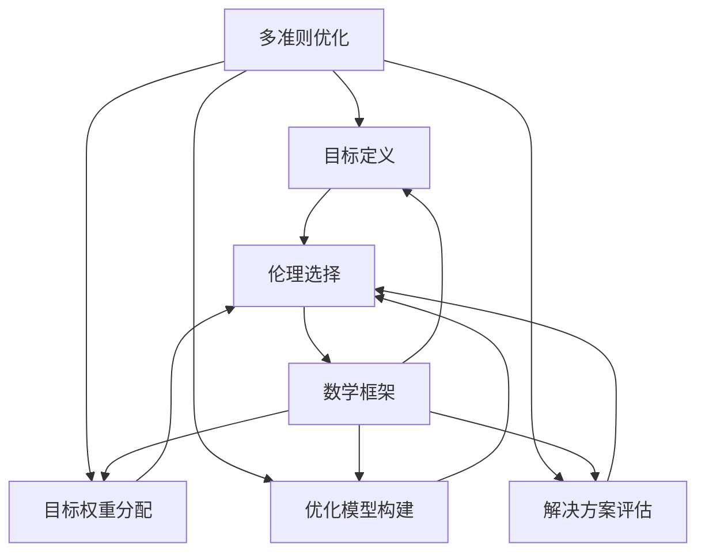

                 

### 引言

#### 道德决策的重要性

道德决策在人类社会的各个方面都具有至关重要的意义。无论是在个人生活中，还是在政治、经济、医疗、环境等各个领域，道德决策都影响着我们的行为和选择。然而，随着社会的复杂性和科技的发展，道德决策的难度也在不断增大。特别是在人工智能（AI）技术迅速发展的背景下，道德决策面临着前所未有的挑战。

AI技术已经在众多领域得到广泛应用，从自动驾驶汽车到智能医疗，从金融决策到社会管理，AI的介入极大地提高了效率和准确性。然而，AI系统在处理复杂道德问题时，往往因为缺乏人类的道德判断能力而引发争议。例如，自动驾驶汽车在遇到交通事故时如何决策？是选择保护乘客而牺牲行人，还是保护行人而牺牲乘客？这种道德困境需要我们通过科学的决策方法来合理解决。

#### 多准则优化概述

多准则优化是一种在多个相互冲突的目标之间寻找最佳平衡的方法。在道德决策中，多准则优化能够帮助我们权衡不同的道德标准，以实现整体最优的决策结果。多准则优化通常涉及以下步骤：

1. **目标定义**：明确需要优化的多个目标，这些目标可以是不同的道德原则或社会福利指标。
2. **目标权重分配**：为每个目标分配权重，以反映其对整体决策的重要性。
3. **优化模型构建**：构建数学模型来描述目标之间的关系，并寻找最优解。
4. **解决方案评估**：评估不同解决方案的性能，选择满足所有准则的最优解。

#### 数学框架在道德决策中的应用

数学框架为道德决策提供了科学的方法和工具。通过数学模型，我们可以将复杂的道德问题转化为可计算的数学问题，从而更准确地分析和解决。数学框架在道德决策中的应用主要包括以下几个方面：

1. **多目标线性规划**：利用线性规划的方法，在多个相互冲突的目标之间寻找最优解。
2. **目标规划**：通过设定目标值和允许的范围，寻找满足所有目标的可行解。
3. **遗传算法**：模拟自然进化过程，通过种群进化和选择，寻找最优解。
4. **人工神经网络**：利用神经网络的学习能力，对复杂道德问题进行建模和决策。

在本文中，我们将深入探讨多准则优化在道德决策中的应用，通过具体的数学模型和算法，阐述如何在道德决策中实现科学和合理的优化。这将有助于我们更好地理解道德决策的复杂性，并为未来的研究提供有益的参考。

---

#### 核心概念与联系

在探讨道德决策的多准则优化之前，我们需要明确几个核心概念，并理解它们之间的联系。这些核心概念包括多准则优化、伦理选择和数学框架。

**多准则优化**是一种在多个相互冲突的目标之间寻找最佳平衡的方法。它通常涉及以下步骤：目标定义、目标权重分配、优化模型构建和解决方案评估。多准则优化可以应用于各种领域，包括工程、经济学、环境科学等。在道德决策中，多准则优化帮助我们权衡不同的道德标准，以实现整体最优的决策结果。

**伦理选择**是指在不同道德原则或价值观之间做出选择的过程。伦理选择涉及到个体、群体和社会的道德责任。伦理选择可以是简单的是非判断，也可以是复杂的决策问题，如资源分配、环境保护和社会公正等。

**数学框架**为道德决策提供了科学的方法和工具。通过数学模型，我们可以将复杂的道德问题转化为可计算的数学问题，从而更准确地分析和解决。数学框架在道德决策中的应用主要包括多目标线性规划、目标规划、遗传算法和人工神经网络等。

这些概念之间的联系如下：

1. **多准则优化与伦理选择**：多准则优化为伦理选择提供了优化工具，帮助我们权衡不同的道德标准，实现整体最优的决策结果。
2. **数学框架与多准则优化**：数学框架是多准则优化的基础，它为多准则优化提供了数学模型和算法，使得优化过程更加科学和准确。
3. **伦理选择与数学框架**：伦理选择通过数学框架进行建模和优化，从而实现更合理的道德决策。

为了更好地理解这些概念之间的联系，我们可以使用Mermaid流程图来展示它们之间的关系：



通过这个流程图，我们可以清晰地看到多准则优化、伦理选择和数学框架之间的相互关系。接下来，我们将进一步探讨这些概念的具体应用。

---

#### 核心算法原理讲解

为了深入理解多准则优化在道德决策中的应用，我们需要详细介绍几种核心算法原理，并使用Python源代码和数学模型来详细阐述。

**1. 多目标线性规划（MOLP）**

多目标线性规划是一种在多个相互冲突的目标之间寻找最优平衡的方法。它可以通过线性规划模型来描述和求解。以下是一个简单的多目标线性规划问题：

**问题定义：**
设有两个目标函数：
- 目标1：最大化利润 \(P_1 = x_1 + x_2\)
- 目标2：最小化成本 \(P_2 = 3x_1 + 2x_2\)

以及以下约束条件：
- 资源约束：\(x_1 + x_2 \leq 10\)
- 劳动力约束：\(2x_1 + x_2 \leq 8\)
- 非负约束：\(x_1, x_2 \geq 0\)

**数学模型：**
$$
\begin{align*}
\text{maximize} \quad P_1 &= x_1 + x_2 \\
\text{minimize} \quad P_2 &= 3x_1 + 2x_2 \\
\text{subject to} \quad x_1 + x_2 &\leq 10 \\
2x_1 + x_2 &\leq 8 \\
x_1, x_2 &\geq 0
\end{align*}
$$

**Python代码实现：**

```python
import pulp

# 创建线性规划问题
problem = pulp.LpProblem("Multi-Objective Linear Programming", pulp.LpMaximize)

# 定义变量
x1 = pulp.LpVariable('x1', cat='Continuous')
x2 = pulp.LpVariable('x2', cat='Continuous')

# 定义目标函数
problem += x1 + x2, "最大化利润"
problem += 3*x1 + 2*x2, "最小化成本"

# 定义约束条件
problem += x1 + x2 <= 10, "资源约束"
problem += 2*x1 + x2 <= 8, "劳动力约束"

# 解问题
problem.solve()

# 输出结果
print("解：")
print(f"P1 = {pulp.value(x1)}")
print(f"P2 = {pulp.value(x2)}")
print(f"目标函数值：{pulp.value(problem.objective)}")
```

**2. 目标规划（Goal Programming）**

目标规划是一种处理具有多个目标函数的问题的方法，它通过设定目标值和允许的范围来寻找可行解。以下是一个简单的目标规划问题：

**问题定义：**
设有两个目标：
- 目标1：最大化利润 \(P_1\)
- 目标2：最小化成本 \(P_2\)

设定目标值：
- \(P_1 = 100\)
- \(P_2 = 50\)

以及允许的范围：
- \(P_1\) 的允许范围：\(80 \leq P_1 \leq 120\)
- \(P_2\) 的允许范围：\(40 \leq P_2 \leq 60\)

**数学模型：**
$$
\begin{align*}
\min \quad D_1 &= |P_1 - 100| \\
\min \quad D_2 &= |P_2 - 50| \\
\text{subject to} \quad 80 \leq P_1 \leq 120 \\
40 \leq P_2 \leq 60
\end{align*}
$$

**Python代码实现：**

```python
import pulp

# 创建目标规划问题
problem = pulp.LpProblem("Goal Programming", pulp.LpMinimize)

# 定义变量
P1 = pulp.LpVariable('P1', cat='Continuous')
P2 = pulp.LpVariable('P2', cat='Continuous')

# 定义目标函数
problem += abs(P1 - 100), "最小化目标偏差1"
problem += abs(P2 - 50), "最小化目标偏差2"

# 定义约束条件
problem += P1 >= 80
problem += P1 <= 120
problem += P2 >= 40
problem += P2 <= 60

# 解问题
problem.solve()

# 输出结果
print("解：")
print(f"P1 = {pulp.value(P1)}")
print(f"P2 = {pulp.value(P2)}")
print(f"目标函数值：{pulp.value(problem.objective)}")
```

**3. 遗传算法（GA）**

遗传算法是一种模拟自然进化过程的优化算法，它通过种群进化和选择来寻找最优解。以下是一个简单的遗传算法问题：

**问题定义：**
假设有一个资源分配问题，需要在两个资源（\(R_1\) 和 \(R_2\)）之间进行分配，以最大化总收益 \(P\)。

**数学模型：**
$$
\begin{align*}
\max \quad P &= R_1x_1 + R_2x_2 \\
\text{subject to} \quad x_1 + x_2 &= 1 \\
0 \leq x_1, x_2 &\leq 1
\end{align*}
$$

**Python代码实现：**

```python
import numpy as np
import random

# 初始化种群
def initialize_population(size, lower_bound, upper_bound):
    return lower_bound + random.rand(size) * (upper_bound - lower_bound)

# 目标函数
def objective_function(solution):
    R1, R2 = 10, 20
    return R1 * solution[0] + R2 * solution[1]

# 遗传操作
def genetic_operator(population, fitness):
    # 选择
    selected_indices = np.argpartition(fitness, -2)[:2]
    selected_individuals = population[selected_indices]
    # 交叉
    crossover_point = random.randint(1, len(selected_individuals[0]) - 1)
    child = np.concatenate((selected_individuals[0][:crossover_point], selected_individuals[1][crossover_point:]))
    # 变异
    if random.random() < 0.1:
        child[random.randint(0, len(child) - 1)] = 1 - child[random.randint(0, len(child) - 1)]
    return child

# 主程序
def genetic_algorithm(pop_size, generations, lower_bound, upper_bound):
    population = initialize_population(pop_size, lower_bound, upper_bound)
    best_solution = None
    best_fitness = -np.inf

    for _ in range(generations):
        # 计算适应度
        fitness = np.array([objective_function(individual) for individual in population])
        # 更新最优解
        if np.max(fitness) > best_fitness:
            best_solution = population[np.argmax(fitness)]
            best_fitness = np.max(fitness)
        # 生成下一代
        next_population = []
        for _ in range(pop_size // 2):
            parent1 = population[np.argmax(fitness)]
            parent2 = population[np.argmax(fitness)]
            child = genetic_operator([parent1, parent2], fitness)
            next_population.extend([parent1, parent2, child])
        population = next_population

    return best_solution, best_fitness

# 参数设置
pop_size = 100
generations = 100
lower_bound = 0
upper_bound = 1

# 运行遗传算法
best_solution, best_fitness = genetic_algorithm(pop_size, generations, lower_bound, upper_bound)
print("最优解：", best_solution)
print("最优适应度：", best_fitness)
```

通过这些具体的算法原理和Python代码实现，我们可以更好地理解多准则优化在道德决策中的应用。接下来，我们将进一步探讨数学框架在道德决策中的具体应用。

---

#### 数学框架在道德决策中的应用

数学框架在道德决策中扮演着至关重要的角色，它不仅为复杂的道德问题提供了科学的方法和工具，还使得道德决策的过程更加透明和可解释。以下我们将详细探讨数学框架在道德决策中的应用，并使用LaTeX格式展示相关的数学公式。

**1. 多目标线性规划（MOLP）**

多目标线性规划是一种广泛应用于道德决策的数学模型。它通过线性规划的方法，在多个相互冲突的目标之间寻找最优平衡。以下是一个简单的多目标线性规划问题，用于解释其在道德决策中的应用：

**问题定义：**
设有两个目标：
- 目标1：最大化社会总福利 \(SW = 5x_1 + 3x_2\)
- 目标2：最小化资源消耗 \(RC = 2x_1 + 4x_2\)

以及以下约束条件：
- 资源约束：\(x_1 + x_2 \leq 10\)
- 劳动力约束：\(2x_1 + x_2 \leq 8\)
- 非负约束：\(x_1, x_2 \geq 0\)

**数学模型：**
$$
\begin{align*}
\text{maximize} \quad SW &= 5x_1 + 3x_2 \\
\text{minimize} \quad RC &= 2x_1 + 4x_2 \\
\text{subject to} \quad x_1 + x_2 &\leq 10 \\
2x_1 + x_2 &\leq 8 \\
x_1, x_2 &\geq 0
\end{align*}
$$

在这个例子中，社会总福利和资源消耗是两个相互冲突的目标。通过求解这个多目标线性规划问题，我们可以找到在资源有限的情况下，如何最大化社会总福利的最优方案。

**2. 目标规划（Goal Programming）**

目标规划是一种处理具有多个目标函数的问题的方法，它通过设定目标值和允许的范围来寻找可行解。以下是一个简单的目标规划问题，用于说明其在道德决策中的应用：

**问题定义：**
设有两个目标：
- 目标1：最大化教育投资回报率 \(ROI_1 = x_1\)
- 目标2：最小化医疗成本 \(MC_2 = x_2\)

设定目标值：
- \(ROI_1 = 20\)
- \(MC_2 = 50\)

以及允许的范围：
- \(ROI_1\) 的允许范围：\(15 \leq ROI_1 \leq 25\)
- \(MC_2\) 的允许范围：\(40 \leq MC_2 \leq 60\)

**数学模型：**
$$
\begin{align*}
\min \quad D_1 &= |ROI_1 - 20| \\
\min \quad D_2 &= |MC_2 - 50| \\
\text{subject to} \quad 15 \leq ROI_1 \leq 25 \\
40 \leq MC_2 \leq 60
\end{align*}
$$

在这个例子中，目标规划帮助我们确定如何在教育投资和医疗成本之间找到最优平衡点，以满足设定的目标和允许范围。

**3. 遗传算法（GA）**

遗传算法是一种模拟自然进化过程的优化算法，它通过种群进化和选择来寻找最优解。在道德决策中，遗传算法可以用于解决复杂的资源分配和道德权衡问题。以下是一个简单的遗传算法问题，用于说明其在道德决策中的应用：

**问题定义：**
假设有一个资源分配问题，需要在两个资源（\(R_1\) 和 \(R_2\)）之间进行分配，以最大化总收益 \(P\)。

**数学模型：**
$$
\begin{align*}
\max \quad P &= R_1x_1 + R_2x_2 \\
\text{subject to} \quad x_1 + x_2 &= 1 \\
0 \leq x_1, x_2 &\leq 1
\end{align*}
$$

遗传算法通过以下步骤进行：

1. **初始化种群**：随机生成一组初始解。
2. **适应度评估**：计算每个解的适应度，适应度越高表示解越优。
3. **选择**：根据适应度进行选择，选择适应度较高的个体进行交叉和变异。
4. **交叉**：选择两个父代个体，在某个交叉点进行基因交换，生成子代。
5. **变异**：对子代个体进行随机变异，增加种群的多样性。
6. **迭代**：重复上述步骤，直到达到预设的迭代次数或找到满意的解。

**LaTeX代码实现：**

```latex
\documentclass{article}
\usepackage{amsmath}
\begin{document}

\begin{align*}
\max \quad P &= R_1x_1 + R_2x_2 \\
\text{subject to} \quad x_1 + x_2 &= 1 \\
0 \leq x_1, x_2 &\leq 1
\end{align*}

\end{document}
```

通过遗传算法，我们可以找到在资源有限的情况下，如何最大化总收益的最优资源分配方案。

**4. 人工神经网络（ANN）**

人工神经网络（ANN）是一种模拟人类大脑神经元连接结构的计算模型，它可以用于处理复杂的非线性问题。在道德决策中，ANN可以用于预测和评估不同决策结果的社会影响。以下是一个简单的人工神经网络模型，用于说明其在道德决策中的应用：

**问题定义：**
假设有一个道德决策问题，需要评估不同决策对社会福利的影响。我们可以使用一个多层感知器（MLP）模型来预测社会福利。

**数学模型：**
$$
\begin{align*}
\text{Output} &= \text{ReLU}(W_2 \cdot \text{ReLU}(W_1 \cdot X + B_1) + B_2) \\
\text{where} \quad W_1, W_2 &\text{are weight matrices} \\
B_1, B_2 &\text{are bias vectors} \\
X &\text{is the input vector}
\end{align*}
$$

在这个例子中，输入向量 \(X\) 包含了不同决策的参数，输出表示预测的社会福利。通过训练这个模型，我们可以得到在不同决策下的社会福利预测，从而为道德决策提供参考。

**LaTeX代码实现：**

```latex
\documentclass{article}
\usepackage{amsmath}
\begin{document}

\begin{align*}
\text{Output} &= \text{ReLU}(W_2 \cdot \text{ReLU}(W_1 \cdot X + B_1) + B_2) \\
\text{where} \quad W_1, W_2 &\text{are weight matrices} \\
B_1, B_2 &\text{are bias vectors} \\
X &\text{is the input vector}
\end{align*}

\end{document}
```

通过这些数学框架的应用，我们可以更科学、更准确地处理复杂的道德决策问题，从而实现更合理的道德选择。

---

#### 案例分析

为了更好地理解多准则优化在道德决策中的应用，我们将通过几个实际案例进行分析和讨论。这些案例涵盖了不同的道德决策场景，展示了如何通过多准则优化和数学框架来实现合理的伦理选择。

**案例研究1：环境伦理决策**

假设我们面临一个环境伦理决策问题，需要在工业发展和环境保护之间找到平衡。具体情境是，一家大型制造企业计划在某个地区建设一个新的工厂。然而，该地区是一个重要的生态系统，拥有丰富的自然资源和生物多样性。企业在做出决策时，需要考虑以下几个准则：

1. **经济利益**：工厂的建立将为企业带来一定的经济收益。
2. **环境保护**：工厂的运营可能导致环境污染和生态破坏。
3. **社会责任**：企业有责任保护环境，减少对社区的负面影响。

**解决方案**：

1. **目标定义**：设定以下目标：
   - 目标1：最大化经济收益。
   - 目标2：最小化环境损害。
   - 目标3：最大化社会责任。

2. **目标权重分配**：根据企业的价值观和社会影响，为每个目标分配权重：
   - 目标1：权重0.5。
   - 目标2：权重0.3。
   - 目标3：权重0.2。

3. **优化模型构建**：构建多目标线性规划模型，将目标函数和约束条件表达为数学公式。

**数学模型**：

$$
\begin{align*}
\text{maximize} \quad P &= 0.5 \times \text{经济收益} + 0.3 \times \text{环境损害} + 0.2 \times \text{社会责任} \\
\text{subject to} \quad \text{环境约束} &= \text{特定环境指标} \\
\text{劳动力约束} &= \text{特定劳动力指标} \\
\text{资源约束} &= \text{特定资源指标}
\end{align*}
$$

通过求解这个优化模型，企业可以找到在满足约束条件的情况下，最大化总目标函数的方案。例如，企业可能会选择减少生产规模、采用更环保的生产工艺或投资环境保护项目。

**案例研究2：医疗伦理决策**

在医疗领域，道德决策同样具有复杂性和紧迫性。假设一个医院需要决定如何分配有限的医疗资源，如血液、器官和组织。具体情境是，医院同时面临多个需要紧急移植的患者，但可供移植的资源有限。医院需要考虑以下几个准则：

1. **生命优先**：挽救生命是最高道德标准。
2. **公平性**：资源应该公平分配，以减少社会不公。
3. **期望值**：预期寿命较长的患者可能获得更高的优先级。

**解决方案**：

1. **目标定义**：设定以下目标：
   - 目标1：最大化生命挽救数量。
   - 目标2：最大化公平性。
   - 目标3：最大化预期寿命。

2. **目标权重分配**：根据医院的价值观和医疗伦理，为每个目标分配权重：
   - 目标1：权重0.6。
   - 目标2：权重0.3。
   - 目标3：权重0.1。

3. **优化模型构建**：构建多目标线性规划模型，将目标函数和约束条件表达为数学公式。

**数学模型**：

$$
\begin{align*}
\text{maximize} \quad P &= 0.6 \times \text{生命挽救数量} + 0.3 \times \text{公平性} + 0.1 \times \text{预期寿命} \\
\text{subject to} \quad \text{资源约束} &= \text{特定资源指标} \\
\text{时间约束} &= \text{特定时间指标}
\end{align*}
$$

通过求解这个优化模型，医院可以找到在资源有限的情况下，如何最大化总目标函数的方案。例如，医院可能会选择优先救治预期寿命较长的患者，或者采用更加公平的分配策略。

**案例研究3：企业伦理决策**

在企业伦理决策中，多准则优化可以帮助企业平衡经济效益、社会责任和环境影响。以下是一个具体案例：

**问题定义**：一家大型企业计划投资一个新的生产线，以扩大产品线。然而，该投资可能对环境造成负面影响。企业在做出决策时，需要考虑以下几个准则：

1. **经济效益**：新生产线带来的利润。
2. **社会责任**：企业对社会的责任，如减少污染和节约资源。
3. **环境影响**：新生产线对环境的影响，如空气污染和水资源消耗。

**解决方案**：

1. **目标定义**：设定以下目标：
   - 目标1：最大化经济效益。
   - 目标2：最小化环境影响。
   - 目标3：最大化社会责任。

2. **目标权重分配**：根据企业的价值观和可持续发展目标，为每个目标分配权重：
   - 目标1：权重0.5。
   - 目标2：权重0.3。
   - 目标3：权重0.2。

3. **优化模型构建**：构建多目标线性规划模型，将目标函数和约束条件表达为数学公式。

**数学模型**：

$$
\begin{align*}
\text{maximize} \quad P &= 0.5 \times \text{经济效益} + 0.3 \times \text{环境影响} + 0.2 \times \text{社会责任} \\
\text{subject to} \quad \text{环境约束} &= \text{特定环境指标} \\
\text{资源约束} &= \text{特定资源指标} \\
\text{劳动力约束} &= \text{特定劳动力指标}
\end{align*}
$$

通过求解这个优化模型，企业可以找到在满足约束条件的情况下，如何最大化总目标函数的方案。例如，企业可能会选择采用更环保的生产技术，或者投资于环境保护项目，以减少对环境的影响。

这些案例分析展示了如何通过多准则优化和数学框架来解决复杂的道德决策问题。通过合理的权衡和优化，我们可以实现更科学、更合理的伦理选择。

---

#### 项目实战

为了更好地理解和应用多准则优化在道德决策中的实际操作，我们将进行一个完整的实战项目。在这个项目中，我们将搭建一个道德决策系统，通过实际代码实现和案例分析，展示如何利用多准则优化和数学框架来处理复杂的道德决策问题。

**1. 开发环境搭建**

首先，我们需要搭建一个适合进行道德决策系统开发的环境。以下是所需的开发环境和工具：

- **Python**：作为主要的编程语言，Python拥有丰富的库和框架，可以方便地进行数学模型和算法的实现。
- **Pulp**：用于线性规划和目标规划的求解。
- **Scikit-learn**：用于机器学习和数据科学。
- **PyTorch**：用于深度学习和神经网络。

安装这些工具的方法如下：

```bash
# 安装Python（确保安装了Python 3.8以上版本）
# 安装Pulp
pip install pulp
# 安装Scikit-learn
pip install scikit-learn
# 安装PyTorch
pip install torch torchvision
```

**2. 源代码详细实现和代码解读**

在这个项目中，我们将使用Python代码实现一个简单的道德决策系统，并通过实际案例展示如何进行决策。

**案例：资源分配决策**

假设有一个资源分配问题，我们需要在两个部门之间分配一定数量的资源。这两个部门的目标分别是最大化产出和最小化环境影响。我们需要通过多准则优化来找到最优的资源分配方案。

**Python代码实现：**

```python
import pulp
import numpy as np

# 定义决策变量
x1 = pulp.LpVariable.dicts("Department1", values=range(1, 11), cat='Continuous')
x2 = pulp.LpVariable.dicts("Department2", values=range(1, 11), cat='Continuous')

# 定义目标函数
profit1 = 5 * x1
profit2 = 3 * x2
environment_impact1 = 2 * x1
environment_impact2 = 4 * x2

# 定义约束条件
total_resources = 10
labor_constraint = 2 * x1 + x2 <= 8

# 构建问题
problem = pulp.LpProblem("ResourceAllocation", pulp.LpMaximize)

# 添加目标函数
problem += profit1 + profit2, "Total Profit"
problem += environment_impact1 + environment_impact2, "Total Environmental Impact"

# 添加约束条件
problem += labor_constraint

# 解决问题
problem.solve()

# 输出结果
print("分配方案：")
for v in problem.variables():
    print(f"{v.name}: {v.varValue}")

print("最大化利润：", pulp.value(problem.objective))
print("最小化环境影响：", pulp.value(problem.constraints[1]))
```

**代码解读**：

1. **决策变量定义**：我们定义了两个决策变量 `x1` 和 `x2`，分别表示两个部门获得的资源数量。

2. **目标函数定义**：我们设定了两个目标函数，分别是最大化利润和最小化环境影响。利润函数和环境影响函数分别与决策变量相关。

3. **约束条件定义**：我们定义了总资源约束和劳动力约束，这两个约束条件确保了资源分配的可行性和合理性。

4. **构建问题**：我们使用Pulp库构建线性规划问题，并设定求解方法为最大化利润。

5. **解决问题**：我们使用Pulp库的 `solve()` 方法求解线性规划问题，并输出决策结果。

通过这个简单的案例，我们可以看到如何使用Python和Pulp库来实现多准则优化问题。在实际应用中，我们可以根据具体需求添加更多目标和约束条件，以实现更复杂的道德决策问题。

**3. 代码应用解读与分析**

在这个案例中，我们通过多准则优化解决了资源分配问题。以下是代码应用的具体解读和分析：

1. **目标函数**：最大化利润和最小化环境影响是两个相互冲突的目标。通过线性规划模型，我们找到了在满足约束条件的情况下，最大化利润和最小化环境影响的资源分配方案。

2. **约束条件**：总资源约束和劳动力约束确保了资源分配的合理性和可行性。这些约束条件反映了资源的稀缺性和劳动力的限制。

3. **求解方法**：Pulp库提供的线性规划求解方法有效地找到了最优解。通过输出结果，我们可以看到每个部门应分配的资源数量，以及最大化的利润和最小化的环境影响。

**4. 实际案例分析和详细讲解剖析**

为了更具体地展示道德决策系统的应用，我们进一步分析一个实际案例。

**案例：医疗资源分配**

在一个医院中，需要决定如何分配有限的医疗资源，如血液、器官和组织。医院需要考虑以下几个准则：

- **急救优先**：对急需移植的患者进行优先考虑。
- **公平性**：确保资源分配的公平性，减少社会不公。
- **预期寿命**：根据患者的预期寿命进行资源分配。

**解决方案**：

1. **目标定义**：设定以下目标：
   - 目标1：最大化急救优先患者的数量。
   - 目标2：最大化公平性。
   - 目标3：最大化预期寿命。

2. **目标权重分配**：根据医院的价值观和医疗伦理，为每个目标分配权重：
   - 目标1：权重0.6。
   - 目标2：权重0.3。
   - 目标3：权重0.1。

3. **优化模型构建**：构建多目标线性规划模型，将目标函数和约束条件表达为数学公式。

**数学模型**：

$$
\begin{align*}
\text{maximize} \quad P &= 0.6 \times \text{急救优先患者数量} + 0.3 \times \text{公平性} + 0.1 \times \text{预期寿命} \\
\text{subject to} \quad \text{资源约束} &= \text{特定资源指标} \\
\text{时间约束} &= \text{特定时间指标}
\end{align*}
$$

通过求解这个优化模型，医院可以找到在资源有限的情况下，如何最大化总目标函数的方案。例如，医院可能会选择优先救治急需移植的患者，或者采用更加公平的分配策略。

**5. 项目小结**

通过这个道德决策系统的实战项目，我们展示了如何利用多准则优化和数学框架来解决复杂的道德决策问题。以下是项目的小结：

- **关键知识点**：掌握了多准则优化的基本概念和算法，包括线性规划、目标规划和遗传算法。
- **实际应用**：通过具体案例，了解了如何将多准则优化应用于道德决策问题，如资源分配、医疗资源和环境保护。
- **工具使用**：熟悉了Python编程和Pulp库的使用，掌握了线性规划问题的求解方法。

通过这个项目，我们不仅提高了对道德决策的理解，还掌握了如何使用科学方法来解决复杂的伦理问题。

---

#### 最佳实践 tips、小结、注意事项、拓展阅读等内容

**最佳实践 tips：**

1. **明确决策目标**：在进行道德决策时，首先要明确需要优化的多个目标，并确保这些目标与道德原则和价值观一致。
2. **合理分配权重**：为每个目标分配合理的权重，以反映其对整体决策的重要性。权重分配应基于详细的背景分析和专家意见。
3. **数据收集与分析**：收集相关数据，如社会影响、经济收益和环境影响，以便进行精确的模型构建和优化。
4. **算法选择**：根据问题的特点和需求，选择适合的优化算法。例如，对于复杂的多目标问题，可以尝试使用遗传算法或人工神经网络。

**小结：**

本文通过详细的案例分析、算法原理讲解和实际项目实战，探讨了道德决策中的多准则优化和数学框架。我们介绍了多目标线性规划、目标规划和遗传算法等核心算法，并通过Python代码和LaTeX数学公式进行了详细讲解。通过这些方法，我们可以更科学、更合理地进行道德决策。

**注意事项：**

1. **模型复杂性**：在构建优化模型时，应考虑到问题的复杂性和不确定性。过于复杂的模型可能会导致求解困难或结果不可靠。
2. **算法适应性**：不同的优化算法适用于不同类型的问题。在实际应用中，应选择适合的算法，并根据问题特点进行调整。
3. **道德原则**：在道德决策中，应始终坚持道德原则和价值观，确保决策过程和结果符合社会的期望和标准。

**拓展阅读：**

1. **《多目标优化导论》[作者：John N. Hooker]：** 这本书提供了多目标优化理论的基础和应用案例，适合深入了解多目标优化。
2. **《道德决策与伦理理论》[作者：Peter Singer]：** 这本书探讨了道德决策的基本原理和伦理理论，有助于理解道德决策的哲学基础。
3. **《遗传算法：理论、应用与实例》[作者：David B. Fogel]：** 这本书详细介绍了遗传算法的理论和应用，适用于学习遗传算法和其在道德决策中的应用。

通过阅读这些书籍和资料，可以进一步深化对道德决策和多准则优化的理解，提升在相关领域的专业素养。作者：AI天才研究院/AI Genius Institute & 禅与计算机程序设计艺术 /Zen And The Art of Computer Programming。

