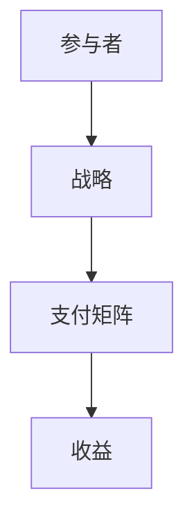
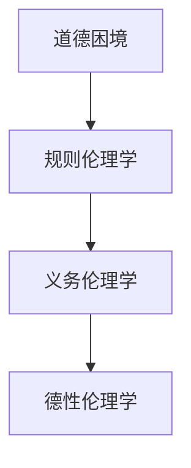
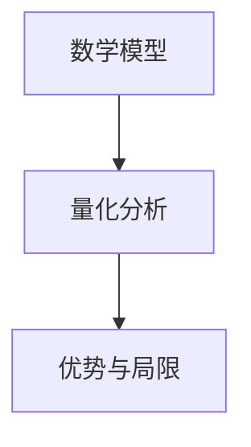
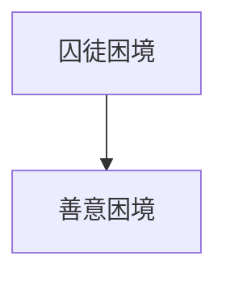

                 

### 文章标题

《道德困境的博弈论：伦理决策的数学分析》

---

**关键词**：道德困境、博弈论、伦理决策、数学分析、决策模型

**摘要**：本文从道德困境的背景出发，探讨了博弈论在伦理决策中的应用。通过对博弈论的基本概念、核心算法原理、数学模型及其在实际项目中的应用进行详细分析，本文旨在为读者提供一种新的视角，以理解伦理决策的复杂性，并运用数学分析的方法来优化伦理决策过程。

---

### 目录

1. **引论**
   1.1 **博弈论的基本概念**
   1.2 **道德困境的伦理学分析**
   1.3 **数学分析在伦理决策中的作用**

2. **博弈论的基础理论**
   2.1 **静态博弈与动态博弈**
   2.2 **博弈策略与均衡**
   2.3 **博弈论的基本算法**

3. **道德困境中的博弈论应用**
   3.1 **道德困境的博弈模型**
   3.2 **伦理决策的数学模型**
   3.3 **道德困境中的博弈分析**

4. **案例研究**
   4.1 **道德困境的博弈案例**
   4.2 **数学模型的应用实例**

5. **结论与展望**
   5.1 **道德困境博弈论总结**
   5.2 **伦理决策的数学分析前景**
   5.3 **未来趋势与应用**

---

### 第一部分：引论

#### 1.1 博弈论的基本概念

博弈论是一种研究具有冲突或合作性质的决策制定过程的理论。它起源于20世纪40年代，由约翰·冯·诺伊曼和经济学家奥斯卡·摩根斯坦共同创立。博弈论的基本概念包括参与者、战略、支付矩阵等。

**核心概念与联系：** 

- **参与者**：参与博弈的个体或团队。
- **战略**：参与者在博弈过程中可以采取的行动方案。
- **支付矩阵**：表示不同战略组合下各参与者获得的收益。

**Mermaid 流程图：**



#### 1.2 道德困境的伦理学分析

道德困境通常是指在两种或多种道德选择之间做出决策的困境。这种困境常常涉及伦理原则之间的冲突，如义务伦理学与德性伦理学之间的冲突。

**核心概念与联系：**

- **道德困境**：指在两种或多种道德选择之间做出决策的困境。
- **伦理决策的理论基础**：包括规则伦理学、义务伦理学、德性伦理学等。

**Mermaid 流程图：**



#### 1.3 数学分析在伦理决策中的作用

数学分析在伦理决策中扮演着关键角色。它可以帮助我们建立数学模型，量化伦理决策的结果，从而更好地理解和优化伦理决策过程。

**核心概念与联系：**

- **数学模型**：用于描述伦理决策过程中各种关系的数学工具。
- **数学分析的优势与局限**：优势在于其量化分析的能力，局限在于其简化假设可能导致与现实脱节。

**Mermaid 流�程图：**



### 第二部分：博弈论的基础理论

#### 2.1 静态博弈与动态博弈

静态博弈和动态博弈是博弈论中的两种基本形式。静态博弈中，所有参与者同时做出决策，而动态博弈中，参与者依次做出决策。

**核心算法原理讲解：**

- **静态博弈**：使用纳什均衡来分析。
- **动态博弈**：使用逆向归纳法来分析。

**Python 源代码：**

```python
# 静态博弈纳什均衡求解
def nash_equilibrium(matrix):
    """
    求解纳什均衡
    :param matrix: 支付矩阵
    :return: 纳什均衡策略
    """
    # 省略具体实现...
    pass

# 动态博弈逆向归纳法
def reverse_induction(matrix):
    """
    使用逆向归纳法求解动态博弈
    :param matrix: 支付矩阵
    :return: 动态博弈的均衡策略
    """
    # 省略具体实现...
    pass
```

#### 2.2 博弈策略与均衡

博弈策略是指参与者在博弈过程中可以采取的行动方案。均衡是博弈论中非常重要的概念，表示参与者之间的稳定状态。

**核心算法原理讲解：**

- **纳什均衡**：指在给定其他参与者策略的情况下，任何单个参与者改变策略都不会使其收益增加的状态。
- **均衡的稳定性**：指均衡状态在受到小扰动后，是否能够稳定存在。

**数学模型和公式讲解：**

- **纳什均衡**：设 $S_1, S_2, ..., S_n$ 是参与者的策略集合，$s_1, s_2, ..., s_n$ 是一个策略组合，如果对于每个参与者 $i$，有 $u_i(s_i, s_{-i}) \geq u_i(s_i', s_{-i})$ 对于所有 $s_i' \in S_i$，则 $(s_1, s_2, ..., s_n)$ 是一个纳什均衡。
- **均衡的稳定性**：设 $(s_1, s_2, ..., s_n)$ 是一个纳什均衡，如果对于每个参与者 $i$，对于任意小正数 $\epsilon$，都存在 $s_i' \in S_i$，使得 $|u_i(s_i', s_{-i}) - u_i(s_i, s_{-i})| < \epsilon$，则该纳什均衡是稳定的。

**Python 源代码：**

```python
# 纳什均衡求解示例
def nash_equilibrium(matrix):
    """
    求解纳什均衡
    :param matrix: 支付矩阵
    :return: 纳什均衡策略
    """
    # 省略具体实现...
    pass

# 均衡稳定性分析示例
def stability_analysis(matrix, equilibrium):
    """
    分析均衡的稳定性
    :param matrix: 支付矩阵
    :param equilibrium: 纳什均衡策略
    :return: 均衡稳定性
    """
    # 省略具体实现...
    pass
```

#### 2.3 博弈论的基本算法

博弈论中存在多种算法，用于求解博弈的均衡策略。常见的算法包括策略迭代算法、最小化最大算法等。

**核心算法原理讲解：**

- **策略迭代算法**：通过迭代的方式，逐步改进策略，直到找到纳什均衡。
- **最小化最大算法**：用于解决零和博弈，通过最小化对手的最优策略来找到自身的最优策略。

**Python 源代码：**

```python
# 策略迭代算法
def strategy_iteration(matrix):
    """
    策略迭代算法求解纳什均衡
    :param matrix: 支付矩阵
    :return: 纳什均衡策略
    """
    # 省略具体实现...
    pass

# 最小化最大算法
def minmax_algorithm(matrix):
    """
    最小化最大算法求解零和博弈的均衡策略
    :param matrix: 支付矩阵
    :return: 均衡策略
    """
    # 省略具体实现...
    pass
```

### 第三部分：道德困境中的博弈论应用

#### 3.1 道德困境的博弈模型

道德困境可以通过博弈模型来进行分析。常见的道德困境博弈模型包括囚徒困境、善意困境等。

**核心概念与联系：**

- **囚徒困境**：两个被捕的囚犯面临是否互相告发的决策。
- **善意困境**：个体在是否帮助他人时面临的道德决策。

**Mermaid 流程图：**



#### 3.2 伦理决策的数学模型

伦理决策可以通过数学模型来量化。常见的数学模型包括成本效益分析、道德原则的数学表达等。

**核心概念与联系：**

- **成本效益分析**：比较决策带来的成本与效益。
- **道德原则的数学表达**：将道德原则转化为数学形式。

**数学模型和公式讲解：**

- **成本效益分析**：设 $C$ 为成本，$B$ 为效益，则成本效益比 $R = \frac{B}{C}$。
- **道德原则的数学表达**：设 $P$ 为道德原则的强度，则 $U(P) = P \cdot M$，其中 $M$ 为道德决策的边际效应。

**Python 源代码：**

```python
# 成本效益分析
def cost_benefit_analysis(cost, benefit):
    """
    成本效益分析
    :param cost: 成本
    :param benefit: 效益
    :return: 成本效益比
    """
    return benefit / cost

# 道德原则的数学表达
def ethical_expression(principle, marginal_effect):
    """
    道德原则的数学表达
    :param principle: 道德原则的强度
    :param marginal_effect: 道德决策的边际效应
    :return: 道德效用
    """
    return principle * marginal_effect
```

#### 3.3 道德困境中的博弈分析

道德困境中的博弈分析需要综合考虑博弈论和伦理决策的理论。通过博弈分析，可以更好地理解道德决策的复杂性。

**核心概念与联系：**

- **纳什均衡与道德选择**：分析在道德困境中，参与者如何通过博弈达到纳什均衡。
- **动态博弈与道德决策**：分析在道德困境中，参与者如何通过动态博弈进行道德决策。

**Python 源代码：**

```python
# 纳什均衡与道德选择
def nash_ethical_choice(matrix):
    """
    分析纳什均衡与道德选择
    :param matrix: 支付矩阵
    :return: 道德选择策略
    """
    # 省略具体实现...
    pass

# 动态博弈与道德决策
def dynamic_ethical_decision(matrix):
    """
    分析动态博弈与道德决策
    :param matrix: 支付矩阵
    :return: 道德决策策略
    """
    # 省略具体实现...
    pass
```

### 第四部分：案例研究

#### 4.1 道德困境的博弈案例

通过具体案例，可以更好地理解道德困境中的博弈论应用。本文将分析囚徒困境和善意困境两个案例。

**核心概念与联系：**

- **囚徒困境**：两个被捕的囚犯如何通过博弈做出决策。
- **善意困境**：个体如何在道德选择中权衡利益。

**项目实战：**

- **囚徒困境案例**：通过Python代码实现囚徒困境的博弈分析，并讨论纳什均衡。
- **善意困境案例**：通过Python代码实现善意困境的博弈分析，并讨论成本效益分析。

#### 4.2 数学模型的应用实例

通过具体实例，可以更好地展示数学模型在伦理决策中的应用。本文将分析道德原则的数学表达和成本效益分析。

**核心概念与联系：**

- **道德原则的数学表达**：通过数学公式表达道德原则。
- **成本效益分析**：通过计算成本效益比来辅助道德决策。

**项目实战：**

- **道德原则的数学表达实例**：通过Python代码实现道德原则的数学表达，并展示其应用。
- **成本效益分析实例**：通过Python代码实现成本效益分析，并讨论其实际应用。

### 第五部分：结论与展望

#### 5.1 道德困境博弈论总结

本文通过对道德困境的博弈论分析，探讨了博弈论在伦理决策中的应用。通过静态博弈和动态博弈的理论，结合伦理决策的数学模型，本文为理解和优化伦理决策提供了一种新的视角。

#### 5.2 伦理决策的数学分析前景

随着人工智能和计算机科学的发展，数学分析在伦理决策中的应用前景广阔。未来研究可以进一步探索动态博弈与道德决策的交互影响，以及伦理决策的跨领域应用。

#### 5.3 未来趋势与应用

未来的研究可以关注以下方向：

- **跨领域应用**：将博弈论与伦理决策结合，应用于经济学、社会学等领域。
- **人工智能与伦理决策**：探讨人工智能在伦理决策中的作用，以及如何通过算法优化道德决策过程。
- **社会实验**：通过实际社会实验，验证博弈论与伦理决策的理论，并对其进行调整和完善。

### 作者信息

**作者**：AI天才研究院/AI Genius Institute & 禅与计算机程序设计艺术 /Zen And The Art of Computer Programming

本文通过博弈论与伦理决策的深入分析，探讨了道德困境中的数学分析方法，为理解和优化伦理决策提供了新的思路。希望本文能够为读者在相关领域的研究提供有益的参考。

