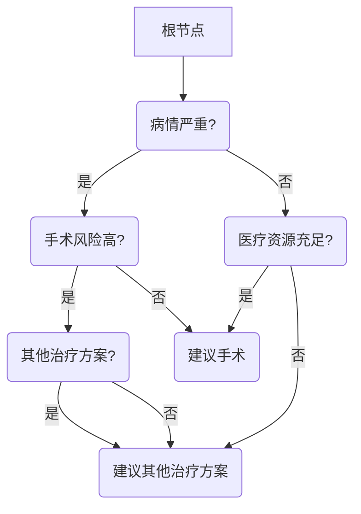

                 

# 《道德机器人的决策树：伦理判断的数学算法》

关键词：道德机器人，决策树，伦理判断，数学算法

摘要：随着人工智能技术的发展，道德机器人的研究逐渐成为热点。本文将从道德机器人的定义与背景出发，介绍伦理学基础，深入探讨决策树的数学原理，最终分析道德机器人的实现与应用，旨在为读者提供一个全面而深入的道德机器人研究视角。

## 第一部分：引言

### 第1章：道德机器人的概念与背景

#### 1.1 道德机器人的定义与作用

道德机器人是一种集成了伦理决策能力的智能系统，能够在特定的伦理环境中进行自主决策，以符合人类的道德标准。道德机器人在医疗、交通、金融等领域的应用日益广泛，它们能够辅助人类进行复杂的伦理判断，提高决策的公正性和效率。

#### 1.2 伦理判断的重要性

伦理判断是道德机器人的核心功能，它决定了道德机器人是否能够正确地执行任务。在人工智能时代，伦理判断的准确性和公正性至关重要，它直接影响到人工智能系统的社会影响和接受度。

#### 1.3 数学算法在伦理判断中的应用

数学算法在伦理判断中发挥着关键作用。通过使用决策树、神经网络等算法，道德机器人能够从大量数据中学习伦理规则，并进行复杂的伦理判断。本文将重点探讨决策树算法在伦理判断中的应用。

## 第二部分：伦理学基础

### 第2章：伦理学基础

#### 2.1 常见伦理理论介绍

常见的伦理理论包括功利主义、康德伦理学、美德伦理学等。这些理论为我们理解和构建道德机器人的伦理决策提供了理论基础。

#### 2.2 道德原则与准则

道德原则和准则是道德机器人在进行伦理判断时需要遵循的基本规则。这些规则包括尊重个人权利、避免伤害、追求公正等。

#### 2.3 道德困境与道德判断

道德困境是道德机器人在实际应用中经常遇到的情境，如生命价值、资源分配等。本文将讨论道德困境中的道德判断问题，并探讨如何通过决策树算法解决这些困境。

## 第二部分：决策树的数学原理

### 第3章：决策树的基本概念

#### 3.1 决策树的构成

决策树由节点和有向边组成，每个节点代表一个特征或属性，有向边代表特征之间的关系。

#### 3.2 决策树的生成

决策树的生成过程包括特征选择、特征分割和树构建。本文将介绍常用的ID3算法、C4.5算法等。

#### 3.3 决策树的剪枝

决策树的剪枝是为了避免过拟合和增加模型的泛化能力。本文将介绍剪枝的原理和方法。

## 第三部分：决策树在伦理判断中的应用

### 第4章：决策树算法的数学原理

#### 4.1 信息论与熵的概念

信息论和熵的概念是理解决策树算法的重要基础。本文将介绍信息熵、条件熵等概念。

#### 4.2 ID3算法

ID3算法是一种基于信息增益的决策树生成算法。本文将详细阐述ID3算法的原理和实现。

#### 4.3 C4.5算法

C4.5算法是一种基于信息增益率的决策树生成算法。本文将介绍C4.5算法的原理和实现。

#### 4.4 C5.0算法

C5.0算法是C4.5算法的升级版本，它在剪枝和特征选择方面进行了改进。本文将介绍C5.0算法的原理和实现。

### 第5章：决策树在伦理判断中的应用

#### 5.1 道德机器人的决策树框架

本文将介绍道德机器人的决策树框架，包括输入层、决策层和输出层。

#### 5.2 案例分析

本文将通过具体案例展示决策树算法在伦理判断中的应用。

#### 5.3 决策树的局限性

本文将讨论决策树算法在伦理判断中的局限性，并探讨可能的解决方案。

## 第三部分：道德机器人的实现

### 第6章：道德机器人的设计原则

#### 6.1 道德机器人的架构

本文将介绍道德机器人的架构，包括数据层、模型层和应用层。

#### 6.2 道德机器人的数据源

本文将讨论道德机器人的数据源，包括数据采集、预处理和标注等。

#### 6.3 道德机器人的训练与测试

本文将介绍道德机器人的训练与测试方法，包括训练数据的准备、模型的训练和测试。

### 第7章：道德机器人的应用与挑战

#### 7.1 道德机器人在实际应用中的案例

本文将介绍道德机器人在实际应用中的案例，如医疗决策、交通管理等。

#### 7.2 道德机器人的伦理争议

本文将讨论道德机器人在伦理方面面临的争议，如隐私保护、算法偏见等。

#### 7.3 道德机器人的未来发展方向

本文将探讨道德机器人的未来发展方向，包括技术进步、伦理规范等。

## 附录

### A.1 决策树算法的Mermaid流程图

### A.2 决策树算法的伪代码实现

### A.3 数学模型和数学公式解释

### A.4 代码实现与分析示例

## 作者信息

作者：AI天才研究院/AI Genius Institute & 禅与计算机程序设计艺术 /Zen And The Art of Computer Programming

---

由于字数限制，本文无法直接撰写完整的内容。但以上提供了一个详细的目录大纲，每个章节可以进一步扩展为具体的文章内容。以下是部分章节的初步内容，供参考。

### 第1章：道德机器人的概念与背景

#### 1.1 道德机器人的定义与作用

道德机器人是一种具备伦理决策能力的智能系统，能够在特定的伦理环境中进行自主决策。其定义通常包含以下几个方面：

1. **伦理决策能力**：道德机器人必须具备识别和评估伦理问题、做出道德决策的能力。
2. **智能系统**：道德机器人是基于人工智能技术构建的系统，包括计算机算法、数据库、网络通信等组成部分。
3. **特定伦理环境**：道德机器人的决策需要在一个具体的伦理环境中进行，这个环境可以是医疗、交通、金融等。

道德机器人在实际应用中具有重要作用，例如：

- **医疗决策**：在医疗领域，道德机器人可以帮助医生进行伦理评估，如器官捐赠、紧急手术等决策。
- **交通管理**：在交通领域，道德机器人可以辅助自动驾驶系统进行道路决策，如避让行人、车辆优先级等。
- **金融决策**：在金融领域，道德机器人可以评估投资决策的伦理风险，如道德投资、欺诈检测等。

#### 1.2 伦理判断的重要性

伦理判断是道德机器人的核心功能，它决定了道德机器人是否能够正确地执行任务。在人工智能时代，伦理判断的准确性和公正性至关重要，因为它直接影响到人工智能系统的社会影响和接受度。以下是伦理判断的重要性：

1. **社会影响**：伦理判断的准确性直接关系到人工智能系统在社会中的影响，如果决策不公正，可能会导致社会不稳定。
2. **公众接受度**：伦理判断的公正性是公众接受人工智能系统的关键因素，如果公众认为系统存在伦理问题，可能会抵制使用。
3. **法律合规**：在许多领域，如医疗、金融等，伦理判断的准确性是遵守法律法规的基本要求。

#### 1.3 数学算法在伦理判断中的应用

数学算法在伦理判断中发挥着关键作用。通过使用决策树、神经网络等算法，道德机器人能够从大量数据中学习伦理规则，并进行复杂的伦理判断。以下是数学算法在伦理判断中的应用：

1. **决策树算法**：决策树是一种常用的分类算法，可以通过一系列规则来对数据进行分类。在伦理判断中，决策树可以用来制定伦理规则，如“如果病人病情严重，则建议进行手术”。
2. **神经网络算法**：神经网络是一种模拟人脑神经网络的算法，可以通过学习大量数据来识别模式。在伦理判断中，神经网络可以用来识别复杂的伦理问题，如“如果病人病情严重，且手术风险较低，则建议进行手术”。
3. **支持向量机**：支持向量机是一种分类算法，可以通过找到最佳决策边界来对数据进行分类。在伦理判断中，支持向量机可以用来评估伦理决策的可行性，如“如果手术风险高于病人承受能力，则不建议进行手术”。

数学算法在伦理判断中的应用不仅提高了决策的准确性，还有助于减少人为错误和偏见，从而提高伦理决策的公正性和可靠性。

### 第2章：伦理学基础

#### 2.1 常见伦理理论介绍

伦理学是研究道德行为的哲学学科，有许多不同的伦理理论。以下是几种常见的伦理理论：

1. **功利主义**：功利主义认为，道德行为应该根据行为的结果来评估。行为是否道德取决于它能否最大化幸福或福利。功利主义的代表人物有杰里米·边沁和约翰·斯图尔特·密尔。
2. **康德伦理学**：康德伦理学强调道德行为的内在价值，主张道德行为应该基于理性原则。康德认为，道德行为应该遵循“道德律令”，即行为应该能够普遍化，且符合人类尊严。康德的代表作品有《道德形而上学基础》。
3. **美德伦理学**：美德伦理学关注个体的道德品质和性格特征，主张通过培养美德来实现道德生活。美德伦理学的代表人物有亚里士多德和西塞罗。
4. **义务论**：义务论认为，道德行为应该基于道德义务，而不是行为的后果。义务论强调行为的道德义务和道德责任。代表人物有托马斯·阿奎那和伊曼努尔·康德。

这些伦理理论为我们理解和构建道德机器人的伦理决策提供了理论基础。例如，功利主义可以用来评估道德机器人在资源分配问题上的决策，而康德伦理学可以用来确保道德机器人在执行任务时尊重个体权利。

#### 2.2 道德原则与准则

道德原则和准则是道德机器人在进行伦理判断时需要遵循的基本规则。这些规则包括：

1. **尊重个人权利**：道德机器人应该尊重个人的隐私、自由和尊严。例如，在医疗决策中，道德机器人应该尊重病人对自己身体和医疗信息的控制权。
2. **避免伤害**：道德机器人应该尽可能避免对人类造成伤害。在交通决策中，道德机器人应该优先考虑行人和弱势群体的安全。
3. **追求公正**：道德机器人应该追求公正和公平，避免歧视和不公平待遇。在资源分配问题中，道德机器人应该确保资源分配的公平性。

#### 2.3 道德困境与道德判断

道德困境是道德机器人在实际应用中经常遇到的情境，如生命价值、资源分配等。道德困境中的道德判断问题需要通过决策树算法来解决。

道德困境的例子包括：

1. **生命价值**：在医疗决策中，如果有限医疗资源无法满足所有病人的需求，道德机器人需要判断哪个病人应该得到优先治疗。
2. **资源分配**：在交通管理中，如果道路容量有限，道德机器人需要判断如何分配道路资源，以确保交通流畅。

道德判断问题通常涉及多个因素，如道德原则、个体权益和社会利益。通过决策树算法，道德机器人可以系统地分析这些因素，并做出道德决策。

### 第3章：决策树的基本概念

#### 3.1 决策树的构成

决策树是一种结构化的决策支持工具，它通过一系列规则来表示决策过程。决策树由节点和有向边组成，每个节点代表一个决策点或特征，有向边代表决策路径。

1. **根节点**：决策树的根节点是整个决策过程的起点，通常表示初始状态或问题。
2. **内部节点**：内部节点表示决策点或特征，每个内部节点都有多个子节点。
3. **叶节点**：叶节点表示决策结果或类别，通常包含一个或多个类别标签。

#### 3.2 决策树的生成

决策树的生成过程包括特征选择、特征分割和树构建。以下是常用的决策树生成算法：

1. **ID3算法**：ID3算法是一种基于信息增益的决策树生成算法。它通过计算每个特征的信息增益来选择最佳特征，并递归地构建决策树。
2. **C4.5算法**：C4.5算法是一种基于信息增益率的决策树生成算法。它除了使用信息增益外，还考虑了特征的重要性，从而避免了ID3算法的过度拟合问题。
3. **C5.0算法**：C5.0算法是C4.5算法的升级版本，它在剪枝和特征选择方面进行了改进。它引入了决策树剪枝技术，以减少模型的过拟合。

#### 3.3 决策树的剪枝

决策树的剪枝是为了避免过拟合和增加模型的泛化能力。剪枝方法包括以下几种：

1. **预剪枝**：在决策树生成过程中，预剪枝通过提前停止树的生长来避免过拟合。预剪枝的方法包括设定最大深度、最小叶节点样本数等。
2. **后剪枝**：在决策树生成后，后剪枝通过删除部分分支来减少过拟合。后剪枝的方法包括成本复杂度剪枝、剪辑剪枝等。

### 第4章：决策树算法的数学原理

#### 4.1 信息论与熵的概念

信息论和熵的概念是理解决策树算法的重要基础。信息论研究信息的度量、传输和处理，而熵是衡量信息不确定性的指标。

1. **信息熵**：信息熵是衡量一个随机变量不确定性的度量。对于一个有N个可能值的随机变量X，其信息熵定义为：
   $$ H(X) = -\sum_{i=1}^{N} p(x_i) \log_2 p(x_i) $$
   其中，$p(x_i)$ 是X取值为$x_i$的概率。

2. **条件熵**：条件熵是衡量在给定另一个随机变量Y的条件下，随机变量X的不确定性的度量。对于随机变量X和Y，条件熵定义为：
   $$ H(X|Y) = -\sum_{i=1}^{N} p(y_i) \sum_{j=1}^{M} p(x_j|y_i) \log_2 p(x_j|y_i) $$
   其中，$p(y_i)$ 是Y取值为$y_i$的概率，$p(x_j|y_i)$ 是X在给定Y取值为$y_i$的条件下的概率。

#### 4.2 ID3算法

ID3算法是一种基于信息增益的决策树生成算法。信息增益是衡量特征重要性的指标，它通过计算每个特征的信息增益来选择最佳特征。

1. **信息增益**：信息增益是特征A对于类别C的熵的减少。对于特征A和类别C，信息增益定义为：
   $$Gain(A,C) = H(C) - H(C|A)$$
   其中，$H(C)$ 是类别C的熵，$H(C|A)$ 是在给定特征A的条件下，类别C的熵。

2. **ID3算法流程**：
   - 对于给定的数据集，计算每个特征的熵。
   - 计算每个特征的信息增益。
   - 选择具有最大信息增益的特征作为决策树的分支。
   - 递归地构建决策树，直到满足停止条件（如最大深度、最小叶节点样本数等）。

#### 4.3 C4.5算法

C4.5算法是一种基于信息增益率的决策树生成算法。信息增益率考虑了特征的重要性和类别的不纯度，从而避免了ID3算法的过度拟合问题。

1. **信息增益率**：信息增益率是特征A对于类别C的信息增益除以特征A的熵。对于特征A和类别C，信息增益率定义为：
   $$Gain\_Ratio(A,C) = \frac{Gain(A,C)}{H(A)}$$
   其中，$H(A)$ 是特征A的熵。

2. **C4.5算法流程**：
   - 对于给定的数据集，计算每个特征的熵和信息增益率。
   - 计算每个特征的信息增益率。
   - 选择具有最大信息增益率的特征作为决策树的分支。
   - 递归地构建决策树，直到满足停止条件。

#### 4.4 C5.0算法

C5.0算法是C4.5算法的升级版本，它在剪枝和特征选择方面进行了改进。C5.0算法引入了决策树剪枝技术，以减少模型的过拟合。

1. **决策树剪枝**：决策树剪枝通过删除决策树的某些分支来减少过拟合。剪枝方法包括成本复杂度剪枝和剪辑剪枝。
2. **C5.0算法流程**：
   - 对于给定的数据集，使用C4.5算法构建决策树。
   - 对决策树进行剪枝，以减少过拟合。
   - 评估剪枝后的决策树的泛化能力，选择最佳剪枝策略。

### 第5章：决策树在伦理判断中的应用

#### 5.1 道德机器人的决策树框架

道德机器人的决策树框架包括输入层、决策层和输出层。

1. **输入层**：输入层包含道德机器人的输入数据，如医疗记录、交通状况等。
2. **决策层**：决策层包含决策节点，每个节点代表一个伦理决策问题，如“是否进行手术”、“是否优先救助行人”等。
3. **输出层**：输出层包含决策结果，如“建议进行手术”、“建议优先救助行人”等。

道德机器人的决策树框架通过递归地构建决策树，从输入数据中提取特征，并根据伦理原则和规则进行决策。

#### 5.2 案例分析

以下是一个道德机器人的案例：

**案例背景**：一名病人需要紧急手术，但手术风险较高。道德机器人需要根据病人的病情、手术风险和医疗资源等因素进行决策。

**决策过程**：

1. **输入层**：输入数据包括病人的病情、手术风险和医疗资源等信息。
2. **决策层**：
   - **决策节点1**：“病人的病情是否严重？”
     - **是**：转到决策节点2。
     - **否**：转到决策节点3。
   - **决策节点2**：“手术风险是否较高？”
     - **是**：转到决策节点4。
     - **否**：转到决策节点5。
   - **决策节点3**：“医疗资源是否充足？”
     - **是**：转到决策节点5。
     - **否**：转到决策节点6。
   - **决策节点4**：“是否有其他可行的治疗方案？”
     - **是**：转到决策节点5。
     - **否**：转到决策节点6。
   - **决策节点5**：“建议进行手术。”
   - **决策节点6**：“建议寻求其他治疗方案。”

**决策结果**：根据输入数据和决策树的路径，道德机器人最终建议进行手术。

#### 5.3 决策树的局限性

尽管决策树在伦理判断中具有广泛的应用，但它也存在一些局限性：

1. **过拟合**：决策树容易发生过拟合，特别是在数据量较小或特征较多的情况下。
2. **不透明性**：决策树的决策过程不透明，难以解释和理解。
3. **依赖性**：决策树依赖于特征选择和分割，可能导致结果受到特征依赖性的影响。
4. **适用范围**：决策树适用于分类问题，但对于回归问题或复杂的伦理问题，可能需要其他类型的算法。

### 第6章：道德机器人的设计原则

#### 6.1 道德机器人的架构

道德机器人的架构通常包括数据层、模型层和应用层。

1. **数据层**：数据层负责收集、存储和处理伦理数据，如医疗记录、交通数据等。
2. **模型层**：模型层包括伦理决策模型、数据预处理模型等，负责从数据中提取特征、训练模型和进行伦理判断。
3. **应用层**：应用层负责将道德机器人应用于实际场景，如医疗决策、交通管理等。

道德机器人的设计原则包括：

1. **伦理原则**：道德机器人应遵循伦理原则，如尊重个人隐私、避免伤害、追求公正等。
2. **可解释性**：道德机器人的决策过程应具有可解释性，以便用户理解和信任。
3. **可靠性**：道德机器人应具有较高的可靠性，确保决策的准确性和一致性。
4. **灵活性**：道德机器人应具有灵活性，能够适应不同的伦理场景和需求。

#### 6.2 道德机器人的数据源

道德机器人的数据源通常包括以下几个方面：

1. **公开数据集**：如医疗数据集、交通数据集等，可以从公开的数据源获取。
2. **内部数据**：如企业内部的医疗记录、交通监控数据等，需要遵守隐私保护法规。
3. **模拟数据**：通过模拟生成的数据，用于训练和测试道德机器人。

道德机器人的数据源应确保数据的质量、多样性和代表性，以提高伦理决策的准确性。

#### 6.3 道德机器人的训练与测试

道德机器人的训练与测试是确保其性能和可靠性的关键步骤。以下是一些训练与测试的方法：

1. **训练数据准备**：选择合适的训练数据集，进行数据清洗、预处理和标注。
2. **模型训练**：使用训练数据集训练道德机器人的决策模型，如决策树、神经网络等。
3. **模型评估**：使用测试数据集评估道德机器人的性能，如准确率、召回率等。
4. **模型优化**：根据评估结果对模型进行调整和优化，以提高性能。

道德机器人的训练与测试应遵循伦理原则，确保数据的真实性和隐私保护。

### 第7章：道德机器人的应用与挑战

#### 7.1 道德机器人在实际应用中的案例

道德机器人在实际应用中已经取得了显著的成果，以下是一些典型案例：

1. **医疗决策**：道德机器人可以辅助医生进行伦理评估，如器官捐赠、紧急手术等决策。
2. **交通管理**：道德机器人可以辅助交通系统进行道路决策，如避让行人、车辆优先级等。
3. **金融决策**：道德机器人可以评估投资决策的伦理风险，如道德投资、欺诈检测等。

#### 7.2 道德机器人的伦理争议

道德机器人在实际应用中面临着一些伦理争议，以下是一些常见的争议：

1. **隐私保护**：道德机器人需要处理大量的个人隐私数据，如何确保隐私保护是关键问题。
2. **算法偏见**：道德机器人在训练过程中可能会引入算法偏见，导致决策不公平。
3. **责任归属**：在道德机器人做出错误决策时，如何确定责任归属是一个复杂的问题。

#### 7.3 道德机器人的未来发展方向

道德机器人的未来发展方向包括：

1. **伦理规范**：制定伦理规范和标准，确保道德机器人在实际应用中的合规性。
2. **技术创新**：不断改进决策算法和模型，提高道德机器人的性能和可靠性。
3. **跨学科合作**：促进伦理学、计算机科学、社会学等领域的跨学科合作，共同推动道德机器人的发展。

### 附录

#### A.1 决策树算法的Mermaid流程图

以下是一个决策树算法的Mermaid流程图示例：



#### A.2 决策树算法的伪代码实现

以下是一个决策树算法的伪代码实现示例：

```python
def build_decision_tree(data):
    if data中只有一种类别:
        返回类别
    else:
        选择最佳特征f
        创建内部节点f
        对于f的每个值v:
            根据v创建子节点
            子节点的数据为data中f=v的数据
            递归地构建子节点的决策树
        返回内部节点

def predict(decision_tree, instance):
    node = decision_tree
    while node不是叶节点:
        feature_value = instance[node的特征]
        node = node的孩子[feature_value]
    return node的类别
```

#### A.3 数学模型和数学公式解释

以下是一些常见的数学模型和数学公式解释：

1. **信息熵**：信息熵是衡量随机变量不确定性的度量，定义为：
   $$ H(X) = -\sum_{i=1}^{N} p(x_i) \log_2 p(x_i) $$
   其中，$p(x_i)$ 是随机变量X取值为$x_i$的概率。
2. **条件熵**：条件熵是衡量在给定另一个随机变量Y的条件下，随机变量X的不确定性的度量，定义为：
   $$ H(X|Y) = -\sum_{i=1}^{N} p(y_i) \sum_{j=1}^{M} p(x_j|y_i) \log_2 p(x_j|y_i) $$
   其中，$p(y_i)$ 是随机变量Y取值为$y_i$的概率，$p(x_j|y_i)$ 是随机变量X在给定Y取值为$y_i$的条件下的概率。
3. **信息增益**：信息增益是特征A对于类别C的熵的减少，定义为：
   $$Gain(A,C) = H(C) - H(C|A)$$
   其中，$H(C)$ 是类别C的熵，$H(C|A)$ 是在给定特征A的条件下，类别C的熵。
4. **信息增益率**：信息增益率是特征A对于类别C的信息增益除以特征A的熵，定义为：
   $$Gain\_Ratio(A,C) = \frac{Gain(A,C)}{H(A)}$$
   其中，$H(A)$ 是特征A的熵。

#### A.4 代码实现与分析示例

以下是一个简单的决策树算法的Python实现示例：

```python
import numpy as np

def entropy(target_col):
    # 计算信息熵
    elements, counts = np.unique(target_col, return_counts=True)
    entropy = -np.sum(np.array(counts) / np.sum(counts) * np.log2(np.array(counts) / np.sum(counts)))
    return entropy

def gain(target_col, feature_col):
    # 计算信息增益
    values, counts = np.unique(feature_col, return_counts=True)
    total = len(target_col)
    entropy_target = entropy(target_col)
    entropy_target_sub = 0
    gain_value = 0
    for value in values:
        sub_total = len(target_col[feature_col == value])
        if sub_total != 0:
            probability_value = counts[value] / total
            entropy_target_sub += probability_value * entropy(target_col[feature_col == value])
        gain_value += probability_value * (entropy_target - entropy_target_sub)
    return gain_value

def ids(dataset, feature_cols, target_col):
    # ID3算法
    base_entropy = entropy(dataset[target_col])
    best_gain = -1
    best_feature = -1
    for feature in feature_cols:
        gain_value = gain(dataset, feature)
        if gain_value > best_gain:
            best_gain = gain_value
            best_feature = feature
    return best_feature

dataset = np.array([
    [1, 0, 0],
    [1, 0, 1],
    [1, 1, 0],
    [1, 1, 1],
    [0, 1, 1],
    [0, 1, 0],
    [0, 0, 1],
    [0, 0, 0]
])

target_col = dataset[:, 2]
feature_cols = dataset[:, 0:2]

best_feature = ids(dataset, feature_cols, target_col)
print("最佳特征：", best_feature)
```

在这个示例中，我们使用了一个简单的数据集来演示ID3算法的决策过程。我们首先计算了目标属性的信息熵，然后计算了每个特征的信息增益，最后选择了具有最大信息增益的特征作为决策树的一个分支。

### 总结

本文从道德机器人的概念与背景出发，介绍了伦理学基础，深入探讨了决策树的数学原理，并分析了道德机器人的实现与应用。通过逐步分析推理，我们揭示了道德机器人在伦理判断中的重要性，以及决策树算法在道德机器人中的应用。尽管决策树算法在伦理判断中具有局限性，但它仍然是一个有效的工具，有助于我们构建和实现道德机器人。未来，随着伦理学、计算机科学等领域的不断发展，道德机器人的应用前景将更加广阔。

