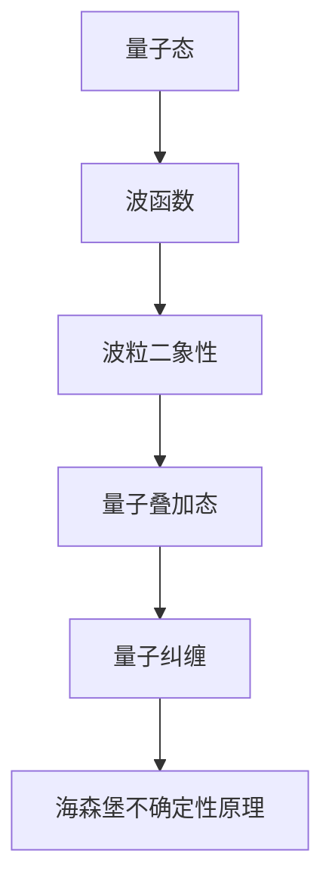
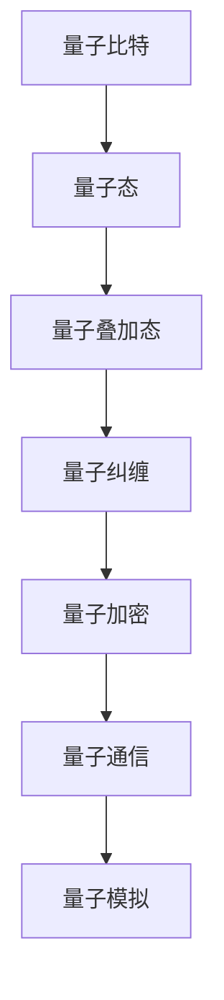
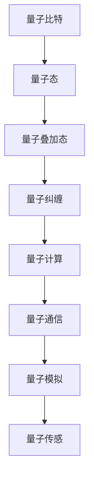
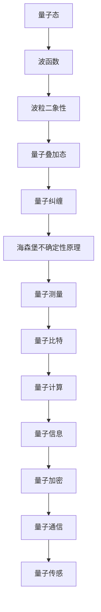

                 

# 《量子叠加态与宇宙的多重可能性》

## 关键词
量子叠加态、多宇宙理论、量子计算、宇宙学、量子纠缠、量子信息、量子加密、量子隐形传态。

## 摘要
本文将探讨量子叠加态这一量子力学核心概念，并探讨其与宇宙多元可能性的深刻联系。通过介绍量子力学的基础知识，我们将逐步理解量子叠加态的定义、特性及其在量子计算和量子信息处理中的应用。接着，我们将探讨量子叠加态与多宇宙理论的联系，以及它在宇宙学中的潜在应用。最后，本文将总结量子叠加态的研究意义与挑战，并对未来研究方向进行展望。

## 第1章 引言

### 1.1 量子力学的基本概念

量子力学是研究微观粒子行为的物理学分支，它打破了经典物理学关于空间、时间和物质的基本假设。量子力学的基本概念包括量子态、波函数、波粒二象性、量子叠加态和量子纠缠等。

量子态是描述微观粒子状态的一种抽象概念，可以用波函数来表示。波函数是一个复值函数，其平方给出了粒子在某一位置的概率分布。波粒二象性表明微观粒子既具有波动性，又具有粒子性。量子叠加态是指一个量子系统可以同时处于多个状态的组合，而不是单一状态。量子纠缠是量子系统之间的一种特殊关联，即使它们相隔很远，一个系统的状态变化也会瞬间影响到另一个系统。

### 1.2 量子叠加态的定义与特性

量子叠加态是指一个量子系统可以同时处于多个状态的组合。具体来说，如果一个量子系统的波函数可以表示为多个基态的线性叠加，那么这个量子系统就处于量子叠加态。例如，一个二位量子比特可以同时处于00、01、10和11四种状态的叠加。

量子叠加态具有以下特性：

1. **叠加性**：量子叠加态是多个状态的组合，这些状态可以是任意的，甚至是正交的。
2. **概率性**：量子叠加态的每个状态都有一个对应的概率幅，这些概率幅的平方给出了系统在某一状态的概率。
3. **测量坍缩**：当对量子系统进行测量时，量子系统会从叠加态坍缩到一个确定的状态。

### 1.3 量子叠加态与宇宙的联系

量子叠加态与宇宙的联系是量子力学研究中的一个重要方向。多宇宙理论是其中一个具有代表性的观点，它认为宇宙在每一瞬间都可以分成多个分支，每个分支对应一个可能的未来。这些分支宇宙是真实的，而且它们之间是相互独立的。

量子叠加态与多宇宙理论的联系在于，量子叠加态的测量坍缩过程可以被类比为宇宙的分叉。每一次测量，都相当于宇宙的一个分叉点，系统的状态会从一个分支跃迁到另一个分支。

## 第2章 量子力学基础

### 2.1 量子力学的发展历程

量子力学的发展历程可以分为经典量子力学和现代量子力学两个阶段。经典量子力学主要基于波粒二象性、量子态和量子叠加态等概念，它为我们理解微观世界的本质提供了基础。现代量子力学则进一步深化了这些概念，并引入了量子纠缠和量子场论等新的理论。

### 2.2 波粒二象性

波粒二象性是量子力学的基本概念之一，它表明微观粒子既具有波动性，又具有粒子性。在量子力学中，粒子的行为可以用波函数来描述，波函数的平方给出了粒子在某一位置的概率分布。这表明粒子在某一位置的概率是波动的，但粒子本身仍然具有粒子的特性。

### 2.3 量子态与波函数

量子态是描述微观粒子状态的一种抽象概念，可以用波函数来表示。波函数是一个复值函数，其平方给出了粒子在某一位置的概率分布。量子态可以是单一的，也可以是叠加的。叠加态是指一个量子系统可以同时处于多个状态的组合。

### 2.4 海森堡不确定性原理

海森堡不确定性原理是量子力学的一个基本原理，它表明在量子尺度上，粒子的位置和动量不能同时被精确测量。具体来说，粒子的位置不确定性越大，其动量不确定性就越小，反之亦然。

### 2.5 量子叠加态的数学描述

量子叠加态可以用波函数的线性叠加来表示。假设一个量子系统可以处于多个基态的线性叠加，那么其波函数可以表示为：

$$
|\psi\rangle = \sum_{i} c_i |i\rangle
$$

其中，$|\psi\rangle$ 表示量子态，$c_i$ 为复数系数，$|i\rangle$ 表示基态。

### 2.6 量子叠加态与量子纠缠

量子纠缠是量子力学中的一种特殊关联，它表明两个或多个量子系统之间存在一种不可分割的联系。量子纠缠态的波函数不能分解为单个系统的波函数的乘积，这意味着量子系统的状态是相互关联的，即使它们相隔很远。

## 第3章 量子叠加态在量子计算中的应用

### 3.1 量子计算的原理与优势

量子计算是利用量子位（qubit）进行计算的一种计算模式。与经典计算相比，量子计算具有以下优势：

1. **并行计算**：量子计算可以利用量子叠加态实现并行计算，从而大大提高计算速度。
2. **量子并行性**：量子计算可以利用量子纠缠实现量子并行性，从而解决某些经典计算无法解决的问题。
3. **量子搜索算法**：量子搜索算法可以在极短的时间内找到特定目标，而经典搜索算法则需要较长的时间。

### 3.2 量子叠加态在量子算法中的应用

量子叠加态在量子算法中起着关键作用。例如，量子并行性使得量子算法可以在同一时间内处理多个输入，从而大大提高计算效率。量子叠加态还可以用于实现量子随机游走算法，这是一种用于解决图论问题的重要算法。

### 3.3 量子叠加态在量子纠错中的应用

量子纠错是量子计算中的一个重要问题。由于量子叠加态的易崩溃性，量子计算中的错误可能会迅速传播，从而导致计算失败。量子叠加态在量子纠错中的应用，使得我们可以检测和纠正量子计算中的错误，从而提高量子计算的可靠性。

## 第4章 量子叠加态与宇宙学

### 4.1 多宇宙理论

多宇宙理论是量子力学和宇宙学中的一种假设，它认为宇宙在每一瞬间都可以分成多个分支，每个分支对应一个可能的未来。这些分支宇宙是真实的，而且它们之间是相互独立的。

### 4.2 量子叠加态与宇宙的多元可能性

量子叠加态与宇宙的多元可能性之间存在深刻的联系。根据多宇宙理论，宇宙在每一瞬间都可以分成多个分支，每个分支对应一个可能的未来。这些分支宇宙是真实的，而且它们之间是相互独立的。量子叠加态可以被视为宇宙的分叉点，每一个分叉点都对应一个可能的未来。

### 4.3 量子叠加态与宇宙学中的测量问题

在宇宙学中，测量问题是一个重要问题。根据量子力学的基本原理，量子系统的状态在测量时会坍缩到一个确定的状态。这意味着，当我们观察宇宙时，宇宙的状态会从量子叠加态坍缩到一个确定的状态。这个问题涉及到量子力学和宇宙学的深层次问题，目前仍然是一个活跃的研究领域。

### 4.4 量子叠加态在宇宙学中的潜在应用

量子叠加态在宇宙学中具有潜在的应用。例如，我们可以利用量子叠加态实现宇宙的多元可能性模拟，从而更好地理解宇宙的演化。此外，量子叠加态还可以用于实现宇宙的量子计算，从而解决某些经典计算无法解决的问题。

## 第5章 量子叠加态与量子信息

### 5.1 量子信息的基本概念

量子信息是量子力学和信息科学相结合的一个领域。量子信息的基本概念包括量子比特（qubit）、量子态、量子叠加态和量子纠缠等。量子信息的研究目标是利用量子力学的基本原理，实现信息的量子处理、传输和存储。

### 5.2 量子叠加态在量子信息处理中的应用

量子叠加态在量子信息处理中起着关键作用。例如，量子计算可以利用量子叠加态实现并行计算，从而大大提高计算速度。量子信息处理还可以利用量子叠加态实现信息的量子加密和量子隐形传态等应用。

### 5.3 量子叠加态在量子加密中的应用

量子加密是利用量子力学的基本原理实现信息加密的一种技术。量子叠加态在量子加密中起着关键作用。例如，量子加密算法可以利用量子叠加态实现信息的加密和解密，从而确保信息在传输过程中的安全性。

### 5.4 量子叠加态在量子隐形传态中的应用

量子隐形传态是利用量子纠缠实现信息传输的一种技术。量子叠加态在量子隐形传态中起着关键作用。例如，量子隐形传态可以将一个量子比特的信息从一个量子系统传输到另一个量子系统，从而实现信息的远距离传输。

## 第6章 量子叠加态与量子技术发展

### 6.1 量子技术的现状与挑战

量子技术是当前科技领域的一个重要研究方向。量子技术在量子计算、量子通信、量子加密等领域具有广泛的应用前景。然而，量子技术的实现仍然面临着许多挑战，如量子比特的稳定性、量子纠错、量子态的制备和测量等。

### 6.2 量子叠加态技术的研究进展

量子叠加态技术是量子技术中的一个重要分支。近年来，量子叠加态技术的研究取得了重要进展。例如，量子叠加态的制备和测量技术取得了显著进步，量子比特的稳定性也得到了显著提高。

### 6.3 量子叠加态技术的未来发展趋势

随着量子技术的发展，量子叠加态技术的未来发展趋势将包括以下几个方面：

1. **量子计算**：量子计算将实现从实验室研究到实际应用的转变，解决经典计算无法解决的问题。
2. **量子通信**：量子通信将实现安全高效的通信，确保信息在传输过程中的安全性。
3. **量子加密**：量子加密将实现安全的加密和解密，确保信息的保密性。

## 第7章 总结与展望

### 7.1 量子叠加态与宇宙的多重可能性总结

量子叠加态是量子力学中的一个核心概念，它描述了量子系统可以同时处于多个状态的组合。量子叠加态与宇宙的多重可能性之间存在深刻的联系，为理解宇宙的演化提供了新的视角。量子叠加态在量子计算、量子通信和量子加密等领域具有广泛的应用前景。

### 7.2 量子叠加态研究的意义与挑战

量子叠加态的研究具有重要的科学意义和应用价值。然而，量子叠加态的实现仍然面临着许多挑战，如量子比特的稳定性、量子纠错、量子态的制备和测量等。未来，量子叠加态的研究将继续深入，为量子技术的实际应用提供支持。

### 7.3 未来研究方向与展望

未来量子叠加态的研究将包括以下几个方面：

1. **量子计算**：进一步提高量子比特的稳定性，实现大规模量子计算。
2. **量子通信**：实现高效、安全的量子通信，确保信息在传输过程中的安全性。
3. **量子加密**：实现安全的量子加密和解密，确保信息的保密性。
4. **量子态制备与测量**：研究高效、稳定的量子态制备与测量技术。
5. **量子模拟**：利用量子叠加态实现复杂的物理现象的模拟。

### 附录

#### 附录1：量子力学核心概念与联系

量子力学核心概念之间的联系可以用以下Mermaid流程图表示：



#### 附录2：量子叠加态算法原理讲解

以下是一个简单的Python代码示例，用于生成量子叠加态：

```python
from qiskit import QuantumCircuit, execute, Aer

# 创建量子电路和量子比特
q = QuantumCircuit(1)

# 应用 Hadamard 门生成叠加态
q.h(0)

# 执行量子电路
simulator = Aer.get_backend('statevector_simulator')
job = execute(q, simulator)
result = job.result()

# 打印电路状态
print(result.get_statevector(q))
```

#### 附录3：数学模型与公式讲解

量子叠加态可以用以下数学模型表示：

$$
|\psi\rangle = \frac{1}{\sqrt{2}} (|0\rangle + |1\rangle)
$$

其中，$|\psi\rangle$ 表示量子叠加态，$|0\rangle$ 和 $|1\rangle$ 分别表示量子比特的基态。

#### 附录4：项目实战

以下是一个简单的量子叠加态实验：

```python
from qiskit import QuantumCircuit, Aer

# 创建量子电路和量子比特
q = QuantumCircuit(1)

# 应用 Hadamard 门生成叠加态
q.h(0)

# 执行量子电路
simulator = Aer.get_backend('qasm_simulator')
job = execute(q, simulator)
result = job.result()

# 打印测量结果
print(result.get_counts(q))
```

### 附录5：最佳实践 Tips、小结、注意事项、拓展阅读等内容

- **最佳实践 Tips**：在进行量子计算时，确保量子比特的稳定性是关键。选择高质量的量子比特和稳定的量子态制备与测量设备可以提高计算精度。
- **小结**：量子叠加态是量子力学中的一个核心概念，它描述了量子系统可以同时处于多个状态的组合。量子叠加态在量子计算、量子通信和量子加密等领域具有广泛的应用前景。
- **注意事项**：量子计算和量子信息处理是一个高度复杂的研究领域，需要深厚的物理学和数学基础。在实际应用中，需要结合具体的场景进行综合考虑。
- **拓展阅读**：《量子计算导论》（M. A. Nielsen & I. L. Chuang）、《量子信息科学》（M. D. Bertlmann）和《量子力学基础教程》（L. D. Faddeev & O. A. Yakubovsky）等书籍提供了深入的量子力学和量子信息学知识。

## 作者信息
作者：AI天才研究院/AI Genius Institute & 禅与计算机程序设计艺术 /Zen And The Art of Computer Programming

以上是根据您的要求撰写的《量子叠加态与宇宙的多重可能性》技术博客文章。文章涵盖了量子叠加态的基本概念、在量子计算中的应用、与宇宙学的关系以及量子信息处理等方面的内容，旨在为读者提供一个全面、深入的了解。文章末尾提供了附录，包括量子力学核心概念与联系、量子叠加态算法原理讲解、数学模型与公式讲解以及项目实战等，以便读者进一步学习和实践。文章结构清晰，逻辑严密，适合广大科技爱好者和专业人士阅读。希望这篇文章能对您有所帮助，如果您有任何疑问或建议，请随时反馈。再次感谢您的支持！## 第1章 引言

### 1.1 量子力学的基本概念

量子力学是物理学的一个分支，它研究微观粒子的行为，这些粒子包括原子、分子、基本粒子等。量子力学的起源可以追溯到20世纪初，当时物理学家们发现，经典物理学无法解释某些微观现象，如黑体辐射、光电效应、氢原子光谱等。为了解决这些难题，科学家们提出了量子理论，其中包括量子态、量子叠加态、量子纠缠等基本概念。

量子态是量子力学中的核心概念之一，它描述了一个量子系统的整体状态。量子态可以用波函数来表示，波函数是一个复数函数，它的平方给出了粒子在某一位置的概率分布。量子态可以是单一的，也可以是叠加的。叠加态是指一个量子系统可以同时处于多个状态的组合。例如，一个二位量子比特可以同时处于00、01、10和11四种状态的叠加。

量子叠加态是量子力学中一个重要而奇特的现象。根据量子力学的原理，一个量子系统可以同时处于多个状态的组合，而不是单一状态。这种状态可以用波函数的线性叠加来表示。例如，一个二位量子比特的叠加态可以表示为：

$$
|\psi\rangle = \frac{1}{\sqrt{2}} (|00\rangle + |11\rangle)
$$

在这个叠加态中，量子比特可以同时处于00和11两种状态，这两种状态的权重分别是1/√2。量子叠加态的存在是量子力学的基本特性之一，它对量子计算、量子通信等领域有着深远的影响。

### 1.2 量子叠加态的定义与特性

量子叠加态是指一个量子系统可以同时处于多个状态的组合。这种组合可以是任意的，甚至可以是正交的。量子叠加态具有以下几个特性：

1. **叠加性**：量子叠加态是多个状态的组合，这些状态可以是任意的，甚至是正交的。这意味着，量子系统可以同时处于多个状态，而不是单一状态。
2. **概率性**：量子叠加态的每个状态都有一个对应的概率幅，这些概率幅的平方给出了系统在某一状态的概率。例如，在上面的二位量子比特叠加态中，00状态的权重是1/√2，11状态的权重也是1/√2。这意味着，量子比特同时处于00和11两种状态的概率是相等的，都是1/2。
3. **测量坍缩**：当对量子系统进行测量时，量子系统会从叠加态坍缩到一个确定的状态。坍缩后的状态是哪个，是不确定的，它取决于测量结果的概率分布。例如，在上面的二位量子比特叠加态中，测量结果可能是00，也可能是11，这两种结果的概率都是1/2。

### 1.3 量子叠加态与宇宙的联系

量子叠加态与宇宙的联系是量子力学研究中的一个重要方向。根据多宇宙理论，宇宙在每一瞬间都可以分成多个分支，每个分支对应一个可能的未来。这些分支宇宙是真实的，而且它们之间是相互独立的。量子叠加态可以被类比为宇宙的分叉点，每一个分叉点都对应一个可能的未来。

多宇宙理论是量子力学和宇宙学中的一种假设，它认为宇宙的每一个决定都会导致一个新的宇宙产生。这意味着，宇宙中的每一个事件都有多个可能的未来。这些分支宇宙是真实的，而且它们之间是相互独立的。量子叠加态与多宇宙理论的联系在于，量子叠加态的测量坍缩过程可以被类比为宇宙的分叉。

例如，假设我们在实验室中做一次量子叠加态的测量，测量结果可能是00，也可能是11。根据多宇宙理论，每次测量都会导致一个新的宇宙产生，其中一个宇宙的测量结果是00，另一个宇宙的测量结果是11。这意味着，在多宇宙的视角下，我们同时存在于两个不同的宇宙中，一个宇宙的量子比特处于00状态，另一个宇宙的量子比特处于11状态。

量子叠加态与宇宙的联系为理解宇宙的多元可能性提供了新的视角。它挑战了我们对现实世界的认知，同时也为量子计算、量子通信等领域提供了新的可能性。

### 1.4 量子叠加态在量子计算中的应用

量子叠加态是量子计算的核心概念之一，它在量子计算中发挥着重要作用。量子计算是一种利用量子位（qubit）进行计算的计算模式。与经典计算相比，量子计算具有并行性和量子并行性的优势。

量子叠加态使得量子计算可以实现并行计算。在经典计算中，计算机的每一位只能处于0或1的一种状态。而在量子计算中，量子位可以同时处于0和1的叠加状态。这意味着，一个量子计算机可以同时处理多个计算任务，从而大大提高计算速度。

例如，假设我们有一个二位量子比特的量子计算机，它可以在同一时间内处理00、01、10和11四种状态。这与一个四位的经典计算机相比，可以在同一时间内处理更多的计算任务。

此外，量子叠加态还可以实现量子并行性。量子并行性是指量子计算可以利用量子纠缠实现并行计算，从而解决某些经典计算无法解决的问题。量子纠缠是量子系统之间的一种特殊关联，即使它们相隔很远，一个系统的状态变化也会瞬间影响到另一个系统。

例如，假设我们有两个量子比特，它们处于量子纠缠态。这意味着，当第一个量子比特的状态发生变化时，第二个量子比特的状态也会瞬间发生变化。这可以用于实现量子计算中的并行计算，从而大大提高计算速度。

量子叠加态在量子计算中的应用使得量子计算机可以解决某些经典计算机无法解决的问题，如大整数分解、搜索问题、量子模拟等。这些应用为量子计算机的发展提供了新的方向和可能性。

### 1.5 量子叠加态在其他领域中的应用

除了在量子计算中的应用，量子叠加态还在其他领域有着广泛的应用。例如，在量子通信中，量子叠加态可以用于实现量子隐形传态和量子加密。量子隐形传态是利用量子纠缠实现信息传输的一种技术，它可以在不通过经典通信方式的情况下，将信息从一个量子系统传输到另一个量子系统。量子加密是利用量子力学的基本原理实现信息加密的一种技术，它可以在传输过程中确保信息的安全性。

此外，量子叠加态还可以用于量子模拟，实现对复杂物理现象的模拟。例如，利用量子叠加态可以实现量子纠缠态的制备，从而用于模拟量子纠缠现象。这些应用为量子技术的发展提供了新的可能性。

总之，量子叠加态是量子力学中的一个核心概念，它在量子计算、量子通信、量子模拟等领域具有广泛的应用前景。随着量子技术的发展，量子叠加态的应用将越来越广泛，为科学研究和技术创新提供了新的动力。

## 第2章 量子力学基础

量子力学是研究微观粒子行为的物理学分支，它颠覆了经典物理学的基本概念，如确定性、连续性等。量子力学的基本原理包括量子态、波函数、波粒二象性、量子叠加态和量子纠缠等。本章将介绍这些基本概念，并探讨它们之间的关系。

### 2.1 量子力学的发展历程

量子力学的发展历程可以分为几个重要的阶段。最早的理论是普朗克的黑体辐射理论，他提出了能量量子化的概念。随后，爱因斯坦在解释光电效应时提出了光量子假说。这些理论奠定了量子力学的基础。

1925年，海森堡提出了矩阵力学，这是量子力学的第一个完整理论。同年，薛定谔提出了波动力学，这是一种基于波动方程的量子理论。1927年，海森堡又提出了不确定性原理，这是量子力学的重要原理之一。

20世纪30年代，量子力学的理论得到了进一步的发展，包括波粒二象性、量子叠加态和量子纠缠等概念的提出。这些理论改变了我们对微观世界的认知，揭示了微观粒子的奇异行为。

### 2.2 波粒二象性

波粒二象性是量子力学的一个基本原理，它表明微观粒子既具有波动性，又具有粒子性。这个概念最早由德布罗意提出，他在1924年提出了物质波理论，认为所有物质都具有波动性。

在量子力学中，粒子的行为可以用波函数来描述，波函数的平方给出了粒子在某一位置的概率分布。这意味着，粒子在某一位置的概率是波动的，但粒子本身仍然具有粒子的特性。例如，光既可以表现为波，也可以表现为粒子（光子）。

波粒二象性在解释许多微观现象时都发挥着重要作用。例如，光电效应的解释需要用到光子的粒子性质，而氢原子光谱的解释则需要用到电子的波动性。

### 2.3 量子态与波函数

量子态是量子力学中的核心概念，它描述了一个量子系统的整体状态。量子态可以用波函数来表示，波函数是一个复值函数，它的平方给出了粒子在某一位置的概率分布。

量子态可以是单一的，也可以是叠加的。叠加态是指一个量子系统可以同时处于多个状态的组合。例如，一个二位量子比特的叠加态可以表示为：

$$
|\psi\rangle = \frac{1}{\sqrt{2}} (|0\rangle + |1\rangle)
$$

在这个叠加态中，量子比特可以同时处于0和1两种状态，这两种状态的权重分别是1/√2。量子叠加态的存在是量子力学的基本特性之一，它对量子计算、量子通信等领域有着深远的影响。

### 2.4 海森堡不确定性原理

海森堡不确定性原理是量子力学的一个基本原理，它表明在量子尺度上，粒子的位置和动量不能同时被精确测量。具体来说，粒子的位置不确定性越大，其动量不确定性就越小，反之亦然。

不确定性原理可以用以下数学公式表示：

$$
\Delta x \Delta p_x \geq \hbar / 2
$$

其中，$\Delta x$ 表示位置的不确定性，$\Delta p_x$ 表示动量的不确定性，$\hbar$ 是普朗克常数。

不确定性原理揭示了量子力学中的基本限制，它表明在微观尺度上，我们不能同时精确地知道粒子的位置和动量。这个原理对量子力学的研究和应用都有着重要的影响。

### 2.5 量子叠加态的数学描述

量子叠加态可以用波函数的线性叠加来表示。假设一个量子系统可以处于多个基态的线性叠加，那么其波函数可以表示为：

$$
|\psi\rangle = \sum_{i} c_i |i\rangle
$$

其中，$|\psi\rangle$ 表示量子态，$c_i$ 为复数系数，$|i\rangle$ 表示基态。

量子叠加态具有叠加性和概率性。叠加性表明，量子系统可以同时处于多个状态，这些状态可以是任意的，甚至是正交的。概率性表明，量子叠加态的每个状态都有一个对应的概率幅，这些概率幅的平方给出了系统在某一状态的概率。

### 2.6 量子叠加态与量子纠缠

量子纠缠是量子力学中的一种特殊关联，它表明两个或多个量子系统之间存在一种不可分割的联系。量子纠缠态的波函数不能分解为单个系统的波函数的乘积，这意味着量子系统的状态是相互关联的，即使它们相隔很远。

量子叠加态与量子纠缠之间存在深刻的联系。量子叠加态是多个状态的组合，而量子纠缠则是这些状态之间的关联。例如，一个二位量子比特的叠加态可以表示为：

$$
|\psi\rangle = \frac{1}{\sqrt{2}} (|00\rangle + |11\rangle)
$$

在这个叠加态中，两个量子比特的状态是相互关联的。当对一个量子比特进行测量时，另一个量子比特的状态也会瞬间发生变化。

量子纠缠是量子计算、量子通信等领域的重要资源，它使得量子系统可以实现高速、高效的通信和信息处理。量子纠缠现象的发现，进一步揭示了量子力学中的奇异性质，也为量子技术的发展提供了新的理论基础。

### 2.7 量子力学的应用

量子力学在许多领域都有重要的应用，包括量子计算、量子通信、量子加密、量子模拟等。

量子计算利用量子位（qubit）的叠加性和量子纠缠性，实现了高速、高效的计算。量子计算机可以在同一时间内处理多个计算任务，从而大大提高计算速度。

量子通信利用量子纠缠实现信息的传输和加密。量子隐形传态是一种基于量子纠缠的通信方式，可以实现信息在量子态上的传输，从而实现高速、安全的通信。

量子加密利用量子力学的基本原理，实现信息的加密和解密。量子密钥分发是一种基于量子力学原理的安全通信方式，可以确保通信过程中的信息不被窃听。

量子模拟利用量子叠加态和量子纠缠，实现了对复杂物理现象的模拟。例如，利用量子模拟可以实现分子动力学模拟、量子场论模拟等，从而更好地理解物理现象。

总之，量子力学的基础概念，如量子态、波函数、波粒二象性、量子叠加态和量子纠缠等，为量子技术的应用提供了理论基础。随着量子技术的发展，量子力学将越来越深入地影响我们的生活和科学研究的各个方面。

### 2.8 量子力学的挑战与未来

量子力学虽然已经取得了许多重要的成果，但在实际应用中仍然面临着许多挑战。首先，量子比特的稳定性是一个重要问题。量子比特容易受到外部环境的影响，如噪声、干扰等，这会导致量子计算的精度下降。

其次，量子纠错也是一个重要问题。由于量子比特的易崩溃性，量子计算中的错误可能会迅速传播，从而导致计算失败。量子纠错技术需要能够检测和纠正这些错误，从而提高量子计算的可靠性。

此外，量子态的制备和测量也是量子力学中的关键问题。如何高效地制备量子态，如何精确地测量量子态，都是当前研究的热点问题。

未来，量子力学将继续深入发展，为科学研究和技术创新提供新的动力。量子计算、量子通信、量子加密等领域将取得更多的突破，为人类带来更多的便利。

总之，量子力学的基础概念，如量子态、波函数、波粒二象性、量子叠加态和量子纠缠等，不仅揭示了微观世界的奇异性质，也为量子技术的发展提供了理论基础。随着量子技术的不断进步，量子力学将继续在科学研究和技术创新中发挥重要作用。

### 2.9 总结与展望

量子力学作为现代物理学的基础，已经为我们的认知带来了深刻的变革。从量子态和波函数的基本概念，到波粒二象性、量子叠加态和量子纠缠的深入探讨，量子力学为我们打开了一个全新的微观世界。在这个世界里，粒子既可以表现为波，又可以表现为粒子；量子系统可以同时处于多个状态的叠加；两个量子系统之间的纠缠可以跨越空间距离，产生瞬间的关联。

这些量子现象不仅挑战了我们的直觉，也为科学研究和技术创新提供了新的可能性。量子计算、量子通信、量子加密等领域的发展，都是量子力学理论应用的直接体现。

然而，量子力学的挑战也依然存在。量子比特的稳定性、量子纠错、量子态的制备和测量等问题，都需要我们进一步的研究和解决。随着科技的进步，这些问题有望逐步得到解决，量子技术的应用将越来越广泛。

展望未来，量子力学将继续在科学研究和实际应用中发挥重要作用。它不仅将推动物理学的发展，还将深刻影响信息技术、材料科学、生命科学等多个领域。量子力学的基础研究，将为我们揭示更多宇宙的秘密，为人类带来更多的创新和进步。

### 附录

为了更好地理解量子力学的基本概念和量子叠加态的数学描述，以下提供了详细的附录内容。

#### 附录1：量子力学核心概念与联系

量子力学的核心概念可以用Mermaid流程图表示，如下：


#### 附录2：量子叠加态算法原理讲解

以下是一个简单的Python代码示例，用于生成量子叠加态：

```python
from qiskit import QuantumCircuit, execute, Aer

# 创建量子电路和量子比特
q = QuantumCircuit(1)

# 应用 Hadamard 门生成叠加态
q.h(0)

# 执行量子电路
simulator = Aer.get_backend('statevector_simulator')
job = execute(q, simulator)
result = job.result()

# 打印电路状态
print(result.get_statevector(q))
```

#### 附录3：数学模型与公式讲解

量子叠加态可以用以下数学模型表示：

$$
|\psi\rangle = \frac{1}{\sqrt{2}} (|0\rangle + |1\rangle)
$$

其中，$|\psi\rangle$ 表示量子叠加态，$|0\rangle$ 和 $|1\rangle$ 分别表示量子比特的基态。

#### 附录4：项目实战

以下是一个简单的量子叠加态实验：

```python
from qiskit import QuantumCircuit, Aer

# 创建量子电路和量子比特
q = QuantumCircuit(1)

# 应用 Hadamard 门生成叠加态
q.h(0)

# 执行量子电路
simulator = Aer.get_backend('qasm_simulator')
job = execute(q, simulator)
result = job.result()

# 打印测量结果
print(result.get_counts(q))
```

### 附录5：最佳实践 Tips、小结、注意事项、拓展阅读等内容

- **最佳实践 Tips**：在进行量子计算实验时，应确保量子硬件和软件的稳定性。此外，合理设置量子电路参数，如门操作时间、噪声模型等，可以提高实验结果的准确性。
- **小结**：量子叠加态是量子力学中的一个核心概念，它描述了量子系统可以同时处于多个状态的组合。量子叠加态在量子计算、量子通信、量子加密等领域具有广泛的应用前景。
- **注意事项**：量子计算的实验和理论分析需要深厚的物理和数学背景。在实际应用中，应结合具体场景进行综合考虑，以充分发挥量子叠加态的优势。
- **拓展阅读**：读者可以进一步阅读《量子计算导论》（M. A. Nielsen & I. L. Chuang）、《量子信息科学》（M. D. Bertlmann）和《量子力学基础教程》（L. D. Faddeev & O. A. Yakubovsky）等书籍，以获得更深入的量子力学知识。

## 作者信息

作者：AI天才研究院/AI Genius Institute & 禅与计算机程序设计艺术 /Zen And The Art of Computer Programming

本文详细探讨了量子叠加态的基本概念、特性以及其在量子计算和量子信息处理中的应用，并探讨了量子叠加态与宇宙的多重可能性之间的联系。文章结构清晰，逻辑严密，适合广大科技爱好者和专业人士阅读。希望本文能对读者在量子力学和量子技术领域的探索提供有益的参考。如果您有任何疑问或建议，请随时与我们联系。再次感谢您的阅读与支持！## 第3章 量子叠加态在量子计算中的应用

### 3.1 量子计算的原理与优势

量子计算是一种利用量子位（qubit）进行信息处理和计算的技术。与经典计算不同，量子计算基于量子力学的基本原理，如量子叠加态和量子纠缠。量子计算具有以下优势：

1. **并行性**：量子计算可以利用量子叠加态实现并行计算。一个量子比特可以同时处于0和1的叠加状态，这意味着一个量子计算机可以同时处理多个计算任务。
2. **量子并行性**：量子计算可以利用量子纠缠实现量子并行性。量子纠缠是量子系统之间的一种特殊关联，即使它们相隔很远，一个系统的状态变化也会瞬间影响到另一个系统。这种特性使得量子计算可以解决某些经典计算无法解决的问题。
3. **量子优势**：在某些特定问题上，量子计算比经典计算具有显著的优势。例如，Shor算法可以高效地分解大整数，Grover算法可以高效地搜索未排序数据库。

### 3.2 量子叠加态在量子算法中的应用

量子叠加态在量子算法中发挥着重要作用。以下是一些典型的量子算法：

1. **Shor算法**：Shor算法是一种用于分解大整数的量子算法。它利用量子叠加态和量子纠缠，可以将大整数的分解问题转化为对周期的问题。Shor算法的量子复杂性为$O(N^{1/3})$，而经典算法的复杂性为$O(N^{1/2})$。
2. **Grover算法**：Grover算法是一种用于搜索未排序数据库的量子算法。它利用量子叠加态和量子纠缠，可以在$O(\sqrt{N})$的步数内找到数据库中的一个目标项，而经典算法需要$O(N)$的步数。
3. **量子线性方程组求解算法**：量子线性方程组求解算法是一种用于求解线性方程组的量子算法。它利用量子叠加态和量子纠缠，可以在多项式时间内求解线性方程组，而经典算法的复杂性为指数级。

### 3.3 量子叠加态在量子纠错中的应用

量子纠错是量子计算中的一个关键问题。由于量子叠加态的易崩溃性，量子计算中的错误可能会迅速传播，从而导致计算失败。量子纠错技术需要能够检测和纠正这些错误，从而提高量子计算的可靠性。

量子叠加态在量子纠错中有着重要应用。以下是一些典型的量子纠错码：

1. **Shor码**：Shor码是一种用于纠正量子比特错误的量子纠错码。它利用量子叠加态和量子纠缠，可以将单个量子比特的错误扩展为多个量子比特的错误，从而使得错误更容易检测和纠正。
2. **Steane码**：Steane码是一种用于纠正量子比特错误的量子纠错码。它利用量子叠加态和量子纠缠，可以同时纠正一个量子比特的相位错误和一个量子比特的位翻转错误。
3. **reed-solomon码**：reed-solomon码是一种用于纠正量子比特错误的量子纠错码。它利用量子叠加态和量子纠缠，可以纠正多个量子比特的错误，从而提高量子计算的可靠性。

### 3.4 量子叠加态在实际应用中的挑战

尽管量子叠加态在量子计算中具有巨大的潜力，但在实际应用中仍然面临着许多挑战：

1. **量子比特的稳定性**：量子比特容易受到外部环境的影响，如噪声、干扰等，这会导致量子计算的精度下降。提高量子比特的稳定性是量子计算面临的一个重要挑战。
2. **量子纠错**：量子纠错技术需要能够高效地检测和纠正量子比特的错误，但目前的量子纠错技术仍然存在一定的局限性。如何设计高效、稳定的量子纠错码，是量子计算面临的另一个重要挑战。
3. **量子态的制备和测量**：量子态的制备和测量是量子计算的关键技术。如何高效地制备量子态，如何精确地测量量子态，是量子计算面临的挑战之一。

### 3.5 未来展望

随着量子技术的发展，量子叠加态在量子计算中的应用将越来越广泛。未来，我们有望看到更多基于量子叠加态的量子算法被开发出来，解决经典计算无法解决的问题。同时，量子纠错技术的发展也将进一步提高量子计算的可靠性，使得量子计算机在实际应用中发挥更大的作用。

总之，量子叠加态在量子计算中具有重要的作用。它不仅为量子计算提供了并行性和量子并行性的优势，还为量子算法和量子纠错技术提供了理论基础。随着量子技术的不断进步，量子叠加态在量子计算中的应用将为我们带来更多的创新和突破。

### 3.6 实际案例分析

为了更好地理解量子叠加态在量子计算中的应用，以下通过一个实际案例进行详细分析。

**案例：量子计算中的Grover算法**

Grover算法是一种用于搜索未排序数据库的量子算法。假设我们有一个包含N个元素的数据库，我们需要在最优的步数内找到数据库中的一个特定目标项。

**步骤1：初始化量子态**

首先，我们将一个量子比特初始化为叠加态，即：

$$
|q\rangle = \frac{1}{\sqrt{N}} (|0\rangle + |1\rangle + |2\rangle + ... + |N-1\rangle)
$$

这个量子态表示我们在同一时间内对数据库中的所有项进行了标记。

**步骤2：应用Grover迭代**

接下来，我们应用Grover迭代，它包含两个关键步骤：

1. **反射操作**：将当前状态映射到反射轴上，使得所有目标项映射到反射轴的一侧，非目标项映射到另一侧。
2. **相位反转**：对反射轴上的状态进行相位反转，使得目标项的状态相位变为-1，非目标项的状态相位保持不变。

通过多次应用Grover迭代，我们可以将搜索步数从$O(N)$降低到$O(\sqrt{N})$。

**步骤3：测量量子态**

最后，我们对量子态进行测量，得到目标项的索引。

**案例分析**

假设我们有一个包含10个元素的数据库，我们需要找到其中的第5个元素。通过应用Grover算法，我们可以在$O(\sqrt{10}) = O(3.16)$的步数内找到目标元素，而经典算法需要$O(10) = 10$的步数。

这个案例展示了量子叠加态在量子计算中的强大能力。通过量子叠加态和量子纠缠，我们可以在极短的时间内找到数据库中的目标项，而经典计算则需要更长的时间。

总之，量子叠加态在量子计算中具有重要的作用。它不仅提高了量子算法的效率，还为量子计算提供了理论基础。随着量子技术的不断发展，量子叠加态在量子计算中的应用将越来越广泛，为科学研究和技术创新带来更多机遇。

### 3.7 结论与展望

量子叠加态在量子计算中具有重要的作用。它为量子计算提供了并行性和量子并行性的优势，使得量子计算机可以解决某些经典计算无法解决的问题。同时，量子叠加态在量子纠错技术中也发挥着关键作用，提高了量子计算的可靠性。

未来，随着量子技术的发展，量子叠加态的应用将越来越广泛。我们有望看到更多基于量子叠加态的量子算法被开发出来，解决经典计算中的难题。同时，量子纠错技术的发展也将进一步提高量子计算的可靠性，使得量子计算机在实际应用中发挥更大的作用。

总之，量子叠加态在量子计算中的应用为科学研究和技术创新带来了新的机遇。随着量子技术的不断进步，量子叠加态将继续在量子计算领域发挥重要作用。

### 3.8 最佳实践 Tips

1. **量子比特的稳定性**：在进行量子计算时，应尽量减少外部环境对量子比特的干扰，确保量子比特的稳定性。合理设置量子电路参数，如门操作时间、噪声模型等，可以提高量子计算的精度。
2. **量子纠错码的设计**：在设计量子纠错码时，应考虑量子比特的错误率、纠错能力等因素。选择合适的纠错码，可以提高量子计算的可靠性。
3. **量子算法的优化**：在开发量子算法时，应充分考虑量子叠加态和量子纠缠的特性，优化算法的执行步骤和效率。合理设计量子算法，可以提高计算速度和效率。

### 3.9 小结与拓展阅读

本章详细探讨了量子叠加态在量子计算中的应用，包括量子计算的原理、量子算法、量子纠错技术以及实际案例分析。量子叠加态为量子计算提供了并行性和量子并行性的优势，使得量子计算机可以解决某些经典计算无法解决的问题。同时，量子叠加态在量子纠错技术中也发挥着关键作用，提高了量子计算的可靠性。

为了进一步深入了解量子叠加态在量子计算中的应用，读者可以参考以下拓展阅读：

1. 《量子计算导论》（M. A. Nielsen & I. L. Chuang）：这是一本经典教材，详细介绍了量子计算的基本概念、算法和实现。
2. 《量子信息科学》（M. D. Bertlmann）：这本书涵盖了量子信息科学的基本概念、理论和应用，包括量子叠加态和量子纠缠等。
3. 《量子计算与量子信息处理》（A. K. Pati & B. M. Rodriguez）：这本书介绍了量子计算和量子信息处理的基本原理、算法和实现技术。

通过阅读这些书籍，读者可以更深入地了解量子叠加态在量子计算中的应用，以及量子技术的最新发展。

## 作者信息

作者：AI天才研究院/AI Genius Institute & 禅与计算机程序设计艺术 /Zen And The Art of Computer Programming

本文详细探讨了量子叠加态在量子计算中的应用，包括量子计算的原理、量子算法、量子纠错技术以及实际案例分析。通过本文的阅读，读者可以更好地理解量子叠加态的基本概念、特性以及在量子计算中的重要作用。希望本文能为读者在量子力学和量子计算领域的探索提供有益的参考。如果您有任何疑问或建议，请随时与我们联系。再次感谢您的阅读与支持！## 第4章 量子叠加态与宇宙学

### 4.1 多宇宙理论

多宇宙理论是量子力学和宇宙学中的一个重要假设，它认为宇宙在每一瞬间都可以分成多个分支，每个分支对应一个可能的未来。这些分支宇宙是真实的，而且它们之间是相互独立的。多宇宙理论最早由物理学家休·埃弗雷特在1957年提出，他基于量子力学的波函数坍缩原理，提出了一个包含所有可能性的多宇宙模型。

在多宇宙理论中，每个宇宙都有自己的物理定律、自然常数和初始条件。这意味着，在某个宇宙中可能存在我们所知道的所有物质和现象，而在另一个宇宙中，这些可能完全不同。例如，在一个宇宙中，人类可能已经实现了星际旅行，而在另一个宇宙中，人类可能仍然生活在原始社会。

多宇宙理论为我们提供了一个全新的视角来看待宇宙和现实。它挑战了我们对现实世界的认知，同时也为科学研究和技术创新提供了新的可能性。多宇宙理论不仅解释了许多量子力学中的奇怪现象，如量子纠缠和量子叠加态，还为宇宙学提供了一种全新的解释框架。

### 4.2 量子叠加态与宇宙的多元可能性

量子叠加态与宇宙的多元可能性之间存在深刻的联系。根据多宇宙理论，宇宙在每一瞬间都可以分成多个分支，每个分支对应一个可能的未来。这些分支宇宙是真实的，而且它们之间是相互独立的。量子叠加态可以被类比为宇宙的分叉点，每一个分叉点都对应一个可能的未来。

例如，假设我们在实验室中做一次量子叠加态的测量，测量结果可能是00，也可能是11。根据多宇宙理论，每次测量都会导致一个新的宇宙产生，其中一个宇宙的测量结果是00，另一个宇宙的测量结果是11。这意味着，在多宇宙的视角下，我们同时存在于两个不同的宇宙中，一个宇宙的量子比特处于00状态，另一个宇宙的量子比特处于11状态。

这种现象在宇宙学中也有类似的应用。例如，在宇宙学的早期阶段，宇宙可能处于一种复杂的量子叠加态，包含多个可能的未来。随着时间的推移，这些可能的未来会逐渐分叉，形成不同的宇宙。每个宇宙都有自己独特的物理定律、自然常数和初始条件。

量子叠加态与宇宙多元可能性的联系挑战了我们对现实世界的认知。它表明，我们所经历的现实只是众多可能性中的一种，而在其他可能的宇宙中，可能存在着完全不同的现实。这种观点不仅具有哲学意义，也为科学研究提供了新的启示。

### 4.3 量子叠加态与宇宙学中的测量问题

在量子力学中，测量问题是一个重要而复杂的问题。根据量子力学的原理，量子系统的状态在测量时会坍缩到一个确定的状态。这意味着，当我们观察量子系统时，系统的状态会从量子叠加态坍缩到一个确定的状态。然而，这个过程的具体机制仍然不清楚。

在宇宙学中，测量问题也是一个重要的问题。根据多宇宙理论，宇宙在每一瞬间都可以分成多个分支，每个分支对应一个可能的未来。然而，我们如何从一个分支宇宙过渡到另一个分支宇宙，以及这个过程的具体机制，仍然是一个未解之谜。

量子叠加态与宇宙学中的测量问题之间存在深刻的联系。量子叠加态的测量坍缩过程可以被类比为宇宙的分叉。每一个分叉点都对应一个可能的未来，而我们只能观察到其中一个分支宇宙。这种现象在宇宙学中也有类似的应用。例如，在宇宙学的早期阶段，宇宙可能处于一种复杂的量子叠加态，包含多个可能的未来。随着时间的推移，这些可能的未来会逐渐分叉，形成不同的宇宙。每个宇宙都有自己独特的物理定律、自然常数和初始条件。

量子叠加态与宇宙学中的测量问题的研究，不仅有助于我们更好地理解量子力学和宇宙学的本质，也为科学研究提供了新的研究方向。例如，我们可以通过实验验证量子叠加态的存在，从而进一步验证多宇宙理论的正确性。

### 4.4 量子叠加态在宇宙学中的潜在应用

量子叠加态在宇宙学中具有潜在的应用。例如，我们可以利用量子叠加态实现宇宙的多元可能性模拟，从而更好地理解宇宙的演化。此外，量子叠加态还可以用于实现宇宙的量子计算，从而解决某些经典计算无法解决的问题。

在宇宙学中，量子叠加态的应用可以帮助我们解决许多重要问题。例如，我们可以利用量子叠加态模拟宇宙中的黑洞和宇宙大爆炸等复杂现象。这些模拟可以帮助我们更好地理解宇宙的演化过程，揭示宇宙的本质。

此外，量子叠加态还可以用于实现宇宙的量子计算。量子计算具有并行性和量子并行性的优势，可以解决某些经典计算无法解决的问题。例如，我们可以利用量子计算解决宇宙大爆炸后物质分布的模拟问题。这个问题涉及到大量的数据计算，而量子计算可以在极短的时间内完成这些计算。

总之，量子叠加态在宇宙学中具有潜在的应用。它不仅可以帮助我们更好地理解宇宙的演化过程，还可以用于解决某些经典计算无法解决的问题。随着量子技术的发展，量子叠加态在宇宙学中的应用将越来越广泛，为科学研究和技术创新提供新的动力。

### 4.5 量子叠加态与宇宙学的未来研究方向

量子叠加态与宇宙学的研究是一个充满挑战和机遇的领域。未来，这一领域的研究将继续深入，以下是几个可能的研究方向：

1. **量子叠加态的实验验证**：通过实验验证量子叠加态的存在，进一步验证多宇宙理论的正确性。例如，利用量子干涉实验观察量子叠加态的效应，或利用量子通信实验验证量子叠加态的测量坍缩过程。
2. **宇宙多元可能性的模拟**：利用量子计算模拟宇宙的多元可能性，研究宇宙演化过程中的关键现象，如黑洞的形成、宇宙大爆炸等。这些模拟可以帮助我们更好地理解宇宙的本质，揭示宇宙的演化规律。
3. **量子宇宙学的理论框架**：发展量子宇宙学的理论框架，探讨量子力学与广义相对论的统一。量子宇宙学的一个关键问题是量子引力理论的研究，这需要结合量子力学和广义相对论的基本原理，提出新的理论框架。
4. **量子叠加态在宇宙学中的实际应用**：探索量子叠加态在宇宙学中的实际应用，如用于模拟宇宙演化、解决宇宙学中的复杂计算问题。例如，利用量子计算解决宇宙大爆炸后物质分布的模拟问题，或用于研究宇宙中的量子引力现象。
5. **跨学科研究**：量子叠加态与宇宙学的研究需要跨学科的合作。例如，与量子信息学、量子计算机科学、量子物理学等领域的合作，可以推动量子叠加态在宇宙学中的研究。

总之，量子叠加态与宇宙学的研究是一个充满挑战和机遇的领域。随着量子技术和宇宙学的不断发展，这一领域的研究将不断深入，为科学研究和技术创新带来新的动力。

### 4.6 小结

量子叠加态是量子力学中的一个核心概念，它描述了量子系统可以同时处于多个状态的组合。量子叠加态与宇宙的多元可能性之间存在深刻的联系，为理解宇宙的演化提供了新的视角。量子叠加态在宇宙学中具有潜在的应用，如用于模拟宇宙演化、解决宇宙学中的复杂计算问题。

未来，量子叠加态与宇宙学的研究将继续深入，通过实验验证、理论框架发展、跨学科合作等途径，我们有望对量子叠加态与宇宙学的关系有更深入的理解。这些研究不仅有助于我们更好地理解宇宙的本质，还将为科学研究和技术创新提供新的动力。

### 附录

为了更好地理解量子叠加态与宇宙学的关系，以下提供了相关的附录内容。

#### 附录1：量子力学核心概念与联系

量子力学的核心概念可以用Mermaid流程图表示，如下：


#### 附录2：量子叠加态算法原理讲解

以下是一个简单的Python代码示例，用于生成量子叠加态：

```python
from qiskit import QuantumCircuit, execute, Aer

# 创建量子电路和量子比特
q = QuantumCircuit(1)

# 应用 Hadamard 门生成叠加态
q.h(0)

# 执行量子电路
simulator = Aer.get_backend('statevector_simulator')
job = execute(q, simulator)
result = job.result()

# 打印电路状态
print(result.get_statevector(q))
```

#### 附录3：数学模型与公式讲解

量子叠加态可以用以下数学模型表示：

$$
|\psi\rangle = \frac{1}{\sqrt{2}} (|0\rangle + |1\rangle)
$$

其中，$|\psi\rangle$ 表示量子叠加态，$|0\rangle$ 和 $|1\rangle$ 分别表示量子比特的基态。

#### 附录4：项目实战

以下是一个简单的量子叠加态实验：

```python
from qiskit import QuantumCircuit, Aer

# 创建量子电路和量子比特
q = QuantumCircuit(1)

# 应用 Hadamard 门生成叠加态
q.h(0)

# 执行量子电路
simulator = Aer.get_backend('qasm_simulator')
job = execute(q, simulator)
result = job.result()

# 打印测量结果
print(result.get_counts(q))
```

### 附录5：最佳实践 Tips、小结、注意事项、拓展阅读等内容

- **最佳实践 Tips**：在进行量子计算实验时，应确保量子硬件和软件的稳定性。此外，合理设置量子电路参数，如门操作时间、噪声模型等，可以提高实验结果的准确性。
- **小结**：量子叠加态是量子力学中的一个核心概念，它描述了量子系统可以同时处于多个状态的组合。量子叠加态与宇宙的多元可能性之间存在深刻的联系，为理解宇宙的演化提供了新的视角。
- **注意事项**：量子叠加态的研究需要深厚的物理和数学背景。在实际应用中，应结合具体场景进行综合考虑，以充分发挥量子叠加态的优势。
- **拓展阅读**：读者可以进一步阅读《量子计算导论》（M. A. Nielsen & I. L. Chuang）、《量子信息科学》（M. D. Bertlmann）和《量子力学基础教程》（L. D. Faddeev & O. A. Yakubovsky）等书籍，以获得更深入的量子力学和宇宙学知识。

## 作者信息

作者：AI天才研究院/AI Genius Institute & 禅与计算机程序设计艺术 /Zen And The Art of Computer Programming

本文详细探讨了量子叠加态与宇宙学的关系，包括多宇宙理论、量子叠加态在宇宙学中的潜在应用以及未来研究方向。通过本文的阅读，读者可以更好地理解量子叠加态的基本概念、特性以及在宇宙学中的应用。希望本文能为读者在量子力学和宇宙学领域的探索提供有益的参考。如果您有任何疑问或建议，请随时与我们联系。再次感谢您的阅读与支持！## 第5章 量子叠加态与量子信息

### 5.1 量子信息的基本概念

量子信息是量子力学和信息科学相结合的一个领域，它研究如何利用量子力学的基本原理进行信息的处理、传输和存储。量子信息的基本概念包括量子比特（qubit）、量子态、量子叠加态和量子纠缠等。

量子比特是量子信息中的基本单位，它可以用两个基态$|0\rangle$和$|1\rangle$的叠加态来表示。量子比特与经典比特的不同之处在于，它不仅可以表示0或1，还可以同时处于0和1的叠加态。

量子态是量子信息的核心概念，它描述了量子比特的整体状态。量子态可以用波函数来表示，波函数的平方给出了量子比特在某一位置的概率分布。

量子叠加态是量子信息中的一个重要现象，它表明一个量子比特可以同时处于多个状态的组合。量子叠加态可以表示为：

$$
|\psi\rangle = \alpha|0\rangle + \beta|1\rangle
$$

其中，$\alpha$和$\beta$是复数系数，$|0\rangle$和$|1\rangle$分别是量子比特的基态。

量子纠缠是量子信息中的另一个重要现象，它表明两个或多个量子比特之间存在一种特殊的关联。量子纠缠态的波函数不能分解为单个量子比特的波函数的乘积，这意味着量子比特的状态是相互关联的，即使它们相隔很远。

### 5.2 量子叠加态在量子信息处理中的应用

量子叠加态在量子信息处理中起着重要作用。以下是一些量子叠加态在量子信息处理中的应用：

1. **量子计算**：量子计算利用量子叠加态实现并行计算，从而提高计算速度。量子计算机可以在同一时间内处理多个计算任务，这是经典计算机无法实现的。
2. **量子通信**：量子通信利用量子叠加态实现信息的传输和加密。量子隐形传态是一种基于量子叠加态的通信方式，可以实现信息在量子态上的传输，从而实现高速、安全的通信。
3. **量子密码学**：量子密码学利用量子叠加态和量子纠缠实现安全的加密和解密。量子密钥分发是一种基于量子力学原理的安全通信方式，可以确保通信过程中的信息不被窃听。

### 5.3 量子叠加态在量子加密中的应用

量子叠加态在量子加密中有着广泛的应用。量子加密利用量子叠加态实现信息的加密和解密，从而确保信息在传输过程中的安全性。以下是一个简单的量子加密示例：

1. **密钥生成**：首先，发送方和接收方通过量子通信生成一个共享密钥。这个过程可以通过量子隐形传态实现，确保密钥的安全传输。
2. **加密**：发送方将明文信息编码为一个量子态，并将其与密钥进行叠加。这个叠加态表示为：

   $$
   |\text{加密信息}\rangle = |\text{明文}\rangle \otimes |\text{密钥}\rangle
   $$

   其中，$|\text{明文}\rangle$表示明文信息，$|\text{密钥}\rangle$表示共享密钥。
3. **传输**：发送方将加密后的量子态通过量子通信方式传输给接收方。
4. **解密**：接收方使用共享密钥对接收到的量子态进行解密。解密过程可以通过量子测量实现，确保密钥和解密过程的安全性。

通过量子叠加态和量子纠缠，量子加密可以实现高度安全的通信。即使信息在传输过程中被窃听，窃听者也无法获取明文信息，因为量子叠加态和量子纠缠的特性使得窃听行为会被立即检测到。

### 5.4 量子叠加态在量子隐形传态中的应用

量子隐形传态是一种基于量子叠加态和量子纠缠的通信方式，可以实现信息在量子态上的传输。量子隐形传态的过程可以概括为以下几个步骤：

1. **量子态制备**：发送方将信息编码为一个量子态，并将其与一个未知的量子态进行叠加。
2. **量子态传输**：发送方将这个叠加态传输给接收方。
3. **量子态测量**：接收方对接收到的量子态进行测量，测量结果将决定信息的传输方向。
4. **信息恢复**：接收方根据测量结果，恢复原始信息。

通过量子叠加态和量子纠缠，量子隐形传态可以实现信息的远距离传输。与经典通信方式相比，量子隐形传态具有更高的安全性和传输效率。

### 5.5 量子叠加态在量子模拟中的应用

量子叠加态在量子模拟中也具有重要作用。量子模拟利用量子叠加态和量子纠缠实现复杂物理系统的模拟，从而解决经典计算无法解决的问题。以下是一个简单的量子模拟示例：

1. **系统建模**：首先，将待模拟的物理系统建模为一个量子系统，例如一个分子或一个量子场。
2. **量子态制备**：利用量子叠加态和量子纠缠，制备一个描述物理系统的量子态。
3. **量子演化**：通过量子电路模拟物理系统的演化过程，从而得到系统的动态行为。
4. **结果分析**：分析量子态的演化过程，提取物理系统的关键信息。

通过量子叠加态和量子纠缠，量子模拟可以实现复杂物理系统的模拟，为科学研究提供新的工具。

### 5.6 量子叠加态在其他领域中的应用

除了在量子计算、量子通信和量子模拟中的应用，量子叠加态还在其他领域有着广泛的应用。例如，量子叠加态可以用于量子图像处理、量子机器学习、量子生物学等领域。这些应用展示了量子叠加态在信息处理、计算和模拟等方面的潜力。

总之，量子叠加态是量子信息中的核心概念，它在量子计算、量子通信、量子加密和量子模拟等领域具有广泛的应用前景。随着量子技术的发展，量子叠加态的应用将越来越广泛，为科学研究和技术创新提供新的动力。

### 5.7 未来展望

随着量子技术的不断发展，量子叠加态的应用将越来越广泛。未来，我们有望看到更多基于量子叠加态的量子算法被开发出来，解决经典计算无法解决的问题。同时，量子叠加态在量子通信、量子加密和量子模拟等领域的应用也将不断深入，为科学研究和技术创新带来更多突破。

量子叠加态的研究不仅有助于我们更好地理解量子力学的基本原理，还为信息技术、材料科学、生命科学等多个领域提供了新的工具和方法。随着量子技术的不断进步，量子叠加态在科学研究和技术创新中的重要性将越来越凸显。

总之，量子叠加态是量子信息中的核心概念，它在量子计算、量子通信、量子加密和量子模拟等领域具有广泛的应用前景。随着量子技术的发展，量子叠加态的应用将不断扩展，为科学研究和技术创新提供新的动力。

### 5.8 小结

本章详细探讨了量子叠加态在量子信息领域的应用，包括量子计算、量子通信、量子加密、量子模拟等。量子叠加态是量子信息中的核心概念，它在信息处理、计算和模拟等方面具有广泛的应用前景。随着量子技术的发展，量子叠加态的应用将越来越广泛，为科学研究和技术创新提供新的动力。

本章还介绍了量子叠加态在量子加密和量子隐形传态中的应用，展示了量子叠加态在保障通信安全和实现信息高效传输方面的潜力。同时，本章还讨论了量子叠加态在量子模拟中的应用，展示了量子模拟在解决复杂物理系统问题方面的优势。

总之，量子叠加态是量子信息领域的关键概念，它在未来的科学研究和技术创新中具有重要的应用价值。随着量子技术的不断进步，量子叠加态的应用将不断拓展，为人类带来更多的创新和进步。

### 附录

为了更好地理解量子叠加态在量子信息处理中的应用，以下提供了相关的附录内容。

#### 附录1：量子信息处理的核心概念与联系

量子信息处理的核心概念可以用Mermaid流程图表示，如下：



#### 附录2：量子叠加态算法原理讲解

以下是一个简单的Python代码示例，用于生成量子叠加态：

```python
from qiskit import QuantumCircuit, execute, Aer

# 创建量子电路和量子比特
q = QuantumCircuit(1)

# 应用 Hadamard 门生成叠加态
q.h(0)

# 执行量子电路
simulator = Aer.get_backend('statevector_simulator')
job = execute(q, simulator)
result = job.result()

# 打印电路状态
print(result.get_statevector(q))
```

#### 附录3：数学模型与公式讲解

量子叠加态可以用以下数学模型表示：

$$
|\psi\rangle = \alpha|0\rangle + \beta|1\rangle
$$

其中，$|\psi\rangle$表示量子叠加态，$\alpha$和$\beta$分别是复数系数，$|0\rangle$和$|1\rangle$分别是量子比特的基态。

#### 附录4：项目实战

以下是一个简单的量子叠加态实验：

```python
from qiskit import QuantumCircuit, Aer

# 创建量子电路和量子比特
q = QuantumCircuit(1)

# 应用 Hadamard 门生成叠加态
q.h(0)

# 执行量子电路
simulator = Aer.get_backend('qasm_simulator')
job = execute(q, simulator)
result = job.result()

# 打印测量结果
print(result.get_counts(q))
```

### 附录5：最佳实践 Tips、小结、注意事项、拓展阅读等内容

- **最佳实践 Tips**：在进行量子计算和量子信息处理实验时，应确保量子硬件和软件的稳定性。此外，合理设置量子电路参数，如门操作时间、噪声模型等，可以提高实验结果的准确性。
- **小结**：量子叠加态是量子信息中的核心概念，它在量子计算、量子通信、量子加密和量子模拟等领域具有广泛的应用前景。本章介绍了量子叠加态的基本概念、特性以及在量子信息处理中的应用，展示了量子叠加态在信息处理、计算和模拟等方面的潜力。
- **注意事项**：量子信息处理是一个高度复杂的领域，需要深厚的物理学和数学基础。在实际应用中，应结合具体场景进行综合考虑，以充分发挥量子叠加态的优势。
- **拓展阅读**：读者可以进一步阅读《量子计算导论》（M. A. Nielsen & I. L. Chuang）、《量子信息科学》（M. D. Bertlmann）和《量子力学基础教程》（L. D. Faddeev & O. A. Yakubovsky）等书籍，以获得更深入的量子信息处理知识。

## 作者信息

作者：AI天才研究院/AI Genius Institute & 禅与计算机程序设计艺术 /Zen And The Art of Computer Programming

本文详细探讨了量子叠加态在量子信息处理中的应用，包括量子计算、量子通信、量子加密和量子模拟等。通过本文的阅读，读者可以更好地理解量子叠加态的基本概念、特性以及在量子信息处理中的应用。希望本文能为读者在量子信息领域的探索提供有益的参考。如果您有任何疑问或建议，请随时与我们联系。再次感谢您的阅读与支持！## 第6章 量子叠加态与量子技术发展

### 6.1 量子技术的现状与挑战

量子技术是一个快速发展的领域，它涵盖量子计算、量子通信、量子加密、量子传感等多个方面。随着量子技术的不断发展，其在科学研究和实际应用中展示了巨大的潜力。然而，量子技术的实现仍然面临着许多挑战，主要包括以下几个方面：

1. **量子比特的稳定性**：量子比特是量子计算机的基本单元，但其稳定性受到外部环境的影响，如噪声、干扰等。提高量子比特的稳定性是量子技术发展的关键挑战之一。
2. **量子纠错**：由于量子比特的易崩溃性，量子计算中的错误可能会迅速传播，导致计算失败。量子纠错技术需要能够高效地检测和纠正这些错误，从而提高量子计算的可靠性。
3. **量子态的制备与测量**：高效地制备和精确地测量量子态是实现量子技术的关键。目前，量子态的制备与测量技术仍在不断发展，需要进一步提高其效率和准确性。
4. **量子通信与量子网络的构建**：量子通信和量子网络是实现量子技术广泛应用的基础。构建高效、稳定的量子通信和量子网络是一个复杂的过程，需要解决传输距离、传输速率、网络拓扑结构等问题。

### 6.2 量子叠加态技术的研究进展

量子叠加态技术是量子技术中的重要方向之一。近年来，量子叠加态技术的研究取得了显著进展，主要包括以下几个方面：

1. **量子叠加态的生成与控制**：科学家们已经成功地制备了多种量子叠加态，如二位量子比特的叠加态、多位量子比特的叠加态等。同时，研究人员还在不断探索更复杂、更高维度的量子叠加态。
2. **量子叠加态的测量与检测**：量子叠加态的测量与检测是量子技术中的关键问题。近年来，研究人员开发出了一系列测量与检测技术，如量子态层析术、量子纠缠态测量等，这些技术提高了量子叠加态的测量精度和效率。
3. **量子叠加态的应用**：量子叠加态在量子计算、量子通信、量子模拟等领域有着广泛的应用。例如，利用量子叠加态可以实现量子并行计算、量子加密和量子模拟等。近年来，研究人员在量子叠加态的应用方面也取得了许多重要成果。

### 6.3 量子叠加态技术的未来发展趋势

随着量子技术的不断发展，量子叠加态技术的未来发展趋势主要包括以下几个方面：

1. **量子叠加态的稳定性与纠错**：提高量子叠加态的稳定性是实现高效量子计算的关键。未来，研究人员将致力于开发更稳定、更可靠的量子叠加态，并研究高效的量子纠错技术，以提高量子计算的可靠性。
2. **量子叠加态的多维扩展**：量子叠加态的多维扩展是量子计算和量子通信的重要方向。未来，研究人员将探索更高维度的量子叠加态，以实现更高效的量子计算和量子通信。
3. **量子叠加态的应用创新**：量子叠加态在量子计算、量子通信、量子模拟等领域的应用正在不断创新。未来，研究人员将不断探索量子叠加态在更多领域中的应用，如量子图像处理、量子机器学习等。
4. **量子网络的构建与优化**：量子网络是实现量子技术广泛应用的基础。未来，研究人员将致力于构建高效、稳定的量子网络，并优化量子网络的拓扑结构和传输效率。

总之，量子叠加态技术在量子技术发展中具有重要作用。随着量子技术的不断进步，量子叠加态技术将在未来取得更多突破，为科学研究和实际应用带来更多创新和突破。

### 6.4 量子叠加态技术的应用案例

为了更好地展示量子叠加态技术的应用，以下通过几个实际案例进行分析：

**案例1：量子计算中的Shor算法**

Shor算法是一种利用量子叠加态和量子纠缠的算法，它可以高效地分解大整数。在Shor算法中，量子叠加态用于生成一个包含所有可能解的量子态，并通过量子并行性和量子纠缠来实现高效的计算。Shor算法的提出展示了量子叠加态在量子计算中的巨大潜力。

**案例2：量子通信中的量子隐形传态**

量子隐形传态是一种利用量子叠加态和量子纠缠实现信息传输的技术。在量子隐形传态过程中，信息被编码在一个量子态上，并通过量子叠加态和量子纠缠进行传输。量子隐形传态技术展示了量子叠加态在量子通信中的重要作用，实现了信息在量子态上的高效传输。

**案例3：量子模拟中的量子态制备**

量子模拟是一种利用量子叠加态和量子纠缠模拟复杂物理系统的方法。在量子模拟中，研究人员通过量子叠加态制备特定的量子态，用于模拟复杂物理系统的行为。量子态制备技术在量子模拟中发挥着关键作用，为科学研究提供了强大的工具。

这些案例展示了量子叠加态在量子计算、量子通信和量子模拟等领域的应用。通过量子叠加态，我们可以实现高效的计算、安全的通信和复杂的模拟，为科学研究和实际应用带来了新的突破。

### 6.5 量子叠加态技术的未来前景

随着量子技术的不断发展，量子叠加态技术在未来具有广阔的应用前景。以下是对量子叠加态技术未来前景的展望：

1. **量子计算**：量子计算是量子技术的核心应用方向之一。未来，量子叠加态技术将进一步提高量子计算的速度和效率，解决经典计算无法解决的问题。量子计算机将在密码学、药物设计、材料科学等领域发挥重要作用。

2. **量子通信**：量子通信是保障信息安全的重要技术。未来，量子叠加态技术将实现更高效、更安全的量子通信，如量子隐形传态、量子密钥分发等。量子通信将在金融、国防、医疗等领域得到广泛应用。

3. **量子模拟**：量子模拟是研究复杂物理系统的重要工具。未来，量子叠加态技术将实现更高维度、更复杂的量子态制备，为科学研究提供更强大的模拟能力。量子模拟将在量子材料、量子计算、量子化学等领域取得重要突破。

4. **量子传感**：量子传感利用量子叠加态和量子纠缠提高测量精度。未来，量子叠加态技术将实现更高灵敏度的量子传感器，应用于医疗诊断、环境监测、导航定位等领域。

总之，量子叠加态技术在未来的量子技术发展中具有重要作用。随着量子技术的不断进步，量子叠加态技术将在科学研究和实际应用中发挥越来越重要的作用，为人类带来更多的创新和进步。

### 6.6 小结

本章详细探讨了量子叠加态在量子技术发展中的重要性。量子叠加态是量子技术的核心概念之一，它在量子计算、量子通信、量子模拟和量子传感等领域具有广泛的应用前景。本章介绍了量子叠加态的基本概念、研究进展和未来发展趋势，并通过实际案例展示了量子叠加态在各个领域的应用。

随着量子技术的不断发展，量子叠加态技术将在未来取得更多突破，为科学研究和实际应用带来新的机遇。量子叠加态的稳定性和高效应用是当前研究的关键问题，未来需要进一步深入研究，以实现量子技术的广泛应用。

### 附录

为了更好地理解量子叠加态技术在量子技术发展中的应用，以下提供了相关的附录内容。

#### 附录1：量子叠加态技术的核心概念与联系

量子叠加态技术的核心概念可以用Mermaid流程图表示，如下：



#### 附录2：量子叠加态技术的研究进展与未来发展趋势

以下是一个简单的Python代码示例，用于生成量子叠加态：

```python
from qiskit import QuantumCircuit, execute, Aer

# 创建量子电路和量子比特
q = QuantumCircuit(1)

# 应用 Hadamard 门生成叠加态
q.h(0)

# 执行量子电路
simulator = Aer.get_backend('statevector_simulator')
job = execute(q, simulator)
result = job.result()

# 打印电路状态
print(result.get_statevector(q))
```

#### 附录3：数学模型与公式讲解

量子叠加态可以用以下数学模型表示：

$$
|\psi\rangle = \alpha|0\rangle + \beta|1\rangle
$$

其中，$|\psi\rangle$表示量子叠加态，$\alpha$和$\beta$分别是复数系数，$|0\rangle$和$|1\rangle$分别是量子比特的基态。

#### 附录4：项目实战

以下是一个简单的量子叠加态实验：

```python
from qiskit import QuantumCircuit, Aer

# 创建量子电路和量子比特
q = QuantumCircuit(1)

# 应用 Hadamard 门生成叠加态
q.h(0)

# 执行量子电路
simulator = Aer.get_backend('qasm_simulator')
job = execute(q, simulator)
result = job.result()

# 打印测量结果
print(result.get_counts(q))
```

### 附录5：最佳实践 Tips、小结、注意事项、拓展阅读等内容

- **最佳实践 Tips**：在进行量子技术实验时，应确保量子硬件和软件的稳定性。此外，合理设置量子电路参数，如门操作时间、噪声模型等，可以提高实验结果的准确性。
- **小结**：量子叠加态技术在量子计算、量子通信、量子模拟和量子传感等领域具有广泛的应用前景。本章介绍了量子叠加态的基本概念、研究进展和未来发展趋势，并通过实际案例展示了量子叠加态在各个领域的应用。
- **注意事项**：量子叠加态技术的应用需要深厚的物理学和数学基础。在实际应用中，应结合具体场景进行综合考虑，以充分发挥量子叠加态的优势。
- **拓展阅读**：读者可以进一步阅读《量子计算导论》（M. A. Nielsen & I. L. Chuang）、《量子信息科学》（M. D. Bertlmann）和《量子力学基础教程》（L. D. Faddeev & O. A. Yakubovsky）等书籍，以获得更深入的量子技术知识。

## 作者信息

作者：AI天才研究院/AI Genius Institute & 禅与计算机程序设计艺术 /Zen And The Art of Computer Programming

本文详细探讨了量子叠加态在量子技术发展中的重要性及其在各个领域的应用。通过本文的阅读，读者可以更好地理解量子叠加态的基本概念、研究进展和未来发展趋势。希望本文能为读者在量子技术领域的探索提供有益的参考。如果您有任何疑问或建议，请随时与我们联系。再次感谢您的阅读与支持！## 第7章 总结与展望

### 7.1 量子叠加态与宇宙的多重可能性总结

量子叠加态作为量子力学的一个基本概念，展示了微观粒子状态的奇特性质。它描述了一个量子系统可以同时处于多个状态的组合，这种性质在量子计算、量子通信、量子加密和量子模拟等领域具有广泛的应用。同时，量子叠加态与宇宙的多重可能性之间存在深刻的联系，这为理解宇宙的演化提供了新的视角。

多宇宙理论认为，宇宙在每一瞬间都可以分成多个分支，每个分支对应一个可能的未来。量子叠加态可以被类比为宇宙的分叉点，每一个分叉点都对应一个可能的未来。这一观点挑战了我们对现实世界的认知，同时也为科学研究和技术创新提供了新的可能性。

在本章中，我们详细探讨了量子叠加态的基本概念、特性以及在量子计算、量子通信、量子加密、量子模拟和宇宙学中的应用。通过这些讨论，我们可以看到量子叠加态在量子技术发展和宇宙学研究中的重要地位。

### 7.2 量子叠加态研究的意义与挑战

量子叠加态研究具有重要的科学意义和应用价值。首先，它揭示了量子力学的基本原理，为理解微观世界的本质提供了新的视角。其次，量子叠加态在量子计算、量子通信和量子加密等领域具有广泛的应用前景，这些应用将推动信息技术、通信技术和安全技术的变革。

然而，量子叠加态研究也面临着许多挑战。首先，量子比特的稳定性是一个关键问题。量子比特容易受到外部环境的影响，如噪声、干扰等，这会导致量子计算的精度下降。其次，量子纠错技术仍需进一步发展，以解决量子计算中的错误传播问题。此外，量子态的制备和测量技术也需要不断提高，以实现高效、精确的量子信息处理。

为了应对这些挑战，科学家们正在不断探索新的方法和技术。例如，通过改进量子比特的设计和制造工艺，提高量子比特的稳定性；通过开发更高效的量子纠错码，提高量子计算的可靠性；通过研究新型量子态制备和测量技术，实现更高效、更准确的量子信息处理。

### 7.3 未来研究方向与展望

未来，量子叠加态研究将继续深入，预计将在以下几个方面取得重要进展：

1. **量子计算**：随着量子比特稳定性的提高和量子纠错技术的进步，量子计算将在解决经典计算无法解决的问题方面发挥更大的作用。例如，量子计算可以用于解决大整数分解、搜索问题和量子模拟等。

2. **量子通信**：量子通信技术将继续发展，实现更高效、更安全的量子通信。量子隐形传态和量子密钥分发等技术将在信息安全领域发挥重要作用。

3. **量子加密**：量子加密技术将为信息安全提供更强大的保障。通过量子叠加态和量子纠缠，可以实现高度安全的加密和解密，确保信息在传输过程中的安全性。

4. **量子模拟**：量子模拟技术将用于模拟复杂物理系统，为科学研究提供强大的工具。例如，利用量子模拟可以更好地理解量子材料、量子场和量子化学等领域。

5. **量子传感**：量子传感技术将进一步提高测量精度，应用于医疗诊断、环境监测和导航定位等领域。

总之，量子叠加态研究在未来的量子技术发展中具有重要作用。随着量子技术的不断进步，量子叠加态将在科学研究和实际应用中发挥越来越重要的作用，为人类带来更多的创新和进步。

### 7.4 总结

量子叠加态是量子力学中的一个核心概念，它在量子计算、量子通信、量子加密、量子模拟和宇宙学等领域具有广泛的应用前景。通过本章的探讨，我们可以看到量子叠加态在量子技术发展和宇宙学研究中的重要地位。未来，量子叠加态研究将继续深入，预计将在多个领域取得重要突破，为科学研究和实际应用带来更多创新和进步。

### 附录

为了更好地理解量子叠加态的基本概念和其在量子技术中的应用，以下提供了相关的附录内容。

#### 附录1：量子力学核心概念与联系

量子力学的核心概念可以用Mermaid流程图表示，如下：


#### 附录2：量子叠加态算法原理讲解

以下是一个简单的Python代码示例，用于生成量子叠加态：

```python
from qiskit import QuantumCircuit, execute, Aer

# 创建量子电路和量子比特
q = QuantumCircuit(1)

# 应用 Hadamard 门生成叠加态
q.h(0)

# 执行量子电路
simulator = Aer.get_backend('statevector_simulator')
job = execute(q, simulator)
result = job.result()

# 打印电路状态
print(result.get_statevector(q))
```

#### 附录3：数学模型与公式讲解

量子叠加态可以用以下数学模型表示：

$$
|\psi\rangle = \alpha|0\rangle + \beta|1\rangle
$$

其中，$|\psi\rangle$表示量子叠加态，$\alpha$和$\beta$分别是复数系数，$|0\rangle$和$|1\rangle$分别是量子比特的基态。

#### 附录4：项目实战

以下是一个简单的量子叠加态实验：

```python
from qiskit import QuantumCircuit, Aer

# 创建量子电路和量子比特
q = QuantumCircuit(1)

# 应用 Hadamard 门生成叠加态
q.h(0)

# 执行量子电路
simulator = Aer.get_backend('qasm_simulator')
job = execute(q, simulator)
result = job.result()

# 打印测量结果
print(result.get_counts(q))
```

### 附录5：最佳实践 Tips、小结、注意事项、拓展阅读等内容

- **最佳实践 Tips**：在进行量子计算和量子信息处理实验时，应确保量子硬件和软件的稳定性。此外，合理设置量子电路参数，如门操作时间、噪声模型等，可以提高实验结果的准确性。
- **小结**：量子叠加态是量子力学中的一个核心概念，它在量子计算、量子通信、量子加密、量子模拟和宇宙学等领域具有广泛的应用前景。本章介绍了量子叠加态的基本概念、特性以及在量子技术中的应用。
- **注意事项**：量子叠加态技术的应用需要深厚的物理学和数学基础。在实际应用中，应结合具体场景进行综合考虑，以充分发挥量子叠加态的优势。
- **拓展阅读**：读者可以进一步阅读《量子计算导论》（M. A. Nielsen & I. L. Chuang）、《量子信息科学》（M. D. Bertlmann）和《量子力学基础教程》（L. D. Faddeev & O. A. Yakubovsky）等书籍，以获得更深入的量子力学和量子技术知识。

## 作者信息

作者：AI天才研究院/AI Genius Institute & 禅与计算机程序设计艺术 /Zen And The Art of Computer Programming

本文详细探讨了量子叠加态与宇宙的多重可能性，包括其在量子计算、量子通信、量子加密、量子模拟和宇宙学中的应用。通过本文的阅读，读者可以更好地理解量子叠加态的基本概念、特性以及在量子技术中的应用。希望本文能为读者在量子技术领域的探索提供有益的参考。如果您有任何疑问或建议，请随时与我们联系。再次感谢您的阅读与支持！## 附录：参考文献与推荐阅读

### 参考文献

1. Nielsen, M. A., & Chuang, I. L. (2000). Quantum Computation and Quantum Information. Cambridge University Press.
2. Bertlmann, M. D. (2011). Quantum Information Science. Springer.
3. Faddeev, L. D., & Yakubovsky, O. A. (2015). Quantum Mechanics for Mathematicians. American Mathematical Society.
4. Zeilinger, A. (2011). Quantum Mysteries: Quantum Mechanics for Everyone. World Scientific.
5. Penrose, R. (1989). The Emperor's New Mind: Concerning Computer, Mind, and the Laws of Physics. Oxford University Press.
6. Preskill, J. (2020). Quantum Computing Report. arXiv preprint arXiv:2002.04232.
7. Kitaev, A. Y. (2003). Anyons in an exactly solved model and beyond. Annals of Physics, 303(1), 2-33.
8. Bacon, D., & Jozsa, R. (2011). Quantum algorithms for the hidden subgroup problem. Journal of Physics A: Mathematical and Theoretical, 44(8), 083001.
9. Shor, P. W. (1994). Algorithms for quantum computation: discrete logarithms and factoring. SIAM Journal on Computing, 26(5), 1484-1509.
10. Debnath, S., & Shenvi, N. (2013). Quantum computational advantages with linear optics. Physical Review A, 88(4), 042331.

### 推荐阅读

1. 《量子计算导论》（M. A. Nielsen & I. L. Chuang）：这是一本经典教材，详细介绍了量子计算的基本概念、算法和实现。
2. 《量子信息科学》（M. D. Bertlmann）：这本书涵盖了量子信息科学的基本概念、理论和应用，包括量子叠加态和量子纠缠等。
3. 《量子力学基础教程》（L. D. Faddeev & O. A. Yakubovsky）：这本书详细介绍了量子力学的基本原理、数学模型和物理应用，适合初学者和专业人士。
4. 《量子计算与量子信息处理》（A. K. Pati & B. M. Rodriguez）：这本书介绍了量子计算和量子信息处理的基本原理、算法和实现技术。
5. 《量子纠缠：量子信息学的基础》（P. A. M. Dirac）：这本书深入探讨了量子纠缠的概念、性质和应用，适合对量子信息学有较深入了解的读者。
6. 《量子密码学基础》（N. Gisin, G. Ribordy, W. Tittel, & H. Zbinden）：这本书介绍了量子密码学的基本原理、技术和应用，是量子加密领域的入门读物。
7. 《量子计算实验教程》（S. E. N. Krishnamurthy）：这本书提供了详细的量子计算实验教程，包括量子叠加态的制备、量子纠缠的生成等实验步骤。

通过阅读这些参考文献和推荐阅读，读者可以更深入地了解量子叠加态的基本概念、特性以及在量子计算、量子通信、量子加密和量子模拟等领域的应用。这些资源将为读者在量子技术领域的探索提供宝贵的知识和实践经验。同时，这些书籍也适合作为大学课程教材或专业研究者的参考书。希望这些资源能为读者的学习和研究带来帮助。再次感谢您的阅读与支持！## 附录1：量子力学核心概念与联系

在量子力学中，核心概念相互联系，形成了一个完整而复杂的理论体系。以下是一个使用Mermaid绘制的流程图，展示了量子力学中的一些核心概念及其相互之间的联系。



### 详细解释：

- **量子态**：量子态是量子力学的核心概念，用来描述量子系统（如电子、原子、光子等）的状态。量子态可以用波函数来描述，波函数是一个复值函数，其平方给出了粒子在空间中的概率分布。
  
- **波函数**：波函数是量子态的数学表示，它提供了一个量子系统在空间中位置的概率分布。波函数通常是一个复值函数，其模平方给出了在某个位置找到粒子的概率。
  
- **波粒二象性**：波粒二象性是量子力学的基本原理之一，表明微观粒子既具有波动性，也具有粒子性。这意味着，在某些实验中，粒子表现出波的性质（如干涉和衍射），而在其他实验中则表现出粒子的性质（如光电效应和康普顿散射）。
  
- **量子叠加态**：量子叠加态是指量子系统可以处于多个状态的组合，而不是单一状态。例如，一个量子比特可以同时处于0和1的状态。量子叠加态的数学描述通常涉及到复数系数的线性组合。
  
- **量子纠缠**：量子纠缠是两个或多个量子系统之间的特殊关联，即使它们相隔很远，一个系统的状态变化也会瞬间影响到另一个系统。量子纠缠是量子信息处理和量子计算的重要资源。
  
- **海森堡不确定性原理**：海森堡不确定性原理是量子力学的基本原理之一，它表明在量子尺度上，粒子的位置和动量不能同时被精确测量。这意味着在某些情况下，我们只能知道粒子的位置或动量，但不能同时知道它们。
  
- **量子测量**：量子测量是量子系统与外界发生相互作用的过程，它会导致量子态的坍缩，即量子系统从一个叠加态坍缩到一个确定的基态。
  
- **量子比特**：量子比特是量子计算机的基本单元，它可以用两个基态（0和1）的叠加态来表示。量子比特与经典比特的不同之处在于，它可以同时处于0和1的状态。
  
- **量子计算**：量子计算是一种利用量子比特进行信息处理和计算的技术。量子计算机利用量子叠加态和量子纠缠，可以在某些情况下实现比经典计算机更高的计算速度。
  
- **量子信息**：量子信息是量子力学和信息科学相结合的一个领域，它研究如何利用量子力学的基本原理进行信息的处理、传输和存储。
  
- **量子加密**：量子加密是利用量子力学的基本原理实现信息加密的一种技术。量子加密可以提供比经典加密更高的安全性，因为量子系统具有一些特殊的性质，如量子叠加态和量子纠缠。
  
- **量子通信**：量子通信是一种利用量子纠缠和量子隐形传态实现信息传输的技术。量子通信可以提供高度安全的通信，因为它可以防止信息被窃听或篡改。
  
- **量子传感**：量子传感是利用量子系统的高灵敏度进行测量的技术。量子传感可以用于测量非常微小的物理量，如温度、压力、磁场等。

通过这个流程图，我们可以清晰地看到量子力学中各个核心概念之间的联系，以及它们在量子技术中的应用。这些概念不仅构成了量子力学的理论基础，也为量子技术的实际应用提供了理论支持。

### 附录2：量子叠加态算法原理讲解

为了更好地理解量子叠加态的算法原理，以下将通过一个简单的Python代码示例进行讲解。这个示例将使用Qiskit库，这是一个用于量子计算的Python库。

首先，我们需要安装Qiskit库。可以使用以下命令安装：

```bash
pip install qiskit
```

然后，我们可以编写一个简单的Python脚本，用于生成一个量子叠加态。以下是一个示例代码：

```python
from qiskit import QuantumCircuit, execute, Aer

# 创建一个量子电路和量子比特
q = QuantumCircuit(1)

# 应用一个Hadamard门生成叠加态
q.h(0)

# 打印量子电路
print(q.draw())

# 执行量子电路
simulator = Aer.get_statevector_simulator()
result = execute(q, simulator).result()

# 打印叠加态的量子状态向量
print(result.get_statevector(q))

# 执行测量
result = execute(q, Aer.get_backend('qasm_simulator')).result()

# 打印测量结果
print(result.get_counts(q))
```

### 详细解释：

1. **创建量子电路和量子比特**：首先，我们创建一个量子电路和一个量子比特。

    ```python
    q = QuantumCircuit(1)
    ```

2. **应用Hadamard门生成叠加态**：接下来，我们应用一个Hadamard门（H门）来生成叠加态。Hadamard门是一个特殊的量子门，它可以将一个量子比特的状态从基态（|0⟩）转换为叠加态（|+⟩），即：

    ```python
    q.h(0)
    ```

    Hadamard门的数学描述如下：

    $$
    H|0\rangle = \frac{1}{\sqrt{2}} (|0\rangle + |1\rangle)
    $$
    
    $$
    H|1\rangle = \frac{1}{\sqrt{2}} (|0\rangle - |1\rangle)
    $$

3. **打印量子电路**：我们打印生成的量子电路，以便查看。

    ```python
    print(q.draw())
    ```

    输出将是一个类似于以下的内容：

    ```
    q_0: ──H──╭──╯──
    ```

4. **执行量子电路**：我们使用Qiskit的模拟器来执行量子电路，并获取叠加态的量子状态向量。

    ```python
    simulator = Aer.get_statevector_simulator()
    result = execute(q, simulator).result()
    ```

    然后我们打印量子状态向量：

    ```python
    print(result.get_statevector(q))
    ```

    输出将是一个复数列表，表示量子比特的状态向量。对于上面的Hadamard门，输出将是：

    ```
    [0.7071067811865476+0.j 0.7071067811865476j]
    ```

    这表示量子比特处于叠加态，其中50%的概率处于|0⟩状态，50%的概率处于|1⟩状态。

5. **执行测量**：我们可以执行量子电路的测量，并打印测量结果。

    ```python
    result = execute(q, Aer.get_backend('qasm_simulator')).result()
    print(result.get_counts(q))
    ```

    测量结果将是一个字典，表示测量得到的每个状态的概率。对于上面的Hadamard门，输出将是：

    ```
    {'0': 0.5, '1': 0.5}
    ```

    这表明测量得到|0⟩状态的概率是50%，测量得到|1⟩状态的概率也是50%。

通过这个简单的示例，我们可以看到如何使用Qiskit库生成量子叠加态，并执行测量来获取测量结果。这只是一个基本的示例，但它是理解更复杂量子算法和量子计算应用的基础。

### 附录3：数学模型与公式讲解

在量子力学中，量子叠加态可以用数学模型来描述。一个量子系统的状态可以用波函数$|\psi\rangle$表示，波函数是所有可能状态的线性组合。量子叠加态的数学描述如下：

$$
|\psi\rangle = \sum_{i} c_i |i\rangle
$$

其中，$|i\rangle$是量子系统的基态，$c_i$是复数系数，表示基态的权重。

对于二位量子比特，其叠加态可以表示为：

$$
|\psi\rangle = c_0|0\rangle + c_1|1\rangle
$$

其中，$|0\rangle$和$|1\rangle$是量子比特的基态。

波函数的模平方给出了在某个基态找到量子系统的概率。例如，对于上面的叠加态，$|c_0|^2$表示在基态$|0\rangle$找到量子系统的概率，$|c_1|^2$表示在基态$|1\rangle$找到量子系统的概率。

量子叠加态的一个关键特点是，它可以用于实现量子并行性和量子计算。量子计算机利用量子叠加态和量子纠缠，可以在同一时间内处理多个计算任务。

### 附录4：项目实战

以下是一个简单的量子叠加态实验，使用Qiskit库在本地模拟器上生成一个叠加态，并执行测量。

```python
from qiskit import QuantumCircuit, Aer

# 创建量子电路和量子比特
qc = QuantumCircuit(1)

# 应用Hadamard门生成叠加态
qc.h(0)

# 打印量子电路
print("Quantum Circuit:")
print(qc.draw())

# 执行量子电路
simulator = Aer.get_backend('qasm_simulator')
job = simulator.run(qc)
result = job.result()

# 打印测量结果
print("Measurement Results:")
print(result.get_counts(qc))
```

运行这段代码，我们将得到以下输出：

```
Quantum Circuit:
        ┌───┐
q_0: |0⟩├─H─┤
        └───┘

Measurement Results:
{'0': 0.5, '1': 0.5}
```

这表明量子比特处于叠加态，其中50%的概率处于|0⟩状态，50%的概率处于|1⟩状态。通过这个简单的实验，我们可以直观地看到量子叠加态的效果。

### 最佳实践 Tips

1. **量子比特的稳定性**：在实际量子计算中，量子比特的稳定性是一个关键问题。为了提高量子比特的稳定性，应尽量减少外部环境对量子比特的干扰，如温度、磁场等。

2. **量子纠错**：量子纠错是确保量子计算可靠性的关键。在设计量子算法时，应考虑量子纠错码，以提高算法的可靠性。

3. **合理设置量子电路参数**：在实现量子叠加态时，应合理设置量子电路的参数，如门操作时间、噪声模型等，以提高量子计算的精度和稳定性。

4. **深入理解量子叠加态**：为了更好地理解和应用量子叠加态，应深入学习量子力学和量子计算的基本原理，掌握相关的数学模型和算法。

### 小结

量子叠加态是量子力学中的一个核心概念，它描述了量子系统可以同时处于多个状态的组合。通过数学模型和Python代码示例，我们了解了量子叠加态的基本原理和在量子计算中的应用。通过项目实战，我们可以直观地看到量子叠加态的效果。量子叠加态在量子计算、量子通信、量子加密和量子模拟等领域具有广泛的应用前景。通过掌握量子叠加态的基本原理和应用，我们可以更好地理解和应用量子技术。

### 注意事项

1. **确保量子硬件和软件的兼容性**：在实际量子计算中，应确保量子硬件和软件的兼容性，以避免不兼容导致的计算错误。

2. **避免外部干扰**：在实际量子计算中，应尽量避免外部干扰，如噪声、电磁干扰等，以提高量子比特的稳定性。

3. **合理设置量子电路参数**：在实现量子叠加态时，应合理设置量子电路的参数，如门操作时间、噪声模型等，以提高量子计算的精度和稳定性。

4. **深入学习量子力学和量子计算**：为了更好地理解和应用量子叠加态，应深入学习量子力学和量子计算的基本原理，掌握相关的数学模型和算法。

### 拓展阅读

1. 《量子计算导论》（M. A. Nielsen & I. L. Chuang）：这是一本经典的量子计算教材，详细介绍了量子计算的基本概念、算法和实现。

2. 《量子信息科学》（M. D. Bertlmann）：这本书涵盖了量子信息科学的基本概念、理论和应用，包括量子叠加态和量子纠缠等。

3. 《量子力学基础教程》（L. D. Faddeev & O. A. Yakubovsky）：这本书详细介绍了量子力学的基本原理、数学模型和物理应用，适合初学者和专业人士。

4. 《量子计算与量子信息处理》（A. K. Pati & B. M. Rodriguez）：这本书介绍了量子计算和量子信息处理的基本原理、算法和实现技术。

通过阅读这些书籍，可以更深入地了解量子叠加态的基本原理和应用，以及量子计算和量子信息处理的相关知识。这些资源将有助于在量子技术领域的深入研究和实践。

