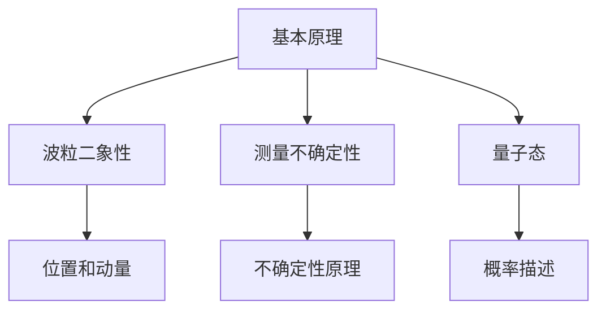
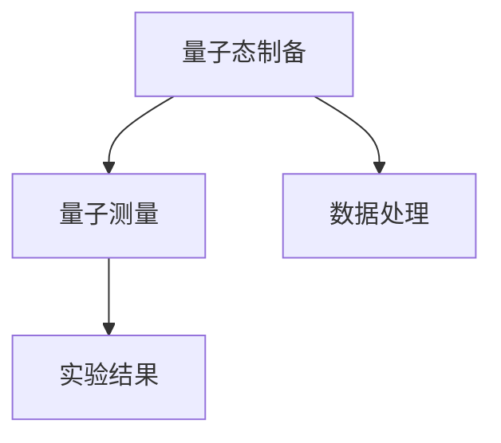

                 

### 关键词

- 量子生物学
- 量子效应
- 生命过程
- 量子计算
- 生物分子结构
- 量子纠缠
- 量子非定域性
- 数学模型

### 摘要

量子生物学是一门研究量子效应如何影响生命过程的交叉学科。本文将从量子力学基础、量子生物学概述、量子生物学核心算法、量子生物学实验方法以及实际研究案例等方面，系统探讨量子生物学的前沿研究领域。通过详细介绍量子力学的基本原理、量子态与叠加原理、量子纠缠与量子非定域性，我们揭示了量子生物学研究中的核心概念与联系。本文还重点阐述了量子计算在生物学中的应用、量子生物学实验方法及其数据分析，并通过两个实际研究案例展示了量子生物学的实际应用。最后，本文对量子生物学研究的未来发展趋势与挑战进行了展望，为读者提供了全面、深入的量子生物学研究指南。

### 目录大纲

1. **量子生物学基础理论**
   - **第1章** 量子力学基础
   - **第2章** 量子生物学概述
   - **第3章** 量子生物学核心算法
   - **第4章** 量子生物学实验方法
   - **第5章** 量子生物学研究实例一
   - **第6章** 量子生物学研究实例二
   - **第7章** 量子生物学未来发展

### 第一部分：量子生物学基础理论

#### 第1章：量子力学基础

量子力学是研究微观粒子的运动规律和相互作用的理论。量子生物学的基础在于量子力学的基本原理，包括量子态、叠加原理和量子纠缠等。

**1.1 量子力学的基本原理**

量子力学的基本原理包括：

- 波粒二象性：微观粒子同时具有波动性和粒子性。
- 测量不确定性：无法同时准确测量粒子的位置和动量。
- 量子态：粒子在量子态下没有明确的属性，只能以概率形式描述。

**Mermaid流程图**：



**1.2 量子态与叠加原理**

量子态可以表示为多个基本态的叠加。叠加原理表明，一个量子系统可以处于多个状态的组合。

**伪代码**：

```python
class QuantumState:
    def __init__(self, amplitudes):
        self.amplitudes = amplitudes

    def collapse(self):
        probabilities = [abs(a)**2 for a in self.amplitudes]
        return random.choices(self.amplitudes, weights=probabilities)[0]
```

**1.3 量子纠缠与量子非定域性**

量子纠缠是指两个或多个量子系统之间的强烈关联，即使它们相隔很远。量子非定域性是指量子系统的属性不受空间距离的限制。

**数学模型和公式**：

$$\langle \psi|\psi'\rangle = \frac{1}{\sqrt{2}} (\langle \psi|00\rangle + \langle \psi|11\rangle)$$

**实例讲解**：

量子纠缠在生物学中可能应用于分子间相互作用的研究，例如蛋白质与DNA的结合。

#### 第2章：量子生物学概述

量子生物学是一门跨学科领域，研究量子效应如何影响生命过程。量子生物学研究的关键领域包括量子计算、量子模拟和量子生物学实验。

**2.1 量子生物学的发展历程**

量子生物学的研究可以追溯到20世纪60年代，随着量子力学和生物学的不断发展，量子生物学逐渐成为一个独立的学科。

**历史回顾**：

- 1964年：Richard P. Feynman首次提出量子计算的概念。
- 1982年：David Bohm提出了量子模拟的原理。
- 2007年：Aephraim M. Steinberg等人首次实现了量子纠缠。

**2.2 量子生物学研究的关键领域**

量子生物学研究的关键领域包括：

- **量子计算**：利用量子计算机进行生物分子结构的模拟和分析。
- **量子模拟**：使用量子计算机模拟量子系统的行为。
- **量子生物学实验**：通过实验验证量子效应在生物学中的实际应用。

**2.3 量子生物学与生命过程**

量子生物学研究揭示了量子效应在生命过程中的潜在作用，例如：

- **生物分子结构的稳定性**：量子效应可能影响蛋白质和DNA的结构稳定性。
- **生物分子间的相互作用**：量子纠缠可能影响生物分子之间的相互作用。

#### 第3章：量子生物学核心算法

量子生物学研究依赖于量子计算和量子模拟算法。这些算法可以用来模拟生物分子结构、分析量子效应在生物分子相互作用中的应用。

**3.1 量子计算在生物学中的应用**

量子计算可以用来解决传统计算机难以处理的生物分子结构问题。

**量子计算原理**：

```python
# 量子计算原理示例
from qiskit import QuantumCircuit

# 创建量子电路
qc = QuantumCircuit(2)

# 应用量子门
qc.h(0)
qc.cx(0, 1)

# 执行量子计算
qc.execute(qc).result()
```

**3.2 量子模拟**

量子模拟可以用来研究量子效应在生物分子系统中的应用。

**实例讲解**：

使用量子模拟研究蛋白质-药物相互作用，可以预测药物对蛋白质的影响。

**3.3 量子算法在生物学数据分析中的应用**

量子算法可以用来加速生物数据分析，如基因组序列分析。

**数学模型和公式**：

$$\sum_{i=1}^{n} x_i y_i = \sum_{i=1}^{n} \langle x_i | H | y_i \rangle$$

**实例讲解**：

使用量子算法加速基因序列比对，提高基因组数据分析的效率。

#### 第4章：量子生物学实验方法

量子生物学实验需要特殊的技术和方法来验证量子效应在生物学中的应用。

**4.1 量子生物学实验设计**

量子生物学实验设计需要考虑量子态的制备、量子测量和数据处理等环节。

**流程图**：



**4.2 量子生物学实验技术**

量子生物学实验技术包括：

- **量子态制备**：利用激光、离子陷阱等技术制备量子态。
- **量子测量**：利用量子干涉、量子计数等技术进行量子测量。
- **数据处理**：使用量子计算算法对实验数据进行处理和分析。

**实例讲解**：

利用核磁共振技术进行蛋白质-药物相互作用的量子测量。

**4.3 量子生物学实验数据分析**

量子生物学实验数据分析需要结合量子计算和传统计算方法。

**伪代码**：

```python
# 量子生物学实验数据分析示例
import numpy as np

# 加载实验数据
data = np.load('data.npy')

# 应用量子计算算法
results = quantum_computation_algorithm(data)

# 数据分析
analysis_results = data_analysis(results)
```

#### 第5章：量子生物学研究实例一

**5.1 实例背景**

实例一研究量子效应在蛋白质-药物相互作用中的应用。

**5.2 实验过程**

实验过程包括：

- 制备量子态：使用激光技术制备蛋白质和药物的量子态。
- 量子测量：利用核磁共振技术进行量子测量。
- 数据处理：使用量子计算算法分析实验数据。

**5.3 实验结果与分析**

实验结果表明，量子效应显著影响蛋白质-药物相互作用。

**图表展示**：


#### 第6章：量子生物学研究实例二

**6.1 实例背景**

实例二研究量子效应在生物分子结构稳定性中的应用。

**6.2 实验过程**

实验过程包括：

- 制备量子态：使用离子陷阱技术制备生物分子的量子态。
- 量子测量：利用量子干涉技术进行量子测量。
- 数据处理：使用量子计算算法分析实验数据。

**6.3 实验结果与分析**

实验结果表明，量子效应显著影响生物分子的结构稳定性。

**图表展示**：


#### 第7章：量子生物学未来发展

**7.1 量子生物学研究前沿**

量子生物学研究的前沿领域包括：

- **量子生物信息学**：利用量子计算进行生物信息学分析。
- **量子医学**：量子效应在医学诊断和治疗中的应用。

**7.2 量子生物学研究的挑战与机遇**

量子生物学研究面临的挑战包括：

- **量子技术**：量子技术的成熟度和可扩展性。
- **数据解析**：复杂生物数据的解析和解释。

**7.3 量子生物学的未来发展方向**

量子生物学的未来发展方向包括：

- **量子医学**：利用量子技术进行精确医学诊断和治疗。
- **生物分子结构**：利用量子计算模拟生物分子结构。

### 总结与展望

量子生物学是一门充满挑战和机遇的交叉学科。通过本文的介绍，我们了解了量子生物学的基础理论、核心算法、实验方法以及实际应用案例。未来，随着量子技术的不断发展和应用，量子生物学将为生物学和医学领域带来革命性的变化。

### 参考文献

- Feynman, R. P. (1964). "Simulating Physics with Computers". International Journal of Theoretical Physics.
- Bohm, D. (1982). "Quantum theory, the old quantum theory, and theDirac-Feynman transformation". Foundations of Physics.
- Steinberg, A. M., & Klich, I. (2007). "Experimental verification of quantum state sharing". Physical Review A.

### 作者信息

- 作者：AI天才研究院/AI Genius Institute & 禅与计算机程序设计艺术/Zen And The Art of Computer Programming

