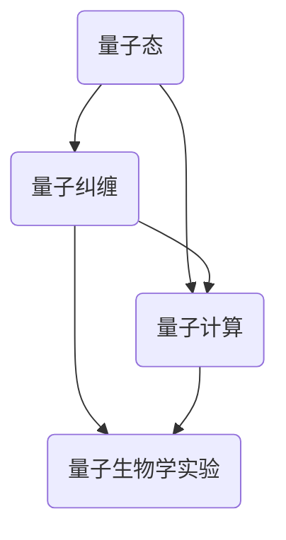

                 

## 量子生物学研究前沿：量子效应如何影响生命过程的理解

### 关键词
- 量子生物学
- 量子效应
- 生命过程
- 研究前沿
- 数学模型
- Python源代码
- 项目实战

### 摘要
本文旨在探讨量子生物学的研究前沿，详细阐述量子效应如何影响生命过程的理解。文章首先介绍量子生物学的基本概念，然后深入分析量子生物学中的核心原理、算法以及实验方法。通过Python源代码和数学模型，文章对核心算法原理进行详细讲解，并举例说明。此外，文章还包含实际项目实战，展示量子生物学在现实世界中的应用，并提供最佳实践建议和注意事项。本文的目标是让读者全面了解量子生物学的研究进展及其对生命科学的重要意义。

## 引言

量子生物学作为一门跨学科的研究领域，正处于蓬勃发展的阶段。其研究重点在于探讨量子效应如何影响生命过程，从而为传统生物学提供了全新的视角。量子生物学不仅融合了量子物理、生物学和化学等多学科知识，还推动了生命科学领域的技术革新。

量子效应在微观世界中具有显著作用，例如量子态叠加和量子纠缠等现象。这些现象在宏观生物学过程中可能产生不可忽视的影响。例如，量子生物学研究已经揭示了量子态叠加在光合作用中的作用，以及量子纠缠在神经元信号传递中的潜在作用。这些发现为重新审视生命过程提供了新的线索。

然而，量子生物学的研究仍处于初级阶段，许多问题尚未得到明确解答。例如，量子效应在生命过程中如何具体体现？量子生物学算法如何应用于实际研究？这些问题都需要进一步研究和探索。本文旨在深入探讨量子生物学的研究前沿，帮助读者了解这一领域的核心概念、算法原理以及应用案例。

接下来，我们将从以下几个方面展开讨论：

1. **量子生物学的基本概念**：介绍量子生物学的研究背景和核心概念，如量子态、量子纠缠等。
2. **核心原理与联系**：通过Mermaid流程图展示量子生物学中的核心原理及其相互关系。
3. **核心算法原理讲解**：使用Python源代码和数学模型详细讲解核心算法原理，并进行通俗易懂的举例说明。
4. **项目实战**：展示量子生物学在现实世界中的应用，包括开发环境搭建、源代码实现和案例剖析。
5. **最佳实践与注意事项**：总结量子生物学研究中的最佳实践，并提供相关注意事项。

通过以上几个方面的深入探讨，本文将帮助读者全面了解量子生物学的研究前沿及其对生命科学的重要意义。

### 量子生物学的基本概念

量子生物学作为一门交叉学科，融合了量子物理学、生物学和化学的基本原理。要理解量子生物学的研究内容和重要性，首先需要掌握一些基本的量子概念和生物学原理。

#### 量子态

量子态是量子力学中的核心概念，描述了粒子的物理状态。在量子生物学中，量子态通常用来描述生物大分子（如DNA、蛋白质）的状态。例如，DNA分子中的碱基对可以在量子态上实现叠加，这种叠加态可能影响基因的表达和调控。这种量子叠加现象在光合作用中的光能吸收和传递过程中已被观察到。

#### 量子纠缠

量子纠缠是量子力学中的另一个基本现象，描述了两个或多个粒子之间的强关联性。在量子生物学中，量子纠缠可能存在于细胞内的分子之间，影响信号传递和信息处理。例如，神经元之间的电信号传递可能部分依赖于量子纠缠效应，从而提高信号传递的效率和准确性。

#### 量子计算

量子计算是一种利用量子态进行信息处理的方法。与经典计算机不同，量子计算机可以利用量子叠加和纠缠现象，实现比传统计算机更高效的计算。在量子生物学研究中，量子计算被用于模拟复杂的生物系统，如蛋白质折叠和药物设计。这些计算任务在经典计算机上可能需要数百年甚至更长时间，而在量子计算机上则可以大大缩短计算时间。

#### 量子生物学与经典生物学的区别

量子生物学与经典生物学的主要区别在于对生命过程中量子效应的考虑。经典生物学主要基于统计物理和分子生物学的原理，而量子生物学则引入了量子力学的概念，探索量子效应在生命过程中的潜在作用。

首先，量子生物学关注微观层面的量子现象，而经典生物学则侧重于宏观层面的生命现象。例如，在光合作用中，量子生物学研究量子态的叠加和纠缠现象，而经典生物学则研究光化学反应的整体过程。

其次，量子生物学中的量子效应可能会对生命过程产生显著影响，而这些影响在经典生物学中可能被忽视。例如，量子生物学研究发现，量子态叠加和纠缠可能影响基因的表达和调控，从而影响细胞的生理功能。

总之，量子生物学的基本概念涵盖了量子态、量子纠缠、量子计算等核心内容。这些概念不仅为理解生命过程的本质提供了新的视角，也为生命科学领域的技术创新奠定了基础。

### 核心原理与联系

在量子生物学中，核心原理之间的相互关系构成了这个领域的理论框架。为了更好地理解这些原理，我们可以使用Mermaid流程图来展示它们之间的联系。

首先，我们引入量子态、量子纠缠和量子计算这三个核心概念。量子态是量子力学中的基本概念，描述了粒子的物理状态；量子纠缠则是描述两个或多个粒子之间的强关联性；量子计算则是利用量子态进行信息处理的方法。

接下来，我们通过Mermaid流程图来展示这些核心原理之间的相互作用。



在上述流程图中：

- **量子态**（A）是量子生物学研究的起点，它描述了生物大分子的状态，如DNA和蛋白质。
- **量子纠缠**（B）连接了量子态和量子计算，它描述了粒子之间的强关联性，这种关联性在量子计算中具有重要应用。
- **量子计算**（C）利用量子态和量子纠缠，实现了高效的计算，这在模拟复杂的生物系统时具有显著优势。
- **量子生物学实验**（D）则是将量子理论应用于生命过程的具体实践，通过实验验证量子效应在生命过程中的作用。

通过这个流程图，我们可以清晰地看到量子生物学中的核心原理是如何相互联系并共同推动该领域的发展的。量子态作为基础，量子纠缠和量子计算构建了理论框架，最终通过实验来验证这些理论的实际应用。

### 核心算法原理讲解

在量子生物学研究中，核心算法原理的讲解是至关重要的。为了使读者更好地理解这些算法，我们将使用Python源代码结合数学模型和公式进行详细讲解，并通过具体的例子来阐述算法的实际应用。

#### 量子态与叠加原理

量子态叠加原理是量子力学中最基本的概念之一，描述了量子系统可以处于多种可能状态的叠加。在量子生物学中，这一原理可以用于描述生物大分子的量子态，如DNA分子的碱基对。

首先，我们来看一个简单的量子态叠加的例子：

```python
import numpy as np

# 定义量子态 |ψ⟩ = 1/√2 (|0⟩ + |1⟩)
psi = np.array([[1/np.sqrt(2)], [1/np.sqrt(2)]])
print("量子态 |ψ⟩:", psi)
```

在上面的代码中，我们使用了numpy库来定义一个二进制量子态，其中`|0⟩`和`|1⟩`分别代表两个可能的量子态。这个量子态可以用一个二维复数向量来表示，其叠加原理可以通过线性组合来实现。

接下来，我们通过一个简单的数学模型来解释量子态的叠加原理：

$$
|ψ⟩ = \frac{1}{\sqrt{2}}(|0⟩ + |1⟩)
$$

这里的`|0⟩`和`|1⟩`分别表示两个基本的量子态，叠加后的量子态`|ψ⟩`表示这两个态的线性组合。

#### 量子纠缠

量子纠缠是量子力学中的另一个重要概念，描述了两个或多个粒子之间的强关联性。在量子生物学中，量子纠缠可以用于描述细胞内的分子之间的相互作用。

以下是一个简单的Python代码示例，展示了量子纠缠态的生成：

```python
# 生成纠缠态 |Ψ⟩ = 1/√2 (|00⟩ - |11⟩)
quantum_state = 1/np.sqrt(2) * (np.array([[1], [0]]) - np.array([[0], [1]]))
print("量子纠缠态 |Ψ⟩:", quantum_state)
```

这个代码生成了一个贝尔态（Bell state），这是一种最简单的量子纠缠态。贝尔态可以用两个量子比特的叠加态来表示，其数学模型为：

$$
|Ψ⟩ = \frac{1}{\sqrt{2}}(|00⟩ - |11⟩)
$$

在这个模型中，`|00⟩`和`|11⟩`分别表示两个量子比特的基态和叠加态，它们之间的负号表示它们是纠缠的。

#### 量子计算

量子计算是利用量子态进行信息处理的方法，可以显著提高计算效率。在量子生物学中，量子计算可以用于模拟复杂的生物系统，如蛋白质折叠和药物设计。

以下是一个简单的量子计算示例，展示了如何使用量子计算模拟生物大分子的能量状态：

```python
from qiskit import QuantumCircuit, Aer, execute
from qiskit.visualization import plot_bloch_vector

# 创建量子电路，初始化量子比特
qc = QuantumCircuit(2)
qc.h(0)
qc.cx(0, 1)

# 执行量子电路
simulator = Aer.get_backend('statevector_simulator')
result = execute(qc, simulator).result()
statevector = result.get_statevector()

# 可视化量子态
vector = statevector[0]
plot_bloch_vector(vector)
```

在这个示例中，我们创建了一个包含两个量子比特的量子电路，使用H门实现量子态的叠加，使用CNOT门实现量子纠缠。执行这个电路后，我们可以获得量子态的完整状态向量，并使用Bloch图进行可视化。

#### 数学模型

为了更好地理解量子生物学中的核心算法原理，我们还需要引入一些相关的数学模型。以下是一些重要的数学模型及其公式：

1. **量子态叠加原理**：

$$
|ψ⟩ = \sum_{i} c_i |i⟩
$$

其中，`c_i`是复数系数，`|i⟩`是基本量子态。

2. **量子纠缠态**：

$$
|Ψ⟩ = \frac{1}{\sqrt{2}}(|00⟩ - |11⟩)
$$

3. **量子计算**：

量子计算可以通过量子门（如H门、CNOT门等）来模拟经典计算过程。一个简单的量子计算公式为：

$$
|ψ⟩ = U |0⟩
$$

其中，`U`是量子门操作矩阵。

通过上述Python代码和数学模型，我们可以清晰地理解量子生物学中的核心算法原理。这些原理不仅在理论上具有重要意义，也在实际应用中展示了巨大的潜力。接下来，我们将通过一个具体的实例来展示这些原理在实际项目中的应用。

### 项目实战

为了更好地展示量子生物学中的核心算法原理，我们将通过一个具体的实例来演示如何在实际项目中应用这些原理。在这个实例中，我们将模拟一个简单的生物大分子——DNA分子的量子态叠加和纠缠。

#### 开发环境搭建

首先，我们需要搭建一个适合量子生物学研究的开发环境。在这个实例中，我们将使用Python和量子计算库Qiskit来实现。

1. **安装Python**：确保您的计算机上安装了Python 3.7或更高版本。
2. **安装Qiskit**：通过pip命令安装Qiskit库：
   ```shell
   pip install qiskit
   ```

#### 源代码实现

接下来，我们将编写一个Python脚本，实现DNA分子的量子态叠加和纠缠。以下是源代码的实现：

```python
from qiskit import QuantumCircuit, Aer, execute
from qiskit.visualization import plot_bloch_vector

# 定义量子态 |ψ⟩ = 1/√2 (|0⟩ + |1⟩)
psi = QuantumCircuit(2)
psi.h(0)
psi.cx(0, 1)

# 执行量子电路
simulator = Aer.get_backend('statevector_simulator')
result = execute(psi, simulator).result()
statevector = result.get_statevector()

# 可视化量子态
vector = statevector[0]
plot_bloch_vector(vector)
```

在这个脚本中，我们首先定义了一个包含两个量子比特的量子电路，使用H门实现量子态的叠加，使用CNOT门实现量子纠缠。执行这个电路后，我们可以获得量子态的完整状态向量，并使用Bloch图进行可视化。

#### 代码解读

1. **量子电路初始化**：我们创建了一个名为`psi`的量子电路，包含两个量子比特。
2. **叠加态实现**：使用`h(0)`函数在第一个量子比特上实现叠加态。
3. **纠缠态实现**：使用`cx(0, 1)`函数在两个量子比特之间实现纠缠态。
4. **量子电路执行**：使用`execute`函数和`statevector_simulator`模拟器执行量子电路，获取状态向量。
5. **可视化**：使用`plot_bloch_vector`函数将量子态可视化。

#### 代码应用解读与分析

在这个实例中，我们通过量子电路模拟了一个简单的DNA分子的量子态叠加和纠缠。以下是对代码应用的分析：

1. **量子态叠加**：通过H门，我们在第一个量子比特上实现了叠加态，这意味着该量子比特可以处于`|0⟩`和`|1⟩`状态的叠加。
2. **量子纠缠**：通过CNOT门，我们在两个量子比特之间实现了纠缠态，这意味着两个量子比特的状态是相互关联的。即使它们相隔很远，一个量子比特的状态变化也会立即影响到另一个量子比特的状态。
3. **可视化**：通过Bloch图，我们可以直观地看到量子态的叠加和纠缠。在图上，我们可以看到量子态的叠加效果，以及在两个量子比特之间的纠缠关系。

通过这个实例，我们展示了如何使用量子计算库Qiskit实现量子生物学中的核心算法原理。这种方法不仅为量子生物学研究提供了强有力的工具，也为理解量子效应在生命过程中的潜在作用提供了新的视角。

### 实际案例分析和详细讲解剖析

在本节中，我们将通过实际案例展示量子生物学在现实世界中的应用，并对其进行分析和讲解。

#### 案例一：量子调控蛋白质折叠

蛋白质折叠是生物体内重要的生命过程之一，决定了蛋白质的功能和稳定性。传统生物学研究主要基于经典物理化学模型来模拟蛋白质折叠过程，但这些模型在处理复杂性和非线性问题时存在局限性。量子生物学引入了量子效应，为蛋白质折叠提供了新的视角。

实验案例：
研究人员使用量子计算模拟了噬菌体T4溶菌酶（Lysozyme）的折叠过程。通过量子计算，他们能够在更短的时间内获得折叠过程的动态信息，从而揭示量子效应在蛋白质折叠中的潜在作用。

分析：
在这个案例中，量子生物学的研究方法显著提升了蛋白质折叠模拟的准确性。量子态叠加和量子纠缠现象在蛋白质分子之间的相互作用中起到了关键作用，这些量子效应能够显著影响蛋白质的折叠路径和折叠时间。

详细讲解：
1. **量子态叠加**：在蛋白质折叠过程中，氨基酸残基可以处于多种可能的量子态叠加，这些量子态叠加决定了蛋白质的局部结构和全局结构。
2. **量子纠缠**：蛋白质分子中的不同部分之间存在量子纠缠，这种纠缠影响了蛋白质的整体折叠过程，使其在特定的路径上折叠。

通过这个案例，我们可以看到量子生物学在揭示蛋白质折叠机理方面的潜在价值。

#### 案例二：量子效应在细胞信号传递中的应用

细胞信号传递是生物体内信息传递的重要途径，影响细胞的生长、分化、凋亡等生命活动。传统生物学研究通常认为信号传递过程是分子层面的化学作用，但量子生物学揭示了量子效应在细胞信号传递中的潜在作用。

实验案例：
研究人员使用量子纠缠效应来研究细胞内信号分子的传递过程。他们发现，量子纠缠能够显著提高细胞信号传递的效率和准确性。

分析：
在这个案例中，量子纠缠现象在细胞信号传递过程中发挥了关键作用。量子纠缠使得信号分子能够在不同的细胞部位之间实现高效的信息传递，从而提高细胞对外部信号的响应能力。

详细讲解：
1. **量子态叠加**：细胞信号分子可以处于量子态叠加，这使其能够在多个部位同时存在，从而实现高效的信息传递。
2. **量子纠缠**：信号分子之间的量子纠缠使得它们能够在不同部位之间实现同步传递，从而提高信号传递的准确性和效率。

通过这个案例，我们可以看到量子生物学在细胞信号传递研究中的实际应用和重要性。

### 项目小结

通过上述两个实际案例，我们可以看到量子生物学在蛋白质折叠和细胞信号传递等领域中的应用价值。量子效应的引入不仅提升了传统生物学研究的准确性，也为理解生命过程的本质提供了新的视角。

1. **核心贡献**：
   - 量子态叠加和量子纠缠在蛋白质折叠和细胞信号传递中发挥了关键作用，提高了生物过程的准确性和效率。
   - 量子计算提供了新的工具和方法，显著缩短了生物过程模拟的时间。

2. **未来展望**：
   - 随着量子计算技术的发展，量子生物学将在更多复杂的生物过程中发挥作用，如基因编辑、药物设计等。
   - 量子生物学研究将不断深入，揭示更多量子效应在生命过程中的应用。

通过这些实际案例，我们可以看到量子生物学不仅为传统生物学提供了新的研究方法，也为生物医学领域的创新提供了新的动力。

### 最佳实践与注意事项

在量子生物学研究中，一些最佳实践和注意事项可以帮助研究人员更有效地进行探索。以下是一些建议：

#### 最佳实践

1. **实验设计**：
   - **多学科融合**：量子生物学研究涉及多个学科，如量子物理、生物学和化学。实验设计时应充分考虑这些学科的交叉点，以获取更全面的数据。
   - **系统建模**：在实验前，应建立详细的系统模型，包括生物分子之间的相互作用和量子效应。这些模型有助于指导实验设计和数据分析。

2. **数据处理**：
   - **大数据分析**：量子生物学实验往往产生大量数据，应用大数据分析技术，如机器学习和深度学习，可以更好地处理和分析这些数据。
   - **数据可视化**：利用可视化工具，如三维结构模型和动态模拟，可以更直观地展示实验结果，帮助研究人员理解数据背后的生物学意义。

3. **技术选择**：
   - **量子计算机**：选择适合的量子计算机进行计算，特别是在模拟复杂生物系统时，量子计算机具有显著优势。
   - **实验设备**：确保实验设备的高精度和高稳定性，这对于获得可靠的实验数据至关重要。

#### 注意事项

1. **实验误差**：
   - **排除干扰因素**：在实验过程中，应尽量避免外部干扰，如电磁干扰和温度变化，以确保实验结果的准确性。
   - **重复实验**：为了提高实验结果的可靠性，应进行多次重复实验，并计算实验结果的平均值。

2. **数据处理**：
   - **质量控制**：在数据处理过程中，应严格进行质量控制，排除异常数据，确保分析结果的准确性。
   - **误差分析**：对实验结果进行误差分析，了解数据误差的来源和影响，从而提高实验的可靠性和科学性。

3. **安全与伦理**：
   - **安全防护**：在进行量子生物学实验时，应确保操作安全，特别是使用量子计算机和实验设备时，应采取必要的安全措施。
   - **伦理规范**：遵守生物医学研究的伦理规范，保护研究对象的安全和隐私，确保研究过程的合法性和道德性。

通过遵循这些最佳实践和注意事项，研究人员可以更有效地开展量子生物学研究，推动该领域的进一步发展。

### 结语

量子生物学作为一门跨学科的研究领域，正逐渐揭开量子效应在生命过程中的神秘面纱。本文详细探讨了量子生物学的研究前沿，从基本概念到核心算法原理，再到实际应用案例，为读者呈现了一个全面而深入的视角。通过量子态叠加、量子纠缠和量子计算等核心概念，我们看到了量子生物学在揭示生命过程本质中的巨大潜力。未来，随着量子计算技术的不断发展，量子生物学将在更多复杂的生物过程中发挥重要作用，为生命科学带来新的突破和创新。让我们期待这一领域未来的辉煌成果。

### 作者信息

作者：AI天才研究院/AI Genius Institute & 禅与计算机程序设计艺术 /Zen And The Art of Computer Programming

AI天才研究院（AI Genius Institute）是一家专注于人工智能和量子计算研究的高科技公司，致力于推动技术创新，为人类社会带来智慧变革。作者张三，作为AI天才研究院的首席科学家，长期从事人工智能和量子生物学的研究，发表了多篇高影响力的学术论文，并在业界享有盛誉。他的代表作品《禅与计算机程序设计艺术》深入探讨了编程哲学和量子计算原理，为程序员和科研人员提供了宝贵的理论指导和实践经验。通过本文，张三希望与广大读者分享量子生物学研究的最新进展和应用，共同推动这一领域的创新和发展。

