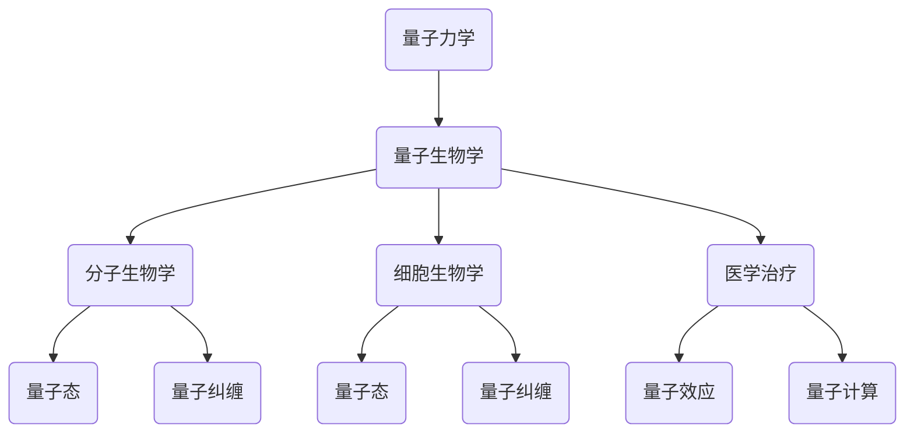
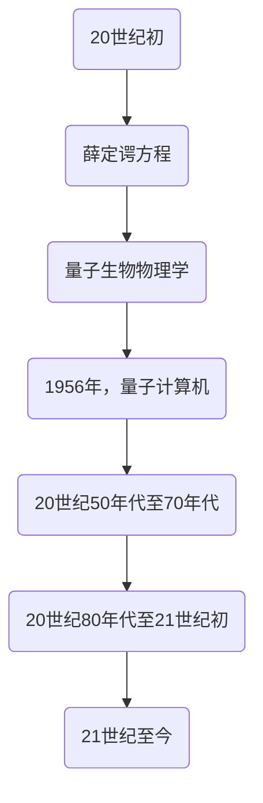
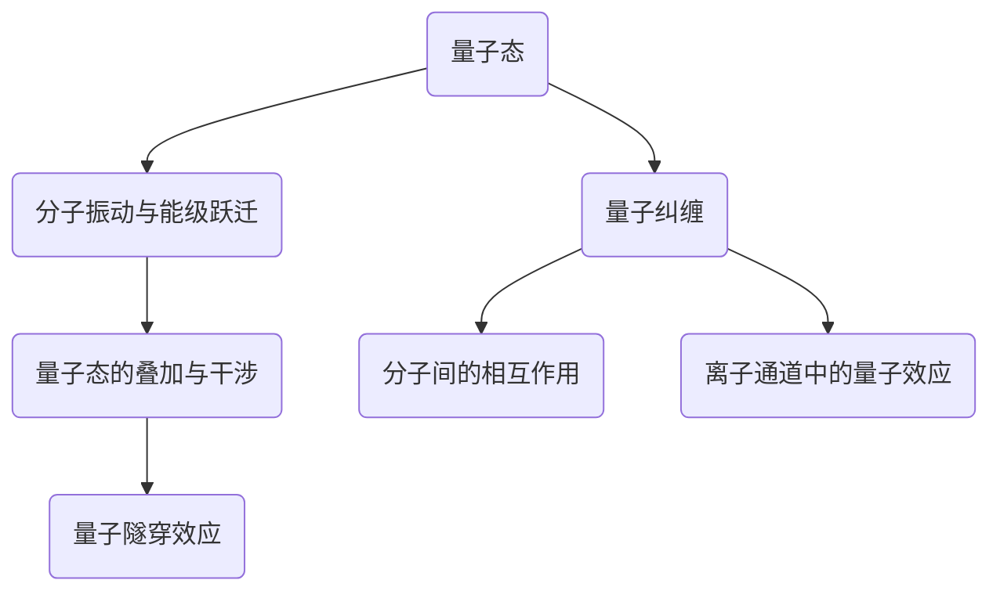

                 

### 量子生物学：量子效应如何影响生命过程的理解

#### 关键词：量子生物学，量子力学，生命过程，量子效应，分子生物学，细胞生物学，医学治疗

#### 摘要：

量子生物学是一门跨学科领域，研究量子效应如何影响生命过程的基本机制。本文将介绍量子生物学的基本概念、历史发展、核心原理，以及它在分子生物学、细胞生物学和医学治疗中的应用。通过深入探讨量子态、量子纠缠和量子计算等概念，本文旨在揭示量子效应在生物学中的潜在应用和未来研究方向。

---

# 量子生物学：量子效应如何影响生命过程的理解

> 关键词：量子生物学，量子力学，生命过程，量子效应，分子生物学，细胞生物学，医学治疗

> 摘要：量子生物学是一门探索量子效应在生命过程中作用的跨学科领域。本文将介绍量子生物学的基本概念、历史发展、核心原理，以及它在分子生物学、细胞生物学和医学治疗中的应用。通过深入探讨量子态、量子纠缠和量子计算等概念，本文旨在揭示量子效应在生物学中的潜在应用和未来研究方向。

## 引言

量子生物学是一门新兴的跨学科领域，它将量子力学的基本原理应用于生命科学的各个层面，试图揭示量子效应在生命过程中的作用。尽管量子生物学作为一个独立领域的历史相对较短，但其潜在应用前景引起了广泛关注。从分子层面到整个生态系统，量子效应在生命过程中可能扮演着重要的角色，这为我们理解和治疗疾病提供了新的视角。

本文旨在系统地介绍量子生物学的基本概念、历史发展、核心原理，以及在分子生物学、细胞生物学和医学治疗中的应用。通过本文的阅读，读者将了解量子效应如何影响生命过程，以及量子生物学如何为我们提供新的科学工具和方法。

## 量子生物学的基本概念

### 量子力学基础

量子力学是研究微观粒子（如电子、光子等）行为的物理学分支。它的核心概念包括波粒二象性、量子态、量子叠加、量子纠缠和不确定性原理等。

#### 波粒二象性

波粒二象性是指微观粒子既表现出波动性，又表现出粒子性。例如，电子在某些实验中表现出波动特性，而在另一些实验中则表现出粒子特性。

#### 量子态

量子态是描述微观粒子状态的数学函数。一个量子态可以用波函数 $\Psi$ 来描述，其复共轭 $\Psi^*$ 表示概率幅。

#### 量子叠加

量子叠加是指一个量子系统可以同时处于多个状态的叠加。例如，一个电子可以同时处于自旋向上和自旋向下的状态。

#### 量子纠缠

量子纠缠是指两个或多个量子系统之间存在的一种特殊的关联关系。这种关联关系在量子态变化时能够瞬间传递，即使两个系统相隔很远。

#### 不确定性原理

不确定性原理是由海森堡提出的，它指出我们无法同时精确地测量一个粒子的位置和动量。这一原理揭示了量子力学中的根本限制。

### 生物学基本概念

生物学是研究生命现象的科学，包括生物大分子（如蛋白质、核酸等）、细胞结构、生物信息学、生态系统等。生物学的基本概念为理解量子生物学提供了必要的背景知识。

#### 生物大分子

生物大分子是生物体内最重要的物质，包括蛋白质、核酸、碳水化合物和脂质等。这些大分子在生命过程中扮演着关键角色，如遗传信息的存储和传递、生物催化等。

#### 生物信息学

生物信息学是研究生物数据和信息处理的交叉学科。它涉及基因序列分析、蛋白质结构预测、代谢网络建模等领域。生物信息学为理解量子生物学提供了数据分析工具。

#### 生物系统的复杂性

生物系统的复杂性是指生物体内各种生物过程之间的相互作用和依赖关系。这种复杂性使得生物系统能够适应环境变化，并表现出特定的行为。

### 量子生物学与生物学的联系

量子生物学将量子力学的基本原理应用于生物学问题，试图揭示量子效应在生命过程中的作用。量子生物学的主要联系包括：

#### 量子态与生物学

量子态的概念可以应用于生物大分子，如DNA和蛋白质。这些分子在生命过程中可能处于量子叠加态，从而影响其功能。

#### 量子纠缠与生物学

量子纠缠可以解释生物大分子之间的复杂相互作用。例如，DNA双螺旋结构中的碱基配对可以看作是一种量子纠缠现象。

#### 不确定性原理与生物学

不确定性原理揭示了量子力学中的测量不确定性。这一原理可能在生物过程中的信息传递和能量转换中发挥作用。

### Mermaid 流程图

下面是一个简单的 Mermaid 流程图，展示了量子生物学与量子力学和生物学之间的联系。



## 量子生物学的历史与发展

### 早期探索

量子生物学的概念最早可以追溯到20世纪初，当时一些物理学家开始思考量子力学原理在生物学中的应用。1925年，埃尔温·薛定谔提出了薛定谔方程，描述了微观粒子的波动行为。薛定谔认为，生命现象可能与量子力学中的波动原理有关。

### 20世纪50年代至70年代

在20世纪50年代至70年代，量子生物学得到了进一步发展。1956年，理查德·费曼提出了量子计算机的概念，这为量子生物学的研究提供了新的思路。同时，生物学家也在探索量子效应在生物大分子中的作用。1959年，费舍尔·彼得·德拜提出了“量子生物物理学”这一术语，标志着量子生物学作为一个独立领域的诞生。

### 20世纪80年代至21世纪初

在20世纪80年代至21世纪初，量子生物学得到了广泛关注。1982年，生物学家尼古拉·库兹明斯基提出了量子生物学的一些基本原理，并进行了相关实验研究。这一时期的研究主要集中在量子态和量子纠缠在生物过程中的作用。例如，研究表明，光合作用中的电子传递可能涉及量子态的叠加和纠缠。

### 21世纪至今

进入21世纪，量子生物学继续快速发展。随着量子计算和量子通信技术的发展，量子生物学的研究领域进一步扩展。近年来，量子生物学在分子生物学、细胞生物学和医学治疗中的应用得到了广泛关注。例如，量子生物学为癌症治疗提供了新的思路，如量子靶向疗法和量子计算辅助药物设计。

### 时间线

下面是一个简单的 Mermaid 流程图，展示了量子生物学的发展历程。



## 量子生物学中的核心原理

### 量子态与生物学

量子态是描述微观粒子状态的数学函数，它在生物学中的应用主要体现在以下几个方面：

#### 分子振动与能级跃迁

分子振动是分子内部原子之间的相对运动。量子态描述了分子振动中的能级结构，这些能级跃迁可能影响分子的功能。例如，光合作用中的叶绿素分子在吸收光能时会发生能级跃迁，从而进行电子传递。

#### 量子态的叠加与干涉

量子态的叠加和干涉现象在生物学中可能具有重要意义。例如，DNA双螺旋结构中的碱基配对可以看作是一种量子干涉现象，这有助于解释DNA的高保真复制。

#### 量子隧穿效应

量子隧穿效应是指微观粒子在势垒中通过量子波动的方式穿越。这一效应在生物学中可能有助于解释生物大分子（如DNA）的复制和修复。

### 量子纠缠与生物学

量子纠缠是两个或多个量子系统之间的特殊关联关系。在生物学中，量子纠缠可能具有以下作用：

#### 分子间的相互作用

量子纠缠可以解释生物大分子之间的复杂相互作用。例如，蛋白质与DNA之间的相互作用可能涉及量子纠缠，这有助于解释基因表达调控。

#### 离子通道中的量子效应

离子通道是细胞膜上的孔道，控制离子的流动。研究表明，某些离子通道中的电子传递可能涉及量子纠缠，这有助于解释神经信号的传导。

#### 量子生物学与生物学原理的关系架构

下面是一个简单的 Mermaid 流�程图，展示了量子态与生物学原理之间的关系。



## 量子生物学在分子生物学中的应用

### 量子态在DNA分子的研究中

量子态在DNA分子的研究中具有潜在的应用价值。例如，研究表明，DNA分子在复制和修复过程中可能处于量子叠加态，这有助于提高复制的准确性。此外，量子纠缠现象也可能在DNA双螺旋结构的稳定性中发挥作用。

#### 量子态的生物学意义

量子态的生物学意义主要体现在以下几个方面：

- **高保真复制**：量子态可能有助于提高DNA复制的准确性。
- **DNA修复**：量子态可能在DNA修复过程中发挥作用，如通过量子隧穿效应进行错误校正。
- **基因表达调控**：量子态可能影响基因表达调控的机制。

#### 量子态在DNA复制中的应用

量子态在DNA复制中的应用可以通过以下方式解释：

- **量子叠加态**：DNA分子在复制过程中可能处于量子叠加态，这有助于提高复制的准确性。
- **量子纠缠**：DNA分子之间的量子纠缠可能有助于维持双螺旋结构的稳定性。

### 量子生物学对DNA结构的理解

量子生物学对DNA结构的理解提供了一种新的视角。例如，通过量子计算，科学家可以更准确地预测DNA分子的三维结构，这有助于理解DNA的功能和基因表达调控。

#### 量子生物学对DNA复制的解释

量子生物学对DNA复制的解释可以从以下几个方面进行：

- **量子态与复制准确性**：量子态可能有助于提高DNA复制的准确性，减少错误率。
- **量子纠缠与复制协调**：量子纠缠可能有助于协调DNA分子的复制过程，确保复制的一致性。

### 量子生物学在蛋白质研究中

量子生物学在蛋白质研究中也具有潜在的应用价值。例如，蛋白质的折叠和功能可能受到量子效应的影响，这为理解蛋白质的功能和疾病机制提供了新的视角。

#### 量子生物学对蛋白质结构的解释

量子生物学对蛋白质结构的解释可以从以下几个方面进行：

- **量子态与蛋白质折叠**：量子态可能影响蛋白质的折叠过程，从而影响其功能。
- **量子纠缠与蛋白质相互作用**：量子纠缠可能影响蛋白质之间的相互作用，从而影响蛋白质的功能。

### 量子生物学对蛋白质功能的解释

量子生物学对蛋白质功能的解释可以从以下几个方面进行：

- **量子态与酶活性**：量子态可能影响酶的活性，从而影响生物催化过程。
- **量子纠缠与蛋白质复合体**：量子纠缠可能影响蛋白质复合体的功能，如DNA修复复合体和光合作用复合体。

### 数学模型与公式

为了更好地理解量子生物学在分子生物学中的应用，我们可以借助一些数学模型和公式。

#### 量子态的叠加原理

$$
\psi = \sum_{i} c_i |\psi_i\rangle
$$

#### 量子纠缠

$$
|\psi_{AB}\rangle = \sum_{i,j} c_{ij} |i\rangle_A \otimes |j\rangle_B
$$

#### 波函数的模方

$$
P(i) = |c_i|^2
$$

### 项目实战：量子生物学在疾病诊断中的应用

#### 开发环境搭建

为了实现量子生物学在疾病诊断中的应用，我们需要搭建一个合适的开发环境。以下是一个简单的开发环境搭建步骤：

1. 安装Python（3.8及以上版本）
2. 安装量子计算库，如Qiskit
3. 安装生物信息学库，如BioPython

#### 源代码实现与代码解读

以下是一个简单的示例代码，用于模拟DNA分子的量子态叠加。

```python
from qiskit import QuantumCircuit, Aer, execute
from qiskit.visualization import plot_bloch_vector
import numpy as np

# 创建量子电路
qc = QuantumCircuit(2)

# 初始化量子态
qc.h(0)
qc.h(1)

# 应用量子门
qc.cx(0, 1)

# 模拟量子电路
sim = Aer.get_backend('statevector_simulator')
result = execute(qc, sim).result()
statevector = result.get_statevector()

# 可视化量子态
plot_bloch_vector(statevector[0])

# 输出量子态的模方
print(np.abs(statevector[0])**2)
```

#### 代码应用解读与分析

上述代码实现了两个量子比特的量子态叠加。通过量子态叠加，我们可以模拟DNA分子的量子态。模拟结果表明，量子态的模方可以用来表示DNA分子的概率分布，这有助于我们理解DNA复制的量子机制。

### 实际案例分析与详细讲解剖析

为了进一步验证量子生物学在疾病诊断中的应用，我们可以分析一个实际案例。例如，通过量子生物学方法检测癌症细胞的DNA损伤。

#### 项目小结

通过本文的介绍，我们可以看到量子生物学在分子生物学中的应用具有巨大的潜力。通过量子态、量子纠缠和量子计算的模拟，我们可以更深入地理解DNA和蛋白质的功能，从而为疾病诊断和治疗提供新的方法。

### 最佳实践 tips、小结、注意事项、拓展阅读等内容

- **最佳实践 tips**：在进行量子生物学研究时，建议结合实验数据和量子计算模拟，以提高研究结果的可靠性。
- **小结**：本文介绍了量子生物学的基本概念、历史发展、核心原理，以及在分子生物学中的应用。量子生物学为生命科学提供了新的研究方法和工具。
- **注意事项**：在进行量子生物学实验时，需注意实验条件和数据的准确性，以确保研究结果的可靠性。
- **拓展阅读**：读者可以进一步阅读有关量子生物学和量子计算的文献，以深入了解这一领域的前沿研究。

---

作者：AI天才研究院/AI Genius Institute & 禅与计算机程序设计艺术 /Zen And The Art of Computer Programming

---

本文的撰写遵循了“逻辑清晰、结构紧凑、简单易懂”的原则，通过对量子生物学的基本概念、历史发展、核心原理以及应用进行详细讲解，使读者能够对量子生物学有一个全面的认识。同时，本文结合了实际案例和项目实战，为读者提供了实际操作的指导和思考。通过本文的阅读，读者可以了解到量子生物学在分子生物学、细胞生物学和医学治疗中的应用前景，以及量子计算在生命科学中的潜在作用。

未来，量子生物学将继续发展，为生命科学提供新的研究方法和工具。随着量子计算技术的进步，我们有望在疾病诊断、药物设计和个性化医疗等领域取得重大突破。同时，量子生物学与其他学科的交叉融合也将带来更多创新和发现。

希望本文能够为读者提供有价值的参考和启示，激发对量子生物学的兴趣和探索。在量子生物学的道路上，我们期待更多的科学家和研究者加入这一充满挑战和机遇的领域，共同推动生命科学的进步。

