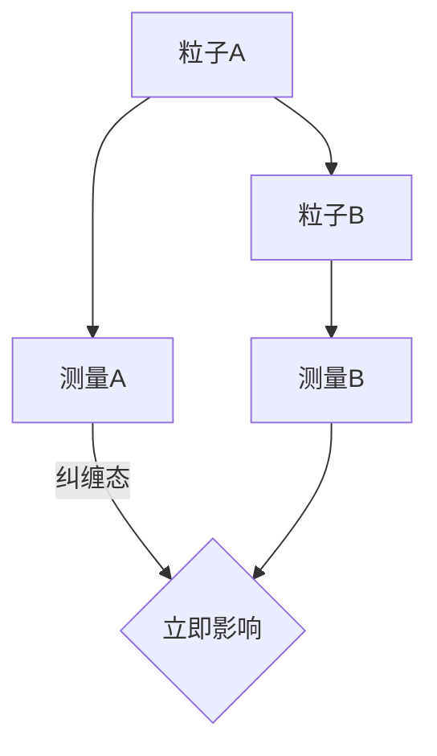

                 

### 引言

量子纠缠与宇宙的非局域性本质是现代物理学中最为引人入胜的话题之一。量子纠缠，作为一种超越经典物理的量子现象，揭示了量子系统的奇异联系。它不仅颠覆了我们对自然界的传统认知，还为现代科技的发展提供了新的思路。而宇宙的非局域性，则将这一量子现象扩展到宇宙学的广阔视野中，挑战着我们对宇宙起源和结构的理解。

首先，让我们简要介绍量子纠缠。量子纠缠是指两个或多个粒子在量子态上的紧密关联，即使它们相隔很远，其中一个粒子的状态变化会立即影响另一个粒子的状态。这一现象最早由爱因斯坦、波多尔斯基和罗森在1935年提出，被称为EPR悖论。然而，随着贝尔不等式的提出和实验验证，量子纠缠的存在得到了确认，并成为量子力学中最为重要的特性之一。

接下来，我们探讨量子纠缠与非局域性的关系。非局域性，指的是一个系统的部分与另一部分之间的即时联系，不受空间距离的限制。在经典物理中，这种即时联系被认为是不可能的。然而，量子纠缠的出现打破了这一传统观念，为非局域性提供了一个自然和合理的解释。通过Bell不等式，我们能够量化这种非局域性，并通过实验验证其存在。

文章的核心关键词包括：量子纠缠、非局域性、量子力学、宇宙学、量子通信、量子计算。这些关键词不仅涵盖了文章的主要内容，也反映了量子纠缠在物理学和技术领域的广泛影响。

文章的摘要部分将介绍量子纠缠的基本概念、非局域性的概念及其关系，以及量子纠缠在宇宙学中的应用和前景。我们将逐步深入探讨量子纠缠的数学原理和物理实验，并探讨其在通信和计算领域的实际应用。最后，我们将展望量子纠缠与宇宙非局域性的未来研究方向，讨论其潜在的影响和挑战。

通过本文的阅读，读者将了解到量子纠缠的深刻本质及其在宇宙学中的重要作用，同时也会对量子力学和现代科技的发展有更加全面的认识。

### 量子纠缠的简要介绍

量子纠缠是量子力学中的一个基本现象，描述了两个或多个粒子之间在量子态上的不可分割的关联。为了更好地理解量子纠缠，我们需要首先回顾一些量子力学的基础概念。

在量子力学中，粒子的状态不是简单的“在这里或不在那里”，而是由波函数描述的概率分布。一个粒子的波函数包含了所有可能的量子态及其对应的概率。当两个粒子处于纠缠态时，它们的波函数会纠缠在一起，形成一个整体的量子态。这种纠缠态的一个显著特点是，即使这两个粒子相隔很远，其中一个粒子的状态变化会立即影响另一个粒子的状态，这种现象被称为量子纠缠的非局域性。

量子纠缠可以通过不同的实验和情境来展示。其中一个经典的实验是贝尔实验，它通过测量纠缠态粒子对的自旋或极化方向来验证量子纠缠的存在。在贝尔实验中，当对一对纠缠粒子的其中之一进行测量时，无论其测量的方向如何，另一个粒子的测量结果总是与其对应，这种结果无法通过经典物理中的局域性理论来解释。

为了更好地理解量子纠缠，我们可以通过一个具体的例子来说明。假设我们有两个粒子A和B，它们处于一个纠缠态。如果我们对粒子A进行一次测量，并发现它的自旋向上，那么根据量子纠缠的特性，我们可以立即知道粒子B的自旋也一定是向上，即使粒子A和粒子B相隔很远。即使我们在粒子A测量后对粒子B进行测量，结果总是相同的，这表明了量子纠缠的非局域性。

量子纠缠不仅是一种奇特的物理现象，它还具有重要的数学和哲学意义。在数学上，量子纠缠态无法被分解为两个独立粒子的状态，这意味着量子纠缠态具有非平凡的性质。在哲学上，量子纠缠挑战了经典物理中的局域性原则，提出了关于现实、信息和因果关系的深刻问题。

总的来说，量子纠缠是量子力学中的一个基本现象，它揭示了量子系统之间的奇异联系。通过具体的实验和数学理论，我们可以更好地理解量子纠缠的本质和其非局域性的特性。这一现象不仅为现代物理学提供了新的研究方向，也为未来的量子科技应用奠定了基础。

### 非局域性本质的概念

非局域性（Non-locality）在物理学中是一个核心而复杂的议题，它指的是系统的不同部分之间的即时联系，不受空间距离的限制。在经典物理中，信息传递的速度受到光速的限制，即任何信息都不能超过光速传播。然而，量子纠缠的出现打破了这一传统观念，揭示了非局域性在量子系统中的存在。

首先，我们需要明确非局域性与经典物理中的局域性的区别。经典物理学中的局域性原则表明，物理现象是局域的，即一个系统的部分只能与其直接邻近的其他部分发生作用。例如，两个相隔较远的物体之间的相互作用必须通过它们之间的介质进行，这涉及到时间的延迟。相反，非局域性意味着两个物理系统之间的相互作用可以立即发生，不受空间距离的限制。

在量子力学中，量子纠缠提供了一个典型的非局域性例子。当两个粒子处于纠缠态时，无论它们相隔多远，对其中一个粒子的测量会立即影响到另一个粒子的状态。这种现象被称为量子纠缠的非局域性。例如，在一个贝尔实验中，当对纠缠态粒子中的一个进行测量时，另一个粒子的测量结果会立即确定，这表明信息似乎以超过光速的速度传递。

非局域性的概念可以通过贝尔不等式来量化。贝尔不等式是针对量子纠缠态和非局域性现象提出的一个不等式，用于区分经典物理与量子物理。传统经典物理中的局域隐变量理论预测，如果物理系统满足局域性原则，那么某些物理量的相关性的平方和将不会超过某个特定值。然而，量子纠缠态的实验结果显示，这个平方和常常超过这个特定值，这表明量子系统违反了经典物理中的局域性原则，证实了非局域性的存在。

非局域性的概念不仅在量子纠缠中体现，还扩展到了量子通信和量子计算领域。量子通信利用量子纠缠进行加密和解密，实现信息的安全传输。量子计算则利用量子纠缠的分布式计算能力，处理传统计算机无法解决的复杂问题。这些领域的发展，进一步推动了我们对非局域性的理解和应用。

总的来说，非局域性是量子力学中的一个基本特征，它挑战了经典物理中的局域性原则，揭示了量子系统之间的奇异联系。通过贝尔不等式和量子纠缠的实验，我们可以量化并验证非局域性的存在。这一现象不仅在理论物理中具有重要意义，也为未来的量子科技应用提供了新的机遇和挑战。

### 量子纠缠与非局域性的关系

量子纠缠与非局域性之间存在着深刻的联系。为了理解这一关系，我们可以通过量子纠缠的基本特性来展开讨论。首先，量子纠缠的一个重要特性是它使得两个或多个粒子形成一个整体的量子态，即使它们相隔很远。这意味着，对其中一个粒子的测量会立即影响到另一个粒子的状态，这种现象在经典物理学中是无法解释的。

要深入探讨量子纠缠与非局域性的关系，我们可以借助Bell不等式。Bell不等式是由物理学家约翰·贝尔在1964年提出的，它用于区分经典物理与量子物理。在经典物理中，如果系统满足局域性原则，那么某些物理量的相关性的平方和不会超过某个特定值。然而，量子纠缠态的实验结果显示，这个平方和常常超过这个特定值，这表明量子系统违反了经典物理中的局域性原则。

为了具体说明这一点，我们可以通过一个经典的量子纠缠实验——贝尔实验来展示量子纠缠与非局域性的关系。在贝尔实验中，我们考虑一对纠缠的粒子A和B，它们处于纠缠态。如果我们对粒子A进行一次测量，测量结果可以是“上”或“下”，而对粒子B进行一次测量，结果也可以是“上”或“下”。根据量子纠缠的特性，无论我们对粒子A进行何种方向的测量，粒子B的测量结果总是与之相对应。这表明，粒子A和粒子B之间存在一种即时联系，不受它们之间空间距离的限制。

为了更加直观地理解这一现象，我们可以用Mermaid流程图来描述量子纠缠与非局域性之间的关系：



在这个流程图中，粒子A和粒子B处于纠缠态，对粒子A的测量（C）会立即影响到粒子B的测量结果（D），这展示了量子纠缠的非局域性。这种即时影响不受空间距离的限制，表明量子纠缠是一种非局域性现象。

此外，我们可以通过一个具体的例子来说明量子纠缠与非局域性之间的关系。假设我们有两台远程的计算机A和B，它们之间通过量子通信线路连接，并处于纠缠态。如果我们在计算机A上执行一个操作，这个操作会立即影响到计算机B上的状态，即使计算机A和计算机B相隔很远。这种情况在经典计算机中是无法实现的，因为经典计算机的操作需要通过物理线路传输信息，存在时间延迟。

综上所述，量子纠缠与非局域性之间存在深刻的联系。通过Bell不等式和具体的量子纠缠实验，我们能够验证量子系统的非局域性。量子纠缠的非局域性不仅挑战了经典物理的局域性原则，还为量子通信和量子计算提供了新的机遇和应用。

### 量子纠缠在量子通信中的应用

量子纠缠在量子通信中的应用是一个革命性的领域，它利用量子纠缠的特性来实现高度安全的信息传输。量子通信通过量子纠缠态进行加密和解密，使得传输的信息几乎无法被窃听和破解。以下将详细探讨量子纠缠在量子通信中的具体应用，包括量子密钥分发和量子纠缠态传输。

首先，量子密钥分发（Quantum Key Distribution，QKD）是量子通信的核心应用之一。量子密钥分发利用量子纠缠态和量子测量的特性，实现两个远程通信方之间的安全密钥生成。具体过程如下：

1. **量子纠缠态生成**：通信双方（Alice和Bob）通过一个量子源生成一对纠缠的粒子，并将各自的一半发送给对方。例如，Alice将粒子1发送给Bob，而Bob将粒子2发送给Alice。

2. **量子态测量**：Alice和Bob各自对其手中的粒子进行随机选择的基（例如，X基或Z基）进行测量。由于纠缠态的特性，两人的测量结果总是相关。

3. **结果交换和密钥生成**：Alice和Bob将测量结果进行交换，并根据这些结果来生成共享密钥。如果他们的测量结果一致，说明生成的密钥是安全的，因为量子纠缠态的特性使得任何第三方的干扰都会导致测量结果的不一致。

量子密钥分发的一个关键优势是其安全性，源于量子纠缠态的不可克隆性。根据量子力学的原理，任何对量子态的测量都会破坏其原始状态，这意味着任何未授权的测量都会被发现。因此，量子密钥分发能够提供几乎绝对的安全保障。

除了量子密钥分发，量子纠缠还在量子纠缠态传输中发挥着重要作用。量子纠缠态传输是指将量子纠缠态从一个地点传输到另一个地点，以便用于量子通信或量子计算。以下是一个典型的量子纠缠态传输过程：

1. **量子纠缠态生成**：与量子密钥分发类似，量子纠缠态传输首先生成一对纠缠的粒子。

2. **量子态传输**：将纠缠的粒子之一传输到目标地点。这可以通过量子中继器或量子通道实现，例如，使用光纤或自由空间信道。

3. **量子态接收**：在目标地点接收到的粒子与另一粒子保持纠缠态。这样，两个地点的粒子之间就维持了量子纠缠关系。

量子纠缠态传输的一个实际应用是在量子互联网中实现量子态的远程传输。量子互联网是一个设想中的全球量子通信网络，它通过量子纠缠态传输实现各个量子计算节点之间的信息交换。这一技术有望带来全新的计算能力和通信模式。

为了更好地理解量子纠缠在量子通信中的应用，我们可以通过一个具体的例子来说明。假设Alice和Bob位于地球的两端，他们希望通过量子通信进行安全通信。首先，他们通过量子密钥分发生成一个共享密钥。然后，Alice生成一对纠缠的粒子，并将粒子1发送给Bob。Bob接收粒子1后，对粒子1进行测量，并根据测量结果来解码Alice发送的量子信息。由于量子纠缠态的特性，Bob的测量结果总能正确解码Alice的信息，即使存在潜在的窃听者，他们的任何干扰都会被发现。

总的来说，量子纠缠在量子通信中的应用为信息安全提供了全新的解决方案。通过量子密钥分发和量子纠缠态传输，量子通信可以实现高度安全的信息传输和远程量子态交换，为未来的量子互联网和量子计算奠定了基础。

### 量子纠缠在量子计算中的应用

量子纠缠是量子计算的核心资源之一，其独特的性质使得量子计算机在处理复杂问题上具有显著的潜力。量子计算机利用量子位（qubits）和量子纠缠态来执行运算，能够实现传统计算机无法完成的任务。以下将详细探讨量子纠缠在量子计算中的应用，包括量子逻辑门、量子算法和量子模拟。

首先，量子逻辑门是量子计算的基础构建模块，类似于经典计算机中的逻辑门。量子逻辑门通过操作量子态来改变量子位的组合状态。量子纠缠在这些逻辑门的实现中起着关键作用。例如，CNOT逻辑门是一种常见的量子逻辑门，它通过控制量子位与目标量子位之间的纠缠来实现位翻转操作。CNOT逻辑门可以表示为：

\[ \text{CNOT}|i\rangle|j\rangle = |i\rangle|j\oplus i\rangle \]

其中，\( |i\rangle \)和\( |j\rangle \)是量子位的初始状态，\(\oplus\)表示异或操作。通过CNOT逻辑门的操作，我们可以实现量子态之间的纠缠，从而实现复杂的量子运算。

除了CNOT逻辑门，还有许多其他的量子逻辑门，如Hadamard门（实现量子位的旋转）、Pauli门（实现量子位的X、Y、Z旋转）和控制Z门（实现量子位的Z旋转）。这些逻辑门可以通过量子纠缠来实现复杂的计算任务。

量子算法利用量子纠缠来处理特定类型的计算问题。量子算法的一个典型例子是量子Grover搜索算法，它用于在未排序的数据库中高效地查找特定项。量子Grover搜索算法的核心在于使用量子纠缠来实现加速搜索过程。算法的基本步骤如下：

1. **初始化**：将所有量子位初始化为叠加态，并将目标项的量子态进行纠缠。

2. **迭代**：进行多次迭代，每次迭代包括以下步骤：
   - 对所有量子位执行Hadamard门，使它们进入叠加态。
   - 对量子位进行测量，找到满足条件的项。
   - 对找到的项进行旋转，使其与叠加态纠缠。

3. **终止**：当找到目标项后，算法终止，并输出结果。

量子Grover搜索算法的时间复杂度显著低于经典搜索算法，能够实现指数级别的加速。其加速效果在数据库规模较大时尤为明显。

量子纠缠还在量子模拟中发挥着重要作用。量子模拟利用量子计算机模拟量子系统的行为，为研究复杂量子现象提供了强大的工具。例如，量子模拟可以用于模拟分子结构和化学反应，以预测分子的性质和反应路径。量子纠缠使得量子模拟能够处理多个量子系统之间的复杂相互作用，这在经典计算机中是难以实现的。

为了具体展示量子纠缠在量子模拟中的应用，我们可以考虑量子蒙特卡罗方法。量子蒙特卡罗方法利用量子位和量子纠缠来模拟随机过程，如量子态的演化。以下是一个简化的量子蒙特卡罗方法的例子：

```python
import numpy as np

# 初始化量子位
def initialize_qubits(n):
    state = np.zeros(2**n, dtype=complex)
    state[1] = 1
    return state

# Hadamard门操作
def hadamard(state):
    n = len(state)
    for i in range(n):
        if i % 2 == 0:
            state[i] = 1 / np.sqrt(2) * (1 + 1j * np.sqrt(1 - np.square(1)))
        else:
            state[i] = 1 / np.sqrt(2) * (1 - 1j * np.sqrt(1 - np.square(1)))
    return state

# 量子蒙特卡罗模拟
def quantum_monte_carlo(n, iterations):
    state = initialize_qubits(n)
    for _ in range(iterations):
        state = hadamard(state)
    return state

# 模拟结果分析
def analyze_results(state):
    probabilities = np.abs(state) ** 2
    print("Probability distribution:", probabilities)
    max_prob_idx = np.argmax(probabilities)
    print("Most probable state index:", max_prob_idx)

# 执行量子蒙特卡罗模拟
n = 3
iterations = 10
state = quantum_monte_carlo(n, iterations)
analyze_results(state)
```

在这个例子中，我们使用Python代码实现了一个简化的量子蒙特卡罗模拟，通过Hadamard门操作模拟量子态的演化，并分析模拟结果。尽管这个例子是简化的，但它展示了量子纠缠在量子模拟中的应用。

总的来说，量子纠缠在量子计算中的应用为处理复杂问题提供了新的方法。通过量子逻辑门、量子算法和量子模拟，量子计算能够实现指数级别的加速，为科学研究和实际应用带来了巨大的潜力。

### 实验进展与未来展望

量子纠缠的实验研究在过去几十年中取得了显著进展，推动了量子通信、量子计算和量子信息科学的发展。当前，量子纠缠实验技术已经达到了较高的成熟度，使得我们能够在各种物理系统中实现和验证量子纠缠现象。

首先，在量子密钥分发（QKD）方面，实验研究已经实现了长距离量子密钥传输。例如，中国的“墨子号”卫星量子通信实验成功实现了千公里级的量子密钥传输，证明了量子密钥分发在现实环境中的可行性。同时，量子密钥分发技术也在不断完善，包括提高传输速率和增加传输距离。这些进展为构建全球量子通信网络奠定了基础。

在量子纠缠态传输方面，实验研究已经实现了自由空间和光纤介质中的量子纠缠态传输。例如，美国和欧洲的研究团队通过地面和卫星之间的量子纠缠态传输实验，验证了量子纠缠态在宇宙尺度的稳定性。这些实验证明了量子纠缠态传输的潜力，为未来的量子互联网建设提供了有力支持。

量子计算领域的实验研究也取得了重要进展。量子计算机的原型机已经被开发出来，尽管这些原型机目前还处于初期阶段，但它们展示了量子计算的实际应用潜力。例如，IBM的量子计算平台已经能够执行一些简单的量子算法，并展示了在特定问题上相对于经典计算机的优越性。未来，随着量子纠错和量子硬件技术的进步，量子计算机有望实现更大的突破。

展望未来，量子纠缠与宇宙非局域性的研究仍面临许多挑战和机遇。以下是一些可能的未来研究方向：

1. **量子纠缠与宇宙学**：量子纠缠在宇宙学中的应用仍然是一个未被充分探索的领域。未来，我们可以通过宇宙尺度的量子纠缠实验来研究宇宙早期的量子现象，探讨宇宙的非局域性本质。

2. **量子通信网络**：随着量子纠缠态传输技术的进步，量子通信网络的建设将逐渐成为现实。未来，全球量子通信网络有望实现，这将带来前所未有的信息安全和通信能力。

3. **量子计算应用**：量子计算的应用前景广阔，从量子模拟到量子优化，再到量子机器学习，这些领域都有待深入探索。未来，量子计算有望解决一些经典计算机无法处理的复杂问题。

4. **量子纠错技术**：量子纠错技术是量子计算发展的关键，未来需要开发更有效的量子纠错算法和量子硬件，以提高量子计算机的稳定性和可靠性。

总的来说，量子纠缠与宇宙非局域性的研究正在迅速发展，其应用前景令人期待。未来，通过不断的技术创新和科学研究，我们将有望揭开量子纠缠的更多奥秘，并充分利用这一现象为人类带来革命性的科技突破。

### 结论

通过对量子纠缠与宇宙非局域性本质的深入探讨，我们揭示了量子纠缠作为一种超越经典物理的量子现象，其非局域性的奇特特性。量子纠缠不仅颠覆了我们对自然界的传统认知，还为量子通信、量子计算和量子信息科学带来了前所未有的机遇。从量子密钥分发到量子纠缠态传输，再到量子计算应用，量子纠缠正在逐步改变我们的科技世界。未来，随着量子技术的不断进步，我们有望进一步揭示量子纠缠的奥秘，推动量子科技的发展，为人类社会带来更多创新和变革。让我们期待这一领域未来的辉煌成果。

