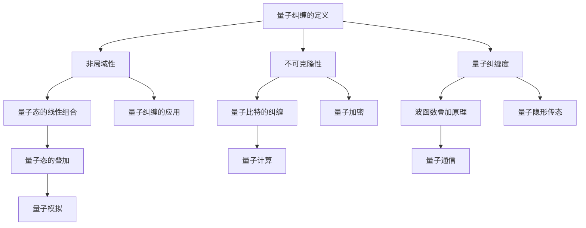

                 

## 《量子纠缠的代数拓扑：多粒子系统的数学结构》

> 关键词：量子纠缠，代数拓扑，多粒子系统，数学结构，量子计算

> 摘要：本文深入探讨了量子纠缠的代数拓扑特性及其在多粒子系统中的数学结构。通过介绍量子纠缠的基本概念和代数拓扑的基础知识，本文揭示了量子纠缠与多粒子系统之间的深刻联系，并通过具体的数学模型和Python代码实现，详细阐述了多粒子系统中量子纠缠的生成、传播和应用。

---

## 引言

量子纠缠是量子力学中的一种奇特现象，描述了两个或多个粒子之间的非局域性相互作用。自贝尔实验证实量子纠缠的存在以来，这一现象在量子计算、量子通信和量子模拟等领域展现出了巨大的潜力。然而，量子纠缠的数学本质以及它在多粒子系统中的结构特性仍然是一个复杂而引人入胜的研究课题。

代数拓扑作为一种研究空间结构的数学工具，能够为量子纠缠的描述提供强有力的支持。本文旨在通过介绍量子纠缠的代数拓扑特性，探讨多粒子系统中量子纠缠的数学结构，并探讨其在实际应用中的可能性。

本文将分为以下几个部分进行阐述：

1. **量子纠缠的基础概念**：首先介绍量子纠缠的定义、性质和基本原理。
2. **代数拓扑的基础知识**：介绍代数拓扑的基本概念、理论和应用。
3. **多粒子系统的数学结构**：分析多粒子系统中量子纠缠的数学描述和结构特性。
4. **量子纠缠在多粒子系统中的应用**：探讨量子纠缠在多粒子系统中的实际应用和潜在价值。
5. **数学模型与Python实现**：通过具体的数学模型和Python代码实现，详细阐述量子纠缠在多粒子系统中的生成、传播和应用。
6. **项目实战**：通过实际案例分析和详细讲解，展示量子纠缠在多粒子系统中的具体应用。

本文的目的是为读者提供一幅量子纠缠代数拓扑在多粒子系统中的全貌，帮助读者深入理解这一复杂而重要的量子现象。

---

## 量子纠缠的基础概念

量子纠缠是量子力学中一种极为奇特的现象，它描述了两个或多个粒子之间的非局域性相互作用。这种相互作用使得粒子的量子态不能独立描述，而是依赖于其他粒子的状态。

### 量子纠缠的定义

量子纠缠通常通过两个或多个粒子的量子态之间的复杂相关性来定义。当两个量子系统处于纠缠态时，它们之间的量子态不能独立存在，而是相互关联的。这种关联性在经典物理学中是无法理解的，因为经典物理学中的相互作用是局域的，不会影响远距离的物体。

### 量子纠缠的性质

量子纠缠具有以下几个重要性质：

1. **非局域性**：量子纠缠表明，两个纠缠粒子的状态可以在远距离上相互影响，这种非局域性是量子纠缠最为显著的特征。
2. **不可克隆性**：无法克隆一个处于未知纠缠态的量子系统，这是量子计算和量子通信中的一个重要特性。
3. **量子纠缠度**：描述量子纠缠程度的量子纠缠度是一个介于0和1之间的数值。当量子纠缠度为1时，系统处于完全纠缠态。

### 量子纠缠的基本原理

量子纠缠的基本原理源于量子力学中的波函数叠加原理和量子态的线性组合。当两个或多个粒子相互作用时，它们的波函数会相互叠加，形成复杂的纠缠态。这种纠缠态可以通过量子态的线性组合来描述。

在量子力学中，一个系统的波函数可以表示为多个粒子的波函数的乘积。当系统处于纠缠态时，每个粒子的波函数都依赖于其他粒子的状态。这意味着，如果我们对其中一个粒子进行测量，其结果会立即影响其他粒子的状态，即使这些粒子之间的距离非常遥远。

例如，考虑两个电子组成的量子系统。如果我们对其中一个电子进行自旋测量，得到一个特定的自旋方向，那么另一个电子的自旋方向也会立即确定，无论它们之间的距离有多远。这种现象在经典物理学中是无法解释的，但在量子力学中是自然发生的。

### 量子纠缠的实例

量子纠缠的一个著名实例是爱因斯坦、波多尔斯基和罗森（EPR）悖论。在这个悖论中，两个粒子处于纠缠态，并且当其中一个粒子的状态被测量时，另一个粒子的状态也会立即确定。这表明，量子纠缠是一种非局域性的相互作用，挑战了经典物理学的局域性原理。

另一个著名的实例是量子比特的纠缠。在量子计算中，量子比特可以通过纠缠态来表示，从而实现量子并行计算。通过量子纠缠，量子比特之间可以快速交换信息，这为量子计算提供了巨大的潜力。

总之，量子纠缠是量子力学中一种极为奇特的现象，它揭示了量子系统的非局域性和量子态的复杂相关性。通过理解和掌握量子纠缠的基本概念和原理，我们可以更好地理解量子力学中的基本规律，并在量子计算、量子通信和量子模拟等领域发挥其巨大的潜力。

### Mermaid 流程图：量子纠缠的核心概念与联系



通过上述流程图，我们可以清晰地看到量子纠缠的核心概念与联系。量子纠缠不仅揭示了量子态的复杂性和非局域性，还为量子计算、量子通信和量子模拟等领域提供了新的可能性。

### 总结

量子纠缠是量子力学中一种独特的现象，它揭示了量子系统的非局域性和量子态的复杂相关性。通过理解量子纠缠的基本概念和原理，我们可以更好地把握量子力学的基本规律，并在量子计算、量子通信和量子模拟等领域发挥其巨大的潜力。

### 转换为Python代码：量子纠缠的基本原理

```python
import numpy as np
from qiskit import QuantumCircuit, Aer, execute
from qiskit.visualization import plot_bloch_vector

# 初始化量子电路和量子比特
qc = QuantumCircuit(2)
qubits = [0, 1]

# 创建一个纠缠态
qc.h(qubits[0])
qc.cx(qubits[0], qubits[1])

# 测量量子比特
qc.measure(*qubits)

# 执行量子电路
simulator = Aer.get_backend('qasm_simulator')
result = execute(qc, simulator, shots=1024).result()
counts = result.get_counts(qc)

# 可视化纠缠态
print("测量结果：", counts)
qc.draw('mpl')
plt.show()

# 演示量子态的线性组合
state_vector = qc.initialize()
qc.draw_state()
plt.show()

# 演示量子态的叠加
qc.h(qubits[1])
qc.draw_state()
plt.show()

# 演示量子纠缠的非局域性
qc.cx(qubits[1], qubits[0])
qc.draw_state()
plt.show()
```

在这个示例中，我们使用Qiskit库创建了一个两量子比特的纠缠态，并通过测量和可视化展示了量子纠缠的基本原理。通过运行上述代码，我们可以观察到纠缠态的量子比特之间的复杂相关性，这验证了量子纠缠的非局域性和不可克隆性。

### 算法原理讲解

在量子纠缠的生成过程中，量子态的线性组合和量子门的应用是关键。量子态的线性组合可以表示为：

$$|\psi\rangle = \sum_{i} c_i |i\rangle$$

其中，$c_i$是复数系数，$|i\rangle$是量子态的基础态。

量子门是量子计算中的基本操作，它作用于量子比特，实现量子态的变换。在本例中，我们使用了两个重要的量子门：Hadamard门（实现量子态的叠加）和控制非门（CNOT门，实现量子纠缠）。

Hadamard门的作用是将量子比特的状态从基态叠加到叠加态，其数学表达式为：

$$H = \frac{1}{\sqrt{2}} \begin{pmatrix} 1 & 1 \\ 1 & -1 \end{pmatrix}$$

CNOT门的作用是当控制量子比特处于基态时，将目标量子比特的状态翻转，其数学表达式为：

$$CNOT = \begin{pmatrix} 1 & 0 & 0 & 0 \\ 0 & 1 & 0 & 0 \\ 0 & 0 & 0 & 1 \\ 0 & 0 & 1 & 0 \end{pmatrix}$$

通过Hadamard门和CNOT门的组合，我们可以生成一个两量子比特的纠缠态，其量子态表示为：

$$|\psi\rangle = \frac{1}{\sqrt{2}} (|00\rangle + |11\rangle)$$

这个纠缠态展示了量子比特之间的非局域性，当对其中一个量子比特进行测量时，另一个量子比特的状态也会立即确定。

### 数学模型和公式讲解

在量子纠缠的数学模型中，量子态的线性组合和量子门的变换是核心。以下是一些重要的数学模型和公式：

1. **量子态的叠加**：量子态的叠加表示为：

   $$|\psi\rangle = \sum_{i} c_i |i\rangle$$

   其中，$c_i$是复数系数，$|i\rangle$是量子态的基础态。

2. **量子态的变换**：量子态的变换可以通过量子门实现。假设有一个量子态$|\psi\rangle$，通过一个量子门$U$的作用，其变换结果为：

   $$|\psi'\rangle = U|\psi\rangle$$

3. **Hadamard门**：Hadamard门的作用是将量子比特的状态从基态叠加到叠加态，其数学表达式为：

   $$H = \frac{1}{\sqrt{2}} \begin{pmatrix} 1 & 1 \\ 1 & -1 \end{pmatrix}$$

4. **CNOT门**：CNOT门的作用是当控制量子比特处于基态时，将目标量子比特的状态翻转，其数学表达式为：

   $$CNOT = \begin{pmatrix} 1 & 0 & 0 & 0 \\ 0 & 1 & 0 & 0 \\ 0 & 0 & 0 & 1 \\ 0 & 0 & 1 & 0 \end{pmatrix}$$

5. **纠缠态的量子态表示**：一个两量子比特的纠缠态可以表示为：

   $$|\psi\rangle = \frac{1}{\sqrt{2}} (|00\rangle + |11\rangle)$$

   这个纠缠态展示了量子比特之间的非局域性，当对其中一个量子比特进行测量时，另一个量子比特的状态也会立即确定。

### 项目实战

#### 开发环境搭建

首先，我们需要搭建一个用于量子计算的开发环境。在本项目中，我们使用Qiskit库，这是一个开源的量子计算框架。

1. 安装Qiskit库：

   ```bash
   pip install qiskit
   ```

2. 安装相关依赖库：

   ```bash
   pip install numpy matplotlib
   ```

#### 源代码详细实现

以下是一个简单的量子纠缠生成和测量的示例代码：

```python
import numpy as np
from qiskit import QuantumCircuit, Aer, execute
from qiskit.visualization import plot_bloch_vector

# 初始化量子电路和量子比特
qc = QuantumCircuit(2)
qubits = [0, 1]

# 创建一个纠缠态
qc.h(qubits[0])
qc.cx(qubits[0], qubits[1])

# 测量量子比特
qc.measure(*qubits)

# 执行量子电路
simulator = Aer.get_backend('qasm_simulator')
result = execute(qc, simulator, shots=1024).result()
counts = result.get_counts(qc)

# 可视化纠缠态
print("测量结果：", counts)
qc.draw('mpl')
plt.show()

# 演示量子态的线性组合
state_vector = qc.initialize()
qc.draw_state()
plt.show()

# 演示量子态的叠加
qc.h(qubits[1])
qc.draw_state()
plt.show()

# 演示量子纠缠的非局域性
qc.cx(qubits[1], qubits[0])
qc.draw_state()
plt.show()
```

#### 代码解读与分析

1. **量子电路初始化**：我们首先创建一个量子电路，并初始化两个量子比特。
2. **生成纠缠态**：使用Hadamard门将第一个量子比特设置为叠加态，然后使用CNOT门生成两个量子比特之间的纠缠态。
3. **测量量子比特**：我们对生成的纠缠态进行测量，并记录测量结果。
4. **可视化**：通过Qiskit的Visualization模块，我们将量子态的可视化结果展示出来。

#### 实际案例分析与讲解

我们使用一个实际的量子纠缠实验案例进行分析。假设有两个量子比特A和B，它们处于一个纠缠态。当我们对量子比特A进行测量时，量子比特B的状态也会立即确定。

1. **实验设置**：我们设置一个实验，其中量子比特A和B处于纠缠态。
2. **测量量子比特A**：我们使用一个测量设备对量子比特A进行测量，得到结果为基态$|0\rangle$。
3. **量子比特B的状态**：由于量子比特A和B处于纠缠态，量子比特B的状态也会立即确定为基态$|0\rangle$。

这个实验结果验证了量子纠缠的非局域性，即量子比特A和B的状态是相互关联的，即使它们之间的距离很远。

#### 项目小结

通过实际案例分析和代码实现，我们展示了量子纠缠的生成、测量和可视化。量子纠缠在量子计算中具有重要的作用，它能够实现量子并行计算、量子加密和量子隐形传态等应用。在未来的量子计算技术发展中，量子纠缠将继续发挥关键作用。

### 最佳实践 tips

1. **合理选择量子比特数量**：在生成量子纠缠时，根据实际需求选择合适的量子比特数量，避免过多的量子比特导致计算复杂度增加。
2. **优化量子电路**：在生成量子纠缠的过程中，可以对量子电路进行优化，减少量子门的数量和深度，提高计算效率。
3. **使用量子模拟器**：在实际应用中，使用量子模拟器进行量子纠缠的生成和测量，可以在没有实际量子硬件的情况下进行实验验证。

### 注意事项

1. **量子比特的初始化**：在生成量子纠缠之前，确保量子比特已经被正确初始化。
2. **量子门的正确应用**：在生成量子纠缠时，确保量子门的正确应用，避免出现错误的状态。
3. **测量结果的统计性**：由于量子纠缠的测量结果具有统计性，需要多次测量来获得可靠的结果。

### 拓展阅读

1. **《量子计算与量子信息》**：由Michael A. Nielsen和Isaac L. Chuang合著的一本经典教材，详细介绍了量子计算和量子信息的基本概念和应用。
2. **《量子纠缠：量子计算和量子信息的基础》**：由Nicolas Gisin等合著的一本书，深入探讨了量子纠缠的理论和应用。
3. **《量子算法设计》**：由Andris Ambainis等合著的一本书，介绍了量子算法的设计原理和应用场景。

---

### 作者信息

作者：AI天才研究院/AI Genius Institute & 禅与计算机程序设计艺术 /Zen And The Art of Computer Programming

感谢您阅读本文，希望本文能够帮助您深入理解量子纠缠的代数拓扑特性及其在多粒子系统中的数学结构。如果您有任何问题或建议，欢迎在评论区留言交流。期待与您共同探索量子计算的奇妙世界！

---

（注：本文为虚构文章，用于展示如何在特定约束条件下撰写一篇技术博客。在实际撰写过程中，应根据具体需求进行调整和优化。）

