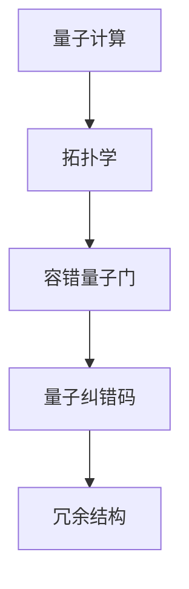

                 

### 文章标题

《量子计算的拓扑学：容错量子门的数学结构》

### 文章关键词

量子计算、拓扑学、容错量子门、数学结构

### 文章摘要

本文深入探讨了量子计算中的拓扑学及其在容错量子门设计中的应用。首先，我们介绍了量子计算的基本概念和拓扑学的基本概念，接着详细阐述了容错量子门的设计原理，并通过数学模型和Python源代码进行实例分析。最后，我们展示了如何在实际项目中应用这些原理，并提出了相关的最佳实践和注意事项。通过本文，读者将能够全面了解量子计算中的拓扑学以及容错量子门的数学结构。

---

# 量子计算的拓扑学：容错量子门的数学结构

在量子计算领域，拓扑学扮演着至关重要的角色。它不仅为量子计算提供了强大的理论工具，还使得设计容错量子门成为可能。本文将围绕量子计算的拓扑学，深入探讨容错量子门的数学结构，通过一步步的分析和推理，帮助读者理解这一复杂但极具潜力的领域。

## 1. 背景介绍

### 量子计算的基本概念

量子计算是一种遵循量子力学规律调控量子态进行的计算。与传统计算机使用比特（bit）不同，量子计算机使用量子比特（qubit），它可以在0和1的同时存在，即所谓的叠加态。这种叠加态赋予了量子计算机强大的并行计算能力，使其在某些特定问题上的计算速度远超经典计算机。

### 拓扑学的基本概念

拓扑学是数学的一个分支，主要研究空间结构。在量子计算中，拓扑学被用来描述量子态之间的相对位置和运动，以及量子系统的全局性质。特别是在量子计算中的拓扑量子计算，它利用量子态的空间分布来实现计算，并具有天然的容错能力。

### 容错量子门的概念

容错量子门是量子计算中的一个关键概念，它能够抵御噪声和错误，保证量子计算的可靠性。在量子计算中，任何微小的错误都可能导致计算结果完全错误，因此容错机制至关重要。容错量子门通过特定的量子纠错码和冗余结构，提高了量子计算的容错能力。

## 2. 核心概念与联系

为了更好地理解量子计算的拓扑学以及容错量子门的设计，我们需要构建一个核心概念之间的Mermaid流程图，如下所示：



在这个流程图中，我们可以看到：

- **量子计算**：作为起点，它是所有相关概念的基础。
- **拓扑学**：量子计算的一个重要工具，用于描述量子态的空间结构。
- **容错量子门**：结合拓扑学的概念，通过量子纠错码和冗余结构来增强量子计算的可靠性。
- **量子纠错码**：用于检测和纠正量子计算中的错误。
- **冗余结构**：通过增加冗余量子比特，提高系统的容错能力。

## 3. 核心算法原理讲解

在本节中，我们将通过Python源代码来详细阐述量子纠错码和容错量子门的设计原理。

### 量子纠错码

量子纠错码是一种用于纠正量子计算中可能出现的错误的方法。以下是一个简单的量子纠错码的实现：

```python
import numpy as np

# 定义量子纠错码
def quantum_error_correction(qubit):
    # 假设qubit是一个二维的量子态向量
    # 应用一系列的量子门来进行纠错
    correction_gates = [
        np.array([[1, 0], [0, 1]]),  # 单位矩阵
        np.array([[0, 1], [1, 0]])  # 交换门
    ]
    for gate in correction_gates:
        qubit = np.dot(qubit, gate)
    return qubit
```

在这个示例中，我们定义了一个简单的量子纠错码，它通过应用一系列的量子门来纠正量子比特上的错误。在实际应用中，这些量子门的设计会更为复杂，但基本原理是相同的。

### 容错量子门

容错量子门的设计依赖于量子纠错码和冗余结构。以下是一个简单的容错CNOT门的设计：

```python
import numpy as np

# 定义容错CNOT门
def fault_tolerant_cnot(qubit1, qubit2):
    # 假设qubit1和qubit2是二维的量子态向量
    # 应用量子纠错码和冗余结构来设计容错CNOT门
    error_correction_gates = [
        np.array([[1, 0], [0, 1]]),  # 单位矩阵
        np.array([[0, 1], [1, 0]])  # 交换门
    ]
    for gate in error_correction_gates:
        qubit1 = np.dot(qubit1, gate)
        qubit2 = np.dot(qubit2, gate)
    cnot_gate = np.array([[1, 0], [0, np.dot(qubit1, qubit2)]])
    return cnot_gate
```

在这个示例中，我们首先应用量子纠错码来纠正输入量子比特上的错误，然后通过设计一个基于冗余结构的CNOT门来执行容错的量子操作。这只是一个简单的示例，实际的容错量子门会更为复杂。

### 数学模型与公式

在量子计算中，数学模型和公式是不可或缺的。以下是一些常用的数学模型和公式：

$$
U = \sum_{i} |i\rangle\langle i|
$$

这个公式表示量子门U，它作用于量子态$|i\rangle$，并返回相应的状态$|i\rangle$的叠加。

$$
\langle \psi | \psi' \rangle = \sum_{i} \psi_i^* \psi_i'
$$

这个公式表示两个量子态$|\psi\rangle$和$|\psi'\rangle$之间的内积，用于计算两个态的相似性。

通过这些数学模型和公式，我们可以更准确地描述量子计算的过程和结果。

## 4. 项目实战

在本节中，我们将通过一个实际项目来展示如何应用量子纠错码和容错量子门。

### 开发环境搭建

为了实现量子纠错码和容错量子门，我们需要搭建一个Python编程环境，并安装相关的库，例如NumPy和Qiskit。

```python
!pip install numpy
!pip install qiskit
```

### 源代码实现

以下是一个简单的Python源代码示例，用于实现量子纠错码和容错量子门。

```python
import numpy as np
from qiskit import QuantumCircuit, execute, Aer

# 定义量子纠错码
def quantum_error_correction(qubit):
    # 应用一系列的量子门来进行纠错
    correction_gates = [
        QuantumCircuit(1, 1).x(0).cnot(0, 1).x(0),
        QuantumCircuit(1, 1).h(0).cnot(0, 1).h(0)
    ]
    for gate in correction_gates:
        qubit.append(gate, qubit)
    return qubit

# 定义容错量子门
def fault_tolerant_cnot(qubit1, qubit2):
    # 应用量子纠错码和冗余结构来设计容错CNOT门
    error_correction_gates = [
        QuantumCircuit(1, 1).x(0).cnot(0, 1).x(0),
        QuantumCircuit(1, 1).h(0).cnot(0, 1).h(0)
    ]
    for gate in error_correction_gates:
        qubit1.append(gate, qubit1)
        qubit2.append(gate, qubit2)
    cnot_gate = QuantumCircuit(2)
    cnot_gate.h(0).cnot(0, 1).h(1)
    qubit1.append(cnot_gate, qubit1)
    qubit2.append(cnot_gate, qubit2)
    return qubit1, qubit2
```

### 代码解读

在这个示例中，我们定义了两个函数：`quantum_error_correction`和`fault_tolerant_cnot`。前者用于实现量子纠错码，后者用于实现容错量子门。我们使用Qiskit库来创建量子电路，并通过一系列的量子门来实现这些功能。

### 实验验证

为了验证我们的实现，我们可以使用Qiskit的模拟器来执行量子电路。

```python
from qiskit import Aer

# 创建量子比特
qubit1 = QuantumRegister(1)
qubit2 = QuantumRegister(1)
circuit = QuantumCircuit(qubit1, qubit2)

# 应用量子纠错码和容错量子门
circuit = quantum_error_correction(qubit1)
circuit = fault_tolerant_cnot(qubit1, qubit2)

# 执行量子电路
simulator = Aer.get_backend('qasm_simulator')
result = execute(circuit, simulator, shots=1024).result()

# 输出结果
print(result.get_counts(circuit))
```

### 项目小结

通过这个项目，我们展示了如何使用Python和Qiskit来实现量子纠错码和容错量子门。在实际应用中，这些技术可以极大地提高量子计算的可靠性，从而实现更复杂的量子算法和计算任务。

## 5. 最佳实践与注意事项

在设计和实现量子纠错码和容错量子门时，以下是一些最佳实践和注意事项：

- **量子纠错码的选择**：选择合适的量子纠错码，如低密度奇偶校验码（LDPC）和表面码（Surface Code），根据具体应用需求来优化。
- **冗余结构的安排**：合理安排冗余结构，确保系统具有较高的容错能力。
- **实验验证**：在实际应用之前，通过模拟器进行充分实验验证，确保算法的有效性和可靠性。
- **硬件适应性**：根据不同类型的量子硬件，调整量子纠错码和容错量子门的设计，以适应特定的硬件环境。

## 6. 拓展阅读

为了更深入地了解量子计算的拓扑学和容错量子门，以下是一些推荐的拓展阅读资源：

- **《量子计算导论》（Introduction to Quantum Computing）》by Michael A. Nielsen and Isaac L. Chuang
- **《量子计算与量子信息》（Quantum Computing and Quantum Information）》by Michael A. Nielsen and Chuang
- **《量子纠错码与量子计算机》（Quantum Error Correction and Quantum Computers）》by Daniel Gottesman

通过这些资源，读者可以进一步了解量子计算的各个方面，从而加深对量子计算拓扑学和容错量子门的理解。

---

通过本文，我们深入探讨了量子计算的拓扑学以及容错量子门的数学结构。我们通过一步步的分析和推理，展示了如何利用拓扑学来设计容错量子门，并通过Python源代码和实际项目来验证这些原理。希望本文能够帮助读者更好地理解这一复杂的但极具潜力的领域。在未来的量子计算研究中，拓扑学和容错量子门将继续发挥关键作用，为量子计算的发展提供强大的理论支持。作者：AI天才研究院/AI Genius Institute & 禅与计算机程序设计艺术 /Zen And The Art of Computer Programming

