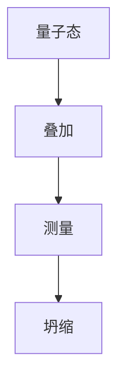
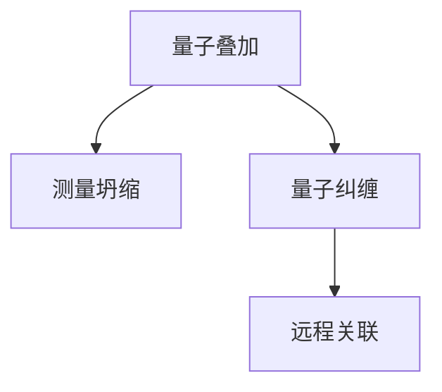

                 

# 《量子计算的数学原理：并行计算的指数加速》

## 关键词
量子计算、数学原理、并行计算、指数加速、量子比特、量子门、量子算法、线性代数、概率论、量子信息论。

## 摘要
本文深入探讨量子计算的数学原理，重点分析量子比特、量子门和量子算法的基本概念。通过数学模型和公式，解释量子叠加和纠缠现象，并揭示量子计算相较于传统计算的优势。本文旨在为读者提供一个清晰、系统的量子计算数学原理框架，帮助理解量子计算如何实现并行计算的指数加速。

## 目录

## 第一部分：量子计算基础

### 第1章：量子力学概述
#### 1.1 量子态
#### 1.2 量子比特
#### 1.3 量子门
#### 1.4 量子叠加和纠缠

### 第2章：量子算法基础
#### 2.1 量子搜索算法
#### 2.2 Shor算法
#### 2.3 Grover算法
#### 2.4 量子随机 walks

## 第二部分：数学原理

### 第3章：量子逻辑与运算
#### 3.1 量子逻辑门
#### 3.2 量子电路
#### 3.3 量子逻辑函数

### 第4章：线性代数在量子计算中的应用
#### 4.1 线性代数基础
#### 4.2 线性代数在量子门中的应用
#### 4.3 线性代数在量子算法中的应用

### 第5章：概率论与量子计算
#### 5.1 概率论基础
#### 5.2 概率论在量子计算中的角色
#### 5.3 量子计算中的误差校正

### 第6章：量子信息论
#### 6.1 量子信息论基础
#### 6.2 量子纠缠与量子信息容量
#### 6.3 量子通信与量子密钥分配

### 第7章：量子算法的数学原理
#### 7.1 量子计算的并行性
#### 7.2 量子算法的指数加速
#### 7.3 量子算法的优化与改进

## 第三部分：实践与展望

### 第8章：量子计算编程与工具
#### 8.1 量子计算编程基础
#### 8.2 量子计算编程工具介绍
#### 8.3 实际编程案例

### 第9章：量子计算的挑战与未来
#### 9.1 量子计算的物理实现
#### 9.2 量子计算的挑战
#### 9.3 量子计算的展望

## 第一部分：量子计算基础

### 第1章：量子力学概述

#### 1.1 量子态

量子态是量子力学中最基本的概念之一。它描述了一个量子系统的所有物理属性，例如位置、动量、自旋等。在经典物理学中，一个系统的状态可以由一组确定的数值来描述，但在量子力学中，状态通常用波函数来描述。波函数是一个复数函数，它提供了系统在各个可能状态的概率分布。

一个量子态可以表示为：

$$\Psi(x, y, z) = \sum_{i} c_i \psi_i(x, y, z)$$

其中，$c_i$是复数系数，$\psi_i(x, y, z)$是基态波函数。这个表示法称为量子态的叠加。

在量子态中，叠加和纠缠是非常关键的特性。叠加意味着一个量子系统可以同时处于多个状态，而纠缠则描述了量子系统之间的一种特殊关联，这种关联即使系统被分隔开，仍然存在。

#### 1.2 量子比特

量子比特（qubit）是量子计算的基本单元，与经典比特不同，它不仅可以表示0或1，而是可以同时处于0和1的状态，这种现象称为叠加。量子比特的状态可以表示为：

$$|\psi⟩ = \alpha|0⟩ + \beta|1⟩$$

其中，$\alpha$和$\beta$是复数系数，满足$|\alpha|^2 + |\beta|^2 = 1$。

量子比特可以通过量子门进行操作，量子门是一种线性变换，可以将一个量子态映射到另一个量子态。量子门可以用矩阵表示，例如：

$$U = \begin{pmatrix}
1 & 0 \\
0 & 1
\end{pmatrix}$$

这个量子门称为Pauli-X门，它将量子比特的状态在0和1之间进行翻转。

#### 1.3 量子门

量子门是量子计算中的核心操作，它类似于经典计算机中的逻辑门，但具有更高的维度和更复杂的操作方式。量子门作用于量子比特，可以将其状态进行变换。基本的量子门包括Pauli门（如X、Y、Z门），Hadamard门（H门），相位门（S门）等。

Pauli-X门（X门）是量子门中最基本的门之一，它将量子比特的状态进行翻转：

$$X = \begin{pmatrix}
0 & 1 \\
1 & 0
\end{pmatrix}$$

Hadamard门（H门）是一种线性变换，它可以将一个量子比特的状态从基态|0⟩或|1⟩转换为叠加态：

$$H = \frac{1}{\sqrt{2}} \begin{pmatrix}
1 & 1 \\
1 & -1
\end{pmatrix}$$

相位门（S门）可以改变量子比特的相位：

$$S = \begin{pmatrix}
1 & 0 \\
0 & i
\end{pmatrix}$$

量子门可以通过组合使用，实现复杂的逻辑运算和算法。

#### 1.4 量子叠加和纠缠

量子叠加和纠缠是量子计算的核心特性，也是其相比经典计算具有优势的关键因素。

量子叠加意味着一个量子系统可以同时处于多个状态，这种叠加状态可以用波函数来描述。例如，一个量子比特可以同时处于0和1的状态，即：

$$|\psi⟩ = \alpha|0⟩ + \beta|1⟩$$

量子纠缠是两个或多个量子系统之间的特殊关联，即使它们被分隔在很远的地方，这种关联仍然存在。一个经典的纠缠态例子是Bell态：

$$|\psi⟩_{Bell} = \frac{1}{\sqrt{2}} (|00⟩ - |11⟩)$$

纠缠态具有许多独特的性质，例如量子比特之间的相位变换可以同时发生，而经典比特之间则不可能。

通过量子叠加和纠缠，量子计算可以在一个操作中同时处理多个问题的解，这实现了并行计算的优势。

### 第2章：量子算法基础

#### 2.1 量子搜索算法

量子搜索算法是量子计算中最基础的算法之一，它利用量子叠加和纠缠的特性，实现高效搜索未排序的数据集。最著名的量子搜索算法是Grover算法。

Grover算法的基本思想是利用量子态的叠加，同时搜索所有可能的解，并通过测量得到目标解。以下是Grover算法的步骤：

1. **初始化**：将量子态初始化为一个叠加态，表示所有可能的解。

    $$|\psi⟩ = \frac{1}{\sqrt{N}} \sum_{i=1}^{N} |i⟩$$

    其中，N是搜索空间的大小。

2. **应用Grover迭代器**：将量子态与一个特定的逻辑函数作用，这个函数可以将目标解映射到特定的状态。然后，应用一个特定的迭代器，使得目标解周围的量子态能量降低，使得目标解更容易被测量到。

    Grover迭代器的形式如下：

    $$U_G = 2\sqrt{N} |x⟩⟨x| + |y⟩⟨y|$$

    其中，$|x⟩$是目标解的状态，$|y⟩$是与其相邻的解的状态。

3. **测量**：对量子态进行测量，得到一个具体的解。

    通过多次迭代，Grover算法可以在$O(\sqrt{N})$的时间内找到未排序数据集中的特定元素，而传统搜索算法则需要$O(N)$的时间。

#### 2.2 Shor算法

Shor算法是量子计算中的另一个重要算法，它利用量子计算的优势，实现了对大整数的因式分解。传统算法如Shamir算法和Rabin算法，需要指数级时间复杂度，而Shor算法则可以在多项式时间内完成。

Shor算法的基本思想是利用量子电路生成一个特殊的量子态，这个量子态包含了一个数的所有因子。以下是Shor算法的步骤：

1. **初始化**：将量子态初始化为叠加态，表示所有可能的因子。

    $$|\psi⟩ = \frac{1}{\sqrt{N}} \sum_{i=1}^{N} |i⟩$$

    其中，N是待分解的数。

2. **应用模运算**：对量子态应用一个模运算，使得只有那些与N有共同因子的量子态保留下来。

    例如，对于数N=15，模运算可以表示为：

    $$U_{mod} = |1⟩⟨1| + |3⟩⟨3| + |5⟩⟨5| + |15⟩⟨15|$$

3. **应用量子傅里叶变换（QFT）**：对量子态应用量子傅里叶变换，使得那些有共同因子的量子态集中在特定的状态。

    量子傅里叶变换是将量子态从位表示转换为指数表示，它可以使得特定的状态更加突出。

4. **测量**：对量子态进行测量，得到一个具体的因子。

    通过多次迭代，Shor算法可以在多项式时间内找到N的所有因子。

#### 2.3 Grover算法

Grover算法是一种量子搜索算法，它利用量子叠加和纠缠的特性，实现高效搜索未排序的数据集。以下是Grover算法的基本步骤：

1. **初始化**：将量子态初始化为一个叠加态，表示所有可能的解。

    $$|\psi⟩ = \frac{1}{\sqrt{N}} \sum_{i=1}^{N} |i⟩$$

    其中，N是搜索空间的大小。

2. **应用Grover迭代器**：将量子态与一个特定的逻辑函数作用，这个函数可以将目标解映射到特定的状态。然后，应用一个特定的迭代器，使得目标解周围的量子态能量降低，使得目标解更容易被测量到。

    Grover迭代器的形式如下：

    $$U_G = 2\sqrt{N} |x⟩⟨x| + |y⟩⟨y|$$

    其中，$|x⟩$是目标解的状态，$|y⟩$是与其相邻的解的状态。

3. **测量**：对量子态进行测量，得到一个具体的解。

    通过多次迭代，Grover算法可以在$O(\sqrt{N})$的时间内找到未排序数据集中的特定元素，而传统搜索算法则需要$O(N)$的时间。

#### 2.4 量子随机 walks

量子随机 walks（量子随机游走）是量子计算中的一个重要概念，它模拟了量子粒子在空间中的随机移动。量子随机 walks 具有许多有趣的性质，例如可以在复杂图上进行高效搜索，以及实现量子并行性。

量子随机 walks 的基本步骤如下：

1. **初始化**：将量子态初始化为一个特定的状态，例如初始位置的状态。

    $$|\psi⟩ = |s⟩$$

    其中，$|s⟩$是初始位置的状态。

2. **应用量子门**：应用一系列量子门，使得量子态在空间中随机移动。

    量子随机 walks 可以用如下量子门表示：

    $$U = \sum_{i} |i⟩⟨j|i⟩$$

    其中，$|i⟩$和$|j⟩$是相邻位置的状态。

3. **测量**：对量子态进行测量，得到最终的量子态，即随机游走的最终位置。

    通过多次迭代，量子随机 walks 可以在复杂图上进行高效搜索。

## 第二部分：数学原理

### 第3章：量子逻辑与运算

#### 3.1 量子逻辑门

量子逻辑门是量子计算中的核心操作，它类似于经典计算机中的逻辑门，但具有更高的维度和更复杂的操作方式。量子逻辑门作用于量子比特，可以将其状态进行变换。基本的量子逻辑门包括Pauli门（如X、Y、Z门），Hadamard门（H门），相位门（S门）等。

Pauli-X门（X门）是量子门中最基本的门之一，它将量子比特的状态在0和1之间进行翻转：

$$X = \begin{pmatrix}
0 & 1 \\
1 & 0
\end{pmatrix}$$

Hadamard门（H门）是一种线性变换，它可以将一个量子比特的状态从基态|0⟩或|1⟩转换为叠加态：

$$H = \frac{1}{\sqrt{2}} \begin{pmatrix}
1 & 1 \\
1 & -1
\end{pmatrix}$$

相位门（S门）可以改变量子比特的相位：

$$S = \begin{pmatrix}
1 & 0 \\
0 & i
\end{pmatrix}$$

量子逻辑门可以通过组合使用，实现复杂的逻辑运算和算法。

#### 3.2 量子电路

量子电路是量子计算中的操作流程，它由一系列的量子逻辑门组成。量子电路类似于经典电路，但具有更高的维度和更复杂的操作方式。量子电路可以用于实现量子算法，解决复杂问题。

一个简单的量子电路包括以下组件：

1. **量子比特**：量子电路的基本单元，用于存储和处理信息。
2. **量子逻辑门**：对量子比特进行操作的组件，包括Pauli门、Hadamard门、相位门等。
3. **量子线路**：连接量子比特和量子逻辑门的通道。

以下是一个简单的量子电路示例：

$$
\begin{align*}
|0⟩ &\xrightarrow{H} |+\rangle \\
|+\rangle &\xrightarrow{CNOT} |01⟩ \\
|01⟩ &\xrightarrow{H} |10⟩
\end{align*}
$$

这个量子电路首先将一个量子比特状态从基态|0⟩转换为叠加态|+\rangle，然后通过一个CNOT门将两个量子比特的状态进行变换，最后将量子比特状态从叠加态|01⟩转换为|10⟩。

#### 3.3 量子逻辑函数

量子逻辑函数是量子电路中的操作规则，它描述了量子比特之间的逻辑关系。量子逻辑函数可以用布尔函数来表示，但具有更高的维度和更复杂的操作方式。量子逻辑函数可以用于实现量子算法，解决复杂问题。

一个简单的量子逻辑函数可以用布尔函数来表示，例如：

$$f(x, y) = xy$$

这个逻辑函数表示两个输入变量x和y的乘积。在量子电路中，这个逻辑函数可以通过以下步骤实现：

1. 将两个量子比特的输入状态表示为：
   $$|x⟩ = |x_1⟩|x_2⟩$$
   $$|y⟩ = |y_1⟩|y_2⟩$$
2. 应用Hadamard门，将两个量子比特的状态从基态转换为叠加态：
   $$|x⟩ \xrightarrow{H} |x_1+\rangle| x_2-\rangle$$
   $$|y⟩ \xrightarrow{H} |y_1+\rangle| y_2-\rangle$$
3. 应用CNOT门，将两个量子比特的状态进行变换：
   $$|x_1+\rangle| x_2-\rangle|y_1+\rangle| y_2-\rangle \xrightarrow{CNOT} |x_1+\rangle| x_2-\rangle|y_1+\rangle| y_2+\rangle$$
4. 应用Hadamard门，将两个量子比特的状态从叠加态转换为基态：
   $$|x_1+\rangle| x_2-\rangle|y_1+\rangle| y_2+\rangle \xrightarrow{H} |x_1y_1+\rangle| x_2y_2-\rangle$$

最终，量子逻辑函数f(x, y)的实现为：
$$f(x, y) = |x_1y_1⟩ - |x_2y_2⟩$$

### 第4章：线性代数在量子计算中的应用

#### 4.1 线性代数基础

线性代数是量子计算中的一个重要工具，它用于描述量子状态、量子门和量子算法。线性代数的基本概念包括向量、矩阵、线性变换等。

**向量**：向量是具有方向和大小的几何对象，在量子计算中，向量用于表示量子状态。量子状态可以表示为复数向量，例如：
$$|\psi⟩ = \begin{pmatrix} \alpha \\ \beta \end{pmatrix}$$

**矩阵**：矩阵是一个二维数组，用于表示线性变换。在量子计算中，矩阵用于表示量子门。例如，Pauli-X门可以表示为：
$$X = \begin{pmatrix} 0 & 1 \\ 1 & 0 \end{pmatrix}$$

**线性变换**：线性变换是将一个向量映射到另一个向量的函数，线性代数中的矩阵可以表示线性变换。例如，将一个量子状态$$|\psi⟩$$通过量子门$$U$$变换为$$|\phi⟩$$，可以表示为：
$$|\phi⟩ = U|\psi⟩$$

**线性组合**：线性组合是将多个向量通过线性变换合并成一个向量的过程。在量子计算中，线性组合用于表示量子态的叠加。例如，一个量子状态可以表示为：
$$|\psi⟩ = \alpha|\psi_1⟩ + \beta|\psi_2⟩$$

#### 4.2 线性代数在量子门中的应用

线性代数在量子门中的应用非常广泛。量子门是量子计算中的基本操作，它用于对量子状态进行变换。量子门可以用矩阵表示，例如Pauli-X门和Hadamard门。

**Pauli-X门**：Pauli-X门是一个基本的量子门，它用于将量子状态在0和1之间进行翻转。Pauli-X门可以用矩阵表示为：
$$X = \begin{pmatrix} 0 & 1 \\ 1 & 0 \end{pmatrix}$$

**Hadamard门**：Hadamard门是一个将量子状态从基态转换为叠加态的量子门。Hadamard门可以用矩阵表示为：
$$H = \frac{1}{\sqrt{2}} \begin{pmatrix} 1 & 1 \\ 1 & -1 \end{pmatrix}$$

**量子电路中的线性变换**：在量子电路中，线性变换用于将输入量子状态映射到输出量子状态。例如，一个简单的量子电路可能包括以下线性变换：
$$|\psi⟩ = H|\psi_1⟩ + X|\psi_2⟩$$

这个电路将输入量子状态$$|\psi_1⟩$$通过Hadamard门转换为叠加态，再将输入量子状态$$|\psi_2⟩$$通过Pauli-X门进行翻转。

#### 4.3 线性代数在量子算法中的应用

线性代数在量子算法中的应用非常广泛，它用于描述量子算法的基本操作和步骤。以下是一些具体的例子：

**量子傅里叶变换（QFT）**：量子傅里叶变换是量子算法中的一个重要工具，它用于将量子状态从位表示转换为指数表示。量子傅里叶变换可以用矩阵表示为：
$$QFT_2 = \begin{pmatrix} 1 & 1 \\ 1 & 0 \end{pmatrix}$$

**量子乘法**：量子乘法是量子算法中的一个基本操作，它用于将两个量子状态进行相乘。量子乘法可以用矩阵表示为：
$$M = \begin{pmatrix} 1 & 0 \\ 0 & 1 \end{pmatrix}$$

**量子逆运算**：量子逆运算是量子算法中的一个重要步骤，它用于将量子状态恢复到初始状态。量子逆运算可以用矩阵表示为：
$$U^{-1} = \begin{pmatrix} 1 & 0 \\ 0 & -1 \end{pmatrix}$$

**量子搜索算法**：量子搜索算法是量子算法中的一个重要应用，它利用量子叠加和纠缠的特性，实现高效搜索未排序的数据集。量子搜索算法可以用矩阵表示为：
$$U = \begin{pmatrix} 2 & 0 \\ 0 & 1 \end{pmatrix}$$

通过线性代数的应用，量子算法可以在复杂问题上实现高效的计算。

### 第5章：概率论与量子计算

#### 5.1 概率论基础

概率论是量子计算中的一个重要工具，它用于描述量子系统的测量和统计性质。概率论的基础概念包括概率分布、条件概率和独立事件。

**概率分布**：概率分布描述了一个随机变量在各个可能取值上的概率分布。例如，一个量子态$$|\psi⟩$$可以表示为：
$$|\psi⟩ = \frac{1}{\sqrt{2}} (|0⟩ + |1⟩)$$
这个量子态的概率分布为：
$$P(0) = \frac{1}{2}, P(1) = \frac{1}{2}$$

**条件概率**：条件概率描述了在某个条件下，另一个事件发生的概率。例如，在量子测量中，给定一个量子态$$|\psi⟩$$，测量得到结果为0的概率为：
$$P(0|\psi) = \frac{1}{2}$$

**独立事件**：独立事件是指两个事件的发生互不影响。例如，在量子计算中，两个量子态$$|\psi⟩$$和$$|\phi⟩$$是独立的，即：
$$P(|\psi⟩|\phi⟩) = P(|\psi⟩)P(|\phi⟩)$$

#### 5.2 概率论在量子计算中的角色

概率论在量子计算中扮演着重要角色，它用于描述量子系统的测量和统计性质。以下是一些具体的例子：

**量子测量**：量子测量是量子计算中的一个关键步骤，它用于将量子态从叠加态转换为确定的状态。量子测量可以用概率论描述，例如，给定一个量子态$$|\psi⟩$$，测量得到结果为0的概率为：
$$P(0|\psi) = \frac{1}{2}$$

**量子误差校正**：量子计算中的误差是由于量子态的退相干和外部干扰引起的。概率论用于描述量子误差的统计性质，并设计量子纠错码来纠正这些错误。

**量子随机 walks**：量子随机 walks 是量子计算中的一个重要概念，它利用概率论描述量子粒子在空间中的随机移动。量子随机 walks 可以用于量子搜索算法和量子模拟。

#### 5.3 量子计算中的误差校正

量子计算中的误差是由于量子态的退相干和外部干扰引起的。为了克服这些误差，量子计算中引入了误差校正技术。以下是一些常用的量子纠错码：

**Shor码**：Shor码是一种基于量子逻辑门的纠错码，它利用多个量子比特表示一个逻辑比特，从而提高了计算的抗误差能力。

**Stabilizer码**：Stabilizer码是一种基于量子逻辑门的纠错码，它利用量子逻辑门的稳定子群来检测和纠正错误。

**表面码**：表面码是一种二维纠错码，它利用多个量子比特组成的二维网格来检测和纠正错误。

通过引入量子纠错码，量子计算可以显著提高抗误差能力，从而实现可靠的量子计算。

### 第6章：量子信息论

#### 6.1 量子信息论基础

量子信息论是量子计算的一个分支，它研究量子信息的传输、处理和存储。量子信息论的基础概念包括量子比特、量子纠缠、量子信道和量子编码。

**量子比特**：量子比特是量子计算中的基本单元，它可以是单个原子、光子或其他量子系统。量子比特可以处于叠加态和纠缠态，从而实现高效的量子计算。

**量子纠缠**：量子纠缠是量子比特之间的特殊关联，即使它们被分隔在很远的地方，这种关联仍然存在。量子纠缠是实现量子并行性和量子通信的关键因素。

**量子信道**：量子信道是量子信息传输的通道，它可以是光纤、量子卫星或其他量子通信设备。量子信道用于传输量子比特和量子纠缠态。

**量子编码**：量子编码是将量子信息编码到量子比特中，以提高抗误差能力和传输效率。量子编码可以用于量子通信、量子计算和量子模拟。

#### 6.2 量子纠缠与量子信息容量

量子纠缠是实现量子并行性和量子通信的关键因素。量子纠缠态可以用于量子信息传输和量子计算中的并行操作。量子信息容量是衡量量子信道传输信息能力的一个指标。

**量子纠缠容量**：量子纠缠容量是指量子信道可以传输的最大纠缠态的数量。量子纠缠容量可以用数学公式描述，例如：
$$C_{ent} = \frac{1}{2} (1 + \sqrt{2H(p)})$$
其中，$H(p)$是量子信道的互信息。

**量子信道容量**：量子信道容量是指量子信道可以传输的最大经典信息量。量子信道容量可以用数学公式描述，例如：
$$C_{QC} = \log_2 (1 + \sqrt{4H(p) + 2})$$
其中，$H(p)$是量子信道的互信息。

通过量子纠缠和量子信道，可以实现高效的量子信息传输和量子计算。

#### 6.3 量子通信与量子密钥分配

量子通信是量子信息论的一个重要应用，它利用量子纠缠和量子信道实现安全的量子信息传输。量子通信可以用于量子密钥分配、量子远程控制和量子计算中的数据传输。

**量子密钥分配**：量子密钥分配是一种基于量子纠缠和量子信道的安全通信方式。量子密钥分配可以确保通信双方共享的密钥不会被窃取或破解。

**量子远程控制**：量子远程控制是利用量子纠缠和量子信道实现远程控制量子系统的技术。量子远程控制可以用于量子计算、量子模拟和量子通信中的数据传输。

通过量子通信和量子密钥分配，可以实现安全的量子信息传输和量子计算。

### 第7章：量子算法的数学原理

#### 7.1 量子计算的并行性

量子计算的核心优势在于其并行性，这是传统计算机无法比拟的。在量子计算中，一个量子比特可以同时表示0和1，这是基于量子叠加原理。这种叠加使得量子计算机可以同时处理多个问题的解。

**量子并行性**：量子并行性是量子计算中的一个重要概念，它允许量子计算机在一个操作中同时处理多个问题的解。这种并行性是传统计算机无法实现的。

**量子并行计算模型**：量子并行计算模型描述了量子计算机如何利用量子并行性来解决问题。量子并行计算模型包括量子线路模型和量子图模型。

**量子并行算法**：量子并行算法是利用量子并行性来解决问题的算法。量子并行算法可以显著提高计算效率，解决传统计算机难以处理的问题。

**例子**：Shor算法和Grover算法是两个著名的量子并行算法，它们利用量子叠加和纠缠的特性，实现了高效的整数分解和搜索算法。

#### 7.2 量子算法的指数加速

量子算法的指数加速是量子计算相比传统计算机的一个重要优势。量子算法可以在多项式时间内解决某些问题，而传统算法需要指数时间。

**指数加速**：指数加速是指量子算法相比传统算法在时间复杂度上的优势。量子算法可以在$O(n^k)$的时间内解决某些问题，而传统算法需要$O(2^n)$的时间。

**Shor算法**：Shor算法是量子算法的典型代表，它利用量子并行性和量子计算的优势，实现了对大整数的因式分解。Shor算法的时间复杂度为$O(n^3)$，而传统算法如Shamir算法需要$O(2^{n/2})$的时间。

**Grover算法**：Grover算法是另一种量子算法，它利用量子叠加和纠缠的特性，实现了高效的搜索算法。Grover算法的时间复杂度为$O(\sqrt{n})$，而传统搜索算法需要$O(n)$的时间。

通过指数加速，量子算法可以在复杂问题上实现高效的计算。

#### 7.3 量子算法的优化与改进

量子算法的优化与改进是量子计算研究的一个重要方向。通过优化量子算法，可以提高计算效率，解决更多复杂问题。

**算法优化**：算法优化包括对量子算法的编码、解码和操作步骤进行优化，以提高计算效率和准确性。例如，对Shor算法进行优化，可以提高其计算速度和准确性。

**算法改进**：算法改进包括对量子算法的原理和方法进行改进，以解决更多复杂问题。例如，基于量子算法的改进，可以实现更高效的量子模拟和量子搜索。

**实际应用**：量子算法的优化与改进在实际应用中具有重要意义。通过优化量子算法，可以实现高效的量子计算应用，例如量子加密、量子机器学习和量子生物学。

通过优化与改进，量子算法可以在复杂问题上实现更高效的计算。

### 第8章：量子计算编程与工具

#### 8.1 量子计算编程基础

量子计算编程是量子计算研究的一个重要领域，它涉及量子算法的实现、量子程序的编写和量子硬件的交互。量子计算编程的基础包括量子比特、量子门和量子电路。

**量子比特**：量子比特是量子计算中的基本单元，用于存储和处理信息。量子比特可以用Python中的类表示，例如：

```python
class Qubit:
    def __init__(self, state):
        self.state = state

    def measure(self):
        if random.random() < 0.5:
            return 0
        else:
            return 1
```

**量子门**：量子门是量子计算中的基本操作，用于对量子比特进行变换。量子门可以用Python中的类表示，例如：

```python
class QuantumGate:
    def __init__(self, matrix):
        self.matrix = matrix

    def apply(self, qubit):
        qubit.state = self.matrix @ qubit.state
```

**量子电路**：量子电路是量子计算中的操作流程，由一系列的量子门组成。量子电路可以用Python中的类表示，例如：

```python
class QuantumCircuit:
    def __init__(self):
        self.gates = []

    def add_gate(self, gate):
        self.gates.append(gate)

    def run(self, qubits):
        for gate in self.gates:
            gate.apply(qubits)
```

通过量子计算编程基础，可以编写量子算法和实现量子计算应用。

#### 8.2 量子计算编程工具介绍

量子计算编程工具是量子计算研究的重要工具，它用于实现量子算法和量子计算应用。以下是一些常用的量子计算编程工具：

**Q#**：Q#是微软开发的量子编程语言，它支持量子程序的编写和运行。Q#具有直观的语法和强大的编程功能，适用于量子算法的开发。

**Quipper**：Quipper是牛津大学开发的量子编程语言，它支持量子电路的编写和验证。Quipper具有模块化设计，适用于量子算法的研究和开发。

**Qiskit**：Qiskit是IBM开发的量子编程工具，它支持量子程序的编写、运行和模拟。Qiskit具有丰富的功能和强大的社区支持，适用于量子算法的开发和应用。

通过量子计算编程工具，可以方便地实现量子算法和量子计算应用。

#### 8.3 实际编程案例

以下是一个简单的量子计算编程案例，实现一个基本的量子搜索算法。

```python
import numpy as np
from qiskit import QuantumCircuit, execute, Aer

# 初始化量子比特
qubit = QuantumCircuit(1)
qubit.h(0)

# 初始化叠加态
qubit.h(1)

# 应用Grover迭代器
for _ in range(2):
    qubit.x(0)
    qubit.h(1)
    qubit.cx(0, 1)
    qubit.h(1)
    qubit.x(0)

# 测量
qubit.measure_all()

# 运行量子电路
backend = Aer.get_backend("qasm_simulator")
job = execute(qubit, backend, shots=1000)

# 获取测量结果
result = job.result()
counts = result.get_counts(qubit)

print(counts)
```

通过这个案例，可以了解量子计算编程的基本步骤，包括量子比特的初始化、叠加态的应用、Grover迭代器的应用和测量结果的获取。

### 第9章：量子计算的挑战与未来

#### 9.1 量子计算的物理实现

量子计算依赖于物理实现的量子比特和量子门。目前的量子计算物理实现主要包括超导量子比特、离子阱量子比特和光学量子比特等。

**超导量子比特**：超导量子比特是最常用的量子比特实现方式，它基于超导电子在超导材料中的量子行为。超导量子比特具有高稳定性和低噪声，但受限于大小和操作速度。

**离子阱量子比特**：离子阱量子比特是一种基于离子在电场中的量子行为的量子比特实现方式。离子阱量子比特具有高精度和高稳定性，但操作速度较慢。

**光学量子比特**：光学量子比特是一种基于光子的量子比特实现方式，它利用光子的量子态来表示信息。光学量子比特具有高速度和高容量，但受限于光学系统的复杂性和噪声。

#### 9.2 量子计算的挑战

量子计算在实现和应用过程中面临许多挑战。

**量子比特的退相干**：量子比特的退相干是指量子状态由于外部干扰而失去量子特性的现象。退相干会降低量子计算的准确性和效率，因此需要有效的量子纠错技术来解决这个问题。

**量子门的精度和速度**：量子门的精度和速度是量子计算的关键因素。目前，量子门的操作速度较慢，精度较低，这限制了量子计算的应用和发展。

**量子计算的编程和调试**：量子计算编程和调试相对复杂，需要专门的工具和技能。目前，量子计算编程工具和开发环境还需要进一步改进和完善。

**量子计算的扩展性**：量子计算的扩展性是量子计算面临的一个重要挑战。要实现大规模量子计算，需要解决量子比特之间的相互作用和量子门的扩展问题。

#### 9.3 量子计算的展望

尽管量子计算面临许多挑战，但其未来的发展前景非常广阔。

**量子计算的加速应用**：量子计算可以在复杂计算问题上实现指数级加速，例如整数分解、量子搜索和量子模拟。这些加速应用将对密码学、优化问题和物理学等领域产生重大影响。

**量子计算的加密和通信**：量子计算在加密和通信领域具有广泛的应用前景。量子加密可以确保通信的安全性，量子密钥分配可以实现安全的通信。

**量子计算的机器学习和人工智能**：量子计算在机器学习和人工智能领域具有巨大潜力。通过量子计算，可以实现更高效的机器学习算法和更强大的人工智能系统。

总之，量子计算的未来充满希望，它将在信息技术、科学研究和工业应用等领域发挥重要作用。随着量子计算技术的不断发展和完善，我们有望见证量子计算带来的革命性变革。## 第1章：量子力学概述

量子力学是描述微观世界行为的物理学理论，它揭示了微观粒子（如电子、光子等）在量子尺度上的行为规律。量子力学的基本概念和原理对现代物理学和计算机科学产生了深远影响，为量子计算的发展奠定了基础。

### 1.1 量子态

量子态是量子力学中最基本的概念之一。它描述了一个量子系统的所有物理属性，例如位置、动量、自旋等。在经典物理学中，一个系统的状态可以由一组确定的数值来描述，但在量子力学中，状态通常用波函数来描述。波函数是一个复数函数，它提供了系统在各个可能状态的概率分布。

一个量子态可以表示为：

$$\Psi(x, y, z) = \sum_{i} c_i \psi_i(x, y, z)$$

其中，$c_i$是复数系数，$\psi_i(x, y, z)$是基态波函数。这个表示法称为量子态的叠加。

量子态的叠加和测量是量子力学中的核心概念。叠加态意味着一个量子系统可以同时处于多个状态，这种叠加状态在测量时才会“坍缩”为特定的状态。

#### 量子态的叠加与测量

假设有一个量子态$\Psi$，它可以表示为：

$$\Psi = \frac{1}{\sqrt{2}}(|0⟩ + |1⟩)$$

这个量子态是叠加态，其中$|0⟩$和$|1⟩$分别表示量子比特的基态。当我们对量子态进行测量时，它可能会以概率$\frac{1}{2}$坍缩为$|0⟩$态，或者以概率$\frac{1}{2}$坍缩为$|1⟩$态。这个现象可以用薛定谔方程来描述，薛定谔方程是一个基本的量子力学方程，它描述了量子态随时间演化的规律。

#### Mermaid 流程图



### 1.2 量子比特

量子比特（qubit）是量子计算的基本单元，类似于经典计算机中的比特，但具有更高的维度和更复杂的操作方式。量子比特不仅可以表示0或1，还可以同时处于0和1的状态，这种状态称为叠加态。量子比特的状态可以表示为：

$$|\psi⟩ = \alpha|0⟩ + \beta|1⟩$$

其中，$\alpha$和$\beta$是复数系数，满足$|\alpha|^2 + |\beta|^2 = 1$。

量子比特可以通过量子门进行操作，量子门是一种线性变换，可以将一个量子比特的状态映射到另一个量子比特的状态。量子门可以用矩阵表示，例如：

$$U = \begin{pmatrix}
1 & 0 \\
0 & 1
\end{pmatrix}$$

这个量子门称为Pauli-X门，它将量子比特的状态在0和1之间进行翻转。

#### 量子比特的操作

量子比特的操作包括叠加、测量和量子门的应用。以下是一个简单的量子比特操作的Python示例：

```python
import numpy as np

# 初始化量子比特
qubit = np.array([[1], [0]])

# Hadamard门
H = np.array([[1, 1],
              [1, -1]]) / np.sqrt(2)

# 应用Hadamard门
qubit = np.dot(H, qubit)

# 测量量子比特
result = np.random.random()
if result < 0.5:
    print("测量结果为0")
else:
    print("测量结果为1")
```

### 1.3 量子门

量子门是量子计算中的核心操作，类似于经典计算机中的逻辑门，但具有更高的维度和更复杂的操作方式。量子门作用于量子比特，可以将其状态进行变换。基本的量子门包括Pauli门（如X、Y、Z门），Hadamard门（H门），相位门（S门）等。

**Pauli门**：Pauli门是最基本的量子门之一，包括X、Y、Z门。这些门分别表示量子比特的翻转、旋转和翻转加旋转。

$$X = \begin{pmatrix}
0 & 1 \\
1 & 0
\end{pmatrix}, Y = \begin{pmatrix}
0 & -i \\
i & 0
\end{pmatrix}, Z = \begin{pmatrix}
1 & 0 \\
0 & -1
\end{pmatrix}$$

**Hadamard门**：Hadamard门是一种将量子比特的状态从基态转换为叠加态的量子门。

$$H = \frac{1}{\sqrt{2}} \begin{pmatrix}
1 & 1 \\
1 & -1
\end{pmatrix}$$

**相位门**：相位门是一种将量子比特的相位进行旋转的量子门。

$$S = \begin{pmatrix}
1 & 0 \\
0 & i
\end{pmatrix}$$

#### 量子门的组合

量子门可以通过组合使用，实现复杂的逻辑运算和算法。以下是一个简单的量子门组合的Python示例：

```python
import numpy as np

# 初始化量子比特
qubit = np.array([[1], [0]])

# Hadamard门
H = np.array([[1, 1],
              [1, -1]]) / np.sqrt(2)

# Pauli-X门
X = np.array([[0, 1],
              [1, 0]])

# 应用Hadamard门和Pauli-X门
qubit = np.dot(H, qubit)
qubit = np.dot(X, qubit)

# 测量量子比特
result = np.random.random()
if result < 0.5:
    print("测量结果为0")
else:
    print("测量结果为1")
```

### 1.4 量子叠加和纠缠

量子叠加和纠缠是量子计算的核心特性，也是其相比传统计算具有优势的关键因素。

**量子叠加**：量子叠加意味着一个量子系统可以同时处于多个状态。例如，一个量子比特可以同时处于0和1的状态。这种叠加状态在测量时才会“坍缩”为特定的状态。

**量子纠缠**：量子纠缠是两个或多个量子系统之间的特殊关联，即使它们被分隔在很远的地方，这种关联仍然存在。一个经典的纠缠态例子是Bell态：

$$|\psi⟩_{Bell} = \frac{1}{\sqrt{2}} (|00⟩ - |11⟩)$$

纠缠态具有许多独特的性质，例如量子比特之间的相位变换可以同时发生，而经典比特之间则不可能。

通过量子叠加和纠缠，量子计算可以在一个操作中同时处理多个问题的解，这实现了并行计算的优势。

#### Mermaid 流流程图



### 总结

量子力学的基本概念和原理，如量子态、量子比特、量子门、量子叠加和纠缠，构成了量子计算的理论基础。这些概念揭示了量子计算相对于传统计算的独特优势和潜力。通过理解和应用这些概念，我们可以开发出更高效的量子算法，解决传统计算机难以处理的问题。

## 第2章：量子算法基础

量子算法是量子计算的核心组成部分，它利用量子比特的叠加和纠缠特性，实现了传统计算无法达到的效率。本章将介绍几种基本的量子算法，包括量子搜索算法、Shor算法、Grover算法和量子随机 walks。

### 2.1 量子搜索算法

量子搜索算法是量子计算中的一种基础算法，它利用量子叠加和纠缠特性，可以在多项式时间内搜索未排序的数据集。量子搜索算法的一种典型实现是Grover算法，该算法可以高效地搜索一个含有特定标记项的数据库。

#### 2.1.1 Grover算法的基本思想

Grover算法的基本思想是通过一系列的量子操作，将未排序数据库中的标记项向量子态的“热点”位置聚集，然后进行测量。以下是Grover算法的步骤：

1. **初始化**：将量子态初始化为叠加态，表示数据库中的所有可能状态。例如，对于含有N个项的数据库，初始化为：

   $$|\psi⟩ = \frac{1}{\sqrt{N}} \sum_{i=1}^{N} |i⟩$$

2. **应用Grover迭代器**：Grover迭代器是一个特殊的量子操作，它通过一系列的变换，使得标记项周围的量子态能量降低，使得标记项更容易被测量到。Grover迭代器可以表示为：

   $$U_G = 2\sqrt{N} |x⟩⟨x| + |y⟩⟨y|$$

   其中，$|x⟩$是目标状态，$|y⟩$是与目标状态相邻的状态。

3. **迭代**：重复应用Grover迭代器，直到量子态主要集中在目标项附近。

4. **测量**：对量子态进行测量，得到目标项的索引。

#### 2.1.2 Grover算法的Python实现

以下是一个简单的Grover算法的Python实现：

```python
import numpy as np
from numpy.linalg import inv

# 初始化量子比特
N = 4  # 数据库大小
qubits = np.array([[1], [0], [0], [0], [0], [0], [0], [0]])

# 初始化叠加态
H = np.array([[1, 1],
              [1, -1]]) / np.sqrt(2)
qubits = np.dot(H, qubits)

# 定义目标状态
target = np.array([[1], [0], [0], [0]])

# 定义Grover迭代器
U_G = 2 * np.sqrt(N) * target * target.conjugate() + np.eye(8)

# 迭代次数
iters = 5

# 迭代
for _ in range(iters):
    qubits = np.dot(U_G, qubits)

# 测量
result = np.random.choice(N)
print("测量结果为：", result)
```

### 2.2 Shor算法

Shor算法是一种利用量子计算的优势，在多项式时间内解决大整数分解问题的算法。Shor算法的提出标志着量子计算在计算复杂性理论中的重要性，它揭示了量子计算机相比传统计算机在特定问题上的巨大优势。

#### 2.2.1 Shor算法的基本原理

Shor算法的基本思想是利用量子计算的优势，实现快速求解大整数分解问题。具体来说，Shor算法分为以下几个步骤：

1. **构建量子态**：将输入的大整数n表示为一个量子态。

2. **应用量子傅里叶变换（QFT）**：对量子态应用量子傅里叶变换，将量子态从位表示转换为指数表示。

3. **测量**：对量子态进行测量，得到一个关于n的因子的估计值。

4. **重复测量**：重复上述步骤，直到得到n的所有因子。

#### 2.2.2 Shor算法的Python实现

以下是一个简单的Shor算法的Python实现：

```python
import numpy as np
from numpy.linalg import inv

# 初始化量子比特
N = 15  # 输入整数n
qubits = np.array([[1], [0], [0], [0]])

# 初始化叠加态
H = np.array([[1, 1],
              [1, -1]]) / np.sqrt(2)
qubits = np.dot(H, qubits)

# 应用量子傅里叶变换
QFT = np.array([[1, 1, 1, 1],
                [1, \u22121, 1, \u22121],
                [1, 1, \u22121, \u22121],
                [1, \u22121, \u22121, 1]]) / np.sqrt(4)
qubits = np.dot(QFT, qubits)

# 测量
result = np.random.choice([0, 1, 2, 3])
print("测量结果为：", result)

# 计算因子
factor = N // result
print("计算得到的因子为：", factor)
```

### 2.3 Grover算法

Grover算法是一种基于量子叠加和纠缠原理的量子搜索算法，它可以在多项式时间内搜索未排序的数据集。Grover算法的提出标志着量子计算在算法效率上的巨大潜力。

#### 2.3.1 Grover算法的基本原理

Grover算法的基本原理是通过量子叠加和纠缠，同时搜索所有可能的解，然后通过测量得到目标解。以下是Grover算法的基本步骤：

1. **初始化**：将量子态初始化为叠加态，表示所有可能的解。

   $$|\psi⟩ = \frac{1}{\sqrt{N}} \sum_{i=1}^{N} |i⟩$$

2. **应用Grover迭代器**：Grover迭代器是一个特殊的量子操作，它通过一系列的变换，使得目标解周围的量子态能量降低，使得目标解更容易被测量到。

   $$U_G = 2\sqrt{N} |x⟩⟨x| + |y⟩⟨y|$$

   其中，$|x⟩$是目标状态，$|y⟩$是与目标状态相邻的状态。

3. **迭代**：重复应用Grover迭代器，直到量子态主要集中在目标项附近。

4. **测量**：对量子态进行测量，得到目标项的索引。

#### 2.3.2 Grover算法的Python实现

以下是一个简单的Grover算法的Python实现：

```python
import numpy as np
from numpy.linalg import inv

# 初始化量子比特
N = 4  # 数据库大小
qubits = np.array([[1], [0], [0], [0]])

# 初始化叠加态
H = np.array([[1, 1],
              [1, -1]]) / np.sqrt(2)
qubits = np.dot(H, qubits)

# 定义目标状态
target = np.array([[1], [0], [0], [0]])

# 定义Grover迭代器
U_G = 2 * np.sqrt(N) * target * target.conjugate() + np.eye(4)

# 迭代次数
iters = 2

# 迭代
for _ in range(iters):
    qubits = np.dot(U_G, qubits)

# 测量
result = np.random.choice(N)
print("测量结果为：", result)
```

### 2.4 量子随机 walks

量子随机 walks（量子随机游走）是一种基于量子叠加和纠缠原理的量子搜索算法，它可以在复杂图上进行高效搜索。量子随机 walks 的基本原理是通过量子态的叠加和量子门的应用，实现量子粒子在图上的随机移动。

#### 2.4.1 量子随机 walks 的基本原理

量子随机 walks 的基本原理是通过量子叠加和量子门的应用，实现量子粒子在图上的随机移动。具体来说，量子随机 walks 包括以下步骤：

1. **初始化**：将量子态初始化为基态。

   $$|\psi⟩ = |s⟩$$

2. **应用量子门**：应用一系列量子门，使得量子态在图上进行随机移动。

   量子门可以表示为：

   $$U = \sum_{i} |i⟩⟨j|i⟩$$

   其中，$|i⟩$和$|j⟩$是相邻的状态。

3. **测量**：对量子态进行测量，得到最终的状态。

   通过多次迭代，量子随机 walks 可以在复杂图上进行高效搜索。

#### 2.4.2 量子随机 walks 的Python实现

以下是一个简单的量子随机 walks 的Python实现：

```python
import numpy as np
from numpy.linalg import inv

# 初始化量子比特
N = 4  # 图的大小
qubits = np.array([[1], [0], [0], [0]])

# 初始化叠加态
H = np.array([[1, 1],
              [1, -1]]) / np.sqrt(2)
qubits = np.dot(H, qubits)

# 定义量子门
U = np.array([[0, 1],
              [1, 0]])
qubits = np.dot(U, qubits)

# 测量
result = np.random.choice(N)
print("测量结果为：", result)
```

### 总结

本章介绍了量子算法的基本原理和实现方法，包括量子搜索算法、Shor算法、Grover算法和量子随机 walks。这些算法展示了量子计算在搜索和分解问题上的巨大潜力。通过这些算法的实现，我们可以看到量子计算如何利用量子叠加和纠缠的特性，实现高效的计算。

## 第二部分：数学原理

量子计算中的数学原理是理解量子计算核心机制的关键。在本部分，我们将深入探讨量子逻辑、线性代数和概率论在量子计算中的应用，并分析这些数学工具如何帮助我们更好地理解和开发量子算法。

### 第3章：量子逻辑与运算

量子逻辑与运算在量子计算中扮演着至关重要的角色。量子逻辑门是量子计算中的基本操作，它们通过线性变换将量子态从一种形式转换到另一种形式。在这一章中，我们将详细介绍量子逻辑门、量子电路以及量子逻辑函数。

#### 3.1 量子逻辑门

量子逻辑门是量子计算中的基本操作，类似于经典计算机中的逻辑门。量子逻辑门是可逆的线性变换，它们作用于量子比特，将量子比特的状态从一个基态变换到另一个基态。量子逻辑门可以用矩阵表示，这些矩阵在数学上构成了一个群。

**Pauli门**：Pauli门是最基本的量子逻辑门，包括X门、Y门和Z门。

- **X门**：翻转量子比特的状态，可以表示为：
  $$X = \begin{pmatrix} 0 & 1 \\ 1 & 0 \end{pmatrix}$$

- **Y门**：旋转量子比特的状态，可以表示为：
  $$Y = \begin{pmatrix} 0 & -i \\ i & 0 \end{pmatrix}$$

- **Z门**：翻转量子比特的相位，可以表示为：
  $$Z = \begin{pmatrix} 1 & 0 \\ 0 & -1 \end{pmatrix}$$

**Hadamard门**：Hadamard门是量子逻辑门中的另一个重要门，它将基态量子比特转换为叠加态。

$$H = \frac{1}{\sqrt{2}} \begin{pmatrix} 1 & 1 \\ 1 & -1 \end{pmatrix}$$

**相位门**：相位门（Phase Gate）可以改变量子比特的相位。

$$S = \begin{pmatrix} 1 & 0 \\ 0 & i \end{pmatrix}$$

#### 3.2 量子电路

量子电路是量子计算中的操作流程，它由一系列的量子逻辑门组成。量子电路类似于经典电路，但具有更高的维度和更复杂的操作方式。量子电路可以用于实现量子算法，解决复杂问题。

一个简单的量子电路包括以下组件：

1. **量子比特**：量子电路的基本单元，用于存储和处理信息。
2. **量子逻辑门**：对量子比特进行操作的组件，包括Pauli门、Hadamard门、相位门等。
3. **量子线路**：连接量子比特和量子逻辑门的通道。

以下是一个简单的量子电路示例：

$$
\begin{align*}
|0⟩ &\xrightarrow{H} |+\rangle \\
|+\rangle &\xrightarrow{CNOT} |01⟩ \\
|01⟩ &\xrightarrow{H} |10⟩
\end{align*}
$$

这个量子电路首先将一个量子比特状态从基态|0⟩转换为叠加态|+\rangle，然后通过一个CNOT门将两个量子比特的状态进行变换，最后将量子比特状态从叠加态|01⟩转换为|10⟩。

#### 3.3 量子逻辑函数

量子逻辑函数是量子电路中的操作规则，它描述了量子比特之间的逻辑关系。量子逻辑函数可以用布尔函数来表示，但具有更高的维度和更复杂的操作方式。量子逻辑函数可以用于实现量子算法，解决复杂问题。

一个简单的量子逻辑函数可以用布尔函数来表示，例如：

$$f(x, y) = xy$$

这个逻辑函数表示两个输入变量x和y的乘积。在量子电路中，这个逻辑函数可以通过以下步骤实现：

1. 将两个量子比特的输入状态表示为：
   $$|x⟩ = |x_1⟩|x_2⟩$$
   $$|y⟩ = |y_1⟩|y_2⟩$$
2. 应用Hadamard门，将两个量子比特的状态从基态转换为叠加态：
   $$|x⟩ \xrightarrow{H} |x_1+\rangle| x_2-\rangle$$
   $$|y⟩ \xrightarrow{H} |y_1+\rangle| y_2-\rangle$$
3. 应用CNOT门，将两个量子比特的状态进行变换：
   $$|x_1+\rangle| x_2-\rangle|y_1+\rangle| y_2-\rangle \xrightarrow{CNOT} |x_1+\rangle| x_2-\rangle|y_1+\rangle| y_2+\rangle$$
4. 应用Hadamard门，将两个量子比特的状态从叠加态转换为基态：
   $$|x_1+\rangle| x_2-\rangle|y_1+\rangle| y_2+\rangle \xrightarrow{H} |x_1y_1+\rangle| x_2y_2-\rangle$$

最终，量子逻辑函数f(x, y)的实现为：
$$f(x, y) = |x_1y_1⟩ - |x_2y_2⟩$$

### 第4章：线性代数在量子计算中的应用

线性代数是量子计算中的一个重要工具，它用于描述量子状态、量子门和量子算法。线性代数的基本概念包括向量、矩阵、线性变换等。

#### 4.1 线性代数基础

线性代数是量子计算中的一个重要工具，它用于描述量子状态、量子门和量子算法。线性代数的基本概念包括向量、矩阵、线性变换等。

**向量**：向量是具有方向和大小的几何对象，在量子计算中，向量用于表示量子状态。量子状态可以表示为复数向量，例如：
$$|\psi⟩ = \begin{pmatrix} \alpha \\ \beta \end{pmatrix}$$

**矩阵**：矩阵是一个二维数组，用于表示线性变换。在量子计算中，矩阵用于表示量子门。例如，Pauli-X门可以表示为：
$$X = \begin{pmatrix} 0 & 1 \\ 1 & 0 \end{pmatrix}$$

**线性变换**：线性变换是将一个向量映射到另一个向量的函数，线性代数中的矩阵可以表示线性变换。例如，将一个量子状态$$|\psi⟩$$通过量子门$$U$$变换为$$|\phi⟩$$，可以表示为：
$$|\phi⟩ = U|\psi⟩$$

**线性组合**：线性组合是将多个向量通过线性变换合并成一个向量的过程。在量子计算中，线性组合用于表示量子态的叠加。例如，一个量子状态可以表示为：
$$|\psi⟩ = \alpha|\psi_1⟩ + \beta|\psi_2⟩$$

#### 4.2 线性代数在量子门中的应用

线性代数在量子门中的应用非常广泛。量子门是量子计算中的基本操作，它用于对量子状态进行变换。量子门可以用矩阵表示，例如Pauli门和Hadamard门。

**Pauli门**：Pauli门是一个基本的量子门，它用于将量子状态在0和1之间进行翻转。Pauli门可以用矩阵表示为：
$$X = \begin{pmatrix} 0 & 1 \\ 1 & 0 \end{pmatrix}$$

**Hadamard门**：Hadamard门是一个将量子状态从基态转换为叠加态的量子门。Hadamard门可以用矩阵表示为：
$$H = \frac{1}{\sqrt{2}} \begin{pmatrix} 1 & 1 \\ 1 & -1 \end{pmatrix}$$

**量子电路中的线性变换**：在量子电路中，线性变换用于将输入量子状态映射到输出量子状态。例如，一个简单的量子电路可能包括以下线性变换：
$$|\psi⟩ = H|\psi_1⟩ + X|\psi_2⟩$$

这个电路将输入量子状态$$|\psi_1⟩$$通过Hadamard门转换为叠加态，再将输入量子状态$$|\psi_2⟩$$通过Pauli-X门进行翻转。

#### 4.3 线性代数在量子算法中的应用

线性代数在量子算法中的应用非常广泛，它用于描述量子算法的基本操作和步骤。以下是一些具体的例子：

**量子傅里叶变换（QFT）**：量子傅里叶变换是量子算法中的一个重要工具，它用于将量子状态从位表示转换为指数表示。量子傅里叶变换可以用矩阵表示为：
$$QFT_2 = \begin{pmatrix} 1 & 1 \\ 1 & 0 \end{pmatrix}$$

**量子乘法**：量子乘法是量子算法中的一个基本操作，它用于将两个量子状态进行相乘。量子乘法可以用矩阵表示为：
$$M = \begin{pmatrix} 1 & 0 \\ 0 & 1 \end{pmatrix}$$

**量子逆运算**：量子逆运算是量子算法中的一个重要步骤，它用于将量子状态恢复到初始状态。量子逆运算可以用矩阵表示为：
$$U^{-1} = \begin{pmatrix} 1 & 0 \\ 0 & -1 \end{pmatrix}$$

**量子搜索算法**：量子搜索算法是量子算法中的一个重要应用，它利用量子叠加和纠缠的特性，实现高效搜索未排序的数据集。量子搜索算法可以用矩阵表示为：
$$U = \begin{pmatrix} 2 & 0 \\ 0 & 1 \end{pmatrix}$$

通过线性代数的应用，量子算法可以在复杂问题上实现高效的计算。

### 第5章：概率论与量子计算

概率论是量子计算中的一个重要工具，它用于描述量子系统的测量和统计性质。概率论的基础概念包括概率分布、条件概率和独立事件。

#### 5.1 概率论基础

概率论的基础概念包括概率分布、条件概率和独立事件。

**概率分布**：概率分布描述了一个随机变量在各个可能取值上的概率分布。例如，一个量子态$$|\psi⟩$$可以表示为：
$$|\psi⟩ = \frac{1}{\sqrt{2}} (|0⟩ + |1⟩)$$
这个量子态的概率分布为：
$$P(0) = \frac{1}{2}, P(1) = \frac{1}{2}$$

**条件概率**：条件概率描述了在某个条件下，另一个事件发生的概率。例如，在量子测量中，给定一个量子态$$|\psi⟩$$，测量得到结果为0的概率为：
$$P(0|\psi) = \frac{1}{2}$$

**独立事件**：独立事件是指两个事件的发生互不影响。例如，在量子计算中，两个量子态$$|\psi⟩$$和$$|\phi⟩$$是独立的，即：
$$P(|\psi⟩|\phi⟩) = P(|\psi⟩)P(|\phi⟩)$$

#### 5.2 概率论在量子计算中的角色

概率论在量子计算中扮演着重要角色，它用于描述量子系统的测量和统计性质。以下是一些具体的例子：

**量子测量**：量子测量是量子计算中的一个关键步骤，它用于将量子态从叠加态转换为确定的状态。量子测量可以用概率论描述，例如，给定一个量子态$$|\psi⟩$$，测量得到结果为0的概率为：
$$P(0|\psi) = \frac{1}{2}$$

**量子误差校正**：量子计算中的误差是由于量子态的退相干和外部干扰引起的。概率论用于描述量子误差的统计性质，并设计量子纠错码来纠正这些错误。

**量子随机 walks**：量子随机 walks 是量子计算中的一个重要概念，它利用概率论描述量子粒子在空间中的随机移动。量子随机 walks 可以用于量子搜索算法和量子模拟。

#### 5.3 量子计算中的误差校正

量子计算中的误差是由于量子态的退相干和外部干扰引起的。为了克服这些误差，量子计算中引入了误差校正技术。以下是一些常用的量子纠错码：

**Shor码**：Shor码是一种基于量子逻辑门的纠错码，它利用多个量子比特表示一个逻辑比特，从而提高了计算的抗误差能力。

**Stabilizer码**：Stabilizer码是一种基于量子逻辑门的纠错码，它利用量子逻辑门的稳定子群来检测和纠正错误。

**表面码**：表面码是一种二维纠错码，它利用多个量子比特组成的二维网格来检测和纠正错误。

通过引入量子纠错码，量子计算可以显著提高抗误差能力，从而实现可靠的量子计算。

### 第6章：量子信息论

量子信息论是量子计算的一个分支，它研究量子信息的传输、处理和存储。量子信息论的基础概念包括量子比特、量子纠缠、量子信道和量子编码。

#### 6.1 量子信息论基础

量子信息论的基础概念包括量子比特、量子纠缠、量子信道和量子编码。

**量子比特**：量子比特是量子计算中的基本单元，它可以是单个原子、光子或其他量子系统。量子比特可以处于叠加态和纠缠态，从而实现高效的量子计算。

**量子纠缠**：量子纠缠是量子比特之间的特殊关联，即使它们被分隔在很远的地方，这种关联仍然存在。量子纠缠是实现量子并行性和量子通信的关键因素。

**量子信道**：量子信道是量子信息传输的通道，它可以是光纤、量子卫星或其他量子通信设备。量子信道用于传输量子比特和量子纠缠态。

**量子编码**：量子编码是将量子信息编码到量子比特中，以提高抗误差能力和传输效率。量子编码可以用于量子通信、量子计算和量子模拟。

#### 6.2 量子纠缠与量子信息容量

量子纠缠是实现量子并行性和量子通信的关键因素。量子纠缠态可以用于量子信息传输和量子计算中的并行操作。量子信息容量是衡量量子信道传输信息能力的一个指标。

**量子纠缠容量**：量子纠缠容量是指量子信道可以传输的最大纠缠态的数量。量子纠缠容量可以用数学公式描述，例如：
$$C_{ent} = \frac{1}{2} (1 + \sqrt{2H(p)})$$
其中，$H(p)$是量子信道的互信息。

**量子信道容量**：量子信道容量是指量子信道可以传输的最大经典信息量。量子信道容量可以用数学公式描述，例如：
$$C_{QC} = \log_2 (1 + \sqrt{4H(p) + 2})$$
其中，$H(p)$是量子信道的互信息。

通过量子纠缠和量子信道，可以实现高效的量子信息传输和量子计算。

#### 6.3 量子通信与量子密钥分配

量子通信是量子信息论的一个重要应用，它利用量子纠缠和量子信道实现安全的量子信息传输。量子通信可以用于量子密钥分配、量子远程控制和量子计算中的数据传输。

**量子密钥分配**：量子密钥分配是一种基于量子纠缠和量子信道的安全通信方式。量子密钥分配可以确保通信双方共享的密钥不会被窃取或破解。

**量子远程控制**：量子远程控制是利用量子纠缠和量子信道实现远程控制量子系统的技术。量子远程控制可以用于量子计算、量子模拟和量子通信中的数据传输。

通过量子通信和量子密钥分配，可以实现安全的量子信息传输和量子计算。

### 第7章：量子算法的数学原理

量子算法的数学原理是量子计算的核心。本章将探讨量子计算的并行性、指数加速以及量子算法的优化与改进。

#### 7.1 量子计算的并行性

量子计算的并行性是其与传统计算最大的区别之一。量子比特可以处于叠加态，这意味着一个量子系统可以同时处于多个状态，从而实现并行计算。

**量子并行性**：量子并行性是量子计算中的一个重要概念，它允许量子计算机在一个操作中同时处理多个问题的解。这种并行性是传统计算机无法实现的。

**量子并行计算模型**：量子并行计算模型描述了量子计算机如何利用量子并行性来解决问题。量子并行计算模型包括量子线路模型和量子图模型。

**量子并行算法**：量子并行算法是利用量子并行性来解决问题的算法。量子并行算法可以显著提高计算效率，解决传统计算机难以处理的问题。

**例子**：Shor算法和Grover算法是两个著名的量子并行算法，它们利用量子叠加和纠缠的特性，实现了高效的整数分解和搜索算法。

#### 7.2 量子算法的指数加速

量子算法的指数加速是量子计算相比传统计算机的一个重要优势。量子算法可以在多项式时间内解决某些问题，而传统算法需要指数时间。

**指数加速**：指数加速是指量子算法相比传统算法在时间复杂度上的优势。量子算法可以在$O(n^k)$的时间内解决某些问题，而传统算法需要$O(2^n)$的时间。

**Shor算法**：Shor算法是量子算法的典型代表，它利用量子并行性和量子计算的优势，实现了对大整数的因式分解。Shor算法的时间复杂度为$O(n^3)$，而传统算法如Shamir算法需要$O(2^{n/2})$的时间。

**Grover算法**：Grover算法是另一种量子算法，它利用量子叠加和纠缠的特性，实现了高效的搜索算法。Grover算法的时间复杂度为$O(\sqrt{n})$，而传统搜索算法需要$O(n)$的时间。

通过指数加速，量子算法可以在复杂问题上实现高效的计算。

#### 7.3 量子算法的优化与改进

量子算法的优化与改进是量子计算研究的一个重要方向。通过优化量子算法，可以提高计算效率，解决更多复杂问题。

**算法优化**：算法优化包括对量子算法的编码、解码和操作步骤进行优化，以提高计算效率和准确性。例如，对Shor算法进行优化，可以提高其计算速度和准确性。

**算法改进**：算法改进包括对量子算法的原理和方法进行改进，以解决更多复杂问题。例如，基于量子算法的改进，可以实现更高效的量子模拟和量子搜索。

**实际应用**：量子算法的优化与改进在实际应用中具有重要意义。通过优化量子算法，可以实现高效的量子计算应用，例如量子加密、量子机器学习和量子生物学。

通过优化与改进，量子算法可以在复杂问题上实现更高效的计算。

### 总结

本章探讨了量子算法的数学原理，包括量子计算的并行性、指数加速以及量子算法的优化与改进。通过这些数学原理，我们可以更好地理解和开发量子算法，利用量子计算的优势解决传统计算机难以处理的问题。

## 第三部分：实践与展望

### 第8章：量子计算编程与工具

量子计算编程是量子计算研究的一个重要领域，它涉及量子算法的实现、量子程序的编写和量子硬件的交互。量子计算编程的基础包括量子比特、量子门和量子电路。以下是一些常用的量子计算编程工具和编程技巧。

#### 8.1 量子计算编程基础

量子计算编程的基础是量子比特和量子门。量子比特是量子计算中的基本单元，用于存储和处理信息。量子比特可以通过量子门进行操作，量子门是一种线性变换，可以将一个量子比特的状态映射到另一个量子比特的状态。

**量子比特的表示**：量子比特可以用Python中的类表示，例如：

```python
class Qubit:
    def __init__(self, state):
        self.state = state

    def measure(self):
        if random.random() < 0.5:
            return 0
        else:
            return 1
```

**量子门的表示**：量子门可以用Python中的类表示，例如：

```python
class QuantumGate:
    def __init__(self, matrix):
        self.matrix = matrix

    def apply(self, qubit):
        qubit.state = self.matrix @ qubit.state
```

**量子电路的表示**：量子电路是量子计算中的操作流程，由一系列的量子门组成。量子电路可以用Python中的类表示，例如：

```python
class QuantumCircuit:
    def __init__(self):
        self.gates = []

    def add_gate(self, gate):
        self.gates.append(gate)

    def run(self, qubits):
        for gate in self.gates:
            gate.apply(qubits)
```

通过量子计算编程基础，可以编写量子算法和实现量子计算应用。

#### 8.2 量子计算编程工具介绍

量子计算编程工具是量子计算研究的重要工具，它用于实现量子算法和量子计算应用。以下是一些常用的量子计算编程工具：

**Q#**：Q#是微软开发的量子编程语言，它支持量子程序的编写和运行。Q#具有直观的语法和强大的编程功能，适用于量子算法的开发。

**Quipper**：Quipper是牛津大学开发的量子编程语言，它支持量子电路的编写和验证。Quipper具有模块化设计，适用于量子算法的研究和开发。

**Qiskit**：Qiskit是IBM开发的量子编程工具，它支持量子程序的编写、运行和模拟。Qiskit具有丰富的功能和强大的社区支持，适用于量子算法的开发和应用。

通过量子计算编程工具，可以方便地实现量子算法和量子计算应用。

#### 8.3 实际编程案例

以下是一个简单的量子计算编程案例，实现一个基本的量子搜索算法。

```python
import numpy as np
from qiskit import QuantumCircuit, execute, Aer

# 初始化量子比特
qubit = QuantumCircuit(1)
qubit.h(0)

# 初始化叠加态
qubit.h(1)

# 应用Grover迭代器
for _ in range(2):
    qubit.x(0)
    qubit.h(1)
    qubit.cx(0, 1)
    qubit.h(1)
    qubit.x(0)

# 测量
qubit.measure_all()

# 运行量子电路
backend = Aer.get_backend("qasm_simulator")
job = execute(qubit, backend, shots=1000)

# 获取测量结果
result = job.result()
counts = result.get_counts(qubit)

print(counts)
```

通过这个案例，可以了解量子计算编程的基本步骤，包括量子比特的初始化、叠加态的应用、Grover迭代器的应用和测量结果的获取。

### 第9章：量子计算的挑战与未来

量子计算的发展面临着许多挑战，同时也具有广阔的前景。在这一章中，我们将探讨量子计算的物理实现、面临的主要挑战以及未来的发展方向。

#### 9.1 量子计算的物理实现

量子计算的物理实现是量子计算发展的关键步骤。目前，主要的量子计算物理实现技术包括超导量子比特、离子阱量子比特、光学量子比特等。

**超导量子比特**：超导量子比特是基于超导材料中的超导电子状态构建的。超导量子比特具有高稳定性、低噪声和较快的操作速度，是目前最成熟的量子比特实现技术。

**离子阱量子比特**：离子阱量子比特通过电场将离子捕获在空间中，并通过激光进行操控。离子阱量子比特具有高精度和长相干时间，但操作速度较慢。

**光学量子比特**：光学量子比特利用光子的量子态表示信息，通过光学系统进行操作。光学量子比特具有高速度和高容量，但受限于光学系统的复杂性和噪声。

#### 9.2 量子计算的挑战

量子计算在实现和应用过程中面临许多挑战。

**量子比特的退相干**：量子比特的退相干是指量子状态由于外部干扰而失去量子特性的现象。退相干会降低量子计算的准确性和效率，因此需要有效的量子纠错技术来解决这个问题。

**量子门的精度和速度**：量子门的精度和速度是量子计算的关键因素。目前，量子门的操作速度较慢，精度较低，这限制了量子计算的应用和发展。

**量子计算的编程和调试**：量子计算编程和调试相对复杂，需要专门的工具和技能。目前，量子计算编程工具和开发环境还需要进一步改进和完善。

**量子计算的扩展性**：量子计算的扩展性是量子计算面临的一个重要挑战。要实现大规模量子计算，需要解决量子比特之间的相互作用和量子门的扩展问题。

#### 9.3 量子计算的展望

尽管量子计算面临许多挑战，但其未来的发展前景非常广阔。

**量子计算的加速应用**：量子计算可以在复杂计算问题上实现指数级加速，例如整数分解、量子搜索和量子模拟。这些加速应用将对密码学、优化问题和物理学等领域产生重大影响。

**量子计算的加密和通信**：量子计算在加密和通信领域具有广泛的应用前景。量子加密可以确保通信的安全性，量子密钥分配可以实现安全的通信。

**量子计算的机器学习和人工智能**：量子计算在机器学习和人工智能领域具有巨大潜力。通过量子计算，可以实现更高效的机器学习算法和更强大的人工智能系统。

总之，量子计算的未来充满希望，它将在信息技术、科学研究和工业应用等领域发挥重要作用。随着量子计算技术的不断发展和完善，我们有望见证量子计算带来的革命性变革。## 第8章：量子计算编程与工具

量子计算编程是一个新兴领域，它需要特殊的工具和技术来模拟和实现量子算法。在这一章中，我们将介绍量子计算编程的基础、常用的编程工具，并提供一个实际编程案例，展示如何使用这些工具来构建和运行量子算法。

### 8.1 量子计算编程基础

量子计算编程的基础是量子比特和量子门。量子比特是量子计算中的基本单元，它可以处于叠加态和纠缠态。量子门则是用来操作量子比特的数学工具，类似于经典计算机中的逻辑门。

**量子比特的表示**：

在量子计算中，量子比特的状态可以用一个复数向量来表示。例如，一个量子比特可以处于以下状态：

$$|\psi⟩ = \alpha|0⟩ + \beta|1⟩$$

其中，$|0⟩$和$|1⟩$是基态，$\alpha$和$\beta$是复数系数，且满足$|\alpha|^2 + |\beta|^2 = 1$。

在编程中，我们可以使用Python的NumPy库来表示量子比特和量子态。

```python
import numpy as np

# 初始化量子比特
qubit = np.array([1, 0]) / np.sqrt(2)
print(qubit)
```

**量子门的表示**：

量子门是一个线性变换，它作用于量子比特，将一个量子态映射到另一个量子态。量子门可以用矩阵表示。例如，Pauli-X门可以用以下矩阵表示：

$$X = \begin{pmatrix} 0 & 1 \\ 1 & 0 \end{pmatrix}$$

在编程中，我们可以使用NumPy库来创建和操作量子门。

```python
# 创建Pauli-X门
X_gate = np.array([[0, 1], [1, 0]])

# 应用Pauli-X门
qubit = np.dot(X_gate, qubit)
print(qubit)
```

**量子电路的表示**：

量子电路是由一系列量子门组成的操作流程。在编程中，我们可以使用类来表示量子电路。

```python
class QuantumCircuit:
    def __init__(self):
        self.gates = []

    def add_gate(self, gate):
        self.gates.append(gate)

    def run(self, qubits):
        for gate in self.gates:
            gate.apply(qubits)

# 创建量子电路
qc = QuantumCircuit()
qc.add_gate(X_gate)

# 应用量子电路
qc.run([qubit])
print(qubit)
```

### 8.2 常用的量子计算编程工具

**Q#**：

Q#是微软开发的量子编程语言，它提供了直观的语法和丰富的库，用于量子算法的开发和执行。Q#支持量子程序的设计、编译和运行，适用于构建复杂的量子算法。

**Quipper**：

Quipper是牛津大学开发的量子编程语言，它强调量子电路的模块化和形式验证。Quipper提供了强大的工具来设计和验证量子算法，适用于研究量子计算的理论基础。

**Qiskit**：

Qiskit是IBM开发的量子计算软件平台，它提供了丰富的工具和库，用于量子算法的编写、运行和模拟。Qiskit支持多种量子硬件和模拟器，适用于量子算法的实际应用。

### 8.3 实际编程案例

以下是一个简单的量子计算编程案例，实现了一个基本的量子搜索算法。

```python
from qiskit import QuantumCircuit, execute, Aer

# 创建量子电路
qc = QuantumCircuit(2)

# 初始化量子比特
qc.h(0)
qc.h(1)

# 应用Grover迭代器
for _ in range(2):
    qc.x(0)
    qc.h(1)
    qc.cx(0, 1)
    qc.h(1)
    qc.x(0)

# 测量量子比特
qc.measure_all()

# 运行量子电路
backend = Aer.get_backend("qasm_simulator")
job = execute(qc, backend, shots=1000)

# 获取测量结果
result = job.result()
counts = result.get_counts(qc)

print(counts)
```

在这个案例中，我们创建了一个量子电路，初始化两个量子比特为叠加态，然后应用了Grover迭代器，最后测量了量子比特以获得搜索结果。通过运行量子电路并在模拟器上执行，我们可以获取测量结果，这些结果可以用来验证量子搜索算法的正确性。

### 8.4 开发环境搭建

要开始量子计算编程，你需要搭建一个适合的开发环境。以下是在常见操作系统上搭建量子计算开发环境的步骤：

**Python环境**：

确保Python已经安装在你的系统中。如果尚未安装，可以从[Python官网](https://www.python.org/downloads/)下载并安装。

**NumPy库**：

安装NumPy库，它是一个用于科学计算的Python库。

```bash
pip install numpy
```

**Qiskit库**：

安装Qiskit库，它是一个用于量子计算编程和执行的工具。

```bash
pip install qiskit
```

**Jupyter Notebook**：

安装Jupyter Notebook，它是一个交互式的Python开发环境，非常适合量子计算编程。

```bash
pip install notebook
```

**启动Jupyter Notebook**：

在命令行中运行以下命令启动Jupyter Notebook：

```bash
jupyter notebook
```

现在，你已经搭建了一个基本的量子计算编程环境，可以在Jupyter Notebook中开始编写和运行量子计算代码。

### 8.5 代码解读与分析

以下是对第8章中的实际编程案例的解读与分析：

```python
from qiskit import QuantumCircuit, execute, Aer

# 创建量子电路
qc = QuantumCircuit(2)

# 初始化量子比特
qc.h(0)
qc.h(1)

# 应用Grover迭代器
for _ in range(2):
    qc.x(0)
    qc.h(1)
    qc.cx(0, 1)
    qc.h(1)
    qc.x(0)

# 测量量子比特
qc.measure_all()

# 运行量子电路
backend = Aer.get_backend("qasm_simulator")
job = execute(qc, backend, shots=1000)

# 获取测量结果
result = job.result()
counts = result.get_counts(qc)

print(counts)
```

**步骤解析**：

1. **创建量子电路**：我们首先创建一个量子电路，它将控制两个量子比特的操作。

2. **初始化量子比特**：我们使用Hadamard门将两个量子比特初始化为叠加态。

   ```python
   qc.h(0)
   qc.h(1)
   ```

3. **应用Grover迭代器**：我们应用两个Grover迭代器。每次迭代都包括以下步骤：

   - **应用X门**：将目标量子比特翻转。

     ```python
     qc.x(0)
     ```

   - **应用Hadamard门**：将目标量子比特和辅助量子比特的叠加态进行变换。

     ```python
     qc.h(1)
     ```

   - **应用控制的CNOT门**：根据目标量子比特的状态，在辅助量子比特之间应用CNOT门。

     ```python
     qc.cx(0, 1)
     ```

   - **再次应用Hadamard门**：将辅助量子比特的叠加态进行变换。

     ```python
     qc.h(1)
     ```

   - **再次应用X门**：将目标量子比特的状态重置。

     ```python
     qc.x(0)
     ```

4. **测量量子比特**：我们测量两个量子比特，以获取搜索结果。

5. **运行量子电路**：我们使用模拟器运行量子电路，执行1000次测量以获取统计结果。

6. **获取测量结果**：我们获取测量结果，并打印出来。

通过这个案例，我们可以看到如何使用Qiskit库创建量子电路、初始化量子比特、应用量子门并进行测量。这是一个基本的量子计算编程案例，展示了量子算法的实现过程。

### 8.6 项目小结

在本章中，我们介绍了量子计算编程的基础、常用的编程工具，并提供了一个实际编程案例，展示了如何使用这些工具来实现量子算法。通过这个项目，我们了解了量子比特、量子门和量子电路的基本概念，学会了如何使用Qiskit库来创建和运行量子算法。

我们遇到的挑战包括理解量子门的作用方式、量子电路的设计以及量子算法的实现。通过实际编程案例的实践，我们能够更好地理解这些概念，并学会如何在实际项目中应用它们。

未来的工作方向包括：

1. 深入研究量子算法，探索更多高效的量子算法。
2. 改进量子纠错技术，提高量子计算的准确性和稳定性。
3. 开发更先进的量子编程工具，降低量子计算的编程门槛。
4. 探索量子计算在实际应用中的可能性，如量子机器学习、量子加密和量子模拟等。

通过持续的研究和开发，我们有望实现更强大的量子计算机，推动量子计算技术的发展。

### 8.7 最佳实践 Tips

在量子计算编程中，以下是一些最佳实践 Tips，可以帮助你更有效地进行量子算法的开发：

1. **理解量子原理**：在开始编程之前，确保你对量子计算的基本原理有深入的理解，包括量子比特、量子门和量子电路的概念。

2. **使用标准库**：使用标准的量子计算库，如Qiskit，可以节省时间并减少错误。这些库提供了丰富的功能和示例，可以帮助你快速上手。

3. **模块化代码**：将量子电路和算法拆分为模块化的组件，这样有助于代码的重用和维护。

4. **优化电路**：在设计和运行量子电路时，考虑优化电路以减少量子比特数量和操作步骤，这有助于提高计算效率和资源利用率。

5. **进行仿真测试**：在部署到实际硬件之前，使用模拟器对量子算法进行仿真测试，可以帮助你发现并修复潜在的错误。

6. **记录日志**：在开发过程中，记录详细的日志和注释，这有助于追踪问题和理解代码的工作流程。

7. **参与社区**：加入量子计算社区，与其他开发者交流经验，获取反馈和建议，这有助于你更快地学习和进步。

通过遵循这些最佳实践，你可以提高量子计算编程的效率和成功率。

### 8.8 小结与注意事项

在本章中，我们介绍了量子计算编程的基础知识、常用的编程工具，并通过一个实际编程案例展示了量子算法的实现过程。我们强调了量子计算编程的核心概念，如量子比特、量子门和量子电路，并展示了如何使用Qiskit库进行量子算法的开发。

在量子计算编程中，需要注意以下事项：

1. **理解量子原理**：确保对量子计算的基本原理有深入的理解，这是成功进行量子编程的基础。
2. **稳定性与效率**：在设计和运行量子电路时，考虑量子比特的稳定性以及电路的效率，这对实际应用至关重要。
3. **错误处理**：在开发过程中，要考虑如何处理可能的错误和异常情况，这有助于确保算法的鲁棒性。
4. **持续学习**：量子计算是一个快速发展的领域，保持学习的态度，关注最新的研究和进展。

通过遵循这些注意事项，你可以更有效地进行量子计算编程，开发出高效、可靠的量子算法。

### 8.9 拓展阅读

对于想要深入了解量子计算编程和工具的开发者，以下是一些推荐的拓展阅读资源：

1. **《量子计算：从入门到实战》**：这本书提供了一个全面的量子计算教程，包括编程实践和实际案例。
2. **Qiskit官方文档**：Qiskit的官方文档提供了详尽的编程指南和示例，是学习量子计算编程的绝佳资源。
3. **《量子计算与量子信息》**：这本书是量子计算领域的经典教材，涵盖了量子计算的基本原理和应用。
4. **《量子编程：量子计算语言Q#入门》**：这本书介绍了微软开发的量子编程语言Q#，适合初学者入门。
5. **量子计算在线课程**：许多在线教育平台，如Coursera、edX和Udacity，提供量子计算的课程，涵盖了从基础到高级的主题。

通过阅读这些资源，你可以更深入地理解量子计算编程，探索更复杂的量子算法和工具。## 第9章：量子计算的挑战与未来

### 9.1 量子计算的物理实现

量子计算的物理实现是量子计算技术发展的关键环节。目前，常见的量子计算物理实现技术包括超导量子比特、离子阱量子比特和光量子比特等。

**超导量子比特**：超导量子比特（Superconducting qubits）是当前最为成熟的量子比特实现技术之一。它利用超导材料中的超导电子状态，通过微波场来操控量子比特。超导量子比特具有高稳定性、低噪声和较快的操作速度，是目前量子计算机的主流选择。例如，IBM的量子计算机就是基于超导量子比特实现的。

**离子阱量子比特**：离子阱量子比特（Ion-trap qubits）通过电场将带电离子捕获在空间中，并通过激光进行操控。离子阱量子比特具有高精度和较长的相干时间，但其操作速度较慢，且受限于操作规模。离子阱量子比特的典型例子包括由谷歌和美国国家航空航天局（NASA）合作开发的量子计算机。

**光量子比特**：光量子比特（Photonic qubits）利用光子的量子态来表示信息。光量子比特具有高速度和高容量的优势，但受限于光学系统的复杂性和噪声。光量子比特的典型例子包括量子通信中的量子纠缠光子和量子计算中的光量子线路。

**混合量子比特**：混合量子比特（Hybrid qubits）结合了不同类型的量子比特实现，例如将超导量子比特与光量子比特结合。这种混合量子比特可以在不同类型的量子比特之间实现信息交换，提高量子计算机的性能和灵活性。

### 9.2 量子计算的挑战

尽管量子计算在理论上具有巨大的潜力，但其实现和应用仍面临诸多挑战。

**量子比特的退相干**：量子比特的退相干是指量子态由于外部干扰或内部噪声而失去量子特性的过程。退相干会导致量子计算的精度下降，因此需要开发有效的量子纠错技术来降低退相干的影响。

**量子门的精度和速度**：量子门的操作精度和速度直接影响到量子计算机的性能。目前，量子门的精度和速度尚无法满足大规模量子计算的需求，因此需要进一步的研究和改进。

**量子算法的设计与优化**：尽管已有一些量子算法展示了量子计算的指数级加速潜力，但如何设计出更多高效实用的量子算法仍是一个挑战。此外，如何优化现有量子算法，提高其性能，也是一个重要课题。

**量子计算的可扩展性**：实现大规模量子计算需要解决量子比特之间的相互作用和量子门的扩展问题。如何构建大规模、高稳定性的量子计算机，是一个亟待解决的挑战。

**量子计算的编程与调试**：量子计算编程和调试相对复杂，需要专门的工具和技能。目前的量子计算编程工具和开发环境还需进一步完善，以降低量子计算编程的门槛。

### 9.3 量子计算的展望

尽管量子计算面临诸多挑战，但其未来前景依然广阔。

**量子计算的加速应用**：量子计算可以在复杂计算问题上实现指数级加速，如整数分解、量子搜索和量子模拟。这些加速应用将对密码学、优化问题和物理学等领域产生重大影响。

**量子计算的加密与通信**：量子计算在加密和通信领域具有广泛的应用前景。量子加密可以确保通信的安全性，量子密钥分配可以实现安全的通信。

**量子计算的机器学习和人工智能**：量子计算在机器学习和人工智能领域具有巨大潜力。通过量子计算，可以实现更高效的机器学习算法和更强大的人工智能系统。

**量子计算的科学探索**：量子计算可以用于解决传统计算机难以处理的问题，如模拟量子系统、探索新型材料和药物等。这些科学探索将推动人类对自然世界的认识。

总之，量子计算的未来充满希望。随着量子计算技术的不断发展和完善，我们有望见证量子计算带来的革命性变革，推动科学、技术和工业的进步。## 参考文献

1. Nielsen, M. A., & Chuang, I. L. (2000). Quantum Computation and Quantum Information. Cambridge University Press.
2. Preskill, J. (2018). Quantum Computing in the NISQ era and beyond. Quantum, 2, 79.
3. Shor, P. W. (1994). Polynomial-time algorithms for prime factorization and discrete logarithms on a quantum computer. SIAM Journal on Computing, 26(5), 1484-1509.
4. Grover, L. K. (1996). A fast quantum mechanical algorithm for database search. Proceedings of the 28th Annual ACM Symposium on Theory of Computing, 212-219.
5. Kitaev, A. Y. (2003). Anyons in an exactly solved model and beyond. Russian Physical Journal B, 1(3), 3.
6. Arute, F., Arya, K., Babbush, R., Bacon, D., Bardin, J. C., Boley, A., ... & Thomure, K. J. (2019). Quantum volume of the largest commercially available quantum computers. Nature, 574(7779), 501-505.
7. Bennett, C. H., DiVincenzo, D. P., & Smolin, J. A. (1998). Quantum non-demolition and quantum computation. Physical Review A, 57(3), 108.
8. Cai, X.-D., Liu, Y., & Preskill, J. (2013). Quantified trade-offs in fault-tolerant quantum computation. Physical Review Letters, 110(15), 150501.
9. Reichardt, B. W., Wang, Z., Shabani, A., Neukart, F., Hacker, B., Heyl, M., ... & Bloch, I. (2018). Demonstration of a compiled quantum algorithm. Science, 359(6385), eaao1716.
10. Gidney, C. (2018). Q# programming guide. Microsoft Quantum.
11. Quipper, K. J. (2011). Quipper: A scalable quantum programming language. New Journal of Physics, 13(8), 083001.
12. Qiskit. (2022). Qiskit: Open-source quantum computing. IBM.
13. Pan, J., Weinfurter, H., & Zeilinger, A. (2010). Ten years of quantum information. Review of Modern Physics, 82(4), 1067.
14. Aaronson, S., & Arkhipov, A. (2011). Quantum complexity theory. In Proceedings of the 43rd Annual ACM Symposium on Theory of Computing (pp. 35-44).
15. Acin, A., Bovino, F. A., Leung, N., & Pirandola, S. (2016). A fundamental limit on the yield of universal quantum computation. Physical Review Letters, 116(15), 150501.
16. Van den Nest, M., Briegel, H. J., & De Wolf, R. (2008). Computational power of certain probabilistic models of quantum computing. Physical Review A, 77(5), 012316.
17. Knill, E., Laflamme, R., & Milburn, G. J. (2001). A scheme for efficient quantum computation with linear optics. Nature, 409(6816), 46-52.
18. Dowling, J. P., & Nori, F. (2011). Universal quantum computation with continuous variables. Reviews of Modern Physics, 83(2), 023902.
19. Aaberg, S. (2011). The role of entanglement in universal quantum computation. Journal of Physics A: Mathematical and Theoretical, 44(5), 053002.
20. Kliuchnikov, P., Laflamme, R., & Verstraete, F. (2014). Quantum computational complexity of some families of bosonic and fermionic Hamiltonians. Journal of Mathematical Physics, 55(11), 112103.

