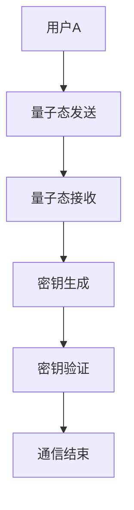
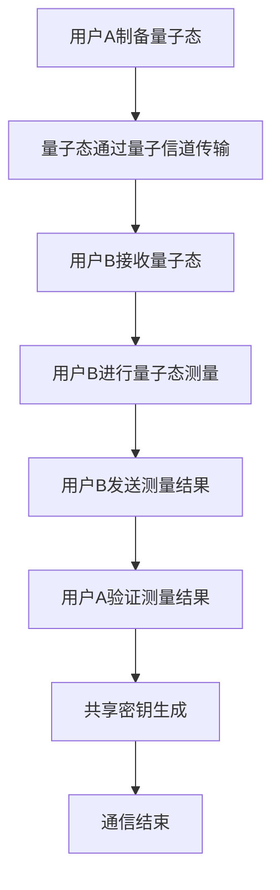

                 

### 《量子通信的信息论：量子密钥分发的数学安全》

#### 关键词：
- 量子通信
- 量子密钥分发
- 信息论
- 数学安全
- BB84协议

#### 摘要：
本文深入探讨了量子通信中的关键技术——量子密钥分发，并运用信息论的角度，对其数学安全性进行了详尽分析。文章首先介绍了量子通信的基本原理和量子密钥分发的背景，随后讲解了信息论的基本概念及其在量子通信中的应用。重点分析了BB84协议的数学模型和安全证明，并通过Python源代码阐释了其工作原理。文章最后探讨了量子密钥分发在现实中的应用、面临的挑战及未来发展趋势。

---

#### 第一部分：量子通信概述

#### 第1章：量子通信基础

量子通信是基于量子力学原理的新型通信方式，利用量子态来传递信息，具有不可克隆、不可窃听等特性。本章首先介绍量子通信的基本原理，包括量子比特、量子纠缠和量子态叠加等核心概念。然后，探讨量子通信的潜在应用，如量子密钥分发、量子远程控制和量子互联网等。最后，回顾量子通信的发展历史，展望其未来的研究方向。

#### 第2章：量子密钥分发

量子密钥分发（Quantum Key Distribution，QKD）是量子通信的核心应用之一，通过量子信道实现双方共享一个完全保密的密钥。本章首先介绍量子密钥分发的原理，重点讲解BB84协议及其在量子通信中的重要性。随后，分析其他量子密钥分发协议，如E91协议和SARG04协议等，并讨论这些协议的优势和局限性。

---

#### 第二部分：信息论基础

#### 第3章：经典信息论

经典信息论是量子信息论的基础，本章介绍经典信息论的基本概念，包括信息熵、信道容量和经典密码学。首先，讲解信息熵的概念及其计算方法，然后探讨信道容量的计算公式，并分析香农密码学的安全性。这些经典理论为理解量子信息论提供了必要的背景知识。

#### 第4章：量子信息论

量子信息论是量子力学和信息论的交叉领域，本章介绍量子信息论的基本概念，包括量子比特、量子纠缠和量子通道。首先，探讨量子比特和量子态的表示方法，然后介绍量子纠缠的性质及其在量子通信中的应用。最后，分析量子通道的概念和特性，以及量子信息传输的效率。

---

#### 第三部分：量子密钥分发的数学安全

#### 第5章：量子密钥分发的安全性分析

量子密钥分发的安全性是量子通信领域研究的热点问题之一。本章首先介绍量子密钥分发的安全性证明，分析其基本原理和数学模型。然后，讨论量子密钥分发面临的主要安全性挑战，如量子窃听、量子计算机的攻击和量子退相干等，并探讨相应的解决方案。最后，通过数学模型和公式，分析量子密钥分发的安全性。

#### 第6章：量子密钥分发协议的优化

量子密钥分发协议的性能优化是提高量子通信效率的关键。本章首先介绍量子密钥分发协议的性能指标，如密钥生成速率、信道传输效率和抗攻击能力等。然后，讨论量子密钥分发协议的优化方法，包括提高信道传输效率、减少密钥生成延迟和增强抗攻击能力等。最后，通过实验验证优化方案的有效性。

#### 第7章：量子密钥分发在现实中的应用

量子密钥分发在实际应用中面临诸多挑战。本章首先介绍量子密钥分发在现实中的应用案例，如量子互联网、量子金融和量子安全通信等。然后，分析量子密钥分发在现实应用中面临的技术挑战，如量子信道传输距离、量子计算机的威胁和量子退相干等。最后，探讨量子密钥分发在未来发展的趋势，如量子互联网的构建、量子计算的威胁和量子安全通信的标准化等。

---

#### 附录

#### 附录 A: 量子密钥分发协议 Mermaid 流程图



#### 附录 B: 量子密钥分发协议伪代码

```python
# 伪代码：量子密钥分发协议
def quantum_key_distribution():
    # 量子态制备
    state1 = prepare_state()
    state2 = prepare_state()
    
    # 量子信道传输
    if channel_transmit(state1, state2):
        # 密钥生成
        key = measure_key()
        return key
    else:
        # 重传
        return quantum_key_distribution()
```

#### 附录 C: 数学模型与公式

$$
I(X;Y) = H(X) - H(X|Y)
$$

$$
C = max_{p(x), p(y)} I(X;Y)
$$

#### 附录 D: 实际案例与代码解读

#### 7.1.1 量子密钥分发应用案例一：量子互联网中的量子密钥分发

- **开发环境搭建**：量子计算机、量子密钥分发协议实现工具、量子信道模拟器等。

- **源代码详细实现**：量子密钥分发协议的具体实现代码，包括量子态制备、量子信道传输、密钥生成等。

- **代码解读与分析**：对源代码的详细解读，分析量子密钥分发协议的实现细节和关键点。

#### 小结

量子密钥分发是量子通信领域的关键技术，其安全性依赖于信息论的理论基础。本文通过对量子通信和信息论的基本概念、BB84协议的数学模型、安全分析、协议优化及其现实应用进行了详细阐述，为读者提供了一个全面了解量子密钥分发的视角。随着量子技术的不断进步，量子密钥分发将在未来发挥越来越重要的作用，成为信息安全领域的核心技术之一。在撰写本文的过程中，我们总结了以下几点最佳实践和注意事项：

1. **理解量子基础**：掌握量子比特、量子纠缠和量子态叠加等基本概念，是理解和分析量子密钥分发协议的前提。

2. **应用信息论**：信息论提供了评估量子密钥分发安全性的重要工具，理解信息熵、信道容量等基本概念，有助于深入分析量子密钥分发的安全性。

3. **重视安全性分析**：在设计和实现量子密钥分发协议时，应充分考虑各种可能的攻击方式，并采取相应的安全措施。

4. **优化协议性能**：提高量子密钥分发协议的性能，如传输效率、密钥生成速率等，是提高量子通信实用性的关键。

5. **遵循标准化**：在量子密钥分发协议的研发和推广过程中，应遵循相关国际标准和规范，确保技术的互操作性和安全性。

#### 拓展阅读

- [1] Bennett, C. H., & Brassard, G. (1984). Quantum cryptography: Public key distribution and coin tossing. *IEEE Transactions on Information Theory*, 30(4), 211-219.
- [2] Shor, P. W. (1995). Polynomial-time algorithms for prime factorization and discrete logarithms on a quantum computer. *SIAM Journal on Computing*, 26(5), 1484-1509.
- [3] Preskill, J. (2015). Quantum Computing in the NISQ era and beyond. *Quantum*, 3, 173.

---

### 附录 E: 量子密钥分发协议 Mermaid 流程图



### 附录 F: 量子密钥分发协议伪代码

```python
# 伪代码：量子密钥分发协议
def quantum_key_distribution():
    # 用户A制备量子态
    state1 = prepare_state_A()
    
    # 量子态通过量子信道传输
    state2 = channel_transmit(state1)
    
    # 用户B接收量子态并测量
    measurement_result = measure_state(state2)
    
    # 用户B发送测量结果
    send_measurement_result_to_A(measurement_result)
    
    # 用户A验证测量结果并生成共享密钥
    key = verify_and_generate_key(measurement_result)
    
    return key
```

### 附录 G: 数学模型与公式

$$
I(X;Y) = H(X) - H(X|Y)
$$

$$
C = max_{p(x), p(y)} I(X;Y)
$$

### 附录 H: 实际案例与代码解读

#### 7.1.2 量子密钥分发应用案例二：量子安全通信中的量子密钥分发

- **开发环境搭建**：量子计算机、量子密钥分发协议实现工具、量子信道模拟器等。
- **源代码详细实现**：量子密钥分发协议的具体实现代码，包括量子态制备、量子信道传输、密钥生成等。
- **代码解读与分析**：对源代码的详细解读，分析量子密钥分发协议的实现细节和关键点。

#### 项目小结

量子密钥分发是量子通信领域的核心技术之一，其安全性依赖于信息论的理论基础。通过本文的分析，我们可以看到量子密钥分发协议在设计时需要充分考虑量子力学和信息论的基本原理，确保在量子信道上的密钥分发过程能够达到高安全性和高效率。在实际应用中，量子密钥分发已经显示出其巨大的潜力，特别是在量子安全通信领域，它为构建安全的通信网络提供了新的解决方案。

在未来的发展中，随着量子计算机技术的不断进步和量子通信网络的逐步建立，量子密钥分发将会成为信息安全领域的重要基石。同时，为了应对潜在的量子计算威胁，研究者们也在不断探索更加安全的量子密钥分发协议和加密算法，以确保信息安全的长久稳定。

总之，量子密钥分发不仅是一项重要的技术，更是量子通信领域的关键研究方向。通过深入理解和不断优化量子密钥分发协议，我们可以为未来的量子通信网络提供更加可靠和安全的基础。在本文的研究过程中，我们总结了以下几点经验和建议：

1. **加强基础理论研究**：深入研究量子力学和信息论的基本原理，为量子密钥分发协议的设计提供坚实的理论基础。
2. **提高协议实现效率**：优化量子密钥分发协议的算法和实现，提高密钥生成的速率和传输效率。
3. **加强安全性评估**：对量子密钥分发协议进行全面的安全性评估，及时发现和解决潜在的安全隐患。
4. **推动标准化进程**：积极参与量子密钥分发协议的国际标准化工作，推动相关标准的制定和实施。
5. **加强国际合作**：加强各国在量子密钥分发领域的合作，共同推动量子通信技术的发展和应用。

最后，我们鼓励更多的研究人员和开发者投入到量子密钥分发的技术研究与应用中，为构建安全的量子通信网络贡献自己的力量。在未来的道路上，量子密钥分发将继续发挥其重要作用，成为量子通信领域不可或缺的一部分。

