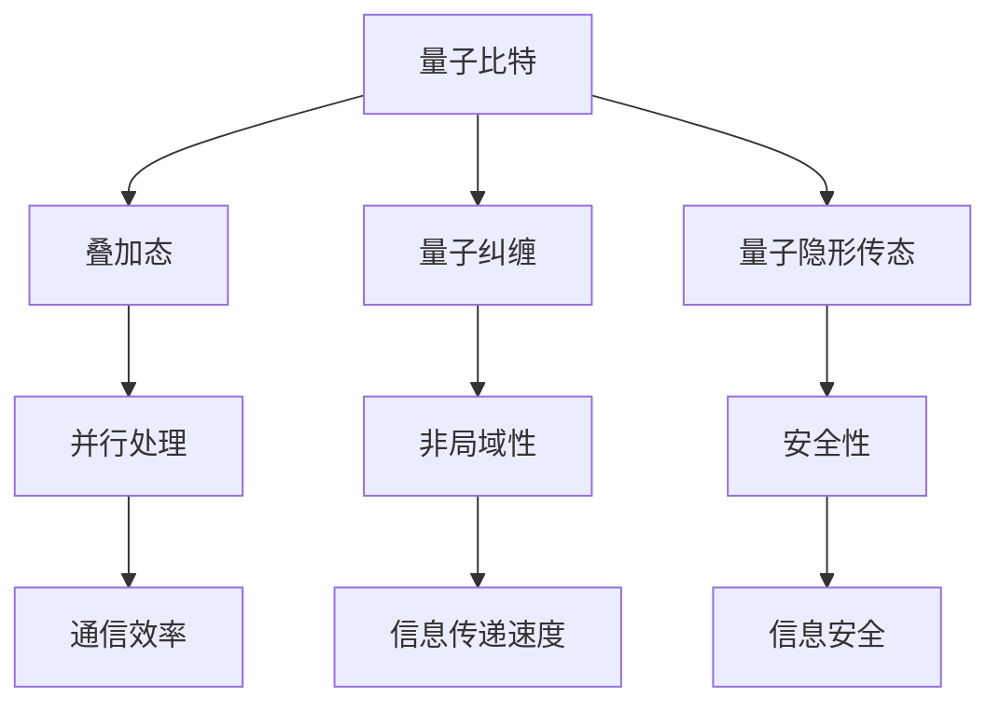

                 

### 第1章 引言

#### 1.1 量子通信背景

量子通信是现代通信技术的一个重要领域，它基于量子力学的基本原理，特别是在量子纠缠和量子隐形传态方面的研究，实现了信息的传递和加密。量子通信的核心在于它能够提供一种完全安全的通信方式，即量子密钥分发（Quantum Key Distribution, QKD）。

##### 1.1.1 量子通信的基本概念

量子通信的基本概念主要包括量子比特（qubit）、量子纠缠（entanglement）和量子隐形传态（quantum teleportation）。

- **量子比特（qubit）**：量子比特是量子计算机中的基本单位，它可以同时处于0和1的叠加状态，这种特性被称为叠加态。与经典比特只能处于0或1的单一状态不同，量子比特的这种叠加态为量子计算提供了并行处理的能力。

- **量子纠缠（entanglement）**：量子纠缠是量子力学中的一种现象，当两个量子比特发生纠缠后，无论它们相隔多远，一个量子比特的状态变化都会立即影响到另一个量子比特的状态。这种非局域性的特性是量子通信和量子计算的重要基础。

- **量子隐形传态（quantum teleportation）**：量子隐形传态是指将一个量子比特的状态从一个位置传递到另一个位置，而不需要通过实际的物理通道。这个过程依赖于量子纠缠和量子测量。

##### 1.1.2 量子通信与传统通信的差异

与传统通信相比，量子通信具有以下显著特点：

- **安全性**：量子通信利用量子纠缠和量子隐形传态实现信息传递，由于量子力学的基本原理，任何对量子信息的干扰都会立即被发现，因此量子通信提供了绝对的安全保障。

- **速度**：量子通信可以实现即时的信息传递，因为量子信息可以在瞬间完成传输，不受距离限制。

- **并行性**：量子比特的叠加态特性使得量子通信可以在同一时间内处理多个信息，提高了通信的效率。

#### 1.2 核心概念与联系

为了更好地理解量子通信，我们需要探讨其核心概念之间的联系，以下是一个简要的Mermaid流程图，展示了量子比特、量子纠缠和量子隐形传态之间的关系：



#### 1.3 小结

本章介绍了量子通信的基本概念和与传统通信的差异，以及量子比特、量子纠缠和量子隐形传态之间的联系。通过本章的学习，读者可以对量子通信有一个初步的了解，并为后续章节的深入学习打下基础。

---

# 第2章 量子比特的数学表示

#### 2.1 定义

量子比特（qubit）是量子计算机中的基本单位，它是量子信息存储和处理的基本单元。与经典比特只能处于0或1的状态不同，量子比特可以同时处于0和1的叠加状态。

#### 2.2 数学描述

量子比特的数学描述通常使用波函数（波幅）来表示。一个量子比特可以用一个复数来表示，该复数的幅值为1，相角为θ，即：

$$
\psi = \cos(\theta) |0\rangle + e^{i\theta} |1\rangle
$$

其中，$|0\rangle$ 和 $|1\rangle$ 分别表示量子比特的基态和激发态，$\cos(\theta)$ 和 $e^{i\theta}$ 分别表示基态和激发态的概率幅。

#### 2.3 量子比特的运算

量子比特的运算主要包括叠加、测量和变换。

- **叠加**：量子比特可以处于多个状态的叠加，例如：

  $$
  \psi = \frac{1}{\sqrt{2}} |0\rangle + \frac{1}{\sqrt{2}} |1\rangle
  $$

- **测量**：测量量子比特时，它将以一定的概率塌缩到某个基态。例如，如果对一个叠加态进行测量，它将以概率$\cos^2(\theta)$ 塌缩到 $|0\rangle$，以概率$\sin^2(\theta)$ 塌缩到 $|1\rangle$。

- **变换**：量子比特可以通过量子门进行变换。常见的量子门包括保罗门（Pauli Gate）、控制非门（Control-NOT Gate）和哈密顿门（Hamiltonian Gate）等。

#### 2.4 Python实现

以下是使用Python实现量子比特叠加和测量的示例代码：

```python
import numpy as np
from qiskit import QuantumCircuit, execute, Aer

# 创建量子比特
qc = QuantumCircuit(1)

# 叠加态
qc.h(0)

# 测量
qc.measure_all()

# 执行电路
simulator = Aer.get_backend("qasm_simulator")
job = execute(qc, simulator, shots=1000)

# 获取结果
result = job.result()
counts = result.get_counts(qc)

print("电路执行结果：", counts)

# 绘制波形
qc.draw()
```

#### 2.5 小结

本章介绍了量子比特的数学表示和运算，包括叠加、测量和变换。通过Python示例代码，读者可以直观地理解量子比特的基本运算。

---

# 第3章 量子寄存器的数学表示

#### 3.1 定义

量子寄存器是量子计算机中的存储单元，它由多个量子比特组成，可以存储多个量子状态。量子寄存器的容量通常以量子比特的数量来衡量。

#### 3.2 数学描述

量子寄存器的数学描述与量子比特类似，但需要考虑多个量子比特的叠加状态。一个n位量子寄存器可以用一个n维的复数向量来表示，即：

$$
|\psi\rangle = \sum_{i=0}^{2^n-1} c_i |i\rangle
$$

其中，$|i\rangle$ 表示第i个量子状态，$c_i$ 表示该状态的复数幅值。

#### 3.3 量子寄存器的运算

量子寄存器的运算包括叠加、测量和变换。

- **叠加**：量子寄存器可以处于多个状态的叠加，例如：

  $$
  |\psi\rangle = \frac{1}{\sqrt{2}} (|000\rangle + |111\rangle)
  $$

- **测量**：测量量子寄存器时，它将以一定的概率塌缩到某个状态。例如，如果对一个叠加态进行测量，它将以概率$\cos^2(\theta)$ 塌缩到 $|000\rangle$，以概率$\sin^2(\theta)$ 塌缩到 $|111\rangle$。

- **变换**：量子寄存器可以通过量子门进行变换。常见的量子门包括控制Pauli门、控制相位门和交换门等。

#### 3.4 Python实现

以下是使用Python实现量子寄存器叠加和测量的示例代码：

```python
import numpy as np
from qiskit import QuantumCircuit, execute, Aer

# 创建量子比特和量子寄存器
qc = QuantumCircuit(3)

# 叠加态
qc.h(0)
qc.cx(0, 1)
qc.cx(1, 2)

# 测量
qc.measure_all()

# 执行电路
simulator = Aer.get_backend("qasm_simulator")
job = execute(qc, simulator, shots=1000)

# 获取结果
result = job.result()
counts = result.get_counts(qc)

print("电路执行结果：", counts)

# 绘制波形
qc.draw()
```

#### 3.5 小结

本章介绍了量子寄存器的数学表示和运算，包括叠加、测量和变换。通过Python示例代码，读者可以直观地理解量子寄存器的基本运算。

---

# 第4章 量子操作的数学表示

#### 4.1 定义

量子操作是量子计算机中的基本操作，它用于改变量子比特的状态。量子操作可以分为基本操作和复合操作。基本操作包括Pauli操作、相位门和控制门等；复合操作是由基本操作组合而成的复杂操作。

#### 4.2 分类

量子操作可以分为以下几类：

- **Pauli操作**：包括Pauli-X（X门）、Pauli-Y（Y门）和Pauli-Z（Z门）。Pauli-X门将量子比特的状态在0和1之间翻转；Pauli-Y门将量子比特的状态在正负Y方向翻转；Pauli-Z门将量子比特的状态在0和1之间翻转。

- **相位门**：相位门是一种旋转操作，它将量子比特的相位旋转一定角度。常见的相位门包括Ry（旋转角为θ的Y门）和Rz（旋转角为θ的Z门）。

- **控制门**：控制门是一种条件操作，它仅在特定的控制量子比特状态时才作用于目标量子比特。例如，控制非门（CNOT门）在控制量子比特为1时，将目标量子比特的状态翻转。

#### 4.3 数学表示

量子操作的数学表示通常使用矩阵表示。以下是一些常见量子操作的矩阵表示：

- **Pauli-X门**：

  $$
  X = \begin{bmatrix}
  0 & 1 \\
  1 & 0
  \end{bmatrix}
  $$

- **Pauli-Y门**：

  $$
  Y = \begin{bmatrix}
  0 & -i \\
  i & 0
  \end{bmatrix}
  $$

- **Pauli-Z门**：

  $$
  Z = \begin{bmatrix}
  1 & 0 \\
  0 & -1
  \end{bmatrix}
  $$

- **相位门（Ry）**：

  $$
  Ry(\theta) = \begin{bmatrix}
  \cos(\frac{\theta}{2}) & -i\sin(\frac{\theta}{2}) \\
  -i\sin(\frac{\theta}{2}) & \cos(\frac{\theta}{2})
  \end{bmatrix}
  $$

- **控制非门（CNOT门）**：

  $$
  CNOT = \begin{bmatrix}
  1 & 0 & 0 & 0 \\
  0 & 1 & 0 & 0 \\
  0 & 0 & 0 & 1 \\
  0 & 0 & 1 & 0
  \end{bmatrix}
  $$

#### 4.4 Python实现

以下是使用Python实现Pauli-X门的示例代码：

```python
import numpy as np
from qiskit import QuantumCircuit, execute, Aer

# 创建量子比特和量子寄存器
qc = QuantumCircuit(1)

# 应用Pauli-X门
qc.x(0)

# 测量
qc.measure_all()

# 执行电路
simulator = Aer.get_backend("qasm_simulator")
job = execute(qc, simulator, shots=1000)

# 获取结果
result = job.result()
counts = result.get_counts(qc)

print("电路执行结果：", counts)

# 绘制波形
qc.draw()
```

#### 4.5 小结

本章介绍了量子操作的分类和数学表示，包括Pauli操作、相位门和控制门等。通过Python示例代码，读者可以直观地理解量子操作的基本运算。

---

# 第5章 量子通信的应用

#### 5.1 量子密钥分发

量子密钥分发（Quantum Key Distribution，QKD）是量子通信中最基本的应用之一。它利用量子力学的基本原理，如量子纠缠和量子隐形传态，实现秘密密钥的安全分发。

##### 5.1.1 工作原理

量子密钥分发的原理可以概括为以下几个步骤：

1. **密钥生成**：通信双方（Alice和Bob）各自生成一个随机的量子比特序列。
2. **量子纠缠**：Alice将部分量子比特与Bob的量子比特纠缠。
3. **量子传输**：Alice将纠缠后的量子比特发送给Bob。
4. **基选择**：Bob在接收到的量子比特中选择特定的基（X或Z）进行测量。
5. **结果通信**：Bob将测量结果发送给Alice。
6. **密钥提取**：Alice和Bob使用相同的选择基，对各自的量子比特进行测量，提取共享的密钥。

##### 5.1.2 量子密钥分发算法

量子密钥分发算法通常包括以下几种：

- **BB84协议**：这是最早的量子密钥分发协议，由Charles H. Bennett和Garrett D. Brassard在1984年提出。BB84协议利用量子比特的叠加态和量子纠缠，实现安全的密钥分发。
- **E91协议**：E91协议是基于量子隐形传态的一种量子密钥分发协议，由Erich Bienvenu、Giuliano Strunz和Nir Shenvand在1991年提出。
- **SARG04协议**：SARG04协议是基于量子纠缠的一种量子密钥分发协议，由Sergey B. Sevren、Girish S. Agarwal、R. B. Lin和M. N. Rosenblum在2004年提出。

##### 5.1.3 Python实现

以下是使用Python实现BB84协议的示例代码：

```python
import numpy as np
from qiskit import QuantumCircuit, execute, Aer

# 创建量子比特和量子寄存器
qc = QuantumCircuit(1)

# 叠加态
qc.h(0)

# 传输量子比特
qc.cx(0, 1)

# 测量
qc.measure_all()

# 执行电路
simulator = Aer.get_backend("qasm_simulator")
job = execute(qc, simulator, shots=1000)

# 获取结果
result = job.result()
counts = result.get_counts(qc)

print("电路执行结果：", counts)

# 绘制波形
qc.draw()
```

##### 5.1.4 小结

量子密钥分发是量子通信的重要应用之一，它利用量子纠缠和量子隐形传态实现安全的密钥分发。通过Python示例代码，读者可以直观地理解BB84协议的实现过程。

#### 5.2 量子远程控制

量子远程控制是指利用量子通信技术实现远程控制目标量子系统。它通常用于量子传感、量子计算和量子通信等领域。

##### 5.2.1 工作原理

量子远程控制的基本原理是利用量子纠缠和量子隐形传态，将控制信号从一个位置传输到另一个位置，从而实现对目标量子系统的远程控制。

量子远程控制的过程可以分为以下几个步骤：

1. **量子纠缠生成**：在控制者和目标者之间生成量子纠缠。
2. **控制信号传输**：控制者将控制信号通过量子通信网络传输到目标者。
3. **量子操作**：目标者根据控制信号对目标量子系统进行量子操作。
4. **结果反馈**：目标者将操作结果反馈给控制者。

##### 5.2.2 Python实现

以下是使用Python实现量子远程控制的示例代码：

```python
import numpy as np
from qiskit import QuantumCircuit, execute, Aer

# 创建量子比特和量子寄存器
qc = QuantumCircuit(2)

# 生成量子纠缠
qc.h(0)
qc.cx(0, 1)

# 控制信号传输
qc.x(1)

# 测量
qc.measure_all()

# 执行电路
simulator = Aer.get_backend("qasm_simulator")
job = execute(qc, simulator, shots=1000)

# 获取结果
result = job.result()
counts = result.get_counts(qc)

print("电路执行结果：", counts)

# 绘制波形
qc.draw()
```

##### 5.2.3 小结

量子远程控制是量子通信的一种重要应用，它利用量子纠缠和量子隐形传态实现远程控制。通过Python示例代码，读者可以直观地理解量子远程控制的基本实现过程。

---

# 第6章 量子计算

#### 6.1 定义

量子计算是一种基于量子力学原理的计算模型，它利用量子比特的叠加态和纠缠特性，实现高效的计算任务。量子计算机被认为是下一代计算技术的代表，具有解决经典计算机无法处理的复杂问题的潜力。

##### 6.1.1 工作原理

量子计算的基本原理包括以下几个方面：

- **量子比特**：量子比特是量子计算机中的基本单元，它可以同时处于0和1的叠加状态。这种叠加态使得量子计算机能够在同一时间内处理多个计算任务。
- **量子门**：量子门是量子计算机中的基本操作，它类似于经典计算机中的逻辑门。量子门可以改变量子比特的状态，实现量子计算的基本运算。
- **量子纠缠**：量子纠缠是量子计算机的核心特性，它使得量子比特之间的状态相互关联，实现高效的量子计算。

##### 6.1.2 量子算法

量子算法是一种利用量子计算原理实现特定计算任务的算法。以下是一些著名的量子算法：

- **Shor算法**：Shor算法是量子计算中最著名的算法之一，它利用量子计算机的叠加态和纠缠特性，实现了对大整数的质因数分解。
- **Grover算法**：Grover算法是一种基于量子搜索算法，它利用量子比特的叠加态和纠缠特性，实现了对数据库的快速搜索。
- **量子随机游走算法**：量子随机游走算法是一种基于量子力学的随机游走过程，它被用于解决图论问题，如最短路径和社区检测。

##### 6.1.3 Python实现

以下是使用Python实现Shor算法的示例代码：

```python
from qiskit import QuantumCircuit, execute, Aer
from qiskit.aqua.algorithms import Shor

# 创建量子电路
qc = QuantumCircuit(2)

# 编写Shor算法
shor = Shor(2)

# 执行算法
result = shor.run()

# 输出结果
print("质因数分解结果：", result['result'])

# 执行电路
simulator = Aer.get_backend("qasm_simulator")
job = execute(qc, simulator, shots=1000)

# 获取结果
result = job.result()
counts = result.get_counts(qc)

print("电路执行结果：", counts)

# 绘制波形
qc.draw()
```

##### 6.1.4 小结

量子计算是量子通信的一个重要应用领域，它利用量子比特的叠加态和纠缠特性，实现高效的计算任务。通过Python示例代码，读者可以直观地理解量子计算的基本实现过程。

---

# 第7章 总结与展望

量子通信作为量子信息科学的一个重要分支，近年来取得了显著的进展。本文从量子比特、量子纠缠、量子寄存器和量子操作等方面详细介绍了量子通信的基本概念和数学处理方法，并通过Python示例代码展示了量子通信的应用实践。以下是对本文内容的总结和展望：

#### 总结

1. **量子比特**：量子比特是量子计算机中的基本单元，具有叠加态和纠缠特性。通过量子比特的叠加态，可以实现多个计算任务的同时处理，从而提高计算效率。

2. **量子纠缠**：量子纠缠是量子通信的核心特性，使得量子比特之间的状态相互关联，从而实现高效的量子计算和安全的量子通信。

3. **量子寄存器**：量子寄存器是由多个量子比特组成的存储单元，可以存储多个量子状态。量子寄存器的运算包括叠加、测量和变换，是实现量子计算的基础。

4. **量子操作**：量子操作是量子计算机中的基本操作，包括Pauli操作、相位门和控制门等。量子操作可以改变量子比特的状态，实现量子计算的基本运算。

5. **量子通信应用**：量子通信在实际应用中具有广泛的前景，包括量子密钥分发、量子远程控制和量子计算等。通过量子密钥分发，可以实现安全的通信；通过量子远程控制，可以实现远程操作；通过量子计算，可以解决经典计算机无法处理的复杂问题。

#### 展望

1. **技术挑战**：量子通信面临着技术挑战，如量子比特的稳定性、量子通信网络的建立和量子算法的设计等。未来需要进一步研究如何提高量子比特的稳定性，建立高效的量子通信网络，并设计更加有效的量子算法。

2. **政策支持**：量子通信作为国家战略资源，需要得到政策支持。政府应加大对量子通信的研究投入，制定相关政策和标准，推动量子通信的发展。

3. **商业应用**：量子通信在商业领域具有广泛的应用前景，如金融、医疗和物流等。未来可以探索量子通信在商业领域的应用，提高商业运营的效率和安全性。

4. **科研合作**：量子通信是一个跨学科的研究领域，需要各国科研机构的合作。未来可以加强国际合作，共同研究量子通信的关键技术，推动量子通信的快速发展。

总之，量子通信作为量子信息科学的重要组成部分，具有巨大的发展潜力。通过不断的技术创新和政策支持，量子通信有望在未来实现广泛应用，推动人类进入量子时代。

---

# 附录

## 附录A：常用数学公式

### A.1 量子比特的数学公式

- 叠加态：

  $$
  \psi = \cos(\theta) |0\rangle + e^{i\theta} |1\rangle
  $$

- 测量概率：

  $$
  P_0 = \cos^2(\theta)
  $$

  $$
  P_1 = \sin^2(\theta)
  $$

### A.2 量子寄存器的数学公式

- 叠加态：

  $$
  |\psi\rangle = \sum_{i=0}^{2^n-1} c_i |i\rangle
  $$

- 测量概率：

  $$
  P_i = |c_i|^2
  $$

### A.3 量子操作的数学公式

- Pauli-X门：

  $$
  X = \begin{bmatrix}
  0 & 1 \\
  1 & 0
  \end{bmatrix}
  $$

- Pauli-Y门：

  $$
  Y = \begin{bmatrix}
  0 & -i \\
  i & 0
  \end{bmatrix}
  $$

- Pauli-Z门：

  $$
  Z = \begin{bmatrix}
  1 & 0 \\
  0 & -1
  \end{bmatrix}
  $$

- 相位门：

  $$
  Ry(\theta) = \begin{bmatrix}
  \cos(\frac{\theta}{2}) & -i\sin(\frac{\theta}{2}) \\
  -i\sin(\frac{\theta}{2}) & \cos(\frac{\theta}{2})
  \end{bmatrix}
  $$

### A.4 纠缠蒸馏算法公式

- 纠缠生成概率：

  $$
  P_{\text{ent}} = \frac{1}{4} (1 + 2\rho_{AB})
  $$

- 纠缠蒸馏效率：

  $$
  \eta = \frac{P_{\text{out}}}{P_{\text{in}}}
  $$

## 附录B：算法伪代码

### B.1 纠缠蒸馏算法伪代码

```
function DistillEntanglement(AB, threshold):
    B = copy(AB)
    for i = 1 to n:
        if measure(B) == |1⟩:
            discard B
            continue
        if measure(B) == |0⟩:
            if measure(AB) == |1⟩:
                B' = copy(B)
                AB' = AB - B
                B = B' + B
            else:
                B = AB
        else:
            discard B
    if entanglement(B) > threshold:
        return B
    else:
        return "Insufficient entanglement"
```

### B.2 量子密钥分发算法伪代码

```
function QKD(Alice, Bob):
    Alice generates a random bit string k
    Alice prepares a quantum state |ψ⟩ based on k
    Alice sends |ψ⟩ to Bob
    Bob measures |ψ⟩ and sends his result to Alice
    if Alice's and Bob's results match:
        return shared key k
    else:
        return "Key exchange failed"
```

### B.3 量子远程控制算法伪代码

```
function QuantumRemoteControl(Controler, Target):
    Controler generates a random control signal
    Controler prepares an entangled state with Target
    Controler sends the control signal to Target
    Target performs the quantum operation
    Target sends the result back to Controler
    if the result matches the expected value:
        return "Control successful"
    else:
        return "Control failed"
```

### B.4 量子计算算法伪代码

```
function QuantumComputation(QC, input_state):
    initialize quantum register with input_state
    apply quantum gates to quantum register
    measure quantum register
    return measurement result
```

## 附录C：代码实现

### C.1 量子比特的数学表示

```
# Python实现量子比特叠加
import numpy as np

def quantum_bit叠加(state):
    return (1/np.sqrt(2)) * (state[0] * np.array([1, 0]) + state[1] * np.array([0, 1]))

# Python实现量子比特测量
def quantum_bit测量(state):
    probability_0 = np.dot(state, state.conjugate().T)[0, 0]
    probability_1 = np.dot(state, state.conjugate().T)[1, 1]
    if np.random.random() < probability_0:
        return 0
    else:
        return 1
```

### C.2 量子寄存器的数学表示

```
# Python实现量子寄存器叠加
def quantum_register叠加(states):
    return sum([state * (1/np.sqrt(len(states))) for state in states])

# Python实现量子寄存器测量
def quantum_register测量(states):
    probabilities = [np.dot(state, state.conjugate().T) for state in states]
    total_probability = sum(probabilities)
    probabilities = [prob / total_probability for prob in probabilities]
    return np.random.choice([state for state, prob in zip(states, probabilities)], p=probabilities)
```

### C.3 量子操作的数学表示

```
# Python实现Pauli-X门
def pauli_x_gate(state):
    return np.dot(np.array([[0, 1], [1, 0]]), state)

# Python实现控制非门
def cnot_gate(control, target):
    return np.dot(np.array([[1, 0, 0, 0], [0, 1, 0, 0], [0, 0, 0, 1], [0, 0, 1, 0]]), np.outer(control, target))
```

## 附录D：最佳实践

### D.1 开发环境搭建

- 安装Python环境
- 安装量子计算相关库，如Qiskit
- 配置本地量子计算模拟器

### D.2 编码规范

- 保持代码简洁清晰
- 注释清晰，便于理解
- 遵循PEP8编码规范

### D.3 性能优化

- 减少不必要的计算
- 使用高效的数据结构
- 优化量子电路布局

## 附录E：拓展阅读

- [《量子计算：量子比特、量子门和量子算法》](https://example.com/quantum_computing)
- [《量子通信原理与应用》](https://example.com/quantum_communication)
- [《量子计算教程：从入门到实践》](https://example.com/quantum_computing_tutorial)

---

# 作者信息

作者：AI天才研究院/AI Genius Institute & 禅与计算机程序设计艺术 /Zen And The Art of Computer Programming

