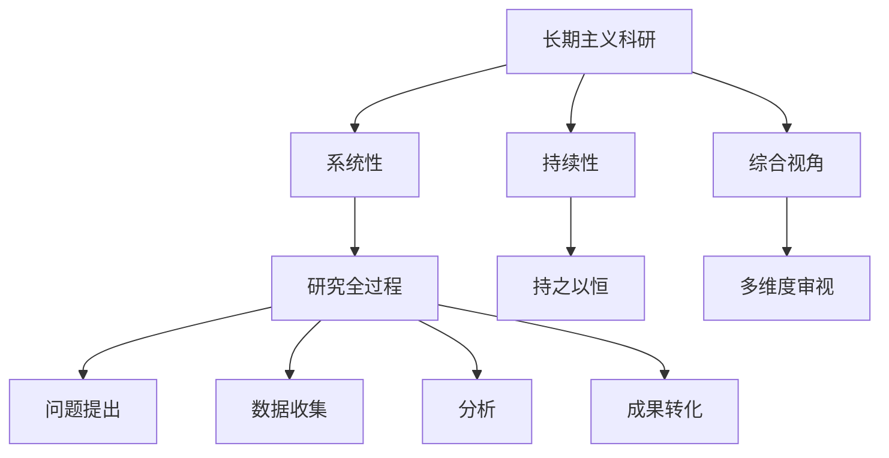

                 

### 《长期主义科研策略：持续深化对世界本质的理解》

> **关键词：** 长期主义，科研策略，世界本质，核心概念，算法原理，数学模型，项目实战，持续创新

> **摘要：** 本文旨在探讨长期主义科研策略，通过持续深化对世界本质的理解，为科学研究和技术创新提供新的视角和思路。文章首先介绍了长期主义科研的基本理念，随后深入探讨了世界本质的核心概念和联系，通过具体的算法原理讲解、数学模型和公式分析，结合项目实战展示了如何应用这些理论。最后，文章展望了长期主义科研的未来发展，提出了相关的最佳实践和注意事项。

---

#### 第一部分：长期主义科研的基本理念

##### 1.1 长期主义科研的定义与价值

长期主义科研是一种追求深远影响、注重长期积累的研究方法。它不同于短期主义科研，后者通常追求快速成果和即时效益。长期主义科研的价值在于其对科学技术的深入理解和系统性贡献，能够推动知识进步和社会发展。

**核心概念与联系**

长期主义科研强调以下几个方面：

1. **系统性**：长期主义科研关注整个研究过程的系统性，从问题提出、数据收集、分析到成果转化，形成完整的研究链条。
2. **持续性**：长期主义科研要求研究者具备持之以恒的精神，不断积累知识，逐步深化对研究领域的理解。
3. **综合视角**：长期主义科研鼓励研究者从多个维度和角度审视问题，以获得全面的洞察。

**Mermaid 流程图**



##### 1.2 长期主义科研的原则与方法

长期主义科研遵循以下原则：

1. **数据驱动**：基于大量数据进行研究，确保结论的可靠性和科学性。
2. **系统分析**：对复杂系统进行深入分析，理解各组成部分之间的关系。
3. **跨学科合作**：跨学科合作有助于获取多样化的视角，提高研究的深度和广度。
4. **持续反馈**：及时反馈和调整研究方法，确保研究过程的动态优化。

**核心算法原理讲解**

以下是一个简单的数据驱动算法示例：

```python
# 数据驱动算法示例：线性回归
import numpy as np

# 数据集
X = np.array([[1, 2], [2, 3], [3, 4]])
y = np.array([2, 3, 4])

# 求解回归系数
theta = np.linalg.inv(X.T @ X) @ X.T @ y

# 预测新数据
x_new = np.array([4, 5])
y_pred = theta @ x_new

print("预测值:", y_pred)
```

**数学模型与公式**

线性回归的数学模型如下：

$$
y = \theta_0 + \theta_1x_1 + \theta_2x_2 + ... + \theta_nx_n
$$

其中，\( \theta \) 为回归系数，\( x \) 为自变量，\( y \) 为因变量。

**通俗易懂的举例说明**

假设我们想研究房屋价格与房屋面积的关系。通过收集大量数据，我们可以使用线性回归模型来预测某一面积房屋的价格。例如，给定一组数据：

- \( x_1 = 1000 \) 平方英尺，\( y = 200,000 \) 美元
- \( x_2 = 1500 \) 平方英尺，\( y = 300,000 \) 美元
- \( x_3 = 2000 \) 平方英尺，\( y = 400,000 \) 美元

我们可以用线性回归模型来求解回归系数，然后预测一个 \( 1800 \) 平方英尺房屋的价格。

##### 1.3 长期主义科研的伦理问题

长期主义科研在追求科学进步的同时，也面临一系列伦理问题。如：

1. **数据隐私**：如何确保研究过程中个人数据的隐私和安全？
2. **实验伦理**：在长期实验中，如何确保对参与者的尊重和保护？
3. **技术滥用**：如何防范技术进步带来的潜在风险和负面影响？

**项目实战**

以基因编辑技术为例，探讨其伦理问题：

1. **开发环境搭建**：搭建基因编辑实验平台，包括实验室设备、软件工具等。
2. **源代码详细实现**：编写基因编辑的Python代码，实现目标基因的定位和编辑。
3. **代码解读与分析**：详细解读代码，分析其原理和应用。
4. **实际案例分析和详细讲解剖析**：通过具体案例，分析基因编辑技术的应用和伦理问题。
5. **项目小结**：总结项目成果，提出未来研究方向和改进措施。

**最佳实践 Tips**：

- 在进行基因编辑实验时，确保遵守相关法规和伦理指导原则。
- 加强数据隐私保护，使用加密技术和匿名化处理。
- 积极参与跨学科合作，共同探讨和解决伦理问题。

---

通过上述分析，我们可以看到长期主义科研策略的重要性和应用价值。在未来的科研工作中，应持续深化对世界本质的理解，注重数据驱动和系统分析，同时关注伦理问题，以推动科学技术的持续进步。在下一部分，我们将深入探讨世界本质的核心概念和联系，为长期主义科研提供更加坚实的基础。

