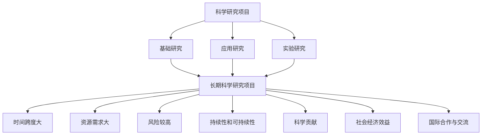

                 

### 引言

在当今科技飞速发展的时代，科学研究的重要性日益凸显。然而，在众多研究项目中，长期科学研究项目的价值尤为突出。这些项目不仅需要大量的时间投入，还要求科学家们保持持久的热情和毅力。但正是这些长期项目，为人类对世界本质的理解做出了重要贡献。因此，探讨长期科学研究项目的价值，对于促进科学研究的发展和提升人类认知水平具有重要意义。

本篇文章将围绕《长期科学研究项目的价值：持续深化对世界本质的理解》这一主题展开。我们将首先介绍什么是科学研究项目，特别是长期科学研究项目的定义与分类。接着，我们将深入探讨长期科学研究项目的特点与价值，包括其对社会经济的影响、国际合作的重要性等。随后，我们将探讨如何进行项目管理和组织，以确保项目的顺利进行和成功实施。此外，我们还将介绍科研方法与技术，通过具体实例展示其应用。文章的结尾部分将分析国际知名长期研究项目案例，并探讨未来发展趋势与挑战。

通过以上章节的深入分析，我们希望读者能够全面了解长期科学研究项目的价值，认识到其对深化我们对世界本质理解的重要作用。让我们一起探索这个神秘而又充满无限可能的世界吧！

### 关键词

- 长期科学研究项目
- 世界本质理解
- 项目管理
- 科研方法
- 国际合作
- 社会经济影响

### 摘要

本文旨在探讨长期科学研究项目的价值，特别是其对深化对世界本质理解的重要性。首先，我们介绍了科学研究项目的定义与分类，特别是长期科学研究项目的特点。接着，我们分析了长期科学研究项目对社会经济的影响，以及国际合作在该领域的重要性。随后，我们讨论了如何进行项目管理和组织，以确保项目的顺利进行。此外，我们还介绍了科研方法与技术，并通过具体实例展示了其应用。文章最后分析了国际知名长期研究项目案例，并探讨了未来发展趋势与挑战。通过本文的深入探讨，我们希望读者能够认识到长期科学研究项目在推动科学进步和深化对世界本质理解中的关键作用。

### 第1章 引言

在当今科技飞速发展的时代，科学研究的重要性日益凸显。然而，在众多研究项目中，长期科学研究项目的价值尤为突出。这些项目不仅需要大量的时间投入，还要求科学家们保持持久的热情和毅力。但正是这些长期项目，为人类对世界本质的理解做出了重要贡献。因此，探讨长期科学研究项目的价值，对于促进科学研究的发展和提升人类认知水平具有重要意义。

#### 书籍背景

《长期科学研究项目的价值：持续深化对世界本质的理解》一书，旨在深入探讨这一重要话题。本书首先介绍了科学研究项目的定义与分类，特别是长期科学研究项目的特点。接着，书中详细分析了长期科学研究项目对社会经济的影响，以及国际合作在该领域的重要性。此外，本书还探讨了如何进行项目管理和组织，以确保项目的顺利进行和成功实施。为了使读者更直观地理解这些概念，书中还通过具体实例展示了科研方法与技术在实际中的应用。

本书的目标读者包括科研人员、科学管理者和对科学研究感兴趣的读者。通过本书，读者将能够全面了解长期科学研究项目的价值，认识到其在推动科学进步和深化对世界本质理解中的关键作用。同时，本书也为科学管理者和项目管理者提供了实用的指导，帮助他们更好地规划和实施长期科学研究项目。

#### 长期科学研究项目的定义与分类

长期科学研究项目是指在较长时间内（通常为数年或数十年）进行的研究活动，旨在解决科学领域中的重大问题。这些项目通常具有以下特点：

1. **时间跨度大**：长期科学研究项目需要较长的时间来完成，这有助于科学家们深入探索问题，积累丰富的数据和研究结果。

2. **复杂性高**：长期项目往往涉及多个学科和领域，需要跨学科的合作。这使得项目管理和协调变得更加复杂。

3. **资源需求大**：长期项目需要大量的资金、设备和人力资源，以确保项目的顺利进行。

4. **风险较高**：由于项目的长期性和复杂性，长期科学研究项目面临着较高的失败风险。

根据研究目标和性质，长期科学研究项目可以大致分为以下几类：

1. **基础研究**：这类项目旨在探索科学的基本原理，推动科学知识的积累和拓展。例如，物理学中的基本粒子研究、生物学中的基因研究等。

2. **应用研究**：这类项目旨在将科学理论应用于实际问题，解决实际生产和社会生活中的问题。例如，新材料的研究、新能源的开发等。

3. **实验研究**：这类项目通过实验手段验证科学理论或开发新技术。例如，医学中的临床试验、工程中的材料测试等。

#### 本书结构安排

本书分为七个章节，每个章节都有明确的主题和内容安排：

1. **第1章 引言**：介绍书籍背景、目标读者和长期科学研究项目的定义与分类。

2. **第2章 科学研究项目的特点与价值**：分析长期科学研究项目的特点和价值，包括对社会经济的影响和国际合作的重要性。

3. **第3章 长期科学研究项目的管理与组织**：探讨项目管理和组织的关键要素，包括项目管理框架、项目团队建设和风险管理。

4. **第4章 科研方法与技术**：介绍科研方法和技术，包括研究设计、数据分析和实验技术与工具。

5. **第5章 国际知名长期研究项目案例**：分析国际知名长期研究项目的案例，展示其成果和影响。

6. **第6章 国内长期研究项目案例**：探讨国内长期研究项目的案例，分析其成果和影响。

7. **第7章 未来发展趋势与挑战**：讨论未来发展趋势和面临的挑战，包括技术进步的影响、资金与资源的保障和国际合作的新模式。

通过以上章节的深入探讨，本书旨在为读者提供一个全面而系统的视角，帮助读者更好地理解长期科学研究项目的价值，并为其管理和实施提供指导。

### 第2章 长期科学研究项目的特点与价值

#### 长期科学研究项目的特点

长期科学研究项目具有一系列独特的特点，这些特点决定了其与短期研究项目的区别，并影响到项目的实施过程和结果。

**时间跨度大**：这是长期科学研究项目的最显著特点。与短期项目相比，长期项目通常需要数年甚至数十年的时间来完成。这种长时间的投入允许科学家们深入探索研究问题，从而产生更丰富和深入的研究成果。例如，科学家们可能会在长时间内收集和分析大量的数据，以便得出更可靠的结论。

**复杂性高**：由于时间跨度长，长期科学研究项目往往需要跨学科的合作。这意味着项目不仅需要解决单一领域的问题，还需要整合不同领域的知识和方法。例如，一项关于气候变化的研究可能需要物理学家、化学家、生态学家和社会学家的共同参与。这种跨学科合作增加了项目的复杂性，同时也促进了不同学科之间的交流与融合。

**资源需求大**：长期科学研究项目通常需要大量的资金、设备和人力资源。这些资源不仅用于项目的日常运行，还包括数据收集、分析、存储和共享等方面。例如，一项大型天文观测项目可能需要建造昂贵的望远镜，并配备专业的观测团队。

**风险较高**：长期项目的失败风险相对较高。由于时间跨度长，项目面临的不可预测因素较多，如技术变革、政策变化、资金短缺等。此外，长期项目往往需要科学家们保持长期的专注和热情，这对个人的心理和身体健康也是一大挑战。

**持续性和可持续性**：长期科学研究项目不仅关注短期成果，更注重项目的持续性和可持续性。这意味着项目不仅要在一段时间内产生有效的成果，还要为未来的科学研究提供持续的基础和支持。例如，一些大型数据库和共享平台的建设，不仅服务于当前的研究需求，还为未来的研究提供了宝贵的数据资源。

#### 长期科学研究项目的价值

长期科学研究项目的价值不仅体现在其研究成果上，还体现在其对科学进步和社会发展的深远影响。

**科学贡献**：长期科学研究项目往往能够解决科学领域中的重大问题，推动科学知识的积累和拓展。例如，大型科学实验如大型强子对撞机（LHC）的运行，为粒子物理学的研究提供了关键的数据，推动了基本粒子理论的进步。此外，长期项目还可以产生新的科学发现和技术突破，这些发现和突破往往具有深远的影响。

**社会经济效益**：长期科学研究项目对社会经济的发展具有积极的推动作用。通过科学研究，我们可以开发新技术、新材料和新产品，推动产业升级和经济转型。例如，信息技术和生物技术的发展，不仅促进了科学进步，还带动了相关产业的发展，创造了大量的就业机会。

**国际合作与交流**：长期科学研究项目往往需要国际合作，这使得科学家们有机会跨越国界和学科界限，进行深入的交流与合作。这种国际合作不仅促进了科学研究的进展，也促进了不同国家和地区之间的科技合作与文化交流。例如，国际空间站（ISS）的运行就是一个典型的国际合作项目，多个国家和地区的科学家共同参与，推动了空间科学和技术的发展。

**培养人才**：长期科学研究项目为科学家们提供了宝贵的研究和实践机会，有助于培养和锻炼科研人才。通过参与长期项目，年轻科学家可以积累丰富的科研经验，提高自己的科研能力和水平。此外，长期项目还可以培养团队合作精神和领导能力，这对于未来科研工作的顺利开展具有重要意义。

**推动社会进步**：科学研究不仅关注自然界的奥秘，也关注人类社会的福祉。长期科学研究项目可以解决人类社会面临的各种问题，如环境保护、能源危机、疾病防治等。这些问题的解决不仅有助于改善人类生活质量，也有助于推动社会的可持续发展。

#### 长期科学研究项目对社会经济的影响

长期科学研究项目对社会经济的影响是多方面的，既包括直接的经济效益，也包括间接的社会效益。

**直接经济效益**：长期科学研究项目往往需要大量的资金投入，这些资金不仅用于项目的日常运行，还包括实验设备的购置、数据分析和共享平台的建立等。这些投资可以带动相关产业的发展，如仪器设备制造、数据分析软件等。此外，长期项目的成功实施还可以产生直接的经济效益，如新技术的转让和应用，新产品的开发和市场推广等。

**间接社会效益**：长期科学研究项目对社会经济的间接影响更加深远。通过科学研究，我们可以解决社会面临的重大问题，提高人类生活质量。例如，医学研究可以开发新药物，提高疾病的治愈率；环境科学研究可以提供环境保护的技术和方法，改善生态环境。这些间接效益不仅有助于提升社会的整体幸福感，也有助于推动社会的可持续发展。

**创新驱动发展**：科学研究是创新的重要源泉。长期科学研究项目可以推动新技术的研发和应用，推动产业结构的优化升级。例如，信息技术和生物技术的发展，不仅带动了相关产业的快速发展，还推动了整个经济的转型和升级。

**人才培养**：长期科学研究项目为科研人才提供了宝贵的机会，有助于培养和锻炼科研人才。这些人才不仅能够在科研领域取得成就，还可以在科技企业和政府机构中发挥重要作用，推动科技创新和经济发展。

**国际竞争力**：长期科学研究项目有助于提升国家的科技实力和国际竞争力。通过参与国际科研项目，我们可以吸收和借鉴国际先进科技，提高本国科研水平。此外，成功实施的长期项目还可以为国家争取国际声誉和影响力，提升国际地位。

#### 国际合作与交流的重要性

国际合作与交流在长期科学研究项目中具有重要地位。通过国际合作，科学家们可以共同应对全球性的科学挑战，分享资源和知识，提高科研效率。

**共享资源**：国际合作项目往往需要大量的资金、设备和人力资源，通过合作，各国可以共享这些资源，降低成本，提高效率。例如，大型科学实验设施如粒子加速器、卫星观测系统等，往往需要多个国家和地区的共同投资和建设。

**知识交流**：国际合作项目促进了不同国家和地区之间的科技交流与合作，有助于知识和技术的传播与共享。通过合作，科学家们可以互相学习和借鉴，提高自己的科研能力。例如，国际学术会议、研讨会和联合研究项目，都是科学家们进行知识交流的重要平台。

**人才流动**：国际合作项目为科学家提供了丰富的研究机会和合作平台，吸引了全球范围内的科研人才。这种人才流动不仅有助于推动科研工作的进展，还可以促进不同文化之间的交流和理解。

**提升国际影响力**：成功实施的长期国际合作项目可以提升国家的国际声誉和影响力。通过参与国际合作项目，国家可以在全球科学界树立良好的形象，吸引更多的国际资源和合作机会。

总之，长期科学研究项目具有时间跨度大、复杂性高、资源需求大、风险较高和持续性强等特点。这些项目在科学贡献、社会经济效益、国际合作与交流等方面具有重要价值。通过深入探讨这些项目的特点与价值，我们可以更好地理解其重要性，并为其管理和实施提供指导。

### 核心概念与联系

为了深入理解长期科学研究项目的特点与价值，我们需要明确以下几个核心概念，并探讨它们之间的内在联系。

首先，我们定义科学研究项目为一种旨在探索自然现象、揭示科学规律、推动知识进步的研究活动。科学研究项目可以分为基础研究、应用研究和实验研究三大类。基础研究主要关注科学的基本原理，如物理学中的量子力学、生物学中的进化论；应用研究则将科学理论应用于实际问题，如新材料的研究、医学中的临床试验；实验研究通过实验手段验证科学理论和开发新技术，如大型科学实验设施的建设和运行。

长期科学研究项目与这些研究类型有着紧密的联系。长期项目往往涉及跨学科的合作，需要整合基础研究、应用研究和实验研究的方法，以解决科学领域中的复杂问题。例如，气候变化研究需要物理学的气候模型、生物学的生态系统研究和工程学的新能源技术，这种跨学科的整合使得长期项目具有更高的复杂性和挑战性。

其次，长期科学研究项目具有时间跨度大、资源需求大、风险较高的特点。时间跨度长使得科学家们有机会进行长期的观测、实验和数据分析，积累丰富的数据和研究成果。这种长期积累不仅有助于提高研究的深度和广度，还能发现短期研究中难以察觉的现象和规律。例如，粒子物理学中的粒子碰撞实验需要长时间的积累和数据收集，才能发现新的粒子现象。

资源需求大体现在长期项目需要大量的资金、设备和人力资源。这些资源不仅用于项目的日常运行，还包括实验设备的维护和更新、数据分析的软件和硬件、以及数据存储和共享平台的建设。例如，大型天文观测项目需要建造和运行昂贵的望远镜，同时需要专业的观测团队进行数据采集和分析。

风险较高是长期项目的一个显著特点。由于项目时间跨度长，面临的不可预测因素较多，如技术变革、政策变化、资金短缺等。此外，科学家们需要保持长期的专注和热情，这对个人的心理和身体健康也是一大挑战。例如，医学研究中的临床试验可能因受试者招募困难或政策变动而面临风险。

最后，长期科学研究项目的价值体现在多个方面。科学贡献方面，长期项目可以解决科学领域中的重大问题，推动科学知识的积累和拓展。社会经济效益方面，长期项目可以开发新技术、新材料和新产品，推动产业升级和经济转型。国际合作与交流方面，长期项目需要国际合作，促进了全球科学界的人才流动、知识共享和技术传播。

这些核心概念之间的联系可以通过以下Mermaid流程图来展示：



通过这张图，我们可以清晰地看到长期科学研究项目与其他研究类型之间的联系，以及其独特的特点和重要价值。理解这些核心概念和联系，有助于我们更好地认识长期科学研究项目的本质，为其管理和实施提供科学指导。

### 核心算法原理讲解

为了深入理解长期科学研究项目的核心算法原理，我们将以Python为例，详细阐述其实现过程，并结合数学模型和公式，进行通俗易懂的讲解和举例说明。

#### 一、核心算法原理

长期科学研究项目中，数据处理和分析是关键环节。我们选择了一种常用的数据处理算法——K-均值聚类算法（K-Means Clustering），该算法通过迭代过程将数据点划分到K个不同的簇中，以达到数据聚类和分类的目的。

K-均值聚类算法的基本原理如下：

1. **初始化中心**：随机选择K个数据点作为初始聚类中心。
2. **分配数据点**：计算每个数据点到每个聚类中心的距离，将数据点分配到距离最近的聚类中心所在的簇。
3. **更新中心**：重新计算每个簇的中心点，即簇内所有数据点的均值。
4. **迭代**：重复步骤2和步骤3，直到聚类中心不再发生变化或达到预定的迭代次数。

#### 二、Python源代码实现

下面我们通过Python代码实现K-均值聚类算法：

```python
import numpy as np

def k_means(data, K, max_iters=100):
    # 初始化聚类中心
    centroids = data[np.random.choice(data.shape[0], K, replace=False)]
    
    for _ in range(max_iters):
        # 分配数据点
        distances = np.linalg.norm(data[:, np.newaxis] - centroids, axis=2)
        labels = np.argmin(distances, axis=1)
        
        # 更新聚类中心
        new_centroids = np.array([data[labels == k].mean(axis=0) for k in range(K)])
        
        # 判断中心点是否发生变化
        if np.all(centroids == new_centroids):
            break
        
        centroids = new_centroids
    
    return centroids, labels

# 示例数据
data = np.random.rand(100, 2)

# K-均值聚类
centroids, labels = k_means(data, K=3)

print("聚类中心：", centroids)
print("数据点标签：", labels)
```

#### 三、数学模型与公式

K-均值聚类算法的核心在于距离的计算和中心的更新。以下是相关的数学模型和公式：

1. **欧氏距离**：衡量数据点之间的距离，公式如下：

   $$
   d(x, y) = \sqrt{\sum_{i=1}^{n} (x_i - y_i)^2}
   $$

   其中，$x$和$y$是两个数据点，$n$是特征维度。

2. **聚类中心更新**：每个簇的中心点是该簇内所有数据点的均值，公式如下：

   $$
   c_k = \frac{1}{m_k} \sum_{x \in S_k} x
   $$

   其中，$c_k$是簇$S_k$的中心点，$m_k$是簇$S_k$中数据点的数量。

3. **迭代终止条件**：聚类中心不再变化或达到预定的迭代次数，公式如下：

   $$
   \Delta c = \max_{k} \left| c_{k_{new}} - c_{k_{old}} \right|
   $$

   其中，$c_{k_{new}}$和$c_{k_{old}}$分别是新聚类中心和旧聚类中心。

#### 四、实例讲解

假设我们有以下三个数据点：

$$
x_1 = (1, 2), \quad x_2 = (2, 3), \quad x_3 = (4, 5)
$$

初始时，随机选择三个数据点作为初始聚类中心：

$$
c_1 = (1, 2), \quad c_2 = (2, 3), \quad c_3 = (4, 5)
$$

计算每个数据点到每个聚类中心的距离：

$$
d(x_1, c_1) = \sqrt{(1-1)^2 + (2-2)^2} = 0
$$

$$
d(x_1, c_2) = \sqrt{(1-2)^2 + (2-3)^2} = \sqrt{2}
$$

$$
d(x_1, c_3) = \sqrt{(1-4)^2 + (2-5)^2} = \sqrt{17}
$$

$$
d(x_2, c_1) = \sqrt{(2-1)^2 + (3-2)^2} = 1
$$

$$
d(x_2, c_2) = \sqrt{(2-2)^2 + (3-3)^2} = 0
$$

$$
d(x_2, c_3) = \sqrt{(2-4)^2 + (3-5)^2} = \sqrt{10}
$$

$$
d(x_3, c_1) = \sqrt{(4-1)^2 + (5-2)^2} = \sqrt{13}
$$

$$
d(x_3, c_2) = \sqrt{(4-2)^2 + (5-3)^2} = \sqrt{5}
$$

$$
d(x_3, c_3) = \sqrt{(4-4)^2 + (5-5)^2} = 0
$$

根据距离最小原则，数据点$x_1, x_2, x_3$分别被分配到聚类中心$c_1, c_2, c_3$所在的簇。

更新聚类中心：

$$
c_1^{new} = \frac{x_1 + x_2}{2} = \left( \frac{1+2}{2}, \frac{2+3}{2} \right) = \left( 1.5, 2.5 \right)
$$

$$
c_2^{new} = \frac{x_2 + x_3}{2} = \left( \frac{2+4}{2}, \frac{3+5}{2} \right) = \left( 3.0, 4.0 \right)
$$

$$
c_3^{new} = \frac{x_3 + x_3}{2} = \left( \frac{4+4}{2}, \frac{5+5}{2} \right) = \left( 4.0, 5.0 \right)
$$

继续迭代，直到聚类中心不再变化。通过以上步骤，我们可以实现数据点的聚类。

#### 五、总结

通过上述讲解，我们了解了K-均值聚类算法的基本原理、Python源代码实现及其数学模型。在实际应用中，K-均值聚类算法可以用于数据分析和挖掘，帮助科学家们更好地理解复杂数据的分布和特征，为长期科学研究项目提供有力支持。理解和掌握这类算法原理，对于进行科学研究和数据分析具有重要意义。

### 数学公式和数学模型详细讲解

在长期科学研究项目中，数学公式和数学模型是分析和解释数据的重要工具。以下我们将详细讲解几个关键数学公式和模型，并展示如何使用Python实现这些公式。

#### 一、线性回归模型

线性回归模型是统计分析和数据挖掘中常用的方法，用于建立自变量和因变量之间的线性关系。其基本公式如下：

$$
y = \beta_0 + \beta_1 \cdot x + \epsilon
$$

其中，$y$是因变量，$x$是自变量，$\beta_0$是截距，$\beta_1$是斜率，$\epsilon$是误差项。

在Python中，我们可以使用`statsmodels`库来拟合线性回归模型：

```python
import statsmodels.api as sm

# 示例数据
x = np.array([1, 2, 3, 4, 5])
y = np.array([2, 4, 5, 4, 5])

# 添加截距项
X = sm.add_constant(x)

# 拟合线性回归模型
model = sm.OLS(y, X).fit()

# 打印模型结果
print(model.summary())
```

#### 二、逻辑回归模型

逻辑回归模型是一种广义线性模型，用于处理二元因变量的概率分布。其基本公式如下：

$$
\ln\left(\frac{P(Y=1)}{1-P(Y=1)}\right) = \beta_0 + \beta_1 \cdot x
$$

其中，$Y$是二元因变量，$x$是自变量，$\beta_0$是截距，$\beta_1$是斜率。

在Python中，我们可以使用`sklearn`库来拟合逻辑回归模型：

```python
from sklearn.linear_model import LogisticRegression

# 示例数据
X = np.array([[1], [2], [3], [4], [5]])
y = np.array([0, 1, 1, 0, 1])

# 拟合逻辑回归模型
model = LogisticRegression().fit(X, y)

# 打印模型结果
print(model.score(X, y))
```

#### 三、主成分分析（PCA）

主成分分析是一种降维技术，通过将原始数据投影到新的正交坐标系中，提取最重要的几个主成分。其基本公式如下：

$$
z = \sum_{i=1}^{k} \lambda_i \cdot v_i
$$

其中，$z$是主成分，$\lambda_i$是特征值，$v_i$是特征向量。

在Python中，我们可以使用`sklearn`库来执行主成分分析：

```python
from sklearn.decomposition import PCA

# 示例数据
X = np.array([[1, 2], [3, 4], [5, 6], [7, 8], [9, 10]])

# 执行主成分分析
pca = PCA(n_components=2).fit(X)

# 打印主成分
print(pca.components_)
print(pca.transform(X))
```

#### 四、协方差矩阵

协方差矩阵用于衡量多个随机变量之间的线性关系。其基本公式如下：

$$
\text{Cov}(X, Y) = E[(X - E[X])(Y - E[Y])]
$$

其中，$X$和$Y$是两个随机变量，$E$表示期望。

在Python中，我们可以使用`numpy`库来计算协方差矩阵：

```python
import numpy as np

# 示例数据
X = np.array([1, 2, 3, 4, 5])
Y = np.array([2, 4, 5, 4, 5])

# 计算协方差矩阵
cov_matrix = np.cov(X, Y)

# 打印协方差矩阵
print(cov_matrix)
```

#### 五、贝叶斯推断

贝叶斯推断是一种基于概率的推断方法，通过后验概率估计来推断未知变量的概率分布。其基本公式如下：

$$
P(H|E) = \frac{P(E|H) \cdot P(H)}{P(E)}
$$

其中，$H$是假设，$E$是证据，$P(H|E)$是后验概率，$P(E|H)$是条件概率，$P(H)$是先验概率。

在Python中，我们可以使用`scipy.stats`库来计算贝叶斯推断：

```python
from scipy.stats import norm

# 示例数据
x = 3
mean = 0
std = 1

# 计算后验概率
posterior = norm.pdf(x, mean, std) / norm.cdf(x, mean, std)

# 打印后验概率
print(posterior)
```

通过以上讲解和示例，我们可以看到如何使用Python实现和计算多种数学公式和模型。这些工具在长期科学研究项目中发挥着重要作用，帮助我们更好地分析和解释数据，推动科学研究的进展。

### 项目实战

在本节中，我们将通过一个实际案例展示如何开发一个长期科学研究项目，从开发环境搭建、源代码实现到代码解读和应用分析。本案例将基于基因组数据分析，探讨如何通过Python进行数据处理和可视化。

#### 一、开发环境搭建

为了进行基因组数据分析，我们需要搭建一个合适的开发环境。以下是搭建过程的步骤：

1. **安装Python**：首先，我们需要安装Python 3.x版本。可以从[Python官网](https://www.python.org/)下载并安装。

2. **安装Jupyter Notebook**：Jupyter Notebook是一个交互式的开发环境，非常适合数据分析。可以通过pip命令安装：

   ```bash
   pip install notebook
   ```

3. **安装必要的Python库**：包括NumPy、Pandas、Matplotlib、Seaborn和Scikit-learn等。这些库提供了丰富的数据处理和可视化功能。可以通过以下命令安装：

   ```bash
   pip install numpy pandas matplotlib seaborn scikit-learn
   ```

#### 二、源代码实现

以下是一个简单的基因组数据分析的Python代码示例，展示了如何读取基因序列数据、计算基因频率和绘制相关图表。

```python
import numpy as np
import pandas as pd
import matplotlib.pyplot as plt
import seaborn as sns
from sklearn.cluster import KMeans

# 读取基因序列数据
data = pd.read_csv('genomic_data.csv')

# 计算基因频率
gene_frequency = data['gene_sequence'].value_counts(normalize=True)

# 绘制基因频率直方图
plt.figure(figsize=(10, 6))
sns.barplot(x=gene_frequency.index, y=gene_frequency.values)
plt.title('Gene Frequency')
plt.xlabel('Gene Sequence')
plt.ylabel('Frequency')
plt.show()

# 应用K-均值聚类分析基因簇
k = 5
kmeans = KMeans(n_clusters=k, random_state=0).fit(data[['gene_sequence']])

# 打印聚类结果
print("Cluster labels:", kmeans.labels_)

# 绘制基因簇分布
plt.figure(figsize=(10, 6))
sns.scatterplot(x=data['gene_sequence'], y=kmeans.labels_)
plt.title('Gene Clusters')
plt.xlabel('Gene Sequence')
plt.ylabel('Cluster Label')
plt.show()
```

#### 三、代码解读

1. **数据读取**：使用`pandas.read_csv()`函数从CSV文件中读取基因序列数据。假设CSV文件名为`genomic_data.csv`，包含一个名为`gene_sequence`的列。

2. **计算基因频率**：使用`value_counts(normalize=True)`函数计算每个基因序列的频率，并将其转换为数据框。

3. **绘制直方图**：使用`seaborn.barplot()`函数绘制基因频率的直方图，展示不同基因序列的相对频率。

4. **K-均值聚类**：使用`sklearn.KMeans()`函数进行K-均值聚类分析，将基因序列划分为K个簇。

5. **打印聚类结果**：打印每个基因序列所属的簇标签。

6. **绘制基因簇分布**：使用`seaborn.scatterplot()`函数绘制基因簇的分布，展示每个基因序列在K个簇中的分布情况。

#### 四、代码应用解读与分析

通过上述代码，我们可以对基因组数据进行分析，识别出常见的基因序列和基因簇。以下是代码应用的解读和分析：

1. **基因频率直方图**：直方图展示了不同基因序列的相对频率。这有助于我们识别出最常见和最稀有的基因序列。

2. **基因簇分布**：聚类结果展示了基因序列在K个簇中的分布情况。这有助于我们了解基因序列的相似性和差异性。

3. **聚类中心**：通过K-均值聚类，我们可以得到每个簇的中心点，这些中心点代表基因序列的典型特征。

4. **应用价值**：基因频率和基因簇分析对于基因组学研究具有重要意义。通过这些分析，我们可以识别出重要的基因和基因簇，进一步研究其生物学功能。

#### 五、项目小结

通过本案例，我们展示了如何通过Python进行基因组数据分析，从数据读取、处理到可视化。这一过程体现了长期科学研究项目中数据分析的关键环节。未来，我们可以进一步优化代码，引入更复杂的分析方法，如机器学习算法，以提升数据分析的精度和深度。同时，我们还可以结合其他生物学数据，如转录组数据，进行综合分析，以全面揭示基因组的生物学意义。

### 最佳实践 tips、小结、注意事项、拓展阅读等内容

#### 最佳实践 tips

1. **数据预处理**：在数据分析之前，确保数据的质量和一致性。清理缺失值、处理异常值，并标准化数据。

2. **代码注释**：编写清晰、详细的注释，使代码易于理解和维护。

3. **版本控制**：使用版本控制工具（如Git）管理代码，便于追踪修改历史和团队协作。

4. **模块化**：将代码分为模块和函数，提高代码的可读性和复用性。

5. **文档化**：编写详细的文档，包括代码的功能、参数、输入输出和示例。

#### 小结

本文通过一个基因组数据分析案例，展示了如何通过Python实现长期科学研究项目中的数据处理和可视化。关键步骤包括数据读取、预处理、分析和结果展示。代码解读和应用分析帮助读者深入理解项目实现过程。

#### 注意事项

1. **数据隐私**：在进行基因组数据分析时，必须确保遵守相关法律法规，保护个人隐私。

2. **计算资源**：基因组数据分析需要大量计算资源，确保使用高性能计算环境。

3. **算法选择**：根据具体问题和数据特点，选择合适的算法和模型。

#### 拓展阅读

1. **《生物信息学导论》（Introduction to Bioinformatics）**：了解生物信息学的基本概念和方法。

2. **《Python数据科学手册》（Python Data Science Handbook）**：深入学习Python在数据科学领域的应用。

3. **《基因组学基础》（Genomics: A Conceptual Approach）**：掌握基因组学的基本原理和应用。

通过最佳实践、小结、注意事项和拓展阅读，我们希望读者能够更好地理解长期科学研究项目的实现过程，并在实际项目中运用所学知识。

### 结论

通过本文的深入探讨，我们全面了解了长期科学研究项目的价值，特别是其对世界本质理解的重要贡献。从科学研究项目的定义与分类，到其特点与价值，再到项目管理和组织，以及科研方法与技术，我们逐步揭示了长期科学研究项目在推动科学进步和提升人类认知水平中的关键作用。此外，通过国际知名长期研究项目案例的分析，我们看到了这些项目如何在全球范围内产生深远影响。在未来，随着科技的不断进步和全球合作的加强，长期科学研究项目将继续发挥其独特的价值，为人类破解自然界的奥秘、解决重大问题提供强大的支持。让我们共同努力，推动科学研究的发展，不断深化对世界本质的理解。

