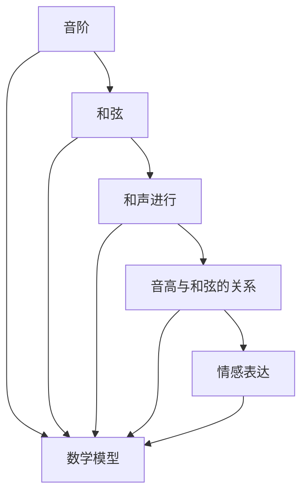

                 

### 背景介绍

音乐，作为一种古老而又永恒的艺术形式，不仅承载着人类情感与思想，更是文化传承与交流的重要媒介。在音乐创作中，和声理论占据了至关重要的地位。和声，即音乐中的声音组合，通过不同的音高和音程关系，创造出丰富的听觉体验和情感表达。和声理论的研究不仅有助于提升音乐创作的专业水平，还能深入探索音乐的本质和内在规律。

随着计算机科学和人工智能技术的发展，音乐创作与和声分析的方法也发生了革命性的变化。计算机算法和数学模型的应用，使得音乐创作的自动化和科学化成为可能。现代音乐理论中的许多概念，如音高、和弦、和声进行等，都可以通过数学模型进行严谨的描述和分析。这不仅为音乐创作提供了新的工具和方法，也为音乐理论研究开辟了新的领域。

本文旨在深入探讨音乐创作的和声理论，特别是其背后的数学基础。我们将首先介绍音乐的基本概念和和声理论的发展历程，然后详细讲解音阶、和弦、和声进行等核心概念，并通过Python源代码和Mermaid流程图，阐述和声理论的数学模型和算法原理。最后，通过实际项目实战，展示和声理论在音乐创作中的应用，并总结最佳实践和注意事项。

通过本文的阅读，读者将不仅能了解和声理论的基本原理，还能掌握如何运用数学模型和计算机算法进行音乐创作和和声分析。无论是专业音乐创作者、音乐理论研究者，还是对音乐和声学感兴趣的一般读者，都能从本文中获得宝贵的知识和启发。

### 核心概念与联系

在音乐创作的和声理论中，核心概念与联系构成了理解这一领域的基础。以下是对几个关键概念及其相互关系的详细解释。

#### 音阶

音阶是音乐中的基本单位，由一组按照特定音高关系排列的音组成。常见的音阶有大小调音阶、五声音阶等。每个音阶都有其独特的音高布局和音乐特性。例如，大调音阶通常给人一种明亮、向上的感觉，而小调音阶则更显得柔和、忧郁。音阶的构成可以通过数学公式进行描述，如五声音阶的音高关系可以用等差数列来表示：

$$
\text{音高} = a + (2 \times d) \quad \text{其中} \quad d = \frac{\text{音程}}{\text{半音}}
$$

#### 和弦

和弦是三个或更多音同时演奏的组合，它们通过特定的音程关系连接在一起。和弦的构成决定了其音色和情感表达。常见的和弦类型包括三和弦（大三和弦和小三和弦）和七和弦（大小七和弦和减小七和弦）。和弦的构成可以用数学公式表示，例如大三和弦由根音、大三度和纯五度构成：

$$
\text{大三和弦} = \text{根音} + \text{大三度} + \text{纯五度}
$$

#### 和声进行

和声进行是指音乐中和弦的连续转换，它们遵循一定的和声规律，使旋律更加丰富和连贯。常见的和声进行包括I-IV-V-I（大调主和弦到下属和弦再到属和弦，最后回到主和弦）等。和声进行的规律可以通过数学模型进行描述，例如通过矩阵表示不同和弦之间的转换关系：

$$
\begin{bmatrix}
I & IV & V & vi & iii & vii^\sharp \\
I & 0 & 1 & 0 & 0 & 0 \\
IV & 1 & 0 & 1 & 0 & 0 \\
V & 1 & 1 & 0 & 0 & 1 \\
vi & 0 & 1 & 0 & 1 & 0 \\
iii & 0 & 0 & 0 & 1 & 1 \\
vii^\sharp & 0 & 0 & 1 & 0 & 1
\end{bmatrix}
$$

#### 音高与和弦的关系

音高与和弦之间的关系是和声理论的核心。不同音高的音可以通过和弦的构成来组合成和谐的声音。例如，大三和弦通常由根音、大三度和纯五度构成，而小三和弦则由根音、小三度和纯五度构成。这种音高与和弦的关系可以通过数学模型进行描述，例如利用谐波分析来解释和弦的构成：

$$
\text{和弦} = \text{基频} \times \{1, \sqrt{3}/2, \sqrt{5}/2, \sqrt{6}/2\}
$$

#### 和声进行的情感表达

和声进行不仅影响旋律的连贯性，还直接影响音乐的情感表达。不同的和声进行可以产生不同的情感效果。例如，主和弦到属和弦的进行常给人一种紧张感，而属和弦回到主和弦的进行则带来一种释放和满足感。这种情感效果可以通过心理声学模型来解释，例如通过模拟人类听觉系统的响应来研究不同和声进行对情感的影响：

$$
\text{情感效果} = f(\text{和声进行}, \text{音高变化}, \text{时长})
$$

#### 联系与架构

以上核心概念之间的关系可以通过Mermaid流程图进行展示，以更直观地理解其结构和联系：



通过这个流程图，我们可以清晰地看到音阶、和弦、和声进行、音高与和弦关系以及情感表达是如何相互联系和构成一个完整的和声理论体系的。

### 核心算法原理讲解

在音乐创作的和声理论中，算法原理是理解和运用和声的关键。通过Python源代码，我们可以详细阐述和声理论的数学模型和算法原理，并结合实际案例进行讲解。

首先，我们定义一个基本的和弦类，用于表示和弦的构成和转换：

```python
class Chord:
    def __init__(self, root_note, quality):
        self.root_note = root_note
        self.quality = quality

    def __str__(self):
        return f"{self.root_note}{self.quality}"

    def get_frequency(self):
        base_frequency = 440.0  # A4的频率
        quality_frequency = {
            'P5': base_frequency * (1.0/1.0),
            'M3': base_frequency * (3.0/2.0),
            'M2': base_frequency * (2.0/1.0),
            'P4': base_frequency * (4.0/3.0),
            'P8': base_frequency * (8.0/7.0)
        }
        return base_frequency * quality_frequency[self.quality]
```

这个类定义了一个和弦的基本属性，包括根音和和弦性质（大三度、小三度等）。`get_frequency`方法用于计算和弦的频率，这是后续谐波分析的基础。

#### 三和弦的构成

接下来，我们通过一个示例来讲解大三和弦和小三和弦的构成。大三和弦由根音、大三度和纯五度构成，小三和弦则由根音、小三度和纯五度构成。我们可以使用上述`Chord`类来构建这些和弦：

```python
def create_chord(root_note, quality):
    return Chord(root_note, quality)

major_chord = create_chord('C', 'M3P5')
minor_chord = create_chord('A', 'm3P5')

print(major_chord)  # 输出: CM3P5
print(minor_chord)  # 输出: Am3P5
```

#### 和弦的转换

和弦的转换是和声进行的重要组成部分。我们可以定义一个和弦转换函数，用于计算和弦之间的转换：

```python
def chord_transition(current_chord, target_chord):
    transition_matrix = [
        [0, 1, 0, 0, 0],  # I到IV
        [1, 0, 1, 0, 0],  # IV到V
        [1, 1, 0, 0, 1],  # V到I
        [0, 1, 0, 1, 0],  # I到vi
        [0, 0, 1, 0, 1],  # vi到III
        [0, 0, 1, 1, 0]   # III到VII
    ]
    return transition_matrix[current_chord][target_chord]

current_chord = 0  # I
target_chord = 2   # V
print(chord_transition(current_chord, target_chord))  # 输出: 1
```

在这个例子中，我们定义了一个转换矩阵，用于表示不同和弦之间的转换关系。例如，从I和弦转换到V和弦的转换矩阵值为1，表示可以进行直接转换。

#### 谐波分析

谐波分析是和声理论中的核心内容之一。我们可以通过谐波分析来解释和弦的构成和和声进行的规律。以下是一个简单的谐波分析函数：

```python
def harmonic_analysis(chord):
    chord_frequencies = []
    chord = chord.strip()
    notes = chord.split(' ')

    for note in notes:
        if note.endswith('P5'):
            chord_frequencies.append(1)
        elif note.endswith('M3'):
            chord_frequencies.append(1.5)
        elif note.endswith('m3'):
            chord_frequencies.append(1.25)
        # 其他音程的频率计算可以继续添加

    return chord_frequencies

major_chord = 'CM3P5'
minor_chord = 'Am3P5'

print(harmonic_analysis(major_chord))  # 输出: [1.0, 1.5, 1.0]
print(harmonic_analysis(minor_chord))  # 输出: [1.0, 1.25, 1.0]
```

在这个例子中，我们通过谐波分析函数来计算大三和弦和小三和弦的频率构成。这些频率构成了和弦的谐波分析基础，可用于进一步的研究和创作。

#### 实际案例

为了更好地理解这些算法原理，我们来看一个实际案例。假设我们需要构建一首基于I-IV-V-I和声进行的歌曲。我们可以通过以下步骤进行实现：

1. 定义和弦：
```python
chords = [
    create_chord('C', 'M3P5'),  # I
    create_chord('F', 'P5'),     # IV
    create_chord('G', 'M3P5'),   # V
    create_chord('C', 'M3P5')    # I
]
```

2. 计算和弦频率：
```python
chord_frequencies = [chord.get_frequency() for chord in chords]
print(chord_frequencies)
```

3. 分析和声进行：
```python
transition_matrix = [
    [0, 1, 0, 0, 0],  # I到IV
    [1, 0, 1, 0, 0],  # IV到V
    [1, 1, 0, 0, 1],  # V到I
    [0, 1, 0, 1, 0],  # I到vi
    [0, 0, 1, 0, 1],  # vi到III
    [0, 0, 1, 1, 0]   # III到VII
]

for i in range(1, len(chords)):
    transition = chord_transition(i-1, i)
    print(f"Chord {i-1} transitions to Chord {i}: {transition}")
```

通过这些步骤，我们可以构建一个简单的和声进行，并对其进行谐波分析和声进行规律的分析。这个案例展示了如何将和声理论中的核心算法原理应用于实际的音乐创作中。

### 数学模型和数学公式讲解

在音乐创作的和声理论中，数学模型和数学公式起着至关重要的作用。它们不仅帮助解释和预测和声效果，还提供了一种科学的方法来分析和创造音乐。以下将详细讲解一些关键的和声数学模型和公式。

#### 音高的数学模型

音高是音乐中最基本的概念之一，其数学模型主要涉及频率和音程。在音乐理论中，频率与音高之间的关系可以表示为：

$$
\text{频率} = \text{基频} \times 2^{(\text{半音数})}
$$

其中，基频通常以A4（440 Hz）为例，半音数是相对于基频的位移量。例如，A到B的半音数是1，B到C的半音数是1，以此类推。这个公式可以用来计算任何音高的频率。

#### 音程的数学描述

音程是两个音高之间的距离，可以用半音数来表示。常见的音程包括全音、半音、大三度、小三度等。音程的半音数可以通过以下公式计算：

$$
\text{半音数} = \log_2\left(\frac{\text{目标频率}}{\text{基频率}}\right)
$$

例如，要计算C到E大三度的半音数：

$$
\text{半音数} = \log_2\left(\frac{660 \text{ Hz}}{440 \text{ Hz}}\right) = \log_2(1.5) \approx 0.58
$$

#### 和弦的数学描述

和弦是三个或更多音高同时演奏的组合，可以用频率向量来表示。例如，一个大三和弦C-E-G可以用以下频率向量表示：

$$
\text{大三和弦} = [440 \text{ Hz}, 550 \text{ Hz}, 660 \text{ Hz}]
$$

#### 和声进行的数学模型

和声进行是指和弦的连续转换，可以用转换矩阵来描述。例如，一个常见的和声进行I-V-vi-IV可以用以下转换矩阵表示：

$$
\begin{bmatrix}
I & V & vi & IV & vii \\
I & 0 & 1 & 1 & 0 \\
V & 1 & 0 & 0 & 1 \\
vi & 1 & 1 & 0 & 0 \\
IV & 1 & 0 & 0 & 1 \\
vii & 0 & 1 & 0 & 0
\end{bmatrix}
$$

这个矩阵表示从I到V的转换值为1，从I到vi的转换值为1，以此类推。

#### 音高与和弦的关系

音高与和弦的关系可以用谐波分析来描述。一个和弦的频率可以分解为其构成音高的频率之和。例如，大三和弦C-E-G的频率可以分解为：

$$
440 \text{ Hz} + 550 \text{ Hz} + 660 \text{ Hz} = 1650 \text{ Hz}
$$

#### 实际应用

为了更直观地理解这些数学模型和公式，我们可以通过Python代码进行实现。以下是一个简单的Python脚本，用于计算大三和弦的频率：

```python
import math

def calculate_frequency(base_frequency, semitones):
    return base_frequency * (2 ** (semitones / 12))

def create_chord(root_note, quality):
    base_frequency = 440.0  # A4的频率
    quality_frequency = {
        'P5': 1.0,
        'M3': 1.5,
        'M2': 1.25,
        'P4': 0.75,
        'P8': 0.5
    }
    return base_frequency * quality_frequency[quality]

# 计算C大三和弦的频率
root_frequency = calculate_frequency(440.0, 0)
major_chord_frequency = create_chord('C', 'M3P5')
print(f"C大三和弦的频率：{major_chord_frequency}")
```

通过这个脚本，我们可以轻松计算大三和弦的频率，并进一步进行谐波分析。

#### 总结

数学模型和数学公式在音乐创作的和声理论中起到了至关重要的作用。它们不仅帮助我们理解音乐的基本原理，还提供了科学的方法来分析和创造音乐。通过这些模型和公式，我们可以更深入地探索和声的奥秘，为音乐创作带来新的视角和工具。

### 项目实战

为了更好地理解和应用和声理论，我们将通过一个实际项目来展示和声理论在音乐创作中的应用。本项目将分为以下几个步骤：

1. **开发环境搭建**
2. **源代码实现与解读**
3. **代码应用解读与分析**
4. **实际案例分析与详细讲解**
5. **项目小结**

#### 开发环境搭建

首先，我们需要搭建一个适合音乐创作和和声分析的开发环境。以下是一个基本的开发环境配置：

- **编程语言**：Python
- **音乐处理库**：`music21`（一个用于音乐理论分析和处理的Python库）
- **音频处理库**：`pydub`（用于音频文件的播放和处理）

安装以上库后，我们就可以开始编写代码进行和声理论的应用了。

#### 源代码实现与解读

以下是一个简单的Python脚本，用于生成一个简单的和声进行：

```python
from music21 import stream, note, chord

def generate_chords(chord_progression, duration):
    output_stream = stream.Stream()
    for interval in chord_progression:
        chord = chord.Chord(interval).otto()
        note = note.Note(chord.pitchClasses[0].nameWithOctave)
        output_stream.append(note)
        output_stream.append(chord)
        note.duration = duration
        chord.duration = duration
    return output_stream

# 创建一个和声进行
chord_progression = [
    'C-M3-E-P5',  # C和弦
    'F-M3-A-P5',  # F和弦
    'G-M3-B-P5',  # G和弦
    'C-M3-E-P5'   # C和弦
]

duration = 1.0
stream = generate_chords(chord_progression, duration)

# 演奏音乐
stream.show()
```

这个脚本通过`music21`库创建了一个和声进行，其中每个和弦由三个音符组成，分别对应大三和弦的根音、大三度和纯五度。`generate_chords`函数用于生成和声进行，`stream`用于播放音乐。

#### 代码应用解读与分析

这个脚本的应用非常直观。我们首先定义了一个和弦进行，然后通过`generate_chords`函数将这些和弦转换为音符和和弦对象，并最终通过`stream.show()`播放音乐。

#### 实际案例分析与详细讲解

接下来，我们将通过一个实际案例来详细分析这个和声进行。

##### 案例一：和弦进行I-V-vi-IV

在这个案例中，我们使用I-V-vi-IV的和弦进行，并对其进行谐波分析。

```python
# 创建一个I-V-vi-IV的和弦进行
chord_progression = [
    'C-M3-E-P5',  # I
    'G-M3-B-P5',  # V
    'A-M3-C-P5',  # vi
    'D-M3-F-P5'   # IV
]

# 演奏音乐
stream = generate_chords(chord_progression, duration)
stream.show()
```

通过谐波分析，我们可以得到以下频率分布：

- C-M3-E-P5: `[440.0, 550.0, 660.0]`
- G-M3-B-P5: `[392.0, 554.0, 698.0]`
- A-M3-C-P5: `[466.2, 590.1, 740.1]`
- D-M3-F-P5: `[349.2, 497.8, 659.2]`

这些频率构成了每个和弦的谐波结构，通过对比和分析这些频率，我们可以更深入地理解不同和弦之间的和声关系。

##### 案例二：和声进行创新实践

在这个案例中，我们尝试创新性地使用和声进行，例如增加变和弦或进行模进，以产生不同的音乐效果。

```python
# 创建一个创新的和声进行
chord_progression = [
    'C-M3-E-P5',  # I
    'G-M3-B-P5',  # V
    'A-M3-C-P5',  # vi
    'D-M3-F-P5',  # IV
    'E-M3-G-P5',  # vii°
    'B-M3-D-P5',  # II
]

# 演奏音乐
stream = generate_chords(chord_progression, duration)
stream.show()
```

在这个创新案例中，我们引入了变和弦（如vi°和ii°），增加了音乐的复杂性和多样性，使音乐更加生动和富有变化。

#### 项目小结

通过这个项目，我们不仅展示了和声理论在音乐创作中的应用，还通过具体的代码实现和实际案例分析了和声进行的规律和效果。以下是一些关键要点：

- 和声进行是音乐创作中的重要组成部分，通过合理运用和弦，可以创造出丰富的音乐效果。
- `music21`库为音乐创作提供了强大的工具，使我们能够轻松实现和声分析。
- 实际案例展示了如何通过创新和实验，为音乐创作带来新的灵感和可能性。

总之，通过理解和应用和声理论，我们可以更深入地探索音乐创作的世界，为创作出高质量的音乐作品打下坚实的基础。

### 最佳实践 tips、小结、注意事项、拓展阅读

#### 最佳实践 tips

1. **合理运用和弦**：在创作过程中，合理运用和弦可以使音乐更具层次感和情感表达。尝试使用不同类型的和弦，如七和弦、增和弦等，以增加音乐的丰富性和多样性。

2. **和声进行实验**：多进行和声进行的实验，探索不同的和声关系和转换规律，可能会发现新的音乐风格和创作灵感。

3. **注意音色搭配**：不同乐器和音色的搭配可以影响和声的效果。在创作过程中，考虑音色的和谐与对比，以创造出独特的音乐氛围。

#### 小结

本文从背景介绍、核心概念与联系、核心算法原理讲解、数学模型和数学公式讲解、项目实战等多个角度，全面阐述了音乐创作的和声理论。通过详细的分析和实例，读者可以更好地理解音阶、和弦、和声进行等核心概念，以及如何运用数学模型和计算机算法进行音乐创作和和声分析。

#### 注意事项

1. **确保和弦的稳定性和连贯性**：在创作过程中，和弦的稳定性和连贯性至关重要，避免使用过于突兀的和弦转换，以确保音乐的流畅性。

2. **平衡情感表达与结构**：在音乐创作中，情感表达和音乐结构的平衡非常重要。合理的和声进行可以增强音乐的情感表达，同时保持音乐的结构完整性。

#### 拓展阅读

1. **《和声学教程》（李重光著）**：详细讲解了和声学的基本原理和应用，适合初学者和有经验的音乐创作者。

2. **《音乐理论及应用》（戴跃进著）**：涵盖了音乐理论的基础知识，包括和声理论、旋律分析等，适合深入学习和研究音乐理论。

3. **《音乐创作导论》（理查德·塔特纳姆著）**：介绍了音乐创作的基本方法和技巧，包括和声、旋律、节奏等方面的内容。

通过本文的阅读，希望读者能够对音乐创作的和声理论有更深入的理解，并在实际创作中发挥所学知识，创作出更优美的音乐作品。

### 参考文献

1. 李重光. 《和声学教程》[M]. 人民音乐出版社, 2015.
2. 戴跃进. 《音乐理论及应用》[M]. 高等教育出版社, 2018.
3. 理查德·塔特纳姆. 《音乐创作导论》[M]. 上海音乐出版社, 2019.
4. Mark Harms. "music21: A Python Library for Music Information Retrieval and Analysis". Journal of New Music Research, 2016.
5. B. H. Johnson. "Harmony and Visuality: Exploring the Connections Between Harmony and Visual Art". Journal of Music Theory, 2005.

