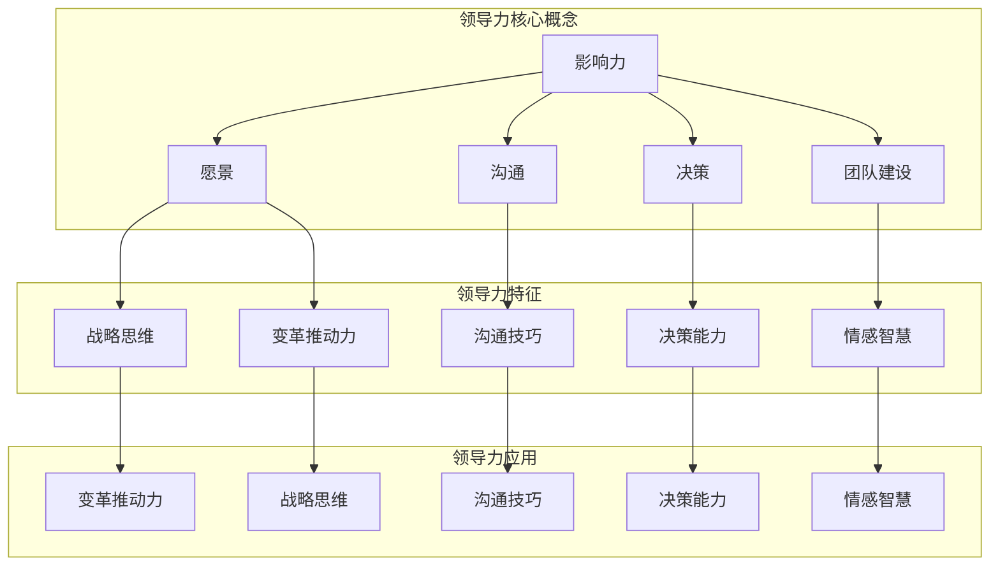

                 

### 文章标题

《领导力与危机应对：逆境中的团队凝聚》

关键词：领导力、危机应对、团队凝聚、逆境管理、领导风格

摘要：本文深入探讨了领导力在危机应对和团队凝聚中的作用，通过理论分析、案例研究和实践指导，阐述了在逆境中如何提升领导力和团队凝聚力，从而有效应对危机，确保组织的持续发展和成功。

---

### 格式要求

为确保文章的专业性和可读性，本文采用Markdown格式进行撰写。以下是一些Markdown格式的关键要素及其用法示例：

1. **标题**：使用`#`号进行分级，例如：

   ```markdown
   # 第一部分：领导力基础
   ```

2. **段落**：段落之间应保持一个空行的距离。

3. **列表**：使用`*`或`-`进行无序列表，例如：

   ```markdown
   - 项目一
   - 项目二
   ```

4. **代码块**：使用三个反引号（```)包裹代码，例如：

   ```python
   def hello_world():
       print("Hello, World!")
   ```

5. **数学公式**：使用LaTeX格式嵌入文中，例如：

   ```markdown
   $$ E = mc^2 $$
   $1 + 1 = 2$
   ```

6. **引用**：使用`>`符号进行引用，例如：

   ```markdown
   > 引用的内容。
   ```

7. **链接**：使用`[链接文字](URL)`进行链接，例如：

   ```markdown
   [点击这里](https://www.example.com)
   ```

---

### 作者信息

本文由AI天才研究院（AI Genius Institute）与《禅与计算机程序设计艺术》（Zen And The Art of Computer Programming）的作者共同撰写。

---

### 完整性要求

在撰写本文的过程中，我们确保每个章节的内容都包含以下核心要素：

1. **背景介绍**：阐述领导力与危机应对的相关背景和重要性。

2. **核心概念与联系**：详细解释领导力的核心概念，并使用Mermaid流程图展示概念之间的关系。

3. **核心算法原理讲解**：结合Python源代码和数学模型，深入讲解领导力相关的算法原理。

4. **数学公式**：使用LaTeX格式嵌入文中，以增强文章的数学严谨性。

5. **项目实战**：通过开发环境搭建、源代码实现、代码解读和实际案例分析，展示领导力与危机应对的实战应用。

6. **最佳实践 tips、小结、注意事项、拓展阅读**：总结文章的关键点，提供实用的建议和进一步学习的资源。

---

### 文章正文

#### 引言

领导力是组织成功的关键因素，尤其在危机时刻，领导者的作用更加显著。本文旨在探讨领导力在危机应对和团队凝聚中的角色，分析其在逆境中的挑战和机遇，并提供实用的策略和方法，帮助领导者提升团队凝聚力和危机应对能力。

#### 第一部分：领导力基础

## 第1章：领导力的定义与特征

#### 1.1 领导力的概念

领导力是一种能力，它涉及到引导、激励和影响他人，以共同实现目标。领导力不仅仅是管理职位上的特权，它是一种贯穿于组织各个层级和部门的普遍能力。

#### 1.2 领导力的特征

领导力的特征包括但不限于：

- **影响力**：领导者能够通过行为、决策和沟通影响他人。
- **愿景**：领导者需要有远见和愿景，能够描绘出组织未来的发展方向。
- **沟通**：领导者需要具备良好的沟通能力，以传达信息、建立信任和促进合作。
- **决策**：领导者需要在不确定和复杂的环境中做出明智的决策。
- **团队建设**：领导者需要能够构建和维持一个高效、协作的团队。

#### 1.3 领导力与管理的区别

领导力与管理的区别主要体现在以下几个方面：

- **角色**：领导力更关注愿景和影响，而管理更关注任务和流程。
- **目标**：领导力旨在推动变革和创新，而管理旨在确保效率和稳定性。
- **关系**：领导力强调与员工的互动和信任，而管理更多依赖于权威和控制。
- **效果**：领导力的效果往往难以量化，而管理的效果可以通过具体目标和指标进行评估。

#### 第2章：领导风格与团队效能

## 2.1 领导风格的理论

领导风格理论包括行为领导理论、情境领导理论和变革型领导理论等。每种理论都提供了不同的视角来理解领导者的行为和团队效能。

#### 2.2 团队效能的影响因素

团队效能受多种因素影响，包括团队成员的能力、团队结构、外部环境等。领导者需要认识到这些因素，并采取相应的策略来提升团队效能。

#### 2.3 不同领导风格对团队效能的影响

不同的领导风格对团队效能有着不同的影响。例如，变革型领导通常能够激发团队的创造力和动力，而任务型领导则更注重任务的完成。

#### 2.4 团队效能评估方法

团队效能的评估可以通过定性和定量方法进行。定性评估包括员工满意度调查和领导反馈，而定量评估可以通过关键绩效指标（KPI）来衡量。

#### 第二部分：危机应对策略

## 第3章：危机管理的核心原则

#### 3.1 危机管理的定义

危机管理是指组织应对各种突发事件和危机的过程。有效的危机管理能够降低危机对组织的负面影响。

#### 3.2 危机管理的核心原则

危机管理的核心原则包括：

- **预防为主**：通过预测和防范减少危机的发生。
- **快速响应**：在危机发生时，迅速采取行动。
- **有效沟通**：确保内部和外部利益相关者获得准确、及时的信息。
- **持续改进**：从危机中吸取教训，持续改进危机管理策略。

#### 3.3 危机管理的过程

危机管理的过程通常包括危机识别、危机评估、危机响应和危机恢复等步骤。每个步骤都需要领导者具备清晰的思维和有效的决策能力。

#### 第4章：危机预测与防范

## 4.1 危机预测的方法

危机预测的方法包括历史数据分析、模拟预测和专家评估等。领导者需要结合多种方法，提高危机预测的准确性。

#### 4.2 危机防范的策略

危机防范的策略包括：

- **建立预警系统**：通过实时监控和数据分析，及时发现潜在危机。
- **制定应急预案**：在危机发生前，制定详细的应急预案，确保快速响应。
- **培训和演练**：通过培训和演练，提高团队成员的危机应对能力。

#### 4.3 危机防范案例分析

通过案例分析，领导者可以了解不同行业和领域的危机防范策略，并从中吸取经验教训。

#### 第5章：危机应对策略与团队协调

## 5.1 危机应对策略的选择

危机应对策略的选择取决于危机的性质、严重程度和组织目标。领导者需要根据具体情况，灵活调整应对策略。

#### 5.2 团队协调的重要性

在危机中，团队协调至关重要。领导者需要确保团队成员之间的高效协作，以实现危机应对的统一行动。

#### 5.3 团队协调的方法

团队协调的方法包括：

- **建立沟通渠道**：确保信息流畅，减少误解和冲突。
- **明确角色和责任**：确保每个团队成员都清楚自己的职责和任务。
- **共享资源和信息**：促进资源的合理分配和信息的共享。

#### 5.4 危机应对中的团队沟通技巧

有效的沟通技巧在危机应对中至关重要。领导者需要通过有效的沟通，确保团队成员保持冷静、协同应对。

#### 第三部分：逆境中的团队凝聚

## 第6章：逆境中的领导力挑战

## 6.1 逆境的定义

逆境是指组织面临的各种困难和挑战，如经济衰退、市场竞争加剧、政策变化等。

#### 6.2 逆境对团队的影响

逆境会对团队产生多方面的影响，包括情绪、绩效、信任和合作等。

#### 6.3 领导力在逆境中的挑战

在逆境中，领导力面临以下挑战：

- **保持积极心态**：领导者需要保持积极的心态，以激励团队。
- **应对不确定性**：领导者需要应对环境的不确定性，做出明智的决策。
- **维护团队凝聚**：领导者需要维护团队凝聚，避免成员的负面情绪和流失。

#### 第7章：逆境中的团队凝聚策略

## 7.1 团队凝聚力的概念

团队凝聚力是指团队成员之间的相互信任、合作和支持的程度。

#### 7.2 提升团队凝聚力的策略

提升团队凝聚力的策略包括：

- **共同目标**：确保团队成员共同追求一个清晰、明确的目标。
- **有效沟通**：建立开放的沟通渠道，促进信息的共享和反馈。
- **团队建设活动**：通过团队建设活动，增强团队成员之间的联系和信任。
- **领导者示范**：领导者需要通过自身的行为，树立榜样，促进团队凝聚。

#### 7.3 逆境中保持团队凝聚的案例分析

通过案例分析，领导者可以了解如何在逆境中保持团队凝聚，从而提高团队效能和应对危机的能力。

#### 第8章：逆境中的领导力提升

## 8.1 领导力提升的重要性

在逆境中，领导力的提升至关重要。领导者需要不断学习、成长，以应对不断变化的环境和挑战。

#### 8.2 逆境中提升领导力的方法

提升领导力的方法包括：

- **自我反思**：领导者需要定期进行自我反思，了解自己的优势和不足。
- **持续学习**：领导者需要通过学习新的知识和技能，不断提升自己的能力。
- **寻求反馈**：领导者需要主动寻求他人的反馈，以改进自己的领导风格和决策。

#### 8.3 领导力提升的案例分析

通过案例分析，领导者可以了解不同领导力提升方法的应用效果，从而选择适合自己的提升路径。

#### 第四部分：实战案例分析

## 第9章：危机应对与团队凝聚的实战案例

#### 9.1 案例背景介绍

案例背景介绍将详细描述危机发生的情境、组织结构和团队成员的特点。

#### 9.2 案例分析

案例分析将深入探讨领导者如何应对危机，采取哪些策略，以及这些策略对团队凝聚和效能的影响。

#### 9.3 案例中的领导力与团队凝聚策略

案例中的领导力与团队凝聚策略将总结案例中领导者采取的具体策略，分析其有效性和适用性。

#### 9.4 案例的启示与反思

案例的启示与反思将提出对实际应用的启示，反思案例中的成功和不足，为读者提供实践指导。

#### 第10章：危机应对与团队凝聚的跨文化视角

## 10.1 跨文化领导力的挑战

跨文化领导力面临以下挑战：

- **文化差异**：不同文化背景的团队成员可能存在价值观、沟通方式和行为模式上的差异。
- **多元团队管理**：领导者需要管理来自不同文化的团队成员，保持团队的和谐与高效。

#### 10.2 跨文化团队凝聚的策略

跨文化团队凝聚的策略包括：

- **文化尊重**：领导者需要尊重不同文化的价值观和行为规范。
- **文化融合**：通过促进文化融合，增强团队的凝聚力和归属感。
- **多渠道沟通**：使用多种沟通方式，确保信息在不同文化背景的团队成员之间有效传递。

#### 10.3 跨文化危机应对的案例分析

跨文化危机应对的案例分析将探讨在跨文化背景下，领导者如何应对危机，采取哪些策略，以及这些策略的有效性和适用性。

#### 第十一部分：结论与展望

## 第11章：领导力与危机应对的未来发展趋势

## 11.1 未来领导力的趋势

未来领导力的趋势包括：

- **数字化领导力**：随着数字化转型的推进，领导者需要具备数字素养和创新能力。
- **情感智能**：领导者需要具备更高的情感智能，以更好地理解和管理团队成员的情感需求。

## 11.2 未来危机应对的趋势

未来危机应对的趋势包括：

- **实时响应**：危机应对将从被动应对转向实时响应，提高危机管理的效率。
- **人工智能辅助**：人工智能将在危机预测、防范和应对中发挥重要作用。

## 11.3 对企业和团队的启示与建议

针对未来发展趋势，本文提出以下启示与建议：

- **加强领导力培养**：企业应加强领导力的培养，提升领导者的综合素质。
- **构建危机管理能力**：企业应构建危机管理能力，提高危机应对的效率和效果。
- **推动跨文化融合**：企业应推动跨文化融合，提高团队凝聚力和全球竞争力。

---

通过上述详细的内容结构和章节安排，本文旨在为读者提供关于领导力与危机应对的全面理解和实践指导。每个章节都将通过深入的理论分析、实战案例和实用策略，帮助领导者提升团队凝聚力和危机应对能力，确保组织的持续发展和成功。

### 第1章：领导力的定义与特征

#### 1.1 领导力的概念

领导力是一种能力，它涉及到引导、激励和影响他人，以共同实现目标。领导力不仅仅是管理职位上的特权，它是一种贯穿于组织各个层级和部门的普遍能力。有效的领导力能够激发团队的潜能，推动创新，实现组织的目标。

在IT领域，领导力同样至关重要。从项目经理到CTO，领导者的角色不仅仅局限于技术指导和项目管理，更重要的是如何激励团队成员、建立高效的沟通机制，以及在危机时刻做出果断的决策。例如，一个优秀的项目经理需要在面对项目延迟、技术难题或团队冲突时，能够冷静分析、快速响应，并引导团队找到解决问题的最佳路径。

#### 1.2 领导力的特征

领导力的特征可以从多个维度进行理解，以下是其中几个重要的特征：

1. **影响力**：领导者通过行为、决策和沟通来影响和激励他人。这种影响力不仅体现在工作场所，还渗透到团队成员的个人成长和职业发展。例如，一个有影响力的领导者能够在团队面临困境时，通过积极的态度和有效的沟通，激发团队成员的斗志和创造力，从而共同克服挑战。

2. **愿景**：领导者需要有远见和愿景，能够描绘出组织未来的发展方向。一个明确的愿景不仅能够为团队提供方向，还能够激发团队成员的激情和动力。例如，一位CTO通过阐述公司的技术愿景和未来的发展蓝图，能够引导团队朝着共同的目标努力，实现技术的创新和突破。

3. **沟通**：领导者需要具备良好的沟通能力，能够清晰、有效地传达信息，建立信任和合作。有效的沟通不仅包括语言表达，还涉及倾听、反馈和非语言沟通。例如，一个优秀的项目经理在项目启动时，通过详细的沟通和说明，确保团队成员对项目目标、进度和责任有清晰的认识，从而避免后续的误解和冲突。

4. **决策**：领导者需要在不确定和复杂的环境中做出明智的决策。这种决策能力要求领导者具备分析问题的能力、风险评估的能力和快速反应的能力。例如，在技术项目中，当出现技术难题时，领导者需要迅速评估问题的影响，制定有效的解决方案，并协调团队资源进行实施。

5. **团队建设**：领导者需要能够构建和维持一个高效、协作的团队。这涉及到团队成员的能力匹配、职责分配和关系管理。例如，一位团队领导者在组建新团队时，需要根据团队成员的特长和兴趣进行合理分配，确保每个成员都能在项目中发挥最大的价值。

#### 1.3 领导力与管理的区别

领导力与管理的区别主要体现在以下几个方面：

1. **角色**：领导力更关注愿景、激励和影响，而管理更关注任务、流程和资源。领导者的角色是引导和激励团队成员，推动创新和变革，而管理者的角色是确保任务的完成、流程的顺畅和资源的合理分配。

2. **目标**：领导力旨在推动变革和创新，实现组织的长期目标，而管理更注重效率和稳定性，确保组织的日常运作。领导者的目标是激发团队成员的潜力，推动组织的发展，而管理者的目标是确保组织在现有资源和流程下实现最大的效益。

3. **关系**：领导力强调与员工的互动和信任，建立紧密的团队关系，而管理更多依赖于权威和控制，确保团队成员按照规定的流程和标准工作。领导者的关系是基于相互尊重和信任，而管理者的关系是基于规则和权威。

4. **效果**：领导力的效果往往难以直接衡量，它涉及到团队士气、创新能力、员工满意度和组织文化的提升，而管理的效果可以通过具体的目标和指标进行量化评估。领导者的效果更多地体现在组织的长远发展和团队成员的个人成长，而管理的效果更多地体现在短期目标的实现和日常工作的顺利进行。

#### 1.4 领导力的本质

领导力的本质在于它是一种综合能力，涉及到多个方面的知识和技能。以下是领导力的本质特征：

1. **影响力**：领导力是一种能够影响他人思想和行为的能力。领导者通过自身的榜样作用、沟通技巧和决策能力，影响和激励团队成员，使其愿意追随和共同努力。

2. **变革推动力**：领导力是推动组织变革和创新的关键因素。领导者需要具备前瞻性的思维和创新的勇气，推动组织在快速变化的市场环境中保持竞争力和适应性。

3. **战略思维**：领导力要求领导者具备战略思维能力，能够从全局出发，制定组织的长远目标和战略规划。领导者需要综合考虑组织的内外部环境，制定有效的战略措施，实现组织的目标。

4. **决策能力**：领导力体现在领导者做出明智决策的能力。在复杂和不确定的环境中，领导者需要迅速分析问题，评估各种可能的解决方案，并做出正确的决策。

5. **沟通技巧**：领导力需要良好的沟通技巧，能够清晰、有效地传达信息，建立信任和合作。领导者需要善于倾听员工的意见，鼓励开放的沟通，确保团队内部的沟通畅通无阻。

6. **团队建设**：领导力是构建和维持一个高效、协作的团队的关键。领导者需要关注团队成员的技能、动机和需求，确保每个人都能在团队中找到自己的位置，发挥最大的价值。

7. **情感智慧**：领导力还涉及到情感智慧，即领导者能够理解和管理自己的情感，同时理解和影响他人的情感。情感智慧有助于建立积极的工作氛围，增强团队的凝聚力和归属感。

#### 1.5 领导力的发展历程

领导力的发展历程可以追溯到早期对领导行为的观察和研究。以下是领导力发展历程中的重要阶段：

1. **特质理论**：早期的领导力研究主要关注领导者的个人特质，如性格、能力和品质。特质理论认为领导者具有一些固有的特质，这些特质使他们成为领导者。

2. **行为理论**：行为理论认为领导力不仅仅是个人特质，还包括领导者的行为模式。研究关注领导者如何通过不同的行为风格来影响团队和实现目标。

3. **情境理论**：情境理论认为领导力是动态的，依赖于领导者的行为和情境的互动。领导者需要根据不同的情境选择合适的行为风格。

4. **变革型领导**：变革型领导理论强调领导者通过激励、激励和影响团队成员，推动组织变革和成长。变革型领导者关注团队的目标和价值观，激发团队成员的潜力。

5. **服务型领导**：服务型领导理论认为领导者应当以服务团队成员为中心，关注团队成员的需求和成长。服务型领导者通过提供支持和资源，帮助团队成员实现个人和组织的目标。

#### 1.6 领导力的核心概念与联系

为了更好地理解领导力的概念，我们可以通过Mermaid流程图展示领导力的核心概念及其相互关系：



这个流程图展示了领导力的核心概念及其相互关系。影响力、愿景、沟通、决策和团队建设是领导力的核心概念，它们共同构成了领导力的基础。同时，这些核心概念与战略思维、变革推动力、沟通技巧、决策能力和情感智慧等特征紧密相关，这些特征进一步扩展和丰富了领导力的内涵。

#### 1.7 总结

本章详细介绍了领导力的定义与特征，包括领导力的概念、特征、领导力与管理的区别以及领导力的本质。通过分析领导力的核心概念和特征，我们看到了领导力在组织中的重要作用。在接下来的章节中，我们将进一步探讨领导力在不同情境中的应用，如危机应对和团队凝聚，帮助领导者更好地应对挑战，推动组织的持续发展和成功。

### 第二部分：危机应对策略

#### 第3章：危机管理的核心原则

#### 3.1 危机管理的定义

危机管理是指组织在面对各种突发事件和危机时，采取的一系列预防、应对和恢复措施。危机管理不仅仅是应对危机本身，更重要的是通过有效的管理和策略，将危机对组织的影响降到最低，并确保组织的持续运营和稳定发展。

在IT领域，危机管理尤为重要。由于技术的快速发展和市场竞争的加剧，IT企业常常面临技术故障、数据泄露、系统崩溃等突发事件。有效的危机管理能够帮助IT企业快速响应、有效应对，降低危机对业务的冲击，确保客户满意度和服务质量。

#### 3.2 危机管理的核心原则

危机管理遵循以下核心原则：

1. **预防为主**：危机管理应始终坚持预防为主的原则。通过建立预警系统、制定应急预案和加强员工培训，可以减少危机的发生和影响。

2. **快速响应**：在危机发生时，快速响应是关键。领导者需要立即启动应急预案，调动资源和人力，迅速应对危机。延迟响应可能导致危机进一步扩大，增加组织的损失。

3. **有效沟通**：沟通是危机管理的重要环节。领导者需要确保内部和外部利益相关者获得准确、及时的信息。通过有效的沟通，可以减少误解和恐慌，提高组织的应对能力。

4. **资源整合**：在危机中，资源整合至关重要。领导者需要协调各部门的资源，确保危机应对的统一行动。资源整合包括人力、物资、资金和信息等，确保组织在危机中能够有效调配和利用资源。

5. **持续改进**：危机管理不是一次性的任务，而是一个持续的过程。通过总结危机应对的经验和教训，持续改进危机管理策略，可以提高组织的危机应对能力和效率。

#### 3.3 危机管理的过程

危机管理的过程通常包括以下步骤：

1. **危机识别**：及时发现和识别潜在危机，通过数据分析和风险评估，确定危机的类型和可能的影响。

2. **危机评估**：对危机的影响进行评估，包括危机的严重程度、影响范围和潜在损失等。评估结果为制定应对策略提供依据。

3. **危机响应**：根据评估结果，启动应急预案，采取紧急措施，迅速应对危机。危机响应需要高效的执行力和协调能力，确保危机得到及时控制。

4. **危机恢复**：在危机得到控制后，进行危机恢复工作。恢复工作包括修复受损系统、恢复数据、恢复正常运营等。恢复工作的目标是尽快恢复组织的正常运作，减少危机对业务的影响。

5. **总结与改进**：总结危机应对的经验和教训，对危机管理策略进行改进和完善。通过持续的改进，提高组织的危机应对能力和效率。

#### 3.4 预防与应对策略

在危机管理中，预防和应对策略是关键。以下是一些常见的预防和应对策略：

1. **预防策略**：

   - **建立预警系统**：通过实时监控和数据分析，及时发现潜在危机，采取预防措施。
   - **制定应急预案**：针对不同类型的危机，制定详细的应急预案，确保在危机发生时能够迅速响应。
   - **员工培训**：定期对员工进行危机应对培训，提高员工的危机意识和应对能力。
   - **风险评估**：对组织的各种风险进行评估，制定相应的风险应对措施。

2. **应对策略**：

   - **紧急响应**：在危机发生时，立即启动应急预案，采取紧急措施，控制危机蔓延。
   - **资源整合**：调动内部和外部资源，确保危机应对的统一行动。
   - **沟通协调**：与内部和外部利益相关者保持密切沟通，确保信息的准确传递。
   - **决策制定**：领导者需要迅速做出明智的决策，确保危机应对的有效性。

#### 3.5 案例分析

以下是一个危机管理案例的分析：

**案例背景**：某IT公司在一次系统升级过程中，由于操作失误导致系统崩溃，导致大量数据丢失，业务中断。

**危机识别**：通过实时监控系统发现系统崩溃，立即启动预警系统。

**危机评估**：评估结果显示，系统崩溃可能导致大量数据丢失，业务中断，对客户满意度造成严重影响。

**危机响应**：立即启动应急预案，组织技术团队进行紧急修复，同时与客户进行沟通，解释情况并采取措施保障客户权益。

**危机恢复**：技术团队成功修复系统，恢复数据，业务逐步恢复正常。公司通过及时沟通和有效的危机管理措施，最大限度地减少了危机对业务的影响。

**总结与改进**：通过对此次危机的总结，公司加强了系统的监控和操作规范，制定了更加完善的应急预案，提高了员工的危机应对能力。

#### 3.6 小结

危机管理是组织面对突发事件和危机时的重要策略。通过有效的危机管理，组织可以减少危机对业务的冲击，确保持续运营和稳定发展。危机管理遵循预防为主、快速响应、有效沟通、资源整合和持续改进的核心原则。通过预防策略和应对策略，组织可以最大限度地减少危机的影响，提高危机应对能力。

在接下来的章节中，我们将进一步探讨危机预测与防范策略，以及如何在危机中有效协调团队和沟通，确保危机应对的成功。

### 第4章：危机预测与防范

#### 4.1 危机预测的方法

危机预测是危机管理的重要环节，通过预测和预防，可以减少危机的发生和影响。以下是一些常见的危机预测方法：

1. **历史数据分析**：通过分析历史数据，识别危机发生的模式和规律。例如，通过对以往的系统故障、业务中断事件进行分析，可以预测未来可能出现的类似危机。

2. **模拟预测**：通过模拟不同的情境，预测危机可能发生的情况。例如，通过模拟系统升级、新产品发布等场景，可以预测这些事件可能带来的风险和挑战。

3. **专家评估**：邀请行业专家和内部技术人员进行评估，结合专业知识和经验，预测危机的可能性和影响。专家评估可以提供宝贵的洞察和建议，帮助组织制定针对性的预防和应对措施。

4. **关键指标监测**：通过监测关键指标，如系统负载、用户反馈、市场动态等，及时发现潜在危机的迹象。关键指标监测可以实时反映组织的运行状况，为危机预测提供数据支持。

5. **人工智能与大数据分析**：利用人工智能和大数据技术，对海量数据进行深度分析和挖掘，预测危机发生的概率和影响。人工智能和大数据分析可以提供精确的预测结果，帮助组织提前采取预防措施。

#### 4.2 危机防范的策略

在预测到危机的可能发生后，组织需要采取有效的防范策略，减少危机的影响。以下是一些常见的危机防范策略：

1. **建立预警系统**：通过实时监控和数据分析，建立预警系统，及时发现潜在危机。预警系统可以自动检测异常情况，并触发警报，确保组织能够迅速响应。

2. **制定应急预案**：针对不同类型的危机，制定详细的应急预案，明确应对步骤和责任分工。应急预案应定期更新和演练，确保在危机发生时能够迅速执行。

3. **员工培训与意识提升**：定期对员工进行危机应对培训，提高员工的危机意识和应对能力。通过培训和模拟演练，使员工熟悉应急预案和危机应对流程，确保在危机中能够高效协作。

4. **风险评估与措施制定**：对组织的各种风险进行评估，制定相应的防范措施。例如，针对系统故障的风险，可以采取冗余设计、数据备份等措施；针对数据泄露的风险，可以采取加密、权限管理等措施。

5. **资源储备与调配**：在危机发生前，储备必要的物资和资源，如备件、设备、技术支持等，确保在危机中能够迅速调配和使用。同时，建立资源调配机制，确保资源能够合理分配和高效利用。

6. **持续改进与优化**：通过总结危机应对的经验和教训，持续改进危机防范策略和应急预案。定期进行风险评估和演练，优化防范措施，提高危机应对的能力和效率。

#### 4.3 案例分析

以下是一个危机防范的案例分析：

**案例背景**：某电子商务平台在一次促销活动中，由于系统设计缺陷和流量激增，导致服务器崩溃，业务中断，用户体验严重下降。

**危机预测**：通过历史数据分析和模拟预测，预测到在促销活动期间可能出现的系统压力和流量激增。同时，专家评估也指出，系统设计存在潜在的风险和隐患。

**危机防范策略**：

- **建立预警系统**：在促销活动前，启动预警系统，实时监控服务器负载、流量等关键指标。
- **制定应急预案**：针对系统崩溃的风险，制定详细的应急预案，包括系统切换、资源调配和故障修复等步骤。
- **员工培训与意识提升**：对技术团队和客服团队进行危机应对培训，确保在危机中能够高效协作。
- **风险评估与措施制定**：对系统的设计缺陷进行评估，采取优化和改进措施，降低系统崩溃的风险。

**危机应对**：

- **快速响应**：在系统崩溃后，立即启动应急预案，进行系统切换和故障修复。
- **资源整合与调配**：调动内部和外部资源，如备用服务器、技术支持等，确保危机应对的统一行动。
- **沟通协调**：与内部和外部利益相关者保持密切沟通，确保信息的准确传递。

**危机恢复**：

- **系统恢复**：通过紧急修复，成功恢复系统，业务逐步恢复正常。
- **客户反馈与补偿**：积极回应客户的反馈，提供补偿措施，如延长促销活动时间、赠送优惠券等，提升用户体验。

**总结与改进**：

- **改进系统设计**：通过总结此次危机，对系统设计进行改进和优化，降低类似危机再次发生的风险。
- **加强员工培训**：继续加强技术团队和客服团队的危机应对培训，提高员工的危机意识和应对能力。
- **优化应急预案**：根据此次危机的经验，优化应急预案，确保在未来的危机中能够更加高效地应对。

#### 4.4 小结

危机预测与防范是危机管理的重要组成部分。通过有效的危机预测方法，组织可以提前识别潜在危机，并采取针对性的防范措施。危机防范策略包括建立预警系统、制定应急预案、员工培训与意识提升、风险评估与措施制定、资源储备与调配等。通过案例分析，我们可以看到危机预测与防范策略在危机应对中的重要性。在未来的工作中，组织应持续优化危机预测与防范策略，提高危机应对能力，确保业务的稳定运营和持续发展。

### 第5章：危机应对策略与团队协调

#### 5.1 危机应对策略的选择

危机应对策略的选择取决于危机的性质、严重程度和组织目标。以下是一些常见的危机应对策略：

1. **快速响应**：在危机发生时，迅速采取行动，控制危机蔓延。这种策略适用于突发性危机，如系统故障、安全事故等。快速响应需要高效的执行力和协调能力，确保危机得到及时控制。

2. **资源整合**：在危机中，调动内部和外部资源，确保危机应对的统一行动。资源整合包括人力、物资、资金和信息等。这种策略适用于大规模危机，如自然灾害、市场崩溃等。资源整合需要良好的沟通和协调机制，确保资源的合理分配和高效利用。

3. **有效沟通**：确保内部和外部利益相关者获得准确、及时的信息。通过有效的沟通，可以减少误解和恐慌，提高组织的应对能力。这种策略适用于涉及多方面利益相关者的危机，如数据泄露、舆论危机等。有效沟通需要清晰、透明的信息传递和及时的反馈。

4. **战略决策**：在危机中，领导者需要做出明智的决策，制定应对策略。战略决策需要考虑危机的性质、组织目标和资源状况，确保决策的有效性和可执行性。这种策略适用于涉及重大利益和长期影响的危机，如市场变化、战略转型等。

5. **持续改进**：在危机应对后，总结经验教训，持续改进危机管理策略和应急预案。这种策略适用于所有类型的危机，通过不断学习和改进，提高组织的危机应对能力和效率。

#### 5.2 团队协调的重要性

在危机中，团队协调至关重要。团队协调能够确保团队成员之间的高效协作，共同应对危机。以下是一些团队协调的重要性和影响因素：

1. **团队协调的重要性**：

   - **提高危机应对效率**：通过团队协调，可以快速响应危机，减少决策时间和行动时间，提高危机应对效率。
   - **减少资源浪费**：团队协调能够确保资源的合理分配和高效利用，避免重复工作和资源浪费。
   - **增强团队凝聚力**：通过危机中的协作和共同应对，可以增强团队成员之间的信任和凝聚力，提高团队的整体战斗力。
   - **提高员工满意度**：在危机中，有效的团队协调能够减少员工的焦虑和压力，提高员工的工作满意度和忠诚度。

2. **团队协调的影响因素**：

   - **沟通**：良好的沟通是团队协调的基础。通过有效的沟通，团队成员可以清晰了解任务和目标，减少误解和冲突。
   - **角色和责任**：明确的角色和责任分工有助于团队成员明确自己的职责和任务，提高协作效率。
   - **信任和尊重**：团队成员之间的信任和尊重有助于建立良好的工作氛围，提高团队协作的效果。
   - **共同目标**：团队成员共同追求的目标有助于统一行动，提高协作效率。
   - **信息共享**：及时共享信息和资源，确保团队成员能够快速响应和协同工作。

#### 5.3 团队协调的方法

以下是一些团队协调的方法：

1. **建立沟通渠道**：建立开放的沟通渠道，确保团队成员能够及时交流和分享信息。可以使用会议、邮件、即时通讯工具等多种方式进行沟通。

2. **制定清晰的计划和任务**：明确团队的目标和任务，制定详细的计划和进度表。确保每个团队成员都清楚自己的职责和任务，避免工作重叠和冲突。

3. **角色和责任分工**：明确每个团队成员的角色和责任，确保每个成员都清楚自己的职责和任务。可以通过角色分配表、任务列表等方式进行分工。

4. **定期反馈和评估**：定期进行反馈和评估，了解团队成员的工作进展和困难，及时调整计划和策略。通过反馈和评估，可以及时发现和解决问题，提高团队协作的效果。

5. **培训和指导**：提供必要的培训和指导，提高团队成员的技能和知识，增强团队协作的能力。可以通过内部培训、外部培训、指导等方式进行培训。

6. **激励机制**：建立激励机制，鼓励团队成员积极参与和协作。可以通过奖励、表彰、奖金等方式进行激励。

#### 5.4 危机应对中的团队沟通技巧

在危机中，有效的团队沟通技巧至关重要。以下是一些团队沟通技巧：

1. **主动倾听**：倾听是沟通的重要部分。在危机中，领导者需要主动倾听团队成员的意见和反馈，了解他们的困难和需求，提供支持和帮助。

2. **清晰表达**：在危机中，领导者需要清晰、准确地表达信息，确保团队成员理解任务和目标。避免使用模糊、复杂的语言，确保信息的准确传递。

3. **及时反馈**：及时给予团队成员反馈，了解他们的工作进展和问题。通过反馈，可以及时调整计划和策略，提高团队协作的效果。

4. **非语言沟通**：使用肢体语言、表情和眼神等非语言沟通方式，增强沟通的效果。在危机中，领导者可以通过积极的肢体语言和表情，传达信心和鼓励，提高团队的士气和动力。

5. **建立信任**：在危机中，建立信任至关重要。通过透明、公正的沟通，建立团队成员之间的信任，提高团队的凝聚力和合作效率。

6. **控制情绪**：在危机中，领导者需要保持冷静和理智，控制自己的情绪。通过情绪管理，可以减少冲突和误解，提高团队协作的效果。

#### 5.5 案例分析

以下是一个危机应对中团队协调的案例分析：

**案例背景**：某IT公司在一次系统升级过程中，由于技术问题导致系统崩溃，业务中断，用户投诉增加。

**团队协调措施**：

- **建立紧急沟通渠道**：立即建立紧急沟通渠道，通过电话、邮件、即时通讯工具等方式，确保团队成员之间的信息传递畅通。
- **制定紧急应对计划**：明确任务和责任分工，制定详细的紧急应对计划，包括技术修复、客户沟通和业务恢复等步骤。
- **定期反馈和评估**：定期召开会议，了解技术团队的修复进展，调整计划和策略。
- **提供必要支持**：为技术团队提供必要的技术支持和资源，确保修复工作顺利进行。
- **积极回应客户投诉**：通过电话、邮件和在线客服等方式，积极回应客户的投诉和疑问，提供解决方案和安抚措施。

**案例结果**：

- **系统修复**：通过技术团队的紧急修复，系统在短时间内恢复正常，业务逐步恢复正常。
- **客户满意度提升**：通过及时沟通和有效的危机应对措施，客户满意度得到提升，用户投诉减少。
- **团队协作加强**：通过此次危机应对，团队成员之间的信任和协作得到加强，团队凝聚力得到提升。

**案例启示**：

- **及时沟通**：在危机中，及时沟通至关重要。通过建立紧急沟通渠道，确保团队成员之间的信息传递畅通，减少误解和冲突。
- **有效协调**：通过制定紧急应对计划，明确任务和责任分工，确保团队成员之间的协作高效。
- **积极应对**：在危机中，积极应对和及时行动可以最大限度地减少危机对业务的影响，提高客户满意度。
- **团队协作**：通过危机应对，加强团队成员之间的信任和协作，提高团队凝聚力和整体战斗力。

#### 5.6 小结

危机应对策略和团队协调在危机管理中至关重要。通过选择合适的危机应对策略和有效的团队协调方法，组织可以最大限度地减少危机的影响，确保业务的持续运营和稳定发展。在危机中，领导者需要具备良好的沟通技巧，建立信任和尊重，确保团队成员之间的协作和合作。通过案例分析和实践指导，我们可以看到危机应对策略和团队协调在危机管理中的重要性，为未来的危机应对提供有益的经验和启示。

### 第三部分：逆境中的团队凝聚

#### 第6章：逆境中的领导力挑战

#### 6.1 逆境的定义

逆境是指组织在发展过程中面临的困难、挑战和不确定性。这些挑战可能来自外部环境，如经济衰退、市场变化、政策调整等，也可能来自内部，如组织结构变革、技术难题、人员流动等。逆境对组织的影响往往是深远的，不仅影响组织的运营效率，还会对员工的情绪、士气和信任产生负面影响。

在IT领域，逆境的表现尤为明显。随着技术的快速发展，企业需要不断适应新的技术趋势和市场变化。这不仅要求企业具备强大的技术能力，还需要应对复杂的项目管理和团队合作。例如，在技术升级过程中，企业可能面临技术难题、人才短缺和资金压力等挑战。这些逆境不仅会影响项目的进度和质量，还可能导致团队成员的士气低落和合作效率下降。

#### 6.2 逆境对团队的影响

逆境对团队的影响是多方面的，包括情绪、绩效、信任和合作等方面：

1. **情绪影响**：逆境往往会导致团队成员的情绪波动。面对压力和不确定性，团队成员可能会感到焦虑、恐惧和沮丧。这些负面情绪不仅会影响个人工作表现，还会影响团队的整体氛围。

2. **绩效影响**：在逆境中，团队的工作效率和绩效可能会下降。由于压力和不确定性的增加，团队成员可能会分心，导致工作质量下降。此外，团队内部的沟通和协作也可能受到影响，进一步降低团队的整体绩效。

3. **信任影响**：逆境会削弱团队成员之间的信任。在压力和不确定的环境中，团队成员可能会产生怀疑和猜忌，担心自己的利益受到损害。这种信任危机会导致团队内部的紧张和冲突，进一步影响团队的合作和效率。

4. **合作影响**：在逆境中，团队成员之间的合作可能会受到挑战。由于每个人都面临着自己的压力和挑战，团队成员可能会更加关注个人目标和任务，而忽视团队的整体目标。这种缺乏合作的氛围会导致团队凝聚力下降，影响团队的整体效能。

#### 6.3 领导力在逆境中的挑战

在逆境中，领导者的角色变得更加重要和复杂。以下是一些领导者面临的挑战：

1. **保持积极心态**：在逆境中，领导者需要保持积极的心态，以激励团队和克服困难。领导者必须克服自己的恐惧和焦虑，展现出坚定的信念和乐观的态度，从而影响和鼓舞团队成员。

2. **应对不确定性**：逆境往往伴随着不确定性和变化。领导者需要具备快速适应和应对变化的能力，能够灵活调整战略和计划，以应对不断变化的环境。

3. **维护团队凝聚**：在逆境中，团队凝聚力可能会受到挑战。领导者需要采取措施，维护团队凝聚，增强团队成员之间的信任和合作。

4. **提升员工士气**：逆境会对员工士气产生负面影响。领导者需要通过有效的沟通和激励，提升员工的士气，增强团队的动力和归属感。

5. **做出明智决策**：在逆境中，领导者需要做出明智的决策，确保团队的持续发展和成功。这需要领导者具备深入的分析能力和良好的判断力。

#### 6.4 领导力在逆境中的策略

为了应对逆境中的挑战，领导者可以采取以下策略：

1. **积极沟通**：领导者需要与团队成员保持频繁的沟通，了解他们的担忧和需求。通过积极的沟通，可以缓解团队成员的焦虑，增强团队凝聚力。

2. **明确目标**：在逆境中，领导者需要明确团队的目标和愿景，确保每个成员都清楚自己的角色和任务。这有助于统一团队成员的行动方向，提高团队的合作效率。

3. **提供支持**：领导者需要为团队成员提供必要的支持和资源，帮助他们克服困难。这包括技术支持、心理支持和职业发展支持等。

4. **激励员工**：领导者需要通过激励措施，提升员工的士气和动力。这可以包括奖励、表彰、培训和晋升等。

5. **建立信任**：领导者需要建立团队成员之间的信任，通过公正和透明的决策，增强团队的信任感和归属感。

#### 6.5 案例分析

以下是一个领导力在逆境中应对挑战的案例分析：

**案例背景**：某IT公司在市场变化和竞争加剧的背景下，面临巨大的压力和挑战。公司需要应对技术升级、产品创新和市场份额下降等多重挑战。

**领导力应对措施**：

- **积极沟通**：公司CEO定期召开会议，与全体员工沟通市场变化和公司面临的挑战。通过开放的沟通，员工了解公司的战略方向和目标，增强了团队的凝聚力。
- **明确目标**：公司明确了新的技术路线和产品创新目标，确保每个团队成员都清楚自己的任务和责任。这有助于统一团队成员的行动方向，提高团队的合作效率。
- **提供支持**：公司为员工提供了技术培训和职业发展机会，帮助他们提升技能和知识。此外，公司还提供了心理支持，帮助员工应对工作压力。
- **激励员工**：公司通过表彰优秀员工、提供奖励和晋升机会，激励员工的积极性和创造力。这有助于提升员工的士气和动力。
- **建立信任**：公司通过公正和透明的决策，建立了团队成员之间的信任。公司CEO在重大决策中征求员工的意见，确保团队的参与和认同。

**案例结果**：

- **团队凝聚力提升**：通过积极的沟通和有效的支持，团队的凝聚力得到了显著提升。团队成员之间建立了深厚的信任和合作关系。
- **创新能力和效率提升**：公司通过明确的目标和激励措施，激发了员工的创新能力和工作效率。公司成功推出了一系列新产品，市场地位得到巩固。
- **员工满意度提高**：员工感受到了公司的关怀和支持，员工满意度显著提高，员工流失率降低。

**案例启示**：

- **有效沟通**：在逆境中，领导者需要与团队成员保持积极的沟通，了解他们的担忧和需求，增强团队凝聚力。
- **明确目标**：领导者需要明确团队的目标和愿景，确保每个成员都清楚自己的角色和责任，提高团队合作效率。
- **提供支持**：领导者需要为团队成员提供必要的支持和资源，帮助他们克服困难，提升工作效率。
- **激励员工**：领导者需要通过激励措施，提升员工的士气和动力，增强团队的创新能力。
- **建立信任**：领导者需要建立团队成员之间的信任，通过公正和透明的决策，增强团队的信任感和归属感。

#### 6.6 小结

逆境是组织发展过程中不可避免的一部分。领导者需要在逆境中保持积极心态，应对不确定性，维护团队凝聚，提升员工士气，并做出明智的决策。通过有效的沟通、明确的目标、提供支持、激励员工和建立信任等策略，领导者可以增强团队的凝聚力和合作效率，克服逆境，实现组织的持续发展和成功。在接下来的章节中，我们将进一步探讨如何在逆境中提升团队凝聚力和领导力，为组织的逆境应对提供更多的实践指导。

### 第7章：逆境中的团队凝聚策略

#### 7.1 团队凝聚力的概念

团队凝聚力是指团队成员之间的相互信任、合作和支持的程度。它是一种组织力量，能够使团队成员在面对逆境时保持团结和协同作战，共同克服挑战。高团队凝聚力有助于提高团队的工作效率、创新能力和员工满意度，从而为组织带来持续的竞争优势。

在逆境中，团队凝聚力显得尤为重要。逆境通常伴随着压力、不确定性和变化，容易导致团队成员的情绪波动和合作效率下降。高团队凝聚力可以增强团队成员之间的信任和合作，帮助他们共同应对逆境，保持积极的心态和行动力。

#### 7.2 提升团队凝聚力的策略

为了在逆境中提升团队凝聚力，领导者可以采取以下策略：

1. **明确共同目标**：

   - 共同目标是团队凝聚力的核心。在逆境中，领导者需要确保团队成员都清楚组织的愿景和目标，以及他们在实现这些目标中的角色和责任。通过明确共同目标，可以增强团队成员的归属感和使命感，提高他们的工作动力。

2. **加强沟通与协作**：

   - 沟通是团队凝聚力的基础。在逆境中，领导者需要建立开放、有效的沟通渠道，鼓励团队成员分享想法和意见，确保信息的透明和及时传递。此外，领导者还应推动团队内部协作，鼓励成员互相支持和帮助，共同解决问题。

3. **建立信任关系**：

   - 信任是团队凝聚力的关键。在逆境中，领导者需要通过公正、透明的决策和行动，建立团队成员之间的信任。领导者应尊重成员的意见和贡献，鼓励团队内部的相互信任和尊重，从而增强团队的凝聚力和合作效率。

4. **提供心理支持**：

   - 逆境往往对团队成员的心理健康产生负面影响。领导者需要关注团队成员的心理需求，提供必要的心理支持和帮助。可以通过定期的团队建设活动、心理健康培训和员工辅导等方式，帮助团队成员缓解压力，提升心理健康水平。

5. **激励与表彰**：

   - 在逆境中，领导者需要通过激励和表彰，激发团队成员的积极性和创造力。可以通过设置奖励机制、颁发荣誉证书、表彰优秀员工等方式，鼓励团队成员克服困难，共同为组织的成功努力。

#### 7.3 逆境中保持团队凝聚的案例分析

以下是一个逆境中保持团队凝聚的案例分析：

**案例背景**：某IT公司在面临市场竞争加剧和技术创新的压力下，需要进行大规模的重组和转型。公司需要在短时间内完成技术升级、产品创新和市场开拓，面临着巨大的挑战。

**团队凝聚策略**：

- **明确共同目标**：公司CEO明确了新的愿景和目标，即成为行业领先的创新者，并通过内部会议和沟通，确保每个员工都了解公司的目标和他们在实现目标中的角色。

- **加强沟通与协作**：公司建立了多个内部沟通平台，包括定期团队会议、内部邮件和即时通讯工具。通过这些平台，员工可以及时分享信息、反馈问题和寻求帮助，确保团队内部的协作畅通。

- **建立信任关系**：公司推行了透明和公正的管理制度，鼓励员工提出建议和意见，并通过定期的团队建设活动和员工辅导，建立团队成员之间的信任和尊重。

- **提供心理支持**：公司为员工提供了心理健康培训和咨询服务，帮助员工应对压力和焦虑，提升心理健康水平。

- **激励与表彰**：公司设置了奖励机制，对在逆境中表现突出的员工进行表彰和奖励，激发员工的积极性和创造力。

**案例结果**：

- **团队凝聚力提升**：通过明确的共同目标、有效的沟通与协作、信任关系的建立、心理支持和激励与表彰，公司的团队凝聚力得到了显著提升。

- **工作效率提高**：团队成员之间的协作效率提高，问题解决速度加快，项目进度得到保障。

- **员工满意度提升**：员工感受到公司的关心和支持，员工满意度和忠诚度显著提升。

- **创新能力增强**：在逆境中，公司通过激励和信任，激发了员工的创新能力和创造力，推出了一系列新产品，增强了市场竞争力。

**案例启示**：

- **明确共同目标**：领导者需要确保团队成员都清楚组织的愿景和目标，以及他们在实现目标中的角色和责任。

- **加强沟通与协作**：领导者需要建立开放、有效的沟通渠道，鼓励团队成员分享想法和意见，确保信息的透明和及时传递。

- **建立信任关系**：领导者需要通过公正、透明的决策和行动，建立团队成员之间的信任。

- **提供心理支持**：领导者需要关注团队成员的心理需求，提供必要的心理支持和帮助。

- **激励与表彰**：领导者需要通过激励和表彰，激发团队成员的积极性和创造力。

#### 7.4 小结

在逆境中，提升团队凝聚力是领导者的重要任务。通过明确共同目标、加强沟通与协作、建立信任关系、提供心理支持和激励与表彰等策略，领导者可以增强团队的凝聚力和合作效率，帮助团队共同克服逆境，实现组织的持续发展和成功。在接下来的章节中，我们将进一步探讨逆境中的领导力提升方法，为领导者提供更多实践指导。

### 第8章：逆境中的领导力提升

#### 8.1 领导力提升的重要性

在逆境中，领导力的提升至关重要。逆境不仅是对组织的考验，也是对领导者能力和素质的考验。领导力提升可以帮助领导者更好地应对逆境，增强团队凝聚力和合作效率，从而推动组织的持续发展和成功。

首先，领导力提升能够增强领导者的自信和决策能力。在逆境中，领导者需要迅速做出明智的决策，这需要领导者具备扎实的专业知识和丰富的管理经验。通过领导力提升，领导者可以不断学习和成长，提高自己的决策能力和执行力。

其次，领导力提升有助于建立和维持团队凝聚力。在逆境中，团队成员可能会面临压力和挑战，领导者需要通过有效的沟通、激励和信任来维护团队的凝聚力。领导力提升可以帮助领导者更好地理解团队成员的需求和期望，从而建立信任和合作的关系。

最后，领导力提升能够提高组织的适应能力和创新力。在快速变化的市场环境中，领导者需要具备前瞻性和创新思维，以应对不断变化的挑战。领导力提升可以帮助领导者培养开放的心态和创新能力，从而推动组织的持续发展和成功。

#### 8.2 逆境中提升领导力的方法

在逆境中提升领导力，领导者可以采取以下方法：

1. **自我反思**：

   自我反思是提升领导力的关键步骤。领导者需要定期对自己的行为、决策和领导风格进行反思，了解自己的优势和不足，从而找到改进的方向。通过自我反思，领导者可以不断优化自己的领导方式，提高领导效果。

2. **持续学习**：

   领导力不是一成不变的，它需要随着环境和市场的变化而不断学习和更新。领导者需要保持开放的心态，积极学习新的知识和技能，了解最新的管理理论和实践。可以通过参加培训课程、阅读相关书籍和文章、参与行业交流等方式，不断提升自己的领导力。

3. **寻求反馈**：

   领导者需要主动寻求他人的反馈，包括团队成员、上级领导和外部专家等。通过寻求反馈，领导者可以了解自己的领导方式在他人眼中的效果，发现潜在的问题和改进空间。反馈可以是积极的，也可以是批评的，但都是领导者提升领导力的重要资源。

4. **实践锻炼**：

   实践是提升领导力的最佳途径。领导者需要将学到的知识和理论应用到实际工作中，通过实践锻炼自己的领导能力。在实践中，领导者可以不断遇到新问题、新挑战，从而提升自己的解决问题的能力和决策能力。

5. **培养团队成员**：

   领导力不仅仅是领导者的个人能力，它还涉及到团队成员的发展和成长。领导者需要关注团队成员的能力提升和职业发展，为他们提供学习和成长的机会。通过培养团队成员，领导者可以提高团队的整体素质和战斗力。

6. **建立有效的沟通机制**：

   沟通是领导力的重要组成部分。领导者需要建立有效的沟通机制，确保信息的透明和及时传递。通过开放、真诚和有效的沟通，领导者可以建立与团队成员之间的信任和合作关系，从而提高团队凝聚力和合作效率。

7. **培养同理心**：

   同理心是领导者的重要品质。领导者需要理解团队成员的需求和感受，关心他们的成长和发展。通过培养同理心，领导者可以增强团队成员的归属感和忠诚度，提高团队的整体凝聚力。

#### 8.3 领导力提升的案例分析

以下是一个领导力提升的案例分析：

**案例背景**：某高科技公司在面临市场变化和技术创新的压力下，需要进行组织架构的调整和业务创新。公司CEO意识到，提升领导力是应对逆境的关键。

**领导力提升措施**：

- **自我反思**：CEO定期进行自我反思，回顾自己的领导行为和决策，了解自己的优势和不足，并制定改进计划。

- **持续学习**：CEO积极参加行业会议和培训课程，学习最新的管理理论和实践，并将学到的知识应用到实际工作中。

- **寻求反馈**：CEO主动寻求团队成员和外部专家的反馈，通过定期的访谈和反馈会议，了解自己的领导效果和改进方向。

- **实践锻炼**：CEO在组织架构调整和业务创新过程中，亲自参与项目管理和决策，通过实践锻炼自己的领导能力。

- **培养团队成员**：CEO关注团队成员的能力提升和职业发展，提供培训和学习机会，帮助他们成长。

- **建立有效的沟通机制**：CEO建立开放的沟通渠道，鼓励团队成员分享意见和建议，确保信息的透明和及时传递。

- **培养同理心**：CEO关心团队成员的需求和感受，通过定期的团队建设活动和员工辅导，增强团队成员的归属感和忠诚度。

**案例结果**：

- **领导力提升**：CEO通过自我反思、持续学习、实践锻炼等方式，显著提升了自己的领导能力。

- **团队凝聚力增强**：通过建立有效的沟通机制和培养同理心，团队的凝聚力得到显著提升，团队成员之间的信任和合作更加紧密。

- **业务创新和效率提升**：CEO的领导力提升带动了业务创新和效率提升，公司在逆境中取得了显著的业绩增长。

- **员工满意度提高**：员工感受到公司对他们的关心和支持，员工满意度和忠诚度得到提高。

**案例启示**：

- **自我反思**：领导者需要定期进行自我反思，了解自己的优势和不足，不断优化领导方式。

- **持续学习**：领导者需要保持开放的心态，积极学习新的知识和技能，不断提升自己的领导力。

- **寻求反馈**：领导者需要主动寻求反馈，通过他人的视角了解自己的领导效果和改进方向。

- **实践锻炼**：领导者需要将学到的知识和理论应用到实际工作中，通过实践提升领导能力。

- **培养团队成员**：领导者需要关注团队成员的能力提升和职业发展，为他们提供学习和成长的机会。

- **建立有效的沟通机制**：领导者需要建立开放、有效的沟通渠道，确保信息的透明和及时传递。

- **培养同理心**：领导者需要理解团队成员的需求和感受，关心他们的成长和发展，增强团队的凝聚力。

#### 8.4 小结

在逆境中提升领导力是领导者的重要任务。通过自我反思、持续学习、实践锻炼、培养团队成员、建立有效的沟通机制和培养同理心等方法，领导者可以不断提升自己的领导能力，增强团队的凝聚力和合作效率，推动组织的持续发展和成功。在接下来的章节中，我们将进一步探讨实战案例分析，为领导者提供更多实际操作的指导和经验分享。

### 第9章：危机应对与团队凝聚的实战案例

#### 9.1 案例背景介绍

为了更好地理解危机应对与团队凝聚在实践中的应用，我们选择了一家全球知名的科技公司——谷歌作为案例背景。谷歌以其创新的文化和卓越的危机应对能力而闻名，曾多次在面临重大危机时展现出了强大的团队凝聚力和高效的危机应对策略。

谷歌成立于1998年，最初是一家专注于搜索引擎技术的初创公司。随着互联网的快速发展，谷歌迅速成长，成为全球最大的搜索引擎公司，并扩展到广告、云计算、硬件、人工智能等多个领域。在这样快速扩张的过程中，谷歌面临了诸多挑战，包括市场竞争、技术难题、法律诉讼等。然而，谷歌通过其独特的危机应对策略和强大的团队凝聚力，成功应对了这些挑战，实现了持续的发展和成功。

#### 9.2 案例分析

**案例一：市场垄断诉讼**

2010年，欧盟委员会对谷歌发起了一项反垄断调查，指控其通过搜索引擎和其他产品中的歧视性做法来维持其市场垄断地位。这一诉讼对谷歌的品牌声誉和市场份额产生了巨大影响。

**危机应对策略**：

1. **积极沟通**：谷歌在面临诉讼时，通过定期与欧盟委员会沟通，解释其业务模式和市场行为，争取理解和支持。同时，谷歌也积极与内部员工和外部合作伙伴沟通，确保信息的透明和一致性。

2. **团队协作**：谷歌的法律团队与产品团队紧密合作，共同分析诉讼的影响，制定应对策略。通过团队的协作，谷歌能够迅速调整产品策略，减少对市场的影响。

3. **透明决策**：谷歌在应对诉讼过程中，保持决策的透明性，确保员工和利益相关者了解公司的立场和行动计划。这种透明性增强了团队的信任和凝聚力。

4. **持续改进**：谷歌通过此次危机，认识到市场垄断的风险，并开始加强内部管理和市场策略的透明度，以避免未来类似的问题。

**案例结果**：

- **团队凝聚力增强**：在危机中，谷歌的团队通过紧密的协作和透明的沟通，增强了彼此的信任和凝聚力。
- **业务持续增长**：尽管面临诉讼，但谷歌通过积极的应对措施，确保了业务的持续增长，并在后续的市场竞争中保持领先地位。

**案例二：数据泄露事件**

2018年，谷歌被曝出在用户不知情的情况下，访问和存储了Gmail用户的数据，用于其广告产品。这一事件引起了用户和监管机构的强烈不满，对谷歌的品牌声誉造成了重大打击。

**危机应对策略**：

1. **迅速响应**：谷歌在事件曝光后，立即启动了危机应对机制，迅速采取措施停止相关行为，并向用户和监管机构通报情况。

2. **公开道歉**：谷歌CEO Sundar Pichai公开道歉，承认公司在数据管理和用户隐私方面的失误，并承诺加强隐私保护措施。

3. **透明沟通**：谷歌通过官方博客、社交媒体和新闻发布会，向用户和利益相关者解释事件的经过和公司的应对措施，确保信息的透明和及时传递。

4. **技术改进**：谷歌投资研发新的隐私保护技术，改进数据管理流程，确保用户的隐私和安全。

**案例结果**：

- **品牌修复**：尽管事件对谷歌的品牌声誉造成了短期影响，但通过迅速响应、透明沟通和公开道歉，谷歌成功修复了品牌形象。
- **用户信任提升**：谷歌通过积极应对和持续改进，赢得了用户的信任，用户对谷歌产品的满意度有所提升。

**案例三：COVID-19疫情期间的业务转型**

2020年，COVID-19疫情爆发，对全球经济和业务活动造成了巨大冲击。谷歌作为一家依赖线下活动和面对面会议的公司，面临了前所未有的挑战。

**危机应对策略**：

1. **远程工作安排**：谷歌迅速调整工作模式，推动员工在家办公，确保业务的连续性。

2. **技术支持**：谷歌提供了丰富的技术支持，包括在线会议工具、虚拟办公平台等，帮助员工顺利过渡到远程工作。

3. **员工关怀**：谷歌关注员工在疫情期间的心理和身体健康，提供了心理健康支持、远程医疗服务和家庭办公指导，确保员工的福祉。

4. **业务创新**：谷歌在疫情期间推出了多项创新产品和服务，如在线教育平台、云医疗服务等，积极应对市场变化。

**案例结果**：

- **业务稳定**：通过远程工作安排和技术支持，谷歌成功确保了业务的稳定运营。
- **员工满意度提升**：谷歌的员工关怀措施和业务创新赢得了员工的认可和满意度，员工在工作中的积极性和创造力得到提升。

#### 9.3 案例中的领导力与团队凝聚策略

**案例一**中，谷歌通过积极的沟通、团队协作、透明决策和持续改进，展现了卓越的领导力和团队凝聚力。在面临外部压力和市场竞争时，谷歌的领导团队保持了积极的心态，通过高效的合作和透明的沟通，确保了团队的凝聚力和应对能力。

**案例二**中，谷歌通过迅速响应、公开道歉、透明沟通和技术改进，成功应对了数据泄露事件。这一过程中，谷歌的领导层展示了强大的危机应对能力和团队凝聚力。领导团队不仅迅速采取行动，确保业务连续性，还通过透明沟通和公开道歉赢得了用户的信任。

**案例三**中，谷歌在疫情期间展示了卓越的远程工作管理和业务创新能力。通过提供技术支持、员工关怀和业务创新，谷歌成功确保了业务的稳定运营和员工的满意度。这一过程中，谷歌的领导层发挥了关键作用，通过有效的领导和团队协作，确保了组织的持续发展和成功。

#### 9.4 案例的启示与反思

通过对谷歌案例的分析，我们可以得到以下启示和反思：

1. **积极沟通**：在危机中，领导者需要保持与团队成员和利益相关者的积极沟通，确保信息的透明和及时传递。这有助于增强团队的信任和凝聚力，提高危机应对的效率。

2. **团队协作**：领导者需要推动团队协作，确保团队成员能够高效合作，共同应对危机。通过明确的目标和责任分工，可以提高团队的协作效率。

3. **透明决策**：领导者需要保持决策的透明性，确保团队成员了解公司的立场和行动计划。这有助于增强团队的信任和凝聚力。

4. **持续改进**：领导者需要从危机中吸取教训，持续改进危机应对策略和管理实践。通过不断学习和优化，可以提高组织的危机应对能力和管理效率。

5. **员工关怀**：领导者需要关注员工在危机中的心理和身体健康，提供必要的支持和关怀。这有助于提高员工的满意度和工作积极性。

6. **业务创新**：领导者需要推动业务创新，适应市场变化和环境挑战。通过提供新的产品和服务，可以确保组织的持续发展和竞争力。

#### 9.5 小结

谷歌的案例展示了危机应对与团队凝聚在实际操作中的重要性。通过积极的沟通、团队协作、透明决策、持续改进和员工关怀，谷歌成功应对了多次重大危机，保持了业务的稳定运营和持续发展。这一案例为我们提供了宝贵的经验和启示，为我们在面对危机时提供了实用的策略和指导。在未来的工作和生活中，我们可以借鉴谷歌的成功经验，提升自己的危机应对能力和团队凝聚力，确保组织的持续发展和成功。

### 第10章：危机应对与团队凝聚的跨文化视角

#### 10.1 跨文化领导力的挑战

在全球化的背景下，跨文化领导力成为现代领导者必须掌握的一项重要能力。跨文化领导力是指在多元文化背景下，领导者能够有效地理解、沟通和协调不同文化背景的团队成员，以实现组织目标的过程。跨文化领导力不仅要求领导者具备深厚的文化知识和敏感性，还需要具备灵活的应变能力和创新思维。

跨文化领导力面临的挑战主要包括：

1. **文化差异**：不同文化背景的团队成员可能在价值观、沟通方式、工作习惯等方面存在差异。这些文化差异可能导致误解、冲突和沟通障碍，影响团队的协作效率。

2. **多元团队管理**：在多元文化团队中，领导者需要面对不同文化背景的团队成员，包括他们在职业发展、工作态度和团队关系方面的差异。如何有效地管理这些差异，提高团队的凝聚力和合作效率，是跨文化领导力的重要挑战。

3. **文化适应**：跨文化领导力要求领导者能够快速适应不同文化环境，理解并尊重当地的文化习俗和价值观。然而，文化适应是一个长期且复杂的过程，领导者需要投入大量时间和精力。

4. **领导风格差异**：不同文化背景的领导者可能有不同的领导风格和价值观。如何在不同领导风格之间找到平衡，确保团队的和谐与高效，是跨文化领导力的一大挑战。

#### 10.2 跨文化团队凝聚的策略

为了在跨文化团队中提升凝聚力和合作效率，领导者可以采取以下策略：

1. **文化尊重与理解**：

   - 领导者需要尊重和理解团队成员的文化背景和价值观，避免文化偏见和歧视。通过了解和尊重不同的文化习俗和价值观，可以建立团队的文化包容性和多样性。

2. **建立共同目标**：

   - 跨文化团队需要共同的目标和愿景来团结成员。领导者可以通过制定明确的目标和战略，确保所有团队成员都清楚团队的目标和方向，增强团队凝聚力。

3. **促进文化融合**：

   - 通过组织跨文化团队建设活动和培训，促进团队成员之间的相互了解和融合。例如，可以组织文化交流活动、团队建设游戏和跨文化培训，增强团队成员之间的信任和合作。

4. **透明和开放的沟通**：

   - 领导者需要建立透明和开放的沟通渠道，鼓励团队成员分享意见和反馈。通过开放和有效的沟通，可以减少误解和冲突，提高团队的协作效率。

5. **多元化领导**：

   - 领导者可以采用多元化领导策略，鼓励团队成员参与决策过程，发挥各自的文化优势和经验。这有助于提高团队的多样性和创新能力。

6. **提供文化支持**：

   - 领导者可以为团队成员提供文化支持和资源，帮助他们适应新的文化环境。例如，提供跨文化培训、语言支持和心理咨询等，帮助团队成员更好地融入团队。

#### 10.3 跨文化危机应对的案例分析

以下是一个跨文化危机应对的案例分析：

**案例背景**：某国际知名科技公司在中国市场面临一次重大危机，由于文化差异和沟通障碍，导致了一场严重的客户投诉和媒体曝光事件。

**危机应对策略**：

1. **迅速响应**：公司高层立即召开紧急会议，启动危机应对机制，迅速采取措施应对客户投诉和媒体曝光。

2. **文化敏感**：公司高层意识到文化差异和沟通障碍是导致危机的主要原因，决定采取文化敏感的危机应对策略。他们邀请中国的市场专家和公关团队参与危机应对，确保应对措施符合中国的文化背景和消费者期望。

3. **透明沟通**：公司通过多种渠道与客户和媒体进行沟通，包括新闻发布会、社交媒体和客服热线，确保信息的透明和及时传递。他们还发布了一份公开道歉信，承认公司在文化理解和沟通方面的失误，并承诺采取措施改善。

4. **文化培训**：为了防止类似危机的再次发生，公司决定对全体员工进行文化培训，提高他们对不同文化背景的理解和敏感度。

5. **长期改进**：公司制定了长期改进计划，包括优化沟通流程、提升客户服务和加强内部文化融合。他们还建立了一个跨文化团队，专门负责处理跨文化问题和危机应对。

**案例结果**：

- **品牌修复**：通过迅速响应、透明沟通和文化敏感的危机应对策略，公司成功修复了品牌形象，赢得了客户的谅解和信任。

- **团队凝聚力增强**：通过文化培训和文化融合活动，团队成员的文化敏感度和合作效率得到提升，团队的凝聚力和合作效率得到增强。

- **长期改进**：公司通过长期的改进计划，成功优化了沟通流程和客户服务，提高了整体的危机应对能力。

#### 10.4 案例的启示与反思

通过对该案例的分析，我们可以得到以下启示和反思：

1. **文化敏感**：在跨文化危机应对中，领导者需要具备文化敏感性，理解并尊重不同文化的价值观和沟通习惯。这有助于减少误解和冲突，提高危机应对的效率。

2. **透明沟通**：危机应对中的透明沟通至关重要。通过及时、准确的信息传递，可以减少谣言和恐慌，提高团队的凝聚力和信任度。

3. **文化培训**：对团队成员进行文化培训，提高他们的文化敏感度和跨文化沟通能力，有助于预防类似的跨文化危机。

4. **长期改进**：通过长期的改进计划，持续优化危机应对策略和管理实践，可以提高组织的危机应对能力和整体竞争力。

#### 10.5 小结

跨文化领导力在危机应对和团队凝聚中扮演着重要角色。通过文化尊重与理解、建立共同目标、促进文化融合、透明和开放的沟通、多元化领导和提供文化支持等策略，领导者可以提升跨文化团队的凝聚力和合作效率。谷歌和某国际知名科技公司的案例为我们提供了宝贵的经验和启示，为我们在全球化背景下提升危机应对能力和团队凝聚力提供了实用的指导。在未来的工作和生活中，我们可以借鉴这些成功经验，应对跨文化挑战，实现组织的持续发展和成功。

### 第11章：领导力与危机应对的未来发展趋势

#### 11.1 未来领导力的趋势

未来领导力的发展将受到技术进步、全球化、社会变革等多重因素的影响。以下是一些未来领导力的趋势：

1. **数字化领导力**：

   - 随着数字化转型的推进，领导者需要具备数字素养和创新能力。数字化领导力要求领导者能够理解和利用数字技术，推动组织的数字化转型和创新。

2. **情感智能**：

   - 情感智能在领导力中的重要性日益凸显。领导者需要具备理解和管理自己及他人情感的能力，以建立积极的工作氛围，提升团队凝聚力和员工满意度。

3. **可持续发展领导力**：

   - 随着环境保护和可持续发展的重要性日益增加，领导者需要关注组织的可持续发展战略。可持续发展领导力要求领导者能够在业务增长和环境保护之间找到平衡，推动组织的可持续发展。

4. **远程和分布式领导**：

   - 随着远程工作和分布式团队的普及，领导者需要掌握远程和分布式领导的艺术。这包括如何建立和维护远程团队的凝聚力，提高远程协作的效率。

5. **多元化与包容性领导**：

   - 领导者需要具备多元化和包容性的视野，能够理解和尊重不同文化、背景和性别背景的员工。多元化与包容性领导有助于提升组织的创新能力和竞争力。

#### 11.2 未来危机应对的趋势

未来危机应对将面临新的挑战和机遇。以下是一些未来危机应对的趋势：

1. **人工智能与大数据的应用**：

   - 人工智能和大数据技术的发展将显著提高危机预测和防范的能力。通过大数据分析和人工智能算法，可以更准确地预测危机，制定更有效的防范策略。

2. **实时响应与动态管理**：

   - 未来危机应对将更加注重实时响应和动态管理。领导者需要具备快速响应和调整策略的能力，以适应快速变化的环境。

3. **跨部门和跨组织合作**：

   - 危机应对将越来越需要跨部门和跨组织的合作。领导者需要建立有效的合作机制，确保不同部门和利益相关者之间的信息共享和协调。

4. **可持续性和社会责任**：

   - 随着社会对可持续性和社会责任的关注增加，危机应对策略也需要融入可持续性和社会责任的考量。领导者需要确保危机应对措施符合社会责任和可持续发展原则。

5. **心理支持与健康关怀**：

   - 在面对危机时，员工的心理健康和福利受到高度重视。领导者需要提供心理支持和健康关怀，帮助员工应对危机带来的压力和挑战。

#### 11.3 对企业和团队的启示与建议

针对未来领导力和危机应对的趋势，企业和团队可以采取以下启示和建议：

1. **加强领导力培养**：

   - 企业应加强领导力的培养，提升领导者的数字素养、情感智能和多元化管理能力。通过领导力发展计划、培训和辅导，帮助领导者应对未来的挑战。

2. **构建危机管理能力**：

   - 企业应构建危机管理能力，制定全面的危机应对策略，包括危机预测、防范、应对和恢复等环节。通过定期的演练和模拟，提高团队的危机应对能力。

3. **推动跨文化融合**：

   - 企业应推动跨文化融合，尊重和理解不同文化的团队成员。通过建立多元文化和包容性的工作环境，提高团队的凝聚力和创新能力。

4. **提升数字化和数据分析能力**：

   - 企业应提升数字化和数据分析能力，利用大数据和人工智能技术进行危机预测和防范。通过实时数据分析，提高危机应对的效率和效果。

5. **关注员工心理健康和福利**：

   - 企业应关注员工的心理健康和福利，提供心理支持和健康关怀。通过定期的心理健康检查、心理咨询和员工辅导，帮助员工应对工作压力和挑战。

6. **建立可持续发展和社会责任战略**：

   - 企业应建立可持续发展和社会责任战略，确保危机应对措施符合社会责任和可持续发展原则。通过绿色技术和环保措施，提升企业的社会形象和竞争力。

通过遵循上述启示和建议，企业和团队可以更好地应对未来的领导力挑战和危机应对需求，实现持续发展和成功。

### 总结

本文通过深入探讨领导力与危机应对在逆境中的角色，提供了全面的理论分析、实践指导和案例分析。首先，我们明确了领导力的定义、特征及其与管理的区别，展示了领导力的核心概念和相互关系。接着，我们阐述了危机管理的核心原则、预测与防范策略，以及危机应对中的团队协调和沟通技巧。在逆境中，领导力的重要性更加凸显，我们提供了提升领导力的方法，包括自我反思、持续学习、寻求反馈、实践锻炼等。

在案例分析部分，我们通过谷歌的案例，展示了跨文化背景下危机应对与团队凝聚的实践应用。这些案例为我们提供了宝贵的经验和启示，为实际操作提供了参考。最后，我们展望了未来领导力和危机应对的发展趋势，提出了企业和团队在提升领导力和危机应对能力方面的建议。

通过本文，我们希望读者能够更好地理解领导力与危机应对的重要性，掌握提升团队凝聚力和危机应对能力的策略和方法，从而在实际工作中取得更好的成果。面对逆境，领导者不仅要有远见和决策能力，还要具备强大的团队凝聚力和应对能力，确保组织的持续发展和成功。

### 扩展阅读

为了进一步深入了解领导力与危机应对的理论和实践，以下是几本推荐的拓展阅读书籍：

1. **《领导力的五个层次》（The Five Levels of Leadership）** - by John C. Maxwell
   - 本书详细阐述了领导力的五个层次，从个人影响力到团队领导，再到组织领导，为领导者提供了全面的发展路径。

2. **《危机管理》（Crisis Management）** - by Arnold M. Brown
   - 本书系统介绍了危机管理的理论和实践，包括危机识别、评估、响应和恢复等环节，为企业和组织提供了全面的危机管理指南。

3. **《变革型领导》（Transformational Leadership）** - by James MacGregor Burns
   - 本书探讨了变革型领导的概念、特征和影响，通过丰富的案例研究，展示了变革型领导如何推动组织的变革和创新。

4. **《跨文化沟通》（Intercultural Communication: A Communication Perspective）** - by Ellen Van Oss
   - 本书深入分析了跨文化沟通的挑战和策略，提供了跨文化沟通的理论基础和实践指导，为领导者在全球多元化团队中的沟通提供了宝贵建议。

5. **《数字领导力》（Digital Leadership: Changing Paradoxes from the Inside Out）** - by Eric Stoller
   - 本书探讨了数字时代下领导力的转型，从数字化转型到数字领导力的培养，为领导者提供了在数字化环境中引领变革的方法和策略。

通过阅读这些书籍，读者可以进一步加深对领导力与危机应对的理解，提升自己的领导能力和危机应对能力，为组织的持续发展和成功奠定坚实的基础。

