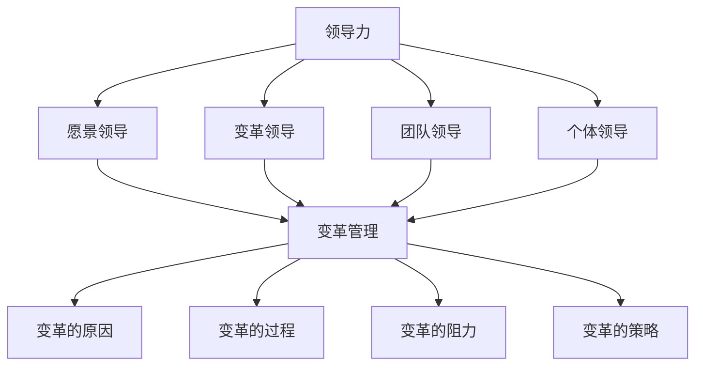

                 

### 背景介绍

在当今快速变化的商业环境中，企业面临着前所未有的挑战和机遇。全球化、技术进步、市场竞争加剧以及客户需求的不断变化，使得企业需要不断调整和变革，以适应新的商业环境。在这种背景下，领导力和变革管理成为企业成功的关键因素。领导力不仅关乎如何有效地指导团队，还涉及到如何在变化中保持组织的活力和竞争力。变革管理则是一种系统性的方法，旨在引导组织通过变革实现长期目标。

领导力与变革管理之间的关系紧密。优秀的领导者能够识别变化的机会，并带领团队有效地应对变化。他们通过建立清晰的愿景、设定目标、激励团队成员，以及提供必要的支持和资源，确保变革的顺利进行。同时，变革管理为领导力提供了具体的框架和工具，帮助领导者更好地规划和实施变革。

在IT行业，领导力和变革管理尤为重要。IT行业的特点是技术更新迅速，市场需求不断变化，这就要求企业领导者必须具备强大的适应能力和变革管理能力，以保持竞争优势。同时，IT项目的复杂性、高风险性和不确定性，也使得领导者在变革过程中需要具备更高的策略思考和执行力。

本文将围绕《领导力与变革管理：引导团队适应新常态》这一主题，深入探讨领导力和变革管理在IT行业中的应用和实践。我们将首先介绍领导力的核心概念和模型，然后分析变革管理的理论框架，接着讨论团队适应新常态的策略，并借助实际案例进行深入剖析。通过这一系列的探讨，旨在为读者提供系统、实用的指导，帮助他们在快速变化的IT环境中取得成功。

## 核心概念与联系

在深入探讨领导力与变革管理的具体应用之前，我们需要明确几个核心概念，并了解它们之间的联系。这些概念不仅构成了本文的理论基础，也为实际操作提供了明确的指导。

### 领导力

领导力是一种影响他人实现共同目标的能力。它不仅包括个人素质和技能，还涉及如何激励、引导和塑造团队行为。领导力可以划分为多个维度，包括愿景领导、变革领导、团队领导和个体领导。以下是这些维度的简要说明：

- **愿景领导（Visionary Leadership）**：领导者通过明确和传达愿景，激励团队成员共同为之努力。愿景是组织前进的方向，它需要具有吸引力和可行性，能够激发团队成员的积极性和创造力。
- **变革领导（Change Leadership）**：在快速变化的商业环境中，领导者需要具备推动组织变革的能力。这包括识别变革的必要性、设计变革策略、沟通变革愿景、以及克服变革中的障碍。
- **团队领导（Team Leadership）**：团队领导侧重于如何管理团队，包括建立信任、沟通、协作和解决冲突。一个高效的团队领导能够确保团队成员各尽其责，共同实现团队目标。
- **个体领导（Individual Leadership）**：个体领导关注领导者如何通过个人行为和榜样作用影响他人。这包括领导者的价值观、态度和行为，它们对团队成员有着潜移默化的影响。

### 变革管理

变革管理是一种系统性的方法，旨在确保组织在变革过程中能够成功实施并持续适应。变革管理的核心包括以下几个方面：

- **变革的原因（Reasons for Change）**：理解变革的原因是变革管理的基础。这些原因可能包括技术进步、市场变化、组织重组、战略调整等。明确变革的原因有助于制定相应的策略和计划。
- **变革的过程（Process of Change）**：变革管理通常包括以下几个阶段：计划、执行、监控和调整。每个阶段都有具体的任务和活动，确保变革能够顺利进行。
- **变革的阻力（Resistance to Change）**：变革过程中会遇到各种阻力，包括文化因素、个人因素和组织因素。领导者需要识别这些阻力，并采取适当的措施来克服它们。
- **变革的策略（Strategies for Change）**：变革策略包括推动策略和参与策略。推动策略侧重于自上而下的变革推动，而参与策略则强调员工参与和共识达成。

### 领导力与变革管理的联系

领导力与变革管理之间存在密切的联系。领导力为变革管理提供了核心的动力和方向，而变革管理则为领导力提供了具体的实施框架和工具。

- **领导力驱动变革**：领导者通过设定愿景、激励团队和推动变革，确保组织能够适应外部环境的变化。领导者的个人素质和行为对变革的成败具有重要影响。
- **变革促进领导力发展**：通过变革管理，领导者能够提高自身的决策能力、沟通能力和团队管理能力。变革过程为领导者提供了一个实践和成长的平台。
- **共同目标与协同作用**：领导力和变革管理都致力于实现组织的共同目标。通过协同作用，领导力和变革管理能够相互促进，共同推动组织实现长期成功。

### Mermaid 流程图

为了更直观地展示领导力与变革管理的核心概念及其联系，我们可以使用Mermaid流程图来描述。以下是相关概念和过程的简化流程图：

通过这个流程图，我们可以清晰地看到领导力与变革管理之间的逻辑关系。领导力通过不同的维度影响变革管理，而变革管理则为领导力提供了具体的实施路径和策略。

总之，领导力与变革管理是两个密切相关的领域。理解这两个领域的核心概念及其联系，有助于领导者更好地应对快速变化的商业环境，带领团队实现长期成功。

### 领导力的核心概念

在深入探讨领导力之前，我们需要明确几个核心概念，这些概念构成了领导力的基础，并且是任何有效领导行为的基石。

#### 领导力定义

领导力是一种复杂的能力，它涉及影响和激励他人来实现共同目标。领导力不仅仅是管理，更是一种能够引导、支持和激发团队成员潜力的艺术。斯蒂芬·罗宾斯（Stephen Robbins）将领导力定义为“通过影响他人，使他们达成组织目标的过程”。

#### 领导者角色

领导者扮演多种角色，每种角色在团队中发挥着不同的作用。以下是一些常见的领导者角色：

- **愿景师（Visionary）**：领导者需要具备远见，能够设定组织或团队的目标和方向。他们通过愿景激励团队成员，为团队提供清晰的目标和路径。
- **策略家（Strategist）**：领导者需要制定和实施策略，确保组织能够实现其愿景。他们需要考虑各种可能的策略，并选择最适合当前环境和资源的策略。
- **变革推动者（Change Agent）**：在变化快速发生的商业环境中，领导者需要推动变革，帮助组织适应新的挑战和机遇。他们需要识别变革的必要性，并带领团队成功地实施变革。
- **导师（Coach）**：领导者作为导师，指导和支持团队成员的成长和发展。他们提供反馈、建议和资源，帮助团队成员发挥最佳潜力。
- **调解者（Mediator）**：在团队内部或与外部利益相关者之间出现冲突时，领导者需要担任调解者的角色，解决冲突，维护团队的和谐与稳定。

#### 领导风格

领导风格是领导者行为和决策方式的体现，不同的领导风格对团队成员和团队绩效有不同的影响。以下是几种常见的领导风格：

- **专制式（Autocratic）**：在这种风格中，领导者做出所有决策，团队成员没有参与决策的机会。这种风格在紧急情况下或需要迅速决策时可能有效，但长期来看可能导致团队成员缺乏自主性和创造力。
- **民主式（Democratic）**：领导者鼓励团队成员参与决策过程，团队共同讨论并制定决策。这种风格有助于提高团队凝聚力和满意度，但决策过程可能较慢。
- **参与式（Participative）**：领导者邀请团队成员参与决策，并给予他们更多的自主权。这种风格强调团队合作和共识达成，适用于需要集体智慧和创新的情境。
- **教练式（Coaching）**：领导者通过指导和培养团队成员，帮助他们发展个人技能和职业发展。这种风格注重长期发展，有助于提高团队的整体能力和绩效。

#### 领导力与团队绩效的关系

领导力对团队绩效有着重要影响。研究表明，有效的领导力能够提高团队的士气、协作和创新能力，从而提升整体绩效。以下是领导力与团队绩效之间的几个关键关系：

- **明确的目标和期望**：领导者需要设定清晰的目标和期望，并确保团队成员理解并致力于实现这些目标。这有助于提高团队的凝聚力和动力。
- **积极的沟通**：领导者需要建立开放的沟通渠道，鼓励团队成员表达意见和建议。有效的沟通有助于减少误解和冲突，增强团队合作。
- **激励和支持**：领导者通过激励和支持团队成员，帮助他们克服困难和挑战。这种关心和支持能够增强团队成员的归属感和忠诚度。
- **能力建设和持续学习**：领导者需要关注团队成员的成长和发展，提供必要的培训和资源。持续学习和能力建设有助于提高团队的整体素质和竞争力。

通过理解领导力的核心概念，领导者可以更好地发挥其作用，带领团队实现长期成功。接下来，我们将探讨变革管理的理论框架，了解其核心组成部分和实施步骤。

### 变革管理的理论框架

变革管理是一种系统化的方法，旨在引导组织通过变革实现长期目标和可持续发展。变革管理不仅关注变革本身，还涉及变革的推动机制、过程管理和策略实施。以下是对变革管理理论框架的核心组成部分和实施步骤的详细解析。

#### 变革管理的核心组成部分

1. **变革原因**：明确变革的原因是变革管理的基础。变革原因可以包括技术进步、市场需求变化、竞争压力、组织重组、战略调整等。理解变革的必要性有助于制定有针对性的变革策略。

2. **变革过程**：变革管理通常包括以下几个阶段：

   - **计划阶段**：在这个阶段，领导者需要确定变革的目标、范围和资源需求，并制定详细的变革计划。
   - **准备阶段**：在计划确定后，领导者需要为变革做好准备，包括建立变革团队、沟通变革愿景、识别变革阻力、制定应对策略等。
   - **执行阶段**：在这个阶段，变革计划开始实施，领导者需要确保团队成员了解变革目标和步骤，并积极参与变革过程。
   - **监控阶段**：在变革实施过程中，领导者需要监控变革进展，及时调整计划以应对可能出现的问题和挑战。
   - **评估阶段**：在变革完成后，领导者需要对变革效果进行评估，包括变革目标的实现情况、团队成员的反馈和改进建议等。

3. **变革阻力**：变革过程中往往会遇到各种阻力，这些阻力可能来自个人、团队或组织层面。识别并应对这些阻力是变革成功的关键。常见的变革阻力包括恐惧未知、担心失去权力、担心个人利益受损、缺乏信任等。领导者需要采取适当的措施来克服这些阻力，例如通过沟通、培训和支持来增强团队成员的信心和参与度。

4. **变革策略**：变革策略是确保变革成功实施的关键。变革策略包括推动策略和参与策略。推动策略侧重于自上而下的变革推动，通过领导层的决策和推动来确保变革的顺利实施。参与策略则强调员工的参与和共识达成，通过广泛的沟通和参与来增强变革的接受度和执行力。

#### 变革管理的实施步骤

1. **确定变革原因**：领导者需要首先明确变革的必要性，这可以通过市场分析、竞争评估、组织绩效评估等方式进行。明确变革原因有助于确定变革的方向和目标。

2. **制定变革计划**：在确定变革原因后，领导者需要制定详细的变革计划，包括变革的目标、范围、时间表和资源需求等。变革计划应具有可操作性和灵活性，以便在实施过程中进行调整。

3. **建立变革团队**：为了确保变革计划的顺利实施，领导者需要建立一支专业的变革团队。变革团队应包括来自不同部门和层级的成员，以确保变革的广泛参与和支持。

4. **沟通变革愿景**：变革愿景是变革成功的关键驱动力。领导者需要通过有效的沟通方式，将变革愿景传达给全体员工，确保他们理解变革的必要性和目标。

5. **识别和应对变革阻力**：在变革过程中，领导者需要识别和应对可能出现的变革阻力。这可以通过定期的员工会议、问卷调查、一对一沟通等方式进行。领导者应采取积极的措施来克服这些阻力，例如提供培训、支持和个人关注等。

6. **实施变革计划**：在沟通变革愿景和建立变革团队后，领导者可以开始实施变革计划。实施过程中，领导者需要确保团队成员了解各自的职责和任务，并积极参与变革过程。

7. **监控变革进展**：在变革实施过程中，领导者需要持续监控变革进展，及时调整计划以应对可能出现的问题和挑战。这可以通过定期报告、会议和评估等方式进行。

8. **评估变革效果**：在变革完成后，领导者需要对变革效果进行评估，包括变革目标的实现情况、团队成员的反馈和改进建议等。评估结果有助于为未来的变革提供参考和指导。

通过以上步骤，领导者可以有效地实施变革管理，确保组织能够顺利适应新的环境和挑战。在下一部分，我们将探讨如何通过具体的策略和措施，引导团队适应新常态。

### 团队适应新常态的策略

在快速变化的商业环境中，团队需要具备高度的适应性和灵活性，以应对不断变化的市场需求和技术进步。以下是几个关键策略，帮助团队在新常态下保持活力和竞争力：

#### 理解新常态

新常态是一个动态变化的环境，特征包括全球化、数字化、高度不确定性以及快速的技术进步。团队需要首先理解这些变化，并认识到适应新常态的重要性。以下是一些关键点：

- **技术进步**：新的技术不断涌现，如人工智能、大数据、区块链等，正在改变业务模式和市场格局。团队需要不断学习新技术，并将其应用于业务实践中。
- **市场需求变化**：消费者的需求变得越来越多样化，市场环境更加复杂。团队需要具备快速响应市场变化的能力，提供灵活的产品和服务。
- **全球化**：全球化带来了更多的市场机会，但也增加了竞争压力。团队需要具备国际视野，适应全球化的业务模式和文化差异。
- **高度不确定性**：在不确定的环境下，团队需要具备应对突发情况的能力，灵活调整战略和操作流程。

#### 培养团队的适应性

培养团队的适应性是团队在新常态下成功的关键。以下是一些具体策略：

- **持续学习**：鼓励团队成员持续学习和成长。提供培训机会，鼓励团队成员参加行业会议、研讨会和在线课程，以保持对最新技术和市场趋势的了解。
- **跨职能协作**：通过跨职能协作，团队成员可以分享不同的视角和经验，提高解决问题的能力。跨职能团队有助于打破部门壁垒，加快创新和响应速度。
- **灵活的工作安排**：采用灵活的工作安排，如远程办公、弹性工作时间等，可以提升员工的满意度和工作效率。这有助于吸引和留住人才，增强团队凝聚力。
- **领导力支持**：领导者需要为团队提供必要的支持和资源，鼓励创新和实验。领导者应鼓励团队成员提出新的想法，并为其提供试错空间。

#### 提高团队的绩效

在新常态下，团队不仅需要适应变化，还需要提高绩效，以保持竞争优势。以下是一些策略：

- **明确的目标和期望**：为团队成员设定清晰的目标和期望，确保他们了解自己的职责和贡献。这有助于提高团队成员的积极性和责任感。
- **有效的沟通**：建立开放的沟通渠道，鼓励团队成员分享意见和建议。有效的沟通有助于减少误解和冲突，增强团队合作。
- **绩效反馈和激励**：定期提供绩效反馈，帮助团队成员了解自己的表现，并提供改进建议。合理的激励措施可以激励团队成员更加努力工作，提高整体绩效。
- **持续改进**：鼓励团队持续改进，不断优化工作流程和操作方法。通过定期评估和反馈，团队可以发现并解决存在的问题，提高工作效率和质量。

通过以上策略，团队可以更好地适应新常态，提高适应能力和绩效。在新常态下，团队的成功取决于其灵活性和创新能力，这需要全体成员的共同努力和持续投入。在下一部分，我们将通过实际案例来探讨这些策略在实践中的应用。

### 实际案例：团队适应新常态的成功实践

在探讨团队如何适应新常态的策略后，我们可以通过以下两个实际案例，来具体分析这些策略在实践中的应用和效果。

#### 案例1：某全球知名科技公司

背景：这家全球知名的科技公司成立于20世纪末，主要从事软件开发和销售。近年来，随着云计算和人工智能的兴起，市场需求和技术环境发生了巨大变化。公司面临的主要挑战是：

1. 如何快速适应新技术，提升产品竞争力。
2. 如何在全球化背景下，保持团队的高效协作和创新能力。

解决方案：

1. **持续学习与技能提升**：公司建立了一个内部培训平台，定期邀请行业专家和技术专家进行讲座和培训。同时，鼓励员工参加外部培训和认证，以提升专业技能和知识水平。

2. **跨职能协作**：公司通过组织跨职能团队，促进不同部门之间的合作和交流。例如，产品开发团队与市场团队密切合作，共同研究和开发符合市场需求的新产品。

3. **灵活的工作安排**：公司采用远程办公和弹性工作时间，以适应员工的不同需求。这种灵活的工作安排不仅提高了员工的满意度和工作效率，还吸引了更多优秀的人才加入公司。

4. **领导力支持**：公司领导者鼓励创新和实验，为团队成员提供试错空间。公司设立了一个创新基金，用于支持员工提出的新想法和项目。

结果：通过以上策略，公司成功适应了新常态，产品竞争力显著提升。团队士气高涨，创新能力和工作效率也得到了显著提高。

#### 案例2：某本土初创公司

背景：这家初创公司成立于2018年，专注于提供基于人工智能的解决方案。公司成立初期，市场竞争激烈，技术更新迅速。公司面临的主要挑战是：

1. 如何在资源有限的情况下，快速适应市场需求和技术变化。
2. 如何保持团队的凝聚力，确保高效协作。

解决方案：

1. **敏捷开发与迭代**：公司采用敏捷开发方法，快速响应市场需求。通过定期迭代和反馈，公司能够及时调整产品方向，确保产品始终符合市场需求。

2. **开放沟通与协作**：公司建立了一个开放的沟通平台，鼓励团队成员随时分享意见和建议。通过定期的团队会议和讨论，公司确保团队成员之间的信息畅通，减少误解和冲突。

3. **持续学习和技能提升**：公司为员工提供丰富的学习资源和机会，包括内部培训、外部讲座和在线课程。公司还鼓励员工参加行业会议和技术研讨会，以保持对最新技术和市场趋势的了解。

4. **激励和认可**：公司通过设立绩效奖励和认可机制，激励团队成员努力工作。公司定期举办表彰大会，对表现优异的团队成员进行表彰和奖励。

结果：通过以上策略，公司在市场竞争中脱颖而出，取得了显著的业务增长。团队凝聚力增强，员工满意度和工作效率也得到了显著提升。

这两个案例展示了不同类型的公司在适应新常态时采取的具体策略和取得的成果。通过持续学习、跨职能协作、灵活的工作安排和领导力支持，公司不仅成功适应了新常态，还提高了团队绩效和创新能力。这些实践为其他企业提供了宝贵的经验和启示，证明了适应新常态的重要性。

### 案例分析

通过对两个实际案例的深入分析，我们可以得出以下结论和启示。

#### 案例总结

案例1中的全球知名科技公司通过持续学习、跨职能协作、灵活的工作安排和领导力支持，成功适应了新技术和市场需求的变化。公司建立了内部培训平台和开放沟通渠道，鼓励员工不断学习和创新。通过跨职能团队的合作，公司能够迅速响应市场需求，提升产品竞争力。灵活的工作安排和领导力支持增强了员工的满意度和工作效率，为公司的长期发展奠定了坚实基础。

案例2中的本土初创公司则通过敏捷开发、开放沟通、持续学习和激励认可等策略，保持了团队的高效协作和创新能力。公司采用敏捷开发方法，快速迭代和调整产品方向，确保产品始终符合市场需求。开放的沟通平台和定期的团队会议，减少了误解和冲突，提高了团队协作效率。通过持续学习和激励认可，公司激发了员工的积极性和创造力，推动了公司的快速发展。

#### 成功因素

两个案例的成功因素主要包括：

1. **持续学习和技能提升**：无论是全球知名科技公司还是初创公司，持续学习和技能提升都是适应新常态的关键。这有助于团队保持对最新技术和市场趋势的了解，提高整体竞争力。
2. **跨职能协作**：跨职能团队的合作能够整合不同部门的专业知识和经验，提高解决问题的效率。通过跨职能协作，团队可以快速响应市场需求，实现创新和突破。
3. **灵活的工作安排**：灵活的工作安排能够满足员工的不同需求，提高员工的工作满意度和工作效率。远程办公和弹性工作时间成为新常态下的重要工作形式。
4. **领导力支持**：领导力在变革管理和团队适应新常态中起着至关重要的作用。有效的领导力能够提供明确的方向和支持，激发团队的积极性和创造力。

#### 启示和改进

从以上案例中，我们可以得出以下启示和改进建议：

1. **加强培训和技能提升**：企业应加强内部培训和外部学习机会，确保员工具备适应新环境所需的知识和技能。可以通过建立内部培训平台、组织外部讲座和研讨会等方式，提升员工的技能和知识水平。
2. **促进跨职能协作**：企业应鼓励不同部门之间的协作，打破部门壁垒，促进知识和经验的共享。可以通过跨职能项目、团队建设活动和信息共享平台等方式，增强跨职能协作的效率和效果。
3. **灵活的工作安排**：企业应灵活调整工作安排，以适应员工的不同需求和公司业务的变化。可以通过提供远程办公、弹性工作时间等福利措施，提高员工的工作满意度和工作效率。
4. **强化领导力建设**：企业应重视领导力建设，培养具备变革管理和团队管理能力的领导者。可以通过领导力培训、教练辅导和实战经验积累等方式，提升领导者的能力和影响力。

通过以上启示和改进，企业可以更好地适应新常态，提升团队绩效和创新能力，实现长期成功。

### 结论

通过本文的探讨，我们深入分析了领导力与变革管理在团队适应新常态中的应用和实践。领导力不仅关乎个人素质和技能，更涉及如何有效激励、引导和塑造团队行为。变革管理则为组织提供了系统性的方法，帮助其通过变革实现长期目标和可持续发展。

在快速变化的商业环境中，团队需要具备高度的适应性和灵活性，以应对不断变化的市场需求和技术进步。通过培养团队的适应性、明确的目标和期望、有效的沟通以及持续改进，团队可以在新常态下保持活力和竞争力。

案例研究表明，持续学习、跨职能协作、灵活的工作安排和领导力支持是团队适应新常态的关键成功因素。通过借鉴这些成功实践，企业可以更好地应对挑战，提升团队绩效和创新能力。

总之，领导力和变革管理在团队适应新常态中起着至关重要的作用。只有通过有效的领导力和变革管理，团队才能在新常态下取得成功，实现长期发展。

### 最佳实践 Tips

在领导力和变革管理的实践中，以下是几个最佳实践，供您参考和借鉴：

1. **建立清晰的愿景和目标**：领导者应明确组织的愿景和目标，并将其传达给全体成员。这有助于统一团队的方向，提高成员的积极性和投入度。

2. **加强沟通与反馈**：建立开放的沟通渠道，鼓励团队成员提出意见和建议。定期进行绩效反馈和评估，帮助团队成员了解自己的表现，并提供改进建议。

3. **培养团队成员的适应性**：鼓励团队成员持续学习和提升技能，以适应不断变化的市场和技术环境。通过跨职能团队和灵活的工作安排，增强团队的协作和创新能力。

4. **关注团队成员的发展**：领导者应关注团队成员的个人成长和发展，提供必要的培训和资源支持。通过激励和认可，提升团队成员的工作满意度和忠诚度。

5. **应对变革阻力**：在变革过程中，领导者应识别并应对各种变革阻力。通过沟通、培训和支持，增强团队成员对变革的接受度和参与度。

6. **持续改进与优化**：鼓励团队不断改进工作流程和方法，通过定期评估和反馈，优化团队的绩效和运营效率。

通过以上最佳实践，企业可以更好地引导团队适应新常态，实现长期成功。

### 小结

本文围绕领导力与变革管理这一主题，深入探讨了其在团队适应新常态中的应用和实践。首先，我们明确了领导力的核心概念，包括定义、领导者角色、领导风格等，并分析了领导力与团队绩效的关系。接着，我们详细介绍了变革管理的理论框架，包括变革的原因、过程、阻力和策略。随后，通过实际案例展示了如何通过培养团队适应性、提高绩效等策略，使团队在新常态下保持竞争力。

本文的主要观点包括：

1. 领导力是引导团队适应新常态的关键因素。
2. 变革管理提供了系统化的方法，帮助组织实现长期目标。
3. 团队适应性、明确的愿景和目标、有效的沟通与反馈等策略，是团队在新常态下成功的关键。

通过本文的探讨，我们希望读者能够更深入地理解领导力与变革管理的实际应用，为团队在快速变化的商业环境中取得成功提供有力指导。

### 注意事项

在领导力和变革管理的实践过程中，以下是一些需要注意的关键点：

1. **充分准备**：在实施变革前，确保进行全面的市场和技术分析，明确变革的必要性和可行性。制定详细的变革计划，并预留足够的调整空间。
2. **沟通与透明度**：保持与团队成员和利益相关者的沟通，确保他们了解变革的原因、目标和步骤。透明度有助于减少不确定性，增强团队成员的信任和参与度。
3. **关注细节**：变革管理涉及多个环节，包括计划、准备、执行和评估。确保每个环节都得到充分关注和有效实施，避免因细节问题导致变革失败。
4. **持续监控与调整**：在变革过程中，持续监控进展，及时调整计划和策略。这有助于快速应对问题和挑战，确保变革按计划顺利进行。
5. **激励与支持**：为团队成员提供必要的激励和支持，帮助他们克服变革过程中的困难和挑战。通过奖励和认可，增强团队成员的积极性和忠诚度。

通过注意这些关键点，可以有效提高领导力和变革管理的成功几率。

### 拓展阅读

为了进一步深入理解和实践领导力与变革管理，以下是几本推荐的专业书籍和资源：

1. **《变革之心》（The Heart of Change）**：作者：约翰·P·科特（John P. Kotter）和威廉·艾森哈特（William E. Fisher）。这本书详细阐述了变革管理的过程，以及如何克服变革中的常见障碍。

2. **《领导力：理论与实践》（Leadership: Theory and Practice）**：作者：彼得·北岩（Peter Northouse）。这本书涵盖了领导力的各个方面，包括领导理论、领导风格和领导技能。

3. **《第五项修炼：学习型组织的艺术与实务》（The Fifth Discipline: The Art & Practice of The Learning Organization）**：作者：彼得·圣吉（Peter M. Senge）。这本书提出了构建学习型组织的五个核心修炼，对于提升团队的适应性和创新能力有重要指导意义。

4. **在线资源**：麻省理工学院（MIT）开放课程、哈佛商业评论（Harvard Business Review）以及Coursera、edX等在线教育平台上的相关课程，都提供了丰富的领导力和变革管理资源。

通过阅读这些书籍和资源，您可以进一步深化对领导力与变革管理的理解和应用，提升团队的管理能力和绩效。

### 文章标题

# 领导力与变革管理：引导团队适应新常态

### 文章关键词

领导力，变革管理，团队适应，新常态，创新能力，持续学习

### 文章摘要

本文围绕领导力与变革管理这一主题，深入探讨了其在团队适应新常态中的应用和实践。通过明确领导力的核心概念、介绍变革管理的理论框架，并结合实际案例，我们分析了如何通过培养团队适应性、提高绩效等策略，使团队在新常态下保持竞争力。本文旨在为读者提供系统、实用的指导，帮助他们在快速变化的商业环境中取得成功。

