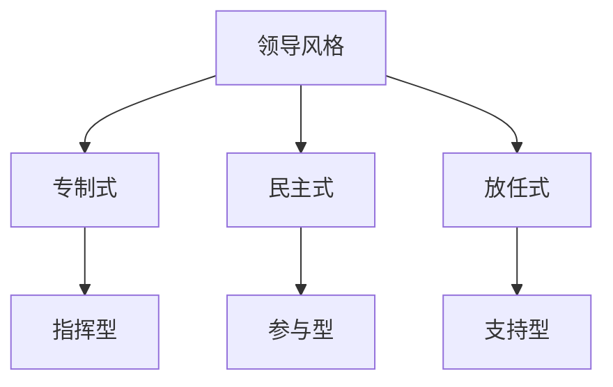
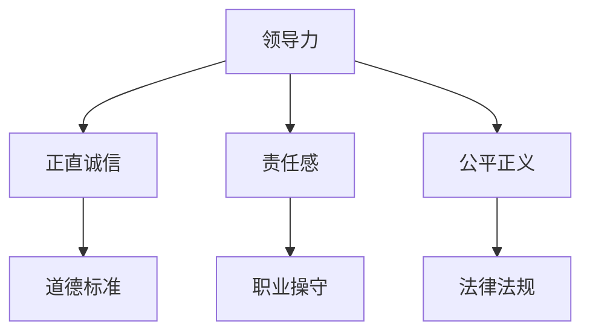

                 

# 领导力与职业道德：树立正直诚信榜样

> 关键词：领导力、职业道德、正直诚信、榜样、企业发展

> 摘要：本文深入探讨了领导力与职业道德的重要性，以及如何在企业中树立正直诚信的榜样。通过分析领导力的基本理论、职业道德的基本概念和实际案例分析，本文旨在为IT领域的领导者提供有价值的指导，帮助他们成为企业的道德典范，促进企业的可持续发展。

## 第一部分：领导力的基本理论

### 1.1 领导力的核心概念

领导力是指领导者通过影响、激励和引导团队成员实现共同目标的能力。领导力不仅仅是管理团队，更是一种领导艺术。领导者需要具备愿景、沟通、决策、激励和信任等方面的能力，以便有效地指导和影响团队成员。

**领导力的定义**：
$$
\text{领导力} = f(\text{愿景}, \text{沟通}, \text{决策}, \text{激励}, \text{信任})
$$

**领导力的要素**：

1. **愿景**：领导者需要拥有清晰的愿景，能够描绘出团队未来的发展方向。
2. **沟通**：领导者需要具备良好的沟通技巧，能够与团队成员建立有效的沟通渠道。
3. **决策**：领导者需要能够做出明智的决策，并在团队中传达这些决策。
4. **激励**：领导者需要能够激发团队成员的积极性，推动他们为实现共同目标而努力。
5. **信任**：领导者需要建立与团队成员之间的信任，使团队成员愿意跟随并支持领导者的决策。

### 1.2 领导力的理论框架

领导力的理论框架包括领导风格、领导力的发展阶段以及领导力与职业道德的关系。

**领导风格**：

领导风格是指领导者处理团队关系和管理团队的方式。常见的领导风格包括：

1. **专制式**：领导者做出决策并要求团队成员执行。
2. **民主式**：领导者与团队成员共同参与决策过程。
3. **放任式**：领导者给予团队成员高度自主权，让他们自行决策。

使用Mermaid流程图展示不同的领导风格及其特点：



**领导力的发展阶段**：

领导力的发展是一个持续的过程，领导者会经历不同的阶段。使用伪代码讲解领导力发展过程：

```python
def leadership_development():
    current_stage = "初学者"
    for experience in range(1, 6):
        if experience < 3:
            current_stage = "初学者"
        elif experience < 5:
            current_stage = "有经验的领导者"
        else:
            current_stage = "卓越领导者"
    return current_stage
```

**领导力与职业道德的关系**：

领导力与职业道德之间存在密切的关系。领导者的行为不仅影响团队的工作效率，也影响企业的道德文化。使用Mermaid流程图展示领导力与职业道德之间的核心联系：



### 1.3 领导力与职业道德的关系

领导力与职业道德之间的联系在于，领导者的行为和决策对团队成员的道德观念和行为产生深远的影响。一个正直诚信的领导者能够树立良好的道德榜样，推动团队和企业的道德文化建设。

**领导力与职业道德的核心联系**：

1. **正直诚信**：领导者需要具备正直诚信的品质，以身作则，树立道德标杆。
2. **责任感**：领导者需要对团队和企业的成功承担起责任，并积极推动道德建设。
3. **公平正义**：领导者需要秉持公平正义的原则，确保团队成员的权益得到保障。

通过上述分析，我们可以看到领导力与职业道德之间的紧密联系。一个优秀的领导者不仅需要具备领导力，还需要具备高尚的职业道德，才能成为企业的道德典范，推动企业的可持续发展。

## 第二部分：职业道德的重要性

### 2.1 职业道德的基本概念

职业道德是指与特定职业相关的道德规范和职业操守。它涉及到职业行为、职业责任、职业伦理等方面。职业道德的基本概念包括：

**职业道德的定义**：
$$
\text{职业道德} = f(\text{职业行为}, \text{职业责任}, \text{职业伦理})
$$

**职业道德的要素**：

1. **诚实守信**：在职业活动中保持诚实，遵守承诺。
2. **公平竞争**：遵循公平竞争原则，不采取不正当手段获取竞争优势。
3. **尊重他人**：尊重团队成员和其他利益相关者的权益和尊严。
4. **保守秘密**：对企业的商业机密和个人隐私信息进行保密。

### 2.2 职业道德的重要性

职业道德在企业发展中起着至关重要的作用。它不仅关系到企业的声誉和形象，也关系到企业的长期可持续发展。

**职业道德对企业的影响**：

职业道德水平直接影响企业的声誉和形象。一个具备高尚职业道德的企业能够赢得客户、合作伙伴和员工的信任，从而在市场竞争中获得优势。

使用LaTeX公式解释职业道德对企业的重要性：

$$
\text{企业效益} = f(\text{职业道德水平})
$$

**职业道德对个人的影响**：

职业道德不仅影响企业的运营，也影响个人的职业发展和声誉。一个遵守职业道德的员工能够获得同事和领导的尊重，提升自己的职业素养和职业形象。

使用LaTeX公式解释职业道德对个人的影响：

$$
\text{个人声誉} = f(\text{职业道德表现})
$$

### 2.3 职业道德的挑战与应对

尽管职业道德对企业和个人都有重要影响，但在实际工作中，职业道德仍面临诸多挑战。

**职业道德面临的挑战**：

1. **利益冲突**：在某些情况下，个人利益可能与企业利益发生冲突，导致职业道德受到挑战。
2. **诚信问题**：在商业活动中，诚信问题可能导致企业声誉受损，甚至引发法律纠纷。
3. **工作压力**：在工作中，员工可能面临巨大的压力，可能导致他们违背职业道德。

**应对职业道德挑战的策略**：

1. **加强职业道德教育**：通过培训和宣传，提高员工对职业道德的认识和重视。
2. **建立健全的道德规范**：制定明确的职业道德准则，确保员工在行为上有据可依。
3. **建立监督机制**：设立监督机构，对违反职业道德的行为进行监督和处罚。

通过上述分析，我们可以看到职业道德在企业发展中的重要性。一个具备高尚职业道德的企业能够赢得员工的信任和忠诚，推动企业的可持续发展。同时，职业道德也是个人职业发展的基石，有助于提升个人的职业素养和声誉。

## 第三部分：正直诚信榜样的树立

### 3.1 正直诚信的定义

正直诚信是指一个人遵守道德原则，诚实守信，不做违法乱纪之事的态度和行为。正直诚信是职业道德的核心要素，也是领导者的基本品质。

**正直诚信的定义**：
$$
\text{正直诚信} = f(\text{遵守道德原则}, \text{诚实守信}, \text{不做违法乱纪之事})
$$

### 3.2 正直诚信的重要性

正直诚信在企业中具有极高的价值。一个正直诚信的领导者能够树立良好的道德榜样，推动企业的道德文化建设，提高企业的整体素质。

**正直诚信在企业中的价值**：

1. **提升企业形象**：正直诚信的企业能够赢得客户的信任和尊重，提升企业的声誉和竞争力。
2. **增强团队凝聚力**：正直诚信的领导者能够赢得员工的信任和忠诚，提高团队的凝聚力。
3. **推动企业发展**：正直诚信的企业能够建立良好的商业关系，获得更多的商业机会，推动企业的持续发展。

使用LaTeX公式解释正直诚信对企业文化的价值：
$$
\text{企业文化价值} = f(\text{正直诚信水平})
$$

### 3.3 树立正直诚信榜样的方法

要树立正直诚信的榜样，领导者需要从以下几个方面入手：

**领导者的角色**：

1. **以身作则**：领导者需要以身作则，严格遵守职业道德，做到言行一致。
2. **建立诚信文化**：领导者需要在企业中建立诚信文化，营造一个正直诚信的工作氛围。
3. **激励员工**：领导者需要通过奖励和激励措施，鼓励员工遵守职业道德，树立正直诚信的榜样。

**员工的培养**：

1. **职业道德培训**：企业需要定期开展职业道德培训，提高员工对职业道德的认识和重视。
2. **激励机制**：企业需要建立健全的激励机制，鼓励员工遵守职业道德，树立正直诚信的榜样。
3. **监督机制**：企业需要设立监督机构，对违反职业道德的行为进行监督和处罚，确保正直诚信的榜样得到落实。

通过上述方法，领导者可以树立正直诚信的榜样，推动企业的道德文化建设，促进企业的可持续发展。

## 第四部分：实际案例分析

### 4.1 案例一：谷歌的道德困境

谷歌在发展过程中曾面临过多次道德困境，其中最著名的案例是2018年的“谷歌员工抗议”事件。当时，谷歌员工因不满公司对待性骚扰事件的态度而发起抗议，要求公司采取更严格的措施。这一事件引发了社会对谷歌职业道德的广泛关注。

**案例分析**：

1. **背景介绍**：谷歌在性骚扰事件处理上的拖延和不作为引发了员工的不满。
2. **问题分析**：谷歌的道德困境在于未能严格遵守职业道德，导致员工和公众对公司的信任度下降。
3. **解决方案**：谷歌随后采取了一系列措施，如加强职业道德培训、设立独立的道德委员会等，以改善职业道德状况。

**结论**：谷歌的案例表明，企业在面临道德困境时，需要勇于面对问题，采取积极有效的措施，重塑职业道德形象。

### 4.2 案例二：亚马逊的领导力与职业道德

亚马逊作为全球知名的企业，其领导力与职业道德也备受关注。亚马逊创始人杰夫·贝佐斯以其独特的领导风格和职业道德赢得了广泛的认可。

**案例分析**：

1. **背景介绍**：杰夫·贝佐斯以其“长期思维”和“客户至上”的理念，带领亚马逊成为全球电商巨头。
2. **问题分析**：尽管亚马逊在领导力和职业道德方面取得了一定的成就，但也面临着一些挑战，如员工工作环境问题等。
3. **解决方案**：杰夫·贝佐斯通过不断改进领导风格和强化职业道德，努力改善员工的工作环境，提升员工的满意度。

**结论**：亚马逊的案例表明，领导者需要持续关注职业道德，通过改进领导风格和强化职业道德，推动企业的可持续发展。

## 第五部分：领导力与职业道德的结合

### 5.1 领导力与职业道德的结合

领导力与职业道德的结合是实现企业可持续发展的关键。一个正直诚信的领导者不仅需要具备出色的领导力，还需要具备高尚的职业道德。

**领导力与职业道德的结合**：

1. **领导者的道德标准**：领导者需要将道德标准内化于心，将其融入到领导行为中。
2. **职业道德的实践**：领导者需要通过实际行动践行职业道德，树立良好的道德榜样。
3. **领导力与职业道德的相互作用**：领导力与职业道德之间相互促进，共同推动企业的可持续发展。

### 5.2 领导力与职业道德的结合对企业的影响

领导力与职业道德的结合对企业的影响深远，具体体现在以下几个方面：

1. **提升企业形象**：一个具备高尚职业道德的领导者能够提升企业的形象，增强企业的品牌价值。
2. **增强员工凝聚力**：领导者通过树立正直诚信的榜样，能够增强员工的凝聚力和归属感。
3. **推动企业发展**：领导力与职业道德的结合能够促进企业的创新和发展，提高企业的市场竞争力。

### 5.3 如何实现领导力与职业道德的结合

为了实现领导力与职业道德的结合，企业可以采取以下措施：

1. **加强职业道德教育**：通过培训和学习，提高领导者和员工的职业道德素养。
2. **建立道德规范**：制定明确的职业道德准则，确保领导者和员工在行为上有据可依。
3. **设立监督机制**：建立监督机构，对违反职业道德的行为进行监督和处罚，确保职业道德得到落实。

通过上述措施，企业可以实现领导力与职业道德的结合，推动企业的可持续发展。

## 第六部分：职业道德教育

### 6.1 职业道德教育的重要性

职业道德教育是培养员工职业道德素养的重要途径。一个具备高尚职业道德的员工能够更好地履行职业责任，为企业的发展贡献力量。

**职业道德教育的重要性**：

1. **提升员工职业道德素养**：职业道德教育能够提高员工的道德认识和道德行为，使其更好地履行职业责任。
2. **促进企业文化发展**：职业道德教育有助于推动企业文化的建设，塑造企业的道德氛围。
3. **提高企业竞争力**：一个具备高尚职业道德的员工能够赢得客户的信任，提高企业的市场竞争力。

### 6.2 职业道德教育的实施

为了有效实施职业道德教育，企业可以采取以下措施：

1. **制定职业道德教育计划**：根据企业的实际情况，制定系统的职业道德教育计划，确保教育内容的针对性和实效性。
2. **开展职业道德培训**：通过培训课程、研讨会等形式，提高员工的职业道德素养。
3. **设立职业道德奖惩机制**：建立职业道德奖惩机制，对遵守职业道德的员工给予奖励，对违反职业道德的行为进行惩罚。
4. **营造道德氛围**：通过宣传、活动等形式，营造良好的道德氛围，使员工在日常生活中践行职业道德。

### 6.3 职业道德教育的效果评估

为了评估职业道德教育的效果，企业可以采取以下方法：

1. **员工满意度调查**：通过调查了解员工对职业道德教育的满意度和认知情况。
2. **道德行为评估**：通过观察和评估员工在日常工作和生活中的道德行为，了解职业道德教育的实际效果。
3. **企业业绩评估**：通过分析企业业绩的变化，了解职业道德教育对企业发展的影响。

通过以上评估方法，企业可以不断优化职业道德教育，提升员工的职业道德素养。

## 第七部分：总结与展望

### 7.1 总结

本文从领导力的基本理论、职业道德的重要性、正直诚信榜样的树立以及实际案例分析等方面，探讨了领导力与职业道德的关系。通过分析，我们可以得出以下结论：

1. **领导力与职业道德密切相关**：领导力是推动企业发展的重要力量，而职业道德则是领导力的核心组成部分。
2. **正直诚信是道德的核心要素**：一个正直诚信的领导者能够树立良好的道德榜样，推动企业的道德文化建设。
3. **职业道德教育是培养高素质员工的重要途径**：通过职业道德教育，企业可以提升员工的职业道德素养，促进企业的可持续发展。

### 7.2 展望

在未来，随着企业竞争的加剧和社会对职业道德要求的提高，领导力与职业道德的结合将成为企业发展的关键。为了更好地应对挑战，企业应：

1. **加强职业道德教育**：通过培训和学习，提高员工的职业道德素养，培养正直诚信的领导者。
2. **建立道德规范**：制定明确的职业道德准则，确保领导者和员工在行为上有据可依。
3. **营造良好的道德氛围**：通过宣传、活动等形式，营造良好的道德氛围，使员工在日常生活中践行职业道德。

通过以上措施，企业可以不断提升领导力和职业道德水平，实现企业的可持续发展。

## 作者信息

**作者：AI天才研究院/AI Genius Institute & 禅与计算机程序设计艺术 /Zen And The Art of Computer Programming**

本文由AI天才研究院与禅与计算机程序设计艺术联合撰写，旨在为IT领域的领导者提供有价值的指导，帮助他们树立正直诚信的榜样，推动企业的可持续发展。希望本文能够对读者有所启发和帮助。

