                 

### 引言

#### 书籍背景与目的

在当今快速变化和竞争激烈的技术领域，领导力和风险管理显得尤为重要。本书籍旨在探讨领导力与风险管理之间的紧密联系，以及如何通过有效的领导力来预防和应对潜在危机。本书的读者对象包括技术团队领导者、项目经理、CTO以及其他在技术行业担任领导职务的专业人士。

随着全球化和数字化的加速，企业面临着前所未有的挑战和机遇。技术团队不仅需要快速适应新技术，还需要具备应对复杂问题和潜在危机的能力。领导力在此过程中起着关键作用，它不仅影响团队的整体表现，还直接关系到企业的长期成功。

本书籍的核心目标是帮助读者理解：
1. 领导力的基本概念和重要性。
2. 风险管理的核心原则和方法。
3. 领导力与风险管理的相互作用及其对组织的影响。
4. 如何通过有效的领导力来预防潜在危机并制定应对策略。

通过本书，读者将获得以下收益：
- 深入理解领导力的关键要素及其在不同情境下的应用。
- 掌握风险管理的核心原则和方法，以识别和评估潜在风险。
- 学习如何通过领导力提升团队协作和创新能力。
- 获得实用的策略和工具，以预防潜在危机并制定有效的应对计划。

#### 领导力概述

领导力是一种能力，它涉及激励、指导和影响他人以实现共同目标的过程。领导力不仅仅是一种职位或角色的属性，更是一种可以学习和发展的技能。根据不同的研究和理论，领导力可以被划分为多个维度，如变革型领导、魅力型领导和交易型领导等。

变革型领导（Transformational Leadership）强调通过激励和启发来推动变革。这种领导风格注重培养团队成员的愿景和使命感，激发他们的内在动机，从而实现组织的目标。魅力型领导（Charismatic Leadership）则强调领导者自身的魅力和愿景，通过个人的魅力和说服力来影响团队成员。交易型领导（Transactional Leadership）则侧重于通过奖励和惩罚来激励团队成员，以确保任务的完成。

在不同的组织中，领导力的表现形式可能会有所不同。例如，在初创企业中，领导者可能需要更加灵活和创新，以适应快速变化的市场环境；而在成熟企业中，领导者可能更注重稳定和持续改进。因此，了解领导力的不同维度和如何在具体情境中应用这些维度，对于领导者的成功至关重要。

#### 风险管理概述

风险管理是一种系统性的方法，用于识别、评估和应对潜在的风险，以确保组织的持续运营和目标实现。在技术行业中，风险管理尤为重要，因为技术项目往往涉及大量的不确定性和复杂性。

风险管理的核心流程包括：
1. 风险识别：通过系统性的方法，识别可能影响项目成功的潜在风险。
2. 风险评估：对识别出的风险进行评估，确定其概率和影响。
3. 风险应对：制定并执行策略，以减轻或消除风险的影响。
4. 风险监控：持续监控风险状态，确保应对措施的有效性。

风险管理的原则包括：
- 预防为主：通过预防措施来减少风险的发生概率。
- 全面性：对各种类型的风险进行全面识别和评估。
- 动态调整：随着环境和情况的变化，及时调整风险管理策略。
- 集体参与：鼓励团队成员共同参与风险管理，以提高整体意识和应对能力。

通过有效的风险管理，组织可以降低潜在风险带来的负面影响，提高项目成功的概率，并确保组织的长期稳定发展。

#### 领导力与风险管理的关系

领导力与风险管理之间存在紧密的相互作用。有效的领导力可以促进风险管理，而风险管理也可以反过来增强领导力。以下是一些关键点：

1. **信任与沟通**：领导力通过建立信任和有效的沟通机制，有助于团队成员更开放地讨论潜在风险，从而提高风险识别的准确性。
2. **决策能力**：领导者需要具备快速决策的能力，特别是在面对潜在危机时。有效的领导力可以确保在危机发生时能够迅速采取行动。
3. **资源分配**：领导力影响资源的分配，包括时间和预算。在风险管理中，合理的资源分配对于制定有效的应对策略至关重要。
4. **团队协作**：领导力可以激励团队成员协同工作，共同应对风险。这种协作有助于提高整体应对能力。

总之，领导力与风险管理是相辅相成的，通过有效的领导力可以增强风险管理的效率，而良好的风险管理又可以反过来提升领导力。

### 领导力的关键要素

领导力是一种多维度的能力，涉及到多个关键要素。以下是领导力的主要要素及其相互关系：

#### 领导风格

领导风格是领导者处理团队和任务的方式。不同的领导风格适用于不同的情境和团队成员。以下是几种常见的领导风格：

1. **变革型领导**：通过激励和启发团队成员来实现变革。领导者树立愿景并鼓励团队成员追求卓越。
2. **交易型领导**：通过奖励和惩罚来激励团队成员。领导者注重任务完成和绩效管理。
3. **民主型领导**：鼓励团队成员参与决策，通过协作和讨论来解决问题。领导者注重团队氛围和共识。
4. **权威型领导**：领导者拥有决策权，直接指挥团队成员完成任务。领导者具有明确的角色和职责。

**Mermaid 流程图：**

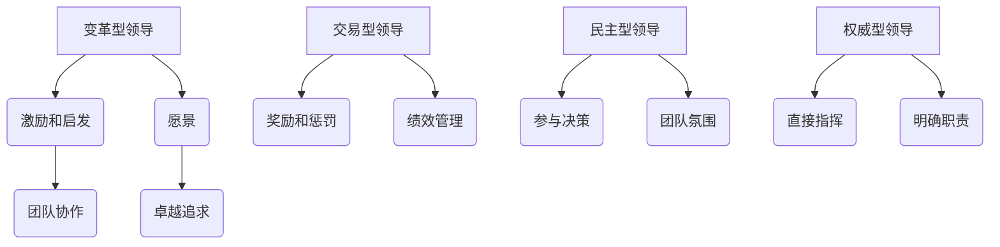

#### 领导能力

领导能力是领导者完成领导任务所需的知识和技能。以下是几种关键领导能力：

1. **沟通能力**：有效沟通是领导力的基础。领导者需要能够清晰、准确地传达信息，同时倾听和理解团队成员的需求和意见。
2. **决策能力**：领导者需要能够在复杂和不确定的环境下做出明智的决策。这包括分析问题、评估备选方案以及承担决策后果。
3. **变革管理能力**：在快速变化的环境中，领导者需要具备推动组织变革的能力。这包括理解变革的必要性、设计变革计划以及激励团队成员参与变革。
4. **团队合作能力**：领导者需要能够促进团队合作，解决团队内部的冲突，并确保团队成员能够协同工作。

**Mermaid 流程图：**

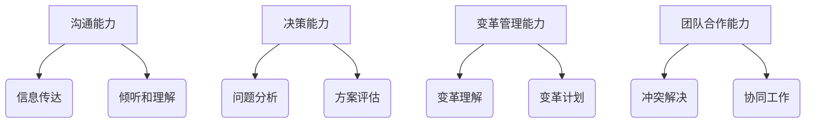

#### 领导力模型

领导力模型是描述领导行为和结果之间关系的一系列理论和框架。以下是几种重要的领导力模型：

1. **路径-目标理论**：领导者通过设定清晰的目标并帮助团队成员找到实现目标的路径来激励他们。领导者还提供支持和指导，以确保团队成员能够克服障碍并实现目标。
2. **领导者成员交换理论**（LMX理论）：领导者与团队成员之间建立不同水平的交换关系。一些团队成员会与领导者建立更紧密的关系，而其他成员则可能保持较为疏远的关系。这种差异可能影响团队的整体绩效。
3. **领导情境理论**（情境领导理论）：领导风格应根据团队成员的能力和动机进行调整。领导者需要根据具体情境选择最合适的领导风格。

**Mermaid 流程图：**

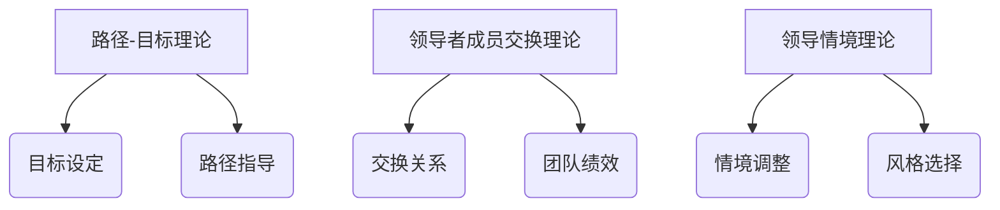

#### 领导力要素之间的关系

领导力的关键要素相互关联，共同影响领导效果。以下是这些要素之间的关系架构：

- **领导风格**直接影响**领导能力**，因为不同的领导风格要求不同的能力。例如，变革型领导需要更强的沟通和变革管理能力。
- **领导能力**又反过来影响**领导力模型**的选择和应用。例如，一个具备较强沟通能力的领导者可能更倾向于使用路径-目标理论。
- **领导力模型**的应用效果又反馈到**领导风格**和**领导能力**的调整，从而形成一个动态的领导过程。

**Mermaid 流程图：**

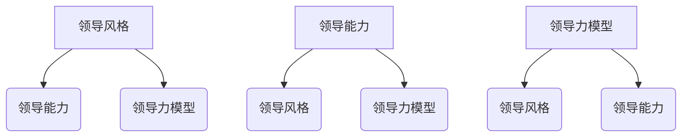

通过理解领导力的关键要素及其相互关系，领导者可以更有效地管理和激励团队成员，从而提升组织的整体绩效。接下来，我们将进一步探讨风险管理的核心概念、原则和方法。

### 风险管理的概念与原则

风险管理是一种系统性的方法，旨在识别、评估和应对潜在的风险，以确保组织能够持续运营并实现其目标。在技术行业中，由于项目的复杂性和不确定性，风险管理尤为重要。以下是风险管理的核心概念、原则和方法。

#### 风险定义

风险是指潜在的事件或情况，如果发生可能会对组织造成不利影响。风险可以定义为两种类型的损失：预期的损失和意外的损失。预期的损失是可预测的，并且组织已经制定了相应的应对措施；而意外的损失则是不可预测的，可能对组织造成严重后果。

风险的定义包括以下三个关键要素：

1. **可能性**：事件发生的概率。例如，技术项目的延期可能发生的概率为50%。
2. **影响**：事件发生后的影响程度。例如，项目延期可能会影响客户满意度，导致收入损失。
3. **不确定性**：无法完全预测事件的发生及其影响。

**Mermaid 流程图：**

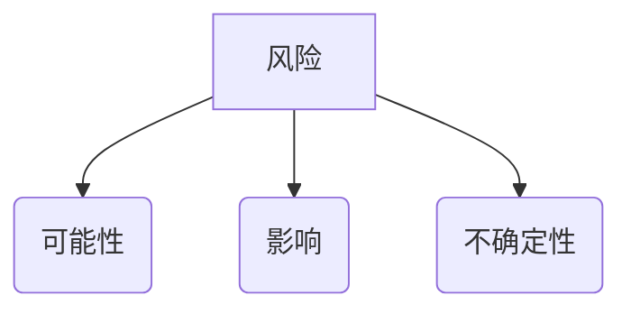

#### 风险管理流程

风险管理流程是一个动态的过程，包括以下关键步骤：

1. **风险识别**：通过系统性的方法识别潜在的风险。这可以通过访谈、问卷调查、文档审查和专家咨询等方式进行。
2. **风险评估**：对识别出的风险进行评估，确定其概率和影响。这通常使用风险矩阵（Risk Matrix）来量化风险。
3. **风险应对**：根据风险评估的结果，制定和执行策略来减轻或消除风险的影响。常见的应对策略包括风险规避、风险转移、风险减轻和风险接受。
4. **风险监控**：持续监控风险状态，确保应对措施的有效性。这可以通过定期审查、更新风险登记册和开展风险评估会议来实现。

**Mermaid 流程图：**

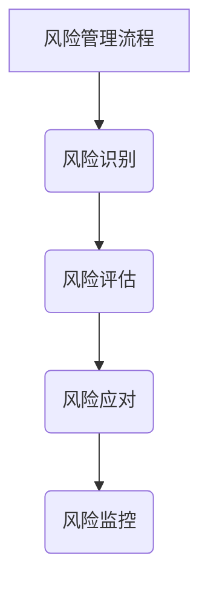

#### 风险管理原则

风险管理应遵循以下核心原则：

1. **预防为主**：通过预防措施来减少风险的发生概率。例如，在项目开发过程中进行严格的代码审查和测试。
2. **全面性**：对各种类型的风险进行全面识别和评估。这包括技术风险、市场风险、财务风险等。
3. **动态调整**：随着环境和情况的变化，及时调整风险管理策略。例如，在项目进度变化时重新评估风险。
4. **集体参与**：鼓励团队成员共同参与风险管理，以提高整体意识和应对能力。这可以通过风险管理培训和工作坊来实现。

**Mermaid 流程图：**

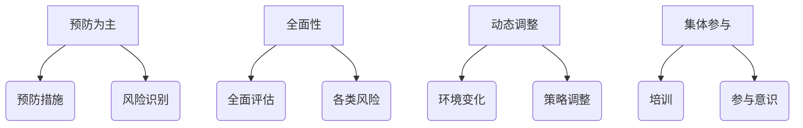

通过理解风险管理的概念和原则，领导者可以更有效地识别和应对潜在风险，从而确保项目的成功和组织的持续发展。接下来，我们将探讨如何通过有效的领导力来提升团队的风险识别和评估能力。

### 提升领导力的策略

在技术行业中，领导力是推动团队成功的关键因素。有效的领导力不仅能够激发团队成员的潜力，还能提高团队的整体绩效和创新能力。以下是一些具体的策略，可以帮助领导者提升领导力。

#### 自我领导力发展

自我领导力发展是领导力提升的基础。领导者需要不断反思和改进自己的行为和思维方式。以下是一些方法：

1. **持续学习**：领导者应保持好奇心，不断学习新技术、新知识和新理念。通过阅读书籍、参加研讨会和在线课程，领导者可以不断更新自己的知识库。
2. **自我反思**：领导者应定期进行自我反思，思考自己在哪些方面做得好，哪些方面需要改进。通过反思，领导者可以识别自己的盲点和改进的方向。
3. **建立个人发展计划**：领导者可以制定一个个人发展计划，包括目标设定、时间规划和行动步骤。这有助于领导者有针对性地提升自己的能力和素质。

**Python 代码示例：**

```python
class PersonalDevelopmentPlan:
    def __init__(self, goals, timeline, actions):
        self.goals = goals
        self.timeline = timeline
        self.actions = actions

    def display_plan(self):
        print("个人发展计划：")
        for i, goal in enumerate(self.goals):
            print(f"{i+1}. 目标：{goal}")
            print(f"   时间线：{self.timeline[i]}")
            print(f"   行动步骤：{self.actions[i]}")

goals = ["学习Python", "掌握机器学习", "提高沟通能力"]
timeline = ["三个月", "六个月", "一年"]
actions = [
    "每天学习Python一小时",
    "参加机器学习课程",
    "每周与团队成员进行一次沟通反馈"
]

plan = PersonalDevelopmentPlan(goals, timeline, actions)
plan.display_plan()
```

#### 团队领导力建设

团队领导力建设是提升整个团队绩效的关键。以下是一些策略：

1. **建立清晰的目标和愿景**：领导者应与团队成员共同制定明确的目标和愿景，使团队成员了解团队的方向和目标。
2. **促进团队协作**：领导者应鼓励团队成员之间的协作，建立信任和开放的沟通环境。通过团队建设活动和定期的团队会议，可以增强团队成员之间的联系和合作。
3. **提供反馈和指导**：领导者应定期给予团队成员反馈和指导，帮助他们识别自己的优势和改进的方向。这有助于团队成员不断进步，提升整体绩效。

**Mermaid 流程图：**

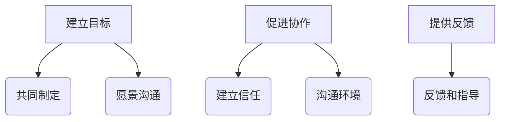

#### 领导力发展计划

为了系统地提升领导力，领导者可以制定一个全面的领导力发展计划。以下是一个示例计划：

1. **领导力培训**：参加领导力培训课程，学习不同的领导风格和技巧。
2. **角色扮演**：通过角色扮演练习，模拟不同的领导情境，提高实际应用能力。
3. **导师制度**：与经验丰富的领导者建立导师关系，获取宝贵的指导和建议。
4. **领导力反馈**：定期接受领导力评估和反馈，了解自己的优势和改进点。

**Mermaid 流程图：**

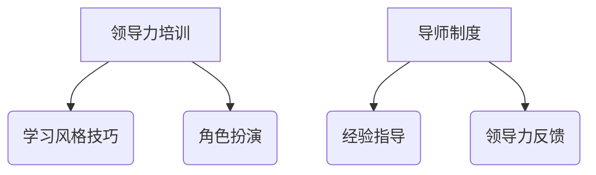

通过这些策略，领导者可以不断提升自己的领导力，从而更好地管理和激励团队成员，推动团队和组织实现长期目标。

### 风险识别与评估方法

在风险管理中，识别和评估风险是关键步骤。通过有效的风险识别和评估，组织可以提前发现潜在问题，并采取相应的预防措施，从而降低风险发生的概率和影响。以下是几种常见的方法，用于风险识别和评估：

#### SWOT分析

SWOT分析是一种广泛使用的战略规划工具，用于识别和评估组织的优势、劣势、机会和威胁。通过SWOT分析，组织可以全面了解内外部环境，从而制定相应的风险管理策略。

1. **优势（Strengths）**：识别组织在资源、能力、市场地位等方面的优势。这些优势可以帮助组织应对潜在风险，例如强大的技术实力和市场影响力。
2. **劣势（Weaknesses）**：识别组织的弱点和不足，这些弱点可能是潜在风险的来源。例如，团队缺乏某些关键技能或资源不足。
3. **机会（Opportunities）**：识别外部环境中可能带来的机会，这些机会可以用来缓解潜在风险。例如，新的市场趋势或技术进步可能为组织提供新的发展机会。
4. **威胁（Threats）**：识别外部环境中可能对组织造成威胁的因素，这些因素可能导致风险发生。例如，竞争对手的新产品发布或政策变化。

**Python 代码示例：**

```python
class SWOTAnalysis:
    def __init__(self, strengths, weaknesses, opportunities, threats):
        self.strengths = strengths
        self.weaknesses = weaknesses
        self.opportunities = opportunities
        self.threats = threats

    def display_analysis(self):
        print("SWOT分析：")
        print("优势：", self.strengths)
        print("劣势：", self.weaknesses)
        print("机会：", self.opportunities)
        print("威胁：", self.threats)

strengths = ["强大的研发团队", "先进的技术", "良好的市场口碑"]
weaknesses = ["资金不足", "市场拓展能力有限", "团队缺乏某些关键技能"]
opportunities = ["新兴市场的机会", "新技术的发展", "合作伙伴关系的扩展"]
threats = ["竞争对手的崛起", "政策变化", "市场需求变化"]

analysis = SWOTAnalysis(strengths, weaknesses, opportunities, threats)
analysis.display_analysis()
```

#### 风险矩阵

风险矩阵是一种用于评估风险概率和影响的方法。通过风险矩阵，组织可以量化风险，并确定优先处理的风险。以下是一个示例风险矩阵：

| 风险类别 | 可能性（低/中/高） | 影响程度（低/中/高） | 优先级 |
| --- | --- | --- | --- |
| 项目延期 | 高 | 中 | 高 |
| 技术故障 | 中 | 高 | 中 |
| 资金短缺 | 低 | 中 | 低 |

在风险矩阵中，每个风险都被评估为低、中或高概率和影响程度，并根据优先级进行排序。这样，组织可以优先处理高优先级的风险，从而降低整体风险水平。

**Mermaid 流程图：**

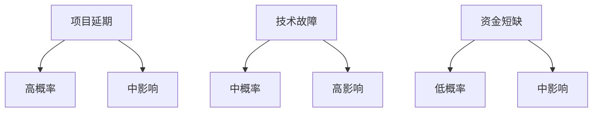

#### 敏感性分析

敏感性分析用于评估不同因素对项目结果的影响程度。通过敏感性分析，组织可以识别关键影响因素，并制定相应的应对策略。以下是一个简单的敏感性分析示例：

1. **目标成本**：100万元
2. **成本因素**：人员工资、材料费用、设备租赁
3. **敏感性分析结果**：
   - 人员工资增加10%，总成本增加5%
   - 材料费用增加10%，总成本增加3%
   - 设备租赁增加10%，总成本增加2%

通过敏感性分析，组织可以识别出人员工资是影响项目成本的关键因素，因此需要重点关注和监控人员工资的变化，并制定相应的风险管理策略。

**Python 代码示例：**

```python
def sensitivity_analysis(cost_factors, increase percentages, total_cost):
    sensitivity_scores = {}
    for factor, increase in zip(cost_factors, increase percentages):
        new_cost = total_cost * (1 + increase / 100)
        sensitivity_scores[factor] = (new_cost - total_cost) / total_cost
    return sensitivity_scores

cost_factors = ["人员工资", "材料费用", "设备租赁"]
increase_percentages = [10, 10, 10]
total_cost = 1000000

sensitivity_scores = sensitivity_analysis(cost_factors, increase_percentages, total_cost)
for factor, score in sensitivity_scores.items():
    print(f"{factor}敏感性得分：{score:.2%}")
```

通过以上风险识别和评估方法，组织可以全面了解潜在风险，并制定有效的风险管理策略，从而降低风险发生的概率和影响。接下来，我们将探讨如何通过有效的领导力来制定应对潜在危机的步骤。

### 应对潜在危机的步骤

在技术行业中，潜在危机可能会对项目的成功和组织的运营造成严重影响。有效的应对策略可以帮助组织减少危机带来的损失，并尽快恢复正常运作。以下是应对潜在危机的四个关键步骤：

#### 危机预警机制

危机预警机制是提前识别潜在危机的重要手段。通过以下方法，组织可以及时发现问题并采取预防措施：

1. **实时监控**：利用技术工具和系统，实时监控关键指标，如项目进度、资源使用和客户满意度。例如，通过项目管理系统监控任务进度和资源分配，通过客户管理系统监控客户反馈。
2. **定期评估**：定期进行风险评估，识别潜在危机的信号。这可以通过定期会议、报告和审查来实现。
3. **预警系统**：建立预警系统，当监控指标超出正常范围时，自动触发警报。例如，当项目延期超过特定阈值时，系统会自动向团队成员和管理层发送警报。

**Python 代码示例：**

```python
class CrisisWarningSystem:
    def __init__(self, thresholds):
        self.thresholds = thresholds

    def check_alerts(self, current_values):
        alerts = []
        for indicator, value in current_values.items():
            if value > self.thresholds[indicator]:
                alerts.append(f"{indicator}超出阈值：{value}")
        return alerts

thresholds = {"项目进度": 80, "资源使用": 90, "客户满意度": 70}
current_values = {"项目进度": 85, "资源使用": 95, "客户满意度": 65}

system = CrisisWarningSystem(thresholds)
alerts = system.check_alerts(current_values)
for alert in alerts:
    print(alert)
```

#### 应急响应计划

在危机发生时，迅速采取行动是关键。应急响应计划应包括以下内容：

1. **应急团队**：建立一支专业的应急团队，负责协调和管理危机应对工作。团队成员应具备相应的技能和经验，能够迅速应对不同类型的危机。
2. **应急流程**：制定明确的应急流程，确保团队成员知道在危机发生时应采取哪些行动。流程应包括危机识别、响应启动、资源调配、信息传递和沟通等步骤。
3. **演练**：定期进行应急演练，确保团队成员熟悉应急流程和操作。通过演练，可以发现潜在问题和不足，及时进行调整。

**Mermaid 流程图：**

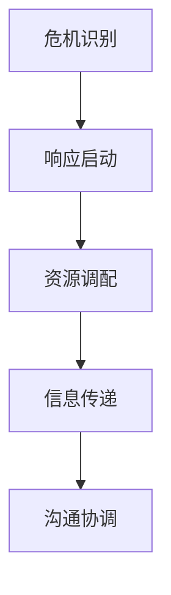

#### 危机应对策略

在危机发生时，采取有效的应对策略可以减少危机带来的影响。以下是一些常见的应对策略：

1. **风险规避**：通过调整项目计划、资源分配或业务流程，避免危机的发生。例如，在技术项目中，可以提前进行风险评估和测试，以预防潜在的技术故障。
2. **风险转移**：通过购买保险、签订合同或与合作伙伴分担风险，将风险转移给第三方。例如，在软件开发项目中，可以购买责任保险，以应对可能的法律诉讼。
3. **风险减轻**：采取措施降低危机发生的概率或减轻危机的影响。例如，在资金短缺的情况下，可以通过优化预算、提高资金利用效率或寻求外部资金支持来缓解危机。
4. **风险接受**：在某些情况下，接受风险可能是最合理的选择。例如，当危机的发生概率非常低，且危机发生的后果可以接受时，可以选择风险接受。

**Python 代码示例：**

```python
class CrisisResponseStrategy:
    def __init__(self, strategy_type, description):
        self.strategy_type = strategy_type
        self.description = description

    def display_strategy(self):
        print(f"策略类型：{self.strategy_type}")
        print(f"描述：{self.description}")

strategies = [
    CrisisResponseStrategy("风险规避", "通过提前测试和风险评估，预防技术故障"),
    CrisisResponseStrategy("风险转移", "购买责任保险，将法律风险转移给保险公司"),
    CrisisResponseStrategy("风险减轻", "优化预算和资金使用，缓解资金短缺"),
    CrisisResponseStrategy("风险接受", "对低概率且可接受的危机，选择接受")
]

for strategy in strategies:
    strategy.display_strategy()
```

#### 后续恢复与反思

危机应对后，组织需要采取措施进行恢复，并从危机中吸取教训。以下是一些关键步骤：

1. **恢复计划**：制定详细的恢复计划，确保组织能够尽快恢复正常运作。恢复计划应包括资源调配、任务分配、沟通协调等步骤。
2. **评估与改进**：对危机应对过程进行评估，识别成功和不足之处。通过反思和总结，组织可以改进危机应对策略，提高未来应对危机的能力。
3. **培训与教育**：对团队成员进行培训和教育，提高他们的危机应对意识和技能。通过案例分析和模拟演练，团队成员可以更好地应对未来可能的危机。

**Mermaid 流程图：**

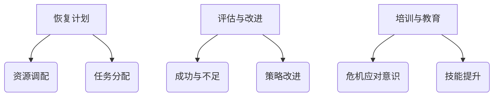

通过以上步骤，组织可以更有效地应对潜在危机，减少危机对组织和项目的影响。有效的危机应对不仅有助于组织度过危机，还能提升组织的应对能力和整体绩效。

### 案例分析

在探讨领导力与风险管理在实际中的应用时，案例分析提供了宝贵的经验和教训。以下分别从领导力失效和成功的案例以及风险管理失败和成功的案例进行分析，以期从中提炼出关键要素和实用策略。

#### 领导力失效案例：特斯拉

**背景**：特斯拉在2018年因CEO埃隆·马斯克（Elon Musk）的一系列失误而陷入了公关危机。马斯克在社交媒体上发表了不当言论，导致公司股价大幅波动，并引发了一系列的法律诉讼和监管审查。

**分析**：
1. **领导风格**：马斯克的领导风格被认为过于独断和缺乏透明度。他在社交媒体上的行为未能有效传达公司愿景，反而引发了公众对公司的负面情绪。
2. **决策能力**：马斯克在应对股价波动和监管审查时的决策显得犹豫不决，缺乏果断和清晰的战略方向。

**教训**：
- 领导者应保持透明度，并确保沟通渠道的畅通，以建立信任和减少误解。
- 领导者在面对重大决策时需要更加谨慎和果断，以避免对公司造成不必要的风险。

#### 领导力成功案例：亚马逊

**背景**：亚马逊在创立初期，杰夫·贝佐斯（Jeff Bezos）展现出了卓越的领导力，带领公司迅速成长为全球领先的电子商务巨头。

**分析**：
1. **愿景与目标**：贝佐斯通过明确的愿景和目标，激励团队成员追求卓越。他提出“Day 1”理念，强调公司应保持创业心态，不断进步和创新。
2. **团队协作**：贝佐斯重视团队合作，鼓励团队成员提出建议和反馈，并通过定期的会议和沟通来促进团队协作。

**经验**：
- 明确的愿景和目标是激励团队成员的关键。
- 领导者应鼓励团队成员的参与和反馈，以促进创新和协作。

#### 风险管理失败案例：三星电子

**背景**：三星电子在2016年因Note7手机电池爆炸事件而遭受重大打击。该事件导致三星在全球范围内召回大量手机，并影响了公司声誉。

**分析**：
1. **风险评估**：三星在产品开发过程中未能充分评估电池安全风险，导致产品发布后出现严重问题。
2. **应急响应**：在事件发生后，三星的应急响应迟缓，未能迅速采取有效措施，导致问题扩大。

**教训**：
- 风险评估应贯穿整个产品开发周期，确保及时发现和解决潜在问题。
- 紧急情况下，应迅速采取行动，以减少危机对组织的负面影响。

#### 风险管理成功案例：微软

**背景**：微软在应对COVID-19疫情时，展现出了卓越的风险管理能力，确保了业务的连续性。

**分析**：
1. **预警机制**：微软在疫情早期就建立了预警机制，及时识别潜在风险，并采取预防措施。
2. **应急响应**：微软迅速调整了业务策略，采用远程办公模式，并确保了关键业务和数据的安全。

**经验**：
- 建立有效的预警机制，以提前识别潜在风险。
- 在危机发生时，快速调整业务策略，确保业务的连续性和稳定性。

通过以上案例分析，我们可以看到，有效的领导力和风险管理是组织成功的关键。领导者需要保持透明度、明确愿景、鼓励团队协作，并在面对危机时迅速采取行动。同时，组织应建立全面的预警机制和应急响应计划，以减少风险对组织的负面影响。

### 结论

在本书籍中，我们探讨了领导力与风险管理之间的紧密联系及其对技术行业的重要性。通过介绍领导力的关键要素、风险管理的核心原则和方法，我们展示了如何通过有效的领导力来预防和应对潜在危机。

**核心观点**：

1. 领导力是一种多维度的能力，涉及领导风格、领导能力和领导力模型。有效的领导力可以激励团队成员，提高团队绩效，并增强组织的整体抗风险能力。
2. 风险管理是一种系统性的方法，包括风险识别、评估、应对和监控。通过有效的风险管理，组织可以降低潜在风险的发生概率和影响，确保项目的成功和组织的持续发展。
3. 领导力与风险管理相互作用，有效的领导力可以促进风险管理，而良好的风险管理也可以反过来提升领导力。

**未来展望**：

未来的技术领域将继续面临复杂和不确定的环境。为了应对这些挑战，领导者需要不断提升自身的领导力和风险管理能力。以下是一些未来的发展方向：

1. **数字化领导力**：随着数字化的加速，领导者需要具备数字素养和领导数字化团队的能力。这包括了解最新的数字技术和工具，以及如何利用这些工具来提升团队绩效。
2. **可持续风险管理**：随着全球关注可持续发展和环境问题，组织需要将风险管理扩展到更广泛的领域，包括环境风险和社会风险。领导者应关注如何在可持续发展方面发挥领导作用。
3. **人工智能与风险管理**：人工智能技术的发展为风险管理提供了新的工具和方法。领导者应探索如何利用人工智能来提高风险识别、评估和应对的效率。

**对领导者和风险管理者的建议**：

1. **持续学习和自我反思**：领导者应保持持续学习的态度，不断更新知识和技能。通过自我反思，识别自己的盲点和改进方向。
2. **建立高效的团队**：领导者应注重团队建设，建立开放和信任的团队文化。通过有效的沟通和协作，提高团队的整体绩效。
3. **制定全面的风险管理策略**：风险管理者应制定全面的策略，涵盖各种类型的风险，并确保策略的动态调整。同时，领导者应确保团队成员参与风险管理，提高整体风险意识。

通过以上措施，领导者和风险管理者可以更好地应对未来的挑战，推动组织实现长期成功。

### 附录

#### A.1 参考文献

1. Greenleaf, R. K. (1977). **Servant Leadership: A Journey into the Nature of Legitimate Power and Greatness**. Paulist Press.
2. Bass, B. M., & Avolio, B. J. (1994). ** Transformational Leadership and Alienation**. Leadership Quarterly, 5(3), 219-240.
3.显庆，刘。**风险管理：理论与实务**。中国人民大学出版社，2018。
4.马斯洛，亚伯拉罕。**动机与人格**。中国人民大学出版社，1987。
5.波音，D.，巴特利特，C.A.**企业风险管理：框架与实例**。清华大学出版社，2012。

#### A.2 领导力与风险管理工具清单

1. **领导力评估工具**：
   - 360度反馈
   - 领导力问卷
   - 领导力发展计划

2. **风险管理工具**：
   - 风险矩阵
   - 敏感性分析
   - SWOT分析

3. **技术工具**：
   - 项目管理系统
   - 风险管理系统
   - 远程办公和协作工具

4. **培训资源**：
   - 领导力培训课程
   - 风险管理研讨会
   - 在线学习平台

通过使用这些工具和资源，领导者和风险管理者可以更有效地提升自身能力，并管理好组织和团队面临的各种挑战。

