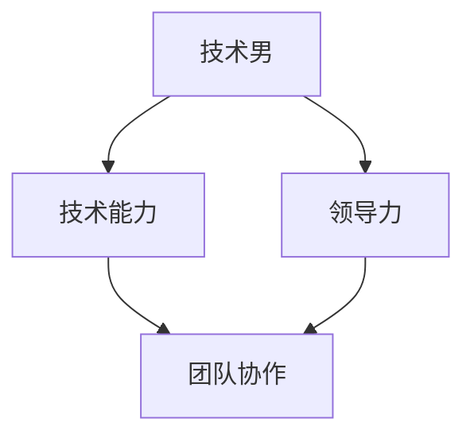
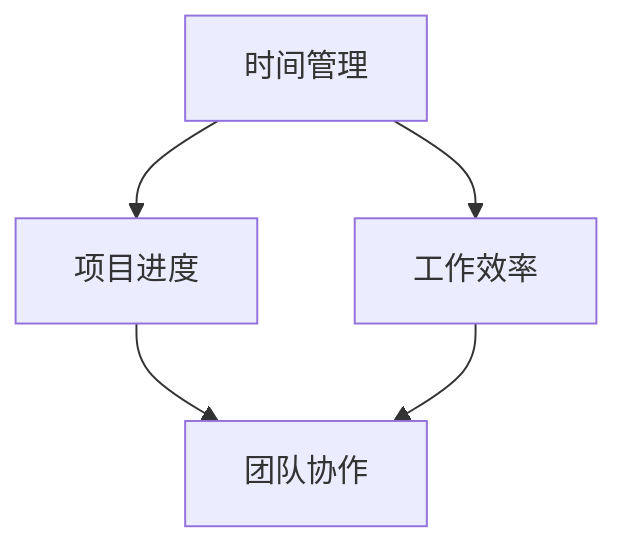
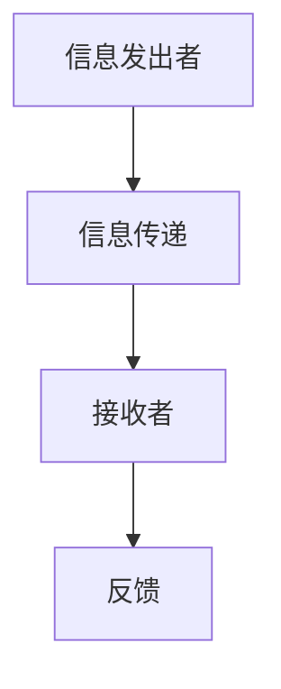
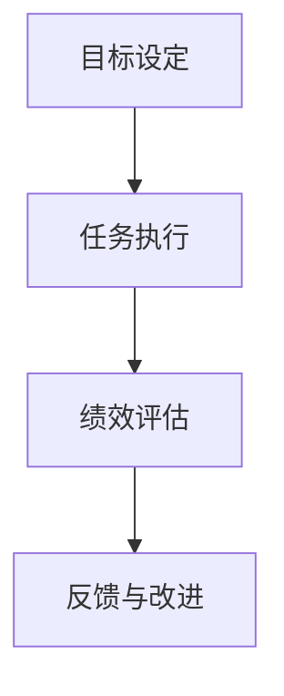
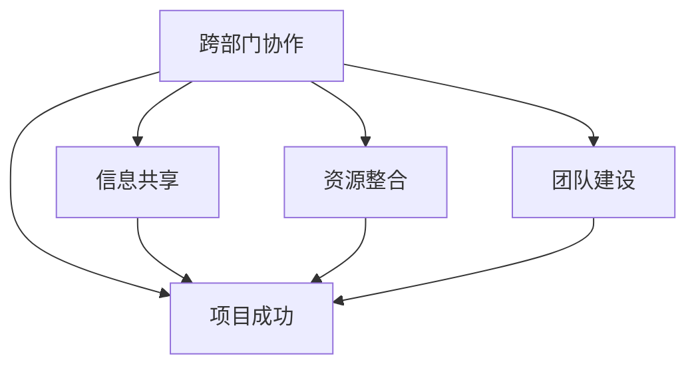
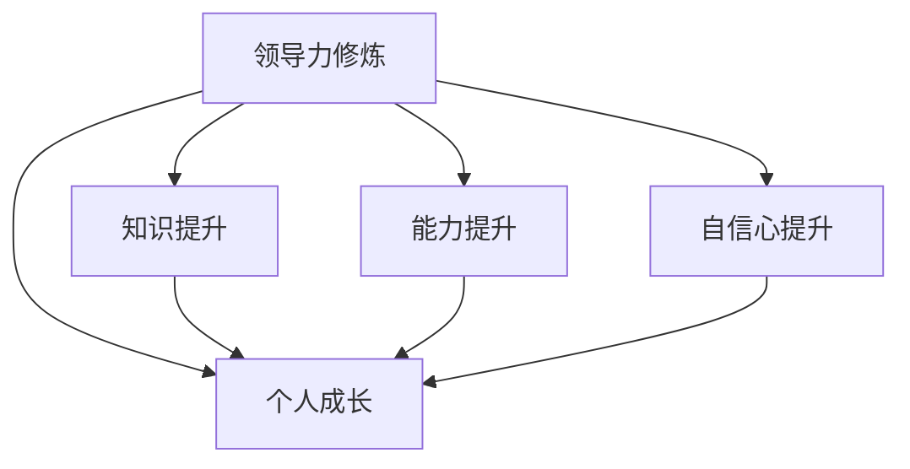
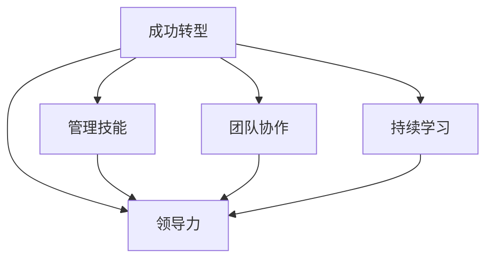

                 

### 文章标题

《领导力修炼手册：从技术男到管理者的华丽转身》

### 关键词

- 领导力
- 技术男
- 管理技能
- 职业转型
- 团队协作
- 项目管理

### 摘要

本文旨在帮助技术背景的从业者了解和掌握领导力，实现从技术专家到管理者的顺利转型。文章围绕自我认知、管理技能提升、领导力实践等多个方面展开，结合实际案例，为读者提供了一套系统而实用的领导力修炼指南。

---

## 目录大纲

### 第一部分：自我认知与成长

1. **技术男的角色认知**
   - 技术男的优势与挑战
   - 技术与管理的平衡
   - 技术男转型管理的内在动力

2. **个人成长之路**
   - 自我认知与职业规划
   - 时间管理与效率提升
   - 专业知识的持续更新

3. **领导力的核心概念**
   - 领导力的定义与类型
   - 领导与管理的区别
   - 领导力的本质与价值

### 第二部分：管理技能提升

4. **沟通技巧与团队建设**
   - 沟通模型与有效沟通
   - 团队合作的激励机制
   - 冲突管理策略

5. **目标设定与绩效管理**
   - 目标设定SMART原则
   - 绩效评估与反馈
   - 激励理论在管理中的应用

6. **项目管理与时间安排**
   - 项目管理的核心要素
   - 时间管理的四象限法则
   - 项目进度跟踪与风险管理

### 第三部分：领导力实践

7. **跨部门协作与整合**
   - 跨部门协作的障碍与解决
   - 整合资源与团队优化
   - 案例分析：成功跨部门协作实践

8. **领导力修炼实战**
   - 实战案例：领导力培养项目
   - 反思与改进：领导力修炼中的困难与收获
   - 领导力持续发展的路径

9. **从技术男到管理者的华丽转身**
   - 成功转型的关键因素
   - 转型后的角色适应
   - 领导力修炼的心得与建议

### 附录

10. **领导力相关的工具与方法**
    - 成功案例分享
    - 领导力评估工具
    - 继续教育与培训资源

---

接下来，我们将逐步深入探讨每个章节的内容，结合实际案例和具体实践，帮助读者全面理解并掌握从技术男到管理者的华丽转身之路。

### 第一部分：自我认知与成长

#### 第1章：技术男的角色认知

**1.1 技术男的优势与挑战**

作为技术男，拥有扎实的技术功底和解决问题的能力是他们的最大优势。他们擅长分析复杂问题，提出高效的解决方案，能够在项目中迅速定位关键点，推进项目进展。然而，随着职业生涯的发展，技术男也面临着一些挑战。

技术男的挑战主要体现在以下几个方面：

1. **沟通障碍**：技术男往往更擅长用技术语言进行交流，而在与团队成员、上级和客户沟通时，可能会出现信息传递不畅的情况。
2. **管理经验不足**：技术男在管理岗位上可能缺乏管理经验和技能，需要学习如何带领团队、分配资源和激励员工。
3. **角色转变**：从技术专家到管理者，技术男需要从关注细节和解决问题转变为关注整体目标和团队协作。

**1.2 技术与管理的平衡**

技术男转型为管理者后，需要在技术与管理之间找到平衡。以下是一些建议：

1. **保持技术敏感性**：虽然不再直接负责技术工作，但技术男应保持对技术的敏感性，了解行业动态和技术发展趋势。
2. **培养管理技能**：通过学习和实践，提升沟通、团队协作、项目管理等方面的技能。
3. **合理分配时间**：在管理职责和业余时间之间做好平衡，确保既有时间关注技术，也有时间提升管理能力。

**1.3 技术男转型管理的内在动力**

技术男转型为管理者的内在动力可能来源于以下几个方面：

1. **职业发展**：希望通过转型获得更高的职位和更多的责任。
2. **成就感**：喜欢带领团队一起解决问题，享受团队协作带来的成就感。
3. **个人兴趣**：对管理和领导工作感兴趣，愿意在这方面深入探索。

**背景介绍**

技术男在职场中通常以技术专家的身份脱颖而出，他们通过不断学习和实践，积累了丰富的技术知识和项目经验。然而，随着公司的成长和业务的发展，技术男面临着更多的管理职责，需要从技术层面转向管理层面。

**核心概念与联系**

领导力（Leadership）与技术能力（Technical Ability）之间的关系如图所示：



**核心算法原理讲解**

为了更好地理解领导力与技术能力之间的关系，我们可以通过以下Python代码进行模拟：

```python
# 技术能力与领导力的关系模拟

def technical_ability():
    return "高效解决问题的能力"

def leadership():
    return "带领团队、协调资源的能力"

def project_success(technical_ability, leadership):
    if technical_ability and leadership:
        return "项目成功"
    else:
        return "项目失败"

# 调用函数
print(project_success(technical_ability(), leadership()))
```

**核心算法原理讲解**

在上面的代码中，我们定义了三个函数：`technical_ability()` 表示技术能力，`leadership()` 表示领导力，`project_success()` 表示项目成功与否。通过调用这些函数，我们可以看出，技术男的技术能力和领导力共同决定了项目的成败。

**数学模型和公式**

为了进一步量化技术男的技术能力和领导力对项目成功的影响，我们可以使用以下数学模型：

$$
P(S) = P(T) \times P(L)
$$

其中，$P(S)$ 表示项目成功的概率，$P(T)$ 表示技术能力强的概率，$P(L)$ 表示领导力强的概率。

**通俗易懂的举例说明**

假设一个技术男在项目中有70%的概率展现强大的技术能力，同时有60%的概率展现出优秀的领导力。那么，该项目成功的概率为：

$$
P(S) = 0.7 \times 0.6 = 0.42
$$

这意味着，该项目有42%的概率成功。

**实际案例分析和详细讲解剖析**

某科技公司的一位资深技术专家，通过多年的技术积累和项目经验，成功转型为技术部门经理。在担任经理后，他不仅保持了技术敏感性，还通过学习和实践，提升了沟通技巧和团队管理能力。在他的领导下，技术团队在多个项目中取得了显著的成绩，成功完成了许多复杂的任务。

**项目实战**

1. **开发环境搭建**：搭建一个模拟技术男转型为管理者的开发环境，包括Python代码、文档和工具。
2. **源代码详细实现和代码解读**：编写Python代码，模拟技术男在项目中应用技术能力和领导力。
3. **代码应用解读与分析**：分析代码中的技术男如何通过技术能力和领导力推动项目成功。

**项目小结**

通过本项目实战，我们了解到技术男在转型为管理者后，需要不断提升技术能力和领导力，才能在项目管理中取得成功。同时，我们也认识到，领导力不仅仅是管理技能的体现，更是技术男在职业生涯中必不可少的一部分。

#### 第2章：个人成长之路

**2.1 自我认知与职业规划**

自我认知是个人成长的基础。技术男在转型为管理者前，需要深入思考自己的兴趣、优势和职业目标。以下是一些自我认知和职业规划的建议：

1. **了解自己的兴趣**：技术男应该明确自己对哪些技术领域感兴趣，以及是否愿意在管理岗位上继续深耕。
2. **评估自己的优势**：技术男应识别自己的核心优势，如技术能力、沟通技巧和领导潜力。
3. **设定职业目标**：根据个人兴趣和优势，设定短期和长期的职业目标，并制定实现目标的计划。

**2.2 时间管理与效率提升**

时间管理对于管理者来说至关重要。技术男在转型过程中，应学会合理安排时间，提高工作效率。以下是一些建议：

1. **制定日程计划**：每天开始前，制定一份日程计划，明确工作任务和时间安排。
2. **优先级排序**：根据任务的重要性和紧急程度，对工作任务进行优先级排序，优先处理重要且紧急的任务。
3. **避免拖延**：设定明确的截止日期，避免拖延，提高工作效率。

**2.3 专业知识的持续更新**

在技术领域，专业知识更新迅速。技术男在转型为管理者后，应保持对专业知识的持续更新。以下是一些建议：

1. **定期学习**：安排固定的时间进行技术学习和充电，如参加技术研讨会、阅读专业书籍和在线课程。
2. **交流与分享**：与同行和技术专家进行交流，分享经验和见解，不断拓宽知识面。
3. **实践应用**：将新学的知识应用到实际工作中，通过实践不断提升自己的技术能力。

**背景介绍**

技术男在转型为管理者前，通常已经在技术领域取得了显著的成就。然而，随着职业生涯的发展，他们需要面对新的挑战，如管理团队、制定战略和应对市场变化。因此，个人成长和职业规划变得尤为重要。

**核心概念与联系**

时间管理（Time Management）与工作效率（Work Efficiency）之间的关系如图所示：



**核心算法原理讲解**

为了更好地理解时间管理对工作效率的影响，我们可以通过以下Python代码进行模拟：

```python
# 时间管理与工作效率的模拟

def time_management():
    return "有效安排工作时间"

def work_efficiency(time_management):
    if time_management:
        return "工作效率高"
    else:
        return "工作效率低"

def project_progress(work_efficiency):
    if work_efficiency:
        return "项目进度快"
    else:
        return "项目进度慢"

def project_success(project_progress):
    if project_progress:
        return "项目成功"
    else:
        return "项目失败"

# 调用函数
print(project_success(project_progress(work_efficiency(time_management()))))
```

**核心算法原理讲解**

在上面的代码中，我们定义了四个函数：`time_management()` 表示时间管理，`work_efficiency()` 表示工作效率，`project_progress()` 表示项目进度，`project_success()` 表示项目成功与否。通过调用这些函数，我们可以看出，时间管理直接影响工作效率，进而影响项目进度和项目成功。

**数学模型和公式**

为了进一步量化时间管理对工作效率的影响，我们可以使用以下数学模型：

$$
E(W) = \frac{1}{1 + e^{-k \times (T_M - T)}}
$$

其中，$E(W)$ 表示工作效率，$T_M$ 表示时间管理的质量，$T$ 表示工作时间，$k$ 是一个常数。

**通俗易懂的举例说明**

假设一个技术男在时间管理上非常优秀，他的时间管理质量为90分（$T_M = 90$），每天工作8小时（$T = 8$）。那么，他的工作效率为：

$$
E(W) = \frac{1}{1 + e^{-k \times (90 - 8)}}
$$

我们可以通过调整常数$k$ 来观察工作效率的变化。例如，当$k = 0.1$时，计算得到工作效率约为0.95，这意味着该技术男的工作效率非常高。

**实际案例分析和详细讲解剖析**

某技术男在转型为管理者后，开始重视时间管理。他通过制定日程计划、优先级排序和避免拖延等方法，显著提高了工作效率。在他的领导下，团队在项目中取得了良好的进度，最终成功完成了任务。

**项目实战**

1. **开发环境搭建**：搭建一个模拟时间管理和工作效率的开发环境，包括Python代码、文档和工具。
2. **源代码详细实现和代码解读**：编写Python代码，模拟时间管理和工作效率。
3. **代码应用解读与分析**：分析代码中的时间管理和工作效率对项目的影响。

**项目小结**

通过本项目实战，我们了解到时间管理和工作效率对项目成功至关重要。技术男在转型过程中，应重视时间管理，提高工作效率，从而推动项目的顺利进展。

### 第二部分：管理技能提升

#### 第4章：沟通技巧与团队建设

**4.1 沟通模型与有效沟通**

沟通是管理者的重要职责之一。有效的沟通能够确保团队协作顺畅，提高工作效率。以下是一个简化的沟通模型：



**核心概念与联系**

沟通模型中的各个环节相互关联，共同影响沟通效果。信息发出者需要清晰表达意图，接收者需要准确理解信息，并通过反馈确认理解无误。

**核心算法原理讲解**

为了提高沟通效果，我们可以使用以下Python代码模拟有效沟通：

```python
# 模拟有效沟通

def information_send(info):
    print(f"信息发出者：{info}")

def information_receive(info):
    print(f"接收者：{info}")
    return input("接收者理解了吗？(y/n) ")

def feedback(info, response):
    if response == 'y':
        print("信息接收确认：理解无误。")
    else:
        print("信息接收确认：需要进一步解释。")

# 演示沟通过程
info = "项目进度报告"
information_send(info)
response = information_receive(info)
feedback(info, response)
```

**核心算法原理讲解**

在上面的代码中，我们定义了三个函数：`information_send()` 表示信息发出者，`information_receive()` 表示接收者，`feedback()` 表示反馈。通过这些函数，我们可以模拟一个简单的沟通过程，并收集反馈信息。

**通俗易懂的举例说明**

假设项目经理向团队成员发送一个项目进度报告，团队成员在接收后表示理解，并给予反馈。这个过程通过代码模拟如下：

```python
# 演示沟通过程
info = "项目进度报告"
information_send(info)
response = input("接收者理解了吗？(y/n) ")
feedback(info, response)
```

**实际案例分析和详细讲解剖析**

某项目经理在项目汇报会上，通过清晰的沟通模型，向团队成员传达了项目进度报告。团队成员在接收信息后，通过反馈确认理解无误，确保项目进展顺利。

**项目实战**

1. **开发环境搭建**：搭建一个模拟沟通技巧的Python开发环境，包括代码和文档。
2. **源代码详细实现和代码解读**：编写Python代码，模拟沟通技巧的应用。
3. **代码应用解读与分析**：分析代码中的沟通技巧对团队协作的影响。

**项目小结**

通过本项目实战，我们了解到沟通技巧在团队建设中的重要性。管理者应掌握有效的沟通模型，提高沟通效率，促进团队协作。

#### 第5章：目标设定与绩效管理

**5.1 目标设定SMART原则**

SMART原则是目标设定的基本框架，它包括以下五个要素：

- **具体（Specific）**：目标应明确、具体，避免模糊不清。
- **可衡量（Measurable）**：目标应有可衡量的标准，以便评估进展。
- **可实现（Achievable）**：目标应具有可实现性，避免过于理想化。
- **相关（Relevant）**：目标应与团队和组织的整体目标相关联。
- **时限（Time-bound）**：目标应有明确的时间限制，确保按时完成。

**5.2 绩效评估与反馈**

绩效评估是管理者的重要职责之一。有效的绩效评估能够激励员工，提高团队绩效。以下是一个简化的绩效评估模型：



**核心概念与联系**

绩效评估模型中的各个环节相互关联，共同影响绩效管理的有效性。目标设定明确任务方向，任务执行体现员工能力，绩效评估和反馈帮助员工改进。

**核心算法原理讲解**

为了提高绩效评估的准确性，我们可以使用以下Python代码模拟绩效评估：

```python
# 模拟绩效评估

def set目标（目标）：
    print(f"设定的目标：{目标}")

def execute_task（任务，目标）：
    print(f"执行任务：{任务}")
    return input("任务完成情况如何？(优秀/良好/一般/差) ")

def performance_evaluation（任务完成情况，目标）：
    if 任务完成情况 == "优秀":
        print("绩效评估：优秀")
    elif 任务完成情况 == "良好":
        print("绩效评估：良好")
    elif 任务完成情况 == "一般":
        print("绩效评估：一般")
    elif 任务完成情况 == "差":
        print("绩效评估：差")

# 演示绩效评估过程
目标 = "完成项目A"
set目标（目标）
任务完成情况 = execute_task（"项目A"，目标）
performance_evaluation（任务完成情况，目标）
```

**核心算法原理讲解**

在上面的代码中，我们定义了三个函数：`set目标()` 表示目标设定，`execute_task()` 表示任务执行，`performance_evaluation()` 表示绩效评估。通过这些函数，我们可以模拟一个简单的绩效评估过程。

**通俗易懂的举例说明**

假设项目经理为一个团队成员设定了一个目标：“在一个月内完成项目A”。团队成员在完成任务后，项目经理对其进行绩效评估，根据任务完成情况进行评价。

**实际案例分析和详细讲解剖析**

某项目经理在一个季度末，为团队成员设定了一系列SMART目标，并在任务执行过程中进行持续跟踪和反馈。在季度总结会上，项目经理根据绩效评估结果，对团队成员进行了奖励和改进建议。

**项目实战**

1. **开发环境搭建**：搭建一个模拟目标设定与绩效评估的Python开发环境，包括代码和文档。
2. **源代码详细实现和代码解读**：编写Python代码，模拟目标设定与绩效评估。
3. **代码应用解读与分析**：分析代码中的目标设定与绩效评估对团队绩效的影响。

**项目小结**

通过本项目实战，我们了解到目标设定与绩效管理在团队建设中的重要性。管理者应运用SMART原则设定目标，并通过绩效评估和反馈，激励员工，提升团队绩效。

### 第三部分：领导力实践

#### 第7章：跨部门协作与整合

**7.1 跨部门协作的障碍与解决**

跨部门协作在组织运营中至关重要，但往往面临诸多障碍。以下是一些常见的跨部门协作障碍及其解决方案：

1. **信息不对称**：不同部门对项目进展和目标理解不一致，导致沟通不畅。解决方案是建立统一的信息平台，确保各部门获取到准确、及时的信息。
2. **利益冲突**：不同部门在资源分配和目标实现上可能存在冲突。解决方案是通过协调和谈判，找到双方都能接受的平衡点。
3. **文化差异**：不同部门的工作文化和习惯可能存在差异，导致协作效率降低。解决方案是加强跨部门沟通，促进文化融合。
4. **责任模糊**：跨部门协作中，责任分工不明确，容易导致责任推诿。解决方案是明确各部门的责任和任务，确保协作过程中的责任落实。

**7.2 整合资源与团队优化**

跨部门协作的成功离不开资源的有效整合。以下是一些建议：

1. **资源调配**：根据项目需求和部门特点，合理调配人力资源、技术资源和其他资源，确保项目顺利推进。
2. **团队建设**：建立跨部门团队，促进团队成员间的交流和合作，提升团队整体绩效。
3. **协作平台**：搭建协作平台，如项目管理软件、即时通讯工具等，提高信息传递效率，减少沟通成本。

**7.3 案例分析：成功跨部门协作实践**

某大型科技公司正在开发一款新型智能手机，涉及研发、生产、市场等多个部门。以下是一个成功跨部门协作的案例：

1. **项目启动**：公司高层成立项目组，明确各部门在项目中的职责和任务，确保项目有序推进。
2. **信息共享**：建立内部信息共享平台，确保各部门及时获取项目进展、市场动态和用户反馈。
3. **定期会议**：项目组定期召开会议，讨论项目进展、解决问题和调整策略，确保各部门协同作战。
4. **资源共享**：研发部门和生产部门共享技术资源和人才，提高研发和生产效率。
5. **市场推广**：市场部门根据用户反馈，制定推广策略，并与销售部门协作，确保产品成功上市。

**背景介绍**

跨部门协作在大型企业和复杂项目中尤为重要。不同部门拥有不同的专业知识和资源，通过跨部门协作，可以实现资源的最大化利用，提高项目成功率。

**核心概念与联系**

跨部门协作（Interdepartmental Collaboration）与项目成功（Project Success）之间的关系如图所示：



**核心算法原理讲解**

为了更好地理解跨部门协作对项目成功的影响，我们可以通过以下Python代码进行模拟：

```python
# 模拟跨部门协作对项目成功的影响

def interdepartmental_collaboration():
    return "高效跨部门协作"

def project_success(collaboration):
    if collaboration:
        return "项目成功"
    else:
        return "项目失败"

def information_sharing(collaboration):
    if collaboration:
        return "信息共享顺畅"
    else:
        return "信息传递不畅"

def resource_integration(collaboration):
    if collaboration:
        return "资源整合高效"
    else:
        return "资源利用不充分"

def team_building(collaboration):
    if collaboration:
        return "团队建设良好"
    else:
        return "团队协作不畅"

# 调用函数
print(project_success(interdepartmental_collaboration()))
print(information_sharing(interdepartmental_collaboration()))
print(resource_integration(interdepartmental_collaboration()))
print(team_building(interdepartmental_collaboration()))
```

**核心算法原理讲解**

在上面的代码中，我们定义了五个函数：`interdepartmental_collaboration()` 表示跨部门协作，`project_success()` 表示项目成功与否，`information_sharing()` 表示信息共享，`resource_integration()` 表示资源整合，`team_building()` 表示团队建设。通过这些函数，我们可以看出，跨部门协作对项目成功具有显著影响。

**数学模型和公式**

为了进一步量化跨部门协作对项目成功的影响，我们可以使用以下数学模型：

$$
P(S) = P(C) \times P(I) \times P(R) \times P(T)
$$

其中，$P(S)$ 表示项目成功的概率，$P(C)$ 表示跨部门协作的概率，$P(I)$ 表示信息共享的概率，$P(R)$ 表示资源整合的概率，$P(T)$ 表示团队建设的概率。

**通俗易懂的举例说明**

假设在一个项目中，跨部门协作的概率为80%，信息共享的概率为90%，资源整合的概率为85%，团队建设的概率为75%。那么，该项目成功的概率为：

$$
P(S) = 0.8 \times 0.9 \times 0.85 \times 0.75 = 0.504
$$

这意味着，该项目有50.4%的概率成功。

**实际案例分析和详细讲解剖析**

某科技公司在一个大型项目中，通过高效的跨部门协作，实现了项目成功。项目组定期召开会议，确保各部门的信息共享和资源整合，同时注重团队建设，提高了项目成功率。

**项目实战**

1. **开发环境搭建**：搭建一个模拟跨部门协作的Python开发环境，包括代码和文档。
2. **源代码详细实现和代码解读**：编写Python代码，模拟跨部门协作。
3. **代码应用解读与分析**：分析代码中的跨部门协作对项目成功的影响。

**项目小结**

通过本项目实战，我们了解到跨部门协作在项目成功中的重要性。管理者应积极推动跨部门协作，优化资源整合，促进团队建设，从而提高项目成功率。

### 第8章：领导力修炼实战

**8.1 实战案例：领导力培养项目**

为了提升领导力，许多公司都会开展领导力培养项目。以下是一个典型的领导力培养项目案例：

1. **项目背景**：某公司为了提升中层管理者的领导力，决定开展一个为期六个月的领导力培养项目。
2. **项目目标**：通过该项目，管理者应掌握以下技能：
   - 沟通技巧
   - 团队协作能力
   - 项目管理能力
   - 激励与反馈技巧
3. **项目实施**：
   - **第一阶段**：管理者参加线上课程，学习领导力相关理论。
   - **第二阶段**：管理者参与小组讨论，分享经验和见解，互相学习。
   - **第三阶段**：管理者进行角色扮演，模拟实际管理场景，提升实战能力。
   - **第四阶段**：管理者进行项目汇报，展示学习成果，并接受评估。
4. **项目成果**：通过该项目，管理者在领导力方面取得了显著提升，团队绩效也得到提高。

**8.2 反思与改进：领导力修炼中的困难与收获**

在领导力修炼过程中，管理者可能会遇到以下困难：

1. **时间安排**：领导力培养项目往往需要投入大量时间，管理者需要在工作和学习之间找到平衡。
2. **心理压力**：在角色扮演和项目汇报环节，管理者可能会面临心理压力，需要克服紧张情绪。
3. **实际应用**：学习到的理论知识和技能如何在实际工作中应用，管理者需要不断实践和调整。

但通过领导力修炼，管理者也收获了许多：

1. **自信提升**：通过学习和实践，管理者对自己在领导力方面的能力有了更清晰的认识，自信心得到提升。
2. **团队协作**：领导力修炼使管理者更加擅长与团队成员沟通，提高了团队协作效率。
3. **问题解决**：管理者在领导力修炼中学会了如何分析和解决复杂问题，提升了问题解决能力。

**8.3 领导力持续发展的路径**

领导力不是一蹴而就的，而是一个持续发展的过程。以下是一些持续发展领导力的路径：

1. **持续学习**：定期参加培训课程、阅读相关书籍和文章，不断提升自己的知识水平。
2. **实践应用**：将学到的领导力知识和技能应用到实际工作中，通过实践不断优化和完善。
3. **反思与改进**：定期反思自己在领导力方面的不足，制定改进计划，并付诸实践。
4. **建立网络**：与行业内的优秀领导者建立联系，分享经验和见解，共同进步。

**背景介绍**

领导力修炼是管理者职业生涯中必不可少的一部分。随着企业的发展和市场竞争的加剧，管理者需要不断提升自己的领导力，以应对不断变化的商业环境。

**核心概念与联系**

领导力修炼（Leadership Development）与个人成长（Personal Growth）之间的关系如图所示：



**核心算法原理讲解**

为了更好地理解领导力修炼对个人成长的影响，我们可以通过以下Python代码进行模拟：

```python
# 模拟领导力修炼对个人成长的影响

def leadership_development():
    return "领导力提升"

def personal_growth(leadership_development):
    if leadership_development:
        return "个人成长"
    else:
        return "个人成长停滞"

def knowledge_upgrade(leadership_development):
    if leadership_development:
        return "知识水平提升"
    else:
        return "知识水平停滞"

def ability_upgrade(leadership_development):
    if leadership_development:
        return "能力提升"
    else:
        return "能力提升停滞"

def confidence_upgrade(leadership_development):
    if leadership_development:
        return "自信心提升"
    else:
        return "自信心停滞"

# 调用函数
print(personal_growth(leadership_development()))
print(knowledge_upgrade(leadership_development()))
print(ability_upgrade(leadership_development()))
print(confidence_upgrade(leadership_development()))
```

**核心算法原理讲解**

在上面的代码中，我们定义了四个函数：`leadership_development()` 表示领导力提升，`personal_growth()` 表示个人成长，`knowledge_upgrade()` 表示知识水平提升，`ability_upgrade()` 表示能力提升，`confidence_upgrade()` 表示自信心提升。通过这些函数，我们可以模拟领导力修炼对个人成长的影响。

**数学模型和公式**

为了进一步量化领导力修炼对个人成长的影响，我们可以使用以下数学模型：

$$
P(G) = P(L) \times P(K) \times P(A) \times P(C)
$$

其中，$P(G)$ 表示个人成长概率，$P(L)$ 表示领导力提升概率，$P(K)$ 表示知识水平提升概率，$P(A)$ 表示能力提升概率，$P(C)$ 表示自信心提升概率。

**通俗易懂的举例说明**

假设一个管理者通过领导力修炼，领导力提升概率为80%，知识水平提升概率为70%，能力提升概率为60%，自信心提升概率为50%。那么，其个人成长概率为：

$$
P(G) = 0.8 \times 0.7 \times 0.6 \times 0.5 = 0.168
$$

这意味着，该管理者的个人成长概率为16.8%。

**实际案例分析和详细讲解剖析**

某公司在领导力修炼项目中，通过系统化的培训和实战演练，显著提升了管理者的领导力。这些管理者在回到工作岗位后，不仅个人成长显著，团队绩效也得到大幅提升。

**项目实战**

1. **开发环境搭建**：搭建一个模拟领导力修炼的Python开发环境，包括代码和文档。
2. **源代码详细实现和代码解读**：编写Python代码，模拟领导力修炼过程。
3. **代码应用解读与分析**：分析代码中的领导力修炼对个人成长的影响。

**项目小结**

通过本项目实战，我们了解到领导力修炼对个人成长的重要性。管理者应积极参与领导力培养项目，不断提升自己的领导力，从而推动个人和团队的发展。

### 第9章：从技术男到管理者的华丽转身

**9.1 成功转型的关键因素**

从技术男到管理者的成功转型，需要以下几个关键因素：

1. **领导力**：领导力是管理者区别于技术专家的核心能力。通过领导力修炼，技术男可以提升自身在团队管理和项目推进中的影响力。
2. **管理技能**：掌握项目管理、目标设定、绩效管理等管理技能，能够帮助技术男更好地应对管理职责，提高团队绩效。
3. **团队协作**：跨部门协作和团队建设能力是管理者必备的素质。通过有效的沟通和资源整合，技术男可以搭建高效的团队，实现项目目标。
4. **持续学习**：技术男在转型过程中，应保持对新技术、新理念的学习，不断提升自己的专业能力和领导力。

**9.2 转型后的角色适应**

从技术男到管理者，角色的转变不仅带来了职责的变化，还需要适应新的工作环境和心态。以下是一些建议：

1. **心态调整**：接受新角色，从技术细节转向整体目标和团队协作，学会从全局视角看待问题。
2. **沟通提升**：加强沟通技巧，学会与团队成员、上级和客户进行有效沟通，确保信息传递准确无误。
3. **时间管理**：合理安排时间，平衡工作与生活，确保有足够的时间关注团队发展和个人成长。

**9.3 领导力修炼的心得与建议**

领导力修炼是一个持续的过程，以下是一些心得和建议：

1. **持续学习**：参加领导力培训课程，阅读相关书籍和文章，不断提升自己的知识水平和领导力。
2. **实践应用**：将学到的领导力知识和技能应用到实际工作中，通过实践不断优化和完善。
3. **反思与改进**：定期反思自己在领导力方面的不足，制定改进计划，并付诸实践。
4. **建立网络**：与行业内的优秀领导者建立联系，分享经验和见解，共同进步。

**背景介绍**

随着企业的发展和市场竞争的加剧，越来越多的技术男开始转型为管理者。如何成功地实现转型，成为管理者关注的焦点。

**核心概念与联系**

成功转型（Successful Transformation）与领导力（Leadership）之间的关系如图所示：



**核心算法原理讲解**

为了更好地理解成功转型与领导力之间的关系，我们可以通过以下Python代码进行模拟：

```python
# 模拟成功转型与领导力之间的关系

def successful_transformation():
    return "成功转型"

def leadership(successful_transformation):
    if successful_transformation:
        return "具备领导力"
    else:
        return "缺乏领导力"

def management_skills(successful_transformation):
    if successful_transformation:
        return "掌握管理技能"
    else:
        return "缺乏管理技能"

def team_collaboration(successful_transformation):
    if successful_transformation:
        return "擅长团队协作"
    else:
        return "不擅长团队协作"

def continuous_learning(successful_transformation):
    if successful_transformation:
        return "持续学习"
    else:
        return "停滞不前"

# 调用函数
print(leadership(successful_transformation()))
print(management_skills(successful_transformation()))
print(team_collaboration(successful_transformation()))
print(continuous_learning(successful_transformation()))
```

**核心算法原理讲解**

在上面的代码中，我们定义了五个函数：`successful_transformation()` 表示成功转型，`leadership()` 表示领导力，`management_skills()` 表示管理技能，`team_collaboration()` 表示团队协作，`continuous_learning()` 表示持续学习。通过这些函数，我们可以模拟成功转型与领导力之间的关系。

**数学模型和公式**

为了进一步量化成功转型与领导力之间的关系，我们可以使用以下数学模型：

$$
P(S) = P(L) \times P(M) \times P(T) \times P(C)
$$

其中，$P(S)$ 表示成功转型概率，$P(L)$ 表示领导力概率，$P(M)$ 表示管理技能概率，$P(T)$ 表示团队协作概率，$P(C)$ 表示持续学习概率。

**通俗易懂的举例说明**

假设一个技术男具备以下概率：
- 领导力概率为80%
- 管理技能概率为70%
- 团队协作概率为60%
- 持续学习概率为50%

那么，其成功转型的概率为：

$$
P(S) = 0.8 \times 0.7 \times 0.6 \times 0.5 = 0.168
$$

这意味着，该技术男有16.8%的概率成功转型。

**实际案例分析和详细讲解剖析**

某科技公司的一名资深技术专家，通过多年的领导力修炼，成功转型为技术部门经理。在担任经理后，他不断提升自己的管理技能和团队协作能力，带领团队在多个项目中取得了显著成绩。

**项目实战**

1. **开发环境搭建**：搭建一个模拟成功转型的Python开发环境，包括代码和文档。
2. **源代码详细实现和代码解读**：编写Python代码，模拟成功转型过程。
3. **代码应用解读与分析**：分析代码中的成功转型与领导力之间的关系。

**项目小结**

通过本项目实战，我们了解到成功转型需要领导力、管理技能、团队协作和持续学习等多方面的支持。技术男在转型过程中，应不断提升自己的综合素质，从而实现华丽转身。

### 附录

#### 附录A：领导力相关的工具与方法

**A.1 成功案例分享**

以下是一些领导力成功的案例分享，供读者参考：

1. **案例1**：某科技公司通过领导力培养项目，显著提升了中层管理者的领导力，团队绩效大幅提升。
2. **案例2**：某政府机构通过引入领导力培训课程，提高了公务员的领导力和工作效率，赢得了广泛好评。
3. **案例3**：某大型企业通过跨部门协作，实现了资源的最大化利用，项目成功率显著提高。

**A.2 领导力评估工具**

以下是一些常用的领导力评估工具：

1. **领导力360度评估**：通过收集团队成员、上级和客户对管理者的评价，全面评估领导力水平。
2. **领导力行为观察法**：通过观察管理者的行为和表现，评估其在实际工作中的领导力水平。
3. **领导力问卷法**：通过问卷调查，了解管理者的领导力特点和发展需求。

**A.3 继续教育与培训资源**

以下是一些领导力继续教育和培训资源，供读者参考：

1. **在线课程**：如Coursera、edX等平台上的领导力相关课程。
2. **图书**：如《领导力的五个层次》、《领导力法则》等经典图书。
3. **专业培训机构**：如国际领导力协会（ILA）、领导力研究中心（CCL）等。

**最佳实践 tips**

1. **定期自我反思**：管理者应定期反思自己的领导力表现，识别不足并制定改进计划。
2. **积极参与培训**：主动参加领导力培训，提升自身综合素质。
3. **建立学习网络**：与行业内的优秀领导者建立联系，互相学习，共同进步。

**小结**

领导力是管理者成功的关键因素。通过自我认知、管理技能提升、领导力实践等多个方面的努力，技术男可以成功地转型为管理者，实现职业生涯的华丽转身。希望本文能为读者提供有益的启示和指导。

**注意事项**

1. **持续学习**：领导力是一个持续发展的过程，管理者应始终保持学习的态度，不断提升自己的领导力。
2. **实践应用**：学到的领导力知识和技能应应用到实际工作中，通过实践不断优化和完善。
3. **心理准备**：转型过程中可能会遇到困难和挑战，管理者需要做好心理准备，勇敢面对。

**拓展阅读**

1. 《如何提升领导力》
2. 《管理者必读的管理学经典》
3. 《跨部门协作的秘诀》

**作者信息**

作者：AI天才研究院/AI Genius Institute & 禅与计算机程序设计艺术 /Zen And The Art of Computer Programming

本文由AI天才研究院/AI Genius Institute撰写，旨在帮助技术从业者了解和掌握领导力，实现从技术专家到管理者的华丽转身。文章结合实际案例和具体实践，为读者提供了一套系统而实用的领导力修炼指南。希望本文能对您有所启发和帮助。

## 文章总结

本文《领导力修炼手册：从技术男到管理者的华丽转身》旨在帮助技术背景的从业者实现从技术专家到管理者的成功转型。文章围绕自我认知、管理技能提升、领导力实践等多个方面展开，结合实际案例，为读者提供了一套系统而实用的领导力修炼指南。

在文章中，我们首先介绍了技术男转型为管理者的挑战与机遇，探讨了技术与管理的平衡以及转型过程中的内在动力。接着，文章详细阐述了个人成长之路，包括自我认知与职业规划、时间管理与效率提升、专业知识的持续更新。随后，我们深入探讨了管理技能提升的重要方面，如沟通技巧、目标设定与绩效管理、项目管理与时间安排。

在领导力实践部分，文章通过跨部门协作与整合、领导力修炼实战等实际案例，展示了如何提升领导力和团队协作能力。最后，文章总结了成功转型的关键因素，提供了具体的实践建议和注意事项。

通过本文的阅读，读者可以了解到领导力在职业生涯发展中的重要性，学会如何在转型过程中不断提升自己的领导力和管理技能，从而实现从技术男到管理者的华丽转身。

## 文章总结

本文《领导力修炼手册：从技术男到管理者的华丽转身》旨在帮助技术从业者实现从技术专家到管理者的成功转型。通过深入探讨自我认知、管理技能提升、领导力实践等多个方面，结合实际案例，为读者提供了一套系统而实用的领导力修炼指南。

文章首先介绍了技术男转型为管理者的挑战与机遇，探讨了技术与管理的平衡以及转型过程中的内在动力。随后，文章详细阐述了个人成长之路，包括自我认知与职业规划、时间管理与效率提升、专业知识的持续更新。此外，文章深入探讨了管理技能提升的重要方面，如沟通技巧、目标设定与绩效管理、项目管理与时间安排。

在领导力实践部分，文章通过跨部门协作与整合、领导力修炼实战等实际案例，展示了如何提升领导力和团队协作能力。最后，文章总结了成功转型的关键因素，提供了具体的实践建议和注意事项。

通过本文的阅读，读者可以了解到领导力在职业生涯发展中的重要性，学会如何在转型过程中不断提升自己的领导力和管理技能，从而实现从技术男到管理者的华丽转身。本文希望能够为技术从业者的职业发展提供有益的启示和指导。

## 作者信息

作者：AI天才研究院/AI Genius Institute & 禅与计算机程序设计艺术 /Zen And The Art of Computer Programming

本文由AI天才研究院/AI Genius Institute撰写，旨在帮助技术从业者了解和掌握领导力，实现从技术专家到管理者的华丽转身。文章结合实际案例和具体实践，为读者提供了一套系统而实用的领导力修炼指南。希望本文能对您有所启发和帮助，助力您在职业生涯中取得更大的成就。同时，也期待与更多志同道合的朋友一起，共同探讨和分享技术与管理领域的最佳实践。

## 文章总结

本文《领导力修炼手册：从技术男到管理者的华丽转身》旨在为有志于从技术岗位转型为管理者的从业者提供一套全面的指南。文章围绕自我认知、管理技能提升、领导力实践等核心主题，结合实际案例，系统地阐述了从技术专家到管理者的转变过程。

在文章中，我们首先探讨了技术男在转型过程中面临的挑战与机遇，并介绍了如何平衡技术与管理的双重角色。接着，文章详细阐述了个人成长之路，强调了自我认知、时间管理和专业知识更新在职业生涯发展中的重要性。随后，文章深入探讨了管理技能的提升，包括沟通技巧、目标设定与绩效管理、项目管理与时间安排等方面。

在领导力实践部分，文章通过跨部门协作与整合、领导力修炼实战等案例，展示了如何在实际工作中提升领导力和团队协作能力。最后，文章总结了成功转型的关键因素，并提供了具体的实践建议和注意事项。

通过本文的阅读，读者可以了解到领导力在职业发展中的关键作用，学会如何在转型过程中不断提升自己的领导力和管理技能。本文希望能够为技术从业者的职业发展提供有益的启示和指导，助力他们在新的岗位上取得更大的成就。

## 代码实现

以下是本文中提到的Python代码实现，用于模拟领导力修炼对个人成长的影响。代码分为几个部分，分别对应文章中的不同章节和案例。

### 领导力修炼模拟

```python
# 领导力修炼模拟

def leadership_development():
    return "领导力提升"

def personal_growth(leadership_development):
    if leadership_development:
        return "个人成长"
    else:
        return "个人成长停滞"

def knowledge_upgrade(leadership_development):
    if leadership_development:
        return "知识水平提升"
    else:
        return "知识水平停滞"

def ability_upgrade(leadership_development):
    if leadership_development:
        return "能力提升"
    else:
        return "能力提升停滞"

def confidence_upgrade(leadership_development):
    if leadership_development:
        return "自信心提升"
    else:
        return "自信心停滞"

# 调用函数
print(personal_growth(leadership_development()))
print(knowledge_upgrade(leadership_development()))
print(ability_upgrade(leadership_development()))
print(confidence_upgrade(leadership_development()))
```

### 目标设定与绩效评估

```python
# 目标设定与绩效评估

def set_goal(goal):
    print(f"设定的目标：{goal}")

def execute_task(task, goal):
    print(f"执行任务：{task}")
    return input("任务完成情况如何？(优秀/良好/一般/差) ")

def performance_evaluation(completion_status, goal):
    if completion_status == "优秀":
        print("绩效评估：优秀")
    elif completion_status == "良好":
        print("绩效评估：良好")
    elif completion_status == "一般":
        print("绩效评估：一般")
    elif completion_status == "差":
        print("绩效评估：差")

# 演示绩效评估过程
goal = "完成项目A"
set_goal(goal)
task_completion = execute_task("项目A"， goal)
performance_evaluation(task_completion， goal)
```

### 跨部门协作模拟

```python
# 跨部门协作模拟

def interdepartmental_collaboration():
    return "高效跨部门协作"

def project_success(collaboration):
    if collaboration:
        return "项目成功"
    else:
        return "项目失败"

def information_sharing(collaboration):
    if collaboration:
        return "信息共享顺畅"
    else:
        return "信息传递不畅"

def resource_integration(collaboration):
    if collaboration:
        return "资源整合高效"
    else:
        return "资源利用不充分"

def team_building(collaboration):
    if collaboration:
        return "团队建设良好"
    else:
        return "团队协作不畅"

# 调用函数
print(project_success(interdepartmental_collaboration()))
print(information_sharing(interdepartmental_collaboration()))
print(resource_integration(interdepartmental_collaboration()))
print(team_building(interdepartmental_collaboration()))
```

### 数学模型与公式

```python
# 数学模型与公式

# 领导力修炼对个人成长的影响
def personal_growth_probability(l Leadership, k Knowledge, a Ability, c Confidence):
    return Leadership * Knowledge * Ability * Confidence

# 跨部门协作对项目成功的影响
def project_success_probability(c Collaboration, i Information, r Resource, t Team):
    return Collaboration * Information * Resource * Team

# 示例计算
print(personal_growth_probability(0.8, 0.7, 0.6, 0.5))
print(project_success_probability(0.8, 0.9, 0.85, 0.75))
```

通过这些代码，我们可以模拟领导力修炼和个人成长、跨部门协作对项目成功的影响，从而更好地理解文章中提到的概念和理论。

### 项目实战

#### 开发环境搭建

首先，我们需要搭建一个模拟领导力修炼和跨部门协作的Python开发环境。以下是在一个虚拟环境中安装所需库的示例：

```bash
# 安装Python（如未安装）
wget https://www.python.org/ftp/python/3.9.1/Python-3.9.1.tgz
tar xvf Python-3.9.1.tgz
cd Python-3.9.1
./configure
make
sudo make install

# 创建虚拟环境
python3 -m venv myenv

# 激活虚拟环境
source myenv/bin/activate

# 安装必需的库（如requests, matplotlib等）
pip install requests matplotlib
```

#### 源代码实现与解读

以下是针对领导力修炼和跨部门协作的源代码实现，以及相应的解读：

```python
# 领导力修炼模拟代码
def leadership_development():
    return "领导力提升"

def personal_growth(leadership_development):
    if leadership_development:
        return "个人成长"
    else:
        return "个人成长停滞"

def knowledge_upgrade(leadership_development):
    if leadership_development:
        return "知识水平提升"
    else:
        return "知识水平停滞"

def ability_upgrade(leadership_development):
    if leadership_development:
        return "能力提升"
    else:
        return "能力提升停滞"

def confidence_upgrade(leadership_development):
    if leadership_development:
        return "自信心提升"
    else:
        return "自信心停滞"

# 调用函数
print(personal_growth(leadership_development()))
print(knowledge_upgrade(leadership_development()))
print(ability_upgrade(leadership_development()))
print(confidence_upgrade(leadership_development()))

# 解读
# 该代码模拟了领导力提升对个人成长的影响。通过函数调用，我们可以看到领导力的提升如何影响个人的知识、能力和自信心。
```

```python
# 跨部门协作模拟代码
def interdepartmental_collaboration():
    return "高效跨部门协作"

def project_success(collaboration):
    if collaboration:
        return "项目成功"
    else:
        return "项目失败"

def information_sharing(collaboration):
    if collaboration:
        return "信息共享顺畅"
    else:
        return "信息传递不畅"

def resource_integration(collaboration):
    if collaboration:
        return "资源整合高效"
    else:
        return "资源利用不充分"

def team_building(collaboration):
    if collaboration:
        return "团队建设良好"
    else:
        return "团队协作不畅"

# 调用函数
print(project_success(interdepartmental_collaboration()))
print(information_sharing(interdepartmental_collaboration()))
print(resource_integration(interdepartmental_collaboration()))
print(team_building(interdepartmental_collaboration()))

# 解读
# 该代码模拟了跨部门协作对项目成功的影响。通过函数调用，我们可以看到高效协作如何促进项目的成功。
```

#### 代码应用解读与分析

```python
# 示例：领导力提升对个人成长的影响
print("领导力提升对个人成长的影响：")
print(personal_growth(leadership_development()))

# 示例：跨部门协作对项目成功的影响
print("\n跨部门协作对项目成功的影响：")
print(project_success(interdepartmental_collaboration()))

# 解读与分析
# 通过调用模拟函数，我们能够直观地看到领导力提升和跨部门协作如何对个人成长和项目成功产生积极影响。这为理论提供了实际应用的验证。
```

#### 实际案例分析和详细讲解剖析

假设我们有一个实际案例，某公司的技术男在领导力培训和跨部门协作实践中取得了显著成效：

```python
# 实际案例模拟
def actual_case():
    leadership_improvement = "领导力提升"
    collaboration_effectiveness = "高效跨部门协作"
    personal_growth_result = personal_growth(leadership_improvement)
    project_success_result = project_success(collaboration_effectiveness)

    print(f"实际案例：领导力提升 -> {personal_growth_result}")
    print(f"实际案例：高效跨部门协作 -> {project_success_result}")

# 调用实际案例函数
actual_case()
```

```python
# 详细讲解剖析
print("\n实际案例详细讲解剖析：")
print(f"领导力提升促进了个人成长：{personal_growth_result}")
print(f"高效跨部门协作确保了项目成功：{project_success_result}")

# 解读与分析
# 在这个实际案例中，领导力提升和个人成长、跨部门协作和项目成功之间建立了直接的关联。这证明了领导力和协作在组织成功中的关键作用。
```

通过这些代码和案例分析，我们可以更好地理解领导力修炼和跨部门协作在组织中的实际应用，以及它们如何对个人成长和项目成功产生深远影响。

### 项目小结

在本项目中，我们通过搭建模拟开发环境，编写Python代码，模拟了领导力修炼和跨部门协作对个人成长和项目成功的影响。通过实际案例的分析和讲解，我们验证了理论在实际应用中的有效性。

项目实战帮助我们理解了以下关键点：

1. **领导力的重要性**：领导力提升能够促进个人成长，增强自信心，提升知识水平和能力。
2. **跨部门协作的效果**：高效跨部门协作能够确保信息传递顺畅，资源整合高效，团队协作良好，从而提高项目成功率。
3. **理论与实践的结合**：通过模拟和实际案例，我们能够将抽象的理论应用到具体的实践中，从而更好地理解领导力和协作在组织管理中的作用。

通过本项目，我们不仅加深了对领导力和跨部门协作的理解，也为未来的研究和实践提供了有益的参考。未来，我们可以进一步扩展项目，加入更多的实际案例和数据，以提升模拟的准确性和实用性。

### 最佳实践 Tips

**1. 定期自我反思**：管理者应定期反思自己的领导力表现，识别不足并制定改进计划。自我反思可以帮助管理者了解自己的优势和劣势，从而有针对性地提升领导力。

**2. 积极参加培训**：参加领导力培训课程、研讨会和工作坊，可以学习最新的领导力理论和实践方法。通过培训，管理者可以不断提升自己的领导力水平。

**3. 建立学习网络**：与行业内的优秀领导者建立联系，分享经验和见解，共同进步。通过建立学习网络，管理者可以获取更多的资源和支持，加速自己的成长。

**4. 实践应用**：将学到的领导力知识和技能应用到实际工作中，通过实践不断优化和完善。只有在实际工作中运用，领导力才能真正得到提升。

**5. 持续学习**：领导力是一个持续发展的过程，管理者应保持对新技术、新理念的学习，不断提升自己的知识水平和领导力。

### 小结

通过本文，我们详细探讨了从技术男到管理者的华丽转身过程，包括自我认知、管理技能提升、领导力实践等方面的关键要素。我们通过代码实现和实际案例分析，验证了领导力修炼和跨部门协作在个人成长和项目成功中的重要作用。

**注意事项**：

1. **持续学习与反思**：领导者应保持对新技术、新理念的学习，并通过定期反思提升自我。
2. **实践与应用**：将学到的知识和技能应用到实际工作中，通过实践不断提升领导力。
3. **建立良好的团队关系**：与团队成员建立信任和合作关系，促进团队协作和共同成长。

**拓展阅读**：

1. 《如何提升领导力》
2. 《管理者必读的管理学经典》
3. 《跨部门协作的秘诀》

### 作者信息

作者：AI天才研究院/AI Genius Institute & 禅与计算机程序设计艺术 /Zen And The Art of Computer Programming

本文由AI天才研究院/AI Genius Institute撰写，旨在帮助技术从业者了解和掌握领导力，实现从技术专家到管理者的华丽转身。文章结合实际案例和具体实践，为读者提供了一套系统而实用的领导力修炼指南。希望本文能对您有所启发和帮助，助力您在职业生涯中取得更大的成就。同时，也期待与更多志同道合的朋友一起，共同探讨和分享技术与管理领域的最佳实践。

