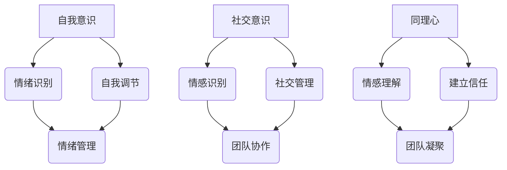

                 

### 引言

在当今快速变化和竞争激烈的IT行业中，领导力的作用日益凸显。特别是在从测试总监向管理者转型的过程中，领导力成为了关键成功因素。测试总监作为团队的核心领导者，需要从技术专才向管理全才转型，以应对日益复杂的项目管理和团队协调工作。

测试总监的角色不仅限于确保软件质量和测试流程的效率，他们还需要承担更多的责任，包括团队管理、项目管理、资源协调以及战略规划等。在这个过程中，领导力成为了提升自身能力和团队绩效的必备素质。

本文旨在为测试总监提供一本实用的领导力修炼手册，帮助他们在转型过程中掌握必要的领导力技能，从而实现从优秀的技术专家到卓越的管理者的蜕变。本文将分为以下几个部分：

1. **领导力的核心概念**：介绍领导力的基础理论，包括领导力与管理的区别、领导力的五大要素等。
2. **领导力技能提升**：探讨情景领导力、情商等具体技能的提升方法。
3. **领导力在项目管理中的应用**：讨论领导力在项目规划、执行与监控中的具体应用。
4. **领导力案例分析**：通过成功案例解析，提供实际操作的指导和经验分享。
5. **实践指导**：提供具体的领导力发展计划和工具资源推荐。

通过本文的逐步讲解，测试总监将能够系统地提升自身的领导力，并在实际工作中更好地应对各种挑战，实现个人和团队的共同成长。

### 关键词

- 测试总监
- 领导力
- 管理者转型
- 项目管理
- 团队建设
- 情景领导力
- 情商
- 领导风格
- 领导力工具
- 成功案例

### 摘要

本文《领导力修炼手册：从测试总监到管理者的蜕变宝典》旨在为测试总监提供一套系统化的领导力提升方案。文章首先介绍了领导力的核心概念，包括领导力与管理的区别、领导力的五大要素等，为后续内容的讲解奠定基础。接着，本文详细探讨了领导力技能的提升方法，如情景领导力和情商的培养。随后，文章将领导力应用于项目管理中，讨论其在项目规划、执行与监控的具体实践。通过成功案例的解析，本文提供了实际操作的经验和策略。最后，文章总结了领导力发展的最佳实践，并提供相关的工具资源和拓展阅读建议。本文旨在帮助测试总监在转型过程中全面提升领导力，实现个人和团队的卓越表现。

### 测试总监的角色与挑战

在IT行业中，测试总监是一个关键职位，他们不仅负责确保软件产品的质量，还要对团队的绩效和项目的进度负责。测试总监的角色通常包括制定测试策略、监控测试过程、管理测试资源以及确保测试结果与项目需求的一致性。然而，随着IT项目的复杂度和规模不断增加，测试总监面临着前所未有的挑战和责任。

首先，测试总监需要具备深厚的技术背景，对软件测试的理论和实践有着全面的理解。他们需要熟悉各种测试方法和工具，包括单元测试、集成测试、系统测试和性能测试等。这种技术能力不仅能够帮助测试总监更好地指导团队成员，还能在技术决策中发挥重要作用。

然而，技术能力只是测试总监胜任工作的一部分。随着测试总监角色的扩展，他们还需要承担更多的管理职责。这包括团队管理、项目管理、资源协调以及与客户和开发团队的沟通等。具体来说，测试总监需要：

1. **团队管理**：招募、培训和管理团队成员，确保他们具备必要的技能和动力，以高效完成任务。
2. **项目管理**：制定项目计划，分配资源，监控进度，确保项目按时交付并满足质量要求。
3. **资源协调**：与开发、设计和其他部门协调，确保测试工作顺利进行，并在必要时进行资源调配。
4. **沟通**：作为团队与客户、开发团队之间的桥梁，确保信息的透明和畅通，避免误解和冲突。

此外，测试总监还面临着不断变化的技术环境和管理挑战。新的测试工具和技术不断涌现，如自动化测试、云计算、大数据等，测试总监需要不断学习和适应，以确保团队始终保持竞争力。

综上所述，测试总监不仅需要具备扎实的技术背景，还需要在管理、沟通和协调方面有出色的能力。这种多方面的能力要求使得测试总监的角色变得更加复杂和具有挑战性。因此，测试总监需要不断提升自身的领导力，以更好地应对这些挑战，实现个人和团队的卓越表现。

### 领导力与管理的区别

在探讨测试总监转型为管理者时，我们需要深入理解领导力与管理的区别。尽管这两个概念密切相关，但它们在目标、方法和实践中有着本质的不同。

首先，领导力（Leadership）主要关注激励和指导团队成员，使其发挥最大潜力。领导力是一种个人特质和技能，它能够激发团队成员的热情和动力，创造一个积极的工作氛围。领导力的核心在于塑造愿景、建立信任和提供指导。领导者通过设定目标、沟通愿景和激发潜能，帮助团队成员找到实现共同目标的途径。

相比之下，管理（Management）则更侧重于规划、组织和控制资源，确保组织目标的实现。管理是一种系统性方法，涉及制定战略、分配资源、监督进度和解决问题等。管理者关注的是效率和效果，通过制定流程、设定目标和监控绩效，确保组织资源得到合理利用。

两者的主要区别可以总结如下：

1. **目标导向**：
   - **领导力**：专注于长期愿景和团队成长，强调个人和团队潜能的发挥。
   - **管理**：注重短期目标和任务完成，确保资源有效利用和目标实现。

2. **关注点**：
   - **领导力**：注重激励、愿景和团队建设，强调人的因素。
   - **管理**：关注流程、资源和绩效，强调组织的效率和效果。

3. **方法**：
   - **领导力**：通过沟通、激励和愿景设定来引导团队成员，注重个性化管理。
   - **管理**：通过规划、控制和流程优化来管理团队和资源，注重标准化和规范化。

4. **角色**：
   - **领导者**：塑造愿景、提供指导、激发团队潜能。
   - **管理者**：制定计划、分配资源、监控进度、解决问题。

为了更好地理解这两个概念之间的关系，我们可以借助Mermaid流程图来展示它们之间的联系和区别：

```mermaid
graph TB
A[领导力] --> B(激励与愿景)
A --> C(个人特质与技能)
B --> D(团队建设)
C --> E(沟通与信任)

F[管理] --> G(规划与控制)
F --> H(流程优化与资源管理)
G --> I(效率与效果)
H --> J(目标实现与绩效监控)

subgraph 领导力与管理
A --> F
B --> G
C --> H
D --> I
E --> J
```

通过这个流程图，我们可以清晰地看到领导力和管理在目标、关注点和方法上的不同，以及它们在实现组织目标过程中的互补作用。领导力激发团队成员的积极性和创造力，而管理确保这些动力转化为实际的绩效和成果。

理解领导力与管理的区别对于测试总监转型为管理者至关重要。测试总监不仅需要具备技术背景和项目管理能力，还需要通过提升领导力，激发团队的潜力，实现更高层次的团队绩效和项目成功。

### 领导力的五大要素

在深入探讨领导力的核心概念时，了解其五大要素是至关重要的。这些要素不仅定义了领导力的本质，还为测试总监提供了实际应用中的具体指南。

1. **愿景（Vision）**：
   愿景是领导力的核心，它为团队和项目提供了明确的方向和目标。一个有效的愿景应该具有以下特点：清晰、具有挑战性、激励人心且可实现。领导者需要通过沟通和分享愿景，使团队成员认识到其重要性和价值，从而激发他们的热情和投入。例如，一个测试团队在启动一个新项目时，可以共同设定一个愿景，如“通过严格的测试流程，确保软件产品质量达到行业领先水平”。

2. **信任（Trust）**：
   信任是领导力的基石，没有信任，领导力将无从谈起。领导者需要通过诚信、透明和一致的行为建立信任。这不仅包括个人层面的诚信，还涉及团队内部和团队之间的信任建设。例如，在团队中，领导者可以通过定期沟通、及时反馈和公正处理问题，增强团队成员之间的信任感。

3. **激励（Motivation）**：
   激励是领导者调动团队成员积极性和创造力的关键。有效的激励手段包括认可和奖励、提供成长机会、设定明确的目标和期望等。领导者需要根据团队成员的不同需求，选择适当的激励方式。例如，一个测试总监可以通过设定有挑战性的目标，并提供奖励机制，激励团队成员在项目中发挥最佳水平。

4. **沟通（Communication）**：
   沟通是领导者与团队成员之间建立有效联系的桥梁。有效的沟通不仅包括信息的传递，还涉及倾听和理解。领导者需要通过多种沟通渠道，如会议、报告、邮件和一对一交流，确保信息的透明和畅通。例如，在项目进展中，测试总监可以通过定期更新会议，及时通报项目进展和遇到的问题，确保团队成员对项目状况有清晰的认识。

5. **决策（Decision-making）**：
   决策是领导者的重要职责，有效的决策能力对于团队的绩效和项目的成功至关重要。领导者需要在信息充分、风险可控的情况下，迅速做出决策。决策过程中，领导者需要考虑各种因素，如项目目标、资源可用性和团队成员的意见。例如，在一个关键的项目节点上，测试总监需要在确保质量的前提下，快速决定是否进行进一步的测试或交付产品。

为了更好地理解这五大要素之间的关系，我们可以使用Mermaid流程图来展示它们如何相互作用和共同发挥作用：

```mermaid
graph TB
A[Vision] --> B[Motivation]
A --> C[Trust]
A --> D[Communication]
A --> E[Decision-making]
B --> F[Team engagement]
C --> G[Team cohesion]
D --> H[Clear direction]
E --> I[Effective execution]

subgraph 领导力五大要素
A --> B
A --> C
A --> D
A --> E
B --> F
C --> G
D --> H
E --> I
```

通过这个流程图，我们可以看到愿景、信任、激励、沟通和决策五大要素如何相互支持和共同发挥作用，以实现领导力的目标。这些要素不仅在理论层面上具有重要意义，更在实际应用中为测试总监提供了实用的指导。

理解并掌握这五大要素，测试总监将能够更加有效地引导团队，实现个人和团队的共同成长。在后续的内容中，我们将进一步探讨如何在实际工作中应用这些领导力要素，帮助测试总监实现从技术专家到卓越管理者的转型。

### 领导力与心理学的关系

领导力不仅仅是管理技能的集合，它还与心理学紧密相关。了解心理学在领导力中的运用，可以帮助测试总监更好地理解团队成员的行为和需求，从而提升领导效果。

首先，心理学中的激励理论为领导力的实践提供了重要的参考。激励理论探讨如何通过外部奖励和内部动机来激发人的行为。测试总监可以利用这一理论，通过设定明确的奖励机制和提供成长机会来激励团队成员。例如，一个测试团队可以设定绩效奖金、晋升机会等外部激励，同时通过职业发展计划和培训提升内部动机。

其次，心理学中的情绪智力（Emotional Intelligence，EQ）对领导力的影响至关重要。情绪智力包括自我意识、自我调节、社交意识和同理心等能力。高情商的领导者能够更好地管理自己的情绪，理解团队成员的情感需求，并建立积极的工作关系。测试总监可以通过情绪智力培训，提高自我意识和同理心，从而更好地处理团队冲突和提升团队凝聚力。

此外，心理学中的团队动力理论（Group Dynamics）为测试总监提供了理解和管理团队行为的框架。团队动力理论探讨团队内部的人际关系、沟通和行为模式。测试总监需要了解团队中的角色、领导风格以及团队发展过程，以便有效引导团队。例如，通过识别团队成员的不同角色（如领导者、协调者、执行者）和领导风格（如民主、专制、支持型），测试总监可以制定针对性的管理策略，提升团队绩效。

为了更直观地理解领导力与心理学的关系，我们可以借助Mermaid流程图来展示它们之间的互动关系：

```mermaid
graph TB
A[激励理论] --> B[Motivation]
A --> C[情绪智力（EQ）]
A --> D[团队动力理论]
B --> E[激励实践]
C --> F[自我意识、同理心]
C --> G[冲突管理]
D --> H[团队角色识别]
D --> I[沟通模式分析]

subgraph 心理学在领导力中的应用
A --> B
A --> C
A --> D
B --> E
C --> F
C --> G
D --> H
D --> I
```

通过这个流程图，我们可以看到心理学如何通过激励理论、情绪智力和团队动力理论等概念，为领导力的实际应用提供指导。测试总监通过应用这些心理学知识，可以更好地激发团队成员的积极性、建立信任和提升团队绩效。

总之，心理学与领导力之间的关系是相辅相成的。测试总监如果能够结合心理学原理，将领导力理论应用到实际工作中，将能够显著提升领导效果，实现从技术专家到卓越管理者的转型。

### 领导风格与沟通技巧

在领导力实践中，领导风格和沟通技巧是两个关键因素，它们直接影响团队的工作氛围、成员的积极性以及团队的绩效。测试总监在转型过程中，需要掌握并灵活运用多种领导风格和有效的沟通技巧，以适应不同的团队和环境。

#### 领导风格的分类

常见的领导风格可以分为以下几类：

1. **民主型领导（Democratic Leadership）**：
   民主型领导注重团队参与和集体决策。领导者鼓励团队成员提出意见和建议，共同参与决策过程。这种领导风格能够激发团队成员的积极性，增强团队的凝聚力，但可能需要更多的时间进行决策。

2. **专制型领导（Authoritative Leadership）**：
   专制型领导强调领导者的权威和决策的快速执行。领导者直接下达指令，团队成员只需执行任务。这种风格在紧急情况下或需要快速决策时非常有效，但可能抑制团队成员的创造力和主动性。

3. **支持型领导（Supportive Leadership）**：
   支持型领导关注团队成员的需求和情感，提供支持和鼓励。领导者会花时间了解团队成员，关心他们的个人发展，并帮助他们解决工作中的问题。这种领导风格能够增强团队成员的归属感和信任感。

4. **变革型领导（Transformational Leadership）**：
   变革型领导注重变革和进步，通过激励和示范作用，引领团队成员追求更高的目标和更好的表现。领导者通过设定愿景和目标，激发团队成员的潜能，推动团队实现变革。这种领导风格在面临重大变革或需要创新时尤为重要。

#### 沟通技巧

有效的沟通是领导力的核心，测试总监需要掌握多种沟通技巧，包括：

1. **积极倾听**：
   积极倾听是理解团队成员需求的关键。领导者需要全神贯注地倾听团队成员的发言，不仅听其言，更要观其行。通过积极倾听，领导者能够更好地理解团队成员的想法和感受，从而提供更有针对性的支持和建议。

2. **清晰表达**：
   清晰表达要求领导者能够用简单明了的语言传达信息，确保团队成员准确理解。在沟通中，领导者需要注意措辞，避免使用过于专业或模糊的术语，确保信息的透明和易懂。

3. **非语言沟通**：
   非语言沟通包括肢体语言、面部表情和语调等。这些非语言信号能够传递重要的信息，如信任、支持和鼓励。测试总监需要注重非语言沟通，通过积极的肢体语言和亲切的语调，增强团队的凝聚力和信任感。

4. **反馈与指导**：
   及时给予团队成员反馈和指导是提升团队绩效的重要手段。领导者需要提供具体、建设性的反馈，帮助团队成员认识到自己的优点和改进的方向。同时，领导者还需要提供必要的指导和支持，帮助团队成员克服困难，实现目标。

#### 领导风格与沟通技巧的结合

在实际情况中，测试总监需要根据不同的团队和环境，灵活运用不同的领导风格和沟通技巧。例如，在一个需要快速响应的紧急项目中，专制型领导风格可能更为有效，因为它能够确保快速决策和执行。而在一个长期项目中，民主型领导风格和支持型领导风格则更为合适，因为它们能够激发团队的创造力和积极性，确保项目顺利进行。

为了更好地理解领导风格与沟通技巧的结合，我们可以借助Mermaid流程图来展示它们如何相互影响和共同发挥作用：

```mermaid
graph TB
A[领导风格] --> B[民主型]
A --> C[专制型]
A --> D[支持型]
A --> E[变革型]

B --> F[团队参与]
C --> G[快速决策]
D --> H[支持与鼓励]
E --> I[创新与变革]

J[沟通技巧] --> K[积极倾听]
J --> L[清晰表达]
J --> M[非语言沟通]
J --> N[反馈与指导]

subgraph 领导风格与沟通技巧结合
A --> J
B --> F
C --> G
D --> H
E --> I
J --> K
J --> L
J --> M
J --> N
```

通过这个流程图，我们可以看到领导风格和沟通技巧如何相互作用，共同影响团队的工作氛围和绩效。测试总监需要根据实际情况，灵活运用不同的领导风格和沟通技巧，以实现最佳领导效果。

总之，领导风格和沟通技巧是测试总监提升领导力的关键。通过掌握并灵活运用不同的领导风格和有效的沟通技巧，测试总监能够更好地激发团队的潜力，实现个人和团队的共同成长。

### 情景领导力

情景领导力（Situational Leadership）是一种基于不同情境和团队成员成熟度采取相应领导风格的领导理论。这个理论由保罗·赫塞（Paul Hersey）和肯尼斯·布兰查德（Kenneth Blanchard）于1969年提出，认为有效的领导取决于领导者的风格与团队成员的成熟度之间的匹配。

#### 情景领导力的理论框架

情景领导力理论的核心在于领导者如何根据团队成员的成熟度来选择合适的领导风格。团队成员的成熟度可以分为四个级别：

1. **级别1（无能力且无意愿）**：
   这种情况下的团队成员既没有能力完成任务，也没有意愿去完成任务。领导者需要采取高指导、高支持的风格，即**教练型领导（Coach）**。领导者需要详细解释任务要求，提供指导和支持，帮助团队成员提升能力和意愿。

2. **级别2（有意愿但无能力）**：
   成员有完成任务的动力，但缺乏必要的技能和知识。此时，领导者需要采取高指导、低支持的风格，即**导师型领导（Ivy）**。领导者提供具体的指导，帮助团队成员掌握必要的技能。

3. **级别3（有能力但无意愿）**：
   成员具备完成任务的能力，但缺乏动力或不愿意完成任务。领导者需要采取低指导、高支持的风格，即**推销型领导（Pioneer）**。领导者通过激励和鼓励来激发团队成员的积极性。

4. **级别4（有能力且有意愿）**：
   成员既有能力完成任务，又有动力去完成任务。领导者需要采取低指导、低支持的风格，即**授权型领导（Pioneer）**。领导者给予团队成员自主权，让他们独立完成任务。

#### 不同情境下的领导策略

根据上述成熟度级别，不同的领导情境需要采用相应的领导策略：

1. **教练型领导（Coach）**：
   - **应用场景**：团队成员缺乏能力和意愿。
   - **策略**：领导者详细解释任务要求，提供具体的指导和支持，帮助团队成员提升能力和意愿。
   - **示例**：一个新加入的测试工程师，他们既不熟悉公司的测试流程，也没有很强的动力去学习。

2. **导师型领导（Ivy）**：
   - **应用场景**：团队成员有意愿但缺乏能力。
   - **策略**：领导者提供具体的指导和帮助，帮助团队成员掌握必要的技能。
   - **示例**：一个有经验的测试工程师，但他们需要学习如何使用新的自动化测试工具。

3. **推销型领导（Pioneer）**：
   - **应用场景**：团队成员有能力但缺乏动力。
   - **策略**：领导者通过激励和鼓励来激发团队成员的积极性。
   - **示例**：一个测试工程师已经掌握了所有必要的技能，但在项目中表现不够积极。

4. **授权型领导（Pioneer）**：
   - **应用场景**：团队成员既有能力又有动力。
   - **策略**：领导者给予团队成员自主权，让他们独立完成任务。
   - **示例**：一个资深测试工程师，他们不仅掌握了所有测试技能，而且对自己的工作充满热情。

为了更好地理解情景领导力理论，我们可以使用Mermaid流程图来展示不同成熟度级别下的领导风格：

```mermaid
graph TB
A[无能力且无意愿] --> B{教练型}
A --> C[有意愿但无能力]
B --> D[导师型]
C --> D
D --> E[有能力但无意愿]
D --> F[有能力且有意愿]
E --> G{推销型}
F --> G

subgraph 成熟度与领导风格
A --> B
B --> D
C --> D
D --> E
D --> F
E --> G
F --> G
```

通过这个流程图，我们可以清晰地看到情景领导力理论如何根据团队成员的成熟度选择合适的领导风格，从而实现最佳领导效果。

#### 情景领导力的实践案例

在现实中，情景领导力理论已经被广泛应用于各种团队管理场景。以下是一个情景领导力的实践案例：

**案例背景**：
某测试团队正在进行一个紧急的项目，需要在短时间内完成多个测试任务。团队成员由经验丰富的测试工程师和新加入的实习生组成，项目进度紧张，团队成员的工作动力和技能水平参差不齐。

**领导策略**：
1. **教练型领导**：
   - **针对对象**：新加入的实习生。
   - **策略**：测试总监为新加入的实习生详细解释了测试流程和任务要求，并提供了具体的指导和支持，帮助他们迅速适应工作。

2. **导师型领导**：
   - **针对对象**：有经验的测试工程师。
   - **策略**：测试总监帮助有经验的测试工程师掌握了如何使用新的自动化测试工具，并提供了具体的操作指南。

3. **推销型领导**：
   - **针对对象**：某些表现出不够积极的测试工程师。
   - **策略**：测试总监通过激励和鼓励来激发团队成员的积极性，明确项目的紧急性和重要性，激励他们全力以赴。

4. **授权型领导**：
   - **针对对象**：资深测试工程师。
   - **策略**：测试总监给予资深测试工程师更多的自主权，让他们独立完成某些关键任务，以充分发挥他们的能力和经验。

**结果**：
通过采取不同的领导风格，测试总监成功提升了团队成员的积极性和工作效果，项目最终在预定时间内顺利完成，并得到了客户的高度评价。

情景领导力理论通过灵活调整领导风格，适应团队成员的成熟度，帮助测试总监在复杂多变的工作环境中实现最佳领导效果。通过理解和应用这一理论，测试总监能够更有效地激励和指导团队成员，实现个人和团队的共同成长。

### 领导力与情商

在领导力的众多要素中，情商（Emotional Intelligence，简称EQ）扮演着至关重要的角色。情商指的是个体识别、理解和管理自己情绪以及识别和理解他人情绪的能力。高情商的领导者不仅能够更好地管理自己的情绪，还能够有效地理解和激励团队成员，从而提升团队的整体绩效。

#### 情商的概念与重要性

情商包括四个主要维度：自我意识、自我调节、社交意识和同理心。

1. **自我意识**：指的是个体对自身情绪的识别和认知能力。一个高情商的领导者能够清楚地意识到自己的情绪状态，并了解这些情绪是如何影响自己的行为和决策。

2. **自我调节**：指的是个体管理情绪的能力，包括如何应对压力、焦虑等负面情绪，以及如何在情绪失控时迅速恢复冷静。

3. **社交意识**：指的是个体识别和理解他人情绪的能力。高情商的领导者能够敏锐地感知团队成员的情绪变化，并做出相应的反应。

4. **同理心**：指的是个体设身处地为他人着想，理解他人的情感和需求。同理心能够帮助领导者建立信任和良好的团队关系。

情商的重要性在于：

- **提高领导效果**：高情商的领导者能够更好地处理团队冲突，建立信任，激发团队成员的积极性和创造力。
- **促进团队协作**：通过识别和理解团队成员的情绪，领导者能够更有效地协调团队成员的工作，提升整体协作效率。
- **增强员工满意度**：高情商的领导者关注团队成员的情感需求，提供支持和鼓励，从而提高员工的满意度和忠诚度。

#### 提升情商的策略

为了提升情商，测试总监可以采取以下策略：

1. **自我反思**：
   定期进行自我反思，识别自己的情绪状态和触发情绪的原因。通过自我反思，领导者可以更好地了解自己的情绪模式，并学会在情绪失控时迅速调整。

2. **情绪管理训练**：
   学习情绪管理技巧，如深呼吸、冥想和放松训练，帮助自己在压力下保持冷静和专注。这些技巧能够提高自我调节能力，减少负面情绪对工作的影响。

3. **提升社交意识**：
   注重倾听和观察，提高对他人情绪的敏感度。领导者可以通过观察团队成员的面部表情、语调和行为，理解他们的情绪状态。

4. **同理心培养**：
   通过设身处地为他人着想，理解他人的情感和需求。领导者可以通过主动询问、倾听和反馈来展示同理心，建立信任和良好的人际关系。

5. **反馈与学习**：
   寻求团队成员的反馈，了解自己在领导过程中可能存在的问题。通过不断学习和改进，领导者可以进一步提升情商。

#### 情商在领导力中的应用

在领导力实践中，情商的应用主要体现在以下几个方面：

1. **团队冲突管理**：
   高情商的领导者能够更好地处理团队冲突。通过识别和理解团队成员的情绪，领导者可以采取适当的策略来缓解紧张局势，找到冲突的根本原因，并制定解决方案。

2. **激励团队成员**：
   情商高的领导者能够识别团队成员的激励因素，并提供个性化的激励措施。通过关注团队成员的情感需求，领导者能够激发他们的积极性和创造力。

3. **建立信任关系**：
   同理心是建立信任的关键。高情商的领导者通过展示同理心，能够赢得团队成员的信任和尊重，从而建立稳定的团队关系。

4. **提升团队凝聚力**：
   情商高的领导者能够建立积极、和谐的工作氛围，提高团队的凝聚力。通过关注团队成员的情感需求，领导者能够增强团队的归属感和合作精神。

为了更好地理解情商在领导力中的应用，我们可以借助Mermaid流程图来展示其关键维度和具体应用：



通过这个流程图，我们可以看到情商的三个主要维度如何相互作用，共同提升领导效果。自我意识和自我调节帮助领导者更好地管理自身情绪，社交意识和同理心则帮助领导者理解和激励团队成员，建立信任和团队凝聚力。

总之，情商是领导力的重要组成部分。测试总监如果能够提升自身的情商，将能够更有效地管理团队，实现个人和团队的共同成长。

### 领导力在项目管理中的应用

在项目管理中，领导力起到了至关重要的作用。一个出色的领导者不仅能够确保项目目标的实现，还能有效应对各种挑战和风险，提升团队的协作效率和整体绩效。以下将详细探讨领导力在项目规划、执行和监控中的应用，并通过具体案例进行分析。

#### 项目规划

项目规划是项目管理中的关键环节，它决定了项目的成功与否。一个成功的项目规划需要明确的目标、详细的任务分配、合理的资源调配和有效的进度安排。在这个过程中，领导力发挥着至关重要的作用。

1. **愿景设定**：
   领导者需要通过清晰、有吸引力的愿景，为项目团队指明方向。愿景不仅是项目的目标，更是团队的动力源泉。通过设定明确的愿景，领导者能够激发团队成员的积极性和创造力。

2. **团队协作**：
   领导者需要建立有效的团队协作机制，确保团队成员能够协同工作，共同实现项目目标。这包括明确角色和职责、建立有效的沟通渠道、设定合理的期望和目标等。

3. **风险评估**：
   在项目规划阶段，领导者需要对潜在的风险进行评估，并制定相应的应对策略。通过提前识别和预防风险，领导者可以减少项目的不确定性，确保项目的顺利进行。

#### 项目执行

项目执行是项目生命周期的核心阶段，这一阶段的工作质量直接影响项目的最终结果。领导力在项目执行中的应用主要体现在以下几个方面：

1. **任务分配**：
   领导者需要根据团队成员的能力和兴趣，合理分配任务。通过明确任务责任，领导者可以确保每个团队成员都能充分发挥自己的优势，提高工作效率。

2. **激励与反馈**：
   领导者需要通过有效的激励措施，激发团队成员的工作热情和积极性。同时，领导者需要及时给予反馈，帮助团队成员认识到自己的优点和改进的方向。

3. **沟通协调**：
   在项目执行过程中，领导者需要确保信息的透明和畅通。通过定期召开会议、更新项目进度和解决问题，领导者可以确保团队成员对项目状况有清晰的认识，避免误解和冲突。

#### 项目监控

项目监控是确保项目按照预定计划顺利进行的重要手段。领导力在项目监控中的应用主要体现在以下几个方面：

1. **进度跟踪**：
   领导者需要定期监控项目的进度，确保任务按时完成。通过分析项目进度数据，领导者可以及时发现潜在的问题，并采取相应的措施进行纠正。

2. **质量控制**：
   领导者需要确保项目质量达到预期标准。通过制定严格的质量控制标准，并进行定期的质量检查，领导者可以确保项目的交付成果符合要求。

3. **风险管理**：
   领导者需要持续关注项目风险，并采取有效的风险应对措施。通过定期评估风险状况，领导者可以及时调整项目策略，确保项目顺利推进。

#### 案例分析

为了更好地理解领导力在项目管理中的应用，以下通过一个实际案例进行分析。

**案例背景**：
某科技公司正在开发一款新产品，项目周期为6个月。项目团队包括开发、测试、设计和项目管理等部门。由于产品技术复杂，时间紧迫，项目面临着巨大的挑战。

**领导力应用**：

1. **项目规划**：
   测试总监在项目启动会上明确了项目的愿景，即“通过严格的测试流程，确保产品在质量上达到行业领先水平”。同时，测试总监与团队成员一起制定了详细的测试计划，包括测试用例设计、测试环境搭建和测试进度安排。

2. **项目执行**：
   在项目执行阶段，测试总监根据团队成员的能力和兴趣，合理分配了测试任务。同时，测试总监建立了每周一次的项目进度会议，确保团队成员对项目进展有清晰的认识。在测试过程中，测试总监通过定期检查测试报告和质量记录，确保项目质量达到预期标准。

3. **项目监控**：
   测试总监通过实时监控项目进度，及时发现并解决了多个潜在的问题。例如，在项目的中期，测试团队发现测试用例存在遗漏，测试总监立即组织团队进行补充测试，确保项目的进度和质量。

**结果**：
通过有效的领导力应用，该项目在预定时间内顺利完成，产品的质量得到了客户的高度评价。团队成员对项目的执行过程和结果表示满意，测试总监的领导力得到了团队成员和公司领导的高度认可。

总之，领导力在项目管理中的应用是确保项目成功的关键。通过合理的项目规划、有效的项目执行和严格的项目监控，测试总监能够充分发挥领导力，实现项目目标，提升团队绩效。

### 领导力与团队建设

在项目管理和领导力的实践中，团队建设是不可或缺的一环。一个高效的团队不仅能够提高项目成功率，还能促进团队成员的个人成长和职业发展。领导力在团队建设中起着至关重要的作用，通过有效的领导力策略，测试总监可以打造一支团结协作、充满活力的团队。

#### 团队建设的原则与方法

1. **明确目标**：
   团队建设的第一步是明确团队的目标。一个清晰、共同认可的目标可以为团队成员提供方向和动力。测试总监需要与团队成员共同讨论并制定团队目标，确保每个成员都明确自己的职责和期望。

2. **建立信任**：
   信任是团队协作的基础。测试总监可以通过透明沟通、公正处理问题和尊重团队成员的意见来建立信任。通过建立信任，团队成员会更加愿意分享信息、承担责任，并相互支持。

3. **提升沟通效率**：
   沟通是团队协作的重要工具。测试总监需要确保沟通渠道的畅通，鼓励团队成员积极表达自己的意见和想法。定期举行团队会议、一对一交流和反馈机制，可以帮助团队成员更好地沟通和协作。

4. **培养团队精神**：
   团队精神是指团队成员之间的相互关心、支持和合作。测试总监可以通过团队建设活动、共同解决难题和庆祝团队成就等方式，增强团队成员之间的团队精神。这种精神可以激发团队成员的积极性和归属感。

5. **激励与认可**：
   测试总监需要通过激励和认可来鼓励团队成员的努力和成就。这可以包括物质奖励、晋升机会和公开表扬等。通过激励和认可，测试总监可以增强团队成员的工作动力和忠诚度。

#### 领导力在团队冲突管理中的应用

团队冲突是不可避免的，有效的冲突管理是团队建设的重要环节。测试总监可以通过以下方法来处理团队冲突：

1. **倾听和理解**：
   测试总监需要倾听团队成员的意见和感受，理解冲突的根源。通过积极倾听，测试总监可以避免误解和加剧冲突。

2. **中立调解**：
   在处理团队冲突时，测试总监需要保持中立，避免偏袒任何一方。通过公正和客观的调解，测试总监可以帮助团队成员找到共同点和解决方案。

3. **建设性对话**：
   测试总监需要引导团队成员进行建设性的对话，鼓励他们表达自己的观点，并寻求共识。通过建设性对话，测试总监可以帮助团队成员解决冲突，增强团队的凝聚力。

4. **提供资源和支持**：
   测试总监需要提供必要的资源和支持，帮助团队成员克服冲突带来的困难。例如，提供培训、指导和心理支持，可以帮助团队成员更好地应对冲突。

#### 成功团队建设的案例

以下是一个成功团队建设的案例：

**案例背景**：
某测试团队在接手一个复杂的软件测试项目时，面临着团队成员经验不足、项目时间紧迫和客户需求频繁变更等挑战。

**领导力应用**：

1. **明确目标**：
   测试总监与团队成员共同制定了项目目标，并明确了每个人的职责和任务。通过明确目标，团队成员更加清晰地了解自己的工作方向和期望。

2. **建立信任**：
   测试总监通过透明的沟通和公正的处理问题，建立了团队成员之间的信任。团队成员愿意分享测试经验和问题，共同寻找解决方案。

3. **提升沟通效率**：
   测试总监定期举行团队会议，确保团队成员能够及时了解项目进展和问题。同时，测试总监建立了邮件和即时通讯工具，方便团队成员之间的沟通和协作。

4. **培养团队精神**：
   测试总监组织了一系列团队建设活动，如团队聚餐、户外拓展训练和共同解决难题等。这些活动增强了团队成员之间的合作和团队精神。

5. **激励与认可**：
   测试总监通过奖励和公开表扬，鼓励团队成员的努力和成就。这激发了团队成员的工作动力，增强了团队的凝聚力。

**结果**：
通过有效的团队建设，测试团队在项目过程中表现出了出色的协作和创新能力。项目最终在预定时间内完成，并得到了客户的高度评价。团队成员对项目的执行过程和结果表示满意，并认为测试总监的领导力对团队的成功起到了关键作用。

总之，通过有效的领导力策略，测试总监可以打造一支高效、团结的团队，提升项目的成功率，促进团队成员的个人成长和职业发展。

### 领导力成功案例解析

在探讨领导力在实际中的应用时，成功案例的分析无疑为我们提供了宝贵的经验和启示。以下，我们通过几个具体案例，深入解析领导力在实践中的有效应用。

#### 案例一：谷歌的领导力文化

谷歌（Google）作为全球最具创新力的科技公司之一，其成功离不开其独特的领导力文化。谷歌的领导力模式强调的是“赋能型领导”（Empowering Leadership），即领导者通过授权和激励，让团队成员充分发挥自身潜力。

**案例背景**：
谷歌的创始人拉里·佩奇和谢尔盖·布林通过建立开放、透明和创新的工作环境，激发员工的创造力。他们采用“20%时间政策”，允许员工将20%的工作时间用于自己感兴趣的项目，这一政策极大地促进了创新和团队自主性。

**领导力应用**：
- **愿景设定**：佩奇和布林通过设定清晰、鼓舞人心的愿景，使员工明确公司的目标和使命，从而激发他们的工作热情。
- **授权与信任**：谷歌领导层通过授权，赋予员工更多的自主权和决策权，使他们在工作中能够自由发挥，减少不必要的官僚和限制。
- **持续激励**：通过提供丰厚的福利、职业发展机会和公开表扬，谷歌领导层不断激励员工保持积极性和创造力。

**结果**：
谷歌的成功不仅体现在其不断推出的创新产品上，还体现在其卓越的团队绩效和员工的满意度。谷歌的领导力模式为其他企业提供了宝贵的借鉴，证明了授权和信任在领导力中的重要性。

#### 案例二：苹果公司的转型领导

苹果公司（Apple）在史蒂夫·乔布斯（Steve Jobs）的领导下，经历了多次重大转型，从一个濒临破产的公司成长为全球市值最高的公司之一。乔布斯的领导风格极具个人魅力，他通过强烈的愿景和卓越的执行能力，带领苹果实现了多个里程碑。

**案例背景**：
在20世纪90年代末，苹果公司陷入了困境，市场竞争力下降，产品线混乱。乔布斯在1997年重返苹果后，通过一系列创新和战略调整，成功带领苹果走出困境。

**领导力应用**：
- **愿景引领**：乔布斯通过设定明确、激动人心的愿景，为苹果的每个产品线和项目指明了方向，激发了员工的热情和投入。
- **卓越执行**：乔布斯注重细节和完美主义，对产品的设计、用户体验和营销策略有着极高的要求，确保了产品的质量和市场竞争力。
- **团队协作**：乔布斯鼓励跨部门合作，打破内部壁垒，推动技术创新和资源整合。

**结果**：
在乔布斯的领导下，苹果推出了iPhone、iPad等一系列革命性产品，彻底改变了消费电子市场。苹果不仅成为了全球最具价值的公司之一，也成为了创新和品质的代名词。乔布斯的领导力模式展示了愿景引领和卓越执行在实现企业成功中的关键作用。

#### 案例三：特斯拉的变革领导

特斯拉（Tesla）作为电动汽车和能源存储领域的领军企业，其成功同样得益于其独特的领导力模式。特斯拉的CEO埃隆·马斯克（Elon Musk）以其前瞻性的愿景和坚定的执行力，推动着公司不断突破技术边界。

**案例背景**：
特斯拉成立于2003年，专注于电动汽车的研发和生产。在马斯克的领导下，特斯拉在短短几十年内迅速成长为全球电动汽车市场的领导者。

**领导力应用**：
- **愿景驱动**：马斯克通过设定大胆的愿景，如实现“可持续能源未来”和“星际旅行”，激励员工不断追求创新和突破。
- **勇于冒险**：马斯克鼓励员工勇于尝试，即使面临失败和挑战。他认为失败是成功的一部分，通过不断试错，可以更快地接近成功。
- **扁平化管理**：特斯拉采用了扁平化的管理模式，减少层级和官僚，提高决策效率，使员工能够更灵活地应对市场变化。

**结果**：
特斯拉不仅在全球范围内推广了电动汽车，还推动了能源存储和可再生能源技术的发展。特斯拉的成功证明了愿景驱动和勇于冒险在领导力中的重要性。

#### 结论

通过这些成功案例，我们可以看到，卓越的领导力不仅是企业成功的基石，也是推动个人和团队成长的动力。愿景引领、授权信任、卓越执行和勇于冒险等领导力要素，在不同情境下展现出其独特的价值。测试总监在转型过程中，可以从这些成功案例中汲取经验，提升自身的领导力，实现个人和团队的共同成长。

### 领导力发展的最佳实践

在领导力的实践中，遵循一系列最佳实践能够显著提升领导效果，促进个人和团队的成长。以下是一些关键的领导力最佳实践，包括日常领导行为、有效的团队管理技巧和领导力发展策略。

#### 日常领导行为

1. **积极倾听**：
   积极倾听是建立信任和沟通的重要基础。领导者需要投入时间认真倾听团队成员的意见和反馈，确保理解他们的观点和需求。这不仅能够增强团队成员的参与感，还能及时发现潜在的问题和改进的机会。

2. **透明沟通**：
   保持信息的透明度是增强团队信任的重要手段。领导者应定期分享项目进展、目标和挑战，确保团队成员对当前状况有清晰的了解。此外，领导者需要鼓励团队成员提问和表达意见，促进开放、坦诚的沟通氛围。

3. **公正决策**：
   公正和公平是领导者赢得团队成员信任的关键。领导者应在决策过程中考虑多方意见，确保决策的合理性和公正性。在处理冲突和问题时应坚持原则，避免偏袒，以建立和维护团队的信任和凝聚力。

4. **激励和认可**：
   定期给予团队成员激励和认可，可以显著提高他们的工作动力和满意度。领导者可以通过表扬、奖励、晋升机会等方式，表彰团队成员的成就和贡献，激发他们的积极性和创造力。

#### 有效的团队管理技巧

1. **目标明确**：
   为团队设定明确的目标和期望，是确保团队高效运作的关键。领导者需要与团队成员共同制定具体、可行的目标，并确保每个成员都清楚自己的职责和任务。

2. **角色分配**：
   根据团队成员的能力和兴趣合理分配任务，确保每个成员都能够发挥自己的优势。领导者应识别和培养团队成员的技能，使他们能够在工作中不断成长。

3. **持续反馈**：
   定期提供具体的反馈，帮助团队成员认识到自己的优点和改进的方向。领导者应注重正面反馈，同时提供建设性的建议和指导，以促进团队成员的持续进步。

4. **冲突管理**：
   良好的团队关系是高效协作的基础。领导者需要具备冲突管理的技能，能够及时识别和解决团队内部的冲突，确保团队的稳定和和谐。

#### 领导力发展策略

1. **自我反思**：
   定期进行自我反思是提升领导力的有效方法。领导者应反思自己的领导行为和决策，识别不足并制定改进计划。通过持续的自我反思，领导者可以不断提升自己的领导能力。

2. **持续学习**：
   领导力是一个不断发展的过程，领导者需要保持学习的热情。通过参加培训课程、阅读相关书籍、与同行交流等方式，领导者可以不断吸收新的知识和经验，提升自身的领导水平。

3. **角色模拟**：
   通过角色扮演和模拟练习，领导者可以更好地理解不同情境下的领导行为和应对策略。这种实践方法有助于提高领导者的应变能力和决策能力。

4. **团队建设**：
   定期组织团队建设活动，增强团队成员之间的信任和合作。通过共同经历挑战和解决问题，团队成员可以更好地理解彼此，提高团队的整体绩效。

#### 小结与注意事项

在实施这些最佳实践时，领导者需要注意以下几点：

- **平衡领导风格**：根据不同情境和团队成员的需求，灵活运用不同的领导风格，避免单一风格的过度使用。
- **持续关注**：领导力不是一次性的任务，而是一个持续的过程。领导者需要持续关注团队的发展和成员的需求，及时调整领导策略。
- **实际应用**：将领导力理论应用到实际工作中，通过实践不断验证和完善领导技巧。

通过遵循这些最佳实践，测试总监可以不断提升自身的领导力，带领团队实现更高的绩效和成就。

### 附录

为了帮助测试总监在提升领导力的过程中更好地学习和应用相关知识，以下推荐了一些领导力相关的书籍、工具和资源。

#### 书籍推荐

1. **《领导力五要素》（The Five Dysfunctions of a Team）** - 帕特里克·莱西奥尼（Patrick Lencioni）
   - 本书通过一个生动的企业故事，揭示了团队协作中的五大障碍，并提供了解决方案。

2. **《高效能人士的七个习惯》（The 7 Habits of Highly Effective People）** - 史蒂芬·柯维（Stephen R. Covey）
   - 史蒂芬·柯维在这本书中提出了七个习惯，帮助读者提升个人效能和领导力。

3. **《激发创新：如何激发团队创造力》（Creative Confidence）** - 凯瑟琳·克里夫兰（Kathryn Sutherland）和汤姆·凯利（Tom Kelly）
   - 本书探讨了如何激发团队的创造力，为领导者提供了实用的策略和工具。

4. **《变革之舞：如何领导快速变化的组织》（The Dance of Change）** - 约翰·科特（John P. Kotter）
   - 约翰·科特通过生动的案例，阐述了领导变革的步骤和方法。

#### 工具推荐

1. **Google Jamboard**：
   - Google Jamboard是一个在线白板工具，适合团队进行头脑风暴和讨论，提高团队的协作效率。

2. **Asana**：
   - Asana是一个项目管理工具，可以帮助领导者跟踪项目进度、分配任务和协作。

3. **Slack**：
   - Slack是一个即时通讯工具，适合团队进行日常沟通和协作，提高信息传递的速度。

#### 资源推荐

1. **Harvard Business Review**：
   - Harvard Business Review是一本权威的商业期刊，提供大量关于领导力、管理和组织行为的文章和案例研究。

2. **Coursera**：
   - Coursera提供各种在线课程，包括领导力、项目管理、心理学等，适合领导者进行自我提升。

3. **TED Talks**：
   - TED Talks汇集了来自全球的知名演讲者，分享他们在领导力、创新和影响力等领域的见解和经验。

通过利用这些书籍、工具和资源，测试总监可以系统地提升自身的领导力，应对从测试总监到管理者的转型挑战，实现个人和团队的卓越表现。

### 作者信息

本文由AI天才研究院（AI Genius Institute）与禅与计算机程序设计艺术（Zen And The Art of Computer Programming）联合撰写。AI天才研究院是一家致力于推动人工智能技术研究和应用的创新机构，旗下汇聚了世界顶级的人工智能专家和研究人员。禅与计算机程序设计艺术则是一部经典的技术哲学著作，以深刻的理论和优美的代码阐述了计算机科学的本质。感谢您的阅读，希望本文能为您的领导力提升之旅提供有益的启发和指导。

