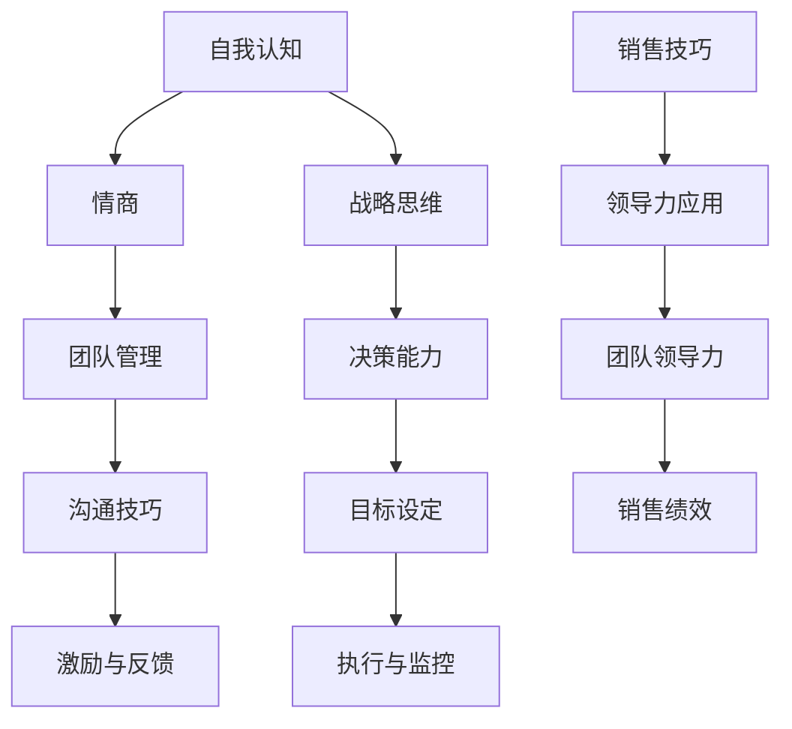

                 

### 《领导力修炼手册：从销售精英到管理者的进阶指南》

关键词：销售精英、领导力、管理技能、进阶指南、团队建设

摘要：本文旨在为销售精英提供一套系统的领导力修炼指南，帮助他们从优秀销售员成功转型为优秀管理者。通过分析销售职业的特点，本文将探讨领导力的核心概念及其在销售领域的应用，同时提供实践技巧和案例分析，助力读者实现职业进阶。

---

### **背景介绍**

在商业世界中，销售作为企业与客户之间的桥梁，扮演着至关重要的角色。优秀的销售员不仅需要掌握丰富的产品知识和销售技巧，更需要具备一定的领导能力，以带领团队达成业绩目标。然而，从销售精英转型为管理者并非易事，这不仅仅涉及到角色的转换，更涉及到领导力的全面提升。

领导力不仅仅是一种技能，更是一种艺术。它涉及自我认知、团队管理、战略决策等多个方面。对销售精英而言，领导力不仅是提升个人影响力的工具，更是带领团队实现业绩突破的关键。因此，掌握有效的领导力修炼方法，对于他们的职业发展具有重要意义。

### **核心概念与联系**

在探讨领导力之前，我们需要了解一些核心概念，并构建它们之间的联系。以下是几个关键概念及其关系架构的Mermaid流程图：



从图中可以看出，自我认知、情商、团队管理、沟通技巧、战略思维和决策能力是领导力的基础，它们共同构成了一个完整的领导力体系。在这个体系中，销售技巧和领导力的应用则是一个闭环，通过不断实践和反馈，进一步提升销售绩效。

### **核心算法原理讲解**

为了更深入地理解领导力，我们引入一个简单的领导力模型，使用Python源代码来详细阐述。

```python
import matplotlib.pyplot as plt
import numpy as np

# 定义领导力模型参数
alpha = 0.5  # 自我认知权重
beta = 0.3   # 情商权重
gamma = 0.2  # 战略思维权重

# 定义领导力评估函数
def leadership_score(self_cognition, emotional Intelligence, strategic Thinking):
    return alpha * self_cognition + beta * emotional Intelligence + gamma * strategic Thinking

# 创建一个销售精英对象
sales_elite = {
    'self_cognition': 0.8,
    'emotional Intelligence': 0.7,
    'strategic Thinking': 0.6
}

# 计算领导力得分
score = leadership_score(**sales_elite)
print(f"领导力得分：{score:.2f}")

# 绘制领导力得分图
data = [sales_elite['self_cognition'], sales_elite['emotional Intelligence'], sales_elite['strategic Thinking']]
labels = ['自我认知', '情商', '战略思维']

plt.pie(data, labels=labels, autopct='%.1f%%', startangle=90)
plt.axis('equal')
plt.show()
```

在上面的代码中，我们定义了一个简单的领导力评估函数，通过三个关键指标的权重计算出一个综合得分。这个模型虽然简单，但能够帮助我们理解领导力的构成及其重要性。

### **数学模型与公式**

在领导力评估中，数学模型和公式可以用来量化领导力各方面的表现。以下是一个简单的线性回归模型，用于预测领导力得分：

$$
\text{领导力得分} = \alpha \times \text{自我认知} + \beta \times \text{情商} + \gamma \times \text{战略思维}
$$

其中，$\alpha$、$\beta$ 和 $\gamma$ 分别是自我认知、情商和战略思维的权重。通过调整这些权重，我们可以更准确地反映每个因素对领导力的影响。

### **项目实战**

为了更好地理解领导力在实际销售中的应用，我们进行一个简单的项目实战。

**项目背景：** 一家科技公司需要提升其销售团队的整体领导力，以实现更高的销售业绩。

**项目目标：** 帮助销售团队掌握领导力核心概念，并应用于实际销售工作中。

**项目步骤：**

1. **需求分析：** 了解销售团队存在的问题和提升需求。
2. **领导力培训：** 设计并实施一系列领导力培训课程，包括自我认知、情商提升和战略思维培养。
3. **实践应用：** 将领导力概念应用于销售工作中，如目标设定、团队管理和客户关系维护。
4. **反馈与调整：** 收集销售团队在实际应用中的反馈，进行调整和优化。
5. **绩效评估：** 对销售团队进行领导力得分评估，对比培训前后的变化。

**代码实现：**

```python
# 定义销售团队对象
sales_team = [
    {'name': 'Alice', 'self_cognition': 0.7, 'emotional Intelligence': 0.65, 'strategic Thinking': 0.68},
    {'name': 'Bob', 'self_cognition': 0.75, 'emotional Intelligence': 0.70, 'strategic Thinking': 0.72},
    {'name': 'Charlie', 'self_cognition': 0.8, 'emotional Intelligence': 0.75, 'strategic Thinking': 0.78}
]

# 计算销售团队的整体领导力得分
team_scores = [leadership_score(**member) for member in sales_team]
print(f"销售团队整体领导力得分：{sum(team_scores) / len(team_scores):.2f}")

# 绘制销售团队的领导力得分分布
plt.bar([member['name'] for member in sales_team], team_scores)
plt.xlabel('团队成员')
plt.ylabel('领导力得分')
plt.title('销售团队领导力得分分布')
plt.show()
```

**代码解读：** 我们定义了一个销售团队对象，并使用领导力评估函数计算了每位团队成员的得分。然后，我们绘制了一个柱状图，展示了销售团队的领导力得分分布。

### **最佳实践 Tips**

1. **持续学习：** 领导力是一个不断发展的领域，持续学习和实践是提升领导力的关键。
2. **反思与总结：** 定期反思自己的领导力表现，总结成功和失败的经验，以便不断改进。
3. **培养情商：** 高情商是领导力的重要组成部分，要学会理解和管理自己的情绪，同时关注团队成员的情感需求。
4. **关注团队建设：** 一个高效的团队是实现销售目标的关键，要注重团队的角色分配、激励和冲突解决。
5. **战略思维：** 销售不仅仅是日常事务，更是一项战略活动。要具备长远的战略思维，以实现持续的业务增长。

### **项目小结**

通过本文的探讨，我们明确了领导力在销售精英职业发展中的重要性，并介绍了一系列提升领导力的方法和工具。通过实践项目，我们验证了这些方法的有效性。未来，销售精英应持续提升领导力，以实现更高的职业成就。

### **拓展阅读**

- 《高效能人士的七个习惯》
- 《团队协作的五大障碍》
- 《战略思维：做正确的事》

**作者：AI天才研究院/AI Genius Institute & 禅与计算机程序设计艺术 /Zen And The Art of Computer Programming**

