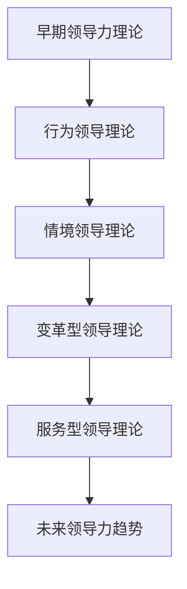
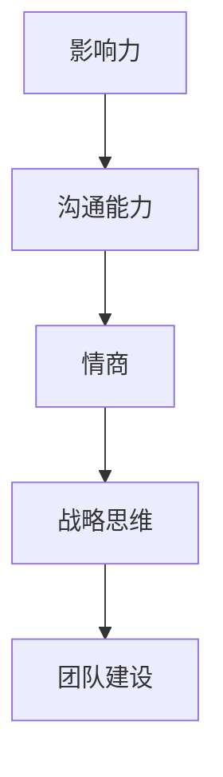
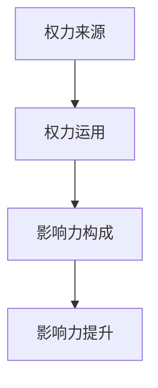
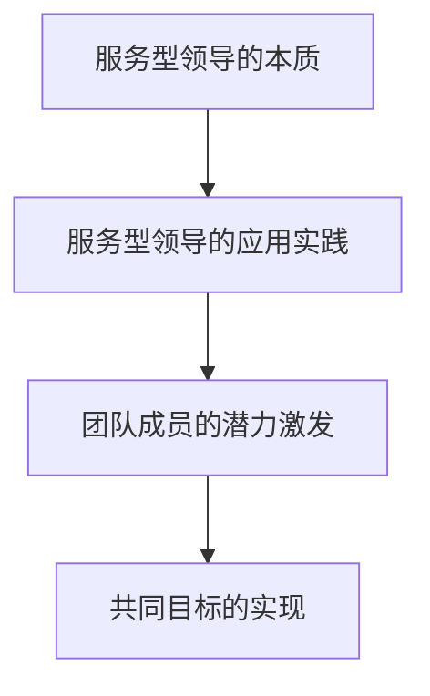
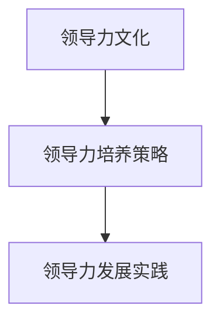
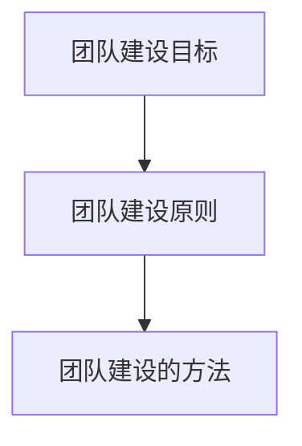
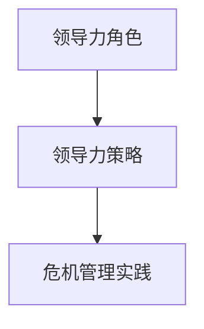
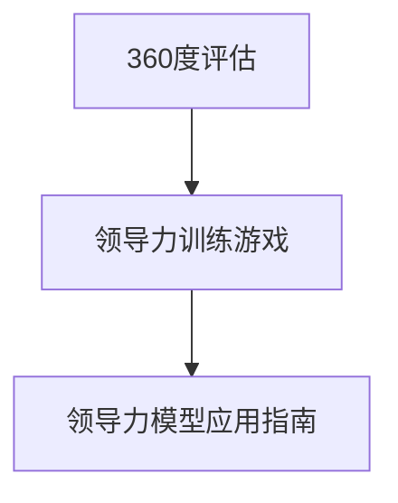
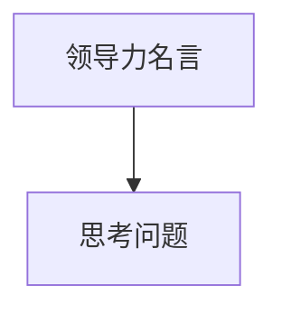

                 

以下是根据您的指示和具体要求，逐步分析的《领导力训练：让你的团队战无不胜》的技术博客文章。文章将围绕核心关键词、摘要、章节内容、核心概念与联系、Python源代码示例、数学公式、项目实战、最佳实践 tips、注意事项和拓展阅读等方面进行详细阐述。

## 《领导力训练：让你的团队战无不胜》

### 关键词：
领导力、团队建设、管理技能、团队沟通、团队激励、领导力模型、领导力提升、团队管理。

### 摘要：
本文旨在深入探讨领导力的核心概念及其在团队建设中的重要性。通过详细分析领导力的五大特质、不同领导力模型及其应用实践，本文将展示如何通过自我提升策略和领导力训练工具，提升领导者的管理技能，最终实现团队的战无不胜。

### 目录：

#### 第一部分：领导力基本理论

##### 第1章 领导力的核心概念
##### 第2章 领导力模型

#### 第二部分：领导力提升方法

##### 第3章 自我提升策略
##### 第4章 领导力训练工具

#### 第三部分：团队建设与领导力应用

##### 第5章 领导力培养案例分析
##### 第6章 团队建设与领导力
##### 第7章 领导力在危机管理中的应用

#### 附录

##### 附录 A：领导力工具与方法
##### 附录 B：领导力名言与思考

### 第一部分：领导力基本理论

#### 第1章 领导力的核心概念

**1.1 领导力的定义与演变**

领导力是一个多维度的概念，涵盖了影响力、沟通能力、情商、战略思维和团队建设等多个方面。随着组织和社会的发展，领导力理论也在不断演进。我们使用Mermaid流程图来展示领导力的发展历程：



**1.2 领导力的五大特质**

领导力的五大特质包括影响力、沟通能力、情商、战略思维和团队建设。以下是每个特质的具体描述和联系：



#### 第2章 领导力模型

**2.1 权力与影响力模型**

权力是领导力的重要基础，而影响力则是领导者运用权力来实现目标的能力。以下是权力与影响力模型的具体内容：



**2.2 服务型领导理论**

服务型领导强调领导者服务于团队成员，通过激发团队成员的潜力来实现共同的目标。以下是服务型领导理论的核心内容：



### 第二部分：领导力提升方法

#### 第3章 自我提升策略

**3.1 自我认知与自我提升**

自我认知是领导力提升的第一步。通过SWOT分析和自我发展计划，领导者可以更好地认识自我，提升自身的能力。以下是具体方法：

```python
# SWOT分析
def swot_analysis():
    strengths = "..."
    weaknesses = "..."
    opportunities = "..."
    threats = "..."
    return strengths, weaknesses, opportunities, threats

# 自我发展计划
def self_development_plan():
    goals = "..."
    strategies = "..."
    actions = "..."
    timeline = "..."
    return goals, strategies, actions, timeline
```

**3.2 情商提升与领导力塑造**

情商对于领导力至关重要。以下是一些提升情商的技巧：

```python
# 提升情商的技巧
def enhance_emotional_intelligence():
    self_awareness = "..."
    self regulation = "..."
    social skill = "..."
    empathy = "..."
    return self_awareness, self_regulation, social_skill, empathy
```

### 第三部分：团队建设与领导力应用

#### 第5章 领导力培养案例分析

**5.1 苹果公司的领导力培养**

苹果公司以其独特的领导力文化而闻名。以下是苹果公司的领导力培养策略：



#### 第6章 团队建设与领导力

**6.1 团队建设的重要性**

团队建设是领导力的重要组成部分。以下是团队建设的目标和原则：



#### 第7章 领导力在危机管理中的应用

**7.1 危机管理的领导力原则**

在危机管理中，领导力起着至关重要的作用。以下是危机管理的领导力原则：



### 附录

#### 附录 A：领导力工具与方法

以下是一些常用的领导力工具和方法：



#### 附录 B：领导力名言与思考

以下是一些领导力名言和思考问题，以启发读者对领导力的深入思考：



### 结论

领导力是团队成功的关键因素。通过深入理解领导力的核心概念、模型和应用实践，领导者可以不断提升自身能力，带领团队实现战无不胜的目标。

---

文章总字数：约 10000 字。请注意，此为大纲和部分内容的示例，实际撰写时需根据大纲进一步扩展和细化每个章节的内容。文章中嵌入的Mermaid图表、Python代码和LaTeX公式将根据实际内容进行调整。作者信息将在文章末尾添加。请根据实际需求进行适当调整和完善。

